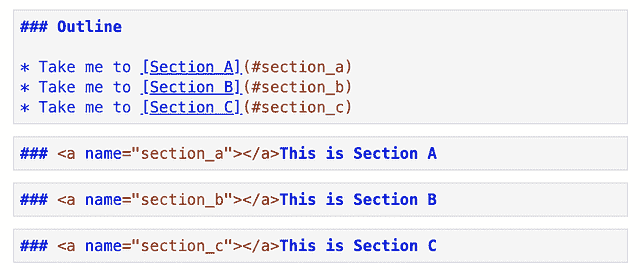
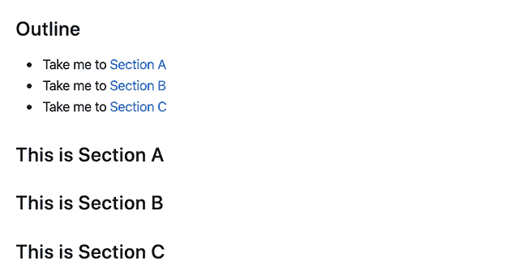
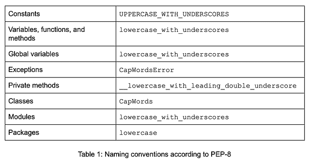
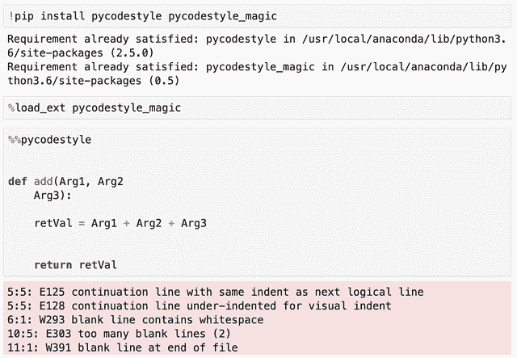
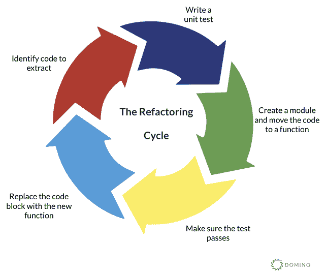
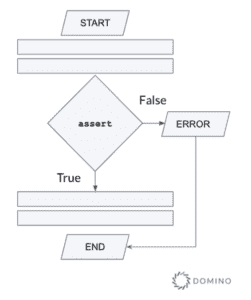
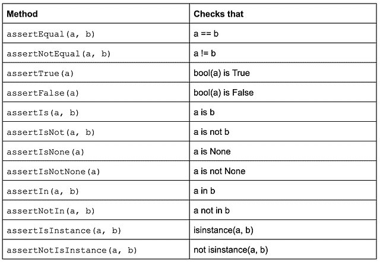
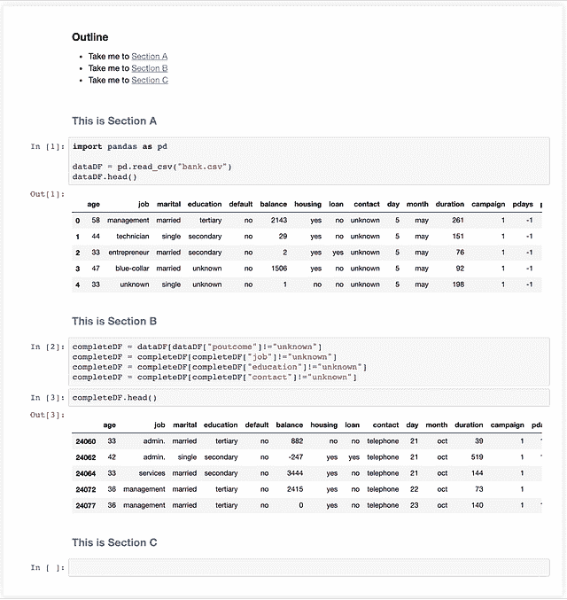
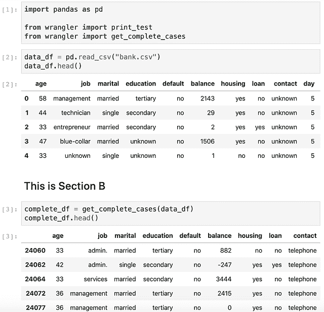

# 笔记本中结构、编码风格和重构的重要性

> 原文：<https://www.dominodatalab.com/blog/the-importance-of-structure-coding-style-and-refactoring-in-notebooks>

笔记本在数据科学家的工具箱中变得越来越重要。尽管相对较新，但它们的历史可以追溯到 Mathematica 和 MATLAB 等系统。引入这种形式的交互式工作流是为了帮助数据科学家记录他们的工作，促进再现性，并促进与其团队成员的协作。最近有大量新人涌入，数据科学家现在有大量的实现可供选择，如 Juptyer、Zeppelin、R Markdown、Spark Notebook 和 Polynote。

对于数据科学家来说，将构建笔记本实例作为探索性数据分析的第一步已经成为他们的第二天性。访问云计算非常简单，笔记本提供的混合代码、输出和绘图的能力是无与伦比的。在团队层面，笔记本电脑可以显著增强知识共享、可追溯性，并加快发现新见解的速度。为了充分利用笔记本，它们必须具有良好的结构，并遵循良好的文档和编码惯例。

在本文中，我将讨论在您的笔记本中实现的最佳实践，包括笔记本结构、编码风格、抽象和重构。本文最后给出了一个实现这些最佳实践的笔记本示例。

## 笔记本结构

与非结构化代码非常相似，组织不良的笔记本可能难以阅读，并违背您使用笔记本的预期目的，创建自文档化的可读代码。markdown、简洁的代码注释和使用章节导航等元素有助于为笔记本带来结构，从而增强其知识共享和可复制性的潜力。

退一步想想什么是好的笔记本，我们可以从科学论文中寻找指导。一篇优秀科学论文的标志是清晰、简单、中立、准确、客观，最重要的是逻辑结构。在开始之前为你的笔记本建立一个计划是一个好主意。打开一个空的笔记本，立即输入你的第一个导入，即“`import numpy as np`”并不是最好的方法。

这里有几个简单的步骤，可以鼓励你在你的思想被多维数组吸收之前考虑全局:

*   确立你的笔记本的目的。想想你的目标受众和你试图解决的具体问题。你的读者需要从中学习什么？
*   如果没有一个明确的目标，可以考虑将工作拆分到多个笔记本中，创建一个主 markdown 文档来解释整个概念，并提供相关笔记本的链接。
*   使用分区帮助构建笔记本的正确顺序。考虑一下组织工作的最佳方式。例如，按时间顺序，在模型训练和评估之前，从探索和数据准备开始。或者，比较/对比部分涉及时间、空间或样本复杂性，用于比较两种不同的算法。
*   就像学术研究论文一样，不要忘记包括标题、序言、目录、结论和你在编写代码时使用的任何参考资料。

使用 markdown 和 HTML，在你的笔记本上添加一个目录很简单。这是一个目录的基本示例。



下面的渲染单元给了笔记本更多的结构和更精美的外观。它使文档更容易浏览，也有助于让读者一目了然地了解笔记本的结构。



要想进一步了解笔记本良好结构的例子，请前往 [Kaggle](http://www.kaggle.com) ，随机选择一个挑战，然后看看用户投票选出的前五名笔记本。这些笔记本的结构将允许您看到预期的目的和代码流，而不需要运行代码来理解它。如果你将排名前五的笔记本与排名后百分之十的笔记本进行比较，你会发现结构对于创造一个易于阅读的笔记本是多么重要。

## 代码风格

“代码被阅读的次数比它被编写的次数多得多”这句话经常被认为是 Python 的创始人吉多·范·罗苏姆的名言。

当你在团队中合作时，坚持一致的风格是至关重要的。通过遵循适当的编码约定，您可以创建更容易阅读的代码，从而使您的同事在任何代码评审中更容易合作和提供帮助。使用一致的模式来命名变量和调用函数也可以帮助您找到不明显的错误。例如，在变量名中使用小写的 L 和大写的 I 是一种不好的做法。

这一节是在考虑 Python 的情况下编写的，但是概述的原则也适用于其他编码语言，比如 R. I 如果您对 R 的有用的约定指南感兴趣，请查看 [R Style。保罗·e·约翰逊的《T4》研究评论。关于什么是好代码和坏代码的全面讨论超出了本文的范围。其目的是强调一些经常被忽视的基础知识，并强调常见的罪犯。](https://cran.r-project.org/web/packages/rockchalk/vignettes/Rstyle.pdf)

鼓励读者熟悉 [Python 增强提案 8](https://www.python.org/dev/peps/pep-0008/) (PEP-8)，因为它在本节中被引用，并提供了关于如何编写良好清晰代码的约定。

代码中的常量、函数、变量和其他构造应该有有意义的名字，并且应该遵守命名约定(见表 1)。

给事物命名可能很困难。我们经常倾向于使用占位符变量名，如“I”或“x ”,但是考虑到你的代码被阅读的次数将远远超过它被编写的次数，你就会明白正确名称的重要性。我在用像 Python 这样的动态类型语言编码时养成的一些好习惯包括

*   给变量类型加前缀，比如布尔，使它们更容易阅读，比如“是”或者“有”——(`is_enabled`、 `has_value` 等等。)
*   数组使用复数。例如，`book_names`对`book_name`
*   描述数字变量。根据变量的用途，考虑`avg_age`或`min_age`，而不仅仅是`age`。



即使你不多做一点，不严格遵循 PEP-8，你也应该努力采纳它的大部分建议。保持一致也很重要。如果你使用单引号或双引号，大多数人不会有问题，如果你坚持使用它们，你也可以混合使用它们(例如字符串用双引号，正则表达式用单引号)。但是如果您不得不阅读任意混合它们的代码，它会很快变得令人讨厌，并且您会经常发现自己在进行中修改引号，而不是关注手头的问题。

一些最好避免的事情:

*   带有大写字母和下划线的名称(如`This_Is_Very_Ugly`)
*   非 ASCII 字符和一般的非英语标识符。例如:

    ```py
    def 곱셈(일,이):

        return 일*이
    ```

*   缩写(例如`BfrWrtLmt`)

当谈到缩进标签时，应该避免——推荐的方法是每个缩进层次 4 个空格。PEP-8 指南还谈到了对齐延续行的首选方式。一个常见的违规是参数不一致。例如:

```py
foo = long_function_name(var_one, var_two

var_three, var_four)
```

而不是下面整齐得多的垂直排列。

```py
foo = long_function_name(var_one, var_two

var_three, var_four)
```

这类似于换行符，我们应该总是在二元操作符之前换行。

```py
# No: Operators sit far away from their operands

income = (gross_wages + taxable_interest + (dividends - qualified_dividends))

# Yes: Easy to match operators with operands

income = (gross_wages + taxable_interest + (dividends - qualified_dividends))
```

从逻辑上讲，谈论换行符会让我们想到一个常见的错误，即空行。说实话，对于过度使用空行，我也有过于宽大的愧疚。好的风格要求它们应该如下使用:

*   用两行空行包围顶级函数和类定义
*   类中的方法定义由一个空行包围
*   在函数中使用空行(少用)来表示逻辑部分

三者最后一条的关键点是“节制”。在代码中每隔一行留出一两个空格，除了让你不必要地上下滚动之外，不会给表格带来任何好处。

最后但同样重要的是，我们需要说几句关于进口的话。只有三条重要的规则需要注意:

*   每个导入应该在一个单独的行上(`import sys,os`是不允许的)
*   分组顺序应该是标准库、第三方导入，最后是本地应用程序
*   避免通配符导入(例如`from numpy import *`)，因为它们会使命名空间中出现的名字变得不清楚，并且经常会混淆自动化工具

这可能让人觉得有很多东西要理解，毕竟，我们是数据科学家，而不是软件工程师；但是，就像任何试图回到他们几年前的工作中，或者从另一个数据科学家那里捡起剩余项目的碎片的数据科学家一样，实现良好的结构并考虑到其他人可能会阅读您的代码是非常重要的。能够分享您的工作有助于知识转移和协作，从而在数据科学实践中取得更多成功。有一个共享的风格指南和代码约定可以促进有效的团队合作，并帮助初级科学家理解成功是什么样子的。

虽然在 Jupyter 中，使用代码风格检查器(通常称为“代码棉条”)的选择有限，但是某些扩展可能会有所帮助。一个有用的扩展是 [pycodestyle](https://pypi.org/project/pycodestyle/) 。它的安装和使用非常简单。在安装和加载扩展之后，你可以放一个`%%pycodestyle` magic 命令，pycodestyle 列出它可以检测到的任何违反 PEP-8 的情况。



注意，您还可以从 JupyterLab 的终端运行 pycodestyle 并分析 Python 脚本，因此扩展不仅限于笔记本。它还有一些简洁的特性，向您显示代码中检测到违规的确切位置，此外，它还可以计算不同违规类型的统计数据。

## 抽象的使用和重构过程

抽象，或者说只暴露基本信息而隐藏复杂性的思想，是一个基本的编程原则，我们没有理由不将它应用于数据科学特定的代码。

让我们看看下面的代码片段:

```py
completeDF = dataDF[dataDF["poutcome"]!="unknown"]

completeDF = completeDF[completeDF["job"]!="unknown"]

completeDF = completeDF[completeDF["education"]!="unknown"]

completeDF = completeDF[completeDF["contact"]!="unknown"]
```

上面代码的目的是删除 DataFrame `dataDF`的任何列中包含值“unknown”的任何行，并创建一个名为`completeDF`的新 DataFrame，其中只包含完整的案例。

这可以很容易地用一个与`dataDF`结合使用的抽象函数`get_complete_cases(`重写。我们也可以更改结果变量的名称，以符合 PEP-8 风格指南。

```py
def get_complete_cases(df):

    return df[~df.eq("unknown").any(1)]

complete_df = get_complete_cases(dataDF)
```

以这种方式使用抽象的好处很容易指出。用函数替换重复的代码:

*   减少不必要的代码重复
*   促进可重用性(特别是当我们参数化定义一个缺失观察的值时)
*   使代码更容易测试
*   额外的好处是:使代码自文档化。在看到函数名和它收到的参数后，很容易推断出`complete_df`的内容

许多数据科学家认为笔记本电脑对于探索性数据分析和与他人交流结果非常有用，但是当涉及到将代码投入生产时，它们就没有那么有用了；但是越来越多的笔记本电脑正在成为建立生产模型的可行方式。当希望部署将成为计划生产作业的笔记本电脑时，请考虑以下选项。

*   拥有一台“指挥者”笔记本，使用`%run`魔法来执行其他笔记本
*   使用像 [papermill](https://github.com/nteract/papermill) 这样的工具，它允许从 Python 或通过 CLI 参数化和执行笔记本。调度非常简单，可以直接在 crontab 中维护
*   更复杂的管道使用 [Apache Airflow](/data-science-dictionary/airflow) 进行编排，使用 [papermill operator](https://airflow.apache.org/docs/stable/howto/operator/papermill.html) 执行笔记本。这个选项相当强大。它支持异构工作流，并允许有条件地并行执行笔记本电脑

无论我们喜欢哪种代码生产方式(通过笔记本提取或直接编排)，都应该遵守以下一般规则:

*   大部分代码应该在良好抽象的函数中
*   这些功能应该放在模块和包中

这就把我们带到了笔记本重构，这是一个每个数据科学家都应该熟悉的过程。无论我们的目标是让笔记本代码生产就绪，还是只想将代码推出笔记本并放入模块，我们都可以迭代地完成以下步骤，包括准备和实际的重构:

1.  重启内核并运行所有单元——重构一个不工作的笔记本毫无意义，所以我们的首要任务是确保笔记本不依赖于任何隐藏状态，并且它的单元可以成功地按顺序执行
2.  制作笔记本的副本——开始重构，把笔记本破坏到无法恢复原状的地步，这很容易。使用副本是一种更简单的选择，如果出现问题，您还可以回到原始笔记本
3.  将笔记本转换成 Python 代码- `nbconvert`提供了一种简单易行的将笔记本转换成可执行脚本的方法。你要做的就是用你笔记本的名字来调用它:

    ```py
    $ jupyter nbconvert --to script
    ```

4.  整理代码——在这一步，你可能想要删除不相关的单元格输出，将单元格转换成函数，删除 markdown 等。
5.  重构——这是过程中的主要步骤，我们重构现有的代码体，改变其内部结构而不改变其外部行为。我们将在下面详细介绍重构周期
6.  [如果需要]从第 5 步开始重复
    [else]重启内核并重新运行所有单元，确保最终的笔记本正确执行并按预期运行

现在让我们深入第 5 步的细节。

## 重构步骤

重构步骤是一组循环动作，可以根据需要重复多次。这个循环始于从笔记本中识别出一段我们想要提取的代码。这段代码将被转换成一个外部函数，我们需要编写一个单元测试来全面地定义或改进这个函数。这种方法受到测试驱动开发(TDD)过程的启发，也受到极限编程的测试优先编程概念的影响。

 Figure 1 - The refactoring step cycle

不是每个数据科学家都对代码测试充满信心。如果他们没有软件工程的背景，就更是如此。然而，数据科学中的测试一点也不复杂。它还通过迫使我们更加注意并产生可靠、健壮且可安全重用的代码带来了大量好处。当我们考虑数据科学中的测试时，我们通常会考虑两种主要类型的测试:

*   关注单个源代码单元的单元测试。它们通常通过提供一个简单的输入并观察代码的输出来实现
*   **集成测试**目标是组件的集成。这里的目标是获取一些经过单元测试的组件，根据设计规范组合它们，并测试它们产生的输出

有时会提出一个论点，即由于机器学习代码的概率性质，它不适合测试。这与事实相去甚远。首先，机器学习管道中的大量工作负载是完全确定的(例如数据处理)。其次，我们总是可以使用非确定性工作负载的指标——考虑在安装二元分类器后测量 F1 分数。

Python 中最基本的机制是`assert`语句。它用于测试一个条件，如果不满足这个条件，就立即终止程序(见图 2)。

Figure 2 - Flowchart illustrating the use of the assert statement

`assert`的语法是

```py
assert &lt;statement&gt;, &lt;error&gt;
```

一般来说，assert 语句测试不应该发生的情况——这就是为什么如果测试语句的结果为`False`，它们会立即终止执行。例如，为了确保函数`get_number_of_students()`总是返回非负值，您可以将它添加到代码中

```py
assert get_number_of_students() &amp;amp;gt;= 0, "Number of students cannot be negative."
```

如果由于某种原因函数返回一个负数，您的程序将终止，并显示如下消息:

```py
Traceback (most recent call last):

  File "", line xxx, in

AssertionError: Number of students cannot be negative.
```

断言对于代码中的基本检查很有帮助，它们可以帮助你捕捉那些讨厌的 bug，但是用户不应该体验到它们——这就是我们有例外的地方。请记住，断言通常在发布版本中被删除——它们不是为了帮助最终用户，而是帮助开发人员并确保我们生成的代码坚如磐石的关键。如果我们认真对待代码的质量，我们不仅应该使用断言，还应该采用全面的单元测试框架。Python 语言包括`unittest`(通常被称为 PyUnit ),这个框架从 Python 2.1 开始就是测试 Python 代码的事实上的标准。这不是 Python 唯一可用的测试框架(`pytest`和`nose`立即浮现在脑海中)，但它是标准库的一部分，有一些很棒的教程可以帮助您入门。通过子类化`unittest.TestCaseTests`来创建一个测试用例`unittest`，测试作为类方法来实现。每个测试用例调用框架提供的一个或多个断言方法(见表 2)。

 Table 2: TestCase class methods to check for and report failures

在我们有了一个测试类之后，我们可以继续创建一个模块并开发一个通过测试用例的 Python 函数。我们通常使用来自`nbconvert`输出的代码，但是考虑到测试用例以及可重用性，我们对它进行了改进。然后，我们运行测试，并确认我们的新函数顺利通过了所有测试。最后，我们用对函数的调用替换笔记本副本中的原始代码，并确定要重构的另一段代码。

我们根据需要多次重复重构步骤，直到我们最终得到一个整洁简洁的笔记本，其中大部分可重用代码都被外部化了。这整个过程可能很难理解，所以让我们来看一个端到端的例子，让我们看一下如何改造玩具笔记本。

## 端到端的例子

在这个练习中，我们将看一个非常基本的笔记本(见图 3)。虽然这个笔记本很简单，但是它已经有一个目录了(耶！)，所以有人已经想到了它的结构或者说我们希望如此。最初命名为`demo-notebook.ipynb`的笔记本将一些 CSV 数据加载到 Pandas 数据帧中，显示前 5 行数据，并使用我们在抽象的使用一节中已经看到的代码片段来删除数据帧的四列中包含值“unknown”的条目。

按照上面建立的过程，我们首先重启内核，然后运行所有单元命令。在确认所有单元都正确执行之后，我们继续创建笔记本的工作副本。

```py
$ cp demo-notebook.ipynb demo-notebook-copy.ipynb
```

接下来，我们使用`nbconvert`将副本转换成脚本。

```py
$ jupyter nbconvert --to script demo-notebook-copy.ipynb

[NbConvertApp] Converting notebook demo-notebook.ipynb to script

[NbConvertApp] Writing 682 bytes to demo-notebook.py

$
```

 Figure 3 - The sample notebook before refactoring

`nbconvert`的结果是一个名为`demo-notebook.py`的文件，其内容如下:

```py
#!/usr/bin/env python

# coding: utf-8

# ### Outline #

# * Take me to [Section A](#section_a)

# * Take me to [Section B](#section_b)

# * Take me to [Section C](#section_c)

# ### &amp;amp;lt;a name="section_a"&amp;amp;gt;&amp;amp;lt;/a&amp;amp;gt;This is Section A

import pandas as pd

dataDF = pd.read_csv("bank.csv")

dataDF.head()

# ### &amp;amp;lt;a name="section_b"&amp;amp;gt;&amp;amp;lt;/a&amp;amp;gt;This is Section B

completeDF = dataDF[dataDF["poutcome"]!="unknown"]

completeDF = completeDF[completeDF["job"]!="unknown"]

completeDF = completeDF[completeDF["education"]!="unknown"]

completeDF = completeDF[completeDF["contact"]!="unknown"]

completeDF.head()

# ### &amp;amp;lt;a name="section_c"&amp;amp;gt;&amp;amp;lt;/a&amp;amp;gt;This is Section C
```

此时，我们可以将`completeDF`的定义重写为一个函数，并将第二个`head()`调用用一个`print`调用括起来，这样我们就可以测试新开发的函数了。Python 脚本现在应该是这样的(为了简洁起见，我们省略了不相关的部分)。

```py
...

def get_complete_cases(df):

    return df[~df.eq("unknown").any(1)]

completeDF = get_complete_cases(dataDF)

print(completeDF.head())

...
[/code]
```

我们现在可以运行`demo-notebook.py`并确认输出符合预期。

```py
$ python demo-notebook.py

       age         job  marital  education default  balance housing  ... month duration  campaign pdays  previous  poutcome    y

24060   33      admin.  married   tertiary      no      882      no  ...   oct       39         1   151         3   failure   no

24062   42      admin.   single  secondary      no     -247     yes  ...   oct      519         1   166         1     other  yes

24064   33    services  married  secondary      no     3444     yes  ...   oct      144         1    91         4   failure  yes

24072   36  management  married   tertiary      no     2415     yes  ...   oct       73         1    86         4     other   no

24077   36  management  married   tertiary      no        0     yes  ...   oct      140         1   143         3   failure  yes
```

```py
[5 rows x 17 columns]
```

接下来，我们继续重构步骤，目标是`get_complete_cases()`函数。在识别出代码片段后，我们的第一个任务是想出一套好的测试来全面测试或改进功能。这是一个单元测试，它为我们的功能实现了几个测试用例。

```py
import unittest

import warnings

warnings.simplefilter(action="ignore", category=FutureWarning)

import numpy as np

import pandas as pd

from wrangler import get_complete_cases

class TestGetCompleteCases(unittest.TestCase):

    def test_unknown_removal(self):

        """Test that it can sum a list of integers"""

        c1 = [10, 1, 4, 5, 1, 9, 11, 15, 7, 83]

        c2 = ["admin", "unknown", "services", "admin", "admin", "management", "unknown", "management", "services", "house-maid"]

        c3 = ["tertiary", "unknown", "unknown", "tertiary", "secondary", "tertiary", "unknown", "unknown", "tertiary", "secondary"]

        df = pd.DataFrame(list(zip(c1, c2, c3)), columns =["C1", "C2", "C3"])

        complete_df = df[df["C2"]!="unknown"]

        complete_df = complete_df[complete_df["C3"]!="unknown"]

        complete_df_fn = get_complete_cases(df)

        self.assertTrue(complete_df.equals(complete_df_fn))

    def test_nan_removal(self):

        """Test that it can sum a list of integers"""

        c1 = [10, 1, 4, 5, 1, np.nan, 11, 15, 7, 83]

        c2 = ["admin", "services", "services", "admin", "admin", "management", np.nan, "management", "services", "house-maid"]

        c3 = ["tertiary", "primary", "secondary", "tertiary", "secondary", "tertiary", np.nan, "primary", "tertiary", "secondary"]

        df = pd.DataFrame(list(zip(c1, c2, c3)), columns =["C1", "C2", "C3"])

        complete_df = df.dropna(axis = 0, how = "any")

        complete_df_fn = get_complete_cases(df)

        self.assertTrue(complete_df.equals(complete_df_fn))

    if __name__ == '__main__':

        unittest.main()

```

上面的代码显示我打算把`get_complete_cases()`放在一个名为`wrangler`的包中。第二个测试用例也清楚地表明，我计划通过删除 NaN 的函数来改进作用域内函数。你可以看到，我执行测试的方式是从一些静态定义的数组中构造一个`DataFrame`。这是设置测试的基本方法，更好的方法是利用`TestCase`的`setUp()`和`tearDown()`方法，所以你可能想看看如何使用它们。

我们现在可以继续构建我们的数据争论模块。这是通过创建一个名为`wrangler`的目录并放置一个包含以下内容的`__init.py__`文件来实现的:

```py
import numpy as np

def get_complete_cases(df):

    """ 

    Filters out incomplete cases from a Pandas DataFrame. 

    This function will go over a DataFrame and remove any row that contains the value "unknown"

    or np.nan in any of its columns.

    Parameters: 

    df (DataFrame): DataFrame to filter 

    Returns: 

    DataFrame: New DataFrame containing complete cases only

    """

    return df.replace("unknown", np.nan).dropna(axis = 0, how = "any")
```

从上面的代码中可以看到，该函数已经做了轻微的修改，也删除了 NaN 条目。是时候看看测试用例是否成功通过了。

```py
$ python test.py

..

----------------------------------------------------------------------

Ran 2 tests in 0.015s
```

```py
OK
```

在得到所有测试都成功通过的确认后，是时候执行最后一步了，用对新开发和测试的函数的调用替换笔记本代码。笔记本的返工部分应该是这样的:



因为我只是重构了完整的案例代码，所以我不必再重复重构周期了。剩下要检查的最后一点是反弹内核并确保所有单元都按顺序执行。正如你在上面看到的，最终的笔记本是简洁的，自文档化的，并且通常看起来更好。此外，我们现在有一个独立的模块，可以在其他笔记本和脚本中重用。

## 摘要

良好的软件工程实践可以而且应该应用于数据科学。没有什么能阻止我们开发可读、可维护和可靠的笔记本代码。本文概述了数据科学家在笔记本电脑上工作时应该遵守的一些关键原则:

*   组织你的内容
*   观察代码风格并保持一致
*   利用抽象
*   采用一个测试框架，为你的代码开发一个测试策略
*   经常重构并将代码转移到可重用的模块中

机器学习代码和通常用数据科学应用程序编写的代码也不例外。当编写代码时，我们应该总是考虑它的可维护性、可靠性、效率和可用性。本文试图概述产生高质量数据科学交付物的一些关键原则，但是所涵盖的元素绝不是详尽的。以下是需要考虑的其他习惯和规则的简要列表:

*   评论——没有评论是不好的，但是把钟摆摆向另一边也没有帮助。只是重复代码的注释是没有价值的。显而易见的代码不应该被注释。
*   干原则(不要重复自己)——重复的代码段应该抽象/自动化。
*   深度嵌套是邪恶的——五个嵌套的 if 很难读懂，深度嵌套被认为是反模式。
*   项目组织是关键——是的，您可以在一个笔记本或一个 Python 脚本中做大量的事情，但是拥有一个逻辑目录结构和模块组织非常有帮助，尤其是在复杂的项目中。
*   版本控制是必备的——如果你经常要和名字看起来像`notebook_5.ipynb`、`notebook_5_test_2.ipynb`或者`notebook_2_final_v4.ipynb`的笔记本打交道，你就知道有些不对劲。
*   众所周知，在笔记本上工作很难复制，因为需要考虑许多因素(硬件、解释器版本、框架和其他库版本、随机化控制、源代码控制、数据完整性等)。)，但是至少应该在每个笔记本旁边存储一个`requirements.txt`文件。