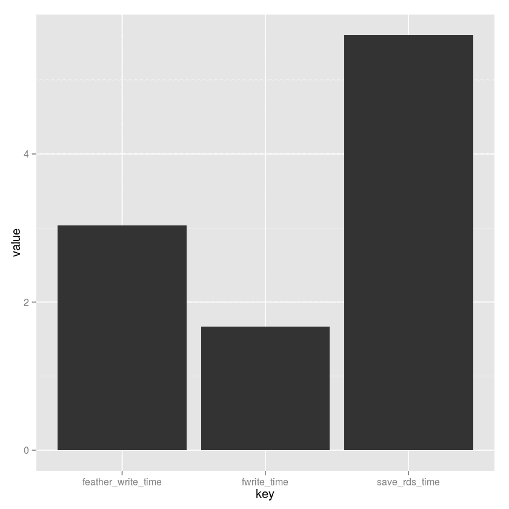

# 剩余数据 I/O 竞争

> 原文：<https://www.dominodatalab.com/blog/the-r-data-i-o-shootout>

我们让新来的 R 数据 I/O 包`feather`与流行的包`data.table`、`readr`以及来自 base R 的古老的`saveRDS` / `writeRDS`函数进行竞争。虽然`feather`表现不错，但它确实面临着激烈的竞争。

他们说好人没好报。很少有像向社区发布开源包这样高尚而美好的行为。您将辛苦获得的经验作为代码，打包，并发布它们以供(希望)使用和扩展。但是几乎可以肯定的是，你会被网络上的随机者(比如我自己)无情地批评，除了吹毛求疵，你似乎没有什么更好的事情可做。

因此，我们发现自己在这里:与 R 数据 I/O 包枪战！我们将比较`feather`、`data.table`、`readr`以及来自 base `R`的古老的`saveRDS` / `writeRDS`函数的读写性能。

## 大张旗鼓地宣布

3 月 29 日，数据科学世界最知名的两位人物，R 的 Hadley Wickham 和 Python 的 Wes McKinney 向世界发布了“羽毛”。从他们的公告来看:

### 什么是`feather`？

Feather 是一种快速、轻量且易于使用的二进制文件格式，用于存储数据帧。它有几个具体的设计目标:

*   轻量级、最小化的 API:尽可能简单地将数据帧推入和推出内存
*   与语言无关:无论是用 Python 还是 R 代码编写，Feather 文件都是一样的。其他语言也可以读写羽毛文件。
*   高读写性能。如果可能，羽化操作应该受本地磁盘性能的限制。

我们的其他竞争者:

### 什么是`data.table`？

是一个 R 包，它提供了一个增强版本的 data.frame，允许快速的数据操作。对于该基准测试，我们将通过`fread`函数加载所有数据(许多基准测试表明这是获取 CSV 文件的最快方式)。然后，我们将测试新的`fwrite`功能，这是最近添加的(尚未在 CRAN 上)，并提供多核高性能磁盘 IO。

### 什么是`readr`？

是一个 R 包，是[Hadleyverse]的一部分。它提供了一种快速友好的方式将表格数据读入 r。它提供了许多类似于`data.table`的`fread`的功能(它猜测列类型，`stringsAsFactors=FALSE`等等)...)

## 我们枪战的实验装置

我使用了下面的 [Kaggle 数据集](https://www.kaggle.com/datasets)，并对每个数据集做了如下处理:

1.  使用`fread`加载数据集，运行时间记为`read_time`。
2.  使用`fwrite`、`write_csv`、`write_feather`、`saveRDS`将它写成 CSV 格式，并捕获运行时间。
3.  将其加载为一个`feather`和`RDS`文件，并捕获运行时间。

我们将每个操作运行 10 次，并在比较中使用中间值。在实验中，为了比较苹果和苹果，压缩被关闭了。

*   贷款俱乐部数据来自
*   美国死亡人数从[https://www.kaggle.com/cdc/mortality](https://www.kaggle.com/cdc/mortality)
*   来自[https://www.kaggle.com/kaggle/college-scorecard](https://www.kaggle.com/kaggle/college-scorecard)的大学记分卡
*   美国消费金融投诉来自
    [https://www . ka ggle . com/ka ggle/US-Consumer-Finance-Complaints](https://www.kaggle.com/kaggle/us-consumer-finance-complaints)
*   来自[https://www . ka ggle . com/berkeleyearth/climate-change-earth-Surface-Temperature-Data](https://www.kaggle.com/berkeleyearth/climate-change-earth-surface-temperature-data)的地球表面温度数据
*   来自 https://www.kaggle.com/snap/amazon-fine-food-reviews 的亚马逊美食评论

### 五金器具

该基准测试在一个拥有 32 个内核和 60GB 内存的 Domino XX-Large 实例上运行。这映射到一个 AWS c3.8xlarge 实例。读写发生在 SSD 支持的 EBS 上。虽然我们使用的实例没有经过 *EBS 优化*(有保证的带宽和延迟)，但是每个操作的迭代次数减少了与 EBS 连接的一些差异。

## 结果呢

马上，我们就要和我们最喜欢的竞争者之一说再见了。从数据来看，很明显`readr`和它的`write_csv`调用是迄今为止最慢的。因此，尽管 Hadley 是一个超级酷的人，我也很尊敬他，但我们还是会称其为写出数据的基准中最弱的。我们将从所有未来的分析中排除`write_csv`。抱歉哈德利。我仍然认为你是最好的。

### 死亡记录数据集

`DeathRecords.csv`数据集由 260 万行 38 列组成，在磁盘上有 251 兆字节。数据集由 32 个数字列和 6 个字符列组成，NA 值为零。

对于写作，`fwrite`是 1.7 秒的性能赢家，比第二快的`feather`快大约 2 倍。

|   | 文件 | 键 | 价值 |
| --- | --- | --- | --- |
| one | DeathRecords.csv | 写时间 | One point six six six |
| Two | DeathRecords.csv | 保存时间 | 5.6035 |
| three | DeathRecords.csv | 羽毛 _ 写作 _ 时间 | Three point zero three five |

对于读取，与其他数据集类似，`feather`是目前最快的获取数据的方式。正如您将看到的，`feather`并不总是写出数据的最快方式，但它确实是检索数据的最快方式。

|   | 文件 | 键 | 价值 |
| --- | --- | --- | --- |
| one | DeathRecords.csv | 阅读时间 | Five point seven seven four |
| Two | DeathRecords.csv | 羽毛 _ 阅读 _ 时间 | Zero point five eight six |
| three | DeathRecords.csv | 阅读时间 | Three point four three |

### 全球陆地和温度数据集

`GlobalLandTemperaturesByCity.csv`数据集有 850 万行，7 列，在磁盘上有 508 兆字节。这个文件是数字和字符值的混合，大约有 70 万 NA 值。

对于写作来说，`data.table`的`fwrite`再次成为性能赢家，以大约 3 秒的速度进来，或者说是下一个包`feather`的两倍。

|   | 文件 | 键 | 价值 |
| --- | --- | --- | --- |
| one | GlobalLandTemperaturesByCity.csv | 写时间 | 3.2295 |
| Two | GlobalLandTemperaturesByCity.csv | 保存时间 | 11.1285 |
| three | GlobalLandTemperaturesByCity.csv | 羽毛 _ 写作 _ 时间 | Five point seven one |

同样，`feather`是检索数据的最快方法。这一次是非常大的因素。在这一点上没有问题:写文件将是其他包之间的一场混战，但是读是决定性的，`feather`赢了。寓意似乎很简单:如果您正在创建一个要多次读取的数据文件，`feather`提供了比`fread`和`readRDS`好得多的性能。

|   | 文件 | 键 | 价值 |
| --- | --- | --- | --- |
| one | GlobalLandTemperaturesByCity.csv | 阅读时间 | Nine point nine seven three |
| Two | GlobalLandTemperaturesByCity.csv | 羽毛 _ 阅读 _ 时间 | One point six three nine |
| three | GlobalLandTemperaturesByCity.csv | 阅读时间 | 8.7695 |

### 亚马逊美食评论数据集

`Reviews.csv`大约有 50 万行，10 列，在磁盘上有 287 兆字节。这个文件是数字和字符值的混合，几乎没有 NA 值。

在这个场景中，`data.table`的`fwrite`以大约 2 秒的成绩胜出。

有趣的是，所有的解决方案之间几乎没有区别:它们都在几毫秒内完成了书写。在早期测试中看到的差异在这里并不明显。我很想知道这是为什么。

|   | 文件 | 键 | 价值 |
| --- | --- | --- | --- |
| one | 点评. csv | 写时间 | One point nine nine three |
| Two | 点评. csv | 保存时间 | Two point five zero three |
| three | 点评. csv | 羽毛 _ 写作 _ 时间 | Two point two four nine |

### 大学记分卡数据集

最大的数据集`Scorecard.csv`大约有 125k 行，1，731 列，磁盘容量为 1.2GB。这个文件是数字和字符值的混合，有大约*2000 万* NA 值。在这个场景中，`fwrite`是以大约 10 秒的成绩胜出的。这里有相当多的差异，`feather`花费了将近两倍的时间。

|   | 文件 | 键 | 价值 |
| --- | --- | --- | --- |
| one | 记分卡. csv | 写时间 | 9.7835 |
| Two | 记分卡. csv | 保存时间 | 39.3755 |
| three | 记分卡. csv | 羽毛 _ 写作 _ 时间 | Sixteen point five two seven |

### 消费者投诉数据集

`consumer_complaints.csv`数据集大约有 50 万行，18 列，在磁盘上有 167 兆字节。这个文件几乎完全是具有单个数值的字符值，并且具有零 NA 值。

在这个写场景中，`fwrite`是以大约 1 秒的时间进入的性能赢家。这里有一些差异，`saveRDS`花费了将近三倍的时间。`feather`比`fwrite`大约慢 40%。如果这个文件需要频繁地被*读取*，并且增量如此之小，`feather`可能会作为磁盘格式提供下游优势。

|   | 文件 | 键 | 价值 |
| --- | --- | --- | --- |
| one | 消费者 _ 投诉. csv | 写时间 | 1.1455 |
| Two | 消费者 _ 投诉. csv | 保存时间 | Two point six eight |
| three | 消费者 _ 投诉. csv | 羽毛 _ 写作 _ 时间 | One point four one seven |

### 贷款数据

`loan.csv`数据集大约有 88 万行，74 列，磁盘上有 421 兆字节。这个文件是一个混合了字符值的文件，数字值的比例为 2 比 1，NA 值的比例非常高(接近 1500 万。)在这种情况下，`fwrite`是性能的赢家，在启用和未启用睿频加速的情况下都是 2.8 秒。与大学记分卡数据集不同，`saveRDS`在这里取得了更好的结果。似乎随着稀疏度的增加(高密度的`NA`值)`saveRDS`表现得更好。

|   | 文件 | 键 | 价值 |
| --- | --- | --- | --- |
| one | loan.csv | 写时间 | Two point nine zero five |
| Two | loan.csv | 保存时间 | Seven point nine nine eight |
| three | loan.csv | 羽毛 _ 写作 _ 时间 | Five point zero four three |

## 外卖

我从这个实验中得到了两大收获:

1.  就摄取数据集而言，真的很难打败`feather`。简直快得不可思议。比我能测试的任何东西都快。
2.  `feather`和`fwrite`都提供了出色的表格文件写入性能。作为一个规则，如果你有一个与我们的实验配置相似的盒子(大量的内核和内存，以及固态硬盘)，`fwrite`似乎很难被击败。不过，只要吃一两口那个文件，你可能会希望你已经`feather`看过了。

与所有基准一样，这个基准是有限的和不完整的。我们在一台具有一种配置的机器上进行实验。数据集稀疏性似乎也对结果有一些影响，我们没有明确测试稀疏性的差异。您的收获可能有所不同:您可能会在您的系统和数据集上看到完全不同的性能特征。

毫无疑问，我可以说的是`readr`写文件并不是特别快。如果你还在用`write.csv`或者类似的，那你就是在浪费很多电！

最后，需要注意其他一些封装特性:

*   这些工具中只有一个提供跨语言支持(将 CSV 放在一边)。如果你想轻松而*快速的*在 Python 和 R apps 之间共享复杂的数据，你真的只有一个选择:`feather`。
*   `saveRDS` / `readRDS`和`feather`使用二进制格式，而不是 CSV 文本格式。二进制有缺点:不能使用 head、tail、wc、grep 和 sed 等熟悉且历史悠久的命令行工具。二进制格式也是不透明的，随着包的开发和格式的改变，有可能出现破损和向后不兼容。

### 汇总统计数据

在下面的图表中，我们看到在一般情况下`feather`和`fwrite`的表现非常相似。在最坏的情况下，`fwrite`比`saveRDS`的平均速度要快。

|   | 键 | 部 | 意思是 | 最大 |
| --- | --- | --- | --- | --- |
| one | 羽毛 _ 写作 _ 时间 | One point four one seven | 5.6635 | Sixteen point five two seven |
| Two | 写时间 | 1.1455 | 3.45375 | 9.7835 |
| three | 保存时间 | Two point five zero three | 11.54808 | 39.3755 |

综上所述，`feather`和`fwrite`是最大的赢家。然而,`feather`确实有一个相当糟糕的写作“最坏情况”行为。如何分摊`feather`读取操作的节省是留给读者的练习。

## 最后的想法

基准可能会引起争议。希望这个不要超一般！代码和数据都可以在上面链接的 Domino 项目中找到。我欢迎改进实验的建议(和代码)。非常感谢 Matt Dowle 和 Arun Srinivasan 在`data.table`的出色工作，以及 Hadley Wickham 和 Wes McKinney 在`feather`的出色工作！在 2016 年，从分析环境中获取数据的世界取得了长足的进步，我们很幸运能够从中受益！