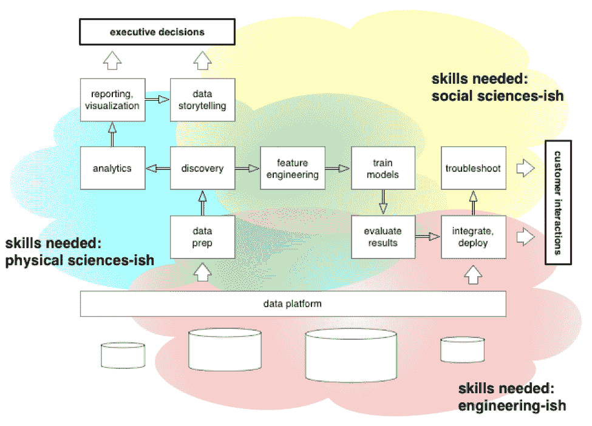

# 每个 Pacoid 的主题和会议，第 12 集

> 原文：<https://www.dominodatalab.com/blog/themes-and-conferences-per-pacoid-episode-12>

*[Paco Nathan](https://twitter.com/pacoid) 的最新月度文章涵盖了 Sci Foo 以及为什么数据科学领导者应该重新思考其数据科学团队的招聘和培训优先事项。*

## 介绍

欢迎回到我们每月一次的主题发现和会议总结。七月中旬，我参加了在 [Google X](https://x.company/) 举办的 [Sci Foo](https://en.wikipedia.org/wiki/Science_Foo_Camp) 。在这一集里，我将介绍 Sci Foo 的主题以及数据科学团队应该跟踪的重要信息。

首先也是最重要的一点:科学界为学术基础设施所做的努力与当前行业中数据治理的一些需求之间存在大量重叠。这两个社区都在各自的工具领域取得了长足的进步，尽管还需要更多的合作。第二:在 Sci Foo 上讨论的一些关键见解最终打动了我——在我听到它们在其他地方被介绍了几次之后。总的来说，组织都在努力雇佣足够的数据科学家。与此同时，许多组织还在为生产中的模型部署和相关的法规遵从性的“后期问题”而奋斗。出现了一系列的科技创业公司、开源框架、企业产品等。，旨在提供解决技能差距和公司文化脱节等问题的工具。是的，所以有几十万年的历史例子证明工具不能真正解决文化问题——只是说说而已。无论如何，有一种更简单的方式来看待这些问题，然后重新思考数据科学团队的招聘和培训优先事项。

但首先，让我们备份和讨论:这到底是什么 Foo 的东西？以前听说过吗？

## 什么是 Foo？

如果你从未参加过 Foo 活动，[看看 Scott Berkun 的这篇文章](https://scottberkun.com/2006/how-to-run-a-great-unconference-session/)。人们认为这是一次强烈的、意想不到的、改变人生的经历。参加过几个 Foo 营——甚至在 2016-17 年共同主持了 Ed Foo 系列——最肯定的是，一个 Foo 会让你神魂颠倒。

与其像大多数技术会议那样发布议程，为什么不让人们交流、讨论、提出主题和可能的会议？提议的会议在一个小时左右就被堵在了墙上。然后我们加入到闪电般的谈话、会议、食物、饮料、现场音乐、科学实验、长时间的讨论直到凌晨等等。

想象一下，身处一群精通量子物理、组织工程、考古学、鸟鸣语言学、气候变化、增值税牛肉、CRISPR、建造火星探测器等等的人中间。现在想象一下，他们中的一些人想要抽出一个小时来讨论“亚马逊正在摧毁城市生活吗？”由以挖掘古丝绸之路沿线城市为生的人领导，与研究网络拓扑或宏观经济学的人展开辩论。仅仅是做一只墙上的苍蝇就已经足够迷人了。顺便说一句，这是我今年最喜欢的会议主题——看看游牧民和城市建设者的历史模式，并考虑通过大型仓库及时交付的全球影响。

Foo 俱乐部夏令营的第一条规则是参与你感兴趣的话题。如果它根本不有趣，那么你就去另一个会话。如果你站起来走出去，没有人会生气。意外之喜接踵而至，结果，人们发现自己陷入了激烈辩论的话题，而这些话题与他们的专业领域毫不相关。然而，通常他们的专业知识的切线，相邻的性质提供了拼图的缺失部分。Foo Camp 的第二条规则是关于一种叫做“FrieNDA”的做法，在这种做法中，人们坦率地说话，其他人尊重这一点，而不需要(1)“哦，天哪，我必须在推特上直播这一惊人的见解”或(2)任何人都必须签署法律文件。

## 科幻 Foo 2019

Sci Foo 由[奥赖利媒体](https://www.oreilly.com/)、[谷歌](https://www.google.com/)和[数字科学](https://www.digital-science.com/)联合发起，其基本理念是召集大约 200 名世界顶尖科学家参加一个周末的非正式“露营”。当然，与会者“露宿”在斯坦福附近的豪华酒店，而声名狼藉的公交车穿梭于酒店和谷歌之间。与此同时，奥赖利为每个与会者印制了一本小型传记指南，看起来几乎就像科学家的交易卡。我们在门口收到了旅游指南的复印件，这让我们期待这次会议将会变得有趣——非常有趣。然后沿着通往 Google X 礼堂的长走廊，有一堆由著名科学家写的令人惊叹的书，我们将与他们近距离共度周末:交谈，吃饭，辩论，思考，喝酒，大笑，交流，规划我们如何合作前进，等等。量子物理学最新进展？检查。建造行星探测器的最新进展？检查。如何在桶里培养迷你大脑的最新消息？检查。机器学习研究中心在非洲迅速扩张？检查。

在去开会的路上，我听了一个关于[太阳能地球工程](http://www.geoengineering.ox.ac.uk/www.geoengineering.ox.ac.uk/what-is-geoengineering/what-is-geoengineering/)的精彩演讲，即地球化以应对气候变化。Nota bene:在我们后代的有生之年，我们所处的温度范围很可能会把萨克拉门托变成海滨房产。有一些非常奇怪和有趣的方法将气溶胶喷入平流层，以减轻全球变暖的影响。当我试图研究投射到 Google X 的一面大墙上的详细幻灯片时，前面的一些家伙不停地问一些破坏性的，但显然是见多识广的问题。最终我认出这个人是前加州州长杰里·布朗。想象一下，有这样的人出现的野营/聚会——简而言之，这几乎就是一个 Foo 营地。

关于[组织工程](https://www.nibib.nih.gov/science-education/science-topics/tissue-engineering-and-regenerative-medicine)的会议让我感到极度恶心:与会者就通过癌症患者的活检提取脑细胞，然后在装有仪器的基底上培养大脑“类器官”进行了随意的讨论。他们的方法是用潜在的癌症药物轰击生活在大桶中的“类器官”迷你大脑，以测量药物的相对效果。之后，我悄悄地回到我的笔记本电脑上，做一些简单的编码来恢复。

最迷人的时刻:与 Wolfram Research 的联合创始人、笔记本电脑的发明者西奥多·格雷(早在 20 世纪 80 年代)聊天。他离开 Wolfram 已经有一段时间了，正在撰写精美的科学书籍，包括《元素:宇宙中每个已知原子的可视化解释》和《分子:万物的架构》。我们详细地讨论了 Jupyter 和他们使用笔记本电脑的广泛的私人研发，这太令人兴奋了！这就像发现了一个已经成功制造出低成本聚变反应堆的废弃苏联研究基地。

## 学术基础设施

也许是由于[数字科学](https://www.digital-science.com/)是活动的联合制作者之一，或者(更有可能)这是一种新兴趋势，许多与会者提到“sci comms”是他们最感兴趣的专业之一。换句话说，[科学传播](https://www.nature.com/articles/d41586-019-02387-w)。打听了一下，发现它是不同含义的编码:“我支持 STEM 教育，”或“我是一名科学作家/编辑”，或“我支持科学研究，这受到当前全球政治环境的困扰”，或者在其他情况下，它是收集研究数据集元数据(出处、关联数据、方法等)的简称。)然后建立机器学习模型，向科学家推荐方法和潜在合作者。我在这里提到这一点是因为当前的行业数据治理需求和科学界为学术基础设施所做的努力之间有很多重叠。要点是，利用关于研究数据集、项目、出版物等的元数据。，提供了一石二鸟的方法:为利用这些数据的人提供更好的建议，更好的数据治理，以及更好的研究资金投资回报率。这些担忧听起来耳熟吗？数据科学团队应该关注这里发生的事情，尤其是欧盟的重点。

例如，与 Carole Goble 会面对我来说是 Sci Foo 2019 的最大亮点之一。如果您的团队对数据治理、元数据处理、工作流管理、合规性、数据集推荐等方面的开源感兴趣，那么一定要看看 Carole 的一长串项目，包括: [FAIRdom](https://fair-dom.org/platform/) 、 [Apache Taverna](https://taverna.incubator.apache.org/) 、 [CWL](https://www.commonwl.org/) standard、 [PAV](https://pav-ontology.github.io/pav/) 出处和版本控制本体、公平数据指南、 [Galaxy](https://www.nature.com/articles/sdata201618) 等等，除了是 Jupyter 的早期机构采用者之一之外，还有所有这些。

科学研究界正在取得巨大进步，使得开源项目能够应对处理数据的重大挑战。据我所知，它们与行业数据科学团队一直在构建的类似开源项目没有太多交叉。我想帮助这两个社区搭建桥梁，并为共同的目标建立更多的合作。奇怪的是，在数据治理和法规遵从性游戏中，有时科学家比行业走得更远，特别是在法律不允许研究项目中的治理和法规遵从性是可选的情况下——这是有充分理由的。

## 有时一个奇怪的想法

多亏了 Sci Foo conversations，一个古怪的想法终于出现了。总的来说，组织都在努力雇佣足够的数据科学家。与此同时，许多组织也在努力解决机器学习模型在生产中部署后才会遇到的问题。事实证明，监管机构也倾向于应对在生产中部署的机器学习模型的微妙问题——换句话说，合规和其他法律问题——这反过来可能会让董事会成员夜不能寐。我看到一系列项目试图为人们的问题提供技术解决方案——换句话说，治标不治本。这是一个隐患，暴露了硅谷产品管理文化的问题，没有完全理解 MLOps 的现实问题。事实证明，也许有一种方法可以同时解决招聘和文化问题。虽然我要感谢克里斯·维金斯和其他专家多次耐心地向我描述了这个问题，但正是在 Sci Foo 上，这个难题的各个部分最终到位，描绘了一幅更大的画面。

考虑以下时间表:

*   2001 年——对冲基金大量雇用物理学研究生在华尔街工作(在一两篇突破性论文之后，加上市场微观结构的变化)。
*   2008 年- [金融危机](https://variety.com/2015/film/reviews/the-big-short-review-1201639770/):科学家逃离华尔街，加入数据科学团队，例如，支持广告、社交网络、游戏等等——我雇佣了不少人。
*   2018 - [关于数据治理的全球清算](https://blogs.wsj.com/cio/2018/03/19/%E2%80%8Bthe-morning-download-facebook-at-center-of-global-reckoning-on-data-governance/)，又名“哎呀！…我们又做到了。”

后一次火车事故是怎么发生的？如果数据科学领域已经成熟了十多年，成千上万的超级聪明的人涌入了备受追捧的数据科学职位，那么这些数据错误是如何集体发生的呢？这是因为科技业亿万富翁的贪婪和贪婪，或许还因为他们一心一意地想尽一切办法增加收入？大概如此。但我有预感，这不完全是问题所在。

将时钟滚动到 Sci Foo。我一直在密切关注 Pete Skomoroch 最近的演讲，关于机器学习背景下的产品管理如何成为一种不同的责任。概率性质改变了所需的风险和过程。我还仔细阅读了[克里斯·维金斯最近关于数据和伦理的演讲。然后我在 Sci Foo 上说了几句话，这让我想起了去年在](https://blog.dominodatalab.com/data-ethics-contesting-truth-and-rearranging-power/) [JupyterCon](https://conferences.oreilly.com/jupyter/jup-ny) 上的类似讨论。宾果，一个想法终于点击！

历史上，物理学和物理科学专业的研究生是数据科学团队的优秀候选人。物理系学生通常需要收集数据、清理数据、运行分析和可视化、构建模型、评估结果……而这只是在与他们的导师讨论科学之前所需的准备工作。冲洗，起泡，重复——大概每周一次。通常，这些学生必须掌握使用 Linux、Jupyter、Docker、Git、各种云服务(或其他高性能计算基础设施)、诸如 NumPy、SciPy、scikit-learn 等库的技能。举个例子:我最喜欢的一个关于使用 Git 的教程是 inside[Effective computing in Physics:Field Guide to Research with Python](http://shop.oreilly.com/product/0636920033424.do)，作者是 [Anthony Scopatz](https://www.ergs.sc.edu/people/scopatz.html) 和 [Kathryn Huff](http://katyhuff.github.io/) 。在许多情况下， [Jupyter](https://jupyter.org/) 尤为突出，我们在数据科学中使用的流行开源工具是由具有物理科学背景的人编写的，而不是 CS 学位。

这种对技能和工具的描述听起来熟悉吗？我接受的正式培训是计算机科学方面的，我可能会偏向于这方面的技能。即便如此，根据我的经验，一个拥有计算机科学学位的工程师可能至少需要几个月的额外培训，才能为数据科学团队做出贡献。工具和过程——更重要的是，思维方式——与典型的编程工作非常不同。另一方面，物理学家可能会在第一天就忙于新的数据科学工作，因为工具、流程和思维模式已经很熟悉了。

## 皮拉塔斯

在过去的几年里，硅谷的数据科学领导者已经接受了物理学家快速适应数据科学角色的概念，就像佳能一样。我估计，我多年来建立的数据科学团队中，至少有 50%是由具有物理科学背景的人组成的。这对于招聘那些了解工具和数据争论技术并熟悉构建机器学习模型的人来说非常好。与此同时，我看到来自社会科学背景的候选人在应聘备受青睐的数据科学职位时面临更多挑战。关于后一点的一些事情困扰着我，尽管我不能清楚地说出细节。

最近，我们(行业中的数据科学社区)已经承认，建立机器学习模型并不是在数据科学团队中工作的最大挑战。一旦模型部署到生产中，真正的乐趣就开始了。企业对安全性、隐私、伦理、血统、遵从性等等的关注，通常只有在模型部署之后才会显现出来。此外，我们看到这些问题如何出现在受监管的环境中，这些环境越来越多地成为用于数据分析基础设施的流行开源项目的目标用例:Spark、Jupyter、Kafka 等。数据治理，为了胜利！

另一个要点是:解决生产中模型的边缘情况——就监管者而言，这通常是道德和数据相遇的地方——需要比大多数数据科学团队更复杂的统计学。在产品经理会议上，试着轻松地谈论“校准的均衡赔率”或“因果推断”。这是清理房间的快捷方式。

套用克里斯·维金斯的话，数据科学中的伦理来自哲学和社会学的交叉……就哲学而言，Chris 将其描述为“作为服务的痛苦”( PITAaaS ),因为哲学家不断提醒我们生活并不简单。重复已知会让我们陷入麻烦的错误，会让我们陷入麻烦。将关于安全性的讨论放在一边，在生产中面对机器学习模型的公平和偏见问题所需的统计能力设置了相当高的标准。看看[斯坦福政策实验室](https://arxiv.org/pdf/1808.00023.pdf)、[谷歌](https://towardsdatascience.com/what-if-ai-model-understanding-were-easy-57ba21163d0e)、[微软](https://docs.microsoft.com/en-us/azure/machine-learning/studio-module-reference/evaluate-model)、[埃森哲](https://hbr.org/2018/10/auditing-algorithms-for-bias)等等是如何重申这一点的。

就在那时，我突然明白了。当然，我有点笨，尽管包括克里斯在内的专家已经耐心地向我解释了至少几次，但事实需要一段时间才能被理解。典型的自然科学研究人员和典型的社会科学研究人员的技能和思维模式之间的差异在这里提供了神奇的解码环。虽然前者倾向于熟悉数据争论工具、惊人的可视化和机器学习模型，但后者倾向于处理较小的数据集，尽管数据更加敏感，并且通常具有更加严格的合规性和道德要求。

社会科学研究——产生诸如[指导政府政策](https://www.congress.gov/bill/115th-congress/house-bill/4174)的结果——倾向于使用关于人们的机密数据:病史、家庭住址、家庭细节、性别、性行为、心理健康问题、警方记录、除了你的治疗师之外你可能不会告诉任何人的细节，等等。社会科学研究人员没有使用大数据工具和(值得发表的)机器学习应用程序，而是普遍面临数据使用授权，以维护严格的数据隐私要求，此外还有跟踪血统和其他数据治理细节的强烈需求。他们必须遵守各种[合规和道德标准](https://www.slideshare.net/chrishwiggins/history-and-ethics-of-data)，然后才能开始进行相关的科学研究(往往侧重于人类行为)，关心自己的行为如何影响参与研究的人类，等等。他们倾向于使用较少的机器学习，但更先进的统计实践，因为结果(政府政策等。)将意味着许多后果和潜在的争议，除非证据确凿。

作为数据科学领导者和技术公司产品经理的题外话:前面的任何一段是否类似于您当前使用机器学习处理客户问题的需求？是啊，我有预感这些要点听起来很熟悉。

我们——一个集体的“我们”代名词，在整个数据科学社区中——在第一个十年里忙于*人员配备*。我们(领导者)开始疯狂地雇佣足够多的人加入数据科学团队，以迅速实现公司目标。我们优先考虑那些之前有工具实践经验的人，而不是采取更昂贵和耗时的方式从冷启动开始培训新人，或者关注那些比工具更了解问题的人。

与此同时，我们把自己逼到了墙角。我们实践中的困难部分越来越多地集中在数据治理中的“所有事情”上:安全性、隐私、血统、公平/偏见、道德、合规性——此外，还有统计中用于排除边缘情况的*更深入的工作台。还有一个问题是要把客户理解为人，而不是像我们模拟星系团一样模拟数百万的客户。这些是高管们关心的 2018 年后的结果——自从*华尔街日报*称之为关于数据治理的“全球清算”以来。*

换句话说，虽然物理专业的学生(我们雇佣他们加入数据科学团队)可能已经能够让工具和模型以极具成本效益的方式进行后空翻，但社会科学专业的研究生(他们不那么经常被雇佣)已经理解了在行业中变得至关重要的问题和实践，特别是为了避免商业中的大风险。也就是说:数据科学是一项团队运动。从第一天起就跨学科了。多样性在数据科学中至关重要，通常是解决商业中复杂问题的竞争优势。雇佣物理科学研究人员来支持你的数据科学团队中了解这些工具的人。然后聘请社会科学研究人员补充团队；增加了解问题的员工和相关人员，即您的客户。

## 善用洞察力

这有什么关系？

首先，我们所接受的“数据驱动的业务”的概念已经越来越脱离业务的长期重要性。例如，业内关于隐私和效用的观念被扭曲了。事实证明，在生产中管理机器学习是一件工程无法解决的事情。即便如此，还是有不同的方式来看待这些问题，以及解决这些问题的好方法。

让我们从隐私和效用如何成为处理数据时永恒的矛盾开始。换句话说，如果您能够确定一个重要的、具有良好投资回报的业务用例，那么可能有一个解决数据隐私问题的方法。有时候，这句话的反义词会破坏最好的意图。在任何情况下，传统的智慧是识别数据集中代表个人身份信息 (PII)的字段，例如，客户的护照号码，然后“匿名化”这些字段。散列和加密方法已被接受，还有在共享数据前应用的取样和其他去识别方法。

然而，这种对隐私和安全的肤浅看法太过于亚里士多德式了，现在变成了只见树木不见森林的问题。如果你没有看到，最近发表的一篇研究论文——“[使用生成模型估计不完整数据集中重新识别的成功](https://www.nature.com/articles/s41467-019-10933-3)”作者 Luc Rocher，Julien M. Hendrickx，Yves-Alexandre de Montjoye；*Nature communication s*(2019-07-23)——表明，即使有许多所谓的“匿名化”数据集，机器学习模型也可以用来“重新识别”数据中描述的人。深入挖掘细节:“基于生成 copula 的方法可以准确估计特定人被正确重新识别的可能性，即使是在严重不完整的数据集中。”他们使用最大似然模型对人进行三角测量，“预测个体的独特性……错误发现率低”,以重新链接到 PII。笑点如下:“使用我们的模型，我们发现 99.98%的美国人可以在任何使用 15 个人口统计属性的数据集中被正确识别。”啊哦。

诚然，我在这篇文章中多次提到克里斯·维金斯，但你真的需要看看他最近的谈话。我们面临着与生产中的数据和机器学习相关的风险问题——危机。事实上，有些人接受过应对这类风险的训练。他们处理关于人的敏感数据，他们使用高级统计对边缘情况进行故障排除，他们应用有效的过程来合乎道德地使用数据，等等。这些人通常没有通过数据科学面试的筛选，因为他们不擅长在白板上编写 5000 行的 Java 程序。或者，他们犯了在与程序员的面试中提到模糊研究的大罪。或者什么的。

## “没有什么比恐惧更能传播”

曾几何时，大约在 2012 年左右，数据科学会议充斥着关于一个行业不顾一切地将惊人的海量数据加载到某种数据湖中，并应用各种奇怪的类似天体物理学的方法……以最终获利的讨论！事实证明，这并不是企业所需要的。将数亿人建模成数亿颗恒星是绝对错误的。奇怪的是，当你在俄罗斯巨魔军队面前泄露他们的银行账户数据时，这些天文机构不会发起集体诉讼或维权股东运动。

一个开明的(阅读:智力上积极进取的)数据科学领导者应该能够连接这里的虚线。想要为数据科学团队寻找更多的候选人吗？尤其是那些能在 ML 管道后期提供帮助的人？尤其是在你与监管机构发生纠纷的时候？然后根据克里斯的描述重新考虑你的招聘策略。

这些都是很棒的话。最好的话。但是，嘿，有没有更具体的例子呢？例如，社会科学研究与数据科学实践相关的商业问题在哪里交叉？我四处询问，这篇论文作为一个例子回来了:“[推进急诊科症状监测数据的使用，纽约市，2012-2016](https://journals.sagepub.com/doi/10.1177/0033354917711183) ”作者 Ramona Lall，Jasmine Abdelnabi，Stephanie Ngai 等人；公共卫生报告(2017-07-10)。这似乎是一个晦涩且无关痛痒的学术话题，除非你通读了摘要中的细节:

*   监视数据和生物恐怖主义问题-检查。
*   超级风暴桑迪期间的危机-检查。
*   旅行者中的埃博拉样病毒最近返回纽约-检查。
*   风暴期间建筑物倒塌，涉及急诊室-检查。
*   潜在的隔离违规-检查。
*   门诊病人作为流动载体-检查。

**关注数据科学家:**“嗯，这个很重要。这里有一个问题，它比我们今天的 scrum 会议更重要。对于这些数据，对于没有采取适当的应对措施，存在道德上的担忧……”

**漠不关心的数据科学家:**“那只有几百个数据点。建立一个有趣的模型真的不够。没什么大不了的。”

**令人沮丧的产品经理:**“业务用例不清晰，尤其是预期的投资回报率是多少？你有没有进行过任何 A/B 测试，或者写过一页纸来描述一个最小可行的产品？”

**关注数据科学家:**“僵尸启示录哪部分你没看懂！？!"

## 大局

事实上，让我们来画一张图。下图显示了由数据科学团队处理的项目的理想化工作流。对于组织的其他部门来说，有一些成果得到了支持，例如“执行决策”和“客户互动”，还有数据科学团队从组织获得的支持，我将这些支持统称为某种平台。需要什么样的技能，在拼图的哪个部分需要？

 Credit: Paco Nathan

好吧，如果这种思路激起了你的兴趣，有什么推荐的资源？最肯定的是来自 NYU 的数据科学社区时事通讯，作者是劳拉·诺兰和布拉德·斯坦格。Laura 之前是 T2 NYU 大学的教授，使用 JupyterHub 等在美国和加拿大研究数据科学教育。换句话说，在特定的环境下，什么行得通，什么行不通。

我强烈推荐的另一个资源是 Douglas Rushkoff 和 TeamHuman.fm 项目。虽然从表面上看，这些内容可能显得相对保守，偏向左翼主题，但道格是技术方面的专家；在互联网时代的早期，他就在考虑使用大数据、机器学习等的社会影响。拉什科夫帮助人们了解即将来临的灾难(灾难已经发生)以及如何减轻灾难(我们忽略了他)。关于他目前工作的一个引人入胜的例子，请参见“[最富有者的生存](https://medium.com/s/futurehuman/survival-of-the-richest-9ef6cddd0cc1)”(也在[的这个播客](https://nextbillionseconds.com/2019/06/26/episode-3-10-paranoid-billionaires-with-doug-rushkoff/))亿万富翁正在为世界末日做准备，道格被拉进来担任技术顾问。如果你对受访者进行抽样调查，越过一些显而易见的政治主题，你会发现一些令人惊叹的项目和实用建议，告诉你如何平衡技术创新与更脆弱的人类关切。

我在 TeamHuman.fm 上最喜欢的一个片段是与希瑟·杜威·哈格伯格(Heather Dewey-Hagborg)的一个“艺术项目”，涉及 DNA 分析、机器学习、虚拟现实等。并从纽约地铁里发现的 DNA 残留物中重建可能的面孔:口香糖、烟头、头发等。如果你还没有考虑将 DNA 作为法庭证据的数据伦理，这是一个你不应该错过的采访。

如果我们能得到一个由道格·拉什科夫、克里斯·维金斯、劳拉·诺兰和其他几十个我们在这一集里提到的人领导的 Foo 活动，那就太棒了。让我们尽量避免 2018 款 redux。

## 即将举行的活动

以下是一些与数据科学相关的[事件](https://derwen.ai/events#watchlist)，请记在您的日历上:

*   9 月 9 日至 12 日，圣何塞
*   [Strata NY](https://conferences.oreilly.com/strata/strata-ny) ，9 月 23-26 日，NYC–查看我们的小组“[数据科学与工程，真的必须这样吗](https://conferences.oreilly.com/strata/strata-ny/public/schedule/detail/76399)？”
*   [伦敦互联数据](https://conferences.oreilly.com/strata/strata-ny/public/schedule/detail/76399)，10 月 3 日至 4 日，伦敦
*   [AI UK](https://conferences.oreilly.com/artificial-intelligence/ai-eu) ，10 月 14 日-17 日，伦敦–查看“[执行简报:打开汽车包装](https://conferences.oreilly.com/artificial-intelligence/ai-eu/public/schedule/detail/79547)
*   [Tensorflow World](https://conferences.oreilly.com/tensorflow/tf-ca) ，10 月 28 日至 31 日，圣何塞