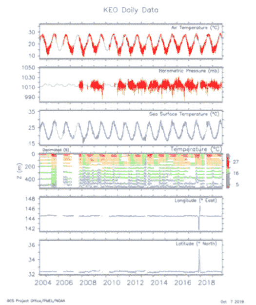

# 每个 Pacoid 的主题和会议，第 13 集

> 原文：<https://www.dominodatalab.com/blog/themes-and-conferences-per-pacoid-episode-13>

*Paco Nathan 的最新文章涵盖了美国国家海洋和大气管理局(NOAA)环境数据管理(EDM)研讨会的数据实践以及 AI 大会的更新。*

## 介绍

欢迎回到我们每月一次的主题发现和会议总结。这是一个繁忙的会议季节，一直持续到 12 月。让我们来看看最近的两次会议。我们将考察国家海洋和大气管理局(NOAA)的数据管理实践，这是我在他们的研讨会上了解到的，作为一个案例研究，说明当风险特别高时，如何处理数据收集、数据集管理、质量控制、分析和问责制。即使对于从事明显不同的垂直行业的组织来说，在如何处理数据实践方面，也有很多东西要向他们学习。我们还将关注圣何塞[奥莱利人工智能会议](https://conferences.oreilly.com/artificial-intelligence/ai-ca-2019)的更新，该会议展示了人工智能的最新突破，特别是关于突破我们在该领域的一些假设限制——以及更多关于 [Ray](https://ray.readthedocs.io/en/latest/) 的信息，该项目来自加州大学伯克利分校 RISELab，它正在超越基准，蚕食其他库的功能，并追踪 Apache Spark 进行致命一击。

## 数据科学与气候科学相遇

我最近参加的最有趣也是最重要的会议是在西雅图举行的 NOAA EDM 研讨会。环境数据管理(EDM)是在 [NOAA](https://noaa.gov) 召开的数据管理团队年会，今年由 Kim Valentine 和 Eugene Burger 主持。举个例子，位于西雅图的 NOAA 太平洋海洋环境实验室(PMEL)负责收集世界上 50%以上的海洋学研究数据。NOAA 通过其实验室和其他中心拥有世界气候科学研究的独特集中地，拥有紧密相邻领域的专家:极地冰，珊瑚礁健康，晴天洪水，海洋酸化，渔业计数，大气二氧化碳，海平面上升，洋流，等等。他们还管理着重要的基础设施，如 T4 海啸预警系统和国家飓风中心。

## 数据准确性、数据管理和数据科学英雄

除了科学家和工程师之外，NOAA 还包括准军事小组，他们直接飞行和航行到飓风中。在某些情况下，当数百万人的生命可能因自然灾害而受到威胁时，他们的工作至关重要。在其他情况下，他们的工作受到严格的政治审查，通常以数据的真实性为目标——例如，从公司利益与政府对非法捕鱼、能源和矿物开采、石油泄漏、濒危物种保护等的监管。碳税很可能迟早会浮出水面。因此，非常需要谨慎的数据管理。一些敌对政党甚至入侵部署在海上的传感器，以扰乱由此产生的数据分析，并可能扭曲政治结果。鉴于 21 世纪气候变化、物种灭绝、石油峰值等现实，NOAA 的这些人是我们这个时代数据科学的真正英雄。

考虑到这种情况，NOAA 的数据管理实践特别复杂，远远超过我遇到的任何行业数据科学团队。例如，有关于他们的数据管理工作的联邦法律。他们管理的一些数据集可以追溯到 200 多年前。因此，他们的总体数据政策必须以世纪为单位来定义。现在他们正在计划向云的大规模迁移，以及更广泛地采用 ML。

许多科技创业公司将面临这种专注于其数据团队的审查，这是值得怀疑的——即使如此，在最佳实践方面仍有许多值得学习的地方。

在 EDM 研讨会上，我做了一个关于 AI 在行业中的应用的主题演讲。除了主题演讲之外，还有:

*   [来自 OMB 白宫的 Rebecca Williams](https://twitter.com/internetrebecca)——她帮助制定了[美国联邦数据战略](https://strategy.data.gov/)和[第一年行动计划](https://strategy.data.gov/action-plan/#federal-data-strategy-action-plan)——查看她关于“联邦数据战略”主题演讲的[幻灯片](https://static.sched.com/hosted_files/noaaedm19/a2/Federal%20Data%20Policy%20Rebecca%20Williams.pdf)
*   美国国家海洋和大气管理局的 CDO 埃德·卡恩斯(Ed Kearns)在专家的领导下指导了那里的许多任务
*   数据管理总监 Monica Youngman 查看她的[幻灯片，了解“NOAA 的数据归档”主题演讲](https://static.sched.com/hosted_files/noaaedm19/65/Youngman_Plenary%20%281%29.pdf)
*   乔纳森·奥尼尔(Jonathan O'Neil)领导了对大规模云迁移的评估——查看他的幻灯片“NOAA 大数据项目:数字”主题演讲

九月的第一个星期，我们在台上表演，观众们开始窃窃私语，谈论“沙皮”和“阿拉巴马”。现在，我理解了他们日常工作的一些现实，这与许多企业环境并无太大出入。查看[研讨会网站](https://noaaedm19.sched.com/)，获取演示文稿中幻灯片的链接。

## 元数据挑战

NOAA 团队在元数据交换方面面临着巨大的挑战:他们传入的许多原始传感器遥测数据都是时序数据，这些数据本身使用的是 [netCDF TF](https://www.unidata.ucar.edu/software/netcdf/) 格式。元数据必须转换成 W3C 和 ISO 标准才能发布。数据必须转换成各种支持的下载格式，包括 JSON-LD。查看 NOAA [数据目录](https://data.noaa.gov/datasetsearch/)中的例子。总的来说，当你需要在机器学习教程、产品演示等中使用有趣的数据时，这些公共数据集提供了一个很好的资源。数据目录中的一个区域真正吸引了我的眼球:来自海洋气候站的[系泊数据](https://www.pmel.noaa.gov/ocs/data/disdel/)，这些数据是海上高度仪器化的浮标，带有几个时间对齐的信号。该网站提供可视化和下载特定信号和时间范围的工具:

我在 EDM 最喜欢的一次会议(正如你可能想象的那样)是关于[元数据工具](https://noaaedm19.sched.com/event/TH5M/metadata-tools-solutions-for-the-creation-management-discovery-of-metadata)。除了发布元数据来描述数据集之外，它还引入了两个有趣的实践，由[泰勒·克里斯滕森](https://noaaedm19.sched.com/event/TH5M/metadata-tools-solutions-for-the-creation-management-discovery-of-metadata)描述:

*   机器可读数据字典
*   创建、共享和收集[人行横道](https://www.sciencedirect.com/topics/computer-science/crosswalk)的实践

前者是 ML 在管理数据集的困难现实中可以提供帮助的地方。FWIW，我最近写了一篇[文章](https://medium.com/derwen/dataset-discovery-and-human-in-the-loop-ai-for-scholarly-infrastructure-e65d38cb0f8f)关于使用 ML 清理和链接元数据的相关工作:利用半监督学习来支持可重复的研究，以及推荐系统来帮助人们在政府机构中进入数据分析角色。后者提供了一个元数据模式和另一个元数据模式之间的映射。可以把它想象成一个组织用来描述另一个组织的数据集使用情况的“临时笔记”。自从 EDM 研讨会以来，我发现在我的一些日常工作中可以使用人行横道，来指导我使用以前不熟悉的数据集。

此外，参观西雅图 PMEL 的机械商店和机器人实验室也令人震惊。我最喜欢的项目是他们使用太阳能机器人船，从旧金山湾和其他港口出发，然后在整个世界的任何地方执行任务。saildrones 收集数据，并通过卫星上行链路与[铱星网络](https://www.iridium.com/)进行报告。NOAA 最近启动了有史以来最大的【saildrone 船队,用于北极冰层调查——一次总共 6 艘，尽管在北部海域航行是一项壮举。NOAA 最近还完成了有史以来第一次机器人环南极航行。多酷啊。！

我们举行了工作会议，讨论如何在边缘设备上用低功耗 ML 改造 saildrones，使用迁移学习和深度学习模型来检测和避免海冰的危险。研究人员的另一个问题是:“我们如何利用 ML 从船上视频中识别海洋哺乳动物？”可以说，一些数据读数已经被修改，如果有异常因素需要过滤。原来，海狮已经发现了这些自供能的帆船，在海上行驶，其大小和形状与一个小帆板相似，因此是更有见识的海狮在海上放松的绝佳场所。迄今为止，这是我最喜欢的异常检测用例。

关于使用赛尔号作为移动气候站的更多信息，见[海洋气候站](https://www.pmel.noaa.gov/ocs/saildrone)，也可以查看这个[延长任务的照片日志](https://www.pmel.noaa.gov/itae/follow-saildrone-2018)。

## AI CA 2019 亮点

在 NOAA EDM 之后，紧接着在圣何塞举行了奥莱利人工智能会议。作为对主持人[本·洛里卡](https://twitter.com/bigdata)和[罗杰·陈](https://twitter.com/rgrchen)的证明，这次会议是为数不多的能够在学术研究的最新成果和行业中切实可行的案例之间找到平衡点的会议之一，这是非常罕见的两者的结合。

## 来自里塞实验室的雷:火花黑仔？

所有的目光都集中在一个演讲上:加州大学伯克利分校的杰出教授迈克尔·乔丹(Michael Jordan)发表了[“基于梯度的方法寻找博弈论均衡”](https://conferences.oreilly.com/artificial-intelligence/ai-ca-2019/public/schedule/detail/77921)主题演讲。在早期的会议上，乔丹介绍了来自[的](https://rise.cs.berkeley.edu/)[射线项目](https://ray.readthedocs.io/en/latest/)(意思是:可能的火花杀手】。这一次，他深入研究了描述机器学习(ML)研究进展的数学，一年接一年。他的演讲见[视频](https://www.oreilly.com/radar/on-gradient-based-methods-for-finding-game-theoretic-equilibria/)和[幻灯片](https://cdn.oreillystatic.com/en/assets/1/event/298/On%20gradient-based%20methods%20for%20finding%20game-theoretic%20equilibria%20Presentation.pptx)。这是 ML 研究的数学杰作，也是未来的趋势:

*   20 世纪 90 年代—关注早期电子商务的“后端”问题，如搜索和欺诈检测
*   2000 年代—侧重于“人的一面”，如推荐者和社交媒体
*   2010 年代——专注于“模式识别”，如用于计算机视觉或语音转文本的深度学习
*   21 世纪 20 年代——专注于展示智力的“市场”,而不是与活体大脑相关的那种

## 机器学习:最新进展和执行简报

另一个亮点是脑波强化系统公司的安德鲁·费尔德曼的“[通过晶圆级集成发挥人工智能的潜力](https://conferences.oreilly.com/artificial-intelligence/ai-ca-2019/public/schedule/detail/79929)”。如果你错过了最近的新闻，脑波强化器在硬件开发方面取得了重大突破，创造了首款[晶圆级](https://www.oreilly.com/radar/enabling-ais-potential-through-wafer-scale-integration)芯片——有史以来最大的芯片。这种新芯片大大加快了深度学习模型的训练阶段。相比之下，最大的 GPU 处理器有 211 亿个晶体管，但新的 Cerebras 晶圆级芯片有 1.2 万亿个晶体管，面积约为其 50 倍。新一代芯片的能量如此之大，最大的挑战之一就是不让它们熔化。安德鲁把一个晶圆级芯片带到后台给我们看…哇！！！更重要的是，这一技术上的巨大飞跃在实践中转化为非线性增益:大脑芯片的约 50 倍大的面积转化为 10，000 倍多的内存带宽——这是训练大规模网络的限制因素之一。见[视频](https://www.oreilly.com/radar/enabling-ais-potential-through-wafer-scale-integration/)。

另一个引起我注意的主题是来自脸书 AI 的 Srinivas Narayanan 的“[超越完全监督学习](https://conferences.oreilly.com/artificial-intelligence/ai-ca-2019/public/schedule/detail/78536)”。看他的[幻灯片](https://cdn.oreillystatic.com/en/assets/1/event/298/Going%20beyond%20fully%20supervised%20learning%20Presentation.pdf)和[视频](https://www.oreilly.com/radar/going-beyond-fully-supervised-learning/)。值得注意的是，脸书建立了一种基于自我监督的实践，以管理复杂的工作流，这些工作流使用生成性对抗网络(gan)和弱监督形式，为深度学习模型带来大量的训练数据。深度学习的一个限制因素是，你需要大量仔细标记的数据。通过使用自我监督，脸书可以整合其他更嘈杂、更不正式的数据源——超越监督学习的内在限制因素——并获得更好的预测能力。例如，识别 NSFW 图像获得了 62%的准确率。这意味着与深度学习在行业中的使用相关的一个长期问题的突破:我们能对海量的未标记数据做什么？

在会议期间，我主持了管理层简报业务跟踪，并发表了一篇调查报告“[打开 AutoML](https://derwen.ai/s/yvkg) ”，回顾了许多供应商、云服务、开源项目以及针对 AutoML 的研究成果。

https://twitter.com/miguelmalvarez/status/1177292709138182144

我们的两次管理层简报会谈尤其值得关注。来自 Fiddler 的 Ankur Taly 展示了“[解释机器学习模型](https://conferences.oreilly.com/artificial-intelligence/ai-ca-2019/public/schedule/detail/80021)”(幻灯片和视频即将推出)。可解释的人工智能是当前的热门词汇，我之前在本专栏中讨论过让 ML 模型“可解释”的利弊。扎克·利普顿是 XAI 著名的作家和批评家之一——参见他的论文“[模型可解释性的神话](https://arxiv.org/pdf/1606.03490.pdf)”中对这些问题的出色调查。Taly 对这个主题提出了全新的观点，他对 [*综合渐变*](https://github.com/ankurtaly/Integrated-Gradients) 的描述尤其令人印象深刻。虽然我们通常只在训练后评估 ML 模型，但我们也可以在训练期间查看拐点，在这些点对训练数据进行采样，然后整合这些样本，以确定模型用于进行特定预测的数据特征。

谈到深度学习中的二阶效应，Fiddler talk 让我想起了最近在 O'Reilly Data Show 播客上对 Michael Mahoney 的采访。简而言之，深度学习的行为与我们想象的不同。例如，我们应该在训练中看到局部最小值问题…但我们通常不会。深度学习的其他数学属性并没有得到很好的理解。领导 MMDS 算法会议的马奥尼正在开发理论方法和实用诊断工具，这对使用深度学习的从业者应该有所帮助。他是开发深度学习实用理论的领先数学家之一。马奥尼对二阶效应的研究([黑森](https://en.wikipedia.org/wiki/Hessian_matrix))回忆了塔利对积分梯度的讨论。关于深度学习的实践，我们还有很多要学的。

我真正想特别提到的另一个高管简报是由南加州大学信息科学研究所的 [Mayank Kejriwal](https://twitter.com/kejriwal_mayank) 发表的“[嵌入时代](https://conferences.oreilly.com/artificial-intelligence/ai-ca/public/schedule/detail/76503)”。(幻灯片和视频即将推出。Kejriwal 是 T4 知识图表中心 T5 实验室的教授。长话短说:在过去的两年里，应用于自然语言的深度学习完全颠覆了该领域的最佳实践。由此产生的嵌入式语言模型创建了一个芝麻街人物名册，其中包括最先进的方法:艾伦·艾(Allen AI)的埃尔莫(ELMo)、谷歌(Google)的伯特(BERT)、百度(Baidu)的厄尼(ERNIE)等等。语言分析依赖于复杂图形。将这种方法向前推进了几步——如此多的真实世界数据是相互关联的，理想情况下可以用图表来表示，只是图表分析在计算上非常昂贵。然而，复杂图形中的子图可以被矢量化，并用作嵌入来训练深度学习模型——就像 ELMo 和 friends 如何将句子和短语矢量化一样。我们开始看到具有深度学习的图形嵌入方法，并期待这种更强大的方法(阅读:不要停留在关系思维中)来处理现实世界的数据。更多信息，请查看这些[https://usc-isi-i2.github.io/kejriwal/](https://usc-isi-i2.github.io/kejriwal/)资源。

在其他新闻中，spaCy 现在已经增加了一倍的编程人员，[刚刚发布了 2.2 版本](https://explosion.ai/blog/spacy-v2-2):“更精简，更干净，甚至更用户友好”，其安装占用的磁盘空间只有原来的 5-10 倍。另外，请继续关注:下一次我保证会探索更多关于 Ray 的细节和例子。