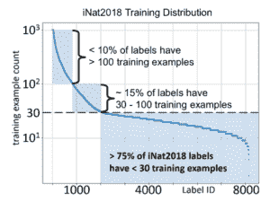
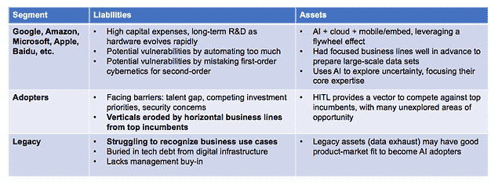

# 每个 Pacoid 的主题和会议，第 2 集

> 原文：<https://www.dominodatalab.com/blog/themes-and-conferences-per-pacoid-episode-2>

*[Paco Nathan](https://twitter.com/pacoid) 的专栏涵盖了问责的数据科学、强化学习挑战假设以及人工智能和经济学中的惊喜等主题。*

## 介绍

欢迎回到我们新的每月系列！九月是“会议季”最忙碌的一段时间，有很多优秀的新材料需要回顾。最近有三个主题跳出来。

首先是:**问责的数据科学**。一个被称为 [*的有争议的度量标准邓巴的数字*](https://www.sciencedirect.com/science/article/pii/004724849290081J?via%3Dihub) 描述了一种灵长类动物根据新大脑皮层的大小可以维持多少关系。粗略的想法将 150 设置为内聚组的阈值大小。这说明了一个事实，人类并不特别擅长在大得多的群体中做决定。然而，数据科学有助于改善这种人类状况——特别是对于跨大型组织的协作数据洞察。虽然关于数据科学道德的对话在过去几年一直很活跃，但我们开始看到企业的切实行动:团队可以使用的清单，更好的测量和建模方法的例子，以及对迫使变革的问题的出色分析和可视化。随着数据科学被应用于企业和公众问责，问题以意想不到的方式出现。

其次:**强化学习挑战假设**。正如 Strata NY 2018 所展示的那样，数据科学实践正在向主流业务转移。与此同时，许多关于数据分析、机器学习及其与工程的[关系的“给定”正在快速变化。强化学习是挑战该领域先前假设的一个重要因素。新型的生物启发学习打破了既定的做法，几十年的旧模式有了新的优先事项，以及关于我们需要多少数据来建立模型的问题？换句话说，“数据多”就一定赢吗？此外，在企业 IT 实践中，*学习*被证明比*编码*更通用。](https://www.oreilly.com/ideas/artificial-intelligence-in-the-software-engineering-workflow)

第三: **AI 和经济学有惊喜店内**。有很多关于人工智能取代工作的潜力的公开讨论。所涉及的计量经济学主要集中在劳动力和就业的测量上，与此同时，关于研发投入总量下降的趋势令人不安(T2)。然而，其中一些假设似乎是错误的。多个独立的研究工作指出了这些经济模型的数学问题，即人工智能如何以意想不到的方式加速研发，进而提振资本股票(从经济意义上讲，而不是公司估值)。此外，更新的硬件、更新的云架构、更快的网络等的经济性。，意味着远离基于 Hadoop/Spark 的数据实践时代。这些因素对数据科学和数据工程为翻天覆地的变化提供基础的行业有着深远的影响。

## 数据科学促进问责制

2018 年纽约时装周(9 月 11 日至 13 日):今年的纽约时装周将 4 天的活动压缩成了 3 个忙碌的日子。即便如此，人们还是提到了规模——不是从人数上，尽管规模很大——而是从分析在主流业务中的渗透程度。参加[一次高管简报会谈](https://twitter.com/pacoid/status/1039955321731653633)，我前面的一排人来自爱荷华州的一家保险公司。我在 2017 年介绍了同样的演讲者/演讲，只有少数人参加。一年后，这种谈话只是站着说话不腰疼。来自衣阿华州的人说他们对提出的概念是多么陌生，并且渴望学习。随着数据科学实践在主流业务中的传播，我们正在大规模获得更好的光学技术。企业和公众责任的一些问题可以从关键个人的意见和偏见转向客观分析和大规模数据的可视化。这对数据科学和业务都有好处，尽管这种情况可能会以一些不太直观的方式出现…

## 量化宽恕

最尖锐的阶层主题演讲之一是[茱莉亚·安格温](https://twitter.com/JuliaAngwin)的《[量化宽恕](https://www.oreilly.com/ideas/quantifying-forgiveness)》。茱莉亚是《T4 的拖网国家》一书的作者，她领导了著名的针对 ML 模型中种族偏见的 ProPublica 调查，该模型用于假释听证会中的犯罪风险评分。她探索了她从算法问责调查中学到的关于宽恕的知识。换句话说，由于基于 ML 模型的自动化中的内在偏见，谁会因违法行为而获得通行证，谁会直接入狱？这些是“我们都需要为即将到来的人工智能未来学习的课程”，在未来，算法越来越多地成为宽恕的*仲裁者*。总的来说，这项工作展示了许多杰出的数据科学实践的例子，尤其是引人注目的可视化。

https://twitter.com/ginablaber/status/1040238561726025728

Julia 在数据新闻和问责制方面的下一个项目刚刚宣布: [The Markup](https://themarkup.org/) ，这是一个位于纽约的无党派、非营利的新闻编辑室，它“阐明新兴技术的社会危害”，由 Craig Newmark、Knight Foundation、Ford Foundation、MacArthur Foundation 等[资助](https://techcrunch.com/2018/09/23/the-markup-a-tech-focused-investigative-news-site-raises-20-million-from-craigslist-founder/)。

## 声音及其对认知的影响

在另一个截然不同的问责例子中，数据分析能否指出大规模的有害商业行为，即(1)无形的，(2)对消费者造成长期的身体伤害？

[琥珀盒](https://twitter.com/caseorganic)的《[声音设计与体验的未来](https://www.oreilly.com/ideas/sound-design-and-the-future-of-experience)，以微妙、深刻的[声景](https://en.wikipedia.org/wiki/Soundscape)开场。没有图像，只有前一天晚上她在曼哈顿酒店房间里的录音，探索从街上传来的声音纹理。我们不断地处理声音，甚至在睡觉时也是如此，这对我们的认知有着重要的影响。例如，我们在商业航班上听到的声音[会影响我们品尝食物的能力](https://www.theguardian.com/lifeandstyle/wordofmouth/2014/mar/11/sound-affects-taste-food-sweet-bitter):芬兰航空公司制作了一个定制的配乐，让他们的机上食物味道更好。

Amber 是即将推出的 [*设计带声音的*](http://shop.oreilly.com/product/0636920051923.do) 产品的合著者，我一直在忙于一个早期版本。强烈推荐用于严肃的数据科学工作。在她的主题演讲中，展示了各种产品的设计，如暖通空调、吹风机——或者我在公司校园里最讨厌的东西，不可避免的吹叶机——Amber 指出，“这些都损害了我们放松、更好地思考和对我们的环境更感兴趣的能力。”

在 Strata 的后台，Amber 带着 [Spectrogram Pro](https://itunes.apple.com/us/app/spectrogram-pro-with-super-smooth-60hz-update/id415301721?mt=8) 在 A/V 设备中蜿蜒前行，指出哪些工作站产生的噪音最大，哪些主讲人需要进行过滤调整以使其更容易理解。具有讽刺意味的是，前一天晚上我在[约翰·多利牡蛎酒吧](https://www.thejohndory.com/)参加了一个行业晚宴。我不得不捂住耳朵，费力地听着[首席执行官萨尔·约斯科维茨(Saar Yoskovitz)描述他们如何在声学传感器上使用 ML 来诊断工业设备故障。我们在约翰多利地下室餐厅的“安静”角落测量到 100+分贝。虽然对高端餐馆来说很时髦，但这种噪音水平足以造成损害——城市千禧一代预计会比他们的父母早二三十年经历听力损失的“衰老”影响。幸运的是，](https://www.augury.com/)[有一个应用程序可以解决这个问题,](https://www.soundprint.co/)——这有望让公共场所的健康标准得到更好的执行。

### 旧金山的声纹餐馆噪音水平

琥珀作品的一个中心主题是关于[平静的技术](https://calmtech.com/)，与吸引注意力的产品相反。这将为我们如何构建分析和报告提供信息。例如，决策者有多容易从我们作为数据科学家制作的数据可视化和其他交互式材料中学习？有没有办法让我们的分析结果平静下来，让人们更好地思考数据洞察和业务战略？问责制的另一个例子——关于我们如何呈现分析的影响。

顺便说一句，如果你还没有参加艾德·塔夫特的一日课程“展示数据和信息”，把它放在一个高优先级的清单上，明智地投资 380 美元。每位参与者都会收到一套他的精美精装书籍，这些书籍在亚马逊上的售价约为课程注册费的 50%。此外，这是充满统计数据和数据可视化的令人震惊的一天。我提到这个是因为 Tufte 的做法如*数据墨水*、*迷你图*等。很适合安珀·凯斯的作品。

## 招聘中的偏差数据

其中一个优秀的数据案例研究是 [TapRecruit](https://taprecruit.co/) 的[Maryam Jahan shahi](https://twitter.com/mjahanshahi):[“投钱球”招聘:一种数据驱动的方法，用于解决招聘中的瓶颈和偏见](https://twitter.com/pacoid/status/1039547210168459272)。他们分析了大量关于数据科学招聘的数据。一个观察到的问题是初级数据科学家中的头衔膨胀。因此，在候选人搜索中使用“高级数据科学家”这一短语会造成瓶颈，而不是一个好的过滤器——将招聘成功率降低 50%。此外，职位描述中两个最重要的*津贴和福利*竟然是提及医疗保险和 401k——而短语“无限假期”在年龄统计中的意思是*吝啬的公司，过度竞争的环境，无法想象适合那里*。另一个要点是:科技公司经常将“黑客多样性”作为快速解决方案，但这是一个神话。Maryam 表明，当你有更大的候选人库时，你最终会在新雇员中有更多的多样性。相比之下，人们在招聘时往往会做出有偏见的微观决定，尤其是在边际上，这导致候选人范围变小。

鉴于约 150 场演讲，Strata 还有更多的内容可以总结，尽管完整的视频集仍在网上发布。下面是 Maggie Seeds 的一个很好的总结:

*“未来已经到来，现在的热门话题是如何最好地存储、处理和分析数据，以有效地提供洞察力来推动决策。”*

## 人工智能中的伦理和隐私

同时，[AI Conf，SF](https://conferences.oreilly.com/artificial-intelligence/ai-ca)(9 月 4-7 日)售罄。我录制了对展会现场与会者和供应商的视频采访，他们的评论都是一致的:

“前些年，人们会问‘人工智能是什么？’；然而，今年他们来描述他们的使用案例，然后问“你如何能在这方面帮助我？”相反。"

这非常符合数据科学在主流业务中的分层。

AI SF '18 上的两次演讲从伦理、隐私以及您的团队今天可以采取哪些切实可行的措施等方面探讨了人工智能。虽然幻灯片和视频还没有上线，但是来自 Altimeter Group 的 Susan Etlinger 将在 10 月 11 日的人工智能伦敦会议上再次发表演讲[“道德人工智能——如何打造客户喜爱和信任的产品”](https://conferences.oreilly.com/artificial-intelligence/ai-eu/public/schedule/detail/68474)。苏珊在六月参加了*的[播客，内容涉及相关主题:](https://medium.com/the-official-integrate-ai-blog/podcast-trust-in-enterprise-ai-with-susan-etlinger-b257e2056162)*

*   在消费企业环境中定义道德和信任
*   为什么企业“应该将道德视为竞争优势，而不是无聊的合规练习”

查看她的 Altimeter Group 白皮书“[人工智能的客户体验:培养参与、创新和信任的五项原则](https://marketing.prophet.com/acton/media/33865/altimeter--the-customer-experience-of-ai--2017)”。Susan 的一个关键观点，加强了 Maryam Jahanshahi 的上述观点，即个人基于他们自己的偏见(每个人都有)做出*微观决策*，这些偏见累积成*微观策略*。同样，这与人们在大群体中无法自然做出好的决策有关。即便如此，数据科学可以帮助增强基线人类条件，以便大型组织可以合作做出客观和符合道德的决策——这是一个*竞争优势*。

Mike Loukides、Hilary Mason 和 DJ Patil 今年夏天与 Susan Etlinger 等人合作撰写了一系列数据伦理文章作为核心材料。一份[数据伦理清单](https://www.oreilly.com/ideas/of-oaths-and-checklists)产生了，现在[民主数据](http://datafordemocracy.org/)正在指导数据科学团队将该清单投入生产。最近，我与 D4D 社区经理[莫·强森](https://www.youtube.com/watch?v=8ZpQ4KZZwoc&feature=youtu.be&t=35m54s)进行了交谈，她将远赴各地进行介绍。D4D 是一个志愿者组织，看看[如何参与](http://datafordemocracy.org/contact.html)。

[Amanda Casari](https://twitter.com/anitayorker/status/1037875387831922688) 介绍企业中的伦理和隐私，[“当隐私扩大:GDPR 下的智能产品设计”](https://www.slideshare.net/AmandaCasari/when-privacy-scales-intelligent-product-design-under-gdpr-113692776)。新东西: [Deon](http://deon.drivendata.org/) 为数据科学家提供了一份 GitHub 友好的道德清单。沿着这些思路，请看来自芝加哥大学的面向 ML 开发者的“开源偏见审计工具包”。

Amanda Casari at AI Conference, Photos by Paco Nathan

此外，我还介绍了“[开源分散数据市场，用于在大型共享风险领域培训人工智能](https://conferences.oreilly.com/artificial-intelligence/ai-ca/public/schedule/detail/72032)”，并了解了一个相关的开源项目 [PySyft](https://github.com/OpenMined/PySyft) “基于 PyTorch 的加密、隐私保护深度学习”。随着关于隐私、道德、偏见、合规性的对话深入，预计将会看到更多将隐私数据从模型训练中分离出来的工具。最终，风险管理为企业中的这些变化起到了“楔形的薄边”的作用。

## 强化学习挑战假设

丹尼·兰格关于人工通用智能(AGI)的演讲上个月被推荐到这里。再来看看重点，加上刚刚发表的一篇相关论文。简而言之，在数据建模工作中有一些假设，即我们必须从大量带标签的数据开始，才能得到一个好的 ML 模型。然后如果你想提高那个模型的预测能力，获取更多/更好的数据。但是，有时您可以利用领域知识，这样模型就不需要从头开始训练，也不需要仅仅基于堆积如山的数据。R&D 在*强化学习*领域的工作正在挑战其中的一些假设，从其他领域引入数十年来已有的实践来增强人工智能。

## 训练小狗

在 AI SF 上，Danny Lange 展示了如何训练小狗:“[在通往人工通用智能的道路上](https://conferences.oreilly.com/artificial-intelligence/ai-ca/public/schedule/detail/68710)”——游戏模拟 [Unity3D](https://unity3d.com/) 加上用于训练虚拟小狗玩“捡东西”等技能的强化学习。在此基础上，丹尼描述了几种受生物学启发的学习形式，它们超越了*深度学习*。他展示了虚拟小狗的例子:

*   *模仿学习*:如见 https://bit.ly/2zvYH51(开始 0:15)
*   *课程学习*:从一个简单的问题开始，然后逐步加大学习挑战的难度
*   *好奇心驱动的探索*:超越了*随机探索*永远无法解决的问题，也就是说，代理不会因为想要探索其他房间而被困在一个房间(鞍点)

https://twitter.com/danny_lange/status/1045017157539713031

两个有趣的脚注:

*   并行运行数千个这样的训练模拟很简单，然后结合成功学习者的特征
*   困难的机器学习是在虚拟环境中完成的，没有人提供标记数据

最近的一篇论文详细描述了这一点:“ [Unity:智能代理的通用平台](https://arxiv.org/abs/1809.02627)”，他们的团队正在将其实现开源。虽然有人指出“人工通用智能”是世界末日(或其他什么)的前兆，但丹尼强调了开源与易于计算的方法相结合的价值:“构建人工智能最安全的方式是确保每个人都可以使用它。”说到容易计算的方法，Unity 在 [50%的手机游戏](https://www.businesswire.com/news/home/20180926005180/en/Unity-DeepMind-Advance-AI-Research-Virtual-Worlds)中运行。

## Pywren 和其他新项目

准备好迎接一场旋风吧，我必须听八遍埃里克·乔纳斯和本·洛里卡的播客采访“[为大规模计算和机器学习构建可访问的工具](https://www.oreilly.com/ideas/building-accessible-tools-for-large-scale-computation-and-machine-learning)”，然后才能勾勒出他们的轮廓。说真的，你找不到全筹码玩家的更广阔视角。虽然采访的核心是关于 [Pywren](http://pywren.io/) ，但 Eric 和 Ben 详细介绍了强化学习及其与[最优控制理论](https://en.wikipedia.org/wiki/Optimal_control)的关系，追溯到 20 世纪 50 年代。如果没有这个，我们就不会乘飞机或在高速公路上开车。RL 提供了利用[领域知识](http://www.argmin.net/2018/06/25/rl-tour-fin/)的方法，因此模型不需要仅仅从数据开始训练。此外，这些模型可以有更可预测的结果。所涉及的数学进入*贝叶斯方法*、*变分法*等。振作起来，但结果对行业中稳健的 ML 模型是乐观的。

Pywren 是一个新的开源项目，它在云中的无服务器计算上“让您大规模运行现有的 python 代码”。它与 [scikit-learn](http://scikit-learn.org/stable/) 、[熊猫](https://pandas.pydata.org/)等配合得很好。，在云/无服务器上横向扩展，用于:

*   针对特定查询的快速 ETL(非管道)
*   ML 方法的定量分析(例如，科学)

作为加州大学伯克利分校 RISE 实验室的博士后，Eric 意识到 AMP 实验室和 RISE 实验室的许多研究生从未写过 T2 Apache Spark T3 的作品，于是这个项目开始了。将最后一句话重复几遍，让它深入人心……虽然在独立模式下运行 PySpark 很简单，但在科学开始发生之前，Spark 集群的设置需要大量的*数据工程*。

## 建筑方面的巨大变化

当有大量廉价的“旋转磁盘”和“商用硬件”Linux 服务器时，Apache Hadoop 和 HDFS 重新崛起，尽管这些磁盘的故障率很高。Hadoop 为完成批处理作业提供了一个可靠的框架，即使磁盘在作业进行过程中出现故障。新颖的策略是在商用硬件集群上托管您的数据集，然后*将您的计算带到数据*，尽可能利用数据局部性实现并行。大约在 2008 年，我带领一个团队运行亚马逊 AWS 上最大的 Hadoop 实例之一[。在我 2009 年在伯克利的演讲中，喜欢惩罚的人可以观看戴夫·帕特森施展他的“论文答辩”绝地技巧。](https://www.slideshare.net/pacoid/getting-started-on-hadoop/7-A_Tale_of_Two_VenturesAdknowledge)

几年后，火花出现了。几乎相同的模型，更灵活地使用[组合子](https://en.wikipedia.org/wiki/Combinatory_logic)，加上更多地利用内存中的数据。后来我们有了[多核](https://papers.nips.cc/paper/3150-map-reduce-for-machine-learning-on-multicore.pdf)、[大内存空间](https://forwardthinking.pcmag.com/hard-drives/346999-storage-class-memory-the-coming-revolution)、[云存储](https://aws.amazon.com/s3/)效果惊人地好——再加上[摩尔定律失效](https://www.theregister.co.uk/2018/01/24/death_notice_for_moores_law/)。

如今，随着快速商品联网的出现，云服务的经济性完全不像早期 Hadoop 的“商品服务器”。争论更多地集中在网络上，而不是服务器上，但是不管怎样，埃里克·乔纳斯和他的团队做了大量关于瓶颈、吞吐量、故障率、经济等方面的研究。现在*将您的数据带到计算*中，而不是将您的计算带到数据中。

Eric 用“阻尼正弦”曲线来描述 Spark 和 Hadoop 中的集群利用率，其中定义了所需的最大集群资源，但只在管道的后期阶段使用部分资源。然而，“管道”是关于批处理的——而世界正在远离批处理。相比之下，在 Pywren 上大规模运行 Python 函数比在 Spark 上做类似的工作要便宜 2-3 倍。虽然*无服务器*不是万能药(也就是说，因为权衡)，我们会看到更多的分析在 Pywren 这样的平台上运行。一批崭露头角的开源框架利用了更新的硬件和云架构:[箭头](https://arrow.apache.org/)、 [Crail](https://crail.apache.org/) 、 [Nuclio](https://github.com/nuclio/nuclio) 、 [Bullet](https://bullet-db.github.io/) 等。后者是 Yahoo 提供的针对大数据流的实时查询引擎，零持久层。

## 学习编码

将这一点与 IT 实践和软件工程联系起来，注意 Eric Jonas 是如何引用与不平衡连接相关的问题的，ML 模型在这方面大有可为。这是又一个[数据点](https://www.oreilly.com/ideas/how-machine-learning-will-accelerate-data-management-systems)的提示，表明学习如何被证明比编码更通用。紧接着，来自 RISE Lab 的杨宗衡最近发表了“ [SQL 查询优化遇上深度强化学习](https://rise.cs.berkeley.edu/blog/sql-query-optimization-meets-deep-reinforcement-learning/)”:

“我们表明深度强化学习在优化 SQL 连接方面是成功的，这是一个在数据库社区中研究了几十年的问题。此外，在大型连接上，我们证明这种技术的执行速度比传统的动态程序快 10 倍，比穷举快 10，000 倍。”

换句话说，使用 RL 来预测如何优化 SQL 连接。对于企业 IT 来说，这可能是一个巨大的胜利，因为 SQL 连接的效率是重中之重。

Hadoop/Spark 的策略是利用批处理和小型批处理。对于 ML 应用程序，您将关注于*编码*管道来清理您的数据，大规模运行连接，提取特征，在集群上构建模型，然后将模型部署到生产中。来自 RISE Lab 的 Eric Jonas 和其他人现在指出了架构和实践中的巨大变化，其中 RL 更关注将数据更新(流/实时)引入计算(即，大规模无服务器，世界上的移动设备)以实现最佳控制方法。数学可能令人望而生畏，但结果可能更可预测和稳健。

## 世界是长尾的

假设受到挑战，那么有效的建模需要多少数据？这里有一些关于这个主题的最新佳作…

你知道吗:你可以用回归来代替 t 检验？对于那些使用 A/B 测试在线运行客户实验的人来说，这可能会改变你收集数据的方法，以及在采取行动之前你需要多少数据——这会影响测试的速度。Stitch Fix 有一个[出色的演示](https://www.slideshare.net/stitchfix_algo/progression-by-regression-how-to-increase-your-ab-test-velocity)，它可以追溯到数学(例如*条件间可变性*，以消除关于 A/B 测试统计的普遍神话。

*[Source: Deep Learning Analytics in iNat 2018 Challenge](https://www.deeplearninganalytics.com/)*

在深度学习方面，DL 模型需要 [10⁶ 作为训练数据集的最小大小](https://venturebeat.com/2017/10/23/google-brain-chief-says-100000-examples-is-enough-data-for-deep-learning/)，这一点已经被接受。由格兰特·范·霍恩、彼得罗·佩罗娜/加州理工学院(2017-09-05)撰写的优秀论文“[魔鬼在尾部:野外的细粒度分类](https://arxiv.org/pdf/1709.01450.pdf)”探索了训练数据的*大小、类别数量和模型错误率*之间的定量关系:

训练图像的数量是至关重要的:每当我们将训练图像的数量减少 10 倍，分类误差就会增加一倍以上。这在长尾状态下尤其重要，因为尾部包含大部分类别，因此决定了平均分类性能。”

范霍恩和佩罗娜以一句绝妙的俏皮话开场:世界是长尾的。上图显示了来自[深度学习分析](https://www.deeplearninganalytics.com/)的分析，该分析是在[in naturalist 2018 竞赛](https://www.kaggle.com/c/inaturalist-2018)中排名第二的团队。这个挑战的一部分是，有多少要学习的类几乎没有用于训练的数据点。这种情况比著名的 [ImageNet](http://image-net.org/) 更加“真实”——每个类平均有大约 500 个实例——这使得“深度学习”成为一个流行短语。前面提到的 Lange，Jonas 等人的 sea change 解决了减少数据需求的问题。我可以做出一个有根据的猜测，你的企业 ML 用例更像 iNaturalist 而不是 ImageNet，我们需要找到产生有效模型的方法，而不需要巨大的标签数据集。

该领域的主要推动者之一 DARPA 最近发表了“[减少智能机器的数据需求](https://www.darpa.mil/news-events/2018-07-11)”，同时宣布了一项价值 100 亿美元的 3B 计划:

领导 LwLL 项目的信息创新办公室(I2O)的 DARPA 项目经理 Wade Shen 表示:“在 LwLL 下，我们正在寻求将从头构建模型所需的数据量减少 100 万倍，并将调整模型所需的数据量从数百万减少到数百个标记的例子。也就是说，现在需要 100 万个图像来训练一个系统，将来只需要一个图像，或者需要大约 100 个带标签的示例来适应一个系统，而不是现在需要的数百万个

诸如*主动学习、迁移学习、元学习、k-shot 学习*等技术。，建议用于研究，以使机器学习在较小的数据样本(即长尾数据)下有效工作。FWIW，我在 AI SF 上发表了“人在回路中的最佳实践:主动学习的商业案例”，它提供了解决企业中数据需求的例子。

在某些情况下，也有关于合成数据的工作。 [Augmentor](https://augmentor.readthedocs.io/en/master/) 作为一个例子，是一个 Python 包，用于“机器学习任务的图像数据的增强和人工生成”。

## 人工智能与经济理论

如前所述，有很多关于人工智能取代工作岗位、R&D 衰退等的公开讨论。其中一些假设似乎是错误的。例如，参见兰格最近的另一篇论文，[程依娜·莫-兰格](https://twitter.com/yina_ml/status/1006101689164759042)的《[人工智能对经济增长的影响:检验人工智能在创意产生中的作用](https://onedrive.live.com/?cid=6b8f3ce78808dba5&id=6B8F3CE78808DBA5%2124490&authkey=%21AGq1FHOehfeUPIQ)》。

程依娜也是一名奥林匹克滑雪运动员，他提出了一个引人入胜的论文，其中包括对新发明的“通用技术”的传播、R&D 与劳动力之间不断变化的关系、硬件能力的戏剧性演变，以及关于资本存量创造的当代理论(在经济意义上，而不是公司估值上)的详细调查。这建立在 Agrawal 等人对技术驱动的经济增长前景的基础上。在程依娜发现了早期理论工作中的一些数学错误后，她的总结是:人工智能放大了 T2 研发，增加了资本存量，对就业和全球经济的影响比劳动力转移更深远。

## 经济前景

程依娜·莫-兰格并不孤单。在 AI SF，来自[麦肯锡全球研究院](https://twitter.com/HitzkeE/status/1037772164227719168)的 Mehdi Miremadi 在“[中证实，我们是否已经达到了人类的巅峰？人工智能对劳动力的影响](https://conferences.oreilly.com/artificial-intelligence/ai-ca/public/schedule/detail/68470):

*   基于目前劳动力供应的趋势，经济前景看起来很暗淡
*   过去五十年的“生产率增长”是基于大量人口进入劳动力市场
*   我们自动化的能力(许多工作的 30%)是人工智能的故事将如何展开

也就是说，高级分析在短期内有潜力释放经济中的 11-13 万亿美元(约占全球 GDP 的 15%)，其中深度学习约占 40% 。历史类比是存在的，例如，早期个人电脑的普及创造了就业机会，尽管有相反的可怕警告。

然而，有一个陷阱:*健壮的数据基础设施和有效的数据工程和数据科学实践是这场游戏的赌注*。**基于人工智能的明日资本存量创造始于今天良好的数据科学实践。**

## 按细分市场划分的企业人工智能采用情况，部分基于麻省理工学院 SMR 2017

请注意，上表中最上面的部分大约有 12 家公司，而第二和第三部分大约各占一半。人在回路中是第二个细分市场获得相对于第一个细分市场的优势的好方法，而即使是第三个细分市场也通常会有遗留资产——就未使用的数据排放而言——这可能会被利用来获得优势。

Enterprise AI adoption by segment, partly based on [MIT SMR 2017](https://sloanreview.mit.edu/projects/reshaping-business-with-artificial-intelligence/)

这里举个反例:[“AI”做得不好](https://medium.com/derwen/marque-dos-para-espa%C3%B1ol-fedd85d13e4c)。作为一个“假设”，考虑人工智能在消费者航运领域的三个竞争对手中的采用细分:亚马逊作为现任者处于顶级细分市场，联邦快递处于第二细分市场，拥有机会和不断发展的数据文化，而 UPS 则在数据基础设施方面苦苦挣扎。

## 齐心协力

好吧，深呼吸，这就够了。简而言之，数据科学正在被用于更好的企业和公共问责，以增强/克服微观决策、微观侵略和在大群体中缺乏良好判断的固有人类状况。同时，更新的硬件、更新的云架构、更快的网络等的经济性。，意味着远离基于批处理的数据实践时代，走向涉及更多流、强化学习、无服务器等的巨变。这些实践挑战了 ML 中的假设，并开始展示 AI 在企业中的 ROI。这很好，因为我们感受到了来自与“智能机器”相关的数据需求的压力，以及现实世界用例中长尾数据的现实。从另一个抽象层面来看，人工智能的经济学也在挑战计量经济学、就业率、有效 R&D、股本创造等方面的假设。在这里，我们再次看到了与数据科学相关的最佳实践如何成为未来的赌注。