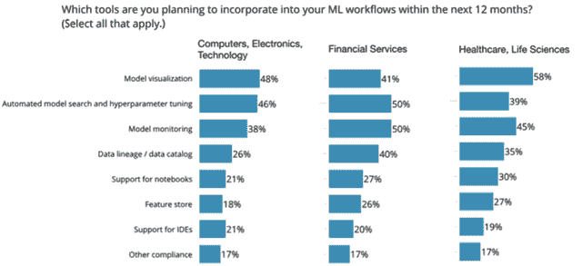

# 每个 Pacoid 的主题和会议，第 7 集

> 原文：<https://www.dominodatalab.com/blog/themes-and-conferences-per-pacoid-episode-7>

*[Paco Nathan](https://twitter.com/pacoid) 涵盖了最近对数据基础设施的研究，以及机器学习和人工智能在企业中的应用。*

## 介绍

欢迎回到我们关于数据科学的每月系列！这个月的主题不是专门关于会议总结；相反，它是关于来自 Strata Data 参与者的一组跟踪调查。我们在几个转折点上都有很大的惊喜，随后发表了一系列报告。让我们来看看从这些报告中获得的一些见解。说真的，整篇文章只不过是对这些报告的一点皮毛。与此同时，景观正在迅速演变。查看本文结尾部分，了解从该领域领导者的实践中总结出来的关键指导。

## 调查 ABC 在企业中的采用情况

"当生活给你柠檬时，做柠檬酒."在一次数据科学会议之后，我们的营销团队希望通过调查来自行业的 300 名与会者来跟进。然而，一个快乐的意外导致了更大更好的结果。该调查被错误地发送给了全球企业组织中的 15，000 人。然后，当我们收到 11，400 份回复时，对于数据收集接收端的数据科学家阿朵来说，下一步就显而易见了。我们开始分析这个偶然发现的庞大数据集，寻找趋势、异常、意想不到的见解、反直觉的惊喜等等。

在过去的六个月里，[本·洛里卡](https://twitter.com/bigdata/)和我进行了三次关于企业采用“ABC”(人工智能、大数据、云)的调查。考虑到主流企业正纷纷拥抱这三个技术领域，这个时机再好不过了。O'Reilly Media 将我们的分析作为免费的迷你书出版:

*   [*机器学习在企业中的采用状况(2018 年 8 月)*](https://www.oreilly.com/data/free/state-of-machine-learning-adoption-in-the-enterprise.csp)
*   [*演进的数据基础设施:高级分析和人工智能的工具和最佳实践(2019 年 1 月)*](https://www.oreilly.com/data/free/evolving-data-infrastructure.csp)
*   [*人工智能在企业中的采用:企业如何在实践中规划和优先考虑人工智能项目(2019 年 2 月)*](https://www.oreilly.com/data/free/ai-adoption-in-the-enterprise.csp)

本和我还为每个调查写了文章，总结了重点。依次是:

*   *[《奥莱利机器学习采用调查公司应该知道的 5 个发现》](https://www.oreilly.com/ideas/5-findings-from-oreilly-machine-learning-adoption-survey-companies-should-know)*
*   " [*公司如何构建可持续的人工智能和人工智能计划*](https://www.oreilly.com/ideas/how-companies-are-building-sustainable-ai-and-ml-initiatives) "
*   [*“三项人工智能采用调查揭示来自更成熟实践的关键建议”*](https://www.oreilly.com/ideas/three-surveys-of-ai-adoption-reveal-key-advice-from-more-mature-practices)

第一项调查开始于对机器学习(ML)主流采用的简单探索。使用 ML 模型对文化和组织有什么影响？谁构建他们的模型？决策和优先级是如何制定的，由组织内的谁来制定？用什么标准来评估成功？考虑到时机——大约在 [GDPR](https://gdpr-info.eu/) 生效后一个季度——这似乎是一个探究企业组织中普遍智慧的好时机。我们很高兴在世界范围内有几千个企业组织。

第二项调查更多地着眼于数据工程方面，特别是正在使用的框架(例如，开源框架与商业产品)，以及这项工作是否正在迁移到云中。

对于第三次调查，我们在已经与 ML 合作的公司中挖掘了关于 AI 的细节。他们的使用案例、首选技术、预期预算、采用障碍等如何？

为了设计这些调查，我们使用几个不同的维度对数据进行了细分。地理是显而易见的，也就是说，世界不同地区之间的对比是什么？商业垂直是另一个区分 ML 实践趋势的重要优先事项:金融服务、医疗保健和生命科学、电信、零售、政府、教育、制造等。

我们还使用了*成熟度*，换句话说，一个企业组织在生产中部署 ML 模型有多久了？对于这个维度，我们指定了三个类别，尽管我们对它们的确切措辞在每次调查之间有所不同:

*   **成熟实践**:“我们在生产中已经做了 5 年多了”
*   **评估阶段**:“是啊，我们几年前就开始了”
*   **还没有**:“只是看看，非常感谢”

换句话说，第一类代表“领导者”，而第三类代表“落后者”，其余的实际上是中间地带。这种对比为区分领先者和落后者提供了良好的基础。

说真的，本在如何组织这些调查方面的远见卓识值得称赞。我在这里主要是提供麦克卢汉的语录，并用加州口语测试我们文字编辑的耐心。再加上明显过度使用互文意合。或者什么的。

## 技术

公司正在云中构建数据基础设施:85%的公司表示他们在至少一家云提供商处拥有数据基础设施。三分之二(63%)的人在数据基础设施的某个部分使用 AWS，37%的人在某个部分使用微软 Azure，28%的人在某个部分使用谷歌云平台(GCP)。低两位数使用 AWS 和一种其他云，而 8%使用所有三种主要的公共云 AWS、Azure 和 GCP。

被云供应商商业化为服务的开源框架最近成了热门话题。坦率地说，这是云服务发展过程中的一个长期叙事弧——例如，我在 EC2 上做了一个关于 Hadoop 的大型案例研究，它帮助通知了 [Elastic MapReduce](https://aws.amazon.com/emr/) 的发布。在我们的第二次调查中，出现了一些关于云的有趣见解，如下图所示。

也就是说，有很多开源框架用于数据处理和流式传输。虽然我在主流 IT 中听到了很多关于雪花采用率的说法，但在这里，我们看到 Spark、Kafka 和 Hadoop 是最受欢迎的数据处理工具，以及它们在云中对应的托管服务。**注意依赖开源和使用托管服务的比例大约是 2:1。**

无服务器也在雷达上。虽然许多组织仍处于采用无服务器技术的早期阶段，但在复杂的实践中，53%的组织已经在使用主要云供应商的无服务器产品:AWS Lambda、GCP 云功能、Azure 云功能等。顺便说一句，如果你还没有阅读加州大学伯克利分校 RISE 实验室的最新分析和项目，请停下你正在做的事情，看看戴夫·帕特森、扬·斯托伊察、埃里克·乔纳斯等人的[“简化的云编程:关于无服务器计算的伯克利观点”](https://www2.eecs.berkeley.edu/Pubs/TechRpts/2019/EECS-2019-3.pdf)。十年前(同一天)，同一批教授发表了开创性的“[云端之上:云计算的伯克利观点](https://www2.eecs.berkeley.edu/Pubs/TechRpts/2009/EECS-2009-28.pdf)”论文，该论文预见了未来数年云采用的形式，并指导了 Apache Spark 的创始团队。

O'Reilly Media 早些时候进行了一项关于深度学习工具的调查，该调查显示前三大框架是 TensorFlow (61%的受访者)、Keras (25%)和 py torch(20%)——注意，在这种情况下，Keras 可能被用作 TensorFlow 之上的抽象层。今年，我们看到 Keras (34%)和 PyTorch (29%)正在取得进展。

深度学习中使用的数据类型很有趣。基本上有四种类型:图像/视频、音频、文本和结构化数据。虽然自 2011-2012 年众所周知的“ [AlexNet moment](https://papers.nips.cc/paper/4824-imagenet-classification-with-deep-convolutional-neural-networks.pdf) ”以来，图像数据一直是深度学习用例的中坚力量，并且过去 2-3 年自然语言处理中的[复兴](https://paperswithcode.com/area/nlp)加速了对文本用例的重视，但我们注意到结构化数据在企业中处于首位。这很可能是 devops、远程信息处理、物联网、过程控制等的混合，尽管它对采用强化学习也有积极的意义。

人工智能技术创业公司向企业出售能力，请注意。下图显示了未来一年计划的 ML 工作流功能排名。请注意[模型可视化](https://towardsdatascience.com/understanding-your-convolution-network-with-visualizations-a4883441533b)是如何浮出水面的，这对模型的可解释性、网络威胁等都有影响。

排名第二的类别也很有趣——当你特别关注 FinServ 垂直领域时，它排名第一。到 2018 年年中，AutoML 的使用在企业中引起了很少的兴趣-在第一次调查中，我们的受访者中只有个位数的百分比。到 2018 年 11 月，43%的人报告说，他们计划在 2019 年的某个时候将 AutoML 纳入他们的工作流。成熟的实践报告了 86%,在金融服务中，这个数字更高一些。这代表着战略的重大转变，云提供商将从中受益。也就是说，AutoML 并没有解决 ML 部署的整个生命周期。

公司正在将人工智能应用于他们可能已经有分析应用程序的功能领域，并以此为基础。与此同时，“人工智能”的范围正在扩大:

在我们的调查中，有一半的组织已经在使用深度学习。三分之一使用人在回路。四分之一使用知识图表。五分之一使用强化学习。请注意，强化学习可能比一般认为的更广泛地应用于工业生产中，并期待它在企业解决方案中变得更加普遍。此外，迁移学习提出了一个有趣的细微差别，因为它在生产中的使用往往需要更有经验的从业者。我们看到成熟的实践使用迁移学习的速度是评估阶段公司的近三倍。迁移学习的应用是有价值的，尽管对于门外汉来说可能不那么明显。

## 管理

正如所料，我们的第一项调查显示了成熟的组织如何利用其内部数据科学团队来构建他们的 ML 模型，而经验不足的组织往往更依赖外部顾问:

然而，令人惊讶的是，大量更复杂的组织依赖数据科学线索来设置项目优先级和确定成功的关键指标:

这些传统上是产品经理或高管的职责。此外，更复杂的组织报告说他们更多地使用“其他”方法，而不是“敏捷”方法。我们没有办法探究“另一种”方法可能是什么。

无论如何，正如我们从几个方面听到的那样，将 ML 模型引入生产似乎与“照常营业”背道而驰。典型的产品管理和软件工程方法根本不适用于数据实践。相反，经验丰富的公司似乎正在将关键决策移交给最了解其领域的数据科学领导。

深入了解生产中 ML 模型的过程的更多细节，总体上 40%的受访者表示他们的组织检查模型的公平性和偏见。在成熟的实践中，这一比例高达 54%的受访者:

同样，43%的受访者属于在将 ML 模型投入生产之前检查数据隐私问题的公司，在成熟的实践中，这一数字跃升至 53%。

这三项调查中的细节太多，无法在一篇文章中充分涵盖。然而，笑点留到了最后:

请注意 43%的成熟实践如何将 2019 年整体 IT 预算的 20%或更多投入到 ML 项目中。换句话说，领先者和落后者之间的分裂正在加速。领导者已经学会了如何从 ML 中创造投资回报——现在他们更有竞争力，并在人工智能上下了双倍赌注。然而，落后者有数年的数字化转型、公司文化排毒、巨大的人员障碍等。在他们变得有竞争力之前去克服。

## 综合

正如我在之前的文章中所描述的，数据科学的基础对于那些打算开发复杂数据能力并最终部署人工智能应用的公司来说是“赌注”。换句话说，如果一家公司不首先偿还技术债务，并使其数据基础设施井然有序，它将无法进入这一旅程的后期阶段。这些后期阶段是组织获得关键洞察力、竞争能力和认识到数据科学投资回报的阶段。

在第三次调查中，我们试图量化企业组织在这一过程中遇到的风险。下图按顺序显示了这些步骤，以及将每个步骤列为其主要瓶颈的受访者百分比，您可以将这些步骤视为企业中竞争性人工智能采用的成功结果的[生存分析](https://en.wikipedia.org/wiki/Survival_analysis):

请记住，第三次调查中 81%的受访者在已经对 ML 感兴趣的公司工作；虽然上图中的顺序适用于整个企业，但风险的分布将更倾向于有经验的数据科学实践的问题。此外，我根据成熟度来解释步骤的顺序:在经验较少的团队中更普遍的问题被放在旅程的早期步骤中，而后期步骤是更有经验的团队面临的问题。说到这里，你可能会注意到图表有两三种模式？这些与成熟的阶段相对应——让我们深入了解这些细节。

前三大挑战代表“不成功”的情况，正如[早期研究](https://sloanreview.mit.edu/projects/reshaping-business-with-artificial-intelligence/)所报告的那样，它们是落后者报告的更常见的绊脚石。也就是说，一个组织首先需要解决其技术债务，打破孤岛，确保高层管理人员支持，并学习如何确定适当的业务用例。

接下来列出的三个挑战——缺乏数据、人才短缺和合规性问题——即使对于 ML 的早期采用者(即更成熟的实践)来说也是众所周知的问题。

坦率地说，我很惊讶工作流可再现性没有得到更大的份额。即便如此，在早期问题得到解决之后，以及当有更大、更复杂的 ML 项目正在进行时，再现性和超参数优化可能会成为问题。

无论如何，对人工智能的采用有一种生存分析。在这一过程中，您的组织处于什么位置？如果你目前正与数据质量问题争论不休，你可能会开始展望员工或法律问题将如何成为下一个要面对的障碍。

其中一些障碍可能会在旅程的不同点出现，这取决于组织。例如，如果一个团队采用“自下而上”的方法来构建他们的数据能力，那么识别适当的业务用例或培养支持性的公司文化的问题可能会在以后的阶段出现。换句话说，虽然您的数据科学团队可能独自取得了许多进展，但如果产品管理人员不了解在生产中使用 ML 模型，或者高管人员仍然持怀疑态度，这些风险可能会在后期阶段转化为战略瓶颈。

与此同时，在更成熟的数据实践和没有取得太大进展的组织之间的对比中，有一个故事正在展开。我们从三项调查中得出的主要结论是，领先者正在加速脱离落后者。证据是成熟的实践如何在 2019 年对 ML 项目进行如此大量的投资。

我试图从这些成熟的实践中总结出一些总体指导:

*   尽早克服与公司文化或无法识别业务用例相关的挑战。做足准备，教育其他利益相关者，并达成共识。
*   您的组织可能需要在基础设施工程上投入比它想象的更多的资金——永久地。虽然做到这一点至关重要，但不要让尾巴摇狗:“做好数据科学”的可参考公司投资于良好的基础设施，足以将它的关注转移到中心舞台，使数据科学团队能够负责更多的 ML 业务生命周期，而不是简单地将模型交给工程团队。换句话说，如果你的平台工程尾巴一直在摇业务用例狗，你的公司可能会付出太多的开销来长期维持它的数据科学计划。
*   开发内部数据科学能力，以建立和管理 ML 模型，而不是外包这项工作。此外，建立明确的角色，如数据科学家和数据工程师，而不是试图将这些职责硬塞给传统角色，如业务分析师。我在真诚对待公民数据科学的组织中听到了关于公民数据科学的精彩论点，尽管当这句话在传统企业环境中翻译为“让我们继续做我们自 20 世纪 90 年代以来一直在做的事情”时并不如此
*   请注意，缺乏数据和熟练人员都会带来持续的挑战。继续投资这些。大型企业所需的转变需要数年时间。拥有有效的基础设施是这场扑克游戏的赌注，但倾向于过早弃牌的玩家甚至不会赢回他们的底注。
*   当雇佣数据科学家和数据工程师时，通过雇佣能够识别可用 ML 技术的适当业务用例的人来补充。“人工智能的产品管理”缺乏经过验证的方法，这种专业知识需要时间在组织层面上培养。
*   就目前而言，让数据科学领导设定团队优先级并确定项目成功的关键指标可能会更好，而不是改造不熟悉数据科学流程和问题的产品经理。
*   除了简单地针对业务指标进行优化之外，还要针对模型透明性和可解释性、公平性和偏见、道德、隐私、安全性、可靠性以及其他方面的合规性，采用可靠的清单。
*   探索深度学习之外的用例:其他解决方案正在获得巨大的吸引力，包括人在回路、知识图和强化学习。
*   寻找可以应用迁移学习的用例，迁移学习是一种微妙的技术，在这种技术中，更高级的实践认识到了更多的价值。

另一件事…我一直听到宣扬的一点是，数据科学家和工程师之间有一种隐约的脱节。相反，迫在眉睫的脱节**是 ML 的工程部署和业务用例的“最后一英里”之间的差距，你需要熬夜担心**。火花，卡夫卡，张量流，雪花等。，不会在那里救你。AutoML 不会在那里救你。这就是模型一旦暴露给实时客户数据就会退化的地方，这需要大量的[统计专业知识](https://www.oreilly.com/library/view/strata-data-conference/9781492025856/video322935.html)来回答甚至一个简单的“为什么？”利益相关者的问题。这是一个大的攻击面暴露于针对输入数据的[安全利用](https://twitter.com/kennyco26/status/1100128527947612161)的点——具有目前几乎不可想象的后果。这就是复杂的道德和合规问题产生的地方，这些问题会导致愤怒的监管者前来敲门。那些是商业问题。当最终业务问题会给你的组织带来最大的痛苦时，停止膨胀数据工程团队作为灵丹妙药。我们在企业中采用人工智能的时间还不够长，关于这些问题的案例研究还不足以成为标准的 HBS 讲座，但它们将会成为。很快。