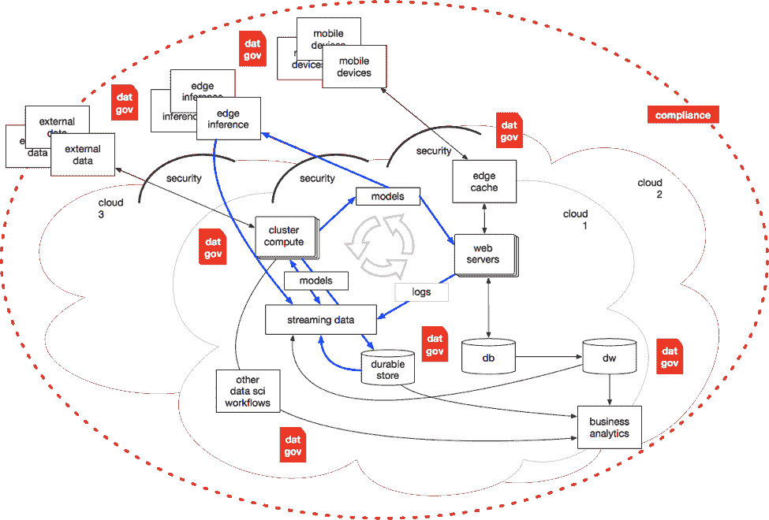

# 每个 Pacoid 的主题和会议，第 8 集

> 原文：<https://www.dominodatalab.com/blog/themes-and-conferences-per-pacoid-episode-8>

*[Paco Nathan](https://twitter.com/pacoid) 最新专栏深入探讨数据治理。*

## 介绍

欢迎回到我们每月一次的主题和会议。本月的文章重点介绍了今年早期数据会议之一的更新，[Strata Data Conference](https://conferences.oreilly.com/strata)——上周刚刚在旧金山举行。特别是，这是我的 Strata SF 演讲“数据治理概述”，以文章形式呈现。它包括关于*数据治理*的当前问题、主题、供应商和产品的观点。

我对数据治理(DG)的兴趣始于 O'Reilly Media 最近关于企业采用“ABC”(人工智能、大数据、云)的行业调查。我在“[人工智能采用的三项调查揭示了来自更成熟实践的关键建议](https://www.oreilly.com/ideas/three-surveys-of-ai-adoption-reveal-key-advice-from-more-mature-practices)中介绍了这些主题，并在本专栏的“[第 7 集](https://blog.dominodatalab.com/themes-and-conferences-per-pacoid-episode-7/)中更详细地探讨了它们。让我们来看看一个调查问题的结果，特别是“您的组织目前正在构建或评估哪些解决方案？”

对于想要投资数据科学的公司来说，前三项基本上是“你知道的魔鬼”:数据平台、集成、数据准备。冲洗，起泡，重复。这是游戏中的赌注。

[数据治理](/choosing-a-data-governance-framework)是企业团队在 2019 年采用或评估的第四种最受欢迎的解决方案。这是一个很大的优先级——尤其是当你将紧密相关的项目组合在一起时，比如排名在附近的*数据血统*和*元数据管理*。此外，更成熟的机器学习(ML)实践比缺乏经验的组织更重视这类解决方案。综上所述，这些观点需要对该领域进行更深入的审查。

当然，我不是 DG 的专家。我有数据科学方面的专业知识，加上云计算、软件架构、自然语言、数据管理等相关领域……所以我*应该*有关于该主题的良好工作知识——但我没有。这给了我一个学习的机会，让我和大多数观众站在了同一立场上。另外,“机器学习原住民”也差不多该开始讨论 DG 了。也许我们可以从不同的角度和优先事项出发，帮助探讨这些问题。

因此，这个月让我们来探索这些主题:

*   2018 年是 DG 失败的爆发点，引发了世界各地的头条新闻，并引发了人们对该领域的兴趣。
*   考虑:ML 对 DG 有什么影响，反之亦然？
*   这里有一个关于问题、工具、供应商、标准、开源项目和其他考虑因素的调查。
*   系统架构的变化反映在我们收集、使用和管理数据的方式上，因此成为 DG 的驱动因素。

最后一点是我将从 DG 那里拿走的北极星。着眼于系统架构的发展变化，了解数据治理的发展方向。

## 定义和描述

为了探究 DG 并公平对待这个话题，让我们从几个不同的角度来探讨。我们将从标准定义开始——目前业内公认的智慧。然后，作为对比，我们将转向“愤世嫉俗的观点”,这种观点在业内也很普遍。接下来，我们将回顾一下对 DG 的复杂性产生了巨大影响的系统架构的发展历史。

另一个注意事项:有些人问为什么这包括这么多关于安全性的细节。简而言之，将安全性、数据管理和系统架构分开是不切实际的(或不负责任的)。由于这三个领域中的任何一个领域都存在挑战和机遇，因此它们会共同发展。更长的答案是，在机器学习用例的背景下，对数据完整性的强假设导致了整体脆弱的解决方案。换句话说，不要指望 100%的安全性、100%的隐私性、100%的正确性、100%的公平性等等。那些日子如果曾经存在过，也早已一去不复返了。相反，我们必须建立稳健的 ML 模型，考虑到我们数据的固有限制，并承担后果的责任。换句话说，#成人化。要获得更详细的解释，请参见本文末尾链接的本·洛里卡和安德鲁·伯特的访谈。

对于定义，让我们从标准的教科书/百科全书定义开始:

*“数据治理包括在整个业务企业中创建一致且适当的组织数据处理所需的人员、流程和信息技术。*

我遇到的最好的一句俏皮话可能是这样的类比:

DG 对于数据资产就像 HR 对于人一样。

这个定义加上一行程序提供了一个很好的起点。此外，在调查文献时，两个关键驱动因素非常突出:

*   **风险管理**是
for DG 在企业中的应用。
*   流程效率(**成本降低**)总体上是
a 第二，priority﹣at 第一，尽管这种情况可能会改变。

另一个趣闻…在最近的三次经济衰退中，DG 支出比整体 IT 支出增加了
faster。因此，它看起来相对抗衰退。我并不是在暗示当前的经济状况与这份报告的时间有关……#只是说说而已。

## 愤世嫉俗的观点

从那时起，我开始有了更愤世嫉俗的观点。这些对对位很有帮助。例如，在谷歌搜索中查看热门文章时， [Rob Karel 在《计算机世界》](https://www.computerworld.com/article/3032333/data-governance-so-mom-can-understand.html)上的文章脱颖而出——忽略了它有些不太合适的标题。套用一句话，即使在有多年数据管理工作经验的人中，DG 的话题也经常被忽略，因为:(1)它很难；(2)有一个漫长的，只求你一个眼球的错误开始的历史。

DG 的实际情况提出了几乎铺天盖地的一系列主题。一些更好的点充其量看起来是无定形的。虽然对于治理的不同方面有许多单点解决方案，但“数据”一词在现在的技术中意味着许多不同的东西，有太多的接触点——我们将在下面回顾。

因此，当我询问这一领域的专家时，毫不奇怪，他们的回答是提问。总的来说，我不相信有很多人是 DG 的专家。对任何人来说，保持一个全面的视角都是困难的。即便如此，越来越多的人担心我们需要解决这个问题。而且很快！

考虑到一些愤世嫉俗者的一些可能动机…我的朋友 Alistair Croll，Strata 的联合主席，写了一篇有趣的文章，“[不同的大陆，不同的数据科学](https://medium.com/@acroll/different-continents-different-data-science-703f5114366) ,"
去年在媒体上。不可否认，这篇文章对人们看待数据的地理差异进行了全面概括。即便如此，这些概括听起来是正确的:

*   中国:人们担心数据的真实性(因为政府倾向于专注于大规模收集数据)。
*   西欧:人们担心数据的存储和分析(因为该地区有严重滥用存储数据的历史先例)。
*   北美:人们担心
acting 对数据产生意想不到的后果(因为，嗯，有太多该死的律师专注于给人们更多的理由来担心所有事情的意想不到的后果)。

可以说，任何这些担忧都可能导致对 DG 解决方案的不信任——或者至少是严重的质疑。然而，总的来说，Alistair 利用这些观点构建了一个重要的视角:

<

p style = " padding-left:40px；"“现实是，任何可靠的数据科学计划都需要
to 担心准确性、存储、分析和使用。”

说得好。

查看我们按地理区域划分的调查结果，有趣的是这些区域对 DG 和相邻主题的优先顺序:北美(最高)、西欧(中间)、南亚和东亚(最低):

至此，我们有了定义和对位。换句话说，要实施的 DG 以及对 DG 实施方式的现实看法。我会很高兴地接受好的和坏的，然后试着看看我们下一步要去哪里。为了更好地了解 DG 的现状和近期前景，首先，让我们仔细看看我们是如何走到这一步的历史。在过去 60 年的 IT 发展中，与安全性、数据管理和系统架构相关的挑战和机遇是如何交织在一起的？

## 图像简史

正如故事所述，DG 的历史分为四个时代:

*   “应用时代”(1960-1990)——一些数据建模，
though 总体上不太关心
*   “企业存储库时代”(1990–2010)——第一代 DG 解决方案
*   “更多政策出台”(2010-2018 年)
*   《闪点》(2018)–[GDPR](https://eugdpr.org/)生效，加上重大数据失误似乎无处不在

*[《华尔街日报》](https://blogs.wsj.com/cio/2018/03/19/%E2%80%8Bthe-morning-download-facebook-at-center-of-global-reckoning-on-data-governance/)* 将 2018 年称为“数据治理的全球清算年”，参考了[对剑桥分析公司](https://www.nytimes.com/2018/03/19/technology/facebook-cambridge-analytica-explained.html)的调查，脸书[受到美国国会](https://www.washingtonpost.com/news/the-switch/wp/2018/04/11/zuckerberg-facebook-hearing-congress-house-testimony/?utm_term=.beb76fcd6b29)关于数据滥用的拷问，以及[数十亿人](https://www.digitalinformationworld.com/2018/12/biggest-data-breaches-of-2018.html)受到各种公司、学校、政府机构等发生的数据泄露的影响。

这当然有助于设定预期。现在对 DG 的关注是非常必要的；然而，这发生在 DG 的现实变得更加复杂的时候。

考虑到这些复杂性，我觉得有必要画些图——试图勾勒出 DG 历史中的“如何”和“何处”,以帮助更好地协调这些问题。

### 20 世纪 70 年代及更早

总的想法是有一个非常大的服务器，加上一些通过专有线路连接的终端。换句话说，[大型机](https://en.wikipedia.org/wiki/Mainframe_computer)在此期间占优势。数据是在那台非常大的服务器中运行的应用程序的一部分。即便如此，除了对访问权限、备份等的系统控制之外，该架构在治理数据方面并没有太大的区别。换句话说，DG 还不是一个完整的东西。

FWIW，我在演讲中问“在穿孔卡片和电传打字机时代，谁开始编程？”MVS、VSAM、JCL、APL 等。幸运的是，其他几个人举起了手。否则，我现在就开始觉得自己老了。或者也许“老”是一个更好的说法。或者什么的。

### 20 世纪 80 年代

六七十年代， [Unix](https://en.wikipedia.org/wiki/History_of_Unix) 发生了，C 编程语言发生了，[小型机](https://en.wikipedia.org/wiki/Minicomputer)发生了， [ARPAnet](https://www.lk.cs.ucla.edu/internet_first_words.html) 发生了，[以太网](https://www.hpe.com/us/en/insights/articles/the-birth-and-rise-of-ethernet-a-history-1706.html)发生了， [UUCP](https://en.wikipedia.org/wiki/UUCP) 发生了。网络出现了。架构改变了。编程风格改变了。软件创业公司获得了更多的关注。许多新颖的想法挑战了将一个非常大的服务器连接到一些终端的传统观念。虽然这些变化的结果需要几年时间才能融合，但最终人们开始考虑一种叫做 **[客户机-服务器的新架构模式。](https://en.wikipedia.org/wiki/Client%E2%80%93server_model)**

客户机-服务器应用程序在一台服务器上运行，然后通过网络与其他服务器通信。电子邮件就是一个很好的例子。

***趣闻:**20 世纪 80 年代初，我参加了一个系统研讨会，参与者是我们系的一些研究生和教授，还有他们来自附近一所大学的同事，他们展示了一个叫做“斯坦福大学网络”工作站的东西。他们成立了一家初创公司，建造这些越来越受欢迎的“ [SUN 工作站](https://en.wikipedia.org/wiki/Sun_Microsystems#History)”。楼上的另一位教授正计划推出一个新的网络协议套件，名为 [TCP/IP](https://en.wikipedia.org/wiki/Vint_Cerf) 。在拐角处，校园内使用的计算机系统的几个系统管理员正忙着挑选研究生和大学资源来构建蓝色塑料“[甘道夫盒子](https://en.wikipedia.org/wiki/Cisco_Systems#History)”——我们用它来在不同的局域网之间切换终端。他们被逮捕并搬出校园，将他们的公司改名为思科。当时我更关心期中考试，在新浪潮乐队中演奏键盘，以及一个被称为“[神经网络](https://en.wikipedia.org/wiki/Hopfield_network)的奇怪研究领域，所以我基本上没有注意到那些公司——DEC、Sun、思科——是如何迅速成为客户机-服务器时代的标志性成功故事的。*

到目前为止，DG 是有限的(见上面的小红点),但正在增长:应用程序不再简单地运行在一个非常大的服务器上，所以登录密码不再完全覆盖访问控制。换句话说，我们隐约知道 DG 最终会被需要，但是没有人真正去做。肯定有标准委员会在某个地方忙于这个问题？(能举出更早的例子吗？在我的公共时间线上发推文建议，时间: [@pacoid](https://twitter.com/pacoid)

### 20 世纪 90 年代

啊哈！这里是 DG 行动开始发生的地方。到了 20 世纪 90 年代， [*网间互联* g](https://en.wikipedia.org/wiki/Internetworking) (TCP/IP)已经成为一个流行的东西。运行在互联网上的应用程序推动了架构的重大变化，从而改变了我们对如何管理数据的观念。

***趣闻:1992 年 12 月，我用一种叫做 [Gopher](https://en.wikipedia.org/wiki/Gopher_(protocol)) 的互联网应用程序，与人合伙创办了一家电子商务公司(实际上是一个在线邮购目录)，这种应用程序在当时相当流行。一些相关人士询问这种做法是否合法……说真的，通过由大学、公司和政府机构托管的计算机网络从事商业活动，利用文件传输和电子邮件牟利，真的可以吗？原来是这样。除了我们的[古怪的媒体集体](https://web.archive.org/web/19990117093314/http://fringeware.com/)在大众的要求下，仅仅几个月后就转向了 WWW。和世界其他地方一样。抱歉地鼠。***

 **作为网络的一个结果，客户-服务器时代的两层架构让位于三层架构。*表示层*将 UX 移动到浏览器中。之前存在于应用程序中的业务逻辑现在被重构到一个*中间层*层中——很快被称为“中间件”也就是*应用服务器*。越来越多的，这些仅仅是网络服务器。大多数数据管理转移到后端服务器，例如*数据库*。所以我们有三个层次来提供关注点的分离:表示、逻辑、数据。

请注意，[数据仓库](https://en.wikipedia.org/wiki/Data_warehouse#History) (DW)和商业智能(BI)实践都出现在大约 1990 年。考虑到这两个因素，再加上 SQL 作为一种数据库策略越来越受重视，一幅明显的关系图在这十年间融合在了一起。因此，DG 的“企业存储库时代”作为一种行业实践出现在所有关系中的第三层。

那些时候相对简单:将所有数据保存在数据库中，远离网络边界，远离攻击者，遵守明确定义的权限策略–哦，对了，记得执行备份。

### 2000 年代

现在情况开始变得更加混乱。 **[云](https://dash.harvard.edu/bitstream/handle/1/24829568/tr-08-07.pdf?sequence=1)** 介绍:亚马逊 AWS 于 2006 年推出公测版。手机问世:2006 年，“ [CrackBerry](https://en.wikipedia.org/wiki/Smartphone#Early_smartphones) ”一词成为时尚，随后第二年 iPhone 发布。边缘缓存对于管理从网络服务器到移动设备的数据变得至关重要。VPN、 [IDS](https://en.wikipedia.org/wiki/Snort_(software)) 、网关、各种嵌入式解决方案、将外围环境中的所有防入侵措施捆绑在一起的 sim 等网络安全技术层出不穷。电子商务变得越来越大，并成为许多安全问题(如信用卡)的强制功能。数据在移动。

本世纪初崛起为科技巨头的公司有很多共同点。最初的四个独立地认识到 RDBMS 许可的过高成本将如何阻碍他们成长的业务。相反，大约在 1997 年末，他们[基于*水平扩展*方法和明显更少的直接使用 SQL，重构了他们的单片网络应用](http://glinden.blogspot.com/2006/02/early-amazon-splitting-website.html)(例如，中间件)。这导致了服务器农场，从客户互动中收集大量的日志数据，这些数据然后被聚合并输入到机器学习算法中，这些算法创建了 [*数据产品*](https://www.oreilly.com/ideas/data-jujitsu-the-art-of-turning-data-into-product) 作为预先计算的结果，这反过来使 web 应用程序更加智能，并增加了电子商务收入。此外，这些数据开始大量地在移动设备之间来回传输。吴恩达后来将这种策略描述为“人工智能的良性循环”——也称为*飞轮效应*。换句话说，那些早期的科技巨头一举发明了云、大数据和早期的数据科学实践。Booyah！

注意 DW+BI 是如何在图的*后端服务器*角落结束的，DG 是一个组件。在图的其余部分，已经发生了很多变化，但这一部分没有——DG 仍然愉快地享受着它的“企业存储库时代”的宁静日子。如此多的数据流经其他部分，但这不是 DG 解决方案所关心的。还没有。

***有趣的事实:**2011 年，谷歌收购了之前的[摩托罗拉](https://www.google.com/press/motorola/)的残余部分。后来，他们卖掉了公司的大部分，保留了一些知识产权，并且保留了内部文件的副本。在这个档案中的某个地方，有一份 1990 年的内部白皮书，内容是关于“使用神经网络和硬件加速的智能手机应用程序”——由 yours truly 合著——负责大胆技术计划的摩托罗拉高管阅读了这份白皮书，并没有发现特别有趣。我觉得那很有趣。*

### 2010 年代

云在发展。电子商务变得巨大。现在几乎每个人都有一部智能手机。我们之前提到的日志数据现在占了世界上大多数数据。数据科学有自己的[技术大会](https://conferences.oreilly.com/strata)。

来自机器的数据往往会(又名， *[静态数据](https://en.wikipedia.org/wiki/Data_at_rest)* )存放在*的耐久商店*，如亚马逊 S3，然后被 Hadoop、Spark 等使用。不知何故，数据的重力产生了地质效应，形成了 *[数据湖](https://www.kdnuggets.com/2018/06/data-lake-evolution-data-processing.html)* 。

此外，数据科学工作流开始创建从上述 illo 的大数据端到 DW 端的反馈循环。这在早些年是异端邪说。DG 是为全球大数据领域而出现的，例如，2012 年发布的 Alation。

简而言之，良性循环在增长。我们一直在给怪物提供数据。我们找到了改进机器学习的方法，使其需要数量级以上的数据，例如，[用神经网络进行深度学习](https://papers.nips.cc/paper/4824-imagenet-classification-with-deep-convolutional-neural-networks.pdf)。

***趣闻:** Satyen Sangani 和我是在 2012 年的一次大数据会议后，在山景城的一家[标志性的西雅图咖啡馆连锁店](https://www.google.com/maps/place/Starbucks/@37.4210666,-122.0967388,16z/data=!4m15!1m9!2m8!1sstarbucks!3m6!1sstarbucks!2sCostco+Wholesale,+1000+N+Rengstorff+Ave,+Mountain+View,+CA+94043!3s0x808fba0558b2a12f:0xbb457a3972673971!4m2!1d-122.0958161!2d37.4210332!3m4!1s0x0:0x490b0306da6e619b!8m2!3d37.4217996!4d-122.0964195)相遇的，在那里他在一张众所周知的餐巾纸的背面勾画了关于如何处理大数据工具的数据治理的想法——从数据目录开始，以跟踪数据集及其来源。真希望我留着他的餐巾，但这可能会让人毛骨悚然。几个月后，我去位于帕洛阿尔托的新办事处拜访了 Satyen，他们已经成为大银行的客户。*

### 2020 年代

换句话说，从我们现在所处的位置向前看。这是一个多云的世界。这是一个混合云世界。还有更多移动设备。然而，也有一个巨大的海啸边缘推理设备得到部署。有数据 API、各种 SaaS 服务、合作等。所有这些都带来了关于治理和法规遵从性的潜在问题。

安全性不再位于组织网络资产的外围。取而代之的是，许多关于安全的智能已经被推到了新一代的[边缘缓存](https://www.cloudflare.com/)(用 [HSTS](https://en.wikipedia.org/wiki/HTTP_Strict_Transport_Security) 代替 [MITM](https://en.wikipedia.org/wiki/Man-in-the-middle_attack) ， [DDoS](https://en.wikipedia.org/wiki/Denial-of-service_attack) )。接下来是架构上的变化，如 [JAMstack](https://jamstack.org/) 和作为云计算第二个十年的[模式的“无服务器”整体转向。](https://rise.cs.berkeley.edu/blog/a-berkeley-view-on-serverless-computing/)

良性循环越来越快。流数据和发布/订阅架构通过 Kafka、Pulsar 等推送数据。，而不是简单地降落在数据湖中。机器学习中较新的工作(例如 *[强化学习](https://arxiv.org/pdf/1806.09460.pdf)* )需要数量级更多的数据，并且需要它是流式的。

到处都是模特。模型用于电子商务，但现在用于许多其他用例。它们嵌入低功耗设备中，有时甚至用于数据管理。现在有人呼吁*模式治理*。

游戏的赌注已经改变。民族国家眼睁睁地看着他们的政体因数据隐私问题和系统被不良分子滥用而遭到破坏。数十亿人成为数据泄露的受害者。黑客真的不再有趣了。数据被武器化。

一个巨大的**顺应性**环围绕着以上所有。 [GDPR](https://gdpr-info.eu/) (通用数据保护条例)已经在欧盟实施，但它适用于在世界任何地方使用的任何欧盟数据。几个月后，加州紧随其后，颁布了(加州消费者隐私法案)，美国其他州也纷纷效仿。换句话说，GDPR 式的发展已经成为定局。

有 DG 点解决方案，虽然没有太多的连接块。巴尔干化可能是一个很好的描述。较大的供应商开始谈论一种新的“结构”,这种结构允许相同的 DG 策略和流程跨多个云、混合云、本地云等应用。，将各种单点解决方案整合成一种更普遍的方法。坦率地说，如果实施得好，这是有道理的。

有趣的事实:我们现在都站在这里。一起。可以说，有点困惑，也许有点枪伤。Booyah！

## 简而言之，断开连接

我对这个叙事弧线的解读是，大约在 2001 年出现了一些真正奇怪的紧张关系:

*   可以说，这是 DW+BI 的鼎盛时期
*   [*敏捷宣言*](https://agilemanifesto.org/) 发表
*   一代开发人员将“数据库”等同于“关系型”，认为**系统的易读性=那些系统内的数据的易读性(*提示*:不)**
*   即便如此，作为对 RDBMS 定价的反应，新崛起的科技独角兽集体转向 NoSQL
*   [机器学习](https://projecteuclid.org/euclid.ss/1009213726)开始成为一项大型商业努力，尽管 DG 解决方案没有考虑道德、偏见、隐私、安全等因素。，在 ML 的上下文中
*   科技独角兽开始"[快速移动并打破东西](https://www.goodreads.com/book/show/31420725-move-fast-and-break-things)"而没有充分关注 DG

通过举手表决，术语“数据”在敏捷宣言中出现了多少次？5 次？3 次？一次？零？如果你回答“零”，你就赢了！抱歉，敏捷里没有数据。

坦率地说，考虑到所有这些因素，它们并不一致。乱七八糟。大约从 2001 年开始，这是一个非常大的混乱，现在变得相当危险。换句话说，在我看来，这个问题的要点是:

*   一代主流开发者被教导
“编码是迫在眉睫的，数据是次要的”
*   与此同时，拥有先发优势的科技巨头纷纷涌向
" **学习是卓越的，数据是竞争优势**

请思考一下这两种说法之间的矛盾。如果你的组织倾向于前者，请重新考虑你的情况。

二十年后，我们仍然停滞不前，而由于边缘推理、流数据、多云、更多安全问题等，环境变得更加复杂。幸运的是，有一个名为首席数据官(CDO)的新 C 级职位将神奇地解决这些问题！

哇，首席数据官，这可真棘手！请让我第一个祝贺你担任新职务。有太多的机会来改变现状。

说到魔法，我就把这个放在这里，在“再次制造象限魔法”(MQMA)的副标题下。

## 近期展望

让我们快速看一下现在有哪些资源可用，以及近期会出现哪些趋势。

## 供应商前景

大鱼–IBM、SAS、Informatica、SAP 等。–拥有成熟的产品，此外，这一领域现在有几家科技企业。我一直在收集这一领域的风险投资信息，并把它们作为资源在网上发布。请注意，这些数字是从 Crunchbase 引用的，可能会有一些延迟-一些供应商提到这些数字被缩小了。通过 Twitter 上的 [@pacoid](https://twitter.com/pacoid) public timeline 让我了解评论、更正、建议或任何其他信息。

 A quick tour through that vendor list shows a mix of early-stage, growth-stage, several firms taken by private equity, even a public listing – Varonis was the [first tech IPO of 2014](https://www.investors.com/news/technology/varonis-systems-soars-after-ipo-for-big-data-firm/).

快速浏览一下供应商名单，可以看到早期阶段、成长期阶段、被私募股权收购的几家公司，甚至是公开上市的公司——瓦罗尼是 2014 年第一家上市的科技公司。

请注意，我们在 Strata Data 会议上展示该材料的目的是试图促使该领域的供应商提出他们自己的意见。我很高兴地报告，我们的第一次演示取得了预期的效果:我们现在正在寻找 Strata 的 DG 跟踪，其中 3-4 家供应商经常是会议赞助商。让我特别感兴趣的是那些对 DG 解决方案没有强烈认同感的供应商的对话；但是，他们的客户使用案例对 DG 有着强烈的需求。这些公司希望在组合中包含客户案例研究，这一点非常突出。

## 开源，开放标准

各种开源项目和新兴的开放标准满足了 DG 的需求。

Egeria 项目提供了数据资源的企业目录。它的一些最大卖点包括:

*   提供开放的 API、类型和交换协议。
*   允许元数据存储库共享和交换。
*   为自动化元数据的收集、管理和使用添加了治理、发现和访问框架。
*   验证产品的一致性。

另请参见 IBM UK 的 Mandy Chessell(2017–04–21)的论文“[开放元数据的案例](https://zenodo.org/record/556504#.XJWaZBNKgWo)”，了解关于开放元数据的令人信服的观点。

Apache Atlas 是 Egeria 的一个类似 Hadoop 的本地参考实现。[阿帕奇 NiFi](https://nifi.apache.org/) 也触及了一些 DG 关心的问题。

[Marquez](https://github.com/MarquezProject/marquez) 是一个由 WeWork 和 Stitch Fix 赞助的项目，旨在“收集、聚合和可视化数据生态系统的元数据”，这听起来与 Egeria 的某些方面大致相似。也许在那里出现了共同点？

[WhereHows](https://github.com/linkedin/WhereHows) 是 LinkedIn 的一个 DG 项目，专注于大数据。最近有来自优步的消息，关于他们的[数据手册](https://eng.uber.com/databook/)项目，似乎已经从 Hows 得到了灵感。

W3C 拥有 [PROV](https://www.w3.org/TR/2013/NOTE-prov-overview-20130430/) 系列标准“以实现异构环境(如 Web)中出处信息的互操作交换”，以及 Python 中的[实现，加上伦敦大学国王学院的开放出处相关研究。](https://github.com/trungdong/prov)

向 NOAA 的 Kim Valentine 致敬，美国正在酝酿一项新的联邦数据战略，需要你的参与。现在是时候开始了解如何利用数据作为美国的战略资产了。

## 机器学习会改变优先级吗？

ML 用例的激增以及[随后对
data](https://www.youtube.com/watch?v=21EiKfQYZXc&feature=youtu.be&t=141) 培训和测试模型的需求带来了新的挑战:

*   分析工作流程中对[再现性](https://twitter.com/peterwrose/status/1053156027602878465)的需求变得更加迫切。
*   模型[可解释性](https://github.com/oracle/Skater)很难，因为“解释”这个词在法律、医学、新闻、金融等领域有不同的含义。
*   董事会和高管人员受到概率系统和决策分解的挑战。
*   ML 倾向于从数据中归纳，所以我们不再假设 100%正确、100%隐私、100%安全等。，而是必须承认并拥有结果。
*   现在更加关注模型治理——模型是数据的代理，因此是 DG 的更好关注点吗？

我不会在这里假装有答案。我几乎不理解最初问题的大致轮廓——这又回到了我最近询问 DG 专家的经历。

我认为，Spotify 产品经理艾琳·gonzálvez
在 2018 年西班牙大数据大会上的演讲“数据隐私@Spotify”是一个很好的近期前景说明。

我很幸运地与艾琳进行了长时间的交谈，并留下了鲜明的印象:( Spotify 的那些人非常聪明；(2)也许 GDPR 并没有那么糟糕。她的演讲集中在“挂锁”上，这是 Spotify 的一个全球钥匙管理系统，也是
handles 用户同意的。换句话说，只有首先加密，数据才能持久化。这降低了数据泄露的风险；例如，攻击者可能会窃取数据，但数据会被加密。

此外，一个团队管理所有
customer 数据的整个生命周期；Spotify 中的其他用例必须按用户请求密钥，然后才能使用这些数据。然后，当客户根据 GDPR 要求
requests“被遗忘的权利”时，合规很简单:从挂锁中取出他们的钥匙。

另一个很好的资源是最近的 O'Reilly Data Show 播客采访“[机器学习如何影响信息安全](https://www.oreilly.com/ideas/how-machine-learning-impacts-information-security)”，来自 [Immuta](https://www.immuta.com/) 的 Andrew Burt。这篇文章回顾了最近的一份白皮书，这份白皮书被强烈推荐，并阐述了隐私和安全性是如何融合的，以及我们将如何减少源代码，增加源数据。

有效的数据治理需要对手头的问题进行大量的反思。我的直觉是，像 Spotify 和 Immuta 这样的公司(以及许多其他公司！)正在指出我们共同的近期未来的形状。即使在风险、边缘情况、法规遵从性和其他因素的复杂环境中，也有适应的方法。

如果你想看我的整个演讲，可以在 https://derwen.ai/s/6fqt 的 T2 看幻灯片，几周内会有一个视频在网上发布(尽管是在奥莱利媒体付费墙后面)。

感谢马克·马德森和瓦尔·贝尔科维奇的指导，特别是本·洛里卡强迫我这么做。**