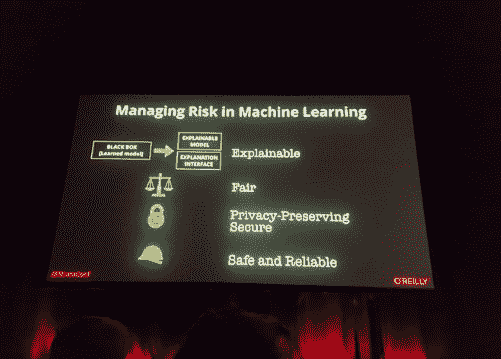
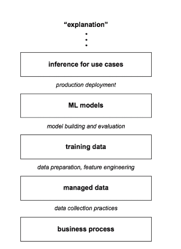

# 每个 Pacoid 的主题和会议，第 9 集

> 原文：<https://www.dominodatalab.com/blog/themes-and-conferences-per-pacoid-episode-9>

Paco Nathan 的最新文章展示了与模型可解释性相关的几个新兴线索。

## 介绍

欢迎回到我们每月一次的主题和会议。几个技术会议都发生在充满乐趣的四周内: [Strata SF](https://conferences.oreilly.com/strata/strata-ca) 、 [Google Next](https://cloud.withgoogle.com/next/sf/) 、[美中创新 CMU 峰会、](https://cmu-iea.com/) [AI NY](https://conferences.oreilly.com/artificial-intelligence/ai-ny) 和 [Strata UK](https://conferences.oreilly.com/strata/strata-eu) ，以及其他一些活动。我已经离开了*主题定位*，本月的文章介绍了几个与机器学习模型的*可解释性*相邻的新兴线索。

快速总结:有一个棘手的问题。二十年前，通过将简化技术应用于项目规划和管理，软件工程取得了重大突破。不可否认，在计算机科学的大部分领域中，还原论表现得相当好。由于它们的成功，涉及诸如敏捷和精益这样的词的方法已经变得很熟悉了。他们已经成为工程领域的“嵌入式机构”。不幸的是，ML 应用程序引入的扭曲不是工程可以解决的问题。我最近看到的几个 IT 高管的谈话中就有很好的例子。强调对 ML 模型可解释性需求的那些高管，往往也是那些过分强调机器学习的工程方面，而忽略了社会背景，使得模型可解释性几乎不可能的人。

相比之下，一些正在探索模型解释的定义、可能性和局限性的研究人员倾向于更全面的观点。例如，收集数据以构建训练数据集的常见做法往往会在过程中丢弃有价值的信息。

为什么？在我看来，这里的主题是转移推理的更深层次——如可解释性、可审计性、信任等。–回到数据集的结构。

简化论的视角和对工程的过分强调成为数据科学工作的致命弱点。相反，考虑从数据收集一直到推断的“全栈”跟踪。让我们看看一些解药。

## 机器学习模型的可解释性

在 CMU，我加入了由扎卡里·利普顿主持的一个小组，会上有人问了一个关于机器学习模型解释的问题。如果你一直在关注利普顿的工作——或者如果你看过我去年的主动学习调查演讲——你可以想象接下来会有一场热烈的讨论。利普顿写了一篇早期的、经常被引用的批评 ML 模型解释的立场文件:“[模型可解释性的神话](https://arxiv.org/abs/1606.03490)”其他良好的相关论文包括:

*   [迈向可解释机器学习的严谨科学](https://arxiv.org/abs/1702.08608)
    压轴 Doshi-维勒兹，后土金(2017-02-28)；另见关于 TCAV 的[多米诺博客文章](/blog/model-interpretability-tcav-testing-concept-activation-vectors/)
*   [透明度的挑战](https://arxiv.org/abs/1708.01870)
    艾德里安·韦勒(2017-07-29)
*   [黑箱模型解释方法综述](https://arxiv.org/abs/1802.01933)
    Riccardo GUI dotti 等(2018-06-21)

值得注意的是，用于 ML 模型解释的开源工具已经获得了发展势头，出现了超级有趣的项目，如[滑手](https://github.com/oracle/Skater)、[石灰](https://github.com/marcotcr/lime)、 [SHAP](https://github.com/slundberg/shap) 、[主播](https://github.com/marcotcr/anchor)、 [TCAV](https://paperswithcode.com/paper/interpretability-beyond-feature-attribution) 等等。数据科学团队需要将这些作为其流程和工作流的一部分，我们稍后会谈到这一点。

即便如此，也要注意不要把机器学习模型的*可解释性*当成一种健壮的技术能力。还没有，如果有的话。决策是一个复杂的过程，有太多的问题需要考虑。让我们来看两个问题，这两个问题更多的是社会问题，而不是技术问题。一方面，如果你是医生、律师或记者，单词*解释*本身有不同的意思。对于所有垂直行业的要求，没有一个*通用的*定义。举例来说，如果立法者——他们不理解机器学习的细微差别——试图*定义*解释一个词的单一含义，这是有风险的。另一方面，正如 Lipton 所强调的，虽然工具产生了有趣的可视化，但是可视化并不意味着解释。后者是人类的一种品质，而且相当狡猾。再说一次，这不是归属于规则和算法的事情。

## ML 模型的可解释性和数据可视化

根据我领导数据团队的经验，当企业面临困难的挑战时，数据可视化可能会有所帮助，也可能会有所损害。一个真正糟糕的方法是，分析师带着数据可视化走进一个重要的会议，并试图为处理危机的利益相关者解释它。这就相当于公司里的人工解释。对于分析师来说，更有效的方法是为手头的问题创建各种数据可视化，然后让业务涉众讨论所展示内容的相关性和意义。

St Paul’s from Madison London

这种类比适用于 ML 模型解释，尽管方向相反。商业利益相关者不能依赖可视化来解释他们的数据科学团队产生的 ML 模型。要点在于，ML 模型是训练集特征的一种代理，训练集特征是基础历史(或合成)数据的视图，其本身可能不完整或不准确。模型预测能力的可视化增加了另一个抽象层。可视化在数据科学工作中至关重要，但需要注意的是，它们所传达的信息可能是与被测量的实际业务流程相距 4-5 层的抽象层。信息在被抽象那么多次后会变得非常失真。请记住，可以说 [*热图不是*](https://en.wikipedia.org/wiki/Map%E2%80%93territory_relation) 的领地。

## 使用算法解决非算法问题

总的来说，浏览上面列出的论文，很明显 ML 模型解释的问题没有神奇的解决方案。还没有。虽然民粹主义呼吁 ML 模型应该是可解释的——我在这些会议上看到几乎每个高管级别的幻灯片中都提到了这一点——但我们不应该指望技术修复，也不应该试图对它们进行立法。只要研究界还在为最基本的定义而挣扎，监管者就不太可能有一致的方法来衡量 ML 的可解释性，更不用说“强制”使用它了。企业也应该明智地调整自己的观点。

换句话说，**不要试图用算法来解决通过使用算法**所经历的非算法问题。博凯？

## 不是一个纯粹的计算问题

与此同时，让我们切换到本·洛里卡最近接受 Poursabzi Sangdeh 、[的](https://www.oreilly.com/ideas/its-time-for-data-scientists-to-collaborate-with-researchers-in-other-disciplines)[采访，在*奥赖利数据秀播客*上](https://www.linkedin.com/in/forough-poursabzi-sangdeh-479156a1/)“是时候让数据科学家与其他学科的研究人员合作了:

许多当前的机器学习应用增强了人类，因此 Poursabzi 认为数据科学家与其他学科的研究人员密切合作非常重要。

真心话很少说。例如，在使用算法决策的关键领域，它们几乎总是 ML 模型加上人们一起努力做出决策的实例:

*   谁获得贷款批准？
*   谁会被缓刑释放？
*   谁会被录用？

查看播客[采访](https://www.oreilly.com/ideas/its-time-for-data-scientists-to-collaborate-with-researchers-in-other-disciplines)了解更多细节。在这个领域的初步研究之后，Poursabzi 对机器学习模型的可解释性概念感到困惑。显然，ML 中有技术成分；然而，还有一个*人机界面* (HCI)组件。这不是一个纯粹的计算问题。

## ML 可解释性:解开冲突的优先级

Keynotes at Strata UK. [Image Credit](https://twitter.com/innatok/status/1123511996224290816?s=20).

回到 Ben Lorica 和 Forough Poursabzi 之间的采访，几乎任何关于机器学习中可解释性的讨论都会纠缠一系列相互冲突的优先事项:

*   *可解释性*
*   *信任*
*   *清晰度*
*   *透明度*
*   *可审计性*

不言而喻，这是一个加载的参数，需要解包。

单词*解释*本身就有一个含义，即人们应该能够以人类可以理解的方式描述系统的内部。一个潜台词经常伴随着:任何解决方案都应该有足够的*完整性*，它适用于一般情况，即超出训练数据——否则它作为解决方案就没有意义。可解释性加剧了这两点之间的矛盾:你希望你的 ML 模型解释简单还是完整？一般来说，你不能两者兼得。例如，在更近的深度学习工作的情况下，完整的解释*可能*是可能的:它*可能*也需要难以理解的参数数量。

考虑到对风险和成本的担忧是如何驱动 IT 的，实际上*可审计性*是许多商业利益相关者的首要任务。然而，从更长远的角度来看，在生产中部署的 ML 模型，*可理解性*代表了风险和成本的现实优先事项:对技术债务的考虑，检测错误的能力，故障排除，等等。另一个需要考虑的关键因素是:参与自动化增强的任务的用户经验如何？

这些优先级中的一些是模型和系统设计的属性，而另一些是人类行为的属性。Poursabzi 强调了关于信任、可审计性等问题的一个很好的观点。：

如果你不从人类的角度来考虑这些问题，它们是不可能回答的。

在这里，她切入了关于机器学习实践的一个核心观察，我很少发现在学术界提到过，在工业界几乎从来没有。如果你在建模上投入足够的时间，你通常可以为给定的问题找到相对简单的模型。让我们打开那个:它相当重要。机器学习领域的许多工作——无论是专注于发表论文的学术方面，还是专注于投资回报率的行业方面——都倾向于强调:

*   模型有多大的预测能力(精度、召回率)？
*   它是否超越了现有的基准，也就是说，它是 SOTA 吗？
*   模型能训练多快？
*   它能多快推断出结果？
*   培训花费了多少？
*   跑步要花多少钱？
*   对于非专家来说，训练这个模型有多容易？(自动)

为了快速获得预测能力——也就是更便宜——结果将倾向于更复杂的 ML 模型。如果您的“性能”度量关注于预测能力，那么您可能会得到更复杂的模型，因此更难解释。权衡是数据科学团队是否投入时间来迭代超越单纯的预测能力，以达到同样有效的更简单的模型，并且还具有更好的*可审计性*、*可理解性*等。

然而，当你强调完整性时，你得到的解释可能很全面，但对人类来说更难理解。因此，不太好解释。

您的数据科学团队遵循的流程和优先事项将对 ML 模型的可解释性带来潜在风险。

## ML 模型的可解释性:预期用途的背景

Poursabzi 的另一个重要观点是，ML 模型的可解释性应该在其预期用途的背景下进行研究。换句话说，是否有任何人体实验来评估这些模型？

对于数据科学团队来说，这可不是什么好消息，因为管理层要求他们“敏捷”并快速制作大量模型。相反，团队应该花足够的时间来:

*   构建更简单的模型，保留预测能力，同时更易于理解
*   评估模型对人类主体的影响
*   衡量受试者信任模型结果的能力

这些工作很难或者不可能自动化。他们还需要统计学、实验设计、因果推理等方面的高级技能——比大多数数据科学团队都要高。另外，社会科学比计算机科学更倾向于教授这些技能。请记住，数据科学基本上是跨学科的。也许这一点说明了拓宽数据科学从业者的课程和培训的需要，提高了标准？

## “敏捷”在社会环境中几乎没有任何意义

如上所述，对于数据科学团队来说，使用任何可用的工具来解释他们生成的模型是非常重要的。这种方法产生了反馈循环，因此构建模型的人可以从他们的结果中学习洞察力。特征工程可以改进吗？早退一步，数据能增强吗？模型结果是否适合客户的环境？有任何人体实验吗？

这就是我被那些使用诸如敏捷或精益这样的词汇来描述数据科学过程的人所迷惑的地方。敏捷最初是关于快速迭代代码库及其单元测试，然后在利益相关者面前得到结果。投入时间寻找更简单、更容易排除故障的模型并不是一种特别[敏捷](http://agilemanifesto.org/)的方法。

或许，如果机器学习只是用来优化广告或电子商务，那么敏捷的概念就足够了。仅仅是一个“训练数据创建模型，根据测试数据评估”的机械化问题，也许可以翻译成纯粹的工程术语。十年前可能是这样，但那些日子早已过去。机器学习被用于驾驶公共汽车(现在在欧盟的机场)，协调医院内部的运作，假释委员会，贷款申请，开发药物以及其他领域，在这些领域中，仅基于软件工程方法的决策会导致灾难和诉讼。

深究这一点，为机器学习问题编写“单元测试”的想法是一种谬误；然而，这正是 *[测试驱动开发](http://agiledata.org/essays/tdd.html)* 和其他敏捷方法所要求的。相反，团队必须投入大量时间来处理培训数据、研究各种模型、使用实时客户数据进行评估等等。奔向 *[最小可行产品](https://en.wikipedia.org/wiki/Minimum_viable_product)* 将倾向于产生更复杂和更难解释的模型。创建更难解释、更难排除故障的模型并不能满足涉众的需求，而且显然不是敏捷的。

## ML:社会系统和环境

 Strata chair [Ben Lorica](https://twitter.com/bigdata), coordinating backstage.

在 Strata UK 的后台，我和詹姆斯·伯克聊了一会儿，就在他走上台做我参加过的最精彩的主题演讲之一之前。他谈到了 *[还原论](https://en.wikipedia.org/wiki/Reductionism)* 的风险和笛卡尔的可疑遗产。关于*的终结稀缺*是经济学、政治话语、教育等的驱动力。关于技术上的巨大转变几乎总是来自意料之外的用途。关于我们现在需要争论的问题是如何*嵌入机构*阻止我们认识到就在我们眼皮底下的巨大进步。

网络上流传着一个马特·韦洛索的笑话:

*如果是用 Python 写的，很可能是机器学习。如果是用 PowerPoint 写的，很可能是 AI* 。

Poursabzi 和越来越多的研究人员指出了比 Twitter 上流传的人工智能/PowerPoint 笑话更有用的定义:

*   ML 是关于使用工具和技术的
*   人工智能是关于改变社会系统的

开发人工智能不再仅仅是工程过程，也不是幻灯片笑话。关于社会体系和环境，这越来越成为一个严肃的问题。关于人工智能，我们今天的嵌入式机构是:敏捷式的概念，对工程方法的过分强调，对机器学习解释的民粹主义呼吁，等等。

我们必须从社会系统中整合的人工智能的关键方面超越了机器学习的简化论观点。充分披露:这就是为什么我认为使用*机器学习工程师*这个头衔是一个传统组织的标志，并且最终亚马逊和谷歌都可能失宠，至少是因为他们目前营销基于云的人工智能服务的方法。但是我跑题了。

超越嵌入式机构的束缚，我认为人工智能中的社会系统工作将成为下一代*产品管理*的主要焦点。正如 O'Reilly 调查和其他最近的报告所表明的那样,“人工智能产品管理”的状态甚至还没有进化到原始的汤阶段。[皮特·斯科莫罗奇](https://twitter.com/peteskomoroch)在英国 Strata 做了一个精彩的演讲，概述了人工智能背景下所需的产品管理形式，这是他的[幻灯片](https://cdn.oreillystatic.com/en/assets/1/event/292/Executive%20Briefing_%20Why%20managing%20machines%20is%20harder%20than%20you%20think%20%20Presentation.pdf)。我有一种预感，这仍然是一个小小的简化论者，缺乏社会系统方面——尽管这可能有助于达到更广泛的受众基于他们目前的想法？总的来说，从方向上来说，这很酷。

真正让我抓狂的是，在一个问题/解决方案纠缠的提喻中，有多少呼吁 ML 模型可解释性的高管经常是那些过分强调工程和敏捷概念的人。伯克在他的主题演讲中用康沃尔矿业高管作为例证，他们并非完全不同:与经济困境作斗争，几乎将员工推向死亡，不顾一切地提取最后一点锡矿石，即使面对收益递减——而事实上，他们的人在瓦特蒸汽机设计上进行创新，创造了[高压变体](https://en.wikipedia.org/wiki/Cornish_engine)。

几十年后，那个时候的詹姆斯·伯克可能会引导观众经历一场大约 2020 年的搞笑“连接”之旅，思考“敏捷人工智能”——回到人们被雇佣来编写软件的时候——当时一个名为“IT”的落后行业是如何完全忽略了这一点，然后不久就变得默默无闻。

在谷歌研究博客上，2009 年的论文“[数据的不合理有效性](https://research.google.com/pubs/archive/35179.pdf)”和 2017 年的更新[“重新审视数据的不合理有效性”之间有一个有趣的叙事弧我建议比较一下这两者，注意后者侧重于计算机视觉。回到高管们的幻灯片，以前的论文被错误引用了。拥有更多数据通常更好；然而，有微妙的差别。大数据*卷*一定是一种内在的美德，这可能不仅仅是一种确认偏见——否则为什么要花费所有的数据工程成本来存储它呢？](https://ai.googleblog.com/2017/07/revisiting-unreasonable-effectiveness.html)

与 ML 模型可解释性相邻的新兴线索之一表明，数据科学团队可能需要重新思考他们的训练数据集是如何构建的。或者至少更仔细地观察这一解释过程，而不是依赖于根据数据建立的模型的事后解释。

这部分旅程的第一站是斯坦福大学的庞伟·高(Pang Wei Koh)和珀西·梁(Percy Liang)2017 年的作品“[通过影响函数](https://arxiv.org/abs/1703.04730)理解黑盒预测”。使用[影响函数](https://en.wikipedia.org/wiki/Robust_statistics#Empirical_influence_function)可以追溯到 20 世纪 70 年代稳健统计学。Koh 和 Liang 在机器学习中应用了这种方法，通过学习算法跟踪模型预测，并返回到训练数据。这可用于检测和修复数据集错误、了解模型行为、故障排除和创建训练集攻击。

 [Robotic bartenders mixing my Negroni cocktail at Strata UK.](https://www.instagram.com/p/Bw42G1MlHJZ/)

我们从纽约湾区的研究人员那里得到了两个非常有趣和非常有用的更新。斯坦福大学教授 [Chris Ré](https://cs.stanford.edu/~chrismre/) 介绍了关于*监管不力*的[软件 2.0 和浮潜](https://www.youtube.com/watch?v=TWv5yb_0OEw&feature=youtu.be)。换句话说，Ré观察到，在许多情况下，有专门形式的编程标记用于建立训练数据集。这些在源数据中创建了*结构*，尽管是以隔离的方式。浮潜将这些特别的方法正式化，以利用进入数据集的*监督*—*监督学习*的关键要素:

*大主题:利用组织知识资源快速有效地监管现代 ML。*

这有助于更快地创建良好的训练数据，有助于随着时间的推移管理数据，也有助于构建更高质量的 ML 模型:

仅仅知道每一个标签的来源就有相当大的力量。

我会让你把对模型解释的影响联系起来。提示:考虑短语*模型谱系*，并认识到并非训练数据集中的所有行都同样有价值。这就涉及到了*模型治理*中的核心问题。考虑用于编程标记的概率方法通过从业务过程直到训练数据、建模、推理以及最终结果解释的所有抽象级别保留更多信息。伯克用参加会议来说明信息是如何暗示变化的，并解释说:“告诉你你正在参加一个会议并没有传达任何信息。你已经知道了。然而，声明坐在你旁边的人患有传染病，这意味着改变。”粗略地说，这就是雷在这里所描述的。

让我们试着用图表来说明这一点。将下面的图表想象成“堆栈”，其中中间的斜体字(例如，“数据收集”)显示团队执行的“过程”步骤，而方框(例如，“培训数据”)显示有形的结果。表面上，业务是作为最有形的一层来运营和衡量的——在图表的底部。抽象出一个更高的层次。抽象出一个更高的层次，你就有了一个训练数据集。如此等等。近似、失真、方差和其他令人烦恼的人为因素几乎在每一个层次都会被引入，这会破坏信息。如果你的目标是得到某种可解释的推论作为最终结果，你必须自始至终考虑那些工件。当前一代的 ML 模型可解释性工具倾向于在“ML 模型”阶段获得，忽略了达到该点所需的其他步骤——这是 Zachary Lipton、Forough Poursabzi 等人批评的一部分。这是简化论的一个极端。克里斯·雷(Chris Ré)认为，通过数据收集，你可以有更好的形式，以保留结构和信息，供你在“解释”阶段遇到困难问题时使用——而不是扔掉它们。这似乎更加稳健。

加州大学圣克鲁斯分校的教授 Lise Getoor 提出了“结构的不合理的有效性”——用上面引用的一篇谷歌论文中的一句话做了一个游戏。这里有一个[的视频](https://www.facebook.com/nipsfoundation/videos/keynote-lise-getoor-the-unreasonable-effectiveness-of-structure/1554329184658315/)是她在 NeurIPS 2017 上的早期版本的演讲，以及她来自 [ScaledML](https://www.matroid.com/scaledml/slides/lise.pdf) 的相关幻灯片。

*概率软逻辑(PSL)是一个用于开发概率模型的[机器学习框架](https://www.dominodatalab.com/blog/choosing-the-right-machine-learning-framework)。PSL 模型易于使用和快速。您可以使用简单的逻辑语法来定义模型，并使用快速凸优化来求解它们。PSL 已经在自然语言处理、社会网络分析、知识图表、推荐系统和计算生物学等许多领域取得了最先进的成果。*

诚然，PSL 的这项工作已经酝酿了大约 9 年，重点是从你的数据中构建可解释的知识图表。即便如此，如果你之前没看过这个，那就跑，不要走，来看看*概率软逻辑*的代码:

*   [http://psl.linqs.org/](http://psl.linqs.org/)
*   [https://github.com/linqs/psl/wiki](https://github.com/linqs/psl/wiki)

在我看来，这里的主题是转移推理的更深层次——如可解释性、可审计性、信任等。–回到数据集的结构。当然，人们经常使用 *[贝叶斯网络](https://en.wikipedia.org/wiki/Bayesian_network)* 构建概率图来解释推论，结果好坏参半。PSL 是非常不同的，我渴望在一些当前的应用程序中利用它。又是*快*。

## 人工智能的产品管理

很明显，我对那些试图宣扬几乎所有与人工智能相关的问题都有工程解决方案的供应商感到担忧。过程进入测量，进入数据收集，进入训练和测试模型，进入推理。完成了又完成了，以一种彻底的线性的，亚里士多德式的方式，可能会让笛卡尔脸红。敏捷的核心。更不用说任何名字本身，但我们已经看到了由此产生的难题。那不是 AI。这就是应用于机器学习工具的还原论。

其他组织使用 ML 模型来帮助汇总数据中的示例——将协作决策镜头聚焦于重要指标——但随后让客户基于数据中的示例而非 ML 模型的“结果”做出决定。我认为这是一种更有弹性的方法。初级人工智能是一个[的好例子](https://www.youtube.com/watch?v=UHV8JvQenHc&feature=youtu.be)，为了充分披露，我是那里的顾问。这种微妙的细微差别允许团队将高级人工智能的结果融入他们的社会系统，以利用信息(如 Burke 所描述的)并做出判断。这可能不是你优化大量广告投放所需要的，但是我相信大多数基于广告投放的商业模式在这一点上已经过时了。人工智能为需要解决的更重要的问题提供了前进的道路。

我有一种预感，这将成为“[人工智能](https://www.dominodatalab.com/blog/product-management-for-ai)的产品管理”的基础——如果你在过去的 2-3 年里一直在听我说，是的，这就是问题所在。不是缺乏“敏捷人工智能”过程。

## 杂项，太好了，不能错过

此外，这里有四个链接指向最近的项目，它们并没有紧密地结合到我们的主题中，但也不容错过:

*   [《训练神经网络的秘方》](https://karpathy.github.io/2019/04/25/recipe/)作者安德烈·卡帕西(2019-04-25)
*   克里斯·霍尔德格拉夫(2019-03-27)
*   由黛布拉·威廉姆斯·考利和梅丽莎·法拉利创作的《开源世界中的女性》
*   Alasdair Allan 的《[即将到来的物联网隐私危机](https://medium.com/@aallan/has-the-death-of-privacy-been-greatly-exaggerated-f2c4f2423b5)》(2017-10-09)——以及英国地层 2019 的相关演讲
*   YouTube 上的 SparkFun 频道，以皮特·沃顿和其他低功耗的 ML 名人为特色

## 即将举行的活动

要在日历上标记的数据相关事件:

*   [Jupyter 社区研讨会](https://blog.jupyter.org/jupyter-community-workshop-jupyter-server-design-and-roadmap-workshop-6e6760cc5098)，5 月 16 日至 17 日，巴黎
*   [AKBC](http://www.akbc.ws/2019/) ，5 月 20 日至 22 日在阿默斯特
*   5 月 23 日至 24 日在纽约市举行的 Rev——到时见！
*   6 月 5 日，佩塔卢马沙龙，我将主持一场关于约翰·巴尔的人工智能主题书评，“脸书和中国正在争相成为对方吗？”
*   [OSCON](https://conferences.oreilly.com/oscon/oscon-or) ，7 月 15 日至 18 日，CFP 波特兰:我将于 7 月 16 日主持“[人工智能运营:发展与数据科学](https://conferences.oreilly.com/oscon/oscon-or/public/cfp/746)”专题讲座