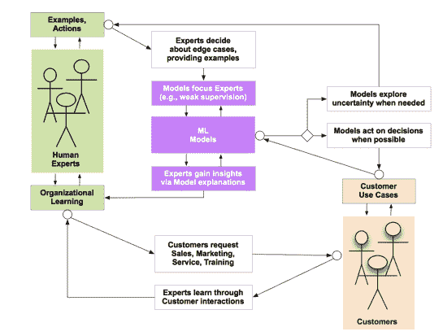

# 每个 Pacoid 的主题和会议，第 3 集

> 原文：<https://www.dominodatalab.com/blog/themes-conferences-per-pacoid-episode-3>

*[Paco Nathan](https://twitter.com/pacoid) 的专栏涵盖的主题包括开源、“智能是一项团队运动”和“大规模潜在硬件的含义”。*

## 介绍

欢迎来到我们关于数据科学的每月系列！这里要考虑的主题:

*   开源胜出；学习是不够的
*   智力是一项团队运动
*   大规模潜在硬件的含义

此外，首先要提到的是:我们将于 11 月 8 日星期四在 Domino 总部举行一场小组讨论，主题是“数据科学与工程”。真的非得这样吗？”——由[艾米·海尼克](https://twitter.com/aheineike)、[皮特·沃顿](https://twitter.com/petewarden)、我自己和我们甜美的主持人安·斯潘塞主演。加入我们关于开发和部署 ML 模型的合作的热烈讨论。请参见下文，了解 Amy 和 Pete 在数据科学领域取得进展的详细信息，我们期待在专家组上见到许多新朋友[！](https://www.eventbrite.com/e/data-science-versus-engineering-does-it-really-have-to-be-this-way-tickets-50454045408)

## 开源胜出；学习是不够的

数据科学，让我们把它分成几个部分:

*   **代码:** *迭代过程*(等等)，感谢 [SLDC](https://en.wikipedia.org/wiki/Systems_development_life_cycle) 、[敏捷](http://agilemanifesto.org/)、[看板](https://www.atlassian.com/agile/kanban)、[精益](http://theleanstartup.com/)等。，帮助指导团队将软件提炼为知识产权，并且结果可能在 [Git](https://git-scm.com/) 仓库(或者一些其他版本系统)中管理
*   **数据:**当我们整理、准备、分析、货币化、审计数据时，数据会不断积累(数量巨大，我们将在下面看到)。
*   **模型:** [一般化](https://www.basicbooks.com/titles/pedro-domingos/the-master-algorithm/9780465061921/)由代码构成，但从数据中学习

20 年前，关于软件工程的强有力的观点开始盛行。如今，在大多数企业圈子里，谈论“代码”很难不提到“敏捷”这个词。因此，有强烈的倾向将这个描述符应用到许多其他活动中(“敏捷数据”、“敏捷建模”等)。)根据我的经验，这是一个非常糟糕的主意。敏捷方法的创始人之一 Ron Jeffries 最近建议开发人员应该“脱离命名方法”

数据曾经是一个相对简单的东西。写代码的人也定义了一个[数据模型](https://web.archive.org/web/20120412150613/http://yourdon.com/strucanalysis/wiki/index.php?title=Chapter_10)，然后程序的执行是确定的:输入进入程序，处理发生，输出出来。完了，完了。[那个现实在最近的某个时候崩溃了。现在我们到处都有“数据驱动”的公司。代码变得廉价。谷歌会给你他们的](https://www.oreilly.com/ideas/what-is-data-science) [ML 代码](https://www.tensorflow.org/)；但是你不会得到他们的(精选的)数据，也不会得到他们的组织学习。

一家大型软件公司的高管最近对我说，“开源赢了，我们现在认识到了这一点。”很可能你的组织所依赖的大部分代码都是由你的组织之外的人通过开源项目来维护的。先从 Linux 开始，然后转移到 Git、Docker、Kubernetes、Python 等。明白重点了吗？敏捷代码开发可能不是您的数据团队关注其价值创造活动的地方。而越来越多的数据科学训练营、本科生项目等。关注开发不同类型的 ML 模型的细微差别，在日常实践中，您的数据团队可能会将宝贵的时间花在管理上述数据上:如何管理、准备、分析、货币化、审计等。，再加上创建数据基础设施来收集、存储、提供和查询数据等。

也就是说，对于开源与数据分析基础设施，有一些很好的见解。如果你最近没有看新闻的话，至少有三起巨大的并购( [1](https://venturebeat.com/2018/10/26/microsoft-completes-its-7-5-billion-github-acquisition/) 、 [2](https://www.cnbc.com/2018/10/03/cloudera-and-hortonworks-announce-all-stock-merger.html) 、 [3](https://www.wired.co.uk/article/ibm-buys-red-hat) )，其中包括，可以说是历史上最大的[拉动请求](https://help.github.com/articles/creating-a-pull-request/)。Google [BigQuery](https://cloud.google.com/bigquery/) 的 Felipe Hoffa 有一个 [Twitter 帖子](https://twitter.com/felipehoffa/status/1004720802590330885)和[博客帖子](https://towardsdatascience.com/these-are-the-real-stack-overflow-trends-use-the-pageviews-c439903cd1a)关于如何基于大规模堆栈溢出数据来识别开发者中流行的真正趋势。此外，对于科技公司来说，赢得其他公司开发人员的关注比传统营销更加重要，现在几乎每个公司都在成为科技公司，所以这一点很重要。但是我跑题了。

https://twitter.com/DynamicWebPaige/status/915326707107844097

^(ML eats 软件，杰夫·迪恩访谈/佩吉·贝利摄影)

敏捷宣言中甚至没有提到学习这个词。在宣言写了几年后，机器学习开始“[吃掉](https://medium.com/@karpathy/software-2-0-a64152b37c35)软件。我们现在看到大型代码库可以被学习模型取代[。来自谷歌的报道“每天都有数百个项目发生这种情况。”在一些有趣的案例中，开发人员花了几十年时间琢磨的无处不在的算法正在被学习模型所取代。在地平线上，我们将看到 QA 团队致力于生成单元测试的机器学习应用程序。这将对](https://twitter.com/DynamicWebPaige/status/915326707107844097)[如何编写代码](https://en.wikipedia.org/wiki/Test-driven_development)产生重大影响。即便如此，我在行业中遇到的许多团队都表现出一种反模式，即过于强调代码，对数据的预算重视不够，相对来说不太强调团队学习。稍后会有更多的介绍。

同时，学习并不是人工智能的全部。以下是奈良逻辑公司[的贾娜·艾格斯](https://twitter.com/jeggers)的精彩观点:

你必须管理你的数据，你的算法，和你的偏见目标。这是一个三位一体，它的力量可以对你不利，也可以对你有利。

啊哈，*目标*也很重要。此外，正如彭博测试版的[詹姆斯·查姆](https://twitter.com/jamescham)在[的推特帖子](https://twitter.com/jamescham/status/1050168086811140097)中探索的那样，有监督的机器学习本质上是反动的。这是需要考虑的。本月早些时候，克里斯蒂安·哈蒙德在伦敦[人工智能](https://conferences.oreilly.com/artificial-intelligence/ai-eu-2018)的[主题演讲](https://youtu.be/jU2GmxlfqYA)上发表演讲，强调人工智能是多方面的，而不仅仅是学习。

所以，*代码+数据+学习*是必要的，但不是充分的。什么是足够的？我们如何达成一个适用于数据科学的敏捷宣言？

在这一点上，Jupyter 项目[的](https://twitter.com/fperez_org/status/1052726678219157505)[费尔南多·佩雷斯](https://twitter.com/fperez_org)分享了保持 PDF(即发表的文章)“与背景细节、交互性和再现性支持相联系”的实践换句话说，如何发表相对最新并支持*可复制科学*的论文。最近在 *[Nature](https://www.nature.com/articles/d41586-018-07196-1)* 上发表的一篇文章探索了基于 [Jupyter](http://jupyter.org/) 的*可重复工作流程*。费尔南多和加州大学圣迭戈分校生物信息学的[彼得·罗斯](https://twitter.com/peterwrose)等人最近在 Jupyter 笔记本上发表了 [*可重复研究的十个简单规则*](https://twitter.com/peterwrose/status/1053156027602878465) 。我在 LinkedIn 上开了一个关于这个问题的[帖子](https://www.linkedin.com/feed/update/urn:li:activity:6459073995722625024)。

你在数据科学工作中的经历与此相符吗？

## 智力是一项团队运动

深度学习(DL)在 2012 年经历了一个拐点。几年前就有了可用的代码，但是过了一段时间，一个好的 T2 数据集才展示了这种方法的惊人价值。另外，[GPU 可以被用来](https://medium.com/@smallfishbigsea/a-walk-through-of-alexnet-6cbd137a5637)使大量的计算需求变得更加可行。

自然语言(自然语言处理，NLU，NLG 等。)正在到达一个拐点。像 DL 一样，现在有很棒的代码、优秀的数据集、足够的硬件等等。即便如此，我还是很震惊地看到聪明人仍然引用 [NLTK](https://www.nltk.org/) 、单词袋、词干等。，在 2018 年，当这个领域最近经历了一个[爆炸](https://explosion.ai/)的进步。

本月早些时候，我参加了由[安帕罗·阿朗索](https://twitter.com/AmparoAlonsoB)和[大卫·马丁内斯·减压阀](http://dataspartan.co.uk/)主持的[大数据大会，会上](https://www.fic.udc.es/es/evento/big-data-coruna)[达尼·维拉·苏埃罗](https://twitter.com/dvilasuero)展示了一份来自 ICML 的最新 NLP 论文的调查——这份调查令观众们惊叹不已。AllenNLP 已经为“深度语境化的单词表示”推出了 ELMo，然后 Google 又推出了 BERT。那周晚些时候，我加入了 Dani 和整个 Recogn.ai 团队，在阿斯图里亚斯(Asturias)参加了一次精彩的公司务虚会，重点是 NLP、[sidra](https://www.instagram.com/p/Bom8gG1FeJ6/)、[fa bada](https://www.instagram.com/p/BopXECpF_KI/)和其他阿斯图里亚斯的乐趣。如果你想随时了解 NLP 的最新消息，Dani 推荐[http://nlpprogress.com/](http://nlpprogress.com/)网站。

https://twitter.com/recogn_ai/status/1048588248010960896

^([在阿斯图里亚斯](https://twitter.com/recogn_ai/status/1048588248010960896)的 Recogn.ai，就在我们出发去 sidra 和藤壶)用餐前不久

我们看到的如此多被称为“人工智能”的东西，以及如此多对自然语言的商业关注，似乎都集中在聊天机器人上。关于商业机器人软件的有问题的声明比比皆是，但是关于对话的 NLP 的一些最好的工作来自于一个叫做 Rasa 的流行的开源库。[看看这次采访](https://www.oreilly.com/ideas/using-machine-learning-to-improve-dialog-flow-in-conversational-applications)艾伦·尼科尔，该项目的负责人，他们的独特视角: *[奥莱利数据秀播客:艾伦·尼科尔为聊天机器人开发者构建一套开源工具。](https://www.oreilly.com/ideas/using-machine-learning-to-improve-dialog-flow-in-conversational-applications)*

回到 AI 伦敦，Amy Heineike 在拥挤的主题演讲中展示了其他优秀的自然语言作品，其中包括马拉松式的问答环节，这是观众反应的一个指标。艾米和我录制了一段[视频采访](https://youtu.be/xBzZ2n_dOnY)，她在采访中详细介绍了关于自然语言工作的关键见解，这些见解使 [Primer.ai](https://primer.ai/) 能够推出解决难题的人工智能产品。Amy [强调了关于人在回路实践的一个核心观点](https://twitter.com/pacoid/status/1049944290045161472):

*…人擅长精确，机器更擅长回忆，重要的是融合两者的精华……*

Amy 的另一个精彩观点是分三个阶段考虑文本的 AI 产品:

1.  **读作**(即 NLP)
2.  **分析**(即 NLU)
3.  **写**(即 NLG)

每个阶段都有内在的权衡，取决于人或机器分别能处理多少。虽然许多公司似乎都在努力开发神奇的人工智能算法，可以一举解决他们的业务问题，但 Amy 警告说，我们应该考虑如何“智能是一项团队运动”，如何通过团队传播认知，让人工智能过程**读/分析/写**来创建草稿，专家团队可以使用并放大这些草稿来实现他们的业务目标。明智的建议！

事实上，这一主题与其他主动学习的案例研究相呼应，也被称为“人在回路中”。创建和更新商业网站，在这些网站上，只有设计人员和程序员完成最后阶段的工作。在大型企业中，安永&扬(EY)同样在他们的[租赁会计合规](https://www.forbes.com/sites/adelynzhou/2017/11/14/ey-deloitte-and-pwc-embrace-artificial-intelligence-for-tax-and-accounting/#1840c80c3498)实践中使用“智能是一项团队运动”方法中的“人在循环中”,导致比他们以前的纯人类团队多 3 倍的一致性和 2 倍的效率。

我做了一个关于主动学习案例研究的演讲，有一个总结图:

gist 从 Clara Labs 的 Michael Akilian 那里借了一块宝石:

诀窍是从第一天开始设计系统，它从已经存在的智能中隐含地学习。

换句话说，根据 Amy 的见解，“智能是一项团队运动”，您的组织已经有了在您的业务需要做什么方面的领域专家。随着时间的推移，他们在团队中传播*组织* *学习*，利用已经存在的智慧。你部署的任何人工智能应用都需要被认为是**团队+机器**的混合体。此外，借用控制论(以及机器学习的起源，特别是 20 世纪 40 年代的第一个神经网络项目)，我们需要将人工智能中的难题概念化，而不是作为具有线性输入/输出的“黑盒”，而是作为动态的、几乎有机的认知系统，其中每个交互点都有双向反馈回路。

也就是说:

*   部署的 ML 模型与客户交互(用例)
*   客户与领域专家互动(专业服务、客户支持)
*   领域专家与 ML 模型(训练数据集、主动学习、ML 模型可解释性等)交互。)

这些反馈回路中的每一个都必须是双向的。出于好奇，反馈循环有可计算的形式，称为行动的[对话。FWIW，谷歌出现在斯坦福实验室，在那里这项工作被探索，如果你真的想了解相关的历史，检查一下](https://www.goodreads.com/book/show/17870114-conversations-for-action-and-collected-essays)[项目 Cybersyn](https://youtu.be/9qKoaQo9GTw) 。

## 大规模潜在硬件的含义

行业中的一些痛点来自意料之外的方向。因为需要巨大的集群来训练大数据的 ML 模型，所以*机器学习*这个词往往会让人们想到巨大的数据中心:充满计算设备、网络等的巨大建筑。可能[位于某个偏远的可再生能源生产设施](https://www.google.com/about/datacenters/)附近。然而，这种心理形象是*所以* 2017。

你可能已经看到了最近关于微软为 edge 构建硬件，将数据带入云端的新闻。预计在数据科学的日常实践中会有更多，重点是关键词*硬件*、*边缘*和*云*。一方面，数据库中的数据量(例如，你的银行记录)与网络应用交互和其他互联网活动中产生的数据量相比相对较少。作为衡量标准，考虑在 Twitter 上发送的[推文每天产生大约 0.15 兆字节的数据](https://web-assets.domo.com/blog/wp-content/uploads/2017/07/17_domo_data-never-sleeps-5-01.png)。另一方面，正如许多物联网报告所提到的，与*字段*中的数据速率相比，这一指标微不足道。金融交易所每天产生[~ 5tb](http://download.microsoft.com/documents/en-us/sam/bsadatastudy_en.pdf)。全世界的天气数据是这个数字的 4 倍，大约 20tb/天。单个大型望远镜阵列每晚产生的数量就超过这个数字。据估计，2015 年医院的吞吐量约为 665 天。与此同时，从每天飞行的 25，000 次商业航班中，我们得到了大约 18 倍，超过 12 天。总的来说，即使这些数据速率与每辆自动驾驶汽车每天大约 30tb 的数据量相比也是微不足道的。想想商用车辆会给这个数字增加多少数据？

粗略估计将 ML 模型推断所需的数据放在*边*上，正好在[字节](https://en.wikipedia.org/wiki/Yottabyte)的范围内。然而，基本的物理定律排除了将数据“上传到云端”进行处理并返回的可能性。数学和物理学认为我们必须在边缘运行 ML 模型。例如，在安装在商业运输车队的硬件中运行模型(这是一个非常庞大、普遍、有价值的用例)。

https://twitter.com/aallan/status/1055874656761249793

^(“蓝色药丸”棋盘，由[阿拉斯代尔艾伦](https://twitter.com/aallan/status/1055874656761249793))

进入*硬件、边缘、云*的魔法组合。注意，GPU w . r . t 深度学习并没有什么特别神奇的地方。如果你从零开始为神经网络构建硬件，你会为低级线性代数库进行优化，并且可能不会以类似于 GPU 的任何东西结束。对于一个精彩的讨论，[查看](https://www.oreilly.com/ideas/specialized-hardware-for-deep-learning-will-unleash-innovation) [*奥赖利数据秀播客:Andrew Feldman 关于为什么深度学习正在迎来计算架构的黄金时代。*](https://www.oreilly.com/ideas/specialized-hardware-for-deep-learning-will-unleash-innovation)

然后看一段*必看的* [视频采访](https://youtu.be/wgJYd3iLPaU)皮特·沃顿和我在 AI 伦敦录制。皮特向[展示了谷歌](https://github.com/google/stm32_bare_lib)最近基于“蓝色药丸”STM32 兼容微控制器板的工作，这些微控制器板正在中国大量生产。值得注意的是，这些设备每台售价 0.5 美元，如果你批量购买的话，价格会低得多。它们提供了在低功耗嵌入式应用中运行基于 [TensorFlow.js](https://js.tensorflow.org/) 的深度学习推理所需的所有硬件。

斯坦福大学最近的研究表明，深度学习模型可以被转化为在低精度硬件上高精度地运行，通常尺寸会减少几个数量级，运行速度高达 4 倍。Pete 演示了如何运行用于视频识别、图像、语音等的 TensorFlow 模型。，在 20K RAM 中–没有操作系统。换句话说，信号直接进来，通过一个 [DSP](https://en.wikipedia.org/wiki/Digital_signal_processor) ，然后通过 DL models 推断。这些“蓝色药丸”设备足够小，可以通过使用室内环境光线的光伏电池供电；不需要电池。

皮特在其他几个关键点上执行了精致的麦克风下降。首先(除了它们作为猫玩具的明显效用之外),考虑结合语音和视觉命令的方法，即传感器融合。例如，考虑一个[嘈杂的餐厅环境](https://www.soundprint.co/)，其中有几个人在说话，这使得深度学习几乎不可能可靠地将语音转换为文本。然而，如果一个人指着一个设备(摄像头)说一个命令(mic)，那么 20K TensorFlow 模型就可以可靠地推断出来。

其次，尽管这些“蓝色药丸”设备不够大，无法支持无线电或其他网络连接，但它们能够“永远在线”，随时准备解释语音/视觉命令，进而“唤醒”其他更大的硬件设备，这些设备确实可以连接到基于云的人工智能服务。换句话说，考虑无处不在的廉价硬件设备—*部署在现场，不需要电力、连接和维护*—这些设备可以利用人工智能按需连接到云。

第三，全球已经部署了 5 亿台这样的设备。这意味着存在大量的潜在硬件，我们可以在这些硬件上部署 ML 模型。准备就绪等待。对我来说，这既不祥又奇妙。改变游戏规则的人。

说到 DSP，在伦敦期间，我还采访了英特尔 AI 公司的 Gary Brown，了解他们为 edge 开发新型硬件的工作。英特尔发布了 [OpenVINO](https://www.forbes.com/sites/moorinsights/2018/05/22/intel-openvino-funny-name-great-strategy/#7402b3646301) 工具包，在低功耗应用中部署 ML 模型，类似于谷歌的皮特团队正在做的事情。例如，总的来说，无论我们谈论的是安全、零售还是医疗成像，案件摄像机都变得越来越智能，ML 模型正在嵌入摄像机。延伸这个例子，工厂正在升级为“视觉工厂”,使用这些潜在的摄像机+ML 硬件。换句话说，工厂基础设施本身可以检测危险并在现场发出安全警告*——无需将所有数据上传至云端并传回。随后，可以将聚合的数据或元数据发送到云中进行后处理。*

 *作为对上述 edge 数据速率统计的回拨:Gary 描述了未来五年的前景，其中人工智能推理的价值预计将增长 25-30 %,其中大部分增长将发生在边缘而不是数据中心。

把这一切放在上下文中:皮特描述了如何利用大规模存在的大规模潜在硬件；加里描述了新型硬件是如何将这些效应推向更大规模的；艾米描述了如何利用这些进步实现“智能作为团队运动”，即不必等待神奇的人工智能算法，这些算法在没有人参与的情况下执行不可想象的技巧。相反，按照**团队+机器**来计划所有的技术推广，然后根据需要调整组合。

有趣的是，这些边缘人工智能应用程序将数据直接放入硬件，而不是数据科学团队据称花费 80%以上时间的数据管理。这是流程和工程假设中的一个重大变化，对上述的万亿字节规模产生了影响。

我在 2018 年探索的一个元主题是如何

**硬件>软件>流程**

换句话说，硬件比软件进化得快，软件比流程进化得快。许多企业组织对此“竖起两个大拇指”

你在数据科学领域的工作经验与此相符吗？*