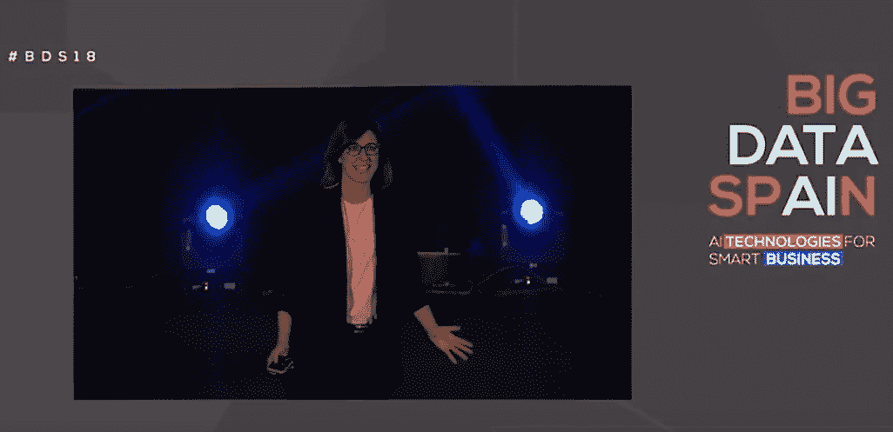
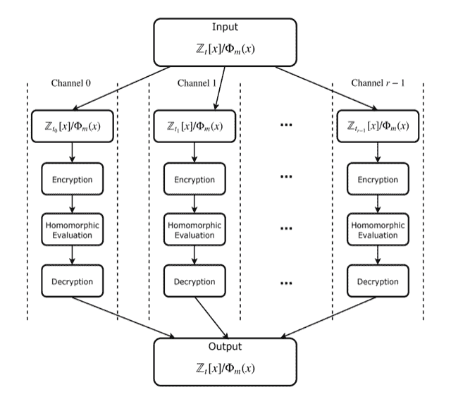
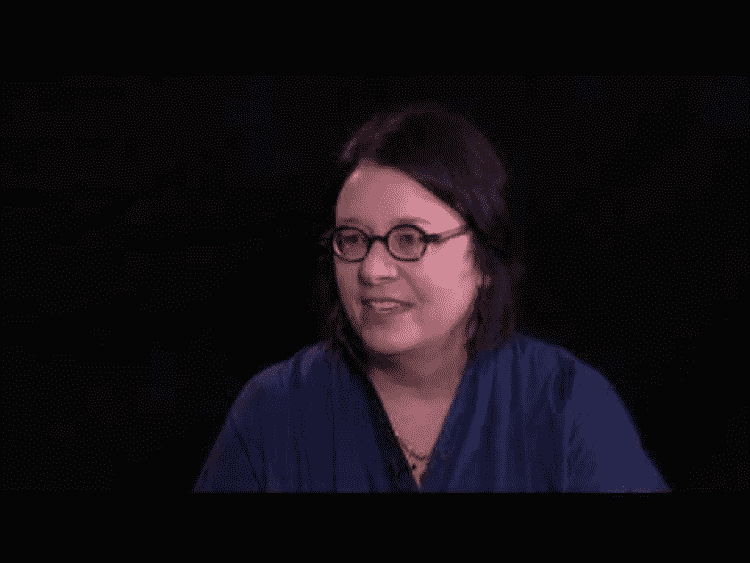
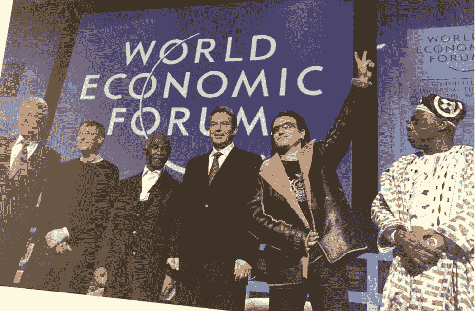
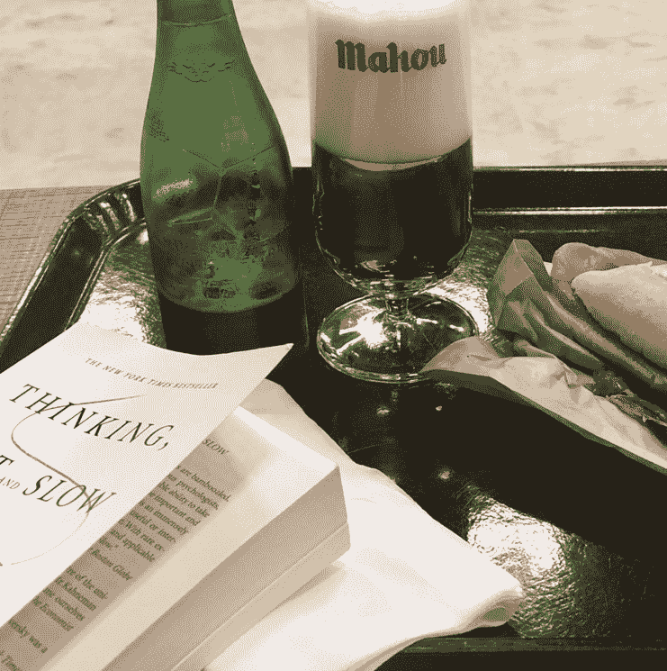

# 每个 Pacoid 的主题和会议，第 4 集

> 原文：<https://www.dominodatalab.com/blog/themes-conferences-per-pacoid-episode-4>

*[帕科·内森](https://twitter.com/pacoid)的最新专栏涵盖的主题包括数据隐私、机器伦理，是的，还有堂吉诃德。*

## 介绍

欢迎回到我们关于数据科学的每月系列。我刚从西班牙一个热闹的会议回来。)在那里，我注意到大西洋两岸从事数据科学工作的人们正在努力解决类似的问题。欧洲正在出现重要的创新。这个月，让我们来详细探讨这三个主题:

*   *数据隐私*
*   *机器伦理*
*   *堂吉诃德*

## 数据保密

数据隐私最近发生了一些有趣的变化，与此同时，合规性、安全性和客户体验也获得了好处。苹果首席执行官蒂姆·库克(Tim Cook)10 月底在布鲁塞尔发表了一次关于合规的演讲。他警告说，随着我们的个人数据被大型广告技术公司、数据经纪人等“用军事效率对我们进行武器化”,即将出现“数据工业综合体”。在随后的 [Twitter 帖子](https://twitter.com/tim_cook/status/1055035534769340418)中，库克分享了关于数据隐私的四点:

1.  “公司应该挑战自己，首先消除客户数据的身份或不收集这些数据”
2.  “用户应该始终知道从他们那里收集了哪些数据，以及收集这些数据的目的是什么”
3.  “公司应该认识到，数据属于用户，我们应该让人们能够方便地获得他们个人数据的副本，以及修改和删除这些数据”
4.  “每个人都有权保护自己数据的安全；安全是所有数据隐私和隐私权的核心”

这些要点总结了欧盟通用数据保护条例( [GDPR](https://eugdpr.org/) )出台五个月后的许多高级成果。虽然许多公司关注与数据隐私和合规性相关的风险，但新兴技术正在使必然的回报(即产品增强)变得非常有形。

*Irene Gonzálves at Big Data Spain 2018, Reuse in Accordance with [Creative Commons Attribution License](https://www.youtube.com/watch?v=Pt8DVNp9fCM&feature=youtu.be)*

11 月中旬，我在马德里的[大数据西班牙](https://www.bigdataspain.org/)大会上授课/演讲，这是欧洲第二大数据科学大会。Irene Gonzálvez 的“数据隐私@Spotify”是一个引人注目的演讲。她首次公开介绍了 Spotify 如何实施 GDPR 有争议的 *[被遗忘权](https://gdpr-info.eu/issues/right-to-be-forgotten/)* 方面。简而言之，Spotify 创建了一个新的名为“挂锁”的全球密钥管理系统来处理用户同意。任何使用客户数据的内部应用程序都必须首先从隐私门户获取密钥。相反，当客户撤销使用其数据的许可时，他们的密钥将被删除，其数据变得不可读。我强烈推荐[艾琳的视频](https://www.youtube.com/watch?v=Pt8DVNp9fCM&feature=youtu.be)了解全部细节。

艾琳指出，*数据只有先加密*才能持久化 *。这有助于减少数据泄露的影响。它还使 Spotify 中的任何一个团队都能够为客户管理整个数据生命周期。这将更好的数据隐私、更主动的合规性、潜在的更好的安全性和有趣的产品增强功能集于一身。我的观点是，在 Spotify 等公司的引领下，我们将看到更多专门针对隐私的大数据创新。这些将导致客户体验的增强而不是降低。*

与此同时，支持数据隐私和加密的其他技术也在快速发展。关于当代工作的出色概述，请参见最近的播客采访“[对加密数据的机器学习](https://www.oreilly.com/ideas/machine-learning-on-encrypted-data)”与[阿龙·考夫曼](https://conferences.oreilly.com/strata/strata-ca/public/schedule/speaker/334106),[二元性](https://duality.cloud/)的联合创始人兼首席执行官。Alon 描述了三种互补的数据隐私方法:

1.  [同态加密](https://en.wikipedia.org/wiki/Homomorphic_encryption)
2.  [差分隐私](https://arxiv.org/abs/1412.7584)
3.  [多方计算](https://en.wikipedia.org/wiki/Secure_multi-party_computation)

想象一个系统，其中机器学习模型根据一组数据进行训练，然后在生产中使用(推理)实时客户数据…与 ML 模型不同的是，训练数据对 ML 模型保密，模型对生产部署保密，用于推理的客户数据也保密。这三种技术各有利弊，有些偏向于一方的隐私，有些偏向于另一方的隐私，但是它们可以结合起来形成一个健壮的系统。

Duality 是一家强大的科技初创公司，绝对值得密切关注。值得注意的是，另一位联合创始人是 2012 年 [ACM 图灵奖](https://amturing.acm.org/)、1993 年和 2001 年[哥德尔奖](http://eatcs.org/index.php/goedel-prize)、1996 年[格蕾丝·默里·霍珀奖](https://awards.acm.org/hopper)的获得者[沙菲·戈德瓦瑟](https://en.wikipedia.org/wiki/Shafi_Goldwasser)……名单还很长。如果有人打算重写计算机科学的基础，看看戈德瓦瑟教授吧。

有关这些技术如何在生产用例中工作的更多信息，请收听与格鲁吉亚合作伙伴[刘畅](https://georgianpartners.com/team/chang-liu/)的播客采访"[隐私保护技术如何能够导致更强大的机器学习模型](https://www.oreilly.com/ideas/how-privacy-preserving-techniques-can-lead-to-more-robust-machine-learning-models)。这些方法中的大多数涉及将噪声注入到数据中，这具有潜在产生更一般的 ML 模型的好处，使它们远离过度拟合。然而，请记住[没有免费的午餐定理](https://en.wikipedia.org/wiki/No_free_lunch_theorem)──增加的噪音也可能降低精确度。

通过查看这些相对较新的论文来更深入地挖掘数学的细节:

*   [“差分隐私和机器学习:调查和评论”](https://arxiv.org/abs/1412.7584)
*   [“来自分散数据的深度网络的通信高效学习”](https://arxiv.org/abs/1602.05629)
*   [“隐私保护深度学习的通用框架”](https://arxiv.org/pdf/1811.04017.pdf)

最后一篇论文与快速增长的 [PySyft](https://github.com/OpenMined/PySyft) 社区有关。到目前为止，运行这些技术的计算成本很高。然而，最近的一份报告指出了性能方面的潜在突破:“[同态加密的 AlexNet 时刻:HCNN，第一个用 GPU](https://eprint.iacr.org/2018/1056.pdf)加密数据的同态 CNN”，作者是 Ahmad Al Badawi，Jin Chao，林杰等人。虽然以前在同态加密方面的工作使用了诸如[海豹突击队](https://www.microsoft.com/en-us/research/project/simple-encrypted-arithmetic-library/)和 [PySEAL](https://medium.com/bioquest/pyseal-homomorphic-encryption-in-a-user-friendly-python-package-51dd6cb0411c) 之类的库，但位于新加坡的 [A*STAR](https://www.a-star.edu.sg/) 的研究发现了以前研究中的错误，他们还在 GPU 上实施了他们的工作以提高性能。他们报告了高安全级别(> 128 位)以及高精度(99%)，鉴于上述注入噪声与精度的关系，这似乎令人惊讶。

*An “arithmetic circuit” used in homomorphic encryption*

诚然，最近有人争相抓住“XYZ 的 AlexNet 时刻”这个如今令人遗憾的陈词滥调，尽管它有其实质内容。网络攻击并不新鲜。第一次有记录的金融漏洞网络攻击发生在 1843 年的法国。显然，这个等式中的安全威胁一方不会消失。考虑到新兴技术——尽管计算成本很高——隐私保护技术的性能突破将成为关键因素，因为创新技术供应商如 Duality 改变了游戏，极大地扩展了消费公司如 Spotify 已经在生产中使用的实践。

同时，正如 Alon Kaufman 和其他人提到的，另一个正在出现的关键组件是[联合学习](https://ai.googleblog.com/2017/04/federated-learning-collaborative.html)。如果你想对加密数据进行机器学习实验， [tf-encrypted](https://github.com/mortendahl/tf-encrypted) 是一个构建在 TensorFlow 之上的 Python 库。当涉及两方、三方或多方时，保持数据的私密性至关重要。这个多方问题的共轭是，我们也需要更好的方法来分配机器学习工作，特别是考虑到世界正在朝着边缘、物联网、嵌入式等用例的方向发展。大数据西班牙 2018 的另一个我最喜欢的演讲是 [Amparo Alonso](https://twitter.com/AmparoAlonsoB) 的“[超越准确性和时间](https://www.youtube.com/watch?v=rFaK7Z1oWeg&feature=youtu.be)”，他是 da Coruñ大学人工智能研究的负责人。他们的团队正在研究参数共享，这是另一个令人信服的替代方案。展望未来，我渴望听到即将于 2019 年 3 月 28 日星期四在 Strata SF 由来自谷歌的[亚历克斯·英格曼](https://twitter.com/alex_ingerman)发表的演讲“机器学习的未来是分散的”。

## 机器伦理

今年早些时候，一个令人担忧的时刻出现了:迫在眉睫的 GDPR 要求，网上关于重大数据隐私泄露的报道似乎层出不穷，硅谷的许多道德灾难带来的阴影，等等。，这一切都是同时发生的。这些因素让数据分析的未来看起来很黯淡。如果监管机构不允许你收集大量用户数据，而与此同时，你却不断被黑客攻击和起诉你已经拥有的数据，那么一个组织怎么可能是“数据驱动的”呢？

然而，正如华尔街所说，“买谣言，卖新闻。”几个月后，数据隐私方面的创新带来了安全优势，并带来了更好的客户体验。其他合规领域呢？例如，我们能否以类似的方式接受数据中的*道德*难题，创新不仅能解决棘手的合规问题，还能带来更好的产品？

*Susan Etlinger at AI London*

十月份，我有幸在伦敦的人工智能会议上采访了苏珊·埃特林格。目前，关于道德和数据的对话似乎集中在风险、担忧、监管后果上，坦率地说，集中在那些看到整个电子商务世界正在发生变化的人的困惑感上。我们能否扭转这种局面，不被风险所驱动，而是基于伦理考虑，开发出由数据驱动的更好的产品和服务？*丝丝丝，克拉罗*看看我对苏珊的[视频采访。](https://www.youtube.com/watch?v=WEEbtQjHOKk&feature=youtu.be)

一个关键的要点是不可能得到完全“公平”的决定——生活不是这样的——更不用说完全公平的 ML 模型了。公司的领导层必须理解这一点，并认识到使用 ML 部署的系统会在特定的方向上出错(希望不会损害客户、公众等)，并且作为领导者，拥有这些决策。拥有他们，为他们自豪，宣扬他们，制造噪音。保持透明，而不是封闭这些决策。这是一条通向组织实践中更好的数据伦理的道路。

为此，谷歌和 data kind(T1)在 T2 呼吁投资 2500 万美元的人工智能(T3)来解决棘手的社会和环境问题。做一些好事，制造一些噪音，赢得资助。不错的交易。

当然，完美不会经常出现(除了 *Buckaroo Bonzai* 中的完美汤米)。为了更好地了解为什么完美的 ML 公平是一种[*m*](https://tvtropes.org/pmwiki/pmwiki.php/Main/Unobtainium)*的形式，请查看最近与斯坦福大学的 [Sharad Goel](https://5harad.com/) 和 [Sam Corbett-Davies](https://twitter.com/scorbettdavies/status/1002609515668258816) 的播客访谈“[为什么很难设计公平的机器学习模型](https://www.oreilly.com/ideas/why-its-hard-to-design-fair-machine-learning-models)。也就是说，公平需要许多考虑、许多权衡和许多优化的变量。本次访谈涵盖了 ML 模型公平性的几项重要技术，如*反分类、分类奇偶校验、校准等*。净效应是，虽然这些都是好的方法，但要求它们成为一揽子政策将会伤害边缘群体。这基本上是公平的对立面。此外，恶意行为者可以利用这些方法中的任何一种。试图量化公平或自动化监督过程是一个严重的错误。必须分析模型，必须考虑多种因素，必须做出判断。这涉及到决策的分解(稍后会有更多的介绍)。要更深入地挖掘，请查看 Sharad 和 Sam 的论文:“[公平的衡量和错误衡量:公平机器学习的批判性评论，](https://arxiv.org/abs/1808.00023)”，其中包括说明他们论点的优秀例子。*

 *《自然》杂志最近发表了一篇文章“[无人驾驶汽车的困境揭示了道德选择并不是普遍的，这扩展了这些论点。](https://www.nature.com/articles/d41586-018-07135-0)“在阅读这些关于“机器伦理”的谜题之前，请先坐下来，这些谜题基于全球范围内对无人驾驶汽车在生死困境中应该做些什么的价值观调查。西方与东方、南方价值观的对比揭示了社会和经济因素对道德规范的影响。例如，*收入不平等*，或政府机构的相对实力，如何改变“道德”选择的定义？一些文化认为，自动驾驶汽车应该选择放过守法者，一些人会放过年轻人，而另一些人则希望放过社会地位更高的人。换句话说，如果你是一个上了年纪的工人阶级，甚至有轻微的警察记录，*在大多数大洲避免走人行横道*，否则机器人会过来追捕你！很明显，没有完美的规则可供认可机构遵守。

## 堂吉诃德

就像塞万提斯 17 世纪早期的小说 [*中亲爱的*](https://www.goodreads.com/book/show/3836.Don_Quixote) *[Alonso Quixano](https://en.wikipedia.org/wiki/Don_Quixote) 一样，我上个月在马德里的大数据西班牙经历了一些冒险和惊喜。在我最后一次演讲后，主持人坚持让我赤脚走路，并蒙住眼睛踩在碎玻璃上。后来，一天深夜，我和一个好朋友去了一家古色古香的 19 世纪咖啡馆，这是著名的西班牙诗人最喜欢的咖啡馆，Jorge Bedoya 和他的女演员姐姐跟着我们进去，并迅速拿起小三角钢琴，在钢琴上即兴演奏了弗拉门戈风格的音乐。这个地方爆发了。*大官！**

*Central Madrid at Night*

然而，最令人惊讶的文化享受是去参观 [Restaurante El Tormo](https://www.restaurantes.com/restaurante-el-tormo) 餐厅，那里供应《T2》*唐吉诃德*中描述的手工菜肴。诚然，在塞万提斯写作的时候，其中一些菜肴已经有几个世纪的历史了。店主是一对年纪较大的夫妇(根据墙上的照片快速算了一下，我想他们肯定都已经 70 多岁或更老了)，他们几十年来热衷于研究历史食谱，重现了失传已久的技术。如果你来到世界的这个地方，千万不要错过厄尔尼诺现象。看看这些[菜](https://www.instagram.com/p/BqQFA6SgI69/)！顺便说一句，“午餐”大约需要 4 个小时才能完成，所以要做好相应的计划。

《堂吉诃德》的部分魅力在于，自它首次出版以来的四个世纪里，几代人都在努力确定作者的意图。这是一个关于一个在骑士观念下长大的老人的故事吗？他对文艺复兴时期急剧变化的世界感到困惑。是对正统和民族主义的冷嘲热讽？它是否试图证明当社会是错误的时候，个人是正确的？*无 sè。*

关于伦理和隐私，Susan Etlinger 和我最近参加了世界经济论坛(WEF)的一个研讨会，他们正在为明年的 T2 达沃斯(T3)准备人工智能议程。我们是该领域 30 名专家中的一员，致力于解决堂吉诃德式的问题。一个成果是针对企业董事会成员的[授权人工智能领导力工具包](http://www3.weforum.org/docs/WEF_Empowering-AI-Leadership_Oversight-Toolkit.pdf)，以帮助他们理解数据科学隐含的关键但非直觉的问题。

许多老牌公司的最高级决策者在职业生涯中已经成熟，诸如六适马、T2、精益创业、T4 和敏捷的理念在技术管理中非常流行。结果，他们学会了将自动化视为某种固有的*确定性*的东西，并且他们被训练将*不确定性*视为一个需要从业务流程中根除的问题。

然而，世界突然发生了变化，高级决策者可能会发现自己有点像阿隆索·基萨诺(Alonso Quixano)试图理解他周围的巨大变化。《堂吉诃德》出版将近 500 年后，我们可以称我们现在的时代为“文艺复兴 2.0”，或者别的什么。现在我们有了参与决策的*概率*系统。随着组织在分析能力方面经历典型的成熟阶段—*描述性、诊断性、预测性、规范性*——越来越多的决策逐渐转向自动化流程。

今天，我们对如何培养数据科学职业的个人贡献者有了很好的想法。我们开始清晰地阐述如何有效地领导数据团队。然而，在数据科学和人工智能的背景下，执行决策的细微差别仍然有点模糊。董事会和高管团队在数据相关问题上的互动大多处于混乱状态。和奎萨诺一样，他们在这里是“向风车倾斜”(即打击假想敌)。

因此，瓶颈问题正在上升到管理层和董事会层面。董事会成员学习了六适马、敏捷等。没有为人工智能用例的判断做好充分准备。他们现在必须考虑随机系统(阅读:*非确定性*)，其中不确定性得到利用，风险的性质已经改变。坦率地说，如果他们不采取行动，竞争对手(或联邦监管机构，或反对的法律团队，或消费者权益倡导者，或网络攻击者)就会采取行动。

WEF 正试图通过在 2019 年达沃斯论坛上预览他们的人工智能工具包来正面帮助董事会成员解决这个问题……之后，WEF 和他的朋友们将努力通过全球董事会级网络传播这一资源。

*Art in Hallway at World Economic Forum, SF*

奇怪的是，虽然我们认为机器学习是一种从过去的数据中归纳模式的方法，但事实证明机器学习与商业理论的核心有直接关系。回顾上个世纪的经典商业文本之一，Frank Knight 的[风险、不确定性和利润](https://www.econlib.org/library/Knight/knRUP.html)(出版于 1921 年)在*可识别风险*(购买保险)和*不确定性*(存在利润机会)之间建立了重要的区别。事实证明，机器学习非常擅长识别数据集中的不确定区域，因为这些数据被用来训练 ML 模型。这为*半监督学习*的变体打开了大门:模型在对其预测有可接受的信心的情况下处理预测分析，否则它们会将可证明不确定的极限情况提交给团队中的人类专家。每个商业问题现在都应该被看作是由人+机器的团队来解决的事情。在某些情况下，大部分是人，而在其他情况下，大部分是机器。在任何情况下，总是从管理两个团队的基线开始。此外，利用它们之间的反馈循环:你的人和机器学习模型互相学习。

今年早些时候，有一篇来自麦肯锡公司的精彩文章，Ajay Agrawal 的《[人工智能经济学》，指出了*拆分组织内部决策过程的必要性。对于那些刚刚进入数据领域的组织来说，我找不到比这更重要的一点来强调。这是当代堂吉诃德的解药，这些暴躁的侠客可能会因为数据、隐私、道德、安全、合规、竞争等方面的严重难题而向风车倾斜。在六适马长大的高管和董事会成员现在必须重新学习如何与自动化的概率系统一起思考。决策可能来自直觉层面(反应性)或个人精力的更昂贵投资(认知)。我们在 2018 年学到的是，为了在竞争利用人工智能的世界中茁壮成长，我们必须将更多的反应性快速决策转移到大多数机器上，同时将更昂贵的认知转移到人身上。一些组织试图以相反的方式开始，但失败了。*](https://www.mckinsey.com/capabilities/quantumblack/our-insights/the-economics-of-artificial-intelligence)

另一个很好的资源是诺贝尔奖获得者丹尼尔·卡内曼的《思考快与慢》、《T2》、《T3》一书，这本书概述了人们通常在决策中失败的原因。我们生来就有作为个体做出决定的能力；例如，坏消息比好消息更重要，这有助于我们在一个残酷、竞争激烈的世界中生存。感知的损失比可能的收益更重要。卡尼曼指出，我们的进化线路迫使个体试图*存活足够长的时间来繁衍后代*，这对于大型组织的决策根本不起作用。尤其是当我们谈论复杂的决策和长期战略时，其中的含义将跨越许多不同的文化和大陆。因此，我们开始利用数据科学作为一种通知组织的方式，围绕人类决策者在实践中通常引发的常见形式的[认知偏差](https://en.wikipedia.org/wiki/List_of_cognitive_biases)开展工作。一个问题是:大型组织的最高层仍然在努力应对“文艺复兴 2.0”的影响，以及如何与机器合作。

*“Fast Food” at Madrid Airport*

决策的*松绑*是当今数据科学最重要的一点。了解你的组织是如何做决策的。在你的业务流程中，哪些地方的直觉反应至关重要？哪里是需要更深思熟虑的地方？机器在这幅图中处于什么位置？因为现在他们必须这么做。

以下是一些精彩的演示，更详细地探讨了决策“拆分”问题:

*   "[从大数据到人工智能:我们现在在哪里，前进的道路是什么？](https://www.zdnet.com/article/from-big-data-to-ai-where-are-we-now-and-what-is-the-road-forward/) " ─乔治·阿纳迪奥蒂斯，ZDnet
*   [《缺失的一块》](https://www.oreilly.com/ideas/the-missing-piece)──凯西·科济尔科夫，谷歌
*   “社会科学研究如何为人工智能系统的设计提供信息”─雅各布·沃德，斯坦福
*   [“全球大脑的新愿景:以人代替机器的深度学习”](https://www.oreilly.com/ideas/a-new-vision-for-the-global-brain-deep-learning-with-people-instead-of-machines) ─ Omoju Miller，GitHub

在后面的演讲中，Omoju 拿出一个典型的企业组织结构图，将其旋转 90 度，然后考虑该图看起来有多像，以及(应该)作为一个深度神经网络架构发挥作用。这是一个很好的思考点:我们能从人工神经网络组织如何跨层、连接池、嵌入等进行决策中学到什么？，企业团队可以借鉴哪些技术？这与风车倾斜正好相反。

## 即将举行的活动

11 月，我们进行了一场热烈的小组讨论“[数据科学与工程:真的必须这样吗？](https://www.eventbrite.com/e/data-science-versus-engineering-does-it-really-have-to-be-this-way-tickets-50454045408)“在旧金山的达美乐总部。我将把详细的报道交给[，但我最喜欢的摘录是](https://blog.dominodatalab.com/data-science-vs-engineering-tension-points/)[皮特·沃顿](https://twitter.com/petewarden)，描述了谷歌计划开发人工智能模型和产品预期的部分过程——他们称之为[绿野仙踪](https://twitter.com/aheineike/status/1060944102429097984)。换句话说，让一个人站在幕后，扮演一个预期的 ML 模型的角色，使用训练数据来回答问题。然后让一小群观众与一个模拟产品互动，就好像他们在与幕后的一个向导互动一样。如果那个角色扮演奇才遇到了麻烦，想象一下训练相应的 ML 模型可能有多难？这是一个设定期望值的好方法——同样，对于生产中的人+机器团队来说。

说到数据科学的领导力和决策过程的“松绑”,请在您的日历上标记一下 5 月 15 日至 16 日在纽约举行的 [Rev](https://rev.dominodatalab.com/?utm_source=blog&utm_medium=post&utm_campaign=) 会议，我们将在会上重点讨论如何领导数据科学团队并在组织内保持高效。我们将在整个项目中强调团队之间的相互学习，并展示数据分析领域的天才领导者，包括我在该领域非常尊敬的两个人的主题演讲:[米歇尔·乌福德](https://twitter.com/MichelleUfford)和[汤姆·科恩盖](https://www.linkedin.com/in/kornegayt/)。请关注 12 月即将开启的“提案征集”活动。

与此同时，2018 年剩余时间里没有太多数据科学活动。请查看新的[会议观察列表](https://derwen.ai/events#watchlist)，了解关于数据、机器学习、人工智能等会议的策划列表。我们将在这里继续强调即将到来的重要事件。

祝你和你的家人节日快乐！*