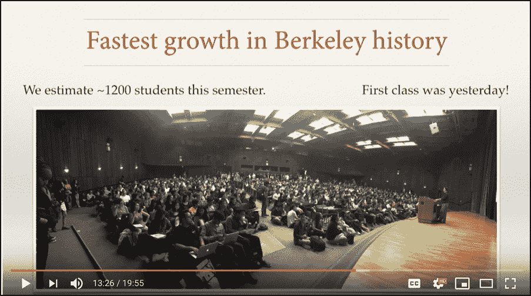
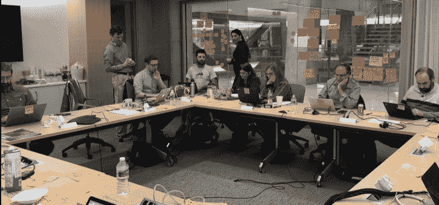
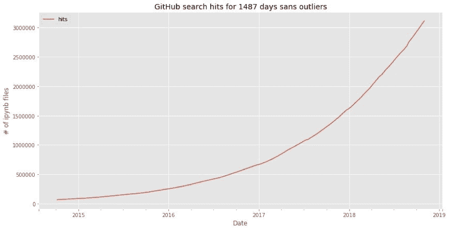
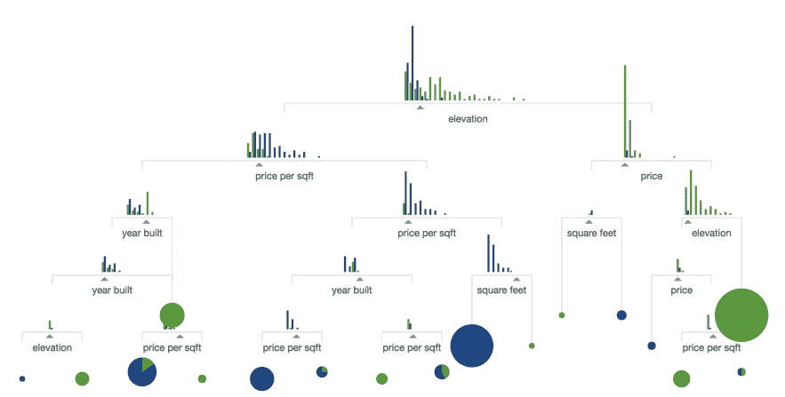

# 每个 Pacoid 的主题和会议，第 5 集

> 原文：<https://www.dominodatalab.com/blog/themes-conferences-per-pacoid-episode-5>

*在 [Paco Nathan](https://twitter.com/pacoid) 的最新专栏中，他通过深入教育计划、学习材料、教育方法以及对教育的看法来探索“学习数据科学”的主题。他还是即将举行的数据科学领袖峰会 [Rev](https://rev.dominodatalab.com/?utm_source=blog&utm_medium=post&utm_campaign=themes-conferences-per-pacoid-episode-5) 的联合主席。*

## 介绍

欢迎回到我们关于数据科学的每月系列。这个月，我们来探讨一下*学习数据科学*。

最近，我一直在为一个客户开发他们新的“数据科学导论”系列课程的课程。无论如何，这都不是一个新的工作。自 2008 年以来，我一直在私下为雇主教授数据科学，包括高管人员、投资者、IT 团队和我领导的数据团队，自 2013 年以来，我还为整个行业的专业人士教授数据科学。然而，现在是考虑的一个有趣的时间点:“需要教什么？我们领域的基础部分是什么？”

让我们探讨一下关于学习数据科学的问题，并对其进行一些解释。数据科学领域领先的*教育项目*在哪里？有哪些好的*学习资料*可以提供给大众？

在*在线资料*、*面授课程、MOOCs、bootcamps、*等一系列课程中，哪种效果更好？像*辅导*项目这样的选择，对于组织和相关个人来说，如何适应这种情况？

在商业术语中，**为什么这很重要**？对于在数据科学内部培训方面落后的公司来说，*预计风险*是什么？对于希望接受数据科学培训以转换到新角色的员工来说，什么样的*角色*比较合适？

我最喜欢的话题是:有哪些最好的书、博客、播客等等。，开始学习数据科学？

## 学习数据科学

如果您正在寻找数据科学课程的好例子，例如帮助培训您的团队，您会从哪里开始？

从数字上看，可以说世界上最大的成功是加州大学伯克利分校的数据科学部门。在摇滚明星[凯瑟琳·卡森](https://twitter.com/cathryncarson)、[大卫·卡勒](https://people.eecs.berkeley.edu/~culler/)等人的带领下，这项倡议从根本上改变了柏克莱的学术项目。此外，它还为其他大学的效仿开辟了道路。他们的[数据 8](http://data8.org/) 基础课程和数据 100 中级课程的教育资料，以及他们的教材 *[推理和计算思维](https://www.inferentialthinking.com/chapters/intro.html)* 都可以在网上找到。这两门课程是伯克利历史上发展最快的课程，现在已经达到了校园人口的 40%。此外，还有一个创新的做法是将 *[课程](https://data.berkeley.edu/education/connectors)* 连接到其他学科。该计划支持基于 [JupyterHub](https://jupyter.org/hub) 的超过 1200 名学生的动手数据科学班级规模，这为企业基础架构设置了一个标杆。

 *UC Berkeley intro data science course (credit: [Fernando Pérez](https://www.youtube.com/watch?v=xuNj5paMuow&feature=youtu.be))*

当然，并不是每个人都是加州大学伯克利分校的注册学生或其大学合作伙伴之一，因此，不会有机会参加这些项目。此外，数据科学显然没有“一刀切”的教育模式。运营*数据科学社区简讯*的 Laura Noren 在[JuptyerCon 2018 上展示了她的 NYU 博士后研究，比较了研究和教育中数据科学的基础设施模型](https://conferences.oreilly.com/jupyter/jup-ny/public/schedule/detail/68332)。加拿大项目与美国类似努力的对比尤其有趣。伯克利模式满足了美国大学的巨大需求。然而，学习数据科学还有多种其他需求。

## 为什么这很重要？

首先，祝贺伯克利。我的母校可能位于旧金山湾的对面(树木与熊之类的)，然而，我很高兴看到他们的成功，并荣幸地在相关的 [BIDS](https://bids.berkeley.edu/about) grad 项目中做客座演讲。将数据科学工作的*工具集、技能集、数据集、*和*思维定势*渗透到大学生的头脑和头脑中——这太棒了。无论学生选择哪个学术领域，他们都将为从事 21 世纪的研究打下更好的基础。

## 不同的格式，不同的方法

然而，已经在工业界工作的人还有其他需求。需要不同的学习材料格式、不同的课程方法(例如，案例研究中更深入的内容)，以及不同的教学风格(“ROI”得到了大量讨论)。例子:大约在 2002 年，我在一个 *[继续教育项目](http://continue.austincc.edu/workforce/computer)* 中教授网络安全。我们班的人会工作 8-10 个小时，然后晚上再花 3 个小时参加我们的节目(如果他们能保持清醒的话)。他们做出巨大牺牲，投资*提升*技能，为职业生涯带来重大改变。教授这些课程与教授本科生非常不同。

一般来说，专业人士的首要任务是从目前的工作中“提升技能”,进入他们的组织在快速变化的工作场所要求的新角色。在数据科学中尤其如此；大多数企业组织根本无法雇佣足够的数据分析人才，因此，这些人员需求中的大部分必须由现有员工来满足。

根据组织的业务重点，人们需要不同的培训方法。例如，一家大型知名咨询公司的高管向我解释说，他们很少派员工参加面对面的课程。他们向客户收取 3000 美元/小时的费用，因此，除了提供按需在线学习材料之外，做任何事情都是一笔巨大的业务损失。OTOH，同一周，一家大型知名计算机硬件公司的高管向我解释说，他们强烈反对员工使用在线学习材料。他们的竞争对手很容易从培训供应商那里“获得”web 服务器日志，并可能提前很长时间猜测新产品方向。相反，该公司花费$$$送员工(以团队形式)去参加培训会议，在那里他们很少问团队以外的问题。我为公司教过课，这是真的。对于必须认真对待竞争和安全问题的大部分企业来说，情况也是如此。**mooc 不是万能药**。对于数据科学培训，我们没有也不可能有“一刀切”的解决方案。

## 规模和紧迫性

此外，还有规模和紧迫性的问题。如果该领域的顶级分析师的预测甚至接近准确，我们必须希望提升技能能够很好地工作并有效地扩展。最近，世界经济论坛发布了“【2018 年未来就业报告”这些数字是“令人信服的”(有些人可能会说“令人鼓舞”，有些人可能会说“令人恐惧”，YMMV):

“再培训势在必行:到 2022 年，不少于 54%的员工将需要大量的再培训和技能提升。其中，约 35%预计需要长达 6 个月的额外培训，9%需要持续 6 至 12 个月的再技能培训，而 10%需要超过一年的额外技能培训。到 2022 年，持续增长的突出技能包括分析思维和创新，以及主动学习和学习策略。技术设计和编程等技能的重要性急剧上升，突显出接受本报告调查的雇主对各种形式的技术能力的需求日益增长。然而，精通新技术只是 2022 年技能等式的一部分，因为创造力、原创性和主动性、批判性思维、说服和谈判等“人类”技能将同样保留或增加其价值，关注细节、弹性、灵活性和解决复杂问题的能力也是如此。情商、领导力、社会影响力以及服务导向也相对于它们目前的突出地位出现了巨大的需求增长。”

如果你擅长做数据科学的工作，在可预见的将来你会有很多就业机会。与此同时，那些押注他们的团队会在数据科学、机器学习、数据工程、人工智能等领域完成重大项目的雇主。，并希望在竞争异常激烈的招聘环境中奇迹般地招聘到新人才——请注意。术语*提升技能*更有可能成为你的代名词。

麦肯锡全球研究所最近的另一份报告与 WEF 的分析密切相关。特别要注意“附件 6:”

“人才是人工智能面临的最大挑战之一，无论一家公司的数字计划有多先进，公司在寻找人才和技能时不遗余力也就不足为奇了。最常见的情况是，受访者表示他们的组织正在采取“以上所有”的方法:雇佣外部人才，建立内部能力，以及从大型技术公司购买或授权能力。在各个行业，即使是在人工智能采用方面领先的公司(即电信、高科技和金融服务公司)也报告了内部和外部采购的混合——尽管它们比其他公司更专注于开发自己的人工智能能力。这些领域的受访者比平均水平更有可能表示，他们正在建立内部人工智能能力，这需要具备适当技能的内部人才。在高科技和金融服务业，受访者也更有可能报告接受再培训或提高技能。数字化程度最高的公司也是如此:受访者比其他人更有可能报告人工智能能力的内部开发以及对现有员工的再培训或技能提升(图表 6)。”

重点是，*培训、再培训、*和*技能提升*对于企业中的数据科学至关重要。让我问一个问题:作为一名经理，你会把培训外包出去吗？你依靠 L & D 来获得合适的程序吗？你在内部培养技能了吗？你指导你的员工寻找他们自己的学习机会吗？一句话，是的。而且，正如麦肯锡报告中提到的，可能以上都有。

## 学历！=培训！=学习

关于如何有效地学习数据科学，我有两条重要的建议，主要针对个人，但也针对组织:

1.  学历！=培训！=学习
2.  找到优秀的人来指导和投入你的时间

你通过经验获得的第一点。第二点是利用你的经验，加速相关的学习。

教育可以发挥作用。也许对职业发展来说不是这样，在职业发展中，我们更需要的是“培训”。无论如何，学习是真正需要发生的事情。这三个术语彼此有很大的不同。对于数据科学工作，该领域发展迅速，专业人员需要不断学习*。*

 *这就引出了第二点。找到与你不同的人，他们需要并希望在数据科学方面得到有益的指导。投入时间。有所作为。当他们准备换工作，需要谈论新的机会时，倾听他们的心声。提供参考。建议选项、警告、指导。帮助建立联系。同时建立你的人际网络。

猜猜谁从中受益最大？**你会**。多年来，我在数据科学领域帮助指导过的人已经成为团队领导、经理和高管。他们创办了有趣的新科技公司，并在行业中开创了令人惊叹的项目。他们会问一些会让你有不同想法的问题。他们会积累与你不同的观点，关注远远超出你经验的用例。数据科学是[多学科](https://www.semanticscholar.org/paper/Data-science%3A-An-action-plan-for-expanding-the-of-Cleveland/915cd8e2b39eb02723553913d592b2237d4d9960)的，是一项团队运动。孤狼变得短视。通过指导，你将在这个过程中以比仅仅专注于爬公司阶梯更快的方式学习。

此外，这为社会资本建立了一个投资组合，即使是亿万富翁风险资本家也无法购买。现在就开始，成为盟友。如果你需要关于从哪里开始的建议，尽管问。

组织注意:数据科学领域的内部指导项目非常成功。当你建立内部项目时，融入足够的包容性。同上，提高技能的紧迫性。

## 美国宇航局一直拼错木星

就数据科学的教学而言， [Project Jupyter](https://jupyter.org/) 可能是过去十年中最大的新闻——尽管 Jupyter 的起源可以追溯到 2001 年！我将修改这一点，说大新闻是 Jupyter + *【某种形式的轻量级虚拟化，从虚拟机到 Docker 到 virtualenv 再到无服务器】*。

Jupyter 的核心是一套用于远程代码执行语义的网络协议。一个类似的例子是 HTTP T1 是一套网络协议，用于 T2 远程文件共享 T3 的语义。然而，在实践中(IMO ),有两个要点强烈支持 Jupyter:

*   [用于协作的可重复工作流程](https://www.w3.org/Protocols/HTTP/AsImplemented.html)(读作:责任)
*   出版和同行评审

可复制意味着另一个人可以定义一个问题，描述一个解决方案，加上代码，加上数据，然后提交这个“思想包”作为一个回购。您可以搜索 repo，运行代码，探索解决方案。完了，完了。科学只用了几百年就达到了这种理智的程度。

出版和同行评议对学习至关重要。当然，有一个明显的例子，博士生有期刊论文，学位论文，论文答辩。从另一个角度来看:询问任何维护过流行开源项目的人关于*出版*和*同行评审* w.r.t .加速和持续学习的好处。

 *GWU session for #Jupyter4Edu ([credit: Kyle Mandli](https://twitter.com/KyleMandli/status/1068605226565988353))*

后一点是我特别喜欢朱庇特的原因。作为一名教师，使用笔记本进行动手练习、增加课堂内的合作、[计算思维](https://www.cs.cmu.edu/~CompThink/)方法、[倒置课堂技巧](https://facultyinnovate.utexas.edu/how-to-flip)等都有明显的好处。

2018 年 12 月下旬发布的一个强烈推荐的资源是新的[*Jupyter*](https://jupyter4edu.github.io/jupyter-edu-book/)在线书籍的教学。非常感谢 Lorena Barba 等人汇编了该领域许多人的经验和建议。标题为“教学模式目录”的章节回答了人们曾经问过我的关于用 Jupyter 教学的大部分难题。

## 教育学的一些背景

同时放弃对教学、学习等的看法。，也许一些教师的个人背景可能有助于建立背景:

斯坦福大学计算机科学讲师，1984-86 年:在互联网推出的第二年，为了我的奖学金，我为非技术专业的学生创建了一个大型的同伴教学项目，以学习如何利用互联网资源。在过去 34 年多的时间里，许多杰出人士为住宅计算做出了贡献，也称为“RCC”计划，最近更名为“VPTL”。许多其他大学最终复制了我们的方法(看看你，伯克利)。

在互联网繁荣/萧条之后，我成为了一所大型社区大学的兼职教授，介绍 web 开发(“AJAX”在当时是一个新奇的事物)和网络安全(最重要的是，我们学会了如何“检索”RedHat Linux 的根密码)的课程。

在 2013 年至 2014 年期间创建和教授数据科学课程时，我向那些希望提升机器学习用例技能和所需高级数学的企业高管介绍了[恰到好处的数学](https://github.com/ceteri/jem-video)。开始是一本书，后来演变成视频加 Jupyter 笔记本，然后是一系列 O'Reilly Media 的会议教程。

2014 年晚些时候，Matei Zaharia 和我开发了一个介绍 Apache Spark 的 *[课程，然后我从创建它的 Andy Konwinski 手中接管了广受欢迎的 Spark Camp。随之而来的是在斯坦福大学、加州大学伯克利分校、CMU 大学、麻省理工学院、马里兰大学、佐治亚理工学院、博尔德大学、KTH 大学等地的一系列客座演讲。](https://www.youtube.com/watch?v=VWeWViFCzzg&feature=youtu.be)*

成千上万的学生之后，我加入了 O'Reilly Media，并建立了一个名为“学习小组”的团队，我们中的大多数人都曾在大学和行业中任教。虽然避免了编辑和获取方面，我们监督学习路径，教学视频和会议培训的生产。我们还推出了[黄鹂](https://learning.oreilly.com/oriole/)互动形式(Jupyter + Docker + video)，为广受欢迎的[在线直播培训](https://www.oreilly.com/live-training/index.html)成立了业务部门，为 *[形成性自我评估](https://www.oreilly.com/ideas/why-self-assessments-improve-learning)* 创建了 API/微服务，并帮助组织了[Ed Foo](https://www.linkedin.com/pulse/ed-foo-camp-googleplex-innovation-lifelong-learning-russell-shilling/)——这是一个由 O'Reilly 和 Google 制作的关于教育的“Foo Camp”，得到了 Macmillan、Sci Am、芝麻街等的帮助。

## 对“教育”、“教学”和“学习”的理解

我提出这一点是因为在所有这些经历中，我的主要收获是人们对“教育”、“教学”和“学习”这些词有着非常疯狂的想法我的一位早期护理员教我永远不要在有礼貌的场合讨论宗教或政治(抱歉黑兹尔)，但我发现*教育*是一个更具争议性的话题。人们带着他们的偏见和包袱，然后试图强加给别人。特别是对于数据科学，尤其是在管理人员中，人们对*如何学习*基于分析和证据的协作决策实践有着疯狂的想法。再加上关于*公平、偏见、道德、合规、隐私、安全、*和*包容*的问题，一些人基本上失去了理智。这是商业中的一个大问题，同上，上面关于“技能提升”的讨论。

比如说…

mooc 风靡全球，在数据科学和相关主题方面非常受欢迎。它们有用途，也有局限性。如果你是 UT Austin，而你所在的州立法机构要求你每年毕业 **N** 名新牙医，但不资助大学内部的课程开发(历史上就是这样)，那么你可以通过 MOOCs 从其他大学购买大量课程。如果你住在纽芬兰农村的最边缘(就像我的一些亲戚一样)，那么通过 MOOCs 进行远程学习可能是一个不错的选择。然而，MOOCs 也有局限性。参见 2013 年发表在 *Nature* 、[由少数受过教育的人开设的 MOOCs、](https://www.nature.com/articles/503342a)的文章，以及在 [ACM meetup](https://www.youtube.com/watch?v=pmi3NK39g3c&feature=youtu.be) 上关于这个话题的一些扩展讨论。一个缺点是，讲师开发 MOOCs 视频的成本往往很高，尽管 [Open edX](http://lorenabarba.com/news/jupyter-based-courses-in-open-edx-authoring-and-grading-with-notebooks/) 一直在创新解决这个问题。

训练营和相关的强化项目风靡全球(有一段时间)，其中许多项目都专注于数据科学。我做过一些我很喜欢的程序( [Insight](https://www.insightdatascience.com/) 、 [TDI](https://www.thedataincubator.com/) 、 [ASI](https://www.asidatascience.com/) )。OTOH，其他人实质上承诺:“支付美元美元，你将在几周内成为一名认证数据科学家。相信我们。”翻译过来:**仿佛。有些人需要更多的社会环境来学习，训练营可以很好地满足这些人。**

## 超越反模式

但是数据科学课程包括什么呢？

多年来，客户反复向我提出的一个要求是开发一个数据科学课程，让人们从很少的先决条件开始，通过 3 到 4 门课程，然后在最后获得“专家”数据科学家的认证。这是人们对教育最疯狂的想法之一。

没有什么神奇的公式可以教人们成为数据科学家。在我看来，这些技能永远不可能神奇地捆绑到一个只需几周(或几天)就能完成的认证项目中。教是一回事，学是完全不同的。

数据科学教学中的一个*反模式*是，虽然想出一门好的“入门”或“基础”课程并不难，但定义中级和高级课程却成了问题。对高级主题的覆盖范围变得太广。因此，我对数据科学中的大多数三门“综合”课程持保留态度。

简短的回答是关于体验。引用沃纳·威格尔的一句名言:

“没有经验的压缩算法。”

然而，眼下的问题不是为数据科学专业的大学定义多课程课程，因为加州大学伯克利分校和朋友们在这方面做得很好。眼下的问题是解决工业上大规模提升技术的现实。

让我们为需要在提升技能的环境中学习数据科学的人定义一个*角色*。他们大概有一些技术背景，至少有一些编程经验，或者愿意去获取。那没问题。他们可能至少有几年的工业工作经验。因此，他们参与了面试、一些招聘决策，还有一些以某种方式进行数据分析。他们在工作中使用数据基础设施。他们可能已经知道如何编写 SQL 查询。也许，一个作为软件开发人员的团队领导，可能着眼于最终的管理。

 * More than 3 million public notebooks ([credit: Peter Parente](https://twitter.com/parente/status/1058727026557939712))*

在这种背景下，定义数据科学课程变得更加容易。虽然有很好的理由使用 [R](https://www.r-project.org/about.html) (你见过最初的餐巾图吗？)或者[茱莉亚](https://julialang.org/)(2018[威尔金森奖](http://news.mit.edu/2018/julia-language-co-creators-win-james-wilkinson-prize-numerical-software-1226)获得者)，大部分人都在关注 Python 对于数据科学的入门。就内容而言，基础材料需要强化*统计思维*的实践示例，如何构建*可重复的工作流程*，了解如何使用*置信区间*，如何*可视化数据*，*没有免费的午餐*定理，创建*混淆矩阵*等等。我可以从高中“代数 II”到机器学习所需的数学之间画一条线。哦，GitHub 上目前有超过三百万的 Jupyter 笔记本。再加上一些关于道德和偏见的最新材料，一些有趣的数据集，你可能就可以开始了。

在我看来，一个好的序列需要这个课程加上一个关于*数据工程*基础的类似结构的课程，它更侧重于利用基础设施、部署、流程等等。另外还有一门结构类似的课程，是关于建立和领导数据科学团队的，重点是*业务*和*领导力*。对于上面的角色，这些都是在几周内可以达到的学习目标。同样，所需的经验需要数年时间——引用上面沃纳的话——其中一些人已经有了这种经验。

## 推荐资源

对于学习数据科学，以下是我的一些主要建议。如果你还没有看过 [R2D3](https://twitter.com/r2d3us) 的机器学习系列的精彩视觉介绍，[第一部分](http://www.r2d3.us/visual-intro-to-machine-learning-part-1/)和[第二部分](http://www.r2d3.us/visual-intro-to-machine-learning-part-2/) …跑，不要走，去你最近的浏览器看看！ *[提取](https://distill.pub/)* ， *[参数化按压](https://parametric.press/)* ，*可观察*也给晚会带来了震撼。

 *Data visualization for prediction accuracy ([credit: R2D3](http://www.r2d3.us/visual-intro-to-machine-learning-part-1/))*

有很多关于数据科学的好博客，我最喜欢的一个是数据可视化的网站，。其“邪恶双生对面”是 *[恐怖地图](https://twitter.com/terriblemaps/)* ，也推荐对比。

正如你在本专栏中注意到的，我是本·洛里卡的 [*奥莱利数据秀*](https://www.oreilly.com/topics/oreilly-data-show-podcast) 播客的忠实粉丝。它以我们领域的前沿信息为特色，直接来自使这些进步发生的专家。

现在是真正有趣的部分:**数据科学课程中使用的顶级书籍。**我曾经每周为 O'Reilly Media 做一次趋势分析，看看这一类别中哪些书籍在网上使用最多:以下是最好的书籍，大致按最近使用次数+使用次数排序:

[*用于数据分析的 Python，第二版*](https://www.goodreads.com/book/show/38230294-python-for-data-analysis)
**韦斯·麦金尼(2017)**
*这么多你需要的数据科学，汇聚成一本简明的卷*

*[用 Scikit-Learn 和 TensorFlow 进行动手机器学习](https://www.goodreads.com/book/show/32899495-hands-on-machine-learning-with-scikit-learn-and-tensorflow)*
**aurélien géRon(2017)**
*用最流行的开源包全面介绍 ML*

*[面向机器学习的特征工程](https://www.goodreads.com/book/show/31393737-feature-engineering-for-machine-learning)*
**Alice Zheng，Amanda Casari (2018)**
*系好安全带进行特征工程的激烈探索*

*[机器学习与 Python 菜谱](https://www.goodreads.com/book/show/37588196-machine-learning-with-python-cookbook)*
**Chris Albon(2018)**
*数据科学做得好的例子，从 A 到 Z，在笔记本上*

*[Python 数据科学手册](https://www.goodreads.com/book/show/26457146-python-data-science-handbook)*
**Jake Vander plas(2016)**
*优秀；GitHub 上的 [Jupyter 中的全文](https://github.com/jakevdp/PythonDataScienceHandbook)；#walkthetalk*

*[Think Stats](https://www.goodreads.com/book/show/12042357-think-stats)*
**艾伦·b·唐尼(2011)**
*牛顿写了 3 卷的[原理](https://en.wikipedia.org/wiki/Philosophi%C3%A6_Naturalis_Principia_Mathematica#Contents)，克努特写了~4 卷的 TAOCP(至今)，唐尼写了 4 卷的 Think 系列，至今；我不会在没有参考他们的情况下教学*

*[思贝氏](https://www.goodreads.com/book/show/18711042-think-bayes)*
**艾伦·b·唐尼(2013)**
同上，牛顿等人。

*[从零开始的数据科学](https://www.goodreads.com/book/show/25407018-data-science-from-scratch)*
**乔尔·格鲁什(2015)**
我们有分歧，尽管我是乔尔关于 AllenNLP 的著作的超级粉丝，我也用这本书授课

*[大师算法](https://www.goodreads.com/book/show/24612233-the-master-algorithm)*
**佩德罗·多明戈斯(2015)**
当你需要向某人，甚至向自己解释 ML 时，这是迄今为止最好的指南

这是一个好的开始。顺便说一句，这些大多包括优秀的例子和练习(如笔记本)。敬请关注更多内容。

## 即将举行的活动

此处需要注意的即将举办的活动:

*   [地层数据会议](https://conferences.oreilly.com/strata/strata-ca)，旧金山，3 月 25 日至 28 日
*   4 月 15 日至 18 日在纽约举行的人工智能会议
*   5 月 23 日至 24 日，纽约市，我们将邀请诺贝尔奖得主丹尼尔·卡内曼()领衔主演！

我提到过我们会让丹尼尔·卡内曼在 [Rev](https://rev.dominodatalab.com/) 演讲吗？！？！？在那里见。

同时，我祝你和你的家人在新的一年里一切顺利！*