# 三个简单的令人担忧的统计问题

> 原文：<https://www.dominodatalab.com/blog/three-simple-worrying-stats-problems>

*在这篇客座博文中，[肖恩·欧文](https://www.linkedin.com/in/srowen/)写了三种提供模糊结果的数据情况，以及因果关系如何帮助澄清数据的解释。这个帖子的[版本之前出现在 Quora](https://www.quora.com/What-are-some-common-statistical-sins-inexperienced-data-scientists-make/answer/Sean-Owen#) 上。Domino 要特别感谢 [Sean](https://twitter.com/sean_r_owen) 为我们的博客更新 Quora 帖子，并增加了一个 [Domino 项目](https://trial.dominodatalab.com/u/srowen/causation/view/main.R)。*

## 相关性与因果性

相关性不是因果关系。仅仅因为冰淇淋和防晒霜的销量一起上升和下降并不意味着一个导致另一个。然而，作为人类，我们思考因果关系。你可能已经意识到两者的销售都是由夏季炎热晴朗的天气造成的。那么，因果关系的作用是什么？

一个新的数据科学家可能会有这样的印象，因果关系是一个应该避免的话题。这将是一个错误。我们使用数据来决定诸如“哪个广告会引起更多点击？”有一个由简单、开放的工具组成的生态系统，可以从数据中创建模型，这些模型感觉像是在回答关于因果的问题。他们什么时候真的这样做了，我们什么时候被骗去认为他们这样做了？

数据所能表达的和我们认为的数据所表达的之间的细微差距是混乱和错误的来源。配备了强大建模工具的新[公民数据科学家](https://www.dominodatalab.com/blog/shattering-the-myth-of-the-citizen-data-scientist)，可能成为甚至简单分析中“未知的未知”的受害者。

令人担忧！作为一项公共服务，本帖将举例说明三种看似简单的数据情况，它们会产生令人惊讶的模糊结果。剧透:在所有情况下，因果关系是澄清数据解释的基本要素。事实上，有很多令人兴奋的工具，包括概率图形模型和“do-calculus ”,让我们一起思考因果关系和数据，以获得强有力的结论。

## 两条“最佳拟合”线

考虑内置在 [R](https://www.r-project.org/) 中的`cars`数据集。这是一个小而简单的数据集，给出了汽车以不同速度行驶时的停车距离。为了便于讨论，假设两者之间的关系在低速时是线性的:一辆车以两倍的速度行驶，需要两倍的时间停下来。

没有什么比应用线性回归找到表达速度和停车距离之间的线性关系的最佳拟合线更简单的了，对吗？只需将距离作为速度的函数进行回归(注意坐标轴)。

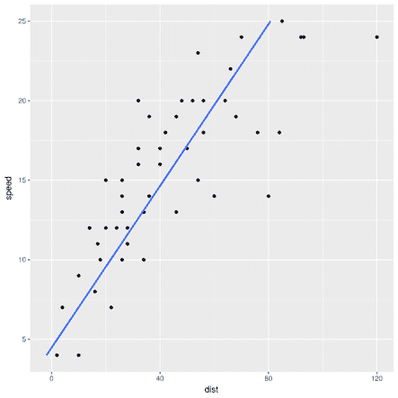

同样，人们可以说，一辆车花了两倍的时间停下来，它的速度也是两倍，并且速度可以作为距离的函数回归。

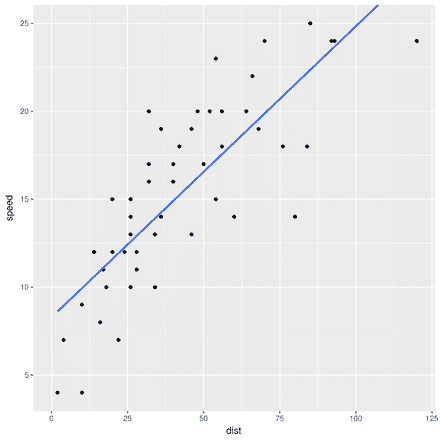

尽管似乎是同一件事的两种说法，但这两种回归将给出不同的最佳拟合线。两者不可能都是最好的。哪个最好，为什么？

要在家跟进，请随意查看并运行创建这些图的代码，可在[这个共享项目中获得。](https://trial.dominodatalab.com/u/srowen/causation/view/main.R)

## 两种最佳疗法

下面的数据集可能看起来很熟悉。它显示了两种肾结石治疗方法的成功率，分为两组病人:一组是小肾结石，一组是大肾结石。你可能会注意到一些奇怪的记录。总的来说，治疗 B 显然更成功。然而，A 疗法对小肾结石更为有效。对其他人来说也更成功。怎么会这样呢？你自己把这些数字加起来。

许多人会马上意识到这是辛普森悖论的一个经典例子。(这个例子来自维基百科。)认识到这一点很重要。然而，承认它并没有回答真正的问题:哪种治疗方法更好？

这个问题现在值得回答，因为在辛普森悖论中有一个更深层次的问题。在这里，A 治疗更好。较大的肾结石更难治疗，总体成功率较低。治疗 A 更经常地给予这些较难的病例。它实际上表现得更好，但总体成功率更低，因为它适用于更难的案件。结石大小是一个混杂变量，表格的行控制结石大小。那么，为了避免这种悖论，总是这样控制所有变量是对的吗？

考虑以下数据: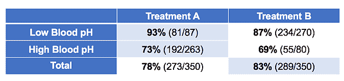这是相同的数据，但现在它被治疗后患者血液的 pH(酸度)分解。根据这个数据，哪种治疗更好？如果不一样，为什么？

## 幻象相关

最后，考虑一下 r 内置的公共数据集`mtcars`,它给出了 20 世纪 70 年代早期几款汽车的统计数据，比如发动机尺寸、燃油效率、气缸数等等。考虑`drat`(轴比)和`carb`(化油器数量-喷油器的旧版本)之间的关系。

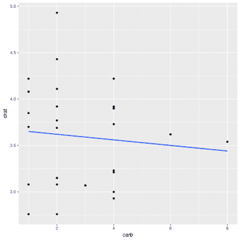

几乎没有相关性(r=-0.09)。这是显而易见的，因为变速器设计和发动机设计是相当正交的。(不可否认，这不是最直观的例子，但从简单的内置数据集来看，这是最显而易见的例子。)

然而，只考虑 6 缸和 8 缸发动机的汽车:

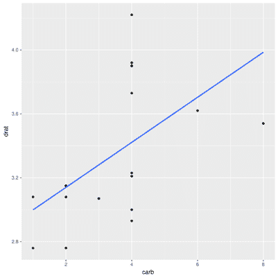

有明显的正相关性(r=0.52)。其他的车呢？

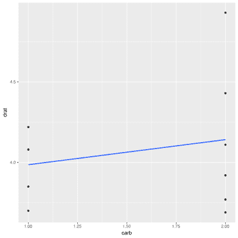

也有正相关，尽管很小(r=0.22)。两个变量如何在部分数据中相关，在其余数据中相关，但在整体上不相关？

## 因果关系的答案

当然，答案是有的。在第一个例子中，两条不同的线来自两组不同的假设。回归`dist ~` 速度意味着距离是速度加上高斯噪声的线性函数，并且该线使实际距离和预测距离之间的平方误差最小化。另一种方法是最小化实际速度和预测速度之间的平方误差。前者对应的是速度导致停车距离的假设，有道理；后者暗示距离导致汽车的速度，这是荒谬的。从 `dist ~ speed` 引出的线是正确的最佳拟合线。然而，做出这样的决定需要诉诸数据本身之外的信息。

速度导致距离的简单想法可以绘制成(非常简单的)有向图:

同样，在第二个辛普森悖论的例子中，血液 pH 不再是一个混杂因素，而是一个中介因素。它并不引起治疗方法的选择，而是由治疗方法的选择引起的。控制它会消除治疗的主要效果。在这种情况下，治疗 B 似乎更好，因为它降低了血液 pH 值，导致更好的结果(尽管治疗 A 似乎确实有一些积极的副作用)。

也就是说，尽管原始场景是:

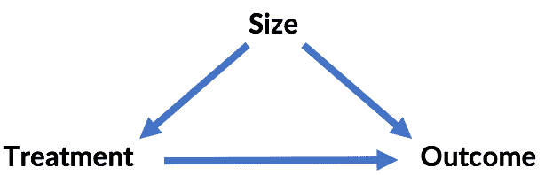

...第二种情况是:

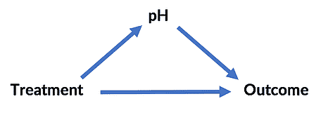

这里的“悖论”同样是可以解决的。在这两种情况下，关于因果关系的外部信息解决了这个问题——而且解决的方式不同！

第三个例子是伯克森悖论的一个实例。轴比和化油器不相关的结论是正确的，假设这两个因素实际上影响汽车的气缸数量。*(这个例子延伸到这里，但是为了便于讨论，假设这是发动机设计的真实情况！)*对气缸的控制创建了一个没有关联的关系，因为气缸的数量是一个关于轴比和化油器的“冲突”变量:

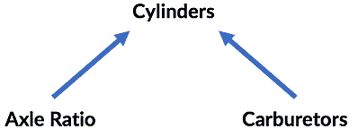

同样，数据并没有告诉我们这一点；变量之间因果关系的知识允许这些结论。

## 概率图形模型和 do 演算

画上面的图是有目的的，通常称为[概率图形模型](https://en.wikipedia.org/wiki/Graphical_model) (PGMs)。这些图表表达了因因果关系而产生的条件概率依赖性。虽然在这些情况下相当琐碎，但它们可以迅速变得复杂。然而，可以通过分析图表来检测上述变量之间的相同类型的关系，这是正确分析数据所必需的。

PGM 是一个有趣的话题。(Coursera 在这个问题上有达芙妮·柯勒的一整套课程。)了解因果关系的重要性以及如何分析因果关系以正确解读数据是数据科学家旅程中的重要一步。

这种类型的分析可能会产生更令人兴奋的能力。如果一个变量取了不同的值，有可能会发生什么。这个想法听起来像是条件概率:鉴于今天冰淇淋销量很高(IC)，防晒霜销量很高(ST)的概率是多少？也就是什么是[latex]P(IC | ST)[/latex]？这很容易从一组数据中找到答案。如果这些是正相关的，我们会进一步预期[latex]P(IC | ST) > P(IC)[/latex] -也就是说，当防晒霜的销量高时，冰淇淋的销量更可能高。

然而，如果我们增加防晒霜的销量，冰淇淋的销量会增加吗？很明显，[latex]P(IC) | do(ST)[/latex]和[latex]P(IC | ST)[/latex]不是一回事，因为我们不希望这两者之间有任何因果联系。

数据只提供简单的条件概率。有没有可能评估数据中没有发生的事情的反事实概率来评估这些关于做的陈述？

令人高兴和惊讶的例子是，是的，这是可能的，借助于因果模型和多年前由朱迪亚·珀尔倡导的“微积分”，以及现在他的新书的主题，“[为什么之书](http://bayes.cs.ucla.edu/WHY/)”作为因果思维、贝叶斯网络、图形模型和珀尔自己对该领域的重大贡献的历史总结，它是非常值得推荐的。

也许这种演算最令人信服的证明是这本书对最终得出吸烟致癌结论的研究的追溯分析。正如 Pearl 所说，关于吸烟是否通过肺部焦油积累导致癌症，或者是否有一种未知的遗传因素导致了吸烟和肺癌，还存在一些问题。不幸的是，这种遗传因素是不可观察的，也不可能控制的。通过绘制隐含的因果模型，现在很容易对此进行推理。

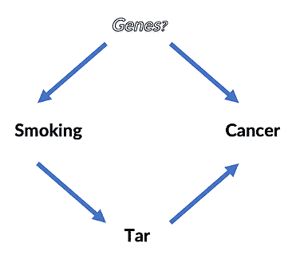

即使没有解决遗传因素是否存在的问题，是否有可能回答诸如“吸烟会导致癌症吗？”[乳胶]是 P(癌| do(吸烟))> P(癌)[/乳胶]吗？

不用细说细节，最好留给论文和书，只要说应用三个简单的“做演算”规则就可以了。它看起来像这样，最后只涉及关于吸烟、焦油和癌症的条件概率陈述，所有这些都可以从现实生活的数据集中获得:

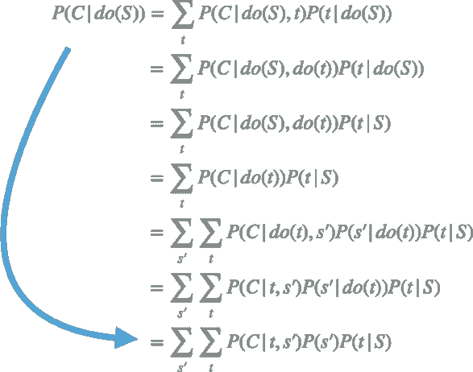

仅仅通过从数据中读取条件概率，就有可能知道吸烟是否导致癌症风险增加，即使不知道是否存在未知的混杂因素。

## 结论

这位经验丰富的数据科学家不仅知道如何将工具作为黑盒来使用。她知道对模型和数据的正确解释往往是模棱两可的，甚至是违反直觉的。避免常见的陷阱是经验丰富的从业者的标志。

幸运的是，这些悖论中的许多都自行解决了，并源于几个简单的共同来源，这些来源可以通过对因果关系网络的推理来分析。概率图形模型和统计方法一样重要。

与 do-calculus 一起，这些工具允许从数据中进行解释和分析，坦率地说，这些数据对于那些习惯于相信因果或反事实结论不可能仅来自数据的人来说是惊人的！