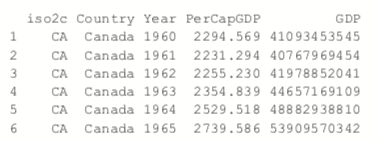
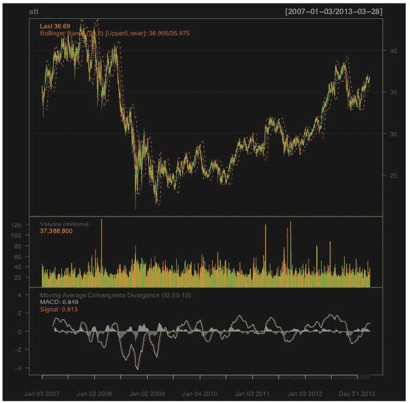

# 含 R 的时间序列

> 原文：<https://www.dominodatalab.com/blog/time-series-with-r>

*本文深入探讨多变量和单变量时间序列数据的分析方法。一个互补的[多米诺骨牌项目](https://try.dominodatalab.com/u/domino-johnjoo/time_series_autocorrelation/overview)是可用的。*

## 介绍

进行探索性分析并从数据中提取有意义的见解是研究和数据科学工作的核心组成部分。时间序列数据是经常遇到的。我们在处理日志数据、财务数据、交易数据以及测量真实工程系统中的任何东西时都会看到它。然而，因为上一个事件影响当前事件，并且事件的顺序很重要，所以与简单的回归或分类机器学习算法相比，我们有义务使用更专业的工具。为了支持数据科学家提取见解并加速他们的工作，Domino 联系了 Addison-Wesley Professional (AWP)以获得适当的权限，从《面向所有人的高级分析和图形，第二版 一书中摘录“时间序列和自相关”一章。AWP 提供了摘录作品的许可，并使我们能够提供一个[补充多米诺骨牌项目](https://try.dominodatalab.com/u/domino-johnjoo/time_series_autocorrelation/overview)。


## 第一章介绍:时间序列和自相关

统计学的很大一部分，尤其是金融和计量经济学数据，是分析时间序列，即随时间自相关的数据。也就是说，一个观察依赖于先前的观察，并且顺序很重要。需要特别注意考虑这种依赖性。r 有许多内置的函数和软件包，使得处理时间序列更加容易。

## 24.1 自回归移动平均线

拟合时间序列模型的最常见方法之一是使用自回归(AR)、移动平均(MA)或两者(ARMA)。这些模型在 R 中得到了很好的表现，并且非常容易使用。ARMA(p，q)的公式是


(24.1)


(24.2)

是白噪声，本质上是随机数据。

AR 模型可以被认为是时间序列的当前值对以前值的线性回归。类似地，MA 模型是时间序列的当前值对当前和先前残差的线性回归。

举例来说，我们将利用世界银行 API 来下载一些国家从 1960 年到 2011 年的国内生产总值(GDP)。

```py
# load the World Bank API package

> library(WDI)

> # pull the data

> gdp <- WDI(country=c("US", "CA", "GB", "DE", "CN", "JP", "SG", "IL"), indicator=c("NY.GDP.PCAP.CD", "NY.GDP.MKTP.CD"), start=1960, end=2011) >

# give it good names

> names(gdp) <- c("iso2c", "Country", "Year", "PerCapGDP", "GDP")

```

下载后，我们可以检查数据，这些数据以长国家年格式存储，图 24.1a 显示了人均 GDP。图 24.1b 显示了绝对 GDP，说明虽然中国的 GDP 在过去十年中大幅增长，但其人均 GDP 仅略有增加。

```py
 > head(gdp)

```



```py
> library(ggplot2)

library(scales)

> # per capita GDP

> ggplot(gdp, aes(Year, GDP, color=Country, linetype=Country))

+      geom_line() + scale_y_continuous(label=dollar)

>

> library(useful)

> # absolute GDP

> ggplot(gdp, aes(Year, GDP, color=Country, linetype=Country)) +

+     geom_line() +   scale_y_continuous(label=multiple_format(extra=dollar,

+                                                              multiple="M"))

```


首先，我们将只查看一个时间序列，因此我们提取美国的数据。

```py
> # get US data

> us <- gdp$PerCapGDP[gdp$Country == "United States"] > # convert it to a time series

> us <- ts(us, start=min(gdp$Year), end=max(gdp$Year)) > us

```


```py
> plot(us, ylab="Per Capita GDP", xlab="Year")

```

 Figure 24.2 Time series plot of US per capita GDP.

另一种评估时间序列的方法是查看它的自协方差函数(ACF)和部分自协方差函数(PACF)。在 R 中，这是通过适当命名的`acf`和`pacf`函数来完成的。

ACF 显示了时间序列与其自身滞后的相关性。也就是说，how
much 时间序列在一个滞后、两个滞后、三个滞后等情况下与自身相关。

PACF 稍微复杂一点。滞后一的自相关会对滞后二及以后的自相关产生延迟效应。部分自相关是时间序列和它本身的滞后之间的相关量，它不能用以前的滞后来解释。所以，滞后二的偏相关是时间序列和第二个滞后之间的相关，第一个滞后不能解释这个相关。

美国人均 GDP 数据的 ACF 和 PACF 如图 24.3 所示。延伸到水平线之外的垂直线表示自相关和部分自相关，它们在那些滞后处是显著的。

```py
> acf(us)

> pacf(us)

```

 Figure 24.3 ACF and PACF of US per capita GDP. These plots are indicative of a time series that is not stationary.

这个时间序列需要一些转换才能被正确地建模。它的上升趋势表明它不是稳定的 1(数据以当前美元计算，因此通货膨胀不是原因)。[注:平稳要求时间序列的均值和方差在整个序列中保持不变。]这可以通过对级数求导或应用其他变换来解决。差分是从一个观测值中减去另一个观测值的过程，可以对任意数量的观测值进行差分。例如，我们从一系列开始


不同的产量

![x(1) = [3 4 -6 4 0 -1 -2]](img/0b1046e1f55edb609ccd5d7daab9d52d.png)

这是连续元素之间的差异。两次迭代微分微分，所以

![x(1) = 3 4 -6 4 0 -1 -2]](img/c5adb191edafad0525ce7048ca564110.png)

请注意，对于每一级差分，序列中的元素会减少一个。在 R 中这样做涉及到`diff`函数。`differences`参数控制迭代计算多少个差值。滞后决定了哪些元素相互相减。滞后 1 减去连续的元素，而滞后 2 减去彼此相距两个索引的元素。

```py
> x <- c(1 , 4 , 8 , 2 , 6 , 6 , 5, 3) >

# one diff


> diff(x, differences=1)
```

```py
[1] 3 4-6 4 0-1-2

> # two iterative diffs

> diff(x, differences=2)

[1] 1 -10 10 -4 -1 -1

> # equivalent to one diff

> diff(x, lag=1)

[1] 3 4-6 4 0-1-2

> # diff elements that are two indices apart

> diff(x, lag=2)

[1] 7-2-2 4-1-3
```

计算出正确的差异数可能是一个令人厌倦的过程。幸运的是，`forecast`包有许多函数可以使处理时间序列数据变得更容易，包括确定最佳差值数。结果如图 24.4 所示。

```py
> library(forecast)

> ndiffs(x=us)
```

```py
[1] 2

> plot(diff(us, 2))
```

 Figure 24.4 Plot of the US per capita GDP diffed twice.

虽然 R 提供了单独的`ar`和`ma`函数，但更好的选择是`arima`函数，它既适合 AR 和 MA 模型，也适合组合的 ARMA 模型。它甚至更稳健，因为它可以区分系列和适应季节影响。传统上，通过分析 ACF 和 PACF 来确定模型中每个组件的正确顺序。这可能是非常主观的，所以幸运的是`forecast`包含了`auto.arima`，它将计算出最佳规范。

```py
> usBest <- auto.arima(x=us)

> usBest
```

```py
Series:

ARIMA(2,2,1)

Coefficients:

        ar1             ar2       ma1

     0.4181         -0.2567   -0.8102

s.e. 0.1632          0.1486    0.1111

sigma^2 estimated as 286942: log likelihood=-384.05

AIC=776.1   AICc=776.99   BIC=783.75
```

该函数确定具有两个差的 ARMA(2，1)(AR(2)分量和 MA(1)分量)是基于最小 AICC 的最佳模型(即，被“校正”以对模型复杂性给予更大惩罚的 AIC)。这两个差异实际上使这成为一个 ARIMA 模型，而不是一个 ARMA 模型，其中 I 代表积分。如果这个模型非常适合，那么残差应该类似于白噪声。

 Figure 24.5 ACF and PACF plots for the residuals of ideal model chosen by auto.arima.

图 24.5 显示了理想模型残差的 ACF 和 PACF。它们类似于白噪声的模式，证实了我们的模型选择。

```py
> acf(usBest$residuals)

> pacf(usBest$residuals)

```

ARIMA 模型的系数是 AR 和 MA 分量。

```py
> coef(usBest)

```

```py
       ar1        ar2        ma1

 0.4181109 -0.2567494 -0.8102419

```

使用`predict<c/ode> function.`基于 ARIMA 模型进行预测与任何其他模型类型非常相似

```py
> # predict 5 years into the future and include the standard error

> predict(usBest, n.ahead=5, se.fit=TRUE)
```

```py
$pred

Time Series:

Start = 2012

End = 2016

Frequency = 1

[1] 49292.41 50289.69 51292.41 52344.45 53415.70

$se

Time Series:

Start = 2012

End = 2016

Frequency = 1

[1] 535.6701 1014.2773 1397.6158 1731.1312 2063.2010
```

可视化这是很容易的，但使用预测功能使它更容易，如图 24.6 所示。

```py
> # make a prediction for 5 years out


> theForecast

<- forecast(object=usBest, h=5) >

# plot it
> plot(theForecast)

```

 Figure 24.6 Five year prediction of US GDP. The think line is the point estimate and the shaded regions represent the confidence intervals.

## 24.2 VAR

当处理多个时间序列时，每个时间序列都依赖于自己的过去、他人的过去和他人的现在，事情变得更加复杂。我们要做的第一件事是将所有的 GDP 数据转换成多元时间序列。为此，我们首先将`data.frame`转换为宽格式，然后调用`ts`进行转换。结果如图 24.7 所示。

```py
> # load reshape2

> library(reshape2)

> # cast the data.frame to wide format

> gdpCast <- dcast(Year ~ Country,

                   data=gdp[, c("Country", "Year", "PerCapGDP")],

                   value.var="PerCapGDP")
> head(gdpCast)
```


```py
> # remove first 10 rows since Germany did not have


>


> # convert to time series


> gdpTS <- ts(data=gdpCast[, -1], start=min(gdpCast$Year),

+                   end=max(gdpCast$Year))

>


> # build a plot and legend using base graphics

>  plot(gdpTS, plot.type="single", col=1:8)

> legend("topleft", legend=colnames(gdpTS), ncol=2, lty=1,

+         col=1:8, cex=.9)

```

 Figure 24.7 Time series plot of GDP data for all countries in the data. This is the same information as in Figure 24.1a, but this was built using base graphics.

## 24.2 VAR

在继续之前，我们必须处理德国的 NAs。出于某种原因，世界银行没有德国 1970 年以前的 GDP 数据。还有其他资源，如圣路易斯美联储经济数据(FRED)，但他们的数据与世界银行的数据不太一致，因此我们将德国从我们的数据中删除。

```py
> gdpTS <- gdpTS[, which(colnames(gdpTS) != "Germany")]


```

将模型拟合到多个时间序列的最常见方法是使用向量自回归(VAR)模型。VAR 的计算公式是


(24.3)

在哪里


(24.4)

是白噪声。

虽然`ar`可以计算 VAR，但当 AR 阶数较高时，它通常会遇到奇异值`matrices`的问题，因此最好使用`vars`包中的`VAR`。为了判断数据是否应该进行差分，我们在`gdpTS`上使用`ndiffs`函数，然后应用差分次数。差异数据如图 24.8 所示，它比图 24.7 具有更好的平稳性。

 Figure 24.8 Differenced GDP data.

```py
> numDiffs <- ndiffs(gdpTS) 
> numDiffs

[1] 1

>  gdpDiffed <- diff(gdpTS, differences=numDiffs) 

>  plot(gdpDiffed, plot.type="single", col=1:7)
>  legend("bottomleft", legend=colnames(gdpDiffed), ncol=2, lty=1,
+            col=1:7, cex=.9)
```

现在数据准备好了，我们可以用 VAR 来拟合一个 VAR。这实质上是 fits
a 利用每个时间序列的 lm 对其自身和其他序列的滞后进行的单独回归。如图 24.9 所示，加拿大和日本模型的系数图证明了这一点。

```py
> library(vars)

> # fit the model

> gdpVar <- VAR(gdpDiffed, lag.max=12) 
> # chosen order
> gdpVar$p

AIC(n) 6

> # names of each of the models 
> names(gdpVar$varresult)

[1] "Canada"           "China"              "Israel"
[4] "Japan"            "Singapore"          "United.Kingdom"
[7] "United.States"

> # each model is actually an lm object 
> class(gdpVar$varresult$Canada)

[1] "lm"


> class(gdpVar$varresult$Japan)

[1] "lm"

> # each model has its own coefficients 
> head(coef(gdpVar$varresult$Canada))
```


```py
> head(coef(gdpVar$varresult$Japan))

```


```py
> library(coefplot)

> coefplot(gdpVar$varresult$Canada)

> coefplot(gdpVar$varresult$Japan)

```

 Figure 24.9 Coefficient plots for VAR model of GDP data for Canada and Japan.

使用
predict 函数，该模型的预测就像其他模型一样。

```py
> predict(gdpVar, n.ahead=5)

```


## 24.3 GARCH

ARMA 模型的一个问题是它们不能很好地处理极端事件或高波动性。为了克服这一点，一个很好的工具是广义自回归条件异方差或 GARCH 模型族，它除了对过程的均值建模之外，还对方差建模。

GARCH(m，s)中方差的模型为


(24.5)

在哪里


(24.6)

和


(24.7)

是广义白噪声。

在这个例子中，我们使用`quantmod`包下载美国电话电报公司股票数据。

```py
> library(quantmod)


> load("data/att.rdata")

> library(quantmod)


> att <- getSymbols("T", auto.assign=FALSE) 

```

这将数据从`xts`包加载到一个`xts`对象中，这是一个更健壮的时间序列对象，在许多其他改进中，可以处理不规则间隔的事件。如图 24.10 所示，这些物体甚至比`ts`的绘图有所改进。

 Figure 24.10 Time series plot of AT&T ticker data.

```py
>library(xts)

> # show data

> head(att)

```


```py
> plot(att)


```

对于那些习惯了金融终端图表的人来说，`chartSeries`函数应该是
令人欣慰的。它创建了如图 24.11 所示的图表。

```py
> chartSeries(att)


> addBBands()


> addMACD(32, 50, 12)

```

 Figure 24.11 Series chart for AT&T.

我们只对收盘价感兴趣，所以我们创建了一个变量来保存它。

```py
> attClose <- att$T.Close

> class(attClose)

[1] "xts" "zoo"

> head(attClose)

           T.Close

2007-01-03   34.95

2007-01-04   34.50

2007-01-05   33.96

2007-01-08   33.81

2007-01-09   33.94

2007-01-10   34.03
```

被广泛认为最适合 GARCH 模型的软件包是`rugarch`。还有其他拟合 GARCH 模型的软件包，比如`tseries`、`fGarch`、`bayesGARCH`，但我们将重点放在`rugarch`。

一般来说，GARCH(1，1)就足够了，因此我们将使该模型适合数据。第一步是使用`ugarchspec`设置模型规格。我们指定波动率建模为 GARCH(1，1)，均值建模为 ARMA(1，1)。我们还指定新息分布应该是 t 分布。

```py
> library(rugarch)
attSpec

<- ugarchspec(variance.model=list(model="sGARCH",

+                                    garchOrder=c(1, 1)),

+                mean.model=list(armaOrder=c(1, 1)),

+                distribution.model="std")

```

下一步是使用 ugarchfit 拟合模型。

```py
attGarch <- ugarchfit(spec=attSpec, data=attClose) 

```

打印模型会显示出很多信息，包括系数、标准误差、AIC 和 BIC。其中大部分，如残差统计、测试、AIC 和 BIC，都是对拟合质量的诊断性度量。靠近顶部的最佳参数是模型的关键。

```py
> attGarch

```

 


图 24.12 显示了时间序列图和模型残差的 ACF。

 Figure 24.12 Residual plots from GARCH model on AT&T data.

为了判断这个模型的质量，我们建立了几个具有不同均值规格的模型——都是 GARCH(1，1)——并比较它们的 AIC。

```py
> # ARMA(1,1)
attSpec1 <- ugarchspec(variance.model=list(model="sGARCH", 
                                              garchOrder=c(1, 1)),
+                         mean.model=list(armaOrder=c(1, 1)), 
+                         distribution.model="std")

> # ARMA(0,0)
> attSpec2 <- ugarchspec(variance.model=list(model="sGARCH", 
                                             garchOrder=c(1, 1)), 
                         mean.model=list(armaOrder=c(0, 0)), 
                         distribution.model="std") 

> # ARMA(0,2)
attSpec3 <- ugarchspec(variance.model=list(model="sGARCH", 
                                              garchOrder=c(1, 1)),
                          mean.model=list(armaOrder=c(0, 2)), 
                          distribution.model="std")
> # ARMA(1,2)
attSpec4 <- ugarchspec(variance.model=list(model="sGARCH", 
+                                             garchOrder=c(1, 1)),
+                         mean.model=list(armaOrder=c(1, 2)), 
+                         distribution.model="std")
> attGarch1 <- ugarchfit(spec=attSpec1, data=attClose) 
> attGarch2 <- ugarchfit(spec=attSpec2, data=attClose) 
> attGarch3 <- ugarchfit(spec=attSpec3, >data=attClose) 
> attGarch4 <- ugarchfit(spec=attSpec4, data=attClose) 
>
> infocriteria(attGarch1) 
```


这表明，根据 AIC 和 BIC 以及其他标准，第一和第四种模式是最好的。

使用来自`rugarch`的对象进行预测是通过`ugarchboot`函数完成的，然后可以绘制成图 24.13。

```py
> attPred <- ugarchboot(attGarch, n.ahead=50,


+                             method=c("Partial", "Full")[1])

> plot(attPred, which=2)
```

 Figure 24.13 Predictions for GARCH model on AT&T data.

因为这是股票数据，所以值得根据日志回报而不是实际收盘价来计算模型。

```py
> # diff the logs, drop the first one which is now NA

> attLog <- diff(log(attClose))[-1]


> # build the specification

> attLogSpec <- ugarchspec(variance.model=list(model="sGARCH",

+                                               garchOrder=c(1, 1)),

+                           mean.model=list(armaOrder=c(1, 1)),

+                           distribution.model="std")

> # fit the model

>  attLogGarch <- ugarchfit(spec=attLogSpec, data=attLog) 


>  infocriteria(attLogGarch)
```

```py
Akaike            -5.869386

Bayes             -5.845481

Shibata           -5.869426

Hannan-Quinn      -5.860500
```

这导致 AIC 显著下降。

重要的是要记住，GARCH 模型的目的不是更好地拟合信号，而是更好地捕捉波动。

## 24.4 结论

时间序列在许多领域都起着至关重要的作用，尤其是在金融和一些物理科学领域。R 中用于时间序列的基本构件是`ts`对象，它被`xts`对象大大扩展了。最常见的模型类型有 ARMA、VAR 和 GARCH，分别用`arima`、`VAR`和`ugarchfit`函数拟合。