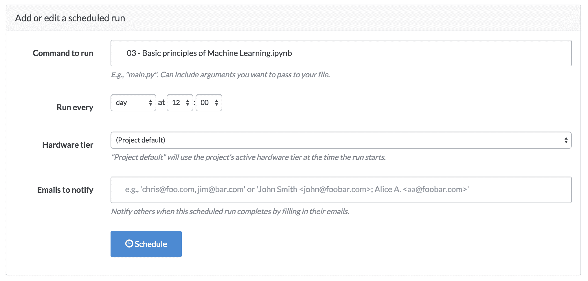

# 去木星和更远的地方

> 原文：<https://www.dominodatalab.com/blog/to-jupyter-and-beyond>

*TLDR；Domino 现在支持带有 R、Python 和 Julia 内核的 Jupyter 以及终端访问。它现在在浏览器中呈现 ipynb 文件，让你更容易地分享、比较和讨论笔记本；它还允许您以批处理作业的方式运行或安排笔记本电脑，使笔记本电脑成为一个很好的报告工具。*

## 介绍

尽管用于交互式探索性分析的工具越来越受欢迎，但我们经常听到数据科学家抱怨安装和配置这些工具是多么耗时和烦人，以及他们没有好的工具来在笔记本上共享和协作。从第一天起，我们就一直在构建 Domino 来解决这两个问题:让数据科学家更容易“启动并运行”，同时促进团队之间的协作和共享。

为此，我们的最新版本包括“一键”访问三个用于交互式数据科学工作的伟大工具: **Jupyter Notebooks** ，它提供对 R、Python、Julia 和 shell 的访问； **Rodeo** ，Python 中交互分析的新 IDE 以及**烧杯笔记本**，强大的多语言笔记本平台。

在接下来的几周里，我将更详细地描述其中的每一个。今天，我将描述我们最近添加的一些改进，这些改进使 Jupyter 在 Domino 上更加强大，特别是对于协作团队工作流。关于在 Domino 中使用 Jupyter 的完整文档在我们的帮助网站上。

## 基础:跑 Jupyter

Domino 让您在任何类型的硬件上只需点击一下就可以启动 Jupyter 笔记本服务器。您可以控制安装哪些软件包(尽管我们默认安装了很多)，您的笔记本服务器将可以访问您项目中的所有文件。

Domino 将在安装了所选硬件的机器上启动 Jupyter，并将项目文件复制到那里。当服务器准备就绪时，您会看到一个打开它的链接:

点击“打开会话”按钮将进入 Jupyter 界面。

我们默认的 Jupyter 安装有 Python 2.7、R 和 Julia 的内核。它还支持创建终端会话。我们支持定制 Jupyter 安装，所以你可以使用任何你想要的内核。

## 查看笔记本文件

启动服务器可能需要一分钟的时间，在许多情况下，能够快速查看可用的笔记本电脑非常重要。

多米诺现在渲染。ipynb 文件，所以你不用运行整个服务器就可以看到笔记本的内容。下图显示了如果您只是浏览查看 ipynb 文件会发生什么——这里没有运行 Jupyter 服务器。

这让您可以将 Domino 项目转变成一个强大的笔记本图库，与同事们共享。如果有人看到他们喜欢的笔记本电脑，他们可以在运行的服务器上点击一下就可以旋转它。或者他们可以派生您的项目来进行他们自己的更改。

## 比较和评论

Domino 已经为数据科学工作提供了强大的协作工具，比如比较实验结果和促进讨论。现在，这些功能也可以很好地处理 ipynb 文件。例如，您可以比较您参与的两个不同会话，并查看笔记本的两个版本之间的差异。

像任何其他文件或结果一样，您可以留下关于笔记本的评论，这些评论将与您的同事共享。

## 使用笔记本进行报告

除了交互式地运行笔记本和静态地查看它们之外，Domino 还允许您将笔记本文件作为批处理作业运行:我们将计算笔记本并将结果保存为 HTML，我们将把它放在 web 上，以便您的同事可以看到它。要将笔记本作为“批处理”作业运行，您可以(a)在文件视图中单击笔记本旁边的“运行”按钮；(b)或者从 CLI 执行普通的“domino run”命令，只需指定笔记本名称(例如，“domino run foo.ipynb”)。

或者，您可以将笔记本设置为按计划运行，这样您的计算、渲染笔记本就可以作为报告发送出去。

