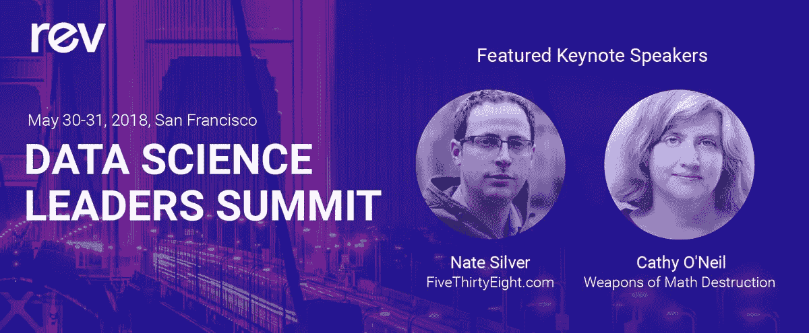

# Rev 大会上最值得期待的 10 件事

> 原文：<https://www.dominodatalab.com/blog/top-10-things-to-look-forward-to-at-rev>

By Karina Babcock on May 01, 2018 in [Company Updates](/blog/company-updates/)

在不到一个月的时间里，首届数据科学领袖年度峰会即将举行。我们很高兴地宣布，此次活动的详细议程现已公布，届时将有来自不同行业、地区和规模的公司的杰出演讲者、数据科学领导者和从业者参加。

简而言之，这是与会者在 Rev 大会上应该期待的 10 件事的清单——没有经过任何科学审查。

### 10.举办地点

耶尔巴布埃纳艺术中心(Yerba Buena Center for the Arts)是一个以点燃大规模运动而闻名的场所，位于旧金山市中心，Rev 与会者可以在市中心的 Marriott Marquis 酒店获得无与伦比的 199 美元/晚的房价。

### 9.娱乐

在开幕晚宴上，来自一位惊喜嘉宾的令人兴奋的娱乐和顶级饮品。

### 8.车间

参加“管理数据科学生命周期的最佳实践”有限座位研讨会，提供实物外卖和实用的实践建议。

### 7.熊实验室预览

有机会从韦斯·麦金尼那里直接了解新的乌尔萨实验室。

### 6.免费培训

价值 1000 美元的会后多米诺培训，免费提供给 Rev 与会者。

### 5.深度会话

从业者会议深入探讨适用的使用案例和方法，如来自德勤、戴尔、AncestryDNA、UnitedHealth Group、摩根大通和其他公司的数据科学家的蒙特卡罗排列、GPU 深度学习、实验设计和多标签分类。

### 4.领导力课程

关于组织变革管理、与 IT 保持一致和发展团队的领导力会议，主讲人来自 Airbnb、S&P 全球、贝莱德、Stitch Fix、enlight 等。

### 3.新功能

亲身体验新的 Domino 特性和功能。

### 2.内特·西尔弗和凯茜·奥尼尔

主题演讲、签名售书机会以及 Nate Silver 和 Cathy O'Neil 的现场问答。

### 1.未来

这是加入这一塑造未来的数据科学领导者运动的第一手机会。

几周后见！

[Twitter](/#twitter) [Facebook](/#facebook) [Gmail](/#google_gmail) [Share](https://www.addtoany.com/share#url=https%3A%2F%2Fwww.dominodatalab.com%2Fblog%2Ftop-10-things-to-look-forward-to-at-rev%2F&title=Top%2010%20Things%20to%20Look%20Forward%20to%20at%20Rev)