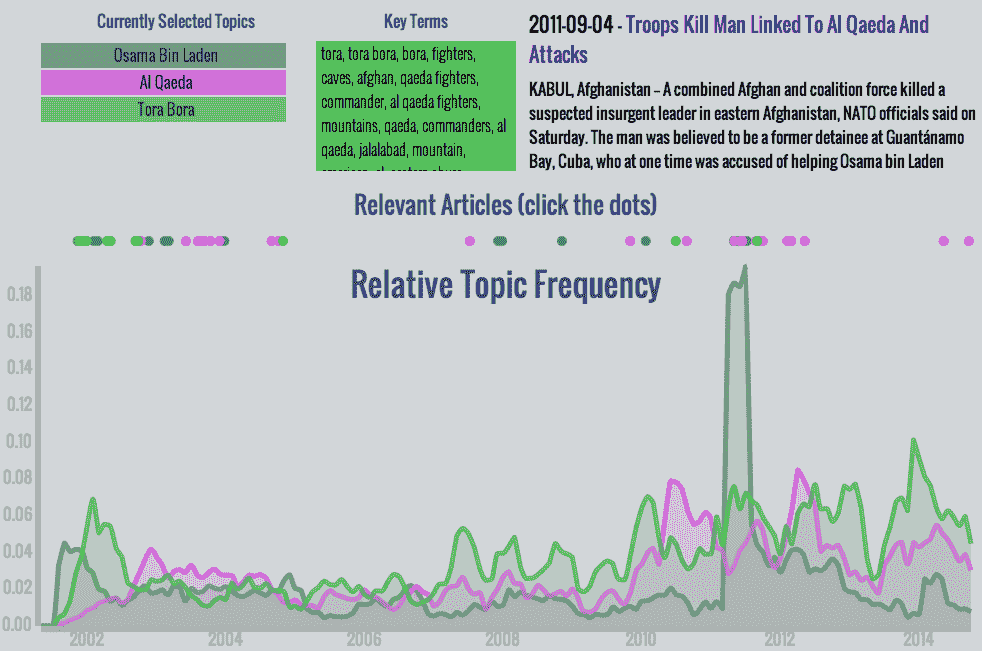
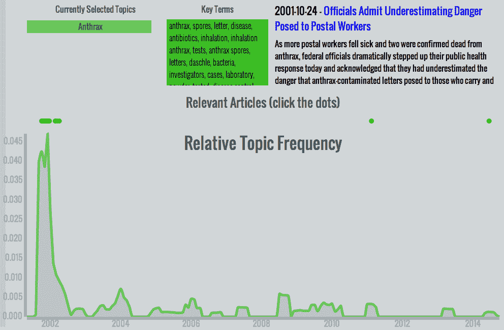

# 9/11 新闻文章中的主题建模

> 原文：<https://www.dominodatalab.com/blog/topic-modeling-in-sept-11-news-articles>

这是丹·莫瑞斯的客座博文。另外还有[交互式仪表盘](http://djsensei.github.io/911)和[代码](https://github.com/djsensei/AlwaysRemember)。

这篇文章描述了一个项目，该项目将与 9 月 11 日^(袭击及其持久影响和后果相关的新闻文章中的主题可视化。我描述了我的动机、实现的技术细节以及我对一些结果的思考。)



## 介绍

在美国近代史上，没有比 9/11 袭击更具变革性的事件了；它们挥之不去的影响将持续到未来。自那以后的几年里，成千上万的文章被写在了 9/11 事件上，每一篇都涵盖了新出现的话题的一小部分。我们如何使用数据科学的工具来发现这些主题并追踪它们随时间的进展？

## 灵感

这个主题最初是由一家名为 [Local Projects](http://www.localprojects.com/) 的公司提出的，他们被委托为纽约的[国家 911 博物馆](http://www.911memorial.org/)设计一个展览。他们的展览，[时代景观](http://www.fastcodesign.com/3030603/new-museum-uses-algorithms-to-visualize-how-9-11-still-shapes-the-world)，将主题和文章的图像投射到博物馆的墙上。不幸的是，由于官僚主义和现代人的注意力跨度的考虑，展览仅限于广泛的主题和简短的循环持续时间。我的灵感来自时代景观的建筑师，但我想创造一些更深入和更具互动性的东西；任何有网络连接的人都可以在闲暇时探索。

这个问题的本质是讲故事。每篇文章都对一个故事提供了一些视角，但是连接它们的线索是以单词和短语的形式存在的。《奥萨马·本·拉登》、《关塔那摩湾》、《自由》等等。这些是我的模型的组成部分。

## 获取数据

在所有新闻来源中，没有比《纽约时报》更适合讲述 9/11 事件的了。他们也有一个很棒的 API，允许人们查询完整的文章数据库，找到与特定主题相关的文章。我使用这个 API 以及一系列的 [python 网页抓取](https://www.dominodatalab.com/blog/getting-data-with-beautiful-soup)和 [NLP 工具](https://www.dominodatalab.com/blog/deep-learning-illustrated-building-natural-language-processing-models)建立了我的语料库。

刮削过程如下:

1.  查询 API 以获取关于新闻文章的元数据，包括每篇文章的 URL。
2.  向每个 URL 发送一个 HTTP GET 请求，在 HTML 中找到实际的文章文本，并提取它。
3.  清理文章文本，删除[停用词](http://en.wikipedia.org/wiki/Stop_words)和标点符号。

我编写了 python 脚本来自动化这些过程，并且能够建立一个包含数万篇文章的语料库。也许这个过程中最具挑战性的部分是构建从 HTML 文档中提取文章文本的函数。在过去的几十年里，NYT 偶尔会改变他们的 HTML 文件的格式，因此提取文本的函数依赖于一个庞大的嵌套条件:

```py
# s is a BeautifulSoup object containing the HTML of the page

if s.find('p', {'itemprop': 'articleBody'}) is not None:

    paragraphs = s.findAll('p', {'itemprop': 'articleBody'})

    story = ' '.join([p.text for p in paragraphs])

elif s.find('nyt_text'):

    story = s.find('nyt_text').text

elif s.find('div', {'id': 'mod-a-body-first-para'}):

    story = s.find('div', {'id': 'mod-a-body-first-para'}).text

    story += s.find('div', {'id': 'mod-a-body-after-first-para'}).text

else:

    if s.find('p', {'class': 'story-body-text'}) is not None:

        paragraphs = s.findAll('p', {'class': 'story-body-text'})

        story = ' '.join([p.text for p in paragraphs])

    else:

        story = ''
```

## 向量化文档

在我们能够进行任何严肃的机器学习之前，我们必须对我们的文档进行矢量化。由于 scikit-learn 的 [TF-IDF 矢量器](http://scikit-learn.org/stable/modules/generated/sklearn.feature_extraction.text.TfidfVectorizer.html)，这出奇的容易。只考虑单个单词是不够的，因为在我的语料库中不缺少重要的名字和短语。所以我选择包含从 1 到 3 的 n 元文法。令人愉快的是，实现多个 n 元语法就像矢量器初始化中的一个关键字参数一样简单:

```py
vec = TfidfVectorizer(max_features=max_features,

            ngram_range=(1, 3),

            max_df=max_df)
```

在早期的建模运行中，我将`max_features`(向量模型中包含的单词或短语的最大数量)设置为 20，000 或 30，000，在我的本地机器的合理计算限制范围内，但是考虑到包含 2-和 3-gram 会导致可能的功能组合爆炸(其中许多功能确实很重要)，我希望在最终的模型中提高这个数字。

## 用 NMF 进行主题建模

非负矩阵分解，或 NMF，是一个令人愉快的线性代数优化算法。它最神奇的属性是，它可以提取关于主题的有意义的信息，而无需了解数据中的潜在含义！它的数学目标是将单个 n x m 输入矩阵分解成两个矩阵，通常命名为 W 和 H。W，文档-主题矩阵，形状为 n x t，H，主题-术语矩阵，形状为 t x m。事实上，该模型试图形成 W 和 H，使得它们的乘积非常接近输入矩阵。该算法的另一个很好的特性是，用户可以自由决定变量 t 的大小，t 代表产生的主题数量。

我再一次把重任交给了 scikit-learn，它的 T2 NMF 模块足以完成手头的任务。如果我在这个项目上花更多的时间，我可能会探索更有效的优化 NMF 的方法，因为这是这个项目中计算量最大的过程。在项目工作中，我想到了一个想法，但没有实现，那就是热启动版本。这将允许用户通过用特定术语播种 H 矩阵的行来将一些领域知识注入到主题的形成中。无论如何，我只有几周的时间来完成整个项目，所以我很满意为项目的这一部分插入一个好的预建算法。还有很多其他方面需要我更多的关注。

### 主题建模参数

因为主题模型是整个项目的基石，我在构建它时所做的决定对最终产品有相当大的影响。我决定将模型的输入限制在 9/11 之后 18 个月的文章。在那个时期，字面上和隐喻上的尘埃落定，所以所有作为 9/11 的直接结果而出现的话题都是在那个时间窗口内出现的。就像在矢量化阶段一样，我早期运行的规模受到了计算机能力的限制。结果是体面的 20 或 30 个主题，但我想要一个更大的模型，更实质性的结果。

我的最终模型使用了 100，000 个矢量化术语和大约 15，000 个文档。我选择了 200 个主题，因此 NMF 算法必须处理形状为 15000x100000、15000x200 和 200x100000 的矩阵，逐渐将后两种形状调整为符合第一种形状。

### 最终确定模型

在我的最终模型矩阵形成后，我浏览了每个主题并检查了关键术语(那些在主题术语矩阵中值最高的术语)。对于每个主题，我给它指定了一个特定的名称(稍后将在可视化中使用)，并决定是否保留它。一些主题因与中心主题无关而被拒绝(例如，本地运动队)。其他的则过于宽泛或普通(关于股票市场或政治的话题)。还有一些过于具体，可能是 NMF 算法的产物(一系列相连的 3 个字母显然来自一个文档)。

在这个过程之后，我留下了 75 个强有力的相关主题，每个主题都根据其内容命名。

## 分析

一旦主题模型完成，确定任何给定文章的主题权重是一项简单的任务:

1.  使用存储的 TF-IDF 矢量器对文章文本进行矢量化
2.  找出术语向量和来自 NMF 的过滤主题术语矩阵的点积。(1 x 100k * 100k x 75 = 1 x 75)
3.  由此产生的 75 个元素的向量表明了这篇文章与 75 个主题的相关性。

更困难的部分是确定如何将这些文章权重编译成一种可以可视化的格式，以讲述引人入胜的故事。如果我简单地将给定时间段内所有文章的每个主题的权重相加，那么分布*将*准确地表示每个主题在该新闻周期中出现的频率。然而，这种分布的单位对于人类用户来说是没有意义的。另一方面，如果我对每个主题使用二进制分类，我可以找到一段时间内与特定主题相关的所有文章的百分比。我选择这种方法是因为它更容易理解。

二元主题分类有其自身的困难，特别是涉及文章和主题的不同权重。一些文章的主题权重较高，因为它们较长，并且包含了许多主题间共享的关键词。其他文章的主题权重普遍较低，即使是那些显然适合手动检查的文章的主题。这些变化使得固定的重量阈值不适合分类；一些文章可能属于几十个主题，而另一些则不属于任何主题。相反，我决定将每篇文章归类为权重最高的三个主题。虽然这种方法并不完美，但它很好地平衡了我们的主题加权模型所产生的各种问题。

## 形象化

虽然数据获取、主题建模和分析阶段都是这个项目的关键要素，但它们都是为最终的可视化服务的。我努力在视觉吸引力和用户互动之间找到适当的平衡，让用户在最少的指导下探索和理解主题的趋势。我使用堆积面积图作为主要图形，直到我意识到一个简单的重叠线图足够清晰。

我使用 d3.js 构建了可视化，这非常适合项目的数据驱动特性。数据本身以一个包含主题趋势数据的 CSV 文件和两个包含主题和文章元数据的 JSON 文件的形式传递到页面中。虽然我(现在也是)不是前端开发方面的专家，但我在一周的时间里学会了足够的 d3、html 和 css 来构建一个令人满意的可视化页面。

### 一些有趣的话题

*   炭疽热——911 之后，恐惧的气氛笼罩了整个国家。幸运的是，许多担心都是没有根据的。2001 年末的炭疽热恐慌是一个孤立的事件，没有太多持久的影响，从这个图中可以清楚地看到。



*   奥萨马·本·拉登、基地组织、托拉搏拉——2011 年本·拉登在阿伯塔巴德被追捕后，任何话题中的最大峰值出现了。这种主题组合是值得注意的，因为它显示了媒体报道在 9/11 之后的进展:首先，奥萨马·本·拉登获得了大部分的关注。不久之后，托拉搏拉话题因被认为是本拉登的藏身之处和美国军方关注的焦点而变得突出。当本·拉登显然已经逃脱追捕时，这两个话题的重要性都下降了，而更广泛的基地组织话题略有上升。近年来，每个专题的数量逐渐增加，这表明它们仍然具有相关性。即使覆盖面没有绝对增加，它们的相对频率也会随着其他话题的减少而增加。


## 我学到了什么

虽然项目结束后，我对主题建模和完整数据管道的其他组件有了更全面的理解，但项目的真正价值在于它(重新)讲述的故事。9/11 本质上是负面的，但也有许多正面的故事:拯救了许多生命的英雄，团结的社区，以及重建。

不幸的是，在我的主题模型中出现的东西反映了更大的媒体氛围:对消极、恶棍和破坏的关注。当然，个别英雄在一两篇文章中受到了表彰，但没有一篇足以成为话题。另一方面，像奥萨马·本·拉登和扎卡里亚斯·穆萨维这样的恶棍在成百上千的文章中被提及。即使是瑞德·李察，这个笨手笨脚(企图)的鞋子炸弹客，在媒体上也比成功的英雄有更持久的影响(补充说明:以术语为中心的主题模式的弱点之一是，像里德这样的常见名字可能导致关于非常不同的人的文章聚集在一起。在这种情况下，哈里·里德和瑞德·李察。).