# 基于密度的聚类

> 原文：<https://www.dominodatalab.com/blog/topology-and-density-based-clustering>

###### Manojit Nandi 原创内容 Josh Poduska 更新。

聚类分析是数据分析中的一个重要问题。数据科学家使用聚类来识别故障服务器，将具有相似表达模式的基因分组，并执行各种其他应用。

数据聚类算法有很多种，您可能熟悉最流行的一种:k-means。作为快速复习，k-means 确定数据中的 k 个质心，并通过将它们分配到最近的质心来聚类点。

虽然 k-means 在实践中易于理解和实现，但该算法没有离群值的概念，因此所有的点都被分配到一个聚类中，即使它们不属于任何聚类。在异常检测的领域中，这导致了问题，因为异常点将被分配到与“正常”数据点相同的聚类中。异常点将聚类质心拉向它们，使得将它们归类为异常点更加困难。

在这篇博文中，我将介绍一系列被称为基于密度的聚类的技术。与 k-means 等基于质心的聚类相比，基于密度的聚类通过识别点的“密集”聚类来工作，允许它学习任意形状的聚类并识别数据中的异常值。特别是，我将:

*   讨论非常流行的 DBSCAN 算法。
*   使用 denpro R 包。这个库包含了水平集树聚类算法的有效实现。

和往常一样，代码[可以在 Domino 平台](https://try.dominodatalab.com/u/nmanchev/clustering/overview)上找到。不用注册就可以浏览项目。文件下的“Clustering.ipynb”是一个很好的起点。你需要[注册](https://www.dominodatalab.com/trial)来在 Domino 中免费运行代码。

[](https://cta-redirect.hubspot.com/cta/redirect/6816846/c37e0058-5e6a-4d2a-8922-c8a7acf60ca7) 

## 初步:ɛ-Balls 和邻里密度

在讨论基于密度的集群之前，我们首先需要讨论一个您可能在拓扑课程中见过的主题:ɛ-neighborhoods.

ɛ-neighborhoods 背后的一般思想是给定一个数据点，我们希望能够对它周围空间中的数据点进行推理。形式上，对于一些实值ɛ > 0 和一些点 p，p 的ɛ-neighborhood 被定义为距离 p 至多ɛ距离的点集

如果你回想一下几何学，所有的点到中心的距离相等的形状就是圆。在 2D 空间中，点 p 的ɛ-neighborhood 是包含在以 p 为中心的半径为ɛ的圆中的点集。在 3D 空间中，ɛ-neighborhood 是以 p 为中心的半径为ɛ的球体，而在更高维度的空间中，ɛ-neighborhood 只是以 p 为中心的半径为ɛ的 n 球体

让我们考虑一个例子来使这个想法更具体。

我在区间[1，3]X[2，4]里散了 100 个数据点。让我们选择点(3，2)作为我们的点 p。

![100 data points in the interval [1,3]X[2,4]](img/cd766d7970d21853dbb93176e077b87c.png)

首先，让我们考虑半径为 0.5 (ɛ = 0.5)的 p 的邻域，即距离 p 为 0.5 的点集

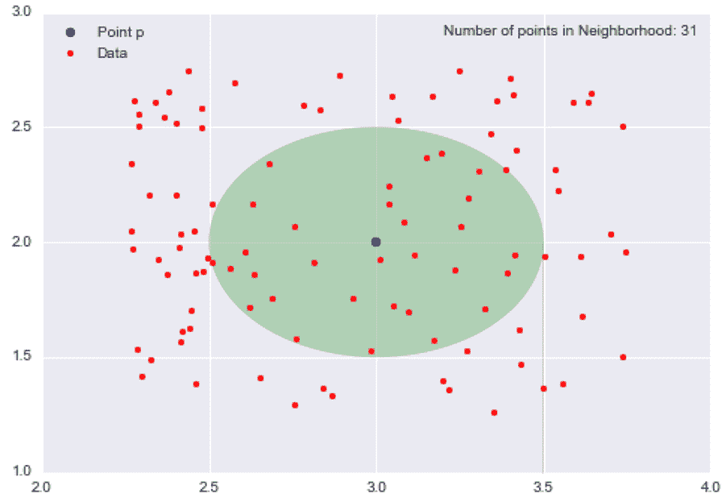

不透明的绿色椭圆形代表我们的邻域，在这个邻域中有 31 个数据点。由于我分散了 100 个数据点，其中 31 个数据点在邻域内，这意味着不到三分之一的数据点包含在半径为 0.5 的 p 的邻域内。

现在，让我们将半径改为 0.15 (ɛ = 0.15)，并考虑由此产生的更小的邻域。

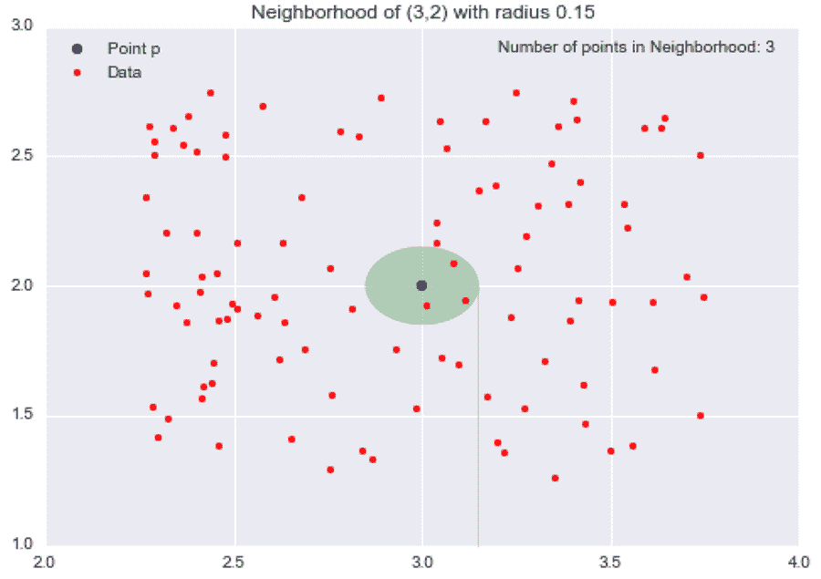

我们缩小了邻域，所以现在只有 3 个数据点包含在其中。通过将ɛ从 0.5 减少到 0.15(减少 70%)，我们将邻域中的点数从 31 减少到 3(减少 90%)。

既然我们已经定义了“邻域”的含义，我们将引入下一个重要的概念:邻域“密度”的概念(毕竟，我们正在建立描述“基于密度的聚类”)。

在小学科学课上，孩子们被告知密度=质量/体积。让我们使用质量除以体积的思想来定义某个点 p 处的密度。如果我们考虑某个点 p 及其半径为ɛ的邻域，我们可以将邻域的质量定义为邻域内包含的数据点的数量(或者数据点的分数),邻域的体积是邻域的最终形状的体积。在 2D 的例子中，邻域是一个圆，所以邻域的体积就是圆的面积。在 3D 和更高维的情况下，邻域是球体或 n 球体，因此我们可以计算这个形状的体积。

例如，让我们再次考虑半径为 0.5 的 p = (3，2)的邻域。

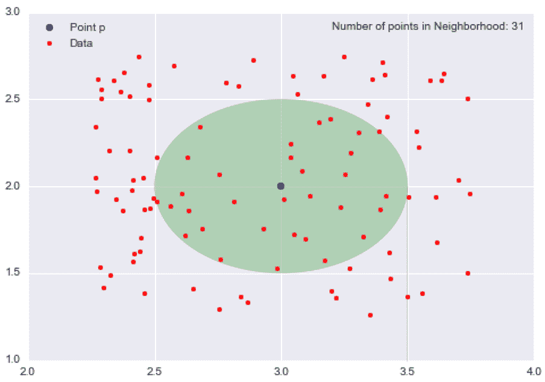

质量是邻域中数据点的数量，因此质量= 31。体积是圆的面积，所以体积= π0.25 = π/4。所以我们在*p = (3，2)的局域密度近似计算为密度=质量/体积= 31/(π/4) = 124/π ~= 39.5。

这个值本身是没有意义的，但是如果我们计算数据集中所有点的局部密度近似值，我们可以通过说邻近的(包含在同一个邻域中)并且具有相似局部密度近似值的点属于同一个聚类来对我们的点进行聚类。如果我们降低ɛ的值，我们可以构建包含更少数据点的更小的邻域(更小的体积)。理想情况下，我们希望识别高密度的邻域，其中大部分数据点都包含在这些邻域中，但这些邻域中每个邻域的体积都相对较小。

虽然这不完全是 DBSCAN 或水平集树算法所做的，但它形成了基于密度的聚类背后的一般直觉。

概括地说，我们讨论了ɛ-neighborhoods，以及它们如何让我们对特定点周围的空间进行推理。然后我们为一个特定的邻域定义了一个特定点的密度概念。在下一节中，我将讨论 DBSCAN 算法，其中ɛ-ball 是定义聚类的基本工具。

## DBSCAN

DBSCAN(含噪声应用的基于密度的空间聚类)是最著名的基于密度的聚类算法，[由 Ester 等人于 1996 年首次提出。al](https://dl.acm.org/doi/10.5555/3001460.3001507) 。由于其在理论和应用上的重要性，该算法是 2014 年 KDD 会议上获得[时间检验奖](https://www.kdd.org/awards/view/2014-sikdd-test-of-time-award-winners)的三个算法之一。

与 k-means 不同，DBSCAN 不需要将聚类数作为参数。相反，它根据数据推断聚类的数量，并且可以发现任意形状的聚类(作为比较，k-means 通常发现球形聚类)。如前所述，ɛ-neighborhood 是 DBSCAN 逼近局部密度的基础，因此该算法有两个参数:

*   *ɛ* :我们在一个数据点周围的邻域半径 *p* 。
*   *minPts* :我们希望在一个邻域中定义一个聚类的最小数据点数。

使用这两个参数，DBSCAN 将数据点分为三类:

*   *核心点*:如果 **Nbhd** ( *p* ，*ɛ*)*p*的ɛ-neighborhood 至少包含 *minPts* ，则一个数据点 *p* 为一个*核心点*；| **Nbhd** ( *p* ，*ɛ*)|>=*min pts*。
*   *边界点:如果 **Nbhd** ( *q* ， *ɛ* )包含的数据点少于 *minPts* 数据点，但 *q* 是从某个*核心点* *p* 到达*的*边界点*。**
*   *离群点*:如果一个数据点 *o* 既不是核心点也不是边界点，那么它就是一个*离群点*。本质上，这是“其他”类。

这些定义可能看起来很抽象，所以让我们更详细地讨论一下每个定义的含义。

### 核心要点

*核心点*是我们集群的基础，基于我在上一节中讨论的密度近似值。我们使用相同的ɛ来计算每个点的邻域，因此所有邻域的体积都是相同的。然而，每个邻域中其他点的数量是不同的。回想一下，我说过我们可以把邻域中数据点的数量看作它的*质量*。每个邻域的体积是恒定的，而邻域的质量是可变的，所以通过对需要成为*核心点*的最小质量设置一个阈值，我们实质上是设置了一个最小密度阈值。因此，核心点是满足最小密度要求的数据点。我们的集群是围绕我们的*核心点*(因此是*核心*部分)构建的，因此通过调整我们的 *minPts* 参数，我们可以微调我们的集群核心的密度。

### 边界点

*边界点*是我们聚类中不是核心点的点。在上面对*边界点*的定义中，我使用了术语*密度可达*。我还没有定义这个术语，但是这个概念很简单。为了解释这个概念，让我们重温一下ε= 0.15 的邻域示例。考虑点 *r* (黑点)在点 *p* 的邻域之外。

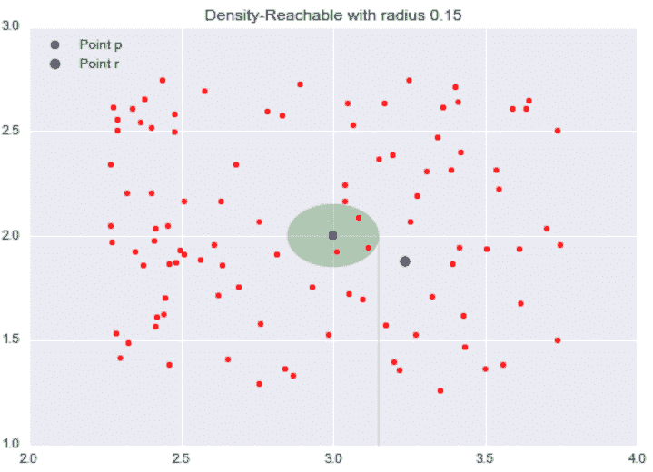

点 *p* 的邻域内的所有点都被称为从 *p* 直接可达*的点。现在，让我们探索点 *q* 的邻域，点*可从 *p* 直接到达*。黄色圆圈代表 *q* 的邻居。*

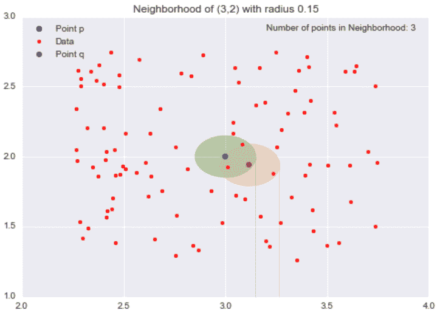

现在，虽然我们的目标点 *r* 不是我们的起点 *p* 的邻域，但它包含在点 *q* 的邻域中。这是密度可达背后的思想:如果我可以从点 *p* 开始，通过从一个邻域跳到另一个邻域到达点 *r* ，那么点 *r* 是从点 *p* 密度可达的。

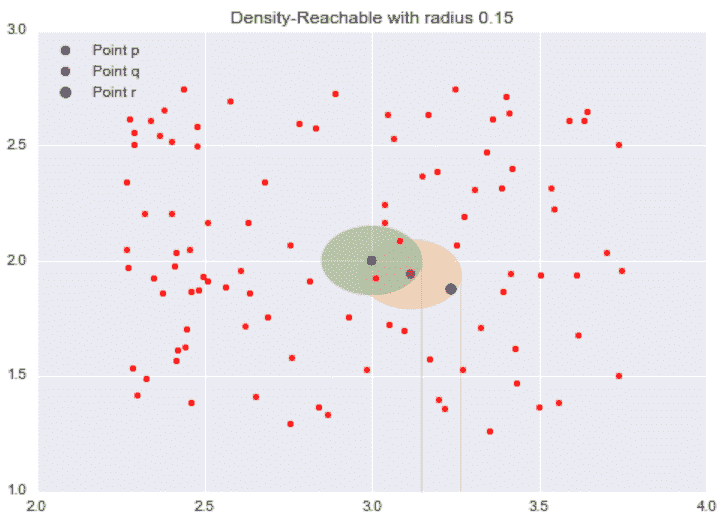

打个比方，我们可以把*密度可达的*点想象成“朋友的朋友”。如果一个*核心点 p* 的*可直接到达的*是它的“朋友”，那么*密度可到达的*点，即 *p* 的“朋友”的邻域中的点，是“它的朋友的朋友”。可能不清楚的一件事是*密度可达*点不仅限于两个相邻的邻域跳跃。只要你能到达做“邻居跳跃”的点，从一个*核心点 p* 开始，那个点是从 *p* 可到达的*密度*，所以“朋友的朋友的朋友……朋友的朋友”也包括在内。

重要的是要记住,*密度可达的概念依赖于我们的ɛ.值通过选择较大的ɛ值，更多的点成为*密度可达*，通过选择较小的ɛ值，较少的点成为*密度可达*。*

### 极端值

最后，我们到了我们的“其他”类。*离群点*是既不是*核心点*也不是足够靠近一个集群以至于从*核心点*到*密度可达*的点。*异常值*未分配给任何聚类，并且根据上下文，可能被视为异常点。

既然我已经介绍了所有的预备知识，我们终于可以谈谈算法在实践中是如何工作的了。

### 应用

DBSCAN 是在流行的 Python 机器学习库 [Scikit-Learn](http://scikit-learn.org/stable/) 中实现的，因为这个实现是可伸缩的并且经过了良好的测试，所以我将使用它来演示 DBSCAN 在实践中是如何工作的。

DBSCAN 算法的步骤如下:

*   随机选取一个点，该点没有被分配给一个聚类，也没有被指定为*异常值*。计算它的邻域以确定它是否是一个*核心点*。如果是，围绕这个点启动一个集群。如果否，将该点标记为*异常值*。
*   一旦我们找到一个*核心点*并因此找到一个集群，通过将所有*可直接到达的*点添加到该集群来扩展该集群。执行“邻域跳跃”来找到所有的*密度可达*点，并将它们添加到集群中。如果添加了*异常值*，则将该点的状态从*异常值*更改为*边界点*。
*   重复这两个步骤，直到所有点要么被分配到一个聚类，要么被指定为一个*异常值*。

多亏了 Scikit-Learn 易于使用的 API，我们只用几行代码就可以实现 DBSCAN

```py
from sklearn.cluster import DBSCAN
```

为了测试 DBSCAN，我将使用一个由批发分销商的年度客户数据组成的[数据集。](https://archive.ics.uci.edu/ml/datasets/Wholesale+customers)

该数据集由 440 个客户组成，每个客户有 8 个属性。我将使用 Pandas 库来加载。csv 文件转换为 DataFrame 对象:

```py
import pandas as pd

data = pd.read_csv("data/wholesale.csv")

#Drop non-continuous variables

data.drop(["Channel", "Region"], axis = 1, inplace = True)
```

删除标识客户的两个字段后，我们可以检查该数据集的前几行:

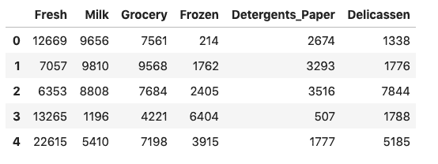

因此，我们可以将数据可视化，我将只使用其中的两个属性:

*   杂货:顾客在杂货产品上的年度支出(以某种货币单位计)。
*   牛奶:顾客每年在奶制品上的花费(以某种货币单位计)。

```py
data = data[["Grocery", "Milk"]]

data = data.to_numpy().astype("float32", copy = False)
```

因为数据的值以千计，所以我们将通过将每个属性的平均值和单位方差调整为 0 来对其进行规范化。

```py
stscaler = StandardScaler().fit(data)

data = stscaler.transform(data)
```

现在，让我们来可视化标准化数据集:

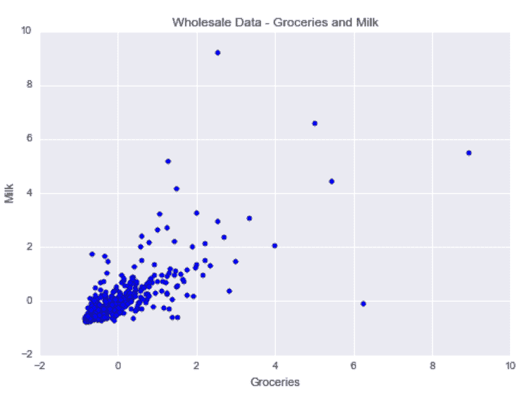

如你所见，食品杂货购买和奶制品购买之间存在正相关关系。有一个以平均牛奶购买量(牛奶= 0)和平均食品杂货购买量(食品杂货= 0)为中心的聚类。此外，与其他顾客相比，购买更多食品杂货或奶制品的顾客也有一些异常值。

通过 DBSCAN，我们希望识别这一主要客户群，但我们还希望将具有更多不寻常年度购买习惯的客户标记为异常值。

我们将构建一个 DBSCAN 对象，它要求半径为 0.5 的邻域中至少有 15 个数据点被视为核心点。

dbsc = DBSCAN(eps = .5，min_samples = 15)。拟合(数据)

接下来，我们可以提取我们的聚类标签和离群值来绘制我们的结果。

```py
labels = dbsc.labels_

core_samples = np.zeros_like(labels, dtype = bool)

core_samples[dbsc.core_sample_indices_] = True
```

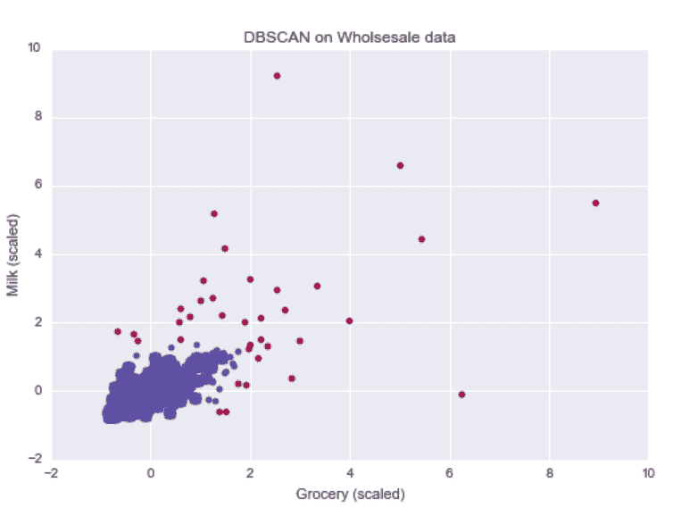

根据我们的直觉，DBSCAN 算法能够识别一个购买普通食品和奶制品的客户群。此外，它还能够标记出年度购买行为与其他客户相差太大的客户。

因为异常值对应于具有更极端购买行为的客户，批发分销商可以专门针对这些客户提供独家折扣，以鼓励更大的购买量。

作为基线，让我们对这个数据集上的两个聚类运行 k-means。蓝色大圆点代表黑色星团的质心，金色大圆点代表白色星团的质心:

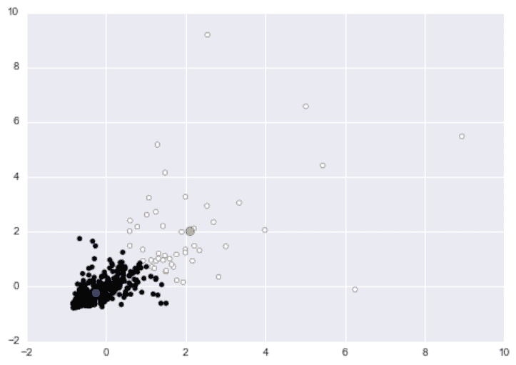

虽然白色聚类似乎捕获了大多数异常值，但该聚类基本上捕获了购买相对更多商品的客户。如果我们将白色聚类指定为“异常”聚类，那么我们基本上标记了购买大量牛奶或食品的任何客户。如果你是批发分销商，那么你会把你更好的客户，那些你从中赚更多钱的客户，称为异常客户。

### DBSCAN -玩具示例

对于 DBSCAN 的功能，我们考虑一个非正式地称为“半月”数据集的玩具示例，其中每个数据点属于两个“半月”中的一个。

```py
from sklearn.datasets import make_moons

#moons_X: Data, moon_y: Labels

moons_X, moon_y = make_moons(n_samples = 2000)
```

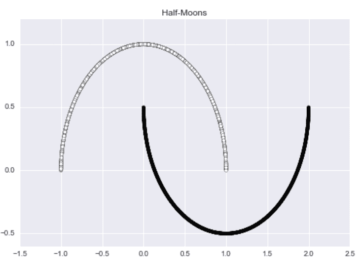

这个数据集很有美感，但是没有异常值。为了纠正这个问题，我将使用以下代码向 1%的数据添加随机噪声:

```py
def add_noise(X,y, noise_level = 0.01):

    #The number of points we wish to make noisy

    amt_noise = int(noise_level*len(y))

    #Pick amt_noise points at random

    idx = np.random.choice(len(X), size = amt_noise)

    #Add random noise to these selected points

    noise = np.random.random((amt_noise, 2) ) -0.5

    X[idx,:] += noise

    return X
```

现在数据集有了明显的异常值。

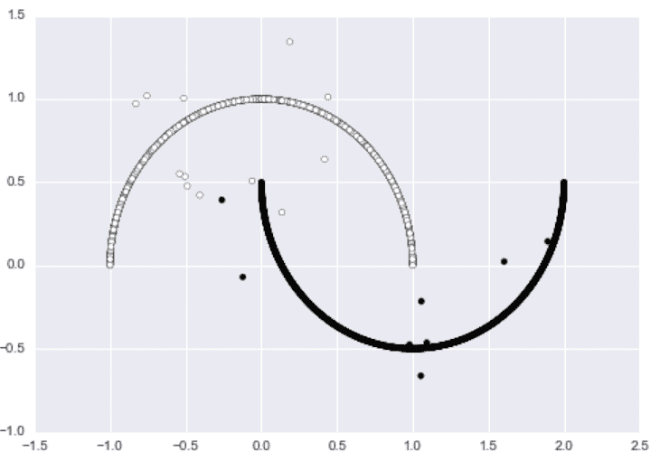

我们可以对数据运行 DBSCAN 以获得以下结果。该算法成功地发现了两个“半月”，并将几乎每个有噪声的数据点识别为异常值。

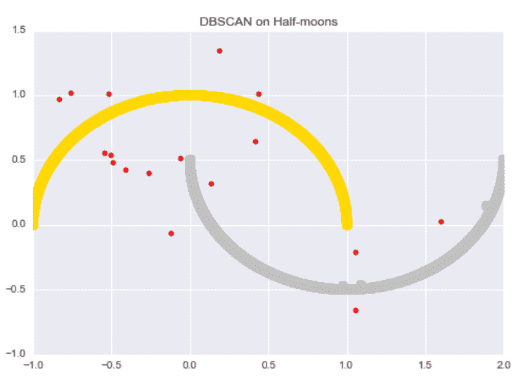

相比之下，k-Means 在这个数据集上表现不佳。该算法不能成功发现“半月形”结构，也不能区分噪声数据点和原始数据点。

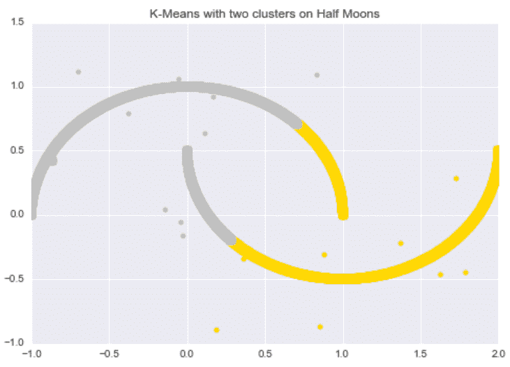

## 进去吧

[水平集树聚类算法](http://cseweb.ucsd.edu/~dasgupta/papers/tree.pdf)是由加州大学圣地亚哥分校的两位计算机科学家 Chaudhuri 和 Dasgupta 于 2010 年开发的。在本节中，我将使用由教授兼作者 Jussi Klemela 开发的 [denpro](https://denpro.co.uk/) R 软件包。这个库包含了水平集树聚类算法的有效实现。见 R 档，denpro。r，在[多米诺项目](https://try.dominodatalab.com/u/nmanchev/clustering/overview)中。

### 水平集

DBSCAN 是建立在ɛ-balls 基础上的，而水平集树聚类，顾名思义，是建立在水平集上的。

如果我们有某个数学函数 *f* 和某个常数 *c* ，那么水平集*L*c 就是 *x* 的所有值使得 f(x) = c .形式上，在数学集构建器符号中。

*L*[c](f)= { X in**X**| f(X)= c }

例如，如果 f(x) = x² 和 *c* = 4，那么*L*c(f)= {-2，2}因为 f(-2) = (-2)² = 4 和 f(2) = 2² = 4。

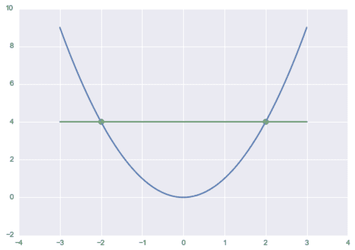

为了构建水平集树，我们将使用一类特殊的*水平集*，称为λ- *上水平集*。对于某个常数λ和某个函数 *f* ，则 *f* 、 *L* 、 λ (f)的λ- *上水平集*，定义为:

*l*[(f)= { x 中的 X| f(x) > = λ}]

本质上，这是函数大于或等于某个常数λ的情况。回到我们之前的例子 f(x) = x² 和λ = 4， *f* 的λ- *上水平集*会是(-∞，-2】U[2，∞)。

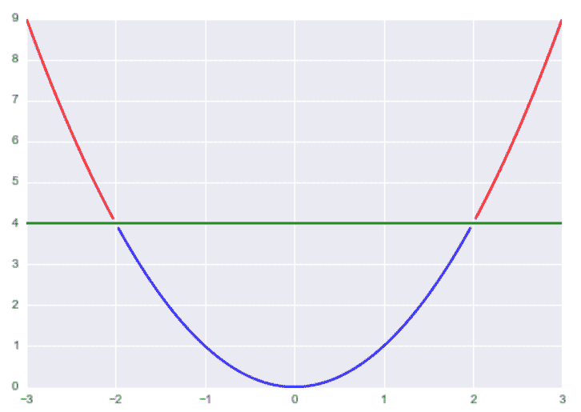

现在，我肯定你想知道我们如何使用这个数学对象来执行聚类。基本思想是，我们假设我们的数据是根据某个概率密度函数 *f* 生成的，因此如果我们将λ选为区间[0，1]中的常数，我们的λ- *上水平集*对应于比我们的阈值λ更密集的数据区域。

我们的目标是使用阈值参数λ来识别对应于具有相似密度的数据的连接区域的*高密度聚类*。

现在，我们来谈谈算法的*树*部分。假设我们从λ的高初始值开始，假设λ = 0.7，计算得到的 *f* 的λ- *上水平集*。我们最终得到一组点，使得对于*上水平集*中的每个点，f(x) > = 0.7。现在，让我们将λ的值减小到 0.5，并计算得到的λ- *上水平集*。现在由传递性可知，λ = 0.7- *上水平集*中的所有点也是λ = 0.5- *上水平集*的成员因为如果 f(x) > = 0.7 且 0.7 > = 0.5，则 f(x) > = 0.5。

推广这个模式，如果λ1 < λ2, then *L* λ2 (f)是 *L* λ1 (f)的子集。本质上，如果我们要遍历λ的递增序列，我们将创建一个λ上*水平集*，它是先前上水平集的子集。这是树结构:根代表λ = 0.0(所有的点)，每个分支代表λ的更高值，因此是来自前一级的点的子集。

## kNN 密度估计

由于我们不知道生成数据的真实概率密度函数 *f* ，我们将需要估计它。之前，我们使用ɛ-Balls 通过计算邻域的“质量”与“体积”之比来估计密度。

这里我们用一个类似的方法叫做[k-最近邻](/knn-with-examples-in-python)密度估计来估计底层的概率密度函数 *f* 。使用ɛ-Balls 方法，我们首先固定邻域的体积，然后计算邻域内的点数来确定质量。对于 k-最近邻密度估计方法，我们要做相反的事情；首先我们将质量固定为某个数字 *k* ，然后我们计算在球内得到 *k* 个点所需的体积。

在机器学习中，最基本的分类算法之一是 k-最近邻(k-NN)分类。k-NN 分类的快速复习；

*   挑选一些整数 *k* 和一些测试数据点 *x*[i] 。
*   检索您的训练数据集中最接近 *x*[i] 的 *k* 个点。
*   获得这些 *k* 点的多数标签，并将该标签分配给*x*I

用 k-NN 密度估计，我们要做一些类似的事情。就像我上面说的，我们希望在我们的邻域中有 *k* 个点，所以我们要找到恰好包含 *k* 个点的最小邻域的体积。

要使用 k-NN 密度估计来估计给定点的密度，我们要找到到第 K 个^个最近点、*d*K 的距离，并以此作为我们邻域的半径。通过这样做，我们得到了一个在我们点周围的邻域，其中正好有其他的点。

k-最近邻估计量的数学公式如下:

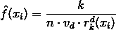

在这个方程中， *k* 是我们想要的邻域内的点数，*x*I 是我们给定的点， *n* 是数据集中的点数，*v*d 是 d 维欧氏球的体积，*r*k(*x*I)是到

对于 2 维数据，2 维欧氏球的体积为πR² 其中 R = 1，所以*v*d=π，在这种情况下。

以下代码使用 [TDA](https://github.com/cran/TDA) R 包计算二维数据的 k-NN 密度估计值:

```py
## kernel density estimator

install.packages('TDA')

library(TDA)

k <- 500

KNN <- knnDE(crater_xy, crater_xy, k)

qplot(x, y, data = crater, size = KNN, colour = KNN, main = 'KNN Density Estimate on Crater Dataset') +

scale_colour_continuous(low = "black", high = "red")
```

为了演示 k-NN 密度估计，让我们考虑一个非正式地称为“火山口”数据集的玩具数据集。数据集包括一个非常密集的核心(“撞击”的陨石坑)，核心周围有一个密度较低的环。

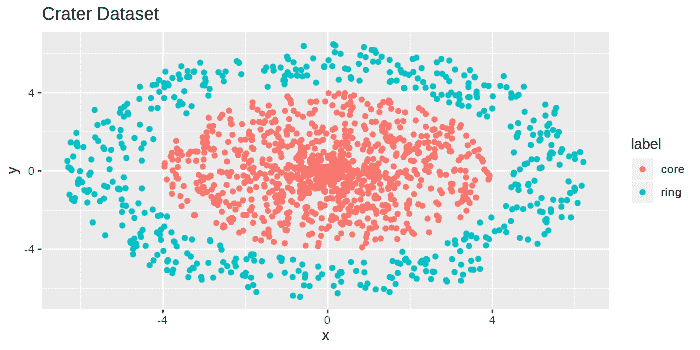

如果你看上面的图像，你会注意到在中心有一组紧密捆绑的数据点，随着我们远离中心，这些点看起来变得不那么紧密。有 2000 个红色数据点，和 1000 个蓝色数据点，供参考。

下面是我用来创建这个玩具数据集的代码:

```py
makeCraters <- function(inner_rad = 4, outer_rad = 4.5,

donut_len = 2, inner_pts = 1000,

outer_pts = 500){

#Make the inner core

radius_core <- inner_rad*runif(inner_pts)

direction_core <- 2*pi*runif(inner_pts)

#Simulate inner core points

core_x <- radius_core*cos(direction_core)

core_y <- radius_core*sin(direction_core)

crater <- data.frame(x=core_x, y=core_y, label='core')

#Make the outer ring

radius_ring <- outer_rad + donut_len*runif(outer_pts)

direction_ring <- 2*pi*runif(outer_pts)

#Simulate ring points

ring_x <- radius_ring*cos(direction_ring)

ring_y <- radius_ring*sin(direction_ring)

crater_ring <- data.frame(x=ring_x, y=ring_y, label='ring')

crater <- rbind(crater, crater_ring)
return(crater)
}
crater <- makeCraters()
crater_xy <- crater[,c(1,2)]
require(ggplot2)
qplot(x, y, data = crater, colour = label, main = 'Crater Dataset')
```

从上面的图像中，我们应该期望中心附近的点具有较高的 k-NN 密度估计，而外环中的点具有较低的 k-NN 密度估计。

我们在这个“陨石坑”数据集上运行上面包含的 k-NN 密度估计代码，并绘制较大和较暗的点对应于较高密度值的点。

```py
## kernel density estimator

install.packages('TDA')

library(TDA)

k <- 500

KNN <- knnDE(crater_xy, crater_xy, k)

qplot(x, y, data = crater, size = KNN, colour = KNN) +

scale_colour_continuous(low = "black", high = "red")
```

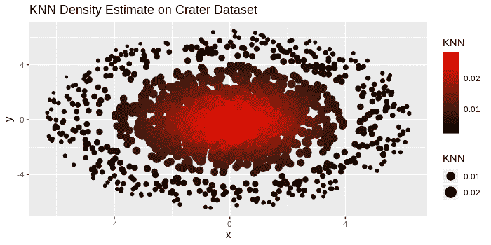

正如所料，较大和较暗的点被捆绑在中心，随着我们远离中心，这些点变得越来越亮和越来越小。通过选择适当的λ值，我们可以创建一个仅由靠近中心的暗点组成的上水平集，对应于一个高密度的簇。

### 应用

通过 CRAN 可以获得 denpro 库，所以我们可以用

```py
install.packages('denpro')

library(denpro)
```

我们将把水平集树算法应用于上一节中的“火山口”数据集。水平集树算法的分层性质将在外环中找到“更密集”的子聚类，而不是仅仅试图将数据聚类到核心和外环中。

我们首先运行 pcf.kern，它计算一个多元核估计，并给出一个分段常数函数对象的输出。它采用 h(平滑参数)和 N(核估计的网格维数)作为输入。默认情况下，它使用标准的高斯核。

```py
pcf <- pcf.kern(crater_xy,h=0.5,N=c(32,32)) # kernel estimate
```

接下来，我们构建水平集树，然后修剪它。

```py
lst <- leafsfirst(pcf) # level set tree

td <- treedisc(lst,pcf,ngrid=60) # pruned level set tree
```

现在，我们绘制树，它的体积图，和它的重心图，这是一个形状树的位置图。

```py
plottree(td, col='blue') # plot tree

plotvolu(td) # volume plot

plotbary(td) # location plot
```

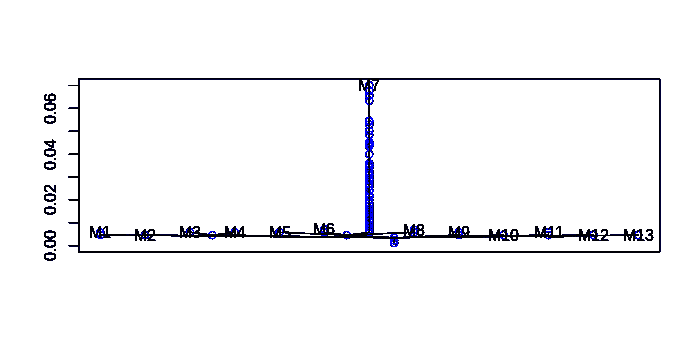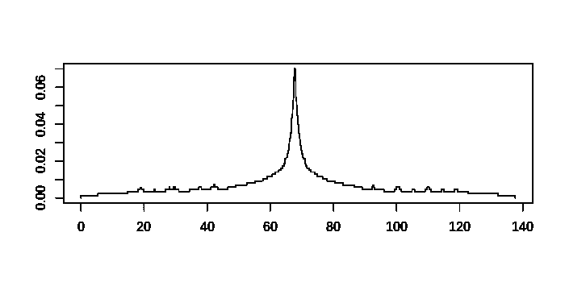

从树状图中，我们看到数据集被聚集成一个主群，后面是更密集的外部群。

我们现在可以用这些聚类标签来绘制数据。

## 聚类的彩色散点图

```py
cd<-colors2data(crater_xy,pcf,lst)

plot(crater_xy,col=cd$datacolo)
```

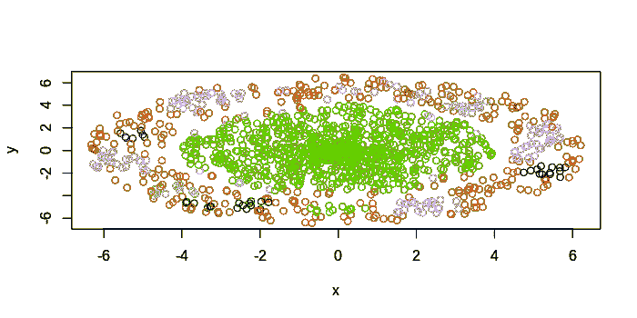

水平集树能够成功地将大部分内核聚类为单个聚类，然后识别外环中的“密集”子聚类。

使用水平集树，我们可以在数据密度差异较大的数据集中进行聚类。DBSCAN 只是标记离群值，而水平集树试图在这些离群值中发现一些基于聚类的子结构。在市场细分中，这可能有助于发现新兴市场。在数据安全方面，研究人员可以识别新的恶意软件，其中最近受感染的计算机的小样本与其余数据的行为不同，但彼此相似。

## 距离函数

在关于ɛ-neighborhoods 的初始部分，我说过这些街区呈现圆形或球形。当我们使用标准的欧几里德距离度量时，有时称为*l*T2 2 度量，我们的邻域显示这个球形。为什么会这样？

我们来考虑 2D 空间中的两点 *p*[1] = (x[1] ，y[1] )，*p*[2]=(x[2]，y[2] )。为了简单起见，我使用 2D 空间中的点，但是这些距离度量可以推广到更高维度的空间。

这两点的欧氏距离为 *d(p[1] ，p[2])*=[(x[1]–x[2])²+(y[1]–y[2])²^(0.5)。

如果我们将距离固定为小于ɛ，那么我们得到以下不等式:

*d(p[1] ，p[2])*=[(x[1]–x[2])²+(y[1]–y[2])²^(0.5)<ɛ

两边均方得出:

(x[1]–x[2])²+(y[1]–y[2])²<ɛ²

上面的不等式应该看起来很熟悉以(c[1] ，c[2] )为圆心的半径为 *r* 的圆的一般方程:(x–c[1])²+(y-c[2])²= r²。

由于欧几里德距离度量，当我们计算 **Nbhd** ( *p* ，ɛ)时，我们最终得到一个以 *p* 为中心、半径为ɛ.的球形邻域

然而，如果我们使用不同的距离度量，我们会得到不同形状的邻域。例如，如果我们使用曼哈顿距离，或 *l*[1] 公制，其中两点之间的距离是 *d(p*[1] *，p*[2]*)*= | x[1]–x[2]|+| y[1]–y[2]|(|)。|是绝对值)，那么邻域将显示一个矩形。

通过改变使用的距离度量，我们可以改变邻域的形状。通过改变邻域的形状，我们可以发现不同的集群集合。取决于问题，使用除欧几里德距离度量之外的距离度量来发现不同类型的聚类可能是有益的。

## 结论

基于密度的聚类方法很棒，因为它们没有预先指定聚类的数量。与其他聚类方法不同，它们引入了离群值的概念，并能够“过滤”掉这些离群值。最后，这些方法可以学习任意形状的聚类，使用水平集树算法，可以学习密度差异很大的数据集中的聚类。

但是，我应该指出，与 k-means 之类的参数聚类方法相比，这些方法更难调整。与 k-means 的聚类数参数相比，DBSCAN 的 epsilon 参数或水平集树的参数不太直观，因此为这些算法选择良好的初始参数值更加困难。

最后，对于对不同类型问题的通用聚类方法感兴趣的读者来说，[这本关于数据聚类的书](https://www.crcpress.com/Data-Clustering-Algorithms-and-Applications/Aggarwal-Reddy/9781466558212)是一本方便的参考资料。