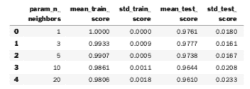

# 走向预测准确性:调整超参数和管道

> 原文：<https://www.dominodatalab.com/blog/towards-predictive-accuracy-tuning-hyperparameters-and-pipelines>

*本文提供了《调优超参数和管道》一书的节选，该书由 Mark E. Fenner 所著，[Machine Learning with Python for every one](http://www.informit.com/store/machine-learning-with-python-for-everyone-9780134845623?utm_source=Referral&utm_medium=DominoLabs&utm_campaign=Fenner&utm_term=MLPython)。摘录和补充 [Domino 项目](https://try.dominodatalab.com/u/domino-andrealowe/Tuning-Hyperparameters-and-Pipelines/overview)评估超参数，包括 GridSearch 和 RandomizedSearch，以及构建自动化的 ML 工作流。*

## 介绍

数据科学家、机器学习(ML)研究人员和商业利益相关者在模型的预测准确性方面有着高风险投资。数据科学家和研究人员使用不同的技术、方法和设置(包括模型参数和超参数)来确定模型的预测准确性。模型参数是在训练期间学习的。超参数不同，因为它们是在学习方法之外设置的预定值，并且不由学习方法操纵。例如，具有适当的正则化超参数提供了控制模型灵活性的能力。这种控制防止新测试数据的过度拟合和预测准确性的降低。当超参数也用于优化并针对特定数据集进行调整时，它们也会影响预测准确性。

[模型是数据科学的核心](https://blog.dominodatalab.com/model-management-era-model-driven-business/)，提高模型的预测准确性是行业的核心期望。为了支持行业工作的迭代和实验性质， [Domino](https://www.dominodatalab.com/) 联系了 Addison-Wesley Professional (AWP)以获得适当的许可，从 Mark E. Fenner 的书[Machine Learning with Python for every one](http://www.informit.com/store/machine-learning-with-python-for-everyone-9780134845623?utm_source=Referral&utm_medium=DominoLabs&utm_campaign=Fenner&utm_term=MLPython)中摘录了“调整超参数和管道”。AWP 提供了摘录工作的许可，并使我们能够提供一个补充的 [Domino 项目](https://try.dominodatalab.com/u/domino-andrealowe/Tuning-Hyperparameters-and-Pipelines/overview)来评估超参数，包括 GridSearch 和 RandomizedSearch。[项目](https://try.dominodatalab.com/u/domino-andrealowe/Tuning-Hyperparameters-and-Pipelines/overview)还包括为自动化 ML 工作流构建一个管道，请关注 Domino 数据科学博客上的其他超参数内容。


## 章节简介:调整超参数和管道

```py
# setup

from mlwpy import *

%matplotlib inline

iris = datasets.load_iris()
diabetes = datasets.load_diabetes()
digits = datasets.load_digits()
```

我们已经在本书的[一节中介绍了模型、参数和超参数。出于两个原因，我将再次提起它们。首先，我希望您看到(1)我们如何通过改变代码和参数以不同的方式编写简单的 Python 函数，以及(2)学习模型如何使用参数和超参数之间的具体类比。其次，我们将注意力转向选择好的超参数。当我们拟合一个模型时，我们选择了好的参数。我们需要某种定义明确的过程来选择好的超参数。我们将按两种类型的*搜索* — `GridSearch`和`RandomizedSearch`—投入使用。搜索是解决或优化问题的一种非常通用的方法。通常，搜索可以在数学上不太好的领域中工作。然而，不足为奇的是，这些答案并不能保证是绝对的最佳答案。相反，和启发式一样，我们希望答案足够好。](http://www.informit.com/store/machine-learning-with-python-for-everyone-9780134845623?utm_source=Referral&utm_medium=DominoLabs&utm_campaign=Fenner&utm_term=MLPython)

所有这些讨论将使我们处于一个有利的位置，更深入地研究如何构建多个学习组件首尾相连的*管道*。通常，正确使用管道需要我们为管道的组件找到好的超参数。因此，在没有讨论`sklearn` API 的搜索技术的情况下，过于深入地研究管道可能会导致我们养成坏习惯。我们不能这样！

## 11.1 模型、参数、超参数

如果您需要复习与模型、参数和超参数相关的术语，请回顾本书中的第 5.2 节[。我想用一个从非常原始的 Python 函数构建的具体类比来扩展这个讨论。开始了。制造机器(包括物理计算机和软件程序)的困难之一是，通常有不止一种方法。这里有一个简单的例子:](http://www.informit.com/store/machine-learning-with-python-for-everyone-9780134845623?utm_source=Referral&utm_medium=DominoLabs&utm_campaign=Fenner&utm_term=MLPython)

```py
def add_three(x):

    return 3 + x

def add(x, y):

    return x + y

add(10,3) == add_three(10)
```

```py
True
```

每当计算依赖于一个值时——在本例中为`3`——我们可以(1)硬编码该值，如在`add_three`中，或者(2)通过传递参数在运行时提供该值，如在`add(10.3)`中的`3`。我们可以将这个想法与我们的工厂机器学习模型及其旋钮联系起来。如果机器侧面有一个旋钮，我们可以在安装模型时调整该值。这个场景就像`add(x,y)`:即时提供信息。如果一个值在盒子里面——它是学习机的固定内部组件的一部分——那么我们就处在一个类似于`add_three(x)`的场景中:`3`是固定在*位置*的代码部分。当我们安装这个特殊的学习机时，我们不能调整那个组件。

这是另一种构造三加的方法。我们可以创建一个返回函数的函数。我真心希望我没有让你头疼。我们的方法是将一个*内部*组件的值传递给函数生成器。当函数生成器构造一个我们想要使用的新函数时，它将使用这个内部值。这个场景就像是建造一台工厂机器的过程。在制造机器的过程中，我们可以组合任意数量的内部齿轮、部件和小发明。它建成后，就完成了，固定了，具体了，坚固了；我们不会再对它的内部进行任何修改。

下面是一些代码:

```py
def make_adder(k):

    def add_k(x):

        return x + k

    return add_k

# a call that creates a function

three_adder = make_adder(3)

# using that created function

three_adder(10) == add_three(10)
```

```py
True
```

所以，好消息是它*起作用了*。坏消息可能是你不知道为什么。我们来分解一下第 7 行发生了什么:`three_adder = make_adder(3)`。当我们调用`make_adder(3)`时，我们启动了通常的函数调用机制。`3`与`make_adder`中的`k`联系在一起。然后，我们在 things 中执行代码:用函数 *stuff* 定义名称，然后返回步骤就像一个只有两行的函数:`m=10`，然后我们定义一个名称`add_k`，它的值是一个函数，而不仅仅是一个简单的`int`。

好，那么定义`add_k`是什么意思？它是一个参数`x`的函数。传入的任何值都将被添加到传入 make_adder 的`k`值中。但是这个细节永远不会给 x 增加任何东西。从它的角度来看，`k`是一个永远不变的值。获得不同的`add_k`的唯一方法是再次调用`make_adder`并创建一个*不同的*函数。

让我们总结一下从`make_adder`中得到的信息:

*   返回的*东西*(严格来说是 Python 对象)是一个有一个参数的函数。
*   当调用返回的函数时，它(1)计算`k`加上调用它的值，并且(2)返回那个值。

让我们把这与我们的学习模型联系起来。当我们说`KNeighborsClassifer(3)`时，我们正在做类似于`make_adder(3)`的事情。它给了我们一个具体的对象，我们可以把一个`3`放进它的配方里。如果我们想拥有 5-NN，我们需要一个新的学习机，用不同的调用来构造:`KNeighborsClassifer(5)`，就像构造一个`five_adder`需要调用`make_adder(5)`。现在，在`three_adder`的情况下，你可能会对我大喊，“用`add(x,y)`，笨蛋！”没关系，我没有被冒犯。我们可以做到。

但是在 *k* -NN 的情况下，我们不能。算法的设计方式，在内部是不允许的。

我们的外卖信息是什么？我引出了固定行为和参数驱动行为的概念来说明以下几点:

1.  在我们创建一个模型之后，我们不会修改学习机的内部状态。我们可以修改旋钮的值，以及我们使用侧面输入托盘(如我们在第 1.3 节中所见)向其输入的内容(见本书中的[)。](http://www.informit.com/store/machine-learning-with-python-for-everyone-9780134845623?utm_source=Referral&utm_medium=DominoLabs&utm_campaign=Fenner&utm_term=MLPython)
2.  训练步骤为我们提供了首选旋钮设置和输入托盘内容。
3.  如果我们不喜欢训练后的测试结果，我们可以*也可以*选择一个完全不同的内部结构不同的学习机。我们可以选择完全不同类型的机器。我们可以从 *k* -NN 转换到线性回归。或者，我们可以保持在相同的学习机器类别中，并改变一个超参数:从 3-NN 切换到 5-NN。这是从 5.2.2.1 区选择模型的过程。[书中。](http://www.informit.com/store/machine-learning-with-python-for-everyone-9780134845623?utm_source=Referral&utm_medium=DominoLabs&utm_campaign=Fenner&utm_term=MLPython) ]

## 11.2 调整超参数

现在让我们看看*如何在 sklearn 的帮助下*选择好的超参数。

## 11.2.1 计算机科学和学习术语注释

不幸的是，在计算机科学术语中，当我们描述进行函数调用的过程时，术语*参数*和*参数*经常互换使用。然而，在最严格的意义上，它们有更具体的含义:实参是传递给调用的实际值，而参数是在函数中接收值的*占位符*。为了澄清这些术语，一些技术文档使用实际变量/参数和形式变量/参数的名称。我们为什么关心？因为当我们开始谈论调整*超参数*时，你很快就会听到人们谈论*参数调整*。然后你会认为我一直在骗你关于由*超参数*选择设置的内部工厂机器组件和由参数优化设置的*外部工厂机器组件(旋钮)之间的区别。*

在本书中，我专门用术语*争论*来形容计算机科学的生物。这是为了避免与机器学习*参数*和*超参数*术语冲突。我将继续使用参数(在培训期间优化)和*超参数*(通过交叉验证进行调整)。请注意，`sklearn`文档和函数参数名称通常(1)将超参数缩写为`param`或者(2)使用计算机科学意义上的参数。在*或者*的情况下，在下面的代码中，我们将讨论学习构造函数的实际参数——比如在 *k* -NN 机器中为`k=3`指定一个值。机器学习的说法是，我们将 *k* -NN 的超参数设置为`3`。

## 11.2.2 完整搜索示例

为了避免过于抽象，我们来看一个具体的例子。有许多可以调用的参数。大多数参数都是超参数，控制我们创建的`KNeighborsClassifier`的内部操作。他们在这里:

```py
knn = neighbors.KNeighborsClassifier()

print(" ".join(knn.get_params().keys()))
```

```py
algorithm leaf_size metric metric_params n_jobs n_neighbors p weights
```

除了`n_neighbors`之外，我们还没有深入研究过这些。在我们的 *k* -NN 学习模型中，`n_neighbors`参数控制着 *k* 。你可能记得最近邻的一个关键问题是决定不同例子之间的距离。这些由`metric`、`metric_params`和`p`的一些组合精确控制。`weights`决定邻居如何组合自己得出最终答案。

## 11.2.2.1 评估单个超参数

在 5.7.2 节【书中的[】](http://www.informit.com/store/machine-learning-with-python-for-everyone-9780134845623?utm_source=Referral&utm_medium=DominoLabs&utm_campaign=Fenner&utm_term=MLPython)中，我们手动经历了比较 *k* 、`n_neighbors`几个不同值的过程。在我们进入更复杂的例子之前，让我们用来自`GridSearch`的一些内置的`sklearn`支持来重做那个例子。

```py
param_grid = {"n_neighbors" : [1,3,5,10,20]}

knn = neighbors.KNeighborsClassifier()

# warning! this is with accuracy

grid_model = skms.GridSearchCV(knn,

return_train_score=True,

param_grid = param_grid,

cv=10)

grid_model.fit(digits.data, digits.target)
```

```py
GridSearchCV(cv=10, error_score='raise-deprecating',

             estimator=KNeighborsClassifier(algorithm='auto',

                                            leaf_size=30,

                                            metric='minkowski',

                                            metric_params=None,

                                            n_jobs=None, n_neighbors=5,

                                            p=2, weights='uniform'),

             fit_params=None, iid='warn', n_jobs=None,

             param_grid={'n_neighbors': [1, 3, 5, 10, 20]},

             pre_dispatch='2*n_jobs', refit=True, return_train_score=True,

             scoring=None, verbose=0)
```

幸运的是，`skms.GridSearchCV`的结果是*只是一个模型*，所以你已经知道如何让它运行:在它上面调用`fit`。现在，它将花费大约五倍于单个 *k* -NN 运行的时间，因为我们正在为 k 的五个值运行它。`fit`的结果是一个非常庞大的 Python 字典。它包含每个超参数组合和交叉验证回合的条目。好在可以用`pd.DataFrame(grid_model.cv_results_)`快速转换成`DataFrame`。

```py
# many columns in .cv_results_

# all params are also available in 'params' column as dict

param_cols = ['param_n_neighbors']

score_cols = ['mean_train_score', 'std_train_score',

'mean_test_score', 'std_test_score']

# look at first five params with head()

df = pd.DataFrame(grid_model.cv_results_).head()

display(df[param_cols + score_cols])

```



我们可以挑选出一些感兴趣的列，并通过我们操作的参数对数据帧进行索引。

```py
# subselect columns of interest:

# param_* is a bit verbose

grid_df = pd.DataFrame(grid_model.cv_results_,

columns=['param_n_neighbors',

'mean_train_score',

'mean_test_score'])

grid_df.set_index('param_n_neighbors', inplace=True)

display(grid_df)
```


我们也可以用图形来查看:

```py
ax = grid_df.plot.line(marker='.')
ax.set_xticks(grid_df.index);
```


这种方法的一个好处是——相对于我们在第 5 章中手工做的——我们不需要手工管理任何结果收集。当我们开始尝试处理多个超参数时，最大的好处就来了。

## 多个超参数的 11.2.2.2 评估

即使是简单的 *k* -NN 模型，也有相当多的可能性。如果你看一下文档，你会发现`n_neighbors`和`p`仅仅是整数。我们可以尝试不同数值的*。请记住，我们需要管理所有这些组合的训练和测试集，这是一个全面的交叉验证过程。否则，我们会冒着用一些特定的超参数过度拟合数据的风险，因为我们从未在新数据上评估过它们。*

 *如果我们手动尝试一个有三个参数的模型，它可能看起来像下面这样:

```py
def best_model_hyper_params(make_a_model,
                            some_hyper_params,

                            data):

    results = {}

    for hyper_params in it.combinations(some_hyper_params):

        for train,test in make_cv_split(data):

            model = make_a_model(*hyper_params).fit(train)

            key = tuple(hyper_params)

            if key not in results:

                results[key] = []

            results[key].append(score(test, model.predict(test)))

            # or, rock stars can use this instead of the prior 4 lines:

            # (results.setdefault(tuple(hyper_params), [])

            #         .append(score(test, model.predict(test)))

    best_hp = max(results, key=results.get)

    best_model = make_a_model(*best_hp).fit(data)

    return best_model

def do_it():

    model = pick_a_model # e.g., k-NN

    some_hyper_params = [values_for_hyper_param_1, # e.g., n_neighbors=[]

                         values_for_hyper_param_2,

                         values_for_hyper_param_3]

    best_model_hyper_params(model_type,

                            some_hyper_params,

                            data)
```

幸运的是，评估超参数是设计和构建学习系统的常见任务。因此，我们不必自己编写代码。假设我们想要尝试这些超参数的所有组合:


两个音符:

1.  *距离*意味着我的邻居的贡献通过它离我的距离来加权。*统一*意味着我所有的邻居都被认为是一样的，没有加权。
2.  `p`是构造函数的参数。我们在第二章的笔记中简要地看到了它。只知道 p = 1 是曼哈顿距离( *L*[1] -like)， *p =* 2 是欧氏距离( *L*[2] -like)，更高的 ps 接近一种叫做无穷范数的东西。

下面的代码执行设置，为一个 *k* -NN 模型尝试这些可能性。它不会进入实际的处理过程。

```py
param_grid = {"n_neighbors" : np.arange(1,11),

"weights" : ['uniform', 'distance'],

"p" : [1,2,4,8,16]}

knn = neighbors.KNeighborsClassifier()

grid_model = skms.GridSearchCV(knn, param_grid = param_grid, cv=10)
```

这段代码将比我们之前用`GridSearch`在`kNN`上调用`fit`的时间长一点，因为我们要拟合 10 × 2 × 5 × 10 = 200 个模型(最后 10 个来自交叉验证步骤中的多次拟合)。但好消息是所有的脏活都是为我们管理的。

```py
# digits takes ~30 mins on my older laptop

# %timeit -r1 grid_model.fit(digits.data, digits.target)

%timeit -r1 grid_model.fit(iris.data, iris.target)
```

```py
1 loop, best of 1: 3.72 s per loop
```

调用`grid_model.fit`后，我们有一大篮子结果可以调查。这可能有点难以应付。一个小熊猫——傅可以让我们得到我们可能感兴趣的东西:哪些模型——也就是哪组超参数——表现最好？这一次，我将以稍微不同的方式提取值:

```py
param_df = pd.DataFrame.from_records(grid_model.cv_results_['params'])

param_df['mean_test_score'] = grid_model.cv_results_['mean_test_score']

param_df.sort_values(by=['mean_test_score']).tail()

```


我特别想看看几个最佳结果，而不仅仅是一个最佳结果，因为通常情况下，有几个模型具有相似的性能。这个启发在这里也适用——而且，当你看到这个，你会知道不要太投入在一个单一的“最佳”分类器上。然而，在某些情况下，肯定会有明显的赢家。

我们可以使用 fit `grid_model`上的属性来访问最佳模型、其参数和总得分。关于结果的一个非常重要和微妙的警告:这是一个使用最佳超参数创建的新模型，然后重新适应整个数据集。不相信我？从`refit`参数下的`sklearn`单据到`GridSearchCV`:

改装后的估算器在`best_estimator_`属性可用，并允许在这个`GridSearchCV`实例上直接使用`predict`。

所以，我们可以看看网格搜索过程的结果:

```py
print("Best Estimator:", grid_model.best_estimator_,

"Best Score:", grid_model.best_score_,

"Best Params:", grid_model.best_params_, sep="\n")
```

```py
Best Estimator:

KNeighborsClassifier(algorithm='auto', leaf_size=30, metric='minkowski',

                     metric_params=None, n_jobs=None, n_neighbors=8, p=4,

                     weights='uniform')
Best Score:
0.98
Best Params:
{'n_neighbors': 8, 'p': 4, 'weights': 'uniform'}
```

该过程(1)使用`GridSearch`找到好的超参数，然后(2)在整个数据集上训练用这些超参数构建的单个模型。我们可以将这个模型用于其他新的数据，并进行最终的坚持测试评估。

这里简单介绍一下`GridSearchCV`使用的随机化。关于对`KFold`和朋友使用`shuffle` -ing，`sklearn`文档强调:

`random_state`参数默认为`None`，这意味着每次`KFold(..., shuffle=True)`迭代时洗牌都会不同。然而，`GridSearchCV`将对通过对其`fit`方法的单次调用验证的每组参数使用相同的洗牌。

一般来说，我们想要这种相同性。我们想要比较参数，而不是可能的交叉验证数据分割的随机样本。

## 11.2.3 利用随机性大海捞针

如果我们有许多超参数，或者如果单个超参数的可能值范围很大，我们可能无法穷尽所有可能性。感谢随机化的美妙，我们可以用不同的方式进行。我们可以指定超参数的*随机组合*——比如一副牌的不同处理方式——并要求尝试其中的一些。有两种方法可以指定这些。一种是通过提供一个值列表；这些都是统一采样的，就像滚骰子一样。另一个选项有点复杂:我们可以利用`scipy.stats`中的随机分布。

不必深究，以下是你可以考虑的四个具体选项:

*   对于您更喜欢较小值而不是较大值的超参数，您可以尝试`ss.geom`。这个函数使用一个几何分布，它产生的正值下降得非常快。这是基于你在抛硬币时，要等多久才能看到正面。很久不见人头，可能性很小。
*   如果您想要均匀采样某个范围的值，例如，1 和 1 之间的任何值都应该与其他值一样可能，请使用`ss.uniform`
*   `If you’d like to try hyperparameter values with a normal distribution, use `ss.normal`T1。`
`*   简单整数用`randint` 。`

 ``sklearn`使用`RandomizedSearchCV`执行超参数值的随机滚动。在内部，它使用了`.rvs(n)`方法，在你定义的东西上有一个`.rvs(n)`方法，你可以把它传递给`RandomizedSearchCV`被警告，我不对结果负责。

```py
import scipy.stats as ss

knn = neighbors.KNeighborsClassifier()

param_dists = {"n_neighbors" : ss.randint(1,11), # values from [1,10]

"weights" : ['uniform', 'distance'],

"p" : ss.geom(p=.5)}

mod = skms.RandomizedSearchCV(knn,

   param_distributions = param_dists,

   cv=10,

   n_iter=20) # how many times do we sample?

# fitting 20 models

%timeit -r1 mod.fit(iris.data, iris.target)

print(mod.best_score_)
```

```py
1 loop, best of 1: 596 ms per loop

0.98
```

## 11.3 向下递归兔子洞:嵌套交叉验证

我最敏锐的读者——你可能是其中之一——可能正在思考一些事情。如果我们考虑*多个*可能的超参数集，我们会不会过度拟合它们？让我来打破这个惊喜:简单的回答是肯定的。但是你说，“那我们的坚持测试集呢？”事实上，年轻的蚱蜢，当我们看到我们坚持测试集的糟糕表现时，我们已经*输掉了游戏*。我们已经查看了最后的数据。我们需要一种替代方案来处理超参数调整中的过度拟合，并让我们深入了解估计值的可变性和稳健性。关于我们将如何做这件事，我给你两个提示。首先，`*Search`模型是*仅仅是*模型——我们可以像使用其他简单模型一样使用它们。我们给他们提供数据，让他们适应，然后用这些数据进行预测。其次，我们通过交叉验证解决了评估关于*参数*的性能可变性的问题。让我们试着结合这些想法:网格搜索作为一种模型，我们用交叉验证来评估。

让我们退后一分钟来清楚地定义这个问题。提醒一下，在我们开始考虑超参数和`*Search` ing 之前，这里是关于参数、训练和验证的设置。当我们在训练集上拟合一个常用模型(例如，3-NN 或 C = 1.0 的 SVM)并在验证集上评估它时，由于选择训练集和验证集的随机性，我们会有可变性。我们可能会挑选表现好或不好的组合。我们真正想知道的是我们期望在随机选择的一个上做什么。

这个场景类似于从一个班级中挑选一个学生，用她的身高代表整个班级。效果不会太好。然而，取班上许多学生身高的平均值是对随机选择的学生身高的一个更好的估计。在我们的学习案例中，我们采用了许多训练测试分割，并对其结果进行平均，以了解我们的系统在随机选择的训练测试分割上的表现。除此之外，我们*也*得到了可变性的度量。我们可能会看到性能结果的紧密聚集；在一些明显的赢家之后，我们可能会看到学习成绩急剧下降。

## 交叉验证，重复

现在，我们感兴趣的是将整个方法——整个`GridSearch`过程——包装在交叉验证中。这似乎有点令人吃惊，但图 11.1 应该有所帮助。它显示了我们通常在普通模型上使用的扁平简历的外观。如果我们决定我们喜欢模型的 CV 性能，我们可以返回并在所有非坚持数据上训练它。最终训练好的模型是我们将来用来做新预测的。

如果我们使用像线性回归(LR)这样的原始模型，或者使用从`GridSearch`得到的更复杂的模型作为我们交叉验证评估的模型，这没有区别。如图 11.2 所示，两者都简单地填写交叉验证运行的*模型*。然而，在引擎盖下发生的事情是完全不同的。


复杂的部分发生在`GridSearch`盒子里面。在一个盒子里，有一个完全独立的`fit`过程，由一组超参数构建的内部学习模型使用。如果我们称之为`GridSearchCV(LinearRegression)`，那么在盒子里面我们是拟合线性回归参数。如果我们调用`GridSearchCV(3-NN)`，那么在盒子内部我们正在构建邻居表，用于进行预测。但无论哪种情况，`GridSearchCV`的产出都是我们可以评估的模型。

## 11.3.2 作为模型的网格搜索

我们称之为适合的通常模型是*完全定义的*模型:我们挑选模型和超参数使其*具体化*。那么，当我们在一个`GridSearchCV`大型模型上调用`fit`时会发生什么呢？当我们在一个`LinearRegression`模型上调用 fit 时，我们得到一组内部参数权重的值，这些值是给定训练集时它们的首选最优值。当我们在一个 *k* -NN 的`n_neighbors`上调用`GridSearchCV`时，我们得到一个`n_neighbors`，它是给定训练数据的那个*超参数*的首选值。这两个人在不同的层面上做着同样的事情。


图 11.3 显示了双超参数网格搜索的图形视图，突出显示了该方法的输出:拟合模型和良好的超参数。它还展示了 CV 作为网格搜索的*内部*组件的使用。单个超参数的交叉验证导致对该超参数和模型组合的评估。反过来，比较几个这样的评估来选择优选的超参数。最后，首选超参数和所有输入数据用于训练(相当于我们通常的`fit`)最终模型。输出是一个合适的模型，就像我们调用了`LinearRegression.fit`一样。


## 11.3.3 交叉验证中嵌套的交叉验证

`*SearchCV`函数足够智能，可以对它们尝试的所有模型和超参数组合进行交叉验证(CV)。这份简历很棒:当我们拟合单个模型和超参数组合时，它保护我们免受应试教育。然而，这不足以保护我们不受`GridSearchCV` *本身*的检验。为此，我们需要将它放在自己的交叉验证包装器中。结果是一个*嵌套的交叉验证*。图 11.4 显示了 5 重外部交叉验证和 3 重内部交叉验证的数据分割。


外部简历用大写字母表示。内部 CV 分割线用罗马数字表示。外部 CV 的一个序列工作如下。利用从外部 CV 数据(B，C，D，E)的*部分*中选择的内部 CV 数据(I，II，III)，我们通过 CV 找到一个好的模型，然后在外部 CV 数据(A)的*余数*上对其进行评估。好的模型——有其超参数的值——是一个单一的模型，适合所有的(I，II，III ),来自`grid_model.best_*`朋友。

我们可以在不走极端的情况下实现嵌套的交叉验证。假设我们在一个`GridSearch`内执行三重 CV——也就是说，每个模型和超参数组合被评估三次。

```py
param_grid = {"n_neighbors" : np.arange(1,11),

"weights" : ['uniform', 'distance'],

"p" : [1,2,4,8,16]}
knn = neighbors.KNeighborsClassifier()

grid_knn = skms.GridSearchCV(knn,

param_grid = param_grid,

cv=3)
```

正如在没有交叉验证的参数级别上发生的那样，现在我们无意中缩小了适用于该数据集的超参数的范围。为了消除这种窥视，我们可以用五层交叉验证的另一层将`GridSearchCV(knn)`包装在*中:*

```py
outer_scores = skms.cross_val_score(grid_knn,

iris.data, iris.target,cv=5)

printer(outer_scores)
```

```py
[0.9667 1\.     0.9333 0.9667 1\.    ]
```

在我们的例子中，我们对 5 × 3 嵌套交叉验证策略(也称为*双交叉*策略)使用了 5 重重复的 3 重交叉验证。我选择这些数字是为了示例和图表的清晰。然而，嵌套 CV 最常见的建议是 5 × 2 交叉验证方案，这是由 Tom Dietterich 推广的。数字 5 和 2 并不神奇，但迪特里希确实为它们提供了一些实际的理由。为内部循环选择值 2，因为它使训练集不相交:它们根本不重叠。之所以选择值 5，是因为 Dietterich 发现，重复次数越少，数值的可变性——差异就越大，所以我们需要再重复几次，才能得到可靠的、可重复的估计值。如果超过五个，分裂之间会有太多的重叠，这会牺牲训练集之间的独立性，因此估计值会变得越来越相关。所以，5 是这两个竞争标准之间的一个折中。

## 嵌套 CV 的注释

为了理解刚刚发生的事情，让我扩展一下我之前在 11.2.2.2 部分写的`GridSearch`伪代码。

```py
def nested_cv_pseudo_code(all_data):

results = []

    for outer_train, test in make_cv_split(all_data):

        for hyper_params in hyper_parameter_possibilities:

            for train, valid in make_cv_split(outer_train):

                inner_score = evaluate(model.fit(train).predict(valid))

                best_mod = xxx # choose model with best inner_score

                preds = best_model.fit(outer_train).predict(test)

                results.append(evaluate(preds))
```

让我回顾一下平面交叉验证的过程。学习的训练阶段设置参数，我们需要一个训练验证步骤来评估这些参数的性能。但是，实际上，我们需要交叉验证——多重训练验证分割——通过平均产生更好的估计，并评估这些估计的可变性。我们必须把这个想法延伸到我们的`GridSearch`。

当我们使用网格搜索来*选择*我们偏好的超参数值时，我们实际上是在确定——或者在不同的层面上，*优化*——那些超参数值。至少，我们需要网格搜索的训练验证步骤来评估这些结果。然而，实际上，我们希望对我们的整个过程的性能有一个更好的估计。我们也很想知道我们对结果有多确定。如果我们再做一次这个过程，我们会得到相似的结果吗？相似性可以是几个不同的方面:(1)预测相似吗？(2)整体表现相似吗？(3)选取的超参数是否相似？(4)不同的超参数导致相似的性能结果吗？

在嵌套交叉验证中，外部交叉验证告诉我们*当我们通过网格搜索选择超参数时，我们可以预期的可变性*。这类似于通常的交叉验证，它告诉我们当我们估计参数时，在不同的训练测试分割中性能如何变化。

正如我们不使用交叉验证来确定模型的*参数*——这些参数由 CV 中的训练步骤设置——我们不使用`GridSearch`的外部交叉验证来挑选最佳超参数。最佳超卷在`GrideSearch`内部确定。CV 的外层只是给我们一个更真实的估计，当我们在最终模型中使用这些内层选择的超参数时，它们会如何。

嵌套交叉验证的实际应用远比试图将其概念化简单。我们可以使用嵌套 CV:

```py
param_grid = {"n_neighbors" : np.arange(1,11),"weights" : ['uniform', 'distance'],

"p" : [1,2,4,8,16]}

knn = neighbors.KNeighborsClassifier()

grid_knn = skms.GridSearchCV(knn,

param_grid = param_grid,cv=2)

outer_scores = skms.cross_val_score(grid_knn,

    iris.data,

    iris.target,

    cv=5)

# how does this do over all??

print(outer_scores)
```

```py
[0.9667 0.9667 0.9333 0.9667 1\.    ]
```

这些值向我们展示了当我们随机分割数据并将其传递到较低级别的超参数和参数计算中时，我们可以预期的学习性能。重复几次可以让我们知道我们可以期待的答案。反过来，这告诉我们估计值的*变量*可能是多少。现在，我们实际上可以根据来自`GridSearchCV`的参数训练我们的首选模型:

```py
grid_knn.fit(iris.data, iris.target)

preferred_params = grid_knn.best_estimator_.get_params()

final_knn = neighbors.KNeighborsClassifier(**preferred_params)

final_knn.fit(iris.data, iris.target)
```

```py

KNeighborsClassifier(algorithm='auto', leaf_size=30, metric='minkowski',

metric_params=None, n_jobs=None, n_neighbors=7, p=4,

weights='distance')
```

我们对其性能的估计是基于我们刚刚执行的外部 5 重 CV。我们现在可以在新的数据上使用`final_knn`和`predict`，但是我们应该先花点时间将它们指向一个坚持测试集(参见练习)。

## 管道

我们在特征工程中最大的限制之一——我们在本书第 10 章中的任务——是组织计算和遵守不为测试而教的规则。幸运的是，管道让我们可以做到这两点。我们在第 7.4 节对管道做了简要介绍。在这里，我们将查看管道的更多细节，并展示它们如何与网格搜索集成。

如果我们回到工厂的类比，我们很容易想象把一台机器的输出和下一台机器的输入连接起来。如果这些组件中的一些是特征工程步骤(如在第 10 章中)[ [在本书](http://www.informit.com/store/machine-learning-with-python-for-everyone-9780134845623?utm_source=Referral&utm_medium=DominoLabs&utm_campaign=Fenner&utm_term=MLPython)中)，我们就有了一个非常自然的传送带。传送带方便地将样品从一个步骤移到下一个步骤。

## 简单的管道

在最简单的例子中，我们可以从多个模型和转换器中创建学习组件的管道，然后使用该管道作为模型。`make_pipeline`把它变成一行程序:

```py
scaler = skpre.StandardScaler()

logreg = linear_model.LogisticRegression()

pipe = pipeline.make_pipeline(scaler, logreg)

print(skms.cross_val_score(pipe, iris.data, iris.target, cv=10))
```

```py
[0.8 0.8667 1\. 0.8667 0.9333 0.9333 0.8 0.8667 0.9333 1\. ]
```

如果我们使用方便的`make_pipeline`，管道中步骤的名称是从步骤的`__class__`属性构建的。比如说:

```py
def extract_name(obj):

    return str(logreg.__class__).split('.')[-1][:-2].lower()

print(logreg.__class__)
print(extract_name(logreg))
```

```py
 < class 'sklearn.linear_model.logistic.LogisticRegression'>

logisticregression
```

名称被转换成小写，仅保留最后一个`.`后的字母字符。由此产生的名称就是我们在这里看到的`logisticregression`:

```py
pipe.named_steps.keys()

dict_keys(['standardscaler', 'logisticregression'])
```

如果我们想自己命名这些步骤，我们使用更加可定制的`Pipeline`构造函数:

```py

pipe = pipeline.Pipeline(steps=[('scaler', scaler),

('knn', knn)])

cv_scores = skms.cross_val_score(pipe, iris.data, iris.target,

    cv=10,

    n_jobs=-1) # all CPUs

print(pipe.named_steps.keys())

print(cv_scores)
```

```py
dict_keys(['scaler', 'knn'])

[1\.     0.9333 1\.     0.9333 0.9333 1\.     0.9333 0.9333 1\.     1\.    ]
```

一个`Pipeline`可以像任何其他`sklearn`模型一样使用——我们可以用它来`fit`和`predict`,我们可以把它传递给 sklearn 的一次胜利。这个公共界面是`sklearn`的头号胜利。

## 更复杂的管道

随着我们向学习任务添加更多步骤，我们从使用管道中获得更多好处。让我们举一个例子，我们有四个主要的处理步骤:

*   将数据标准化，
*   创建特征之间的交互术语，
*   将这些特征离散化为大-小，以及
*   对生成的要素应用学习方法。

如果我们必须手动管理这一切，结果将会是一堆杂乱无章的代码，除非我们是一流的程序员。让我们看看如何使用管道。

这是我们在第 10.6.3 节开发的简单大小离散化器:

```py
from sklearn.base import TransformerMixin

class Median_Big_Small(TransformerMixin):

    def __init__(self):

        pass

    def fit(self, ftrs, tgt=None):

        self.medians = np.median(ftrs)

        return self

    def transform(self, ftrs, tgt=None):

        return ftrs > self.medians
```

我们可以将它与其他预构建的`sklearn`组件一起插入到我们的管道中:

```py
scaler = skpre.StandardScaler()

quad_inters = skpre.PolynomialFeatures(degree=2,

    interaction_only=True,

    include_bias=False)

median_big_small = Median_Big_Small()

knn = neighbors.KNeighborsClassifier()

pipe = pipeline.Pipeline(steps=[('scaler', scaler),

('inter', quad_inters),

('mbs', median_big_small),

('knn', knn)])

cv_scores = skms.cross_val_score(pipe, iris.data, iris.target, cv=10)

print(cv_scores)
```

```py
[0.6    0.7333 0.8667 0.7333 0.8667 0.7333 0.6667 0.6667 0.8    0.8   ]
```

我不会对这些结果做太多评论，但我鼓励你们将这些结果与我们应用于虹膜问题的一些更简单的学习系统进行比较。

## 11.5 管道和调谐在一起

当我们的学习系统不是一个单一的组件时，使用自动化——`*SearchCV`方法来调整超参数的最大好处就显现出来了。随着多个组件的出现，我们可以调整多组超参数。手动管理这些将会非常混乱。幸运的是，管道与`*SearchCV`方法配合得很好，因为它们只是另一个(多组件)模型。

在上面的管道中，我们有点武断地决定使用二次项——像 xy 这样的二次多项式——作为模型的输入。让我们使用交叉验证来为我们的多项式选择一个好的次数，而不是从帽子里挑出一个。这里的主要难点是我们必须在想要设置的参数之前加上`pipelinecomponentname__`。这是组件的名称，后跟两个下划线。除此之外，网格搜索的步骤是相同的。我们创建管道:

```py
# create pipeline components and pipeline

scaler = skpre.StandardScaler()

poly = skpre.PolynomialFeatures()

lasso = linear_model.Lasso(selection='random', tol=.01)

pipe = pipeline.make_pipeline(scaler,

    poly,

    lasso)
```

我们指定超参数名称和值，以管道步骤名称为前缀:

```py
# specified hyperparameters to compare

param_grid = {"polynomialfeatures__degree" : np.arange(2,6),

"lasso__alpha" : np.logspace(1,6,6,base=2)}
```

从 pprint 导入 pprint 作为 pp
pp(param_grid)

```py
{'lasso__alpha': array([ 2.,  4.,  8., 16., 32., 64.]),

'polynomialfeatures__degree': array([2, 3, 4, 5])}
```

我们可以使用常规的`fit`方法来拟合模型:

```py

# iid to silence warning

mod = skms.GridSearchCV(pipe, param_grid, iid=False, n_jobs=-1)

mod.fit(diabetes.data, diabetes.target);
```

管道中的每一步都有结果:

```py
for name, step in mod.best_estimator_.named_steps.items():

    print("Step:", name)

    print(textwrap.indent(textwrap.fill(str(step), 50), " " * 6))
```

```py
Step: standardscaler
StandardScaler(copy=True, with_mean=True,
with_std=True)

Step: polynomialfeatures
PolynomialFeatures(degree=2, include_bias=True,
interaction_only=False)

Step: lasso
Lasso(alpha=4.0, copy_X=True, fit_intercept=True,
max_iter=1000, normalize=False, positive=False,
precompute=False, random_state=None,
selection='random', tol=0.01, warm_start=False)
```

我们只对我们考虑的参数的最佳值感兴趣:

```py
pp(mod.best_params_)
```

```py
{'lasso__alpha': 4.0, 'polynomialfeatures__degree': 2}
```

## 11.6 EOC 总结

我们现在已经解决了构建更大的学习系统的两个遗留问题。首先，我们可以构建多个模块化组件协同工作的系统。其次，我们可以系统地评估超参数，并选择好的参数。我们可以用一种非为测试而教的方式来做评估。

### 注释

我们的函数定义了一个函数并设置了`k`的值，这是一个*闭包*的例子。当我们填写`k`时，我们就合上了定义`add_k`的书:`add_k`已经设置好，并准备好作为一个参数`x`的明确定义的函数。

关于洗牌的细节以及如何与`GridSearch`交互的笔记来自[http://sci kit-learn . org/stable/modules/cross _ validation . html # a-note-on-shuffling](http://scikit-learn.org/stable/modules/cross_validation.html#a-note-on-shuffling)。

有一些关于交叉验证的很好的参考，超出了通常的教科书陈述:

*   *Dietterich 用于比较监督分类学习算法*的近似统计测试
*   Arlot 和 Celisse 对模型选择交叉验证程序的调查。交叉验证
*   *统计预测的选择和评估*由斯通

性能评估最有趣和令人困惑的一个方面是，我们正在评估一个系统的性能。因为我们是在估计——就像我们的学习模型是通过拟合训练数据集来估计的——我们的估计会受到偏差和方差的影响。这意味着在拟合模型中出现的同样的问题也适用于评估性能。这比我想在这本书里学到的要多一点，但是如果你感兴趣的话，考利和塔尔博特的*关于模型选择中的过度拟合和随后的性能评估中的选择偏差*正面解决了这个问题。

### 练习

1.  使用线性回归，研究我们在 CV 褶皱上构建模型和在整个数据集上构建模型时看到的最佳参数之间的差异。您也可以尝试使用简单的模型来计算这些 CV 折叠和整个数据集的平均值。
2.  从第八章或第九章中挑选一个你感兴趣的例子，用适当的超参数估计重做它。你可以用第 10 章的一些特征工程技术做同样的事情。
3.  你可以想象，对于 10 倍的数据，我们可以将它们分成 1 × 10、5 × 2 或 2 × 5。执行每个场景并比较结果。资源成本有什么大的区别吗？作为结果，我们得到的度量的可变性如何呢？之后，在[https://www3.nd.edu/~nchawla/papers/ICDM10.pdf](https://www3.nd.edu/~nchawla/papers/ICDM10.pdf)检查分类器性能评估可变性的后果。
4.  您可能已经注意到，我没有保存嵌套交叉验证示例中的拒绝测试集(第 11.3 节)。所以，我们真的没有对我们在那里开发的系统进行独立的、最终的评估。将我们在第 11.3 节中构建的整个过程包装在一个简单的训练测试分割中，以解决这个问题。`*