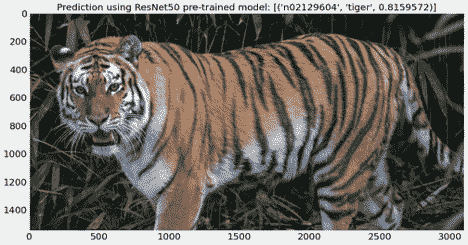

# Python 迁移学习实践教程

> 原文：<https://www.dominodatalab.com/blog/transfer-learning-in-python>

拟合复杂的神经网络模型是一个计算量很大的过程，需要访问大量数据。在本文中，我们介绍了迁移学习-一种利用预训练模型的方法，它加快了拟合速度，并消除了处理大量数据的需要。我们为 NLP 和计算机视觉用例提供迁移学习的指导，并通过拥抱脸展示迁移学习的简单实现。

## 介绍

机器学习方法的不断发展和改进正在推动一场新的工业革命。这对生活的各个方面都产生了重大影响，并可能产生类似于工业革命期间所观察到的那种深远影响。然而，目前的模型拟合方法仅用于增强人类的学习能力，而不是模仿人类的智力[1]。

为了能够对看不见的数据进行推理，机器学习算法需要从已知数据中学习并严重依赖它。例如，在分类任务中，需要将带注释的数据分成训练和测试子集。前者的特征向量用于训练模型，后者用于测试训练后的模型在未知数据上的性能。数据集可以由一个或多个类别组成，并且必须对属于训练子集中存在的类别的看不见的数据执行推断。

让我们举一个例子来阐明上述观点。我们有一个水果图像的数据集，分为 3 类，包括苹果、香蕉和柚子。为了训练能够准确分类的模型，该数据集将被分成训练和测试子集，样本比率分别为 70%和 30%。训练所选择的机器学习算法，并测量性能以确保高精度和低误差。可以使用最佳的[超参数](https://www.dominodatalab.com/blog/hyperopt-bayesian-hyperparameter-optimization)来改进训练的模型。完成训练后，该模型已经学会了如何成功地对三类水果图像进行分类。下一步是探索模型在测试图像上的性能，这些图像是模型在此之前没有见过的。最后，该模型可以部署到生产中。

[深度学习神经网络](https://www.dominodatalab.com/blog/deep-learning-introduction)的进步已经允许学习性能的显著改善，导致它们在包括[计算机视觉](https://www.dominodatalab.com/blog/what-is-computer-vision)在内的一些领域占据主导地位。神经网络[2，3]以特征向量的形式利用数据，并且它们的操作松散地模拟从其他神经元接收多个输入的生物神经元。如果输入的总和超过一个定义的阈值，神经元将向下一个神经元发送信号。在基本的人工神经网络中，分层排列的神经元(节点)连接到下一层的神经元。对于每个输入，分配一个初始随机权重，随后通过误差反向传播进行修改。这种情况一直持续到模型能够熟练预测未知样本的类别[4]。

尽管取得了这些进步，但机器学习方法的广泛采用仍然存在许多主要障碍。机器学习模型通常局限于一项任务和一个领域，可能会遭受灾难性的遗忘[5]。在许多情况下，训练模型需要大型的带注释的数据集，这在某些领域(例如医学领域)中可能并不总是可用的。此外，在多类别分类中，类别不平衡带来了额外的挑战。此外，由于输入要素和要素分布的差异，在一个数据集上训练的模型在另一个数据集上可能表现不佳。

不管数据集的大小如何，也很难将所有类别都包含在一个数据集中。在上面描述的水果示例中，模型被训练为对 3 种水果进行分类，而世界上有 2000 多种水果。在其他类型的数据集中，这成为一个更大的问题，例如，描述的昆虫物种的数量约为 91，000。创建覆盖所有昆虫物种的带注释的数据集将是非常复杂和费力的工作。

总之，尽管智能机器的想法并不新鲜，并且机器智能可以变得与人类智能相同的假设是人工智能的核心，但当今的人工智能并没有复制生物大脑能够具备的智能和学习能力。例如，教一个孩子识别苹果和橘子是一件很简单的事情，即使没有这些物体的视觉呈现，也是可以教会的。例如，可以描述形状、颜色和其他属性，以使儿童能够使用这些语义描述来区分橙子和香蕉。这可以通过其他方法实现，包括强化学习，不仅在人类中，而且在其他物种中，鸽子能够在 200 个小样本上区分癌组织和健康组织[6]。

长期的解决方案是让 AI 模型像人类一样进行智能学习。与此同时，新的机器学习方法已经被开发出来，以减少模型训练对数据的依赖，包括迁移学习和少量学习。

## 迁移学习

使用大型数据集从头开始训练复杂的神经网络需要访问高端计算资源、CPU 集群和[GPU](https://www.dominodatalab.com/blog/machine-learning-gpu)，因为训练过程在计算上非常昂贵【7，8】。此外，即使访问计算资源不是一个障碍，用于模型训练的大数据集的可用性也不总是一个选项。

为了避免这些问题，并利用神经网络的能力，一种简单的方法是利用日益流行的传递函数方法。该函数允许使用来自预训练模型的权重来构建新模型，该预训练模型已经在一个任务(例如，分类)和一个数据集(例如，作为最大的开源数据集之一的 ImageNet)上被训练过，并且允许在类似的任务和不可见的数据集上使用新模型。

[迁移学习](https://www.dominodatalab.com/blog/guide-to-transfer-learning-for-deep-learning)背后的直觉是，如果两个问题中的数据集包含相似的数据点，它们的特征表示也是相似的，因此从一个训练中获得的权重可以用于解决后续的类似问题，而不是使用随机权重和从头开始的模型训练。预训练模型可以更快地适应第二个任务，因为它们已经包含来自第一个任务的训练权重。除了模型在先前训练期间已经学习的那些特征之外，预训练的模型可以被直接使用或利用来提取特征。还可以修改预训练的模型，以结合旨在获得更高性能的新层，或者围绕数据集塑造模型。

许多不同的预训练架构(例如，卷积神经网络；CNN)可以通过迁移学习来使用。性能最好的架构之一是 ResNet 在 ImageNet 和包括 CIFAR-10 数据集在内的其他数据集上进行开发和培训。该模型利用剩余连接，该剩余连接允许身份变换层在特征被再次添加在一起之前跳过已学习的变换层。这些连接和批量标准化一起减轻了消失和爆炸梯度的问题[9]。

迁移学习的一个缺点是，在第一项任务中学习的特征可能对第二项任务不够具体，因此伴随的权重不会导致第二项任务的高性能。例如，只有当两个任务的数据集的图像特征相似时，经过训练以识别特定类型图像的模型才能被重新用于成功分类其他图像[10，11]。在接下来的两节中，我们将提供自然语言处理和计算机视觉中迁移学习的简单示例。

### 自然语言处理中的迁移学习

许多风险投资公司提供预先训练的模型，其中一个是 2017 年推出的[拥抱脸](https://huggingface.co/)。他们的重点是 NLP 任务，他们的库建立在 PyTorch 和 TensorFlow 上，并提供各种资源，包括对数据集和转换器的访问。后者是利用预先训练的 NLP 模型的简单方法。一个流行的 NLP 模型是 BERT(变压器的双向编码器表示)，它采用双向方法，允许模型一次性考虑整个单词序列[12]。

我们将使用拥抱脸进行情感分析。首先，如果环境中没有变压器，我们将安装变压器:

```py
!pip install transformers

```

在典型的 NLP 管道中，采取几个步骤来预处理和准备数据，以训练和微调模型。拥抱脸提供了用几行代码执行所有这些步骤的管道。本质上，管道由一个标记器和一个模型组成，用于对输入文本执行任务。

下面，我们将在这篇文章中使用 BERT 进行情感分析:“迁移学习可以帮助克服与机器学习中过度依赖数据相关的问题”。

```py
#importing pipeline 

from transformers import pipeline

```

管道将下载并缓存一个默认的预训练模型(distil Bert-base-un cased-fine tuned-SST-2-English)和一个用于情感分析的标记器。然后，我们可以对输入文本使用分类器:

```py
# Initialising the pipeline with default model

classifier = pipeline('sentiment-analysis')

# Performing sentiment analysis on below text

classifier('Transfer learning can help overcome issues related to over-reliance on data in machine learning')

```

上面的管道产生标签“正”和“分数”0.908。我们可以在分类器中定义一个模型并执行分析。下面我们就用“情操-罗伯塔-大-英语”[13]。

```py
#Initialising the pipeline with the selected model

classifier = pipeline('sentiment-analysis', mode='siebert/sentiment-roberta-large-english')

# Performing sentiment analysis on below text

classifier('Transfer learning can help overcome issues related to over-reliance on data in machine learning')

```

上面的管道产生一个标签“正”和一个“分数”0.998。与默认模型相比，这是一个微小的改进。

### 
计算机视觉的迁移学习

预训练模型可用于进行预测、提取特征和微调。这里，我们将使用 ResNet50 预训练模型对一个示例图像进行分类。这是一个 50 层深度的卷积神经网络，对 ImageNet 数据库中的 100 多万张图像进行了训练。它可以将图像分为 1000 类，包括许多物体和动物[9]。

我们将使用 [Keras](https://www.dominodatalab.com/blog/deep-learning-illustrated-building-natural-language-processing-models) 库来实现 ResNet50 的迁移学习:

```py
#Importing required libraries

from tensorflow.keras.applications.resnet50 import ResNet50

from tensorflow.keras.preprocessing import image

from tensorflow.keras.applications.resnet50 import preprocess_input, decode_predictions

```

接下来，我们将定义一个基础模型并定义预训练权重:

```py
model = ResNet50(weights='imagenet')

```

随后可以对示例图像执行分类，并打印和显示结果:

```py
img_path = 'Resources/tiger.jpg'

img = image.load_img(img_path, target_size=(224, 224))

x = image.img_to_array(img)

x = np.expand_dims(x, axis=0)

x = preprocess_input(x)

preds = model.predict(x)

# Showing the image with prediction

plt.figure(figsize=(15,10))

img_bgr = cv2.imread(img_path, 1)

img_rgb = cv2.cvtColor(img_bgr, cv2.COLOR_BGR2RGB)

plt.imshow(img_rgb);

plt.title('Prediction using ResNet50 pre-trained model: {}'.format(decode_predictions(preds, top=1)[0]));

```



图一。使用 ResNet50 预训练模型进行预测。结果正确地识别了图像中的老虎。

## 摘要

在本文中，我们研究了迁移学习——一种机器学习技术，它重用为一项任务开发的完整模型，作为新模型完成新任务的起点。第一个模型使用的知识因此被转移到第二个模型。

在训练新模型时，迁移学习可以加快进度并提高性能，因此，当计算基础架构的访问权限有限且拟合模型的时间至关重要时，迁移学习非常有吸引力。

在接下来的文章中，我们将关注 [N-shot 和零-shot 学习](https://www.dominodatalab.com/blog/n-shot-and-zero-shot-learning-with-python)，这是迁移学习的变体，专门用于处理例子稀少或根本没有标记数据的情况。

## 参考

[1] S. Makridakis，“即将到来的人工智能(AI)革命:对社会和企业的影响”，《未来》，第 90 卷，第 46-60 页，2017 年。

[2] F. Rosenblatt，“感知机:大脑中信息存储和组织的概率模型”，《心理学评论》，第 65 卷，第 6 期，第 386 页，1958 年。

[3] W. S .麦卡洛克和 w .皮茨，“神经活动内在思想的逻辑演算”，《数学生物物理学通报》，第 5 卷，第 4 期，第 115-133 页，1943 年。

[4] D. E. Rumelhart、G. E. Hinton 和 R. J. Williams，“通过反向传播错误学习表示”，*《自然》，*第 323 卷，第 6088 期，第 533-536 页，1986 年。

[5] M. McCloskey 和 N. J. Cohen，“连接主义网络中的灾难性干扰:顺序学习问题”，载于*学习和动机心理学*，第 24 卷:Elsevier，1989 年，第 109-165 页。

[6] R. M. Levenson，E. A. Krupinski，V. M. Navarro 和 E. A .乏色曼，“鸽子作为病理学和放射学乳腺癌图像的可训练观察者”，*《公共科学图书馆综合》，*第 10 卷，第 11 期，第 e0141357 页，2015 年。

[7] K. Simonyan 和 A. Zisserman，“用于大规模图像识别的极深度卷积网络”， *arXiv 预印本 arXiv:1409.1556，* 2014。

[8]潘世杰，杨青，“迁移学习研究综述”， *IEEE 知识与数据工程汇刊，*第 22 卷第 10 期，第 1345-1359 页，2009。

[9] K. He，X. Zhang，S. Ren，和 J. Sun，“用于图像识别的深度残差学习”，载于 2016 年 IEEE 计算机视觉和模式识别会议论文集*，第 770-778 页。*

[10] J. Donahue *等*，*机器学习国际会议*，2014: PMLR，第 647-655 页。

[11] T. Pfister，K. Simonyan，J. Charles 和 A. Zisserman，“手势视频中有效姿态估计的深度卷积神经网络”，载于*亚洲计算机视觉会议*，2014: Springer，第 538-552 页。

[12] J. Devlin，M.-W. Chang，K. Lee，K. Toutanova，“Bert:用于语言理解的深度双向转换器的预训练”， *arXiv 预印本 arXiv:1810.04805，* 2018。

[13] Y. Liu *等*，【Roberta:一种稳健优化的 bert 预训练方法】， *arXiv 预印本 arXiv:1907.11692，* 2019。