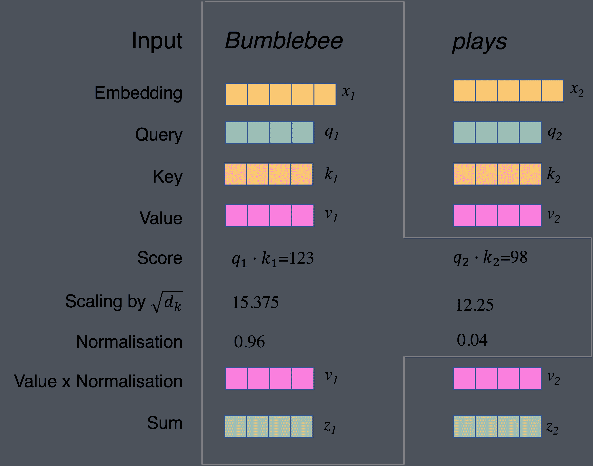
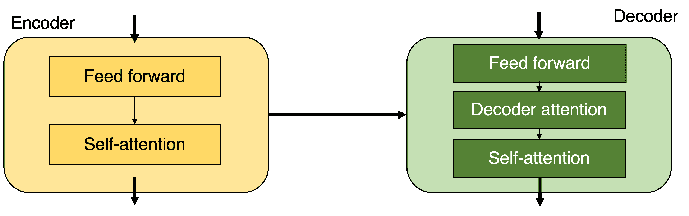

# 变形金刚-自我关注拯救

> 原文：<https://www.dominodatalab.com/blog/transformers-self-attention-to-the-rescue>

如果提到“变形金刚”会让人想起伪装的自主机器人的冒险，那么你可能和我一样，是一个 80 年代的孩子:和混迹于卡车、飞机甚至微型录音机或恐龙中的塞伯坦人玩耍。虽然我很想谈谈那种变形金刚，但这篇博客的主题是关于瓦斯瓦尼和他的团队在 2017 年题为“[注意力是你所需要的全部](https://arxiv.org/abs/1706.03762)”的论文中提出的变形金刚。我们将讨论什么是变形金刚，以及自我关注是如何工作的。这将帮助我们理解为什么变形金刚正在接管机器学习的世界，并且没有伪装。

## 什么是变形金刚模型？

变压器是一种人工神经网络架构，用于解决深度学习应用中输入序列到输出序列的转换或变换问题。如果你想了解更多关于深度学习的信息，你可以看看我们之前的博客文章，在那里我们讨论了一些流行的深度学习框架。

你可能想知道我们所说的输入和输出序列是什么意思。嗯，也许考虑一些应用可能会有所帮助。以语音识别、蛋白质结构预测或机器翻译为例。让我们专注于后者:给定一个英语句子(序列输入),我们想要找到翻译成日语的句子(序列输出),其具有与原始句子相同的意思(或尽可能接近)。因此，输入句子“擎天柱是一个很酷的机器人”将要求我们产生输出“コンボイはかっこいいロボットです”(是的，擎天柱在日语中被称为 Convoy/コンボイ)。

简单地按照出现的顺序逐字翻译可能会导致说日语的人认为不合语法的输出。例如，在日语中，动词被放在话语的末尾，而在英语中从来没有这样的情况。序列转导中的一个主要问题是以稳健的方式学习输入和输出序列的表示，以便不引入失真。你不想误译一条重要的信息。

应对这一挑战的方法是使用递归神经网络(RNNs)。与输入和输出相互独立的前馈神经网络不同，RNN 的输出取决于给定序列的先验元素。这有时被称为“记忆”。尽管 RNNs 的结果可能很好，但它们的使用有局限性，例如，给定 RNNs 的固定大小的输入/输出向量架构，找出输出序列的长度可能具有挑战性。更好的方法是使用变压器。

机器翻译的魔力得益于该架构中的两个组件:编码器和解码器。前者是接收输入序列的每个分量的元素，将它编码(因此得名)成一个携带整个序列的上下文信息的向量。这被发送到解码器，其工作是理解上下文并有意义地解析输出。

因为原始序列的重要信息是在上下文向量中携带的，所以我们可以将其视为架构中最重要的部分。同样，它可能是系统中“交通堵塞”的原因。这就是注意力概念发挥作用的地方。最初[由 Minh-Thang Long 于 2015 年](https://arxiv.org/abs/1508.04025)提出，它使您的模型能够根据需要关注输入序列的重要部分。

## 集中注意力

正如我们所看到的，模型中仅有“内存”可能还不够。我们需要“注意力”来帮助进一步改进诸如机器翻译这样的任务。让我们来看看注意力是做什么的。

在序列到序列模型中，编码器只将最后一个隐藏状态作为上下文传递给解码器。当使用注意时，编码器不仅传递最后一个隐藏状态，而且实际上传递所有隐藏状态。这意味着解码器可能要比以前多做一点工作。需要这种额外的处理，因为现在接收到的每个隐藏状态都与输入序列的给定部分相关联。在我们的例句“擎天柱是一个很酷的机器人”中，第一个隐藏状态与单词“擎天柱”有关，第二个与单词“擎天柱”有关，第三个与“是”有关，依此类推。通过这种方式，解码器可以做更多的事情，但也可以接收更多的信息。

解码器现在的工作是计算编码器接收到的每个隐藏状态的权重。这是通过解码器自己的隐藏状态完成的，换句话说，就是模型中上一个时间步的输出。目的是为具有更高权重值的隐藏状态提供更大的重要性，这是我们新的上下文向量。然后，我们可以使用该上下文作为解码器的前馈神经网络的输入，以获得我们想要的输出序列。反过来，输出序列被用作解码器的隐藏状态，在下一个时间步骤中用于计算权重。

## 向内看——自我关注的作用

虽然注意力是解码器袖子上的一个重要把戏，我们可能会问编码器是否有它自己的任何把戏。答案是肯定的，这叫做自我关注。像注意一样，自我注意跟踪输入序列的关联，但这次是编码器跟踪其他项目以实现更好的编码。例如，以下面的输入句子为例:

“大黄蜂播放一些朗朗上口的音乐，并跟着跳舞”。

如果我们只追踪靠得很近的词的关系，我们可以很容易地识别出“朗朗上口”这个词指的是“音乐”。如果跟踪只在两个连续的单词之间进行，我们可能会在句尾的单词“it”失去其所指的情况下结束。对于人类读者来说，句子中的“它”显然是指“音乐”。然而，在自我注意力较低的情况下，翻译机器可能不知道这一点。

在自我注意中，编码者在处理句子的其他成分时寻找线索。以这种方式，自我注意可以被用来提取对序列中每个被处理元素的理解。在嵌入每个元素进行处理之后，我们需要另外三个组件:

*   **Key:Value**\((k:v)\):Key 是我们序列中一个元素的标签，用来区别于其他元素。每个键都有一个相关的值
*   **Query** \((q)\):当我们请求特定的信息时，我们查询键并为我们的请求选择最佳匹配

理解提取通过以下步骤完成:

1.  从训练时创建的矩阵中计算三个数组，称为 query \(q\)、key \(k\)和 value \(v\)。
2.  通过点积\(q\cdot k\)获得输入序列中每个元素的分数。注意，对于上面的句子，我们将使用每个值["bumblebee "，" plays "，" some "，" catching "，...].分数是通过将每个结果除以一个值来衡量的\(\sqrt(d_k )\)。典型值为 8，但也可以使用其他值。
3.  确保分数是正常的，积极的，加起来是 1。这可以通过应用 softmax 函数来实现。
4.  将值向量\(v\)乘以上一步的标准化分数。
5.  最后，把所有的结果加到一个向量中，并创建自我关注的输出。结果被传递给前馈神经网络。

## 变压器及其应用

转换器是一种神经网络架构，它在编码器和解码器的堆栈中利用了注意力和自我注意力的概念。在 Vaswani 等人的原始论文中，提议的架构师使用了 6 个编码器和 6 个解码器。第一个编码器将获取输入向量，并在将其传递给前馈神经网络之前用自关注层对其进行处理。在典型的体系结构中，每个编码器由两部分组成:自关注层和前馈神经网络。同样，每个解码器由三部分组成:自我注意层、解码器注意层和前馈神经网络。一旦第一个编码器的工作完成，结果就被传递给下一个编码器，依此类推，直到最后一个编码器将信息发送给解码器，然后进行类似的过程。

transformer 体系结构相对于其他神经网络(如 RNNs)的一个重要优势是，在较长的距离上以更有效的方式呈现单词周围的上下文。此外，与 rnn 不同，输入数据不需要顺序处理，支持并行化。

变形金刚正在迅速成为自然语言处理(NLP)中的首选工具，一些预训练的模型，如“来自变形金刚的双向编码器表示”或 [BERT](https://arxiv.org/abs/1810.04805) ，以及“预训练生成变形金刚 3”或 [GPT-3](https://beta.openai.com/docs/engines/gpt-3) 占据了头条。GPT-3 可以根据提供的训练数据生成新的文本，据说它支持 300 多种应用，如搜索、对话、文本补全等(见[此处](https://openai.com/blog/gpt-3-apps/))。

虽然我们已经用机器翻译的方式给出了变形金刚的例子，实际上这个架构最初就是为这个目的开发的，但是也有机器视觉的应用。看看[这篇关于大规模图像识别的文章](https://ai.googleblog.com/2020/12/transformers-for-image-recognition-at.html)。就像 NLP 转换器使用单词来学习句子一样，机器视觉转换器使用像素来实现图像的类似结果。

与 GPT-3 生成新文本的方式相同，机器视觉的对等物将基于所提供的输入来生成新图像。这正是姜等人[使用双变压器模型所展示的](https://arxiv.org/abs/2102.07074):当提供了超过 20 万个名人的脸部时，该模型能够生成具有中等分辨率的新脸部图像。

其他的应用正在浮出水面，我们在这篇文章的前面提到的一个是蛋白质结构的预测。2021 年发表的 [AlphaFold](https://www.nature.com/articles/s41586-021-03819-2) 展示了“第一种可以以原子精度定期预测蛋白质结构的计算方法，即使在没有类似结构已知的情况下。”变形金刚提供的潜力开始为多模态处理开辟可能性，应用程序将能够使用多种类型的数据，将图像和视频等媒体与语言结合起来。参见例如 VATT 的提议或由[阿克巴里等人](https://arxiv.org/abs/2104.11178)提出的视频-音频-文本转换器。

## 访问模型

随着应用程序数量的增长，在我们的工作中尝试实现 transformers 时，访问各种框架和模型是一个重要的考虑因素。在撰写本文时，许多 transformer 模型都可以通过开源项目获得。例如，BERT 已经被 Google Research [在这里](https://github.com/google-research/bert)提供。一个重要的例外是 GPT-3，它目前只能通过 OpenAI 的 API 产品提供。

鉴于 TensorFlow、PyTorch 或 Keras 等框架的广泛使用，它们已经提供了 transformer 模型也就不足为奇了:

*   TensorFlow 提供了许多用于文本分类、文本生成或翻译的文本处理工具。看一看[这里](https://www.tensorflow.org/text)。也有一些教程，例如[这个](https://www.tensorflow.org/text/tutorials/transformer)把葡萄牙语翻译成英语
*   PyTorch 提供了一个名为 [PyTorch-Transformers](https://pytorch.org/hub/huggingface_pytorch-transformers/) 的库，里面有最先进的预训练模型，包括伯特、GPT 和 GPT-2(GPT-3 的早期版本)
*   Keras 用户已经提供了一些代码样本，用于变形金刚的文本分类、[时间序列分类](https://keras.io/examples/timeseries/timeseries_classification_transformer/)或[语音识别](https://keras.io/examples/audio/transformer_asr/)

对于各种预先训练的模型，你可以看看 HuggingFace 和他们的[变形金刚库](https://huggingface.co/transformers/index.html)，有 100 多个模型可供选择，包括 BERT、RoBERTa(来自脸书)、XLNet(来自卡耐基梅隆大学)、DistilBERT(来自 Hugging Face 自己)、DeBERTa(来自微软)、威震天-BERT 或威震天-GPT2(都来自 NVIDIA)。

## 摘要

变压器已经彻底改变了序列间建模的世界，并开始渗透到许多令人兴奋的应用中，其编码器-解码器模型提供了优于其他神经网络架构的优势。依靠注意力和自我注意力的概念，变形金刚能够在给定的序列中提供更广泛的上下文，改善重要的自然语言处理任务的结果，如语音识别或机器翻译。

此外，与其他顺序模型相比，transformers 能够提供更好的结果，因为我们能够使用并行化，让我们充分利用我们的 GPU 推送性能，并获得出色的结果。接下来要做的是去开始玩变形金刚；谁知道呢，这可能比玩伪装的机器人好玩多了。