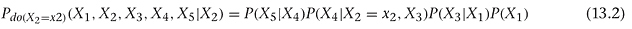
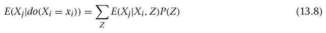

# 理解因果推理

> 原文：<https://www.dominodatalab.com/blog/understanding-causal-inference>

*本文涵盖了因果关系，其中一章摘自 Andrew Kelleher 和 Adam Kelleher 所著的《生产中的[机器学习:开发和优化数据科学工作流和应用](http://www.informit.com/store/machine-learning-in-production-developing-and-optimizing-9780134116549?utm_source=Referral&utm_medium=DominoLabs&utm_campaign=Kelleher)》一书。一个补充的[多米诺骨牌项目可用](https://try.dominodatalab.com/u/domino-andrealowe/Causal_Inference/sharedView/13_Causal_Inference.ipynb)。*

## 介绍

由于数据科学工作本质上是[实验性和概率性的](https://www.dominodatalab.com/blog/horizontal-scaling-parallel-experimentation)，数据科学家经常面临做出推论的问题。这可能需要思维方式的转变，特别是如果从“[传统统计分析转向多元数据的因果分析](https://www.ncbi.nlm.nih.gov/pmc/articles/PMC2836213/)。由于 Domino 致力于提供数据科学家加速工作所需的平台和工具，我们联系了 Addison-Wesley Professional(AWP)Pearson，请求允许从 Andrew Kelleher 和 Adam Kelleher 所著的《生产中的 *[机器学习:开发和优化数据科学工作流和应用](http://www.informit.com/store/machine-learning-in-production-developing-and-optimizing-9780134116549?utm_source=Referral&utm_medium=DominoLabs&utm_campaign=Kelleher)】一书中摘录“因果推理”。我们感谢提供以下章节摘录以及将代码放在补充的 [Domino 项目](https://try.dominodatalab.com/u/domino-andrealowe/Causal_Inference/sharedView/13_Causal_Inference.ipynb)中的许可。*


## 第一章介绍:因果推理

我们在书中介绍了几个机器学习算法，并指出它们可以用来产生清晰、可解释的结果。您已经看到，逻辑回归系数可用于表示某个结果与某个特征一起出现的可能性有多大(对于二元特征)，或者某个变量每增加一个单位，某个结果出现的可能性有多大(对于实值特征)。我们想发表更强烈的声明。我们想说“如果你将一个变量增加一个单位，那么它将会使一个结果更有可能。”

对回归系数的这两种解释表面上非常相似，以至于你可能要读几遍才能理解其中的含义。关键在于，在第一种情况下，我们描述的是在我们观察的系统中通常会发生什么。在第二种情况下，我们说的是如果我们干预这个系统并破坏它的正常运行会发生什么。

在我们看完一个例子后，我们将建立数学和概念机制来描述干预。我们将讨论如何从描述观察数据的贝叶斯网络发展到描述干预效果的贝叶斯网络。我们将通过一些经典的方法来估计干预的效果，最后我们将解释如何使用机器学习估计器来估计干预的效果。

如果你想象一个二元结果，比如“我上班迟到了”，你可以想象一些可能随之变化的特征。恶劣的天气会导致你上班迟到。恶劣的天气也会导致你穿雨靴。那么，当你穿着雨靴的时候，你上班就更有可能迟到。如果你观察二元特征“穿雨靴”和结果“我上班要迟到了”之间的相关性，你会发现一种积极的关系。说穿雨鞋导致上班迟到，当然是扯淡。这只是坏天气的一个代表。你永远不会推荐“你不应该穿雨靴，这样你上班就不会经常迟到”的政策。只有当“穿雨靴”与“上班迟到”有因果关系时，这才是合理的。作为防止迟到的干预措施，不穿雨鞋没有任何意义。

在这一章中，你将学习相关关系(雨靴和迟到)和因果关系(下雨和迟到)之间的区别。我们将讨论建立因果关系的黄金标准:一个实验。我们还将介绍一些方法，用于在无法进行实验的情况下发现因果关系，这在现实环境中经常发生。

## 13.2 实验

你们可能熟悉的例子是 AB 测试。您可以对产品进行更改，并根据产品的原始版本进行测试。您可以通过将用户随机分成两组来实现这一点。群体成员由 *D* 表示，其中 *D = 1* 是体验新变化的群体(测试群体)，而 *D = 0* 是体验产品原始版本的群体(控制群体)。具体来说，让我们假设你正在研究一个推荐系统在网站上推荐文章的变化的影响。对照组体验原始算法，测试组体验新版本。您希望看到这一变化对总浏览量的影响。

你可以通过观察一个叫做*平均治疗效果* (ATE)的量来衡量这个效果。ATE 是测试组和对照组之间结果的平均差异，


或者


这是 ATE 的“天真”估计值，因为这里我们忽略了世界上的其他一切。对于实验来说，这是对真实效果的无偏估计。

估计这一点的一个好方法是做一个回归。这样，您还可以同时测量误差线，并包括您认为可能会降低 Y 中噪声的其他协变量，从而获得更精确的结果。让我们继续这个例子。

```py
import numpy as np

import pandas as pd

N = 1000

x = np.random.normal(size=N)

d = np.random.binomial(1., 0.5, size=N)

y = 3\. * d + x + np.random.normal()

X = pd.DataFrame({'X': x, 'D': d, 'Y': y})
```

在这里，我们将 *D* 随机分配给测试组和控制组。 *X* 是导致 *Y* 的某个其他协变量， *Y* 是结果变量。我们给 *Y* 增加了一点额外的噪音，只是为了让问题变得更加嘈杂。

你可以使用回归模型


给定协变量 *D* ，估计 *Y* 的期望值，为


对于 *D* 的所有值(即 0 或 1)，将把*β[0]块加到*E【Y | D】*上。只有当 *D = 1* 时，才会添加 *β[1] 部分，因为当 *D = 0* 时，它会乘以零。这意味着**


当 *D=0* 并且


当 *D=1* 时。因此，β[1] 系数将是 *D = 1* 组和 *D = 0* 组之间的平均 *Y* 值的差值，


你可以用那个系数来估计这个实验的效果。当你对 *Y* 对 *D* 进行回归时，你会得到图 13.1 中的结果。

```py
from statsmodels.api import OLS

X['intercept'] = 1.

model = OLS(X['Y'], X[['D', 'intercept']])

result = model.fit()

result.summary()
```


为什么会这样？为什么可以说实验的效果只是测试组和对照组结果之间的差异？这似乎是显而易见的，但这种直觉将在下一节中被打破。在继续之前，让我们确保你深刻理解它。

每个人可以被分配到测试组或控制组，但不能两者都分配。对于一个被分配到测试组的人，如果他们被分配到控制组，你可以假设他们的结果会有什么价值。你可以称这个值为*Y⁰T3 】,因为如果 *D* 被设置为 0，它就是 *Y* 的值。同样，对于控制组成员，你可以谈论一个假设的 Y¹ 。你真正想衡量的是结果的差异*


对每个人来说。这是不可能的，因为每个人只能在一个组！正因如此，这些*Y¹和 *Y⁰* 变量被称为潜在结果。*

如果一个人被分配到测试组，你测量结果*Y = Y¹。如果一个人被分配到控制组，你测量 *Y = Y⁰ 。既然你不能测量个体效应，也许你可以测量群体水平效应。我们可以试着用*E【Y1】*和*E【Y0】*来代替。我们想要**

![E[Y1] and E[Y0]](img/190628a2530d178fe250146225c9d7a2.png)

和

![E[Y1] and E[Y0]](img/5c1a60b211e531d62b4a2be8172e5198.png)

但是我们不能保证这是真的。在推荐系统测试的例子中，如果你将页面浏览量较高的人分配到测试组，会发生什么？您可能会测量到比真实效果更大的效果！

幸运的是，你随机化 D 以确保它独立于*Y⁰和*Y¹。那样的话，你确定**

![E[Y1] and E[Y0]](img/190628a2530d178fe250146225c9d7a2.png)

和

![E[Y1] and E[Y0]](img/5da3e654af2dcd39c61c5966429b66f6.png)

所以你可以这么说

![E[Y1] and E[Y0]](img/cf94553a31df48a1719b3c874dd5e014.png)

当其他因素可以影响赋值时， *D* ，那么你就不能再确定你有正确的估计了！一般来说，当你无法控制一个系统时，这是正确的，所以你不能确保 *D* 独立于所有其他因素。

一般情况下， *D* 不会只是一个二元变量。它可以是有序的、离散的或连续的。你可能想知道一篇文章的长度对分享率的影响，吸烟对患肺癌概率的影响，你出生的城市对未来收入的影响，等等。

在我们继续之前，为了好玩，让我们看看你可以在实验中做些什么来获得更精确的结果。因为我们有一个协变量， *X* ，这也导致了 *Y* ，我们可以解释更多的 *Y* 的变化。这使得我们的预测不那么嘈杂，所以我们对 *D* 的影响的估计会更精确！让我们看看这个怎么样。我们现在对 *D* 和 *X* 进行回归，得到图 13.2。


注意，*R²T3 要好得多。另外，请注意 *D* 的置信区间要窄得多！我们从 3.95-2.51 = 1.2 的范围下降到 3.65-2.76 = 0.89。简而言之，找到解释结果的协变量可以提高实验的精确度！*

## 13.3 观察:示例

让我们来看一个例子，当你没有让你的事业独立于其他一切时会发生什么。我们将用它来展示如何建立一些直觉，观察和干预是不同的。让我们来看一个简单的模型，看看种族、贫困和社区犯罪之间的关系。贫困减少了人们生活中的选择，并使犯罪更有可能发生。这使得贫穷成为犯罪的原因。其次，邻里之间的种族构成会持续一段时间，所以邻里是种族构成的一个原因。邻里关系也决定了一些社会因素，如文化和教育，因此也可能是贫困的原因。这给了我们图 13.3 中的因果图。


在这里，种族和犯罪之间没有因果关系，但你会发现它们在观察数据中是相关的。让我们模拟一些数据来检验这一点。

```py
N = 10000

neighborhood = np.array(range(N))

industry = neighborhood % 3

race = ((neighborhood % 3

+ np.random.binomial(3, p=0.2, size=N))) % 4

income = np.random.gamma(25, 1000*(industry + 1))

crime = np.random.gamma(100000\. / income, 100, size=N)

X = pd.DataFrame({'$R$': race, '$I$': income, '$C$': crime,

'$E$': industry, '$N$': neighborhood})
```

这里，每个数据点将是一个邻域。每个社区的种族构成和主导产业都有共同的历史原因。这个行业决定了社区的收入水平，而收入水平与犯罪率成反比。

如果你为这些数据绘制相关矩阵(图 13.4)，你可以看到种族和犯罪是相关的，尽管它们之间没有因果关系！


你可以采用回归方法，看看如何解释回归系数。因为我们知道使用正确的模型，我们可以做正确的回归，结果如图 13.5 所示。


```py
from statsmodels.api import GLM

import statsmodels.api as sm

X['$1/I$'] = 1\. / X['$I$']

model = GLM(X['$C$'], X[['$1/I$']], family=sm.families.Gamma())

result = model.fit()

result.summary()
```

由此可以看出，1/I 每增加一个单位，犯罪数量就增加 123 个单位。如果犯罪单位是每 10，000 人的犯罪，这意味着每 10，000 人多 123 起犯罪。

这是一个很好的结果，但是你真的想知道这个结果是否有因果关系。如果是因果关系，这意味着你可以设计一个政策干预来利用这种关系。也就是说，你想知道如果人们挣更多的收入，在其他条件不变的情况下，犯罪率会不会降低？如果这是一个因果结果，你可以说，如果你使收入更高(独立于其他一切)，那么你可以预期 1/I 每减少一个单位，你会看到 123 起犯罪减少。是什么阻止我们现在提出这些主张呢？

你会发现回归结果不一定是因果关系；让我们看看种族和犯罪之间的关系。我们将进行另一次回归，如下所示:

```py
from statsmodels.api import GLM

import statsmodels.api as sm

races = {0: 'african-american', 1: 'hispanic',

    2: 'asian', 3: 'white'}

X['race'] = X['$R$'].apply(lambda x: races[x])

race_dummies = pd.get_dummies(X['race'])

X[race_dummies.columns] = race_dummies

model = OLS(X['$C$'], race_dummies)

result = model.fit()

result.summary()
```


在这里，你会发现种族和犯罪之间有很强的关联，尽管没有因果关系。你知道，如果我们把很多白人搬到一个黑人社区(保持收入水平不变)，你应该对犯罪没有影响。如果这种回归是因果关系，那么你会。为什么即使没有因果关系也能找到显著的回归系数？

在这个例子中，你错了，因为种族构成和收入水平都是由每个街区的历史造成的。这是两个变量有共同原因的情况。如果你不控制那段历史，那么你会发现两个变量之间的虚假关联。你所看到的是一个普遍的规律:当两个变量有共同的原因时，即使它们之间没有因果关系，它们也是相关的(或者更一般地说，是统计相关的)。

这个共同原因问题的另一个很好的例子是，当柠檬水销量高时，犯罪率也高。如果你回归柠檬水销售的犯罪率，你会发现柠檬水销售每增加一个单位，犯罪率就会显著增加！显然，解决办法不是取缔柠檬水摊。碰巧的是，热天卖的柠檬水更多。热天犯罪率也更高。天气是犯罪和柠檬水销售的常见原因。我们发现这两者是相关的，即使它们之间没有因果关系。

柠檬水示例中的解决方案是控制天气。如果你看看所有阳光明媚、华氏 95 度的日子，天气对柠檬水销售的影响是不变的。在有限的数据集中，天气和犯罪的影响也是不变的。两者之间的任何差异必定是由其他因素造成的。你会发现柠檬水销售和犯罪在这个受限的数据集中不再有显著的相关性。这个问题通常被称为混杂，打破混杂的方法是对混杂者进行控制。

同样，如果你只看有特定历史的社区(在这种情况下，相关变量是主导产业)，那么你会打破种族和收入之间的关系，也打破种族和犯罪之间的关系。

为了对此进行更严格的推理，让我们看一下图 13.3。我们可以看到依赖的来源，这里有一条从 N 到 R 的路径和一条从 *N* 通过 *E* 和 *P* 到 *C* 的路径。如果您能够通过固定一个变量来打破这条路径，那么您就可以破坏沿着这条路径流动的依赖性。结果将不同于通常的观察结果。你会改变图中的依赖关系，所以你会改变所有这些变量的联合分布。

如果你以一种独立于主导行业的方式干预设定一个地区的收入水平，你将打破行业和收入之间的因果联系，导致图 13.7 中的图表。在这个系统中，你应该发现种族和犯罪之间产生依赖的路径被打破了。两者应该是独立的。


你如何只用观察数据来控制？一种方法是限制数据的子集。例如，你可以只看行业 0，看看最后一次回归是什么样的。

```py
X_restricted = X[X['$E$'] == 0]

races = {0: 'african-american', 1: 'hispanic',

    2: 'asian', 3: 'white'}

X_restricted['race'] = X_restricted['$R$'].apply(lambda x: races[x])

race_dummies = pd.get_dummies(X_restricted['race'])

X_restricted[race_dummies.columns] = race_dummies

model = OLS(X_restricted['$C$'], race_dummies)

result = model.fit()

result.summary()
```

这产生了图 13.8 中的结果。


现在你可以看到所有的结果都在彼此的信任范围内！这个地区的工业充分说明了种族和犯罪之间的相互关系。换句话说，在这个假设的数据集中，当你知道该地区的主导产业是什么时，犯罪是独立于种族的。你做的和你之前做的调理是一样的。

请注意，与以前相比，新系数的置信区间相当宽。这是因为您已经限制了一小部分数据。你能做得更好吗，也许通过使用更多的数据？事实证明，有一种比限制数据集更好的控制方式。你可以回归你想要控制的变量！

```py
from statsmodels.api import GLM

import statsmodels.api as sm

races = {0: 'african-american', 1: 'hispanic',

    2: 'asian', 3: 'white'}

X['race'] = X['$R$'].apply(lambda x: races[x])

race_dummies = pd.get_dummies(X['race'])

X[race_dummies.columns] = race_dummies

industries = {i: 'industry_{}'.format(i) for i in range(3)}

    X['industry'] = X['$E$'].apply(lambda x: industries[x])
```

```py
industry_dummies = pd.get_dummies(X['industry'])

X[industry_dummies.columns] = industry_dummies

x = list(industry_dummies.columns)[1:] + list(race_dummies.columns)

model = OLS(X['$C$'], X[x])

result = model.fit()

result.summary()
```

然后，你得到图 13.9 显示的结果。


在这里，置信区间要窄得多，你可以看到种族和收入水平之间仍然没有明显的联系:系数大致相等。这是一个因果回归结果:你现在可以看到，改变社区种族构成的干预没有任何效果。这个简单的例子很好，因为你可以看到要控制什么，并且你已经测量了你需要控制的东西。一般怎么知道控制什么？你会一直成功吗？事实证明这在实践中非常困难，但有时这是你能做的最好的了。

## 13.4 阻止非因果路径的控制

你刚刚看到，你可以通过控制正确的变量，把一个相关的结果变成一个因果结果。你怎么知道要控制哪些变量？你怎么知道回归分析会控制他们？本节主要依赖于第 11 章中的 d-分离。如果这些材料不新鲜，你可能想现在就复习一下。

你在前一章已经看到，条件作用可以打破统计上的依赖。如果你以路径的中间变量 *X → Y → Z* 为条件，你将打破路径产生的 *X* 和 *Z* 之间的依赖关系。如果您以混杂变量 *X ← Z → Y* 为条件，您也可以打破混杂变量导致的 *X* 和 *Y* 之间的依赖关系。重要的是要注意，由 *X* 和 *Y* 之间的其他路径引起的统计相关性不会受到这种调节的影响。例如，如果你在图 13.10 的系统中以 *Z* 为条件，你将摆脱混杂因素，但留下因果关系。


如果你有一个通用的规则来选择阻塞哪些路径，你可以消除变量之间的所有非因果相关性，但保留因果相关性。“后门”标准是您正在寻找的规则。它告诉你应该控制哪组变量， *Z* ，以消除*X[I]和*X[j]之间的任何非因果统计相关性。在引入标准之前，您应该注意最后的细微差别。如果你想知道*X[I]和*X[j]之间的相关性是不是“因果”，你就要担心效果的方向了。例如，很高兴知道“度假”和“放松”之间的相互关系没有混淆，但你真的想知道“度假”是否会让你“放松”。这将为去度假放松的政策提供信息。如果因果关系颠倒过来，你就不能采取那种政策。****

记住，后门标准是相对于一对有序变量定义的，( *X[i] ，X[j] )* ，其中 *X[i]* 将是原因， *X[j]* 将是结果。

```py
Definition 13.1\. Back-Door Conditioning

It’s sufficient to control for a set of variables, Z, to eliminate noncausal dependence for the effect of *X[i]* on *X[j]* in a causal graph, G, if
```

* Z 中没有变量是 Xi 的后代，并且

* Z 封锁 Xi 和 Xj 之间包含指向 Xi 的箭头的所有路径。

我们不去证明这个定理，但是让我们为它建立一些直觉。先来考察条件“Z 中没有变量是*X[I]的后代。”你之前了解到，如果你以一个共同的效应*X[I]和*X[j]为条件，那么这两个变量将是有条件依赖的，即使它们通常是独立的。如果你以共同效应中的任何一个效应为条件，这一点仍然成立。因此，您可以看到后门标准的第一部分阻止您在没有依赖的地方引入额外的依赖。***

这种情况还有其他原因。如果你有一个类似*X[I]→*X[k]*→*X[j]*的链条，你看到 *X[k]* 是 *X[i]* 的后代。这在 z 中是不允许的。这是因为如果你以 *Xk* 为条件，你就阻断了*X[I]和*X[j]之间的因果路径。因此，你可以看到第一个条件也阻止了你对落在因果路径上的变量进行条件化。***

第二个条件是“Z 阻塞了在*X^I和*X^j之间的每一条路径，该路径包含一个指向*X^I的箭头。”这一部分将告诉我们控制混杂因素。你怎么能看到这个？让我们考虑一些情况，其中沿着在 *Xi* 和 *Xj* 之间的路径有一个或多个节点，并且该路径包含一个到*X^I的箭头。如果在*X[I]和*X[j]之间的路径上有一个碰撞器，那么这条路径已经被阻塞了，所以你只需要在空集上设置条件来阻塞这条路径。接下来，如果沿着路径有一个分叉，像路径 *Xi ← Xk → Xj* ，并且没有碰撞器，那么你有典型的混杂。您可以对路径上任何会阻塞它的节点设置条件。在这种情况下，您将*X^k添加到集合 *Z* 中。注意，从*X[I]到*X[j]不可能有箭头指向*X[I]的因果路径，因为箭头指向*X^I。***********

因此，你可以看到你阻断了从 Xi 到 Xj 的所有非因果路径，剩下的统计相关性将显示出*X[j]对*X[I]的因果相关性。有没有一种方法可以利用这种依赖性来估计干预的效果？**

## G 公式

让我们看看干预到底意味着什么。这意味着你有一个如图 13.11 所示的图表。


图 13.11 干预前因果图。从这个系统中收集的数据反映了我们观察世界的方式。

你要估计*X[2]T3 对 *X[5]* 的影响。也就是你想说“如果我介入这个系统把*X[2]的值设置为*X[2]，*X[5]会怎么样？为了量化这种影响，你必须认识到，所有这些变量的值不仅取决于它们的前身，还取决于系统中的噪声。因此，即使存在*X[2]对*X[5]的确定性影响(比方说，将*X[5]的值提高一个单位)，您也只能用一个值分布来真正描述*X[5]将取的值。因此，当你估计*X[2]对*X[5]的影响时，你真正想要的是*X[5]的分布，当你介入设置*X[2]的值时。************

我们来看看*干预*是什么意思。我们说我们想要忽略 *X1* 对 *X2* 的通常影响，并通过向 *X2* 施加一些外力(我们的动作)将 *X2* 的值设置为 *x2* 。这消除了 *X2* 和 *X1* 之间通常的依赖性，并通过中断穿过 *X2* 的路径来破坏 *X1* 对 *X4* 的下游影响。因此，我们还将期望 X1 和 X4，P( *X1，X4* )之间的边际分布发生变化，以及 *X1* 和 *X5* 的分布！我们的干预可以影响它下游的每一个变量，其方式不仅仅取决于值 *x2* 。我们实际上破坏了其他的依赖性。

你可以画一张新的图表来表示这种干预。在这一点上，你会看到操作与观察*X[2]= X[2]的值非常不同，即简单地调节 *X[2] = x[2]* 。这是因为你破坏了图中的其他相关性。你实际上在谈论一个由图 13.12 中的图表描述的新系统。*


你需要一些新的符号来谈论这样的干预，所以你将表示*do(X[2]= X[2])*你执行这个操作的干预。这给出了干预的定义，或 *do 操作。*

```py
Definition 13.2\. Do-operation

We describe an intervention called the do() operation in a system described by a DAG, G as an operation where we do Xi by
```

删除 G 中指向 xi 的所有边，并将 Xi 的值设置为 Xi。

这张新图的联合分布是什么样的？让我们使用通常的因式分解，并写出以下内容:


这里我们刚刚用δ函数表示了 *P(X[2] )* ，所以当 *X[2] = x[时*X[2]≠X[2]X*P(X[2])*= 1 我们基本上是说，当我们干预设置*X[2]= X[2]*时，我们确信它起作用了。我们可以在其他地方执行*x[2]= x[2]，就像在 *P(X[4] |X[2] ，X[3] )* 的分配中一样，但是只需用 *X[2] = x[2]* 来替换 *X[2]*

最后，让我们以 X2 分布为条件，来摆脱这个公式右边的怪异之处。我们可以这样写:



准确地说，


令人难以置信的是，这个公式在一般情况下是有效的。我们可以这样写:


这给了我们一个很好的通用规则:变量的父变量总是满足后门标准！事实证明，我们甚至可以比这更一般化。如果我们把除 Xi 和 Xj 之外的所有东西都边缘化，我们会看到父母是控制混杂因素的一组变量。


事实证明(我们将在没有证明的情况下陈述)，你可以将父集合推广到满足后门标准的任何集合 Z。


您可以忽略 Z，使用条件概率的定义写出一个重要的公式，如

定义 13.3。
定义 13.3。罗宾斯 G 公式


这是在干预*X[I]下估计*X[j]分布的一般公式。请注意，所有这些分布都来自干预前系统。这意味着你可以在一些假设的干预下，用观测数据来估计*X[j]的分布！***

这里有一些重要的警告。首先，方程 13.4*P(X[I]| Pa(X[I])*的分母中的项，对于左边要定义的量，必须是非零的。这意味着，你必须观察到 Xi 呈现出你想通过干预设定的值。如果你从未见过它，你不能说系统会如何响应它！

接下来，假设你有一个可以控制的集合 *Z* 。实际上，很难知道你是否找到了一组好的变量。总会有你从未想过要测量的混杂因素。同样，你控制已知混杂因素的方法可能不会做得很好。当你进入一些机器学习估值器时，你会更加理解第二个警告。

有了这些警告，很难从观察数据中估计因果关系。你应该把条件反射法的结果看作是对因果效应的临时估计。如果您确定您没有违反后门标准的第一个条件，那么您可以预期您已经移除了一些虚假的依赖。你不能肯定地说你减少了偏见。

举例来说，想象一下*X[I]对*X[j]的影响的两个偏差源。假设您对测量的平均值感兴趣**


路径 *A* 引入的偏置为δ，路径 B 引入的偏置为 2δ。如果你在不控制任何一条路径的情况下估计平均值，你会发现


如果你沿着路径 *A* 控制一个混杂因素，那么你去除它对偏差的 *j^((偏差，A))* 贡献，剩下


现在偏差大了一倍！当然，问题是你纠正的偏差实际上是把我们的估计值推回到正确的值。在实践中，更多的控制通常会有所帮助，但你不能保证你不会发现这样的效果。既然你已经有了观察因果推断的良好背景，让我们看看机器学习估计器如何在实践中有所帮助！

## 13.5 机器学习估算器

一般而言，您不会想要估计干预下的完全联合分布。你甚至可能对边缘感兴趣。通常，你只是对平均效果的差异感兴趣。

在最简单的情况下，你想估计一些结果的期望差，Xj，你能控制的变量，Xi 的单位变化。例如，你可能想测量


这将告诉您，当您将*X[I]设置为 1 时，如果 *X[i]* 设置为 0，您平均可以预期的*X[j]T3 的变化。**

让我们重温一下 g 公式，看看如何测量这些量。

## 13.5.1 重新审视 G 公式

g 公式告诉你如何估计因果效应， *P(Xj|do(Xi = xi)* )，使用观察数据和一组变量进行控制(基于我们对因果结构的了解)。上面写着:


如果你在每一边取期望值(乘以 Xj，然后在 Xj 上求和)，你会发现:



在实践中，很容易估计这个公式右边的第一个因子。如果你用均方误差损失来拟合回归估计量，那么最佳拟合就是每个点 *(X^i ，Z)* 的 *Xj* 的期望值。只要模型有足够的自由度来准确描述期望值，就可以通过使用标准的机器学习方法来估计第一个因素。

估算整个左侧，需要处理 *P(Z)* 项，以及和。原来有一个简单的技巧可以做到这一点。如果你的数据是从观测联合分布中抽取的，那么你的样本 *Z* 实际上就是从 *P(Z)* 中抽取的。然后，如果您将 *P(Z)* 项替换为 *1/N* (对于 *N* 个样本)并对数据点求和，您将得到这个和的估计值。也就是说，您可以进行如下替换:


## 一个例子

让我们回到图 13.11 中的图表。我们将使用朱迪亚·珀尔书中的一个例子。我们担心人行道会滑，所以我们正在调查其原因。 *X5* 可以是 1 或 0，分别表示滑或不滑。你发现人行道在潮湿的时候很滑，你会用 *X4* 来表示人行道是否潮湿。接下来，你需要知道人行道潮湿的原因。你看到一个洒水车在人行道附近，如果洒水车开着，会把人行道弄湿。 *X[2] 你会注意到雨后的人行道也是湿的，你会用雨后的 X3 表示为 1，否则为 0。最后，你注意到在阳光明媚的日子里，你打开了洒水器。你将用 *X[1]* 来表示天气，其中 *X[1]* 如果是晴天就是 1，否则就是 0。*

在这幅图中，雨和打开的洒水器是负相关的。这种统计相关性的发生是因为它们相互依赖于天气。让我们模拟一些数据来探索这个系统。您将使用大量数据，因此随机误差会很小，您可以将注意力集中在偏差上。

```py
import numpy as np

import pandas as pd

from scipy.special import expit

N = 100000

inv_logit = expit

x1 = np.random.binomial(1, p=0.5, size=N)

x2 = np.random.binomial(1, p=inv_logit(-3.*x1))

x3 = np.random.binomial(1, p=inv_logit(3.*x1))

x4 = np.bitwise_or(x2, x3)

x5 = np.random.binomial(1, p=inv_logit(3.*x4))

X = pd.DataFrame({'$x_1$': x1, '$x_2$': x2, '$x_3$': x3,

    '$x_4$': x4, '$x_5$': x5})
```

这里的每个变量都是二进制的。您可以使用逻辑连接函数来使逻辑回归适当。当你不知道数据生成过程时，你可能会更有创造力。一会儿你就讲到这一点了！

让我们看看相关矩阵，如图 13.13 所示。天气好的时候，洒水车就开了。下雨的时候，洒水器就关了。你可以看到，由于这种关系，洒水器开着和下雨之间有一种负的关系。

有几种方法可以估计出*X[2]对 *X[5]* 的影响。第一种简单的方法是，给定 *X[2] = 1* 或 *X[2] = 0* ，找出 *X[5] = 1* 的概率。这些概率的差异告诉你，在洒水器打开的情况下，人行道湿滑的可能性有多大。计算这些概率的一个简单方法就是对每个数据子集中的 X5 变量进行平均(其中 *X[2] = 0* 和 *X[2] = 1* )。您可以运行以下程序，生成图 13.14 中的表格。*

```py
X.groupby('$x_2$').mean()[['$x_5$']]
```


如果你看看这里的差异，你会发现人行道是 0.95-0.86 = 0.09，或者说，在洒水装置打开的情况下，9 个百分点的可能性更容易打滑。您可以将其与介入图进行比较，以获得变化的真实估计值。您可以使用此处显示的过程生成此数据:

```py
N = 100000

inv_logit = expit

x1 = np.random.binomial(1, p=0.5, size=N)

x2 = np.random.binomial(1, p=inv_logit(-3.*x1))

x3 = np.random.binomial(1, p=inv_logit(3.*x1))

x4 = np.bitwise_or(x2, x3)

x5 = np.random.binomial(1, p=inv_logit(3.*x4))

X = pd.DataFrame({'$x_1$': x1, '$x_2$': x2, '$x_3$': x3,

    '$x_4$': x4, '$x_5$': x5})
```

现在，*X[2]独立于*X[1]和 *X[3] 。*如果重复之前的计算(试试看！)，你就得到 0.12 的差异，或者说 12 个百分点。这比天真的估计要大 30 %!**

现在，您将使用一些机器学习方法，严格使用观察数据来尝试获得真实(0.12)效应的更好估计。首先，您将尝试对第一个数据集进行逻辑回归。让我们重新创建天真的估计，只是为了确保它正常工作。

```py
from sklearn.linear_model import LogisticRegression

# build our model, predicting $x_5$ using $x_2$

model = LogisticRegression()

model = model.fit(X[['$x_2$']], X['$x_5$'])

# what would have happened if $x_2$ was always 0:

X0 = X.copy()

X0['$x_2$'] = 0

y_pred_0 = model.predict_proba(X0[['$x_2$']])

# what would have happened if $x_2$ was always 1:

X1 = X.copy()

X1['$x_2$'] = 1

y_pred_1 = model.predict_proba(X1[['$x_2$']])

# now, let's check the difference in probabilities

y_pred_1[:, 1].mean() - y_pred_0[:,1].mean()
```

你先建立一个逻辑回归模型，用*X[2]来预测*X[5]。您进行预测，并使用它来获得在 *X[2] = 0* 和 *X[2] = 1* 状态下 *X[5] 的概率。你对整个数据集都这样做了。***

这样做的原因是，您经常会有更多有趣的数据集，有更多的变量在变化，并且您会希望看到整个数据集上*X[2]对 *X[5]* 的平均影响。这个过程允许您这样做。最后你求两个状态概率的平均差，你得到和之前一样的 0.09 的结果！*

现在，你想要对相同的观察数据进行控制，以得到因果(0.12)结果。您执行与之前相同的过程，但是这次您将*X[1]包括在回归中。*

```py
model = LogisticRegression()

model = model.fit(X[['$x_2$', '$x_1$']], X['$x_5$'])
# what would have happened if $x_2$ was always 0:

X0 = X.copy()

X0['$x_2$'] = 0

y_pred_0 = model.predict_proba(X0[['$x_2$', '$x_1$']])

# what would have happened if $x_2$ was always 1:

X1 = X.copy()

X1['$x_2$'] = 1

# now, let's check the difference in probabilities

y_pred_1 = model.predict_proba(X1[['$x_2$', '$x_1$']])

y_pred_1[:, 1].mean() - y_pred_0[:,1].mean()
```

在这种情况下，您会发现结果为 0.14。你高估它了！哪里出了问题？你实际上并没有在建模过程中做错什么。问题很简单，逻辑回归不是这种情况下的正确模型。对于每个变量的父代来说，这是预测其值的正确模型，但对于父代之后的后代来说，这种模型并不适用。我们能做得更好吗，用一个更通用的模型？

这将是你第一次看到神经网络对于一般的机器学习任务有多么强大。在下一章中，你将更详细地学习如何构建它们。现在，让我们使用 keras 尝试一个深度*前馈*神经网络。之所以称之为深度，是因为不仅仅是输入和输出层。这是一个前馈网络，因为你将一些输入数据放入网络，并通过各层将它们向前传递以产生输出。
深度前馈网络具有“通用函数逼近器”的特性，在某种意义上，只要给定足够的神经元和层数，它们就可以逼近任何函数(尽管在实践中学习起来并不容易)。您将像这样构建网络:

```py
from keras.layers import Dense, Input

from keras.models import Model

dense_size = 128

input_features = 2

x_in = Input(shape=(input_features,))

h1 = Dense(dense_size, activation='relu')(x_in)

h2 = Dense(dense_size, activation='relu')(h1)

h3 = Dense(dense_size, activation='relu')(h2)

y_out = Dense(1, activation='sigmoid')(h3)

model = Model(input=x_in, output=y_out)

model.compile(loss='binary_crossentropy', optimizer='adam')

model.fit(X[['$x_1$', '$x_2$']].values, X['$x_5$'])
```

现在像以前一样做同样的预测程序，结果是 0.129。

```py
X_zero = X.copy()

X_zero['$x_2$'] = 0

x5_pred_0 = model.predict(X_zero[['$x_1$', '$x_2$']].values)

X_one = X.copy()

X_one['$x_2$'] = 1

x5_pred_1 = model.predict(X_one[['$x_1$', '$x_2$']].values)

x5_pred_1.mean() - x5_pred_0.mean()

```

你比逻辑回归模型做得更好！这是一个棘手的案子。给你的是二进制数据，很容易计算概率，直接使用 g 公式你会做得最好。当你这样做的时候(你自己试试！)，你从这个数据算出 0.127 的真实结果。你的神经网络模型很接近！

现在，你想制定一项政策，让人行道不那么容易滑。你知道，如果你不经常打开洒水器，应该会有效果。你可以看到，制定这一政策(并进行干预以改变系统)，你可以预期人行道的滑度会降低。多少钱？当您设置洒水喷头=关闭时，您希望比较干预前和干预后打滑的可能性。你可以简单地用我们的神经网络模型来计算，就像这样:

```py
X['$x_5$'].mean() - x5_pred_0.mean()
```

这使得结果为 0.07。如果你制定一个保持洒水器关闭的政策，人行道打滑的可能性将会降低 7 %!

## 13.6 结论

在这一章中，你已经开发了进行因果推理的工具。您已经了解到，机器学习模型有助于获得更通用的模型规格，并且您看到，使用机器学习模型预测结果越好，就越能从观察性因果效应估计中消除偏差。

观察性因果效应估计应始终小心使用。只要有可能，你应该尝试做随机对照实验，而不是使用观察估计。在这个例子中，你应该简单地使用随机控制:每天抛一枚硬币，看看洒水器是否打开。这将重新创建干预后系统，并让您测量洒水装置关闭时与打开时(或系统未干预时)相比，人行道变滑的可能性有多大。当你试图评估一项政策的效果时，很难找到一种替代方法来通过受控实验来实际测试这项政策。

在设计机器学习系统时，能够进行因果思考尤其有用。如果你只是想说给定系统中通常发生的事情，什么结果是最有可能的，标准的机器学习算法是合适的。你不是在试图预测干预的结果，你也不是在试图建立一个对系统运行方式的变化具有鲁棒性的系统。你只是想描述系统的联合分布(或者它下面的期望值)。

如果你想告知政策变化，预测干预的结果，或使系统对其上游变量的变化(即外部干预)具有鲁棒性，那么你将需要一个因果机器学习系统，在其中你控制适当的变量来测量因果效应。

一个特别有趣的应用领域是在逻辑回归中估计系数。之前，您看到了逻辑回归系数在观察数据中有一个特殊的解释:它们描述了某个自变量的单位增加产生结果的可能性有多大。如果您控制正确的变量以获得因果逻辑回归估计(或者只是对控制生成的数据进行回归)，那么您会有一个新的、更强有力的解释:系数告诉您当您干预以将自变量的值增加一个单位时，发生结果的可能性有多大。您可以使用这些系数来制定政策！