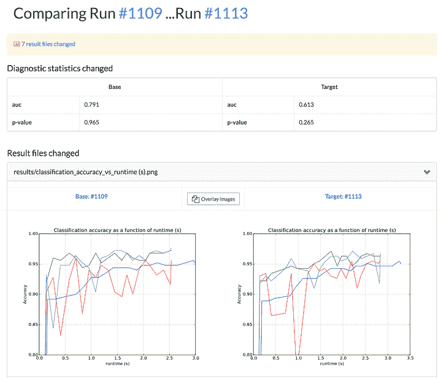
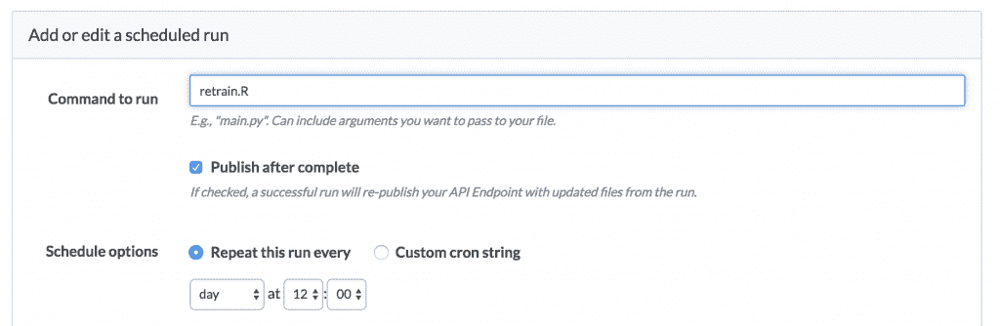

# 数据科学的“单元测试”

> 原文：<https://www.dominodatalab.com/blog/unit-testing-data-science>

我们经常听到数据科学组织谈论的一个有趣的话题是“单元测试”这是构建软件的长期最佳实践，但是对于定量研究工作来说，它到底意味着什么还不是很清楚——更不用说如何实现这样的实践了。这篇文章描述了我们对这个话题的看法，以及我们如何设计 Domino 来促进我们所认为的相关最佳实践。

## 如果我们知道自己在做什么...

首先，我们认为术语“单元测试”并不适用于所有类型的数据科学工作。这是因为“测试”意味着你正在测试的东西有一个正确的答案:先验地，你知道结果应该是什么。

如果您正在创建一个“华氏温度到摄氏温度的转换”函数，您可以查找正确的答案，并验证 32 华氏度的输入应该输出 0 摄氏度。

但是，当我们开始研究一个新的模型或分析时，我们并不知道正确的答案。假设你在一个[保险数据科学](https://www.dominodatalab.com/insurance/?utm_source=blog&utm_medium=post&utm_campaign=unit-testing-data-science)团队中，正在建立一个模型来预测某人申请贷款时的违约概率；或者客户流失的可能性；或者申请保险的人可能会提出的索赔。对于一个你可以提前知道的预测，没有“正确”的答案。当然，您有验证数据集，因此您可以用各种方式来度量模型性能。但是一个模型是“好”还是“改进”往往是一个解释的问题。

或者如爱因斯坦所说:

如果我们知道我们在做什么，那就不叫研究了，对吗？

有大量的数据科学工作涉及到构建核心库函数，其中有明确定义的正确答案——并且无论如何这些函数都应该进行单元测试。

但通常当人们问及“数据科学的单元测试”时，他们指的是别的东西——我们认为这都是关于质量控制的。软件中单元测试的最终目标是确保你的代码在你使用它之前没有引入问题，因为它会产生更大的影响。我们看到这种质量控制在典型的数据科学工作流程中的两个地方非常重要。

## 人工守门

如果您或您的同事对某些代码进行了更改，并希望替换旧版本，您如何知道它没有引入任何问题(更不用说它得到了改进)？单元测试有助于确保软件做到这一点，当然还有代码审查。对于数据科学工作，我们发现让评审员检查实验结果至关重要。

Domino 通过在运行代码时自动记录结果，并允许您检查这些结果来解决这个问题。结果可以是定量统计，如 F1 分数、p 值、AUC 等。或者它们可以是视觉结果，比如 ROC 曲线。迭代之后，当你有一个你喜欢的版本想要评审(或者让同事评审)的时候，你可以对比一下:



在将提议的变更合并回项目之前，这个“评审”过程可以作为一个正式的关口。

在没有已知的“正确”答案的情况下，我们发现质量控制最好通过人工检查结果(定量和视觉)来实现。

## 自动部署

软件中单元测试的另一个常见用例是在部署到生产环境之前确保一切正常。

在我们的例子中，Domino 允许您将预测模型部署为 API，以便其他软件系统可以轻松地使用它们。我们提供的一个强大功能是安排再训练任务的能力:您可以运行代码，根据新数据再训练您的模型，并自动将更新后的模型重新部署到生产中。

在这种情况下，如果您更新的模型不能满足某些条件，您可能希望部署失败。为了处理这个问题，如果您的重新训练脚本抛出错误，Domino 将中止部署。这允许您在自己选择的编程语言中构建任何您想要的把关检查。例如，在 R:

```py
library(randomForest)
library(jsonlite)

df <- read.csv("./winequality-red.csv", h=T, sep = ";")
df$quality <- factor(df$quality)

cols <- names(df)[1:11]
clf <- randomForest(df$quality ~ ., data=df[,cols], ntree=50, nodesize=4, mtry=8)

runChecks <- function(clf) {
finalErr <- clf$err.rate[length(clf$err.rate)]
if (finalErr > 15) {
stop("error rate too high")
}
}

runChecks(clf)

save(clf, file="classifier.Rda")
```

我们这里的代码将训练模型，然后执行 runChecks 函数，如果新模型的错误率太大，该函数将失败。

Domino 让我们安排这个“再培训”。r "脚本并自动部署生成的更新模型，只要脚本成功运行。



这样，您可以编写自己的“测试”来确保新模型不会被部署，除非它们通过您的检查，无论您如何定义它们。

## 结论

我们认为“单元测试”对于数据科学工作流来说是一个被误导的术语。相反，我们更愿意谈论如何实现质量控制和把关，包括对人和自动化部署过程。鉴于定量研究的性质(复杂且事先不知道“正确答案”),我们认为实现这些目标的最佳方式是允许人工对结果进行视觉检查和比较，并让用户为自动化部署定义自己的把关检查。