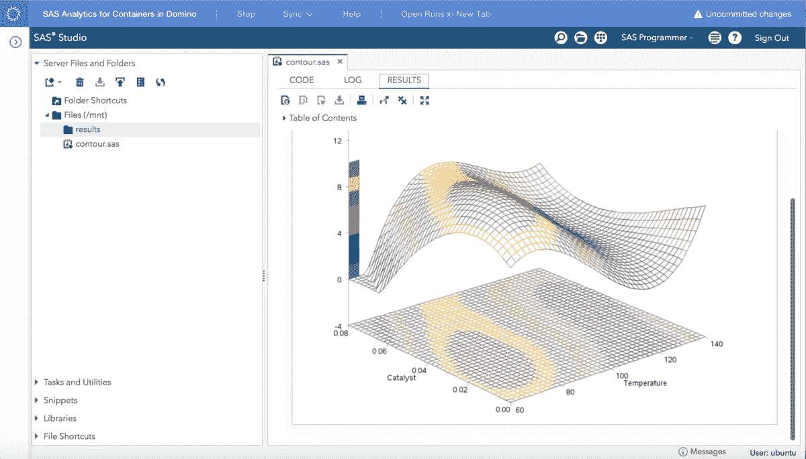

# 通过云中的容器化释放 SAS 的威力

> 原文：<https://www.dominodatalab.com/blog/unlock-the-power-of-sas-with-containerization-in-the-cloud>

[容器化](https://blog.dominodatalab.com/the-real-value-of-containers-for-data-science/)是一项关键技术，它加速了数据科学在全球众多公司中的采用和影响。实验的状态(数据、代码、结果、包版本、参数等)。)可以在一个轻量级容器中整体捕获，并部署在客户的内部基础架构和/或弹性计算基础架构(如[云](https://blog.dominodatalab.com/data-science-aws/))上。这意味着数据科学实验可以轻松快速地重现，并且数据科学团队可以建立在其他人之前的工作基础上，这最终有助于他们推动更高水平的创新。

现在，通过 Domino 上的 SAS Analytics for Containers，SAS 用户可以利用 SAS Analytics 和 SAS Viya 获得集装箱化和云的所有好处。这些预构建的 SAS 容器可以很容易地导入到 Domino 的弹性计算基础设施中，供数据科学家使用，允许他们与 R、Python 或使用 TensorFlow、H2O 等的其他实验交叉授粉。有了 SAS。在 Domino 上使用 SAS Analytics for Containers，用户可以在浏览器或 [Jupyter 笔记本](https://blog.dominodatalab.com/to-jupyter-and-beyond/)中直接使用 SAS Studio 编写 SAS 代码、开发模型和发布应用程序。用户将不再需要为 SAS 使用 R 或 [Python 包装器。相反，他们可以从本机 SAS 体验中受益，同时利用 Domino 提供的所有实验管理功能，包括](https://blog.dominodatalab.com/pandas-for-sas-users-part-1)[再现性](https://blog.dominodatalab.com/machine-learning-reproducibility-crisis/)、[协作](https://blog.dominodatalab.com/domino-honored-named-visionary-gartner-magic-quadrant/)，以及对可扩展计算的轻松访问。此外，Domino 允许 IT 在一个地方管理 sa 和开源工作负载，并帮助 IT 团队导航 sa 向云的迁移。

Domino 上的 SAS Analytics for Containers 为组织加速采用 AWS 等云平台提供了一条清晰的道路，允许组织减少其数据中心的规模，利用弹性计算处理固有的突发工作负载，并将所有分析工作负载迁移到集中式基础架构。使用 [Domino Lab](https://www.dominodatalab.com/product/) ，数据科学家只需轻轻一点，就可以使用他们首选的计算资源隔离运行 SAS 分析和机器学习工作负载，而不必等待其他工作负载完成。此外，数据科学团队可以加速并行实验，以实现更快的迭代、建模竞赛和结果。

Domino 跟踪 SAS 项目的所有版本，并捕获每个实验的状态，包括数据、代码、SAS 版本、环境、讨论、参数和结果。这些项目可以在数据科学团队之间共享，以便进行协作，并作为未来项目的基础。捕获这些工件有助于用户实现模型起源和治理，并在他们的工作流中提供可审计性。

当数据科学家准备好部署他们的 SAS 模型时，他们可以利用 [Domino Launchpad](https://www.dominodatalab.com/product/) 功能在可扩展的计算基础设施上轻松发布模型(以及模型的不同版本)。数百个模型可以同时部署和运行。

Domino 使用[容器](https://blog.dominodatalab.com/data-science-docker/)作为其模型管理平台的基础，该平台可以部署在本地或云中。此外，Domino 使用户能够使用任何选择的工具，无论是开源的还是私有的。通过在 Domino 上添加 SAS Analytics for Containers，用户可以轻松获得 SAS 数据科学工具，而不必担心文档或再现性。模型管理的所有方面都由 Domino 负责，允许用户专注于他们最擅长的事情:创建 SAS 模型和推动创新。

## 了解更多信息:

*   [查看新闻稿。](https://www.dominodatalab.com/news/domino-data-lab-partners-with-sas-to-accelerate-data-science-work-in-the-cloud/)

[Twitter](/#twitter) [Facebook](/#facebook) [Gmail](/#google_gmail) [Share](https://www.addtoany.com/share#url=https%3A%2F%2Fwww.dominodatalab.com%2Fblog%2Funlock-the-power-of-sas-with-containerization-in-the-cloud%2F&title=Unlock%20the%20Power%20of%20SAS%20with%20Containerization%20in%20the%20Cloud)