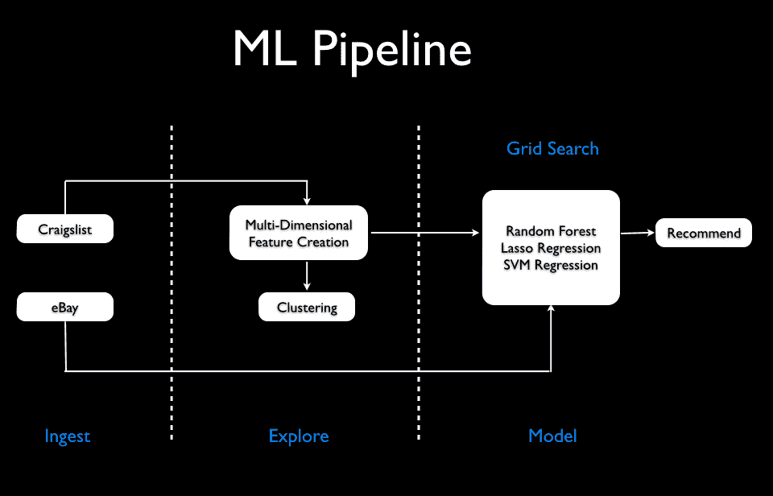
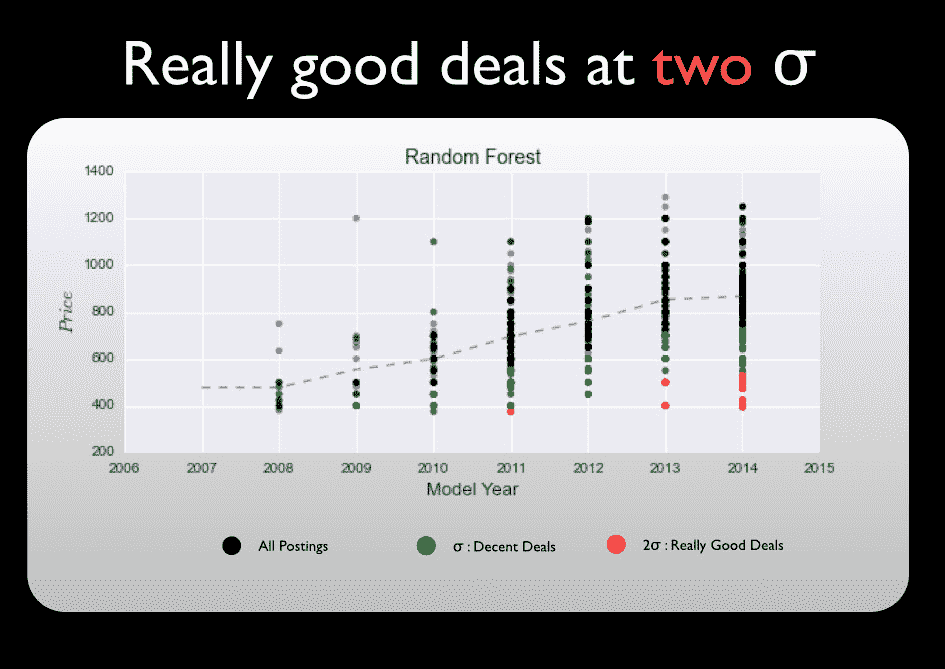
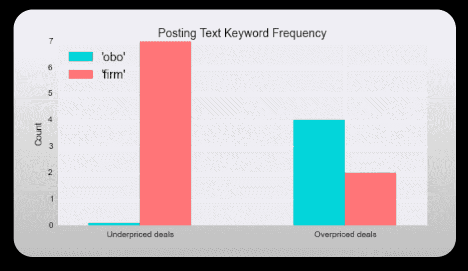

# 利用数据科学在 Macbook 上获得优惠

> 原文：<https://www.dominodatalab.com/blog/using-data-science-to-get-a-good-deal-on-a-macbook>

## 介绍

我创建了一个 Python 项目，它可以抓取纽约 Craigslist 上关于 Macbook Air 13 的帖子，并自动向你显示最划算的交易——好到可以在易贝卖掉赚钱的交易。这是针对特定产品和位置的概念验证设计，但该模型非常灵活，可以扩展到其他位置和/或产品。

该算法根据型号年份和其他特征，知道每台 Macbook 应该定价多少。定价异常低且根据其规格被低估的 Macbooks 显示在谷歌地图上，这样人们就可以预测他们愿意投入多少时间和精力。

该算法利用了 Craigslist 上定价不透明的机会。人们往往没有敏锐的眼光来确定他们的上市价格。他们甚至不知道它是否能与其他房源竞争。这创造了一个从错误定价中获利的完美环境。

## 动机

几个月前，我想买一台 Macbook Air。但我没有时间、数据或耐心去弄清楚相对于市场而言什么是好交易。我如何知道我正在看的这个帖子相对于其他东西是不是一个好的交易？是便宜货吗？

如果是便宜货，很可能已经卖出去了——所有的时间都浪费在筛选上了。我需要开发一些能让这些宝石快速浮出水面的东西。因此，我认为这是一个有趣且有用的数据科学产品。

## 高级方法

我考虑了一些如何对这个问题建模的方法:异常检测技术、分类或回归建模。经过大量探索，我发现用回归模型拟合数据是最准确的。

通过使用成本函数平均绝对误差(mae)和按负残差排序。然后验证 vs 易贝，以便只过滤有利可图的项目，这被证明是最好的方法。因此，产生了最佳市场内(Craigslist)或跨市场(易贝)的推荐列表。验证是通过使用易贝的拍卖结束价格超过 2 周(平均)。

## 挑战和障碍

### 特征工程

寻找和创建最重要的特性不是一件简单的任务。[创建合适的特征矩阵](/blog/manual-feature-engineering)是任何机器学习管道中最重要的方面之一——显然，你的模型的输出只和你的输入一样好(特征矩阵)。我可以用最多的信号使用或创建哪些功能？刮什么数据才是正确的？我应该瞄准哪个城市？我需要多少例子？...所有这些都属于数据“争论”和“欺骗”的范畴。一旦我想出了我想要的(或者说我是这么想的)，我就将数据可视化在一个散点图上(在 sci-kit learn 中)，该图显示了多个特征如何相互关联的图。这是一种很好的技术，可以在早期判断哪些特性会产生最多的信息增益(信号)。

从建模的角度来看，“价格”很明显是由“车型年”来解释的。但是一些 Craiglist 帖子没有提供车型年份。相反，人们通常会说“BNIB”或“最新款”或“密封在盒子里”或一些型号。为了了解这一点，我基本上使用了潜在主题建模器(LDA)对错误分类的帖子集的帮助。

在收集了所有这些短语之后，我构建了一个包含几乎所有内容的正则表达式字符串。一些人谈到了他们 MacBook 的规格。我该如何解决这个问题？我可以为每个型号的所有技术规格制作一个正则表达式字典(我最终做到了)，或者我可以创建一个余弦相似矩阵，其中前几个文档是每个型号的官方技术规格，并相应地对具有最高相似性得分的每个帖子进行分类。

这将使模型半无人监管(对于那些保持跟踪的人来说)。虽然这是一个有趣的方法，但我发现字典方法在实现中更有用，在将其归类为升级或基本配置时更有用。我最终尝试和使用的功能是——型号年份、AppleCare、升级或基本[cpu | ram | hd]。

### 学习方法

分类方法意味着手动标记[“好交易”或“坏交易”]——这可不好玩。但是，我们可以把它简化为一个“分类”问题，而不是思考这个问题，“我们如何识别一个定价过低的商品？”也就是说，我们如何找到超出正常范围的数据点？异常检测技术会有所帮助，特别是 DBSCAN。我面临的一个问题是价格的方向(过高或过低都会被检测到)及其准确性并不是很好。最终，我发现回归建模是最好的，也是最容易实现的。

## 寻找模型

网格搜索理想模型和最佳参数。我们考虑的三个是:支持向量回归机(类似于 SVM)，套索回归和随机森林回归机。

## 拟合模型

推荐的“好交易”列表是通过首先将回归模型拟合到一组特征并按最大负残差排序(最大正残差给出了所有定价过高的交易)而产生的。

## 关于 NLP 和附加 EDA 的更多信息

首先使用一个帖子的文本(标题和正文)作为语料库中的一个文档，并由此构建一个 TF-IDF 矩阵(使用二元模型)。借助于潜在主题提取方法，非负矩阵分形，我发现了一些隐藏的洞察力的宝石。

搜索关键词*公司*，避开 *OBO* 和*或最佳报价*。似乎违反直觉，对吗？Craigslist 上的帖子几乎从来不会被支付“要价”,大多数情况下还会有谈判。那么，为什么你会去搜索那些清楚地表明卖家可谈判性的东西呢？事实证明，使用“公司”这个关键词的人往往已经给了你最低价，不需要讨价还价。“OBO”和“或最佳报价”是定价过高的交易中常见的口号。

* *数据基于美国各大城市 470 个帖子中排名前/后 20 位的随机样本*

我还发现，大多数倾向于低价出售的人都是因为它是一件礼物。所以，当你今年圣诞节购物时，请记住这一点。

谢谢大家@ Zipfian