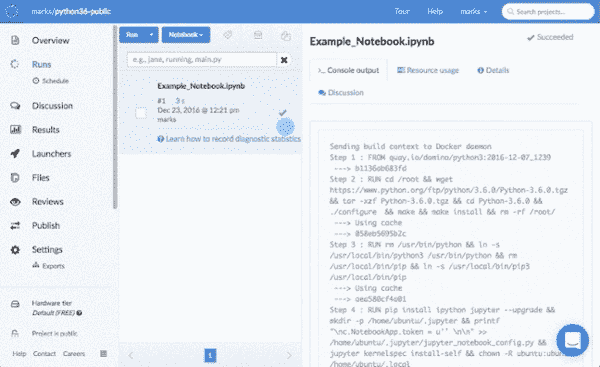

# Python 3.6 与 Domino 在几分钟内完成

> 原文：<https://www.dominodatalab.com/blog/using-new-python-3-6-domino>

对于像我这样的 Python 爱好者来说，随着今天 [Python 3.6](https://docs.python.org/3.6/whatsnew/3.6.html) 的发布，假期开始得有点早。

如果你还不知道，Python 3.6 有很多改进:

*   速度和内存使用优化，包括 CPython 层的低级改进。
*   新的语法特性包括一种叫做“f-strings”的新的字符串文字，函数参数的标准注释，异步生成器和理解。
*   从 asyncio 到 datetime 的标准库改进。
*   安全性改进，如新的 secrets 模块和对 OpenSSL 1.10 的支持。

多亏了 Domino，我能够在几秒钟内将 Python 3.6 安装到 Domino 计算环境中，而不会弄乱我的稳定环境或本地开发设置。

我要做的就是:

1.  用这个 docker 文件创建一个 [Domino 计算环境](https://docs.dominodatalab.com/en/latest/reference/projects/Projects_overview.html)。
2.  将我项目设置为使用计算环境。
3.  告诉多米诺给我开一个 [Jupyter 笔记本会议](https://docs.dominodatalab.com/en/latest/get_started/3-start_workspace.html)。

现在我有了自己的 Python 3.6 / Jupyter 4.3 平台，在 Domino 的再现性引擎中工作。这里有一张 gif 向你展示了上面的步骤:

想自己试试吗？我已经在 Domino 上发布了一个公共的 forkable 项目，所以您可以点击“Fork ”,开始尝试 Python 3.6，而无需安装任何软件

如果您想了解更多有关如何快速迭代您的数据科学环境和工具而无需征得 IT 部门同意的信息，您可以在此处申请[演示](https://www.dominodatalab.com/demo?utm_source=blog&utm_campaign=&utm_medium=post&utm_content=)。

标题为“[光之季节](https://www.flickr.com/photos/ncindc/2948478259/)”的横幅图片，作者为 oh_hellogina。根据 [CC BY-ND 2.0](https://creativecommons.org/licenses/by-nd/2.0/) 授权。