# 如何使用 R，H2O 和多米诺骨牌进行纸牌游戏比赛

> 原文：<https://www.dominodatalab.com/blog/using-r-h2o-and-domino-for-a-kaggle-competition>

*这是一篇由[周若辉](https://www.jofaichow.co.uk/)发表的客座博文*

如果您赶时间，请直接跳到:

*   教程 1: [使用 Domino](#tutorial1)
*   教程 2: [利用 H2O 预测土壤性质](#tutorial2)
*   教程 3: [扩大您的分析](#tutorial3)

## 介绍

这篇博文是《H2O 深度学习简介》的续篇。如果说之前的博客文章是一个简短的介绍，那么这篇文章就是一个基于最近的 [Kaggle 竞赛](https://www.kaggle.com/c/afsis-soil-properties)的适当的机器学习案例研究:我正在利用 [R](https://www.r-project.org/) 、 [H2O](https://h2o.ai/) 和[多米诺](https://www.dominodatalab.com?utm_source=blog&utm_medium=post&utm_campaign=using-r-h2o-and-domino-for-a-kaggle-competition)在现实世界的数据挖掘竞赛中竞争(并且做得相当好)。

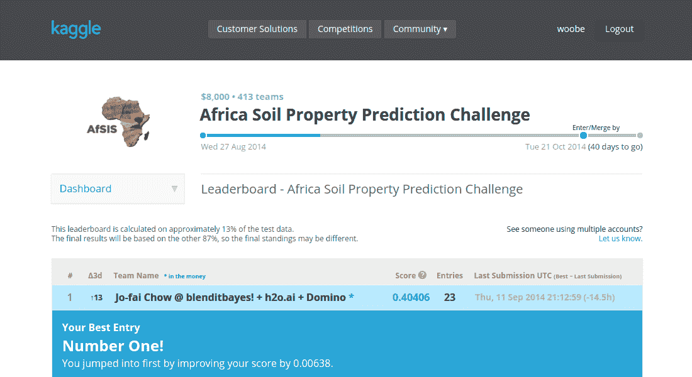

### 从那以后竞争变得更加激烈，但我仍然非常自豪地说，我保持了几天的领先地位！

请注意，公开分数仅基于一小部分测试数据(13%)。我在最终排行榜上的位置可能会发生巨大变化。在我看来，爬上公共排行榜只是第一步，确保模型足够一般化以保持不变才是真正的挑战。无论如何，这是未来博客文章的主题。

### 使用 Domino 加速您的数据分析

我认为公平地说，卡格尔竞赛非常具有挑战性。当你把时间限制考虑进去的时候就更是如此了。Domino 的[数据科学工具](https://www.dominodatalab.com?utm_source=blog&utm_medium=post&utm_campaign=using-r-h2o-and-domino-for-a-kaggle-competition)让我可以轻松地扩大我的分析，利用并行代码，并在很短的时间内进行许多测试。在数据挖掘竞赛中竞争就是要比对手更好地理解问题，更快地确定最佳策略。能够同时对数据提出许多问题是至关重要的。

结果，Domino 将几天甚至几周的分析时间缩短到了几个小时。我可以快速评估许多不同的机器学习策略，用于 Kaggle 竞赛。最重要的是，我不必在基础设施设置和硬件维护上浪费任何时间，因此我可以专注于更好地理解机器学习问题，并随着时间的推移稳步提高模型性能。

### 和 H2O 一起深入

说我对 [H2O 深度学习模块](https://github.com/0xdata/h2o/tree/master/docs/deeplearning/)的预测性能印象深刻是一种保守的说法。所有数据极客都知道“没有免费的午餐”定理。然而，尽管困难重重，根据我过去的经验，我还是设法利用`h2o.deeplearning`算法和一些简单的模型平均策略爬上了梯子。

性能并不是唯一的东西，H2O 高效的内存管理和并行算法同样令人惊叹。当我意识到我可以同时使用 R、H2O 和 Domino 时，情况变得更好了。在那一刻，我知道我找到了一个非常有前途的机器学习解决方案，因此也是这篇博客的动机。

这篇文章不仅仅是关于 Kaggle 竞赛，**更是关于寻找一个实用的和可扩展的数据分析解决方案**。一个通用且健壮的解决方案，我可以依赖它并将其应用于我生活中的许多机器学习问题(比如[这个](https://github.com/woobe/wc2014))。在过去的几周里，我对 R + H2O +多米诺组合的体验非常有希望。所以我想利用这个机会分享我的经验。我希望这篇文章鼓励更多的数据爱好者尝试一下 R、H2O 和多米诺。

单独使用 H2O 是一个巨大的话题。为了简单起见，我将带您浏览这里的起始代码。我向你保证，大赛之后会有更深入的关于各种机器学习算法和策略的讨论。我也希望这些博客帖子最终能够演变成合适的教程(作为我对数据科学社区的一点点贡献)。

### 边做边学

我始终相信边做边学是最好的学习方法。所以我准备了两个简短的教程来帮助你开始使用 Domino 和 H2O。希望通过阅读教程，您能够很快掌握基础知识，并尝试使用 H2O 和 Domino 进行自己的数据分析。而且，如果你按照所有的步骤去做，你会得到一个 CSV 文件，为 Kaggle 比赛做好准备。最后，当你准备好升级你的游戏时，看看**的第三篇教程**，它讲述了如何通过几个简单的步骤来升级你的分析。

### 等待...H2O 多米诺卡格尔。他们是谁？

以防你还没听说过他们...

*   [H2O](https://h2o.ai/) 是由 [0xdata](https://0xdata.com/) 开发的用于大数据科学的开源数学和内存预测引擎。
*   Domino 是面向分析师和数据科学家的企业级平台，处理运行、扩展、共享和部署分析模型所需的所有“管道”。
*   [Kaggle](https://www.kaggle.com/) 是一个预测建模和分析竞赛及咨询的平台。

### 准备好了吗？

好了，介绍到这里就足够了。 ***让我们深入了解一下吧！！！***

* * *

Tutorial One: Using Domino

在第一篇教程中，我将只关注通过 web UI 和 R 接口的基本 Domino 操作。虽然 R 脚本都是关于 H2O 机器学习的，但同时学习两个新东西是很难的。所以我将保持简单，把 H2O 的讨论留给下一个教程。

### 步骤 1.1 -启动并运行

如果您还没有这样做，[注册一个免费的 Domino 帐户](https://www.dominodatalab.com?utm_source=blog&utm_medium=post&utm_campaign=using-r-h2o-and-domino-for-a-kaggle-competition)，然后下载并安装客户端。(报名后跟着简易指南走。)

### 步骤 1.2 -安装 R 接口

Domino 在 CRAN 上有自己的 [R 包](https://cran.r-project.org/web/packages/domino/index.html)。安装完这个包之后，您可以登录您的 Domino 帐户，直接从 r 管理您的项目。我个人认为这是使用 R 作为接口的又一个极好的例子。

```py
install.packages("domino")

library(domino)

domino.login("your_username", "your_password")
```

### 步骤 1.3 -下载数据和代码

本教程基于 [Kaggle 非洲土壤特性预测挑战赛](https://www.kaggle.com/c/afsis-soil-properties)。为了进行数据分析，您需要先从 ka ggle[下载原始数据集](https://www.kaggle.com/c/afsis-soil-properties/data)。然后您可以使用我的示例 R 脚本 [`Kaggle_AfSIS_with_H2O.R`](https://github.com/woobe/blenditbayes/tree/master/2014-09-r-h2o-domino) 运行一个简单的分析。

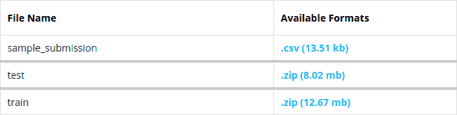

#### ###步骤 1.4 -上传数据和代码

您需要将文件上传到 Domino 上特定的项目文件夹中。为了简单起见，我将在这里使用`quick-start`文件夹，因为在阅读完 Domino 的[入门指南](https://support.dominodatalab.com/hc/en-us/articles/204186939-Getting-Started)之后，你们大多数人应该在本地驱动器的某个地方有这个文件夹。

在您的机器上，将 Kaggle 数据集和 R 脚本复制到`quick-start`文件夹。文件结构应该如下所示:

| **在**之前 |   | 之后 |
| 

*   Results/
*   主要的。m
*   主要的。巴拉圭
*   主要的。r

 |   | 

*   **data/train.zip** (Note: create a new' data' folder)
*   **数据/测试。zip**
*   **数据/样本 _ 提交。CSV**
*   结果/
*   与 H2O 合作.r
*   主要的。m
*   主要的。巴拉圭

 |

之后，您可以将文件上传到 Domino 上的`quick-start`文件夹中。

```py
## Set Working Directory to the 'quick-start' folder

setwd("quick_start_dir_on_your_local_drive")

## Upload new files to the 'quick-start' folder on Domino cloud

domino.upload()
```

### 步骤 1.5 -检查文件

在运行分析之前，检查并确保文件在云上。登录您的 Domino 帐户，浏览您的`quick-start`项目中的文件。

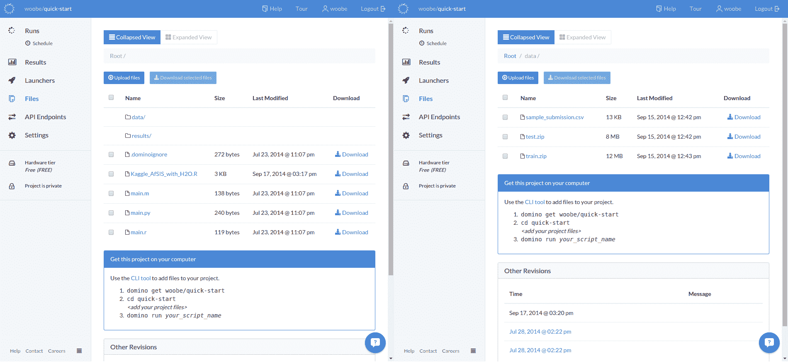

#### ###步骤 1.6 -运行您的代码

所有的文件都在吗？太好了，您现在可以在云上运行分析了！

使用 web UI 开始跑步(`Runs`->-`Run`->-`Enter of the File Name`->-`Start Run`)。

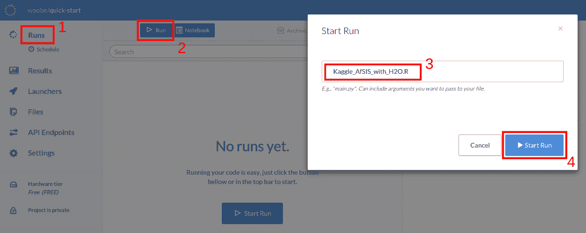

或者，您可以直接从 r。

```py
domino.run("Kaggle_AfSIS_with_H2O.R")
```

### 步骤 1.7 -监控进度

Domino 的 web UI 允许您在线监控您的跑步。您可以在左侧面板上访问所有文件和项目设置。当您单击您的任何运行时，它将在右侧显示本机控制台(在本例中为 R ),下面有一个摘要，显示 CPU 负载、内存使用情况和关于该运行的其他信息。

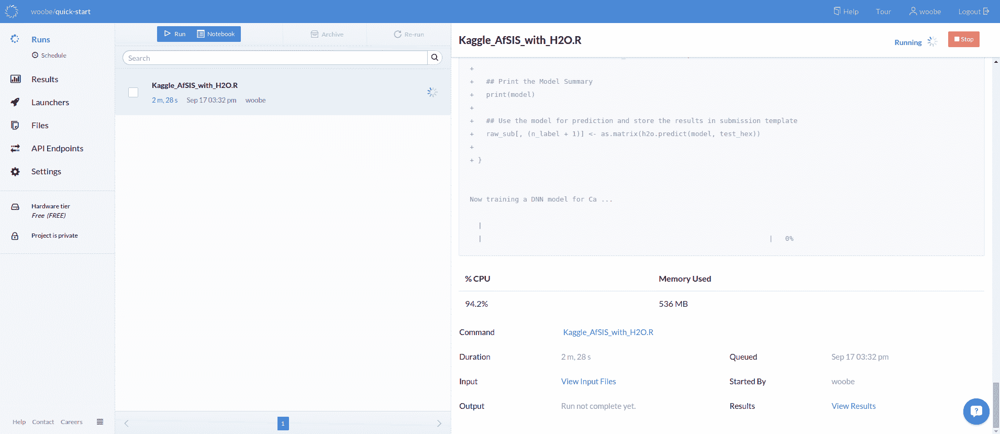

#### ###步骤 1.8 -下载结果

分析大约需要半个小时。之后，你可以从网上下载结果...

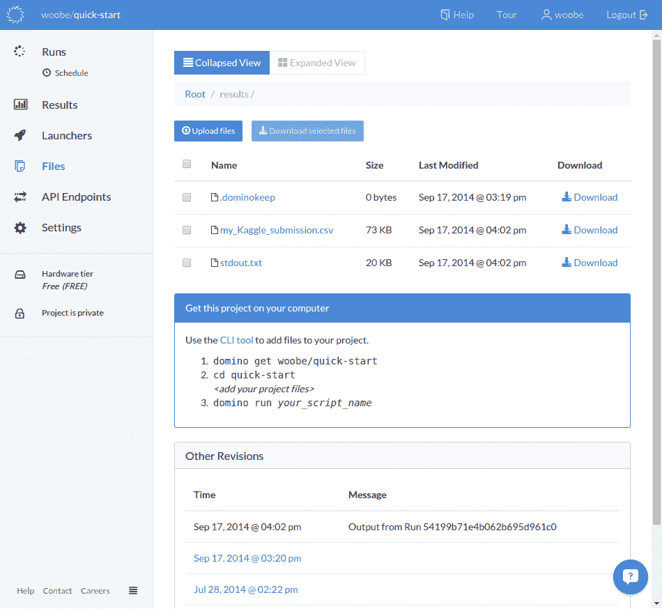

或者通过 r。

```py
## Download the results to your local drive

domino.download()
```

默认情况下，一旦运行完成，您将收到一封电子邮件通知。有兴趣的话还有更多[定制通知](https://support.dominodatalab.com/hc/en-us/articles/204139619-Notifications)的方法。

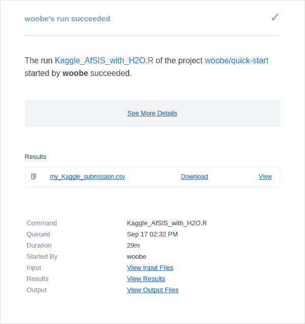

#### ###步骤 1.9 -提交给 Kaggle(可选)

您现在可以进入[提交页面](https://www.kaggle.com/c/afsis-soil-properties/submissions/attach)并上传 CSV 文件。祝你好运:)

### 尝试您自己的代码

我已经向您展示了在 Domino 云上启动和运行 Kaggle 启动代码的基本步骤。现在是时候尝试你自己的代码了。记得 Domino 还支持 **Python** 、[T3、Matlab](/why-choose-matlab-for-data-science-and-machine-learning)和 **Julia** ！

### 共享您的项目

与他人共享您的 Domino 项目非常容易。您可以在项目设置中启用对项目文件夹的公共访问，这样每个人都可以查看您的文件和运行。

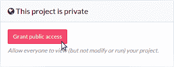

### Version Control

顺便说一下:Domino 上的版本控制是一个经过深思熟虑的过程，是专门为数据科学家设计的。Domino 为您的数据、代码和结果创建快照，而不是一次对一个文件进行版本控制。这意味着可以很容易地回到过去，使用精确的数据和代码来引用特定的运行。

* * *

## 教程二:使用 H2O 预测土壤属性

在这一节中，我将解释我如何使用 R 和 H2O 为 Kaggle 竞赛训练预测模型。简而言之，我们必须基于 1158 行训练数据开发回归模型，然后使用这些模型来预测 728 个测试记录中每一个的五种土壤属性 Ca、P、pH、SOC 和沙子。如需了解更多信息，请前往 Kaggle 上的[描述页面](https://www.kaggle.com/c/afsis-soil-properties)。

### 步骤 2.1 -为 H2O 安装 R 接口

同样，R 充当接口。有了 R 作为公共接口，H2O 和 Domino 可以无缝集成。

像 Domino 一样，H2O 也有一个优秀的 R 包。首先，您可以安装 H2O 的 CRAN 版本:

```py
install.packages("h2o")
```

如果你想利用 H2O 的新功能，你可以安装最新版本。

```py
## Specify H2O version here

h2o_ver <- "1511"

## Install H2O
local({r <- getOption("repos"); r["CRAN"] <- "https://cran.us.r-
project.org"; options(repos = r)})
txt_repo <- (c(paste0(paste0("https://s3.amazonaws.com/h2o-
release/h2o/master/", h2o_ver),"/R"), getOption("repos")))
install.packages("h2o", repos = txt_repo, quiet = TRUE)
```

为了找出最新的 H2O 版本号，进入[这一页](https://s3.amazonaws.com/h2o-release/h2o/master/1511/index.html)，寻找最后四位数字，如下图截图所示。

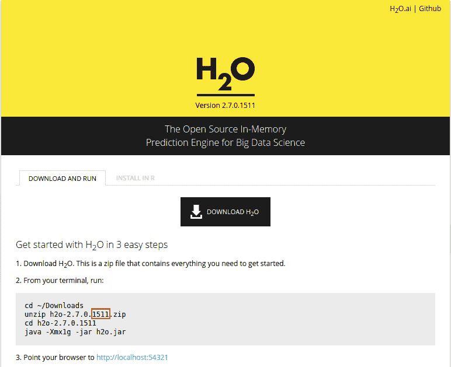

(可选)最近我经常使用 H2O，所以我写了一个包装器函数，让我的生活更轻松。通过两行代码，您可以将 H2O 安装或升级到最新的版本:

```py
## Use the wrapper function in my package 'deepr'

devtools::install_github("woobe/deepr")

deepr::install_h2o()
```

### 步骤 2.2 -启动并连接到本地 H2O 集群

使用函数`h2o.init(...)`中的参数`max_mem_size`，我们可以手动限制物理内存的使用。在本教程中，我们将内存限制设置为 1GB，因为这是 Domino 空闲层的最大允许值。

```py
library(h2o)

localH2O <- h2o.init(max_mem_size = '1g')
```

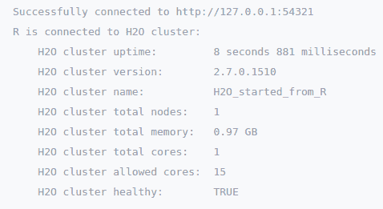

#### ###步骤 2.3 -导入数据

导入数据是我最喜欢 H2O 的地方之一！！！您可以将压缩文件(`.zip`、`.gz`)直接加载到 H2O 集群中。这对于本教程中的小 Kaggle 数据集来说可能不是很重要，但对于较大的数据集来说肯定是有用的。

```py
## Import Data to H2O Cluster

train_hex <- h2o.importFile(localH2O, "./data/train.zip")

test_hex <- h2o.importFile(localH2O, "./data/test.zip")
```

### 步骤 2.4 -训练深度神经网络模型并进行预测

事不宜迟，下面是为每个目标变量训练一个深度神经网络模型的起始代码，然后使用这些模型进行预测。在`h2o.deeplearning(...)`函数中有相当多的变量需要调整。为了简单起见，我只提供了让您入门的基本代码。要了解更多信息，我强烈建议浏览一下[插图和演示代码](https://github.com/0xdata/h2o/tree/master/docs/deeplearning/)。

```py
## Split the dataset into 80:20 for training and validation

train_hex_split &amp;lt;- h2o.splitFrame(train_hex, ratios = 0.8, shuffle = TRUE)

```

```py
## Split the dataset into 80:20 for training and validation
train_hex_split <- h2o.splitFrame(train_hex, ratios = 0.8, shuffle = TRUE)

## One Variable at at Time
ls_label <- c("Ca", "P", "pH", "SOC", "Sand")

for (n_label in 1:5) {

## Display
cat("nnNow training a DNN model for", ls_label[n_label], "...n")

## Train a 50-node, three-hidden-layer Deep Neural Networks for 100 epochs
model <- h2o.deeplearning(x = 2:3595,
y = (3595 + n_label),
data = train_hex_split[[1]],
validation = train_hex_split[[2]],
activation = "Rectifier",
hidden = c(50, 50, 50),
epochs = 100,
classification = FALSE,
balance_classes = FALSE)

## Print the Model Summary
print(model)

## Use the model for prediction and store the results in submission template
raw_sub[, (n_label + 1)] <- as.matrix(h2o.predict(model, test_hex))

## One Variable at at Time

ls_label <- c("Ca", "P", "pH", "SOC", "Sand")

for (n_label in 1:5) {

## Display

cat("nnNow training a DNN model for", ls_label[n_label], "...n")

## Train a 50-node, three-hidden-layer Deep Neural Networks for 100 epochs

model <- h2o.deeplearning(x = 2:3595,

y = (3595 + n_label),

data = train_hex_split[[1]],

validation = train_hex_split[[2]],

activation = "Rectifier",

hidden = c(50, 50, 50),

epochs = 100,

classification = FALSE,

balance_classes = FALSE)

## Print the Model Summary

print(model)

## Use the model for prediction and store the results in submission template

raw_sub[, (n_label + 1)] <- as.matrix(h2o.predict(model, test_hex))

}
```

### 步骤 2.5 -将结果保存为 CSV 格式

最后一步是将所有预测保存为 CSV 文件。这是正确 Kaggle 提交格式的 CSV 文件。

```py
write.csv(raw_sub, file = "./results/my_Kaggle_submission.csv", row.names = FALSE)
```

### 尝试其他数据集

就是这样！你刚刚训练了一些深度神经网络模型，并用于预测！为什么不在其他数据集上尝试同样的事情呢？例如，我在之前的 TTTAR 博客文章中使用的[乳腺癌和 MNIST 数据集。](https://bit.ly/bib_TTTAR1)

### 尝试其他 H2O 机器学习算法

`h2o.deeplearning`算法只是 H2O 可用的算法之一。还可以试试`h2o.gbm`、`h2o.glm`、`h2o.naiveBayes`、`h2o.randomForest`等等。所有这些函数都可以像上面的代码示例一样直接从 R 中调用。它们有相似的语法，所以应该非常简单。

* * *

## 教程三:扩大你的分析！

我在 Domino cloud 上为 Kaggle 做了一个简单的 H2O 机器学习练习。希望入门代码和教程能帮助你更好的理解 R + H2O +多米诺机制。然而，模型的简单性意味着你将无法在 Kaggle 排行榜上获得非常好的分数。

当您准备加速工作(例如构建更复杂的模型)或分析更大的数据集时，只需几个步骤就可以轻松地在 Domino 上扩展您的数据分析。准备好了吗？请继续阅读！

### 选择更高的硬件层

您可以在项目设置中找到硬件层下拉列表。您需要做的只是选择一个适合您需求的层。多米诺会帮你解决剩下的问题。

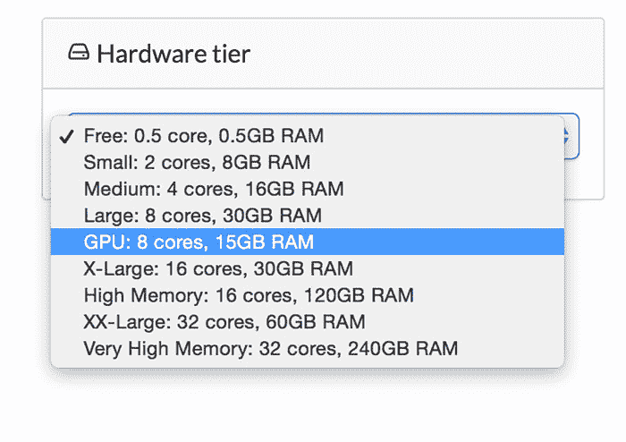

### 修改您的代码

如果您使用 R + H2O + Domino 组合，您可以通过增加物理内存余量来轻松提高 H2O 的性能。H2O 将自动并行化机器学习算法，并利用所有 CPU 内核。对于一般代码并行化，请阅读这篇关于[简单并行循环](https://blog.dominodatalab.com/simple-parallelization/)的 Domino 博客文章。

```py
## Increase the H2O Cluster Memory Allowance (e.g. 25GB)

localH2O <- h2o.init(max_mem_size = '25g')
```

### 使用多个实例

为了进一步提高生产率，您可以同时开始多次运行。同样，不需要复杂的设置。像往常一样开始跑步。多米诺会处理剩下的。在下面的截图中，你可以看到我将同时运行多个实验，每个实验可能需要几个小时，并使用 30GB 的内存和 30 个 CPU 核心。

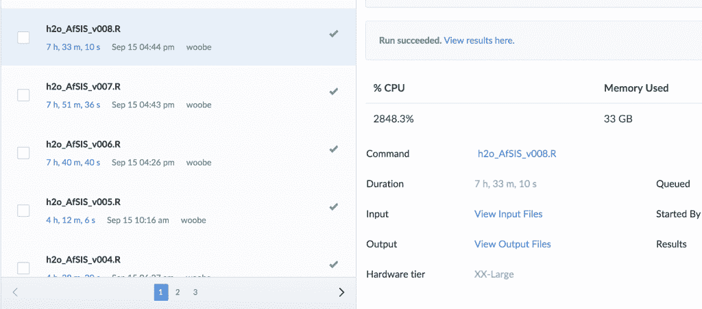

* * *

## 结论

如果我必须总结这个经验，我会说，这个 R + H2O +多米诺组合的发现是非常令人兴奋和有前途的！我可以自信地说，我有一个实用且可扩展的解决方案，不仅可以处理 Kaggle，还可以处理许多其他机器学习问题。我也知道这个解决方案可以变得更好！我将继续探索和试验其他工具。

* * *

## 所有链接

这是一篇相当长的帖子，所以让我在这里总结一下所有有用的资源:

### 多米诺骨牌

*   [报名](https://www.dominodatalab.com/?utm_source=blog&utm_medium=post&utm_campaign=using-r-h2o-and-domino-for-a-kaggle-competition)
*   [文档&常见问题解答](https://support.dominodatalab.com/hc/en-us)
*   [快速启动](https://support.dominodatalab.com/hc/en-us/articles/204186939-Getting-Started)
*   [博客](https://blog.dominodatalab.com/)
*   Nick 关于使用 HTTP API 将 R 与生产系统集成的帖子
*   [简易并行循环](https://blog.dominodatalab.com/simple-parallelization/)

### H2O

*   [文档](https://docs.0xdata.com/)
*   [Oxdata 演示文稿](https://www.slideshare.net/0xdata)
*   [通过示例进行深度学习截屏](https://www.youtube.com/watch?v=fdbQreQacIQ&feature=youtu.be)
*   谷歌上的 h2ostream 论坛
*   [H2O 深度学习简介和演示代码](https://github.com/0xdata/h2o/tree/master/docs/deeplearning/)

* * *

## 是人，而不仅仅是工具！

我告诉过你这些工具有多棒。但我还没提到幕后的牛逼人物。

首先，我要感谢 Nick Elprin 从 Domino 早期开始给予我的巨大支持。尼克不仅在过去的几周里给了我无限的云资源来试验这种 R + H2O + Domino 组合(这一切都是从一封简短的电子邮件*开始的，“嗨，尼克，我能在 Domino 上使用 H2O 吗？”*)，他还不断帮助我解决许多技术问题，并将我的要求转化为新功能。

然后，当然是 H2O 引擎背后的 [Oxdata 团队](https://0xdata.com/about/) ( [斯里安巴蒂](https://twitter.com/srisatish)、[阿诺坎德尔](https://twitter.com/ArnoCandel)、维拉伊帕马尔、克里夫克、凯文诺莫伊尔、[雷蒙德佩克](https://twitter.com/raymondpeck3)、斯潘塞艾洛和许多其他人)。自从我开始一步步了解 H2O 的早期，他们就一直通过电子邮件给我发关于 H2O 的建议和信息，并鼓励我拓展视野。特别是[阿诺·坎德尔](https://twitter.com/ArnoCandel)在微调`h2o.deeplearning`和其他功能上给了我一些非常具体的建议。

我希望这篇文章对你有用。如果你决定尝试一下 R + H2O +多米诺组合，但对设置有疑问，请随时给我以及 Domino 和 Oxdata 团队发[电子邮件](mailto:jofai.chow@gmail.com) / [推特](https://twitter.com/matlabulous)。我知道您的问题和反馈将有助于他们开发出更好的数据科学产品。不幸的是，我需要遵守 Kaggle 比赛规则，我不能告诉你我到底做了什么才能爬上排行榜。然而，你可以从我的博客名“[中猜出它，就像贝叶斯理论一样！](https://bit.ly/blenditbayes)”。

恐怕我不能在一篇文章中涵盖所有内容，但是在接下来的几个月里，我会继续写关于 Domino 和 H2O 的其他功能的博客。