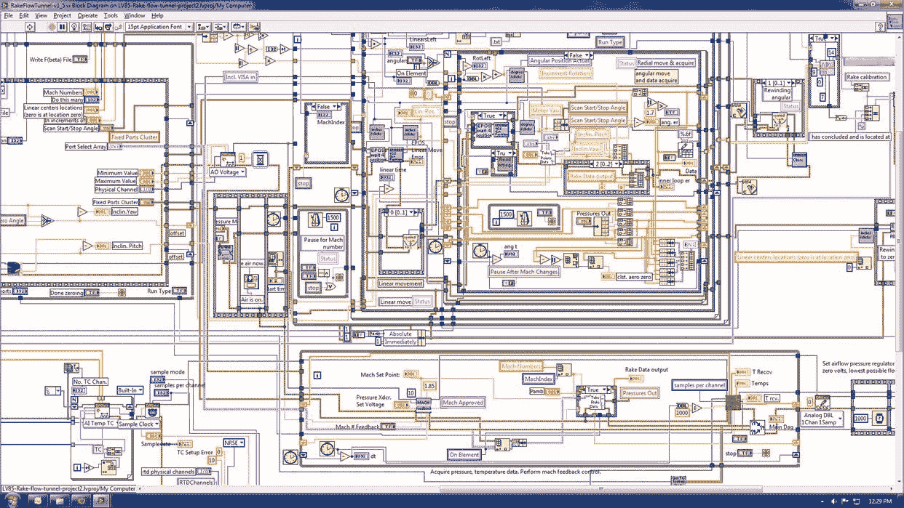
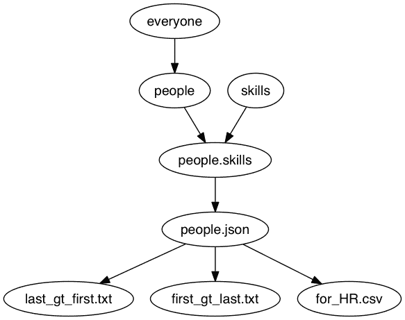

# 可视化逻辑创作与代码

> 原文：<https://www.dominodatalab.com/blog/visual-tools-vs-code>

在他们职业生涯的某个时刻，几乎每个数据科学家都编写过代码来执行一系列步骤，并认为，“如果我能可视化地构建这些转换，而不是通过编写代码，那就太好了。”

这就是“可视化创作”工具的目标，它旨在使不太懂技术的人能够开发分析。这篇文章描述了可视化创作工具的一些缺陷，并认为虽然它们提供了一个诱人的愿景，但它们最终在企业环境中的真实工作流环境中是不够的。作为一种替代方法，我们已经看到组织通过使用开源编程语言，投资于技术含量较低的用户的培训，以及使用良好的协作和知识管理工具来使现有工作更容易获得，从而实现了更持续的分析工作加速。

## 视觉工具的缺点

### 1.差异、协作和知识管理

我们经常认为理所当然文本的一个属性是区分的容易程度。在任何变更管理很重要的环境中，能够比较不同版本的工作是至关重要的。相比之下，如果您的逻辑的规范表示是一个图表，那么就很难判断发生了什么变化。对于不同的视觉逻辑有两种常见的“解决方案”。

*   有些应用会给你一个图形比较，基本上就是给你看两张图。这很少有用，因为很难区分“布局”的变化和实际逻辑或行为的变化。
*   其他应用程序将允许您区分逻辑的底层表示(例如，XML)。这提供了一个基于文本的视图，但它通常是嘈杂的，充满了关于视觉布局的文本，而不是你的逻辑，所以它通常是不可理解的。

除了区分之外，许多现实世界的工作流是琐碎的基于文本的文件，但是很难使用可视化工具。例如，如果两个人分别处理同一个文档，并且他们的工作需要合并，那么如何使用可视化文档来实现呢？它也很容易插入评论，搜索文本，等等。

### 2.供应商/IDE 锁定

可视化创作工具有自己专有的 ide，这意味着如果您想继续维护或改进您的分析，您将被限制使用它们。用代码工作？它只是由文本文件组成，所以你可以选择如何维护和编辑它们。

### 3.文档和“可谷歌性”

比方说，您正在试图弄清楚如何让您的分析做一些特定的操作或数据转换。大多数编程语言都有活跃的在线社区来帮助你实现这一点。在线搜索和重用代码很容易，因为互联网是建立在文本之上的。在谷歌上简单搜索一下大多数挑战，你会看到一个 StackOverflow 页面，里面有你的答案。

这对可视化工具来说是一个更大的挑战，因为它们的创作环境更加专有(因此在网上不太受欢迎)。假设你甚至可以找到你的问题的答案，实际使用它将是它自己的挑战——不像复制和粘贴代码的文本片段。

### 4.可扩展性和对开放生态系统的访问

因为大多数可视化创作工具都是专有的(上面的第二点)，你经常被限制在使用他们已经建立的“可视化部件”或者“配方”。这使得利用可从代码访问的开源包和库的不断发展变得更加困难。

### 5.模块化、重用、重构

代码允许你创建函数、模块、包等。，您可以再次使用它来加速未来的开发，从而避免重新发明轮子。更好的是，真正的编程语言拥有强大的开发工具，允许您轻松地重构工作(例如，安全地重命名)，搜索代码库，并导入您想要快速利用的现有工作。

一些可视化工具允许您打包和重用可视化组件，但并不是所有的工具都这样做。当考虑一个可视化创作工具时，重要的是要确定随着作品库的增长，可视化文档是否仍可管理。

### 6.电力用户的环境效率

最后，值得注意的是，虽然可视化工具对于不太懂技术的用户来说更容易使用，但这通常是以更复杂的高级用户为代价的。超级用户通常定制他们的工作区和 ide，以最大化环境效率。键盘快捷键、调试器、语法突出显示和自动完成是允许它们在基于文本的环境中快速工作的特性的例子。为了留住顶尖人才并最大限度地提高他们的产出，授权给技术先进的研究人员而不是迎合技术水平较低的研究人员可能是明智的。

## 例外情况

一些可视化工具已经在市场上取得了如此强大的地位，以至于它们已经克服了其中的一些限制。例如，Informatica 或 Ab Initio 是在企业中广泛使用的大量成熟产品。然而，大多数视觉逻辑创作的新尝试并没有达到相同的采用水平和产品成熟度。

## 二级编码

为了解决上面的一些缺点——特别是缺乏可扩展性和对开源包和库的访问——许多可视化创作工具提供了在可视化流程或管道中使用代码位的方法。最常见的是，这采用了一种新型可视“小部件”的形式，它允许您编写任意代码，然后使用它来转换输入。

不幸的是，这种方法只不过是权宜之计。它允许您使用一些代码片段，但是它从来没有解决上述可视化创作环境的基本限制。通常，代码“编辑器”被嫁接到主可视编辑器上，并且缺少良好创作体验所必需的功能(例如，自动完成、调试、键盘快捷键)。

更一般地说，这种方法适用于简短的片段，但是不能适应任何实质性的逻辑，也不能解决专有工具的核心限制，该工具缺乏在工作产品上进行比较和协作的健壮方法。

## 那些不会写代码的用户怎么办？

可视化创作工具的主要论点是，它们更容易被不太懂技术的分析人员使用，这些人不会处理代码。然而，根据我们的经验，大多数分析师能够比人们预期的更容易地获得代码。当你从零开始，盯着一个空白的文档不知道该做什么时，代码可能会令人生畏。然而，在实践中，大多数工作涉及修改已经存在的东西，或者从现有工作中借鉴模式。根据我们与不同行业的各种分析师合作的经验，我们已经看到许多“没有编码”的用户，但是经过一点培训，他们能够打开一个现有的脚本，进行一些修改，并从中借用模式来用于他们自己的新项目。

## 视觉文档

可视化工具的主要论点是，它们使非技术用户更容易进行分析。第二个论点是它们为分析中的步骤提供了很好的文档。然而，代码也可以提供文档的这种好处。我们已经看到一些公司成功地使用代码作为逻辑的基本表达，并在此基础上生成可视化来辅助文档，而不是将“代码编辑器”移植到主要的可视化工具中。这颠倒了可视化创作工具的模型:代码第一；视觉表现如下。

## 一个例子:德雷克

作为这种方法的一个例子，考虑德雷克。Drake 允许您将数据转换和操作步骤表示为脚本——它甚至允许您在部分转换中使用 R、Python 或其他语言——但它也可以从该脚本生成管道的图形视图。

例如，您可以有一个 Drake 脚本，它使用 Python、Ruby 和 Clojure 在管道中执行不同的转换。因为它完全基于文本，所以很容易区分和管理。此外，Drake 还允许您生成管道的可视化表示。我们用一个示例管道(最初来自 Drake Github repo)制作了一个 Domino 项目，它转换几个输入数据集来创建几个输出数据集。运行该脚本将执行所有转换以生成派生的输出，以及其步骤的可视化:

最重要的是，因为 Drake 只是作为一个脚本运行，所以您也可以在 Domino 上运行 Drake 管道，这样您就可以对您的脚本、中间数据集和最终派生数据集进行版本控制！

## 结论性意见

分析组织不断地试图提高他们的能力和交付项目工作的速度。根据我们的经验，投资一个可视化逻辑创作工具来实现这个目标是短视的，其目的是让不太懂技术的用户来开发分析。相反，当公司投资于基于文本的逻辑表达工具时，我们看到他们取得了巨大的成功。通过对技术含量较低的分析师进行少量的培训，以及强大的知识管理和协作工具(以便人们可以发现、重用和构建现有的模式和工作)，您可以更快地行动，避免在需要在企业环境中进行协作时将自己逼入一个专有工具的死角。