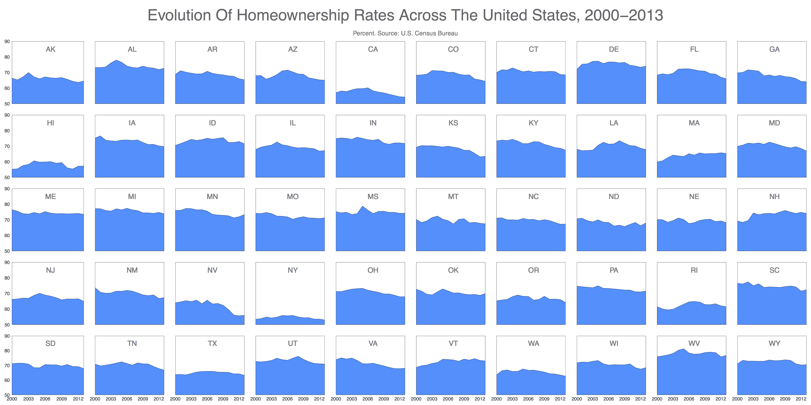

# 用小倍数和 R 可视化房屋所有权

> 原文：<https://www.dominodatalab.com/blog/visualizing-homeownership-in-the-us-using-small-multiples-and-r>

“小多次波”可视化技术是由当前数据可视化大师之一的[爱德华·塔夫特](http://en.wikipedia.org/wiki/Edward_Tufte)提出的。在展望信息中，他写道

> 定量推理的核心是一个简单的问题:与什么相比？小型多重设计，多变量和数据丰富，通过直观地比较变化，对象之间的差异，选择的范围来直接回答。对于数据表示中的各种问题，小倍数是最好的设计解决方案。

小倍数的想法很简单:不要显示一个包含许多数据系列的复杂图表，而是并排显示许多较小的图表。这使得快速吸收信息相对容易得多。小倍数可以很好地代表一段时间内的数据。找到差异和特性很容易。

这是不同州的房屋拥有率随时间变化的图表:



即使不是房地产专家或经济学家，也很容易一眼就注意到几个事实:

*   纽约、加利福尼亚和夏威夷的自有住房率非常低。另一方面，特拉华州、阿拉巴马州、密歇根州和西弗吉尼亚州的税率非常高。
*   爱达荷州、特拉华州、怀俄明州和内华达州受到经济危机的严重打击，而马萨诸塞州、佛蒙特州和缅因州则相当抵制(至少在房屋所有权方面)
*   总的来说，住房拥有率一直在下降

## R 中的实现

r 是一个非常强大的数据可视化工具，而 ggplot2 是制作图表最有用和最通用的包(也是从 CRAN 下载最多的包之一)。有时 ggplot2 有点难以使用，但小倍数的一个好处是，根据定义，它需要相对简单的图。为了安排图，我使用了 [gridExtra 包](http://cran.r-project.org/web/packages/gridExtra/index.html)，这使得定义我将放置图的网格变得容易。

代码如下:

```py
install.packages('openxlsx')
install.packages('sqldf')
install.packages('gridExtra')
```

```py
library("openxlsx")
library("ggplot2")
library("sqldf")
library("gridExtra")
# data from: http://www.stats.indiana.edu/sip/statesInProfile_dataExtract.xlsx

file = "statesInProfile_dataExtract.xlsx"
data=read.xlsx(file, sheet = 33, startRow = 1, colNames = TRUE)
data[c("year", "data")]=lapply(data[c("year", "data")], as.numeric)
data=sqldf("SELECT stabb, year, avg(data) as data FROM data WHERE title='Homeownership Rate' AND stabb NOT IN ('US', 'DC') GROUP BY 1, 2")
opts=theme(
  panel.background = element_rect(fill="white"),
  panel.border = element_rect(colour="black", fill=NA),
  axis.line = element_blank(),
  axis.ticks = element_blank(),
  panel.grid.major = element_blank(),
  panel.grid.minor = element_blank(),
  axis.text = element_text(colour="gray25", size=15),
  axis.title = element_blank(),
  text = element_text(size=20),
  legend.key = element_blank(),
  legend.position = "none",
  legend.background = element_blank(),
  plot.title = element_text(size = 45))

stabbs=unique(data$stabb)
vplayout=function(x, y) viewport(layout.pos.row = x, layout.pos.col = y)
grid.newpage()

pdf(file="home_ownership.pdf",width=36,height=18)

pushViewport(viewport(layout = grid.layout(7, 10, heights=c(.4,.1,rep(1,5)), widths=c(1.1, rep(1,9)))))

grid.text("Evolution Of Homeownership Rates Across The United States, 2000-2013", gp=gpar(fontsize=50, col="gray40"), vp = viewport(layout.pos.row = 1, layout.pos.col = 1:10))

grid.text("Percent. Source: U.S. Census Bureau", gp=gpar(fontsize=20, col="gray40"), vp = viewport(layout.pos.row = 2, layout.pos.col = 1:10))

for (i in 1:length(stabbs))
  {
  datap=subset(data, stabb==stabbs[i])
  p=ggplot(datap, aes(year, data, group = stabb, fill=stabb))+
    geom_ribbon(aes(ymin=50, ymax=data), fill= "dodgerblue", colour = "dodgerblue4")+
    geom_text(data = NULL, x = 2007, y = 85, label = stabbs[i], size = 8, colour = "gray50")+
    scale_y_continuous(expand = c(0, 0), limits=c(50,90))+
    scale_x_continuous(expand = c(0, 0), breaks = seq(2000,2013, by=3))+
    opts

  if (i%%10!=1) p=p+theme(axis.text.y = element_blank())
  if (i&amp;lt;=40)    p=p+theme(axis.text.x = element_blank())
  print(p, vp = vplayout(floor((i-1)/10)+3, i%%10+(i%%10==0)*10))
  }

dev.off()
```

### 实施说明

*   openxlsx 包非常适合读取大的 Excel 文件
*   sqldf 包使得使用 SQL 转换数据帧变得容易
*   我从 [STATsIndiana](http://www.stats.indiana.edu/sip) 下载数据