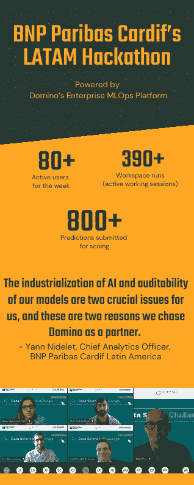

# 100 个数据科学家一周能做什么？(回答:很多)

> 原文：<https://www.dominodatalab.com/blog/what-can-100-data-scientists-do-in-one-week-answer-a-lot>

*编者按:2021 年 5 月 14 - 21 日* *，拉美各地近百名数据科学家加入了法国巴黎银行卡迪夫的虚拟数据科学黑客马拉松。* *在 Domino 这里，我们很高兴能够成为这一活动的一部分，为下一代数据科学家和下一代保险解决方案提供支持。*

我们如何根据食物的成分(例如，碳水化合物、蛋白质、维生素等的含量)、产地和其他变量来预测食物的营养成分？

这是我们向 100 多名数据科学家提出的挑战，他们参加了我们在拉丁美洲举办的首届虚拟数据科学挑战赛。参与者来自智利、哥伦比亚、墨西哥和秘鲁的大学和合作公司，带来了巨大的创造力和创新，以及帮助解决业务问题的愿望。他们四人一组工作，使用 我们的数据科学家每天依赖的同一个企业 MLOps 平台:Domino 数据实验室。

**

他们提出了一些非常有创意的解决方案，提交了 800 多个预测进行评分。我们学生组的优胜队伍是**Insight ML–DD”(perú)*。 “我们的合作伙伴”类别的获奖团队是*【analicatituya】(哥伦比亚)* 。每个获胜团队的成员都可以在六个月内无限制地使用 Coursera 的所有数据科学学院课程，并有机会免费获得 Coursera 证书。*

 *## 是什么让获胜的解决方案脱颖而出？

所有团队的创造力给我们留下了深刻的印象，但获胜者尤其展示了如何用完全不同的方法来解决业务问题。 一个人使用传统方法，应用自然语言处理(NLP)将文本转化为数字特征来预测食物营养分数。另一个使用新的高级方法，利用预先训练的深度学习模型，并根据挑战数据对其进行微调。Domino 平台的灵活性使每个团队能够访问他们需要的基础设施资源，例如，较小的 CPU 资源用于“传统”方法，而较大的 GPU 资源用于深度学习方法。

## 为什么是黑客马拉松？【T2

由于几个原因，黑客马拉松是我们战略的重要组成部分。

1.  ***分享我们的成功。*** 黑客马拉松为宣传我们的数字化转型提供了一个绝佳的机会。 法国巴黎银行 Cardif 是法国巴黎银行的 子公司，也是银行保险和信用保险联盟的 全球领导者。我们在帮助我们的客户实施不同的项目，同时保护他们免受不可预见事件的影响方面发挥着关键作用。 我们致力于通过合作伙伴关系对社会产生积极影响，并使保险更容易获得。 但正如我们所知， 消费者的期望、消费习惯和人口趋势不断变化，在产品和服务质量、响应能力和效率方面产生了新的含义和期望。为了满足这些需求，我们在数字、数据和人工智能(AI)解决方案上进行了大量投资，并正在实施一项雄心勃勃的数据战略，以支持我们以客户和员工为中心的数字化转型，并提供积极、可持续的业务影响。 到 2022 年，我们预计 80%的流程将实现自动化 让我们的产品和服务更容易为每一位客户所用。 
2.  ***吸引新的人才。*** 通过复制我们现实世界的多米诺环境，参与者体验了我们如何支持和装备我们的数据科学家，让他们做最好的工作。我们的数据分析团队定期与我们的商业和流程领域合作，通过模型预测、数据丰富和其他提高效率和日常数字化的技术来增强决策。数据处理丰富了我们银行保险计划的所有管理决策。来自 35 个国家的 150 多名法国巴黎银行 Cardif 数据科学家每天都在使用 Domino 平台来帮助他们构建和部署创新模型，这些模型有助于彻底改造保险业。例如，我们开发了一个基于人工智能的光学字符识别(OCR)行业解决方案，通过自动文档识别和数据提取来帮助客户申报索赔，从而加快支付流程。我们还开发了推荐工具，以帮助我们的客户改善招聘流程和其他服务。

3.  ***加强合作关系。*** 黑客马拉松为我们与合作伙伴合作解决业务问题提供了另一个渠道。在一个深受新趋势和生活方式影响的世界中，我们采用了一种基于联盟的独特业务模式，并与 500 多家分销合作伙伴在多个领域建立了合作关系，包括银行和金融服务、汽车、分销、电信和能源，以及财富管理咨询和经纪公司。

我们为我们的合作伙伴提供:在他们的产品中嵌入保险保护的能力，以创建定制的解决方案来保护客户免受损失；即插即用解决方案；独家销售和营销知识，以促进他们的业务；以及数据科学和客户参与方面的专业知识。对于客户来说，这意味着简单、有用、相关的产品，以及一个服务生态系统，提供端到端的数字化和个性化服务、轻松的核保、快速的索赔流程和持续的支持。

去年，我们在拉丁美洲建立了 30 多个新的和更新的联盟，包括与巴西银行保险专家 Brasilseg 和大型零售分销公司在秘鲁的子公司 Financiera Oh 的新合作，以及更新我们与哥伦比亚 Grupo Aval 的协议。

这是我们在拉丁美洲的第一次虚拟黑客马拉松…

### 这不会是我们的最后一次。

从参与者的热情和我们开展这项活动的技术难度来看，我们显然不能止步于此。我们的赛后问卷调查显示，参与者对明年再次参加我们的黑客马拉松感到兴奋，并计划再次参加！我们还看到，参与的学生和合作伙伴对我们关于人工智能产业化的课程特别感兴趣。这对于 AI 来说是一个至关重要的问题，就像我们模型的可审计性一样——这也是我们选择 Domino Data Lab 作为合作伙伴的两个原因。Domino 的 Enterprise MLOps 平台使我们的数据科学团队能够更快速、更轻松地开发、部署、监控和管理大规模模型，自动跟踪他们的工作，例如代码、ide 等，以便他们能够重现结果并在过去工作的基础上进行构建。

我们很兴奋地开始为 2022 年的黑客马拉松做计划，并且正在努力思考如何进一步帮助我们的新学生社区在这些主题上了解更多。在第一次黑客马拉松中，有两项工作做得很好，我们肯定会重复:

*   ***选择一个实际的、统一的话题。*** 我们今年预测食物营养分数的主题引起了所有参与者的共鸣，这有助于团队在整个比赛中保持参与和兴奋。在我们计划 2022 年黑客马拉松时，我们将寻找另一个所有参与者都能参与的实践主题。

*   ***提供团队导师。*** 在整个比赛过程中，Cardif 数据科学家为每个团队提供指导。这增强了学生、合作伙伴和我们的数据科学团队的体验。

## **了解更多**

*   观看法国巴黎银行 Cardif 的 Sebastien Conort 在他的演讲中分享他们如何使用 Domino 平台 开发和管理其人工智能算法，[*催化您的转型，感谢模型风险治理*](https://dominodatalab.wistia.com/medias/81icchhvj5) *。”*

*   访问法国巴黎银行卡迪夫网站，看看法国巴黎银行是如何让保险变得更容易获得的。

*   阅读 Forrester 报告， [*【多米诺企业 MLOps 平台的总体经济影响】*](https://www.dominodatalab.com/domino-business-impact-forrester-tei-report/) 了解更多关于多米诺提供的价值。*