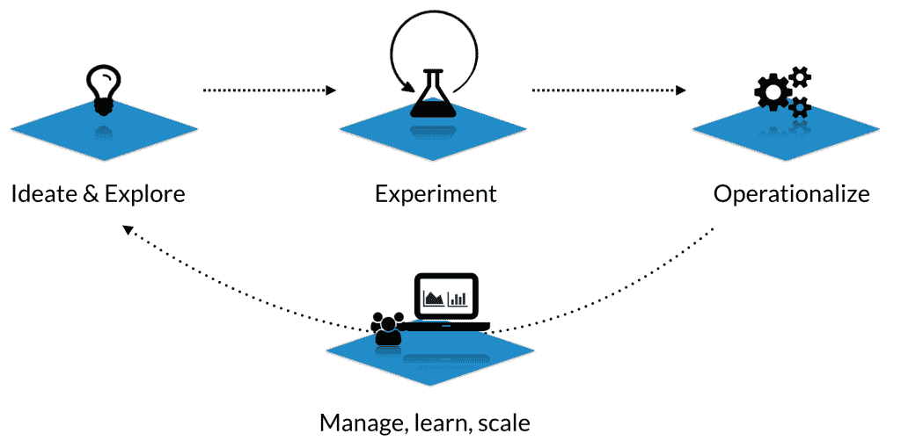
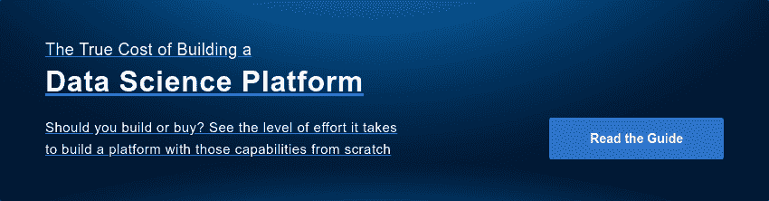

# 数据科学平台:是什么？为什么重要？

> 原文：<https://www.dominodatalab.com/blog/what-is-a-data-science-platform>

随着越来越多的公司认识到对[数据科学平台]的需求，越来越多的供应商声称他们已经有了一个。我们越来越多地看到公司将他们的产品描述为“数据科学平台”，而没有描述使平台如此有价值的功能。因此，我们希望分享我们对一个平台应该具备的核心功能的愿景，以便它对数据科学团队有价值。

首先让我们定义“[数据科学平台](https://www.dominodatalab.com/resources/field-guide/data-science-platforms/)”，然后深入了解细节:

## 数据科学平台(定义)

**数据科学平台是一种软件，它统一了数据科学生命周期(从开发到部署)中使用的人员、工具、工件和工作产品。组织使用数据科学平台围绕数据科学创造更多的成熟度和学科，将其作为一种组织能力，而不仅仅是一种技术技能。**

现在，让我们来看看为什么会出现这种情况，为什么它很重要:

## 框架:数据科学生命周期

我们看到“数据科学生命周期”跨越三个阶段。每个阶段都有不同的需求，这些需求激发了数据科学平台的能力:

1.  **构思和探索**
2.  **实验&模型开发**
3.  **运作/部署**

在某种程度上，所有数据科学项目都会经历这些阶段。

*   此外，还有一个贯穿整个生命周期的潜在观点:需要**管理、扩展和发展**您的分析和您组织的能力。

我们将讨论这四个方面，描述每个方面涉及的挑战，以及一个好的数据科学平台应该提供哪些功能。

## 思维和探索

定量研究从探索数据开始，以了解你有什么。这可能意味着以不同的方式绘制数据，检查不同的特征，查看不同变量的值，等等。

构思和探索可能很费时间。数据集可能很大而且难以处理，或者您可能想要尝试新的包或工具。如果你在一个团队中工作，除非你有办法看到其他人已经完成的工作，否则你可能会重做工作。其他人可能已经开发了洞察力，创建了干净的数据集，或者确定了哪些功能是有用的，哪些是无用的。

### 一个好的数据科学平台应该能够轻松...

*   找到并理解过去的工作，让数据科学家在提出新问题时不需要从头开始。
*   探索大型机器上的数据，无需处理开发运营/基础架构设置。
*   安全地使用新的包和工具，即不中断过去的工作或干扰同事的环境。

## 实验和模型开发

通过探索数据的过程，研究人员形成了他们想要测试的想法。在这一点上，研究通常从笔记本中的临时工作转移到更硬的批处理脚本。人们进行实验，回顾结果，并根据他们所学到的东西做出改变。

当实验是计算密集型的(例如，模型训练任务)时，这个阶段可能会很慢。这也是数据科学的“科学”部分特别重要的地方:跟踪实验中的变化，确保过去的结果是可重复的，通过同行评审过程获得反馈。

### 一个好的数据科学平台应该能够轻松...

*   横向扩展计算资源，一次运行多个计算密集型实验。
*   跟踪你的工作(例如，你的实验),使它们具有可重复性。
*   与同行和非技术同事(具有其他专业领域)分享工作，以获得关于不断发展的研究和结果的反馈

## 操作化

数据科学工作只有在对业务成果产生一定影响的情况下才有价值。这意味着工作必须以某种方式操作化或生产化，也就是说，它必须集成到业务流程或决策流程中。例如，这可以是以 API、供人们交互的 web 应用程序或显示在人们收件箱中的每日报告的形式公开的预测模型。

实施数据科学工作通常需要工程师资源，这会增加成本并推迟上市时间。这不仅会影响初始部署，而且如果它成为新迭代的持续税收，它更有可能使模型永远不会超过“版本 1”，或者它意味着当新的研究投入生产时，它已经过时了。

### 一个好的数据科学平台应该能够轻松...

*   将模型发布为 API，那么其他语言的软件系统(Java，PHP，C#，Ruby 等。)可以轻松地使用它们，而无需重新实现。
*   向非技术分析师和利益相关者公开工作—作为自助服务工具、仪表盘、静态报告等

## 管理、学习和扩展

除了帮助研究人员更快地开发更好的模型之外，平台还为团队和管理者带来了一种至关重要的能力。随着企业在定量研究上投入更多，它们应该积累制度知识和最佳实践，让团队随着时间的推移变得更加有效。

一个平台的核心价值是它集中知识和研究资产的能力。这让经理们可以透明地了解人们的工作方式；它降低了关键人物的风险；这使得搭载人员变得更加容易；它改善了共享环境，从而增加了创造力；而且它通过使建立在过去的工作上而不是从零开始成为可能，加快了研究的步伐。

### 一个好的数据科学平台应该能够轻松...

*   浏览或搜索过去的工作(包括元数据、代码、数据集、结果、讨论)
*   在工作中设置安全界限，确保合适的人可以访问
*   以过去的工作为基础

## 开放式与封闭式平台

我们认为平台应该促进我们上面描述的过程，最终使构建模型或其他数据科学交付物变得更容易。比较平台时出现的一个相关问题是:在平台之上可以使用哪些工具？

有些平台是封闭的:也就是说，它们促进了上面描述的过程，但前提是你使用的是*平台供应商的*特定编程语言、建模包或 GUI 工具。

我们构建 Domino 是为了成为一个*开放的*平台，致力于这样一个目标:你应该能够选择你想要使用的语言和软件包，一个好的平台将会给你这种灵活性。

根据我们的经验，开放平台的价值在于两个原因:首先，它为您的数据科学家创造了灵活性，使他们更容易在不同的环境中使用正确的工具，并根据需要试验新的包或语言。其次，它减少了采用的摩擦，因为数据科学家可以自由地继续使用他们习惯的工具。

