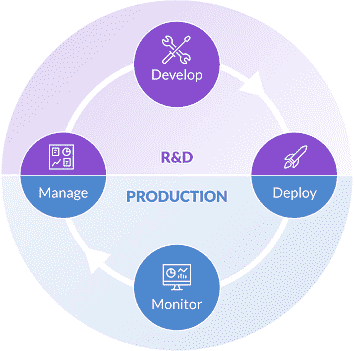

# 数据科学项目的数据科学生命周期是什么？

> 原文：<https://www.dominodatalab.com/blog/what-is-the-data-science-lifecycle>

数据科学是一个极其复杂的领域。当你在工作的企业环境中考虑业务关键型机器学习模型的要求时，旧的养猫迷因甚至不会得到一笑。

在数据科学生命周期(DSLC)的四个步骤中构建[数据科学项目](/resources/field-guide/managing-data-science-projects/),可以更轻松地管理有限的资源和控制时间表，同时确保项目满足或超过其设计的业务要求。

## 什么是数据科学生命周期？

数据科学生命周期(DSLC)是一系列创建、部署和监控分析模型的迭代步骤。在其最高级别，数据科学生命周期(DSLC)由四个阶段组成:管理、开发、部署和监控。在每个阶段中都有多个迭代步骤，通过这些步骤，项目进展到最终生成生产模型。该项目可能会通过先前的步骤进行循环，以获取更多的数据、构建新的特征、尝试不同的算法、调整超参数等等。即使在部署之后，当模型性能衰退时，模型将返回到先前的步骤进行重新训练或重建。

## 

## 数据科学生命周期的 4 个步骤是什么？

数据科学生命周期将任何给定项目中的所有任务分为四大步骤。这不仅有助于创建每个项目的整体鸟瞰图，还可以更容易、更有效地确定哪里需要资源，以及确定每个项目的进展情况。这四个步骤是:

*   **管理:**多个人员和团队参与各个步骤，包括 IT 运营、业务利益相关方、数据科学领导者、数据科学家、数据分析师、开发人员、数据科学产品经理、ML 工程师和数据工程师。
*   **开发:**访问和准备数据，然后创建特征。构建、评估和记录多个模型。当最终的模型被选择时，它被验证以确保它解决了业务问题并且在技术上是合理的。
*   **部署:**模型被注册到一个中央存储库中，并被测试以确保它们在生产中会如预期的那样运行。所有的模型工件都被保留和编目。它们通过模型治理过程被批准部署，并被集成到系统或过程中以供使用。业务采用通过变更管理得到保证。
*   **监控:**持续监控模型的性能和漂移，并在性能下降时采取措施。捕获并传达业务价值实现

让我们用一个业务问题示例来说明数据科学生命周期的四个步骤

## 管理步骤

管理步骤应该涉及一个跨职能团队，包括来自业务部门的代表、数据科学家、工程师、分析师和开发人员。在这里，每个人都聚在一起设计要解决的问题，提出解决方案，然后从[技术和业务角度](http://www.cs.toronto.edu/~soroosh/gr4ml_language.html)确定项目需求并确定其优先级。

### 找出问题所在

没有任何解决办法可以先于问题。假设一家零售商在其网站上有几千种产品出售。确定每件商品的最佳价格主要是人工完成的，方法是根据历史趋势对整个类别进行折扣，以及将最畅销的商品与竞争对手的价格进行比较。这是一个非常耗时和低效的过程，使用 ML 模型会有效得多。这个阶段的一个关键输出是理解将受到 ML 模型影响的一个或多个决策。

### 评估项目

您的业务部门希望使用来自竞争对手的实时数据，根据内部历史定价和销量动态调整价格。经过一番讨论后，您决定需要创建一个竞争对手定价的实时数据库。制造商的 SKU 并不总是可用，零售商的 SKU 也因公司而异，因此识别竞争对手的产品需要一个能够整合 SKU、产品描述和图片的模型。一个来自以前项目的现有模型，比较图像和描述来衡量产品的受欢迎程度，可以重新用于这个项目。如果无法获得完成目标所需的数据或资源，一些项目可能会到此结束。

### 确定项目的优先级

不仅需要对每个项目中的任务进行优先级排序和角色分配，还需要考虑其他项目所需的工作。在我们的定价示例中，您决定首先开发一个 API，它可以从三个竞争对手的网站中提取数据，并创建一个新的数据库。这将让您的数据工程师和开发人员忙碌几天。与此同时，您的数据科学家可以完成另一个已经部署但需要更新的紧迫项目。

管理阶段既是数据科学生命周期的开始，也是结束。生产中的 ML 模型可能会降级，可能需要重新培训，并根据新的请求确定优先级。在其他情况下，生产中的 ML 模型可以用于新的项目，以便为组织实现更高的价值。

## 显影步骤

对于数据科学家来说，开发阶段是所有乐趣的开始。开发通常有三个部分，从访问数据开始，探索和准备数据，然后研究和开发模型。

### 存取数据

在我们的定价模型示例中，许多数据需要从互联网上提取并放入新的数据库中。历史内部数据应该已经可用，但需要使其可访问。然而，在其他情况下，数据可能不可用，必须从其他来源购买。

### 探索和准备数据

在大多数情况下，需要为数据做好准备。缺失的数据需要被处理，数据需要被分类，无关的数据和重复的列需要被删除，并且只有在预测期间可用的数据才可以被使用。例如，在预测能源需求时，您不能使用温度，因为您只知道事后的实际温度。在这种情况下，您必须使用预测温度。错误地准备数据可能与实际构建 ML 模型一样重要。

### 研究与开发

在这部分开发中，数据科学家开始创建模型并进行实验来测试它们的性能。在开发的这一部分有很多尝试和错误，因为需要评估和修改不同的算法。通常，您需要返回并再次准备数据，因为被测试的模型中的变化可能需要不同的变量。

R&D 的最终结果应该是一个工作模型，它结合了在管理步骤中确定的功能，可以根据需要执行

## 部署步骤

[部署阶段](/blog/machine-learning-model-deployment)是将经过测试的模型转移到生产环境的阶段。理想情况下，这是项目从数据科学家移交给开发人员和工程师的地方，尽管从项目开始到完成通常需要首席数据科学家的监督。

### 验证您的模型

根据公司治理、法律或认证机构的要求，对测试的模型进行分析和验证。这确保了模型的建立是正确的，符合伦理的，没有偏见的。它还确保模型不会滥用数据来获得结果。例如，这在医疗保健和金融领域至关重要。此外，任何收集数据的公司都必须遵守法律和自己的用户协议，知道可以和不可以对客户信息做什么。

### 发布您的模型

将工作模型投入生产状态并进行分析。在我们的定价模型示例中，该模型可以访问客户服务器上的数据，以及从竞争对手网站收集实时数据的数据库的工作版本。如果它遇到任何问题，或者如果它不像预测的那样工作，模型可能需要被终止，并进行一系列新的测试，将项目带回开发步骤。

### 交付您的模型

一旦工作模型被成功发布，它就可以被交付给将要使用它的业务单元。交付阶段包括将模型合并到业务流程中，培训用户，并确保模型按计划使用。在我们的定价模型示例中，将添加一个 API，以便可以监控它，并且可以实时查看它对产品价格所做的任何更改。

## 监控步骤

向商业世界发送一个 ML 模型永远不会是数据科学生命周期的结束。监测是这一过程的基本部分。

首先，需要监控传入的数据。在我们的定价模型示例中，内部数据应该相对稳定，如果要进行任何更改，应提前通知监督 ML 模型的人员。其他实时数据来源就不一样了，它们可能会在没有通知的情况下随时发生变化。[需要模型监控](/blogs/model-monitoring-best-practices-maintaining-data-science-at-scale)以确保团队被通知输入数据的任何变化，不管来源如何——因为模型可能需要重新开发。

其次，需要对模型进行监控，以确保它始终如一地交付业务角度所需的价值。在我们的定价模型示例中，产品成本或最低加价应该已经被考虑到模型中。否则，这种模式很容易开始以低于成本的价格销售产品，这可能会成为公司底线的一个严重问题。

第三，您不仅需要监控模型及其数据源，还应该监控最终用户，尤其是在采用的早期。您需要确保他们可以访问他们需要的结果，并且模型提供给他们的信息是可用的。这通常涉及培训，但在某些情况下，可能需要修改平台或用户界面。

不管工作模型执行得有多好，一旦它如预期的那样执行，并且用户习惯于将它集成到他们自己的工作流中，团队应该再次开会，以确定相同或相似的模型是否可以在其他环境中使用。

### 使用企业 MLOps 推动 DSLC 的采用

当您拥有现成的工具和框架时，将数据科学生命周期应用到您公司的数据科学项目中会容易得多。Domino 的企业 MLOps 平台是基于 DLSC 的协作而从头开始构建的，因此每个业务需求、每个资源、每个数据集、算法和实验都可以在同一个平台中记录和获取。

