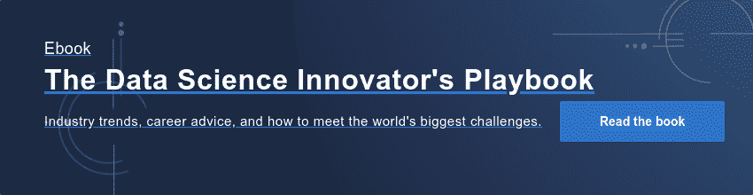

# 保险业中数据科学的兴起对该行业意味着什么，以及它是如何变化的

> 原文：<https://www.dominodatalab.com/blog/what-the-rise-of-data-science-in-insurance-says-about-the-profession-and-how-its-changing>

您如何将数据科学能力打造为一种强大的力量，用于对您业务的几乎所有方面做出决策？在一个人才竞争激烈且不断增长的领域，你如何招聘、培训、组织和再培训你的团队成员？这些只是纽约人寿保险公司首席分析官 Glenn Hofmann 在任职期间遇到并掌握的几个问题。

在五年的时间里，Glenn Hofmann 在纽约人寿内部创建了一个成功的大规模数据科学组织，纽约人寿是财富 100 强公司，也是美国最大的互惠人寿保险公司。纽约人寿的数据科学和人工智能中心(CDSAi)完全专注于公司的核心业务。CDSAi 广泛的统计和机器学习专业知识帮助纽约人寿在全公司范围内做出实时的、基于模型的决策，因此纽约人寿即使在新冠肺炎疫情这样的高度不确定时期也能应对新的挑战。

## 霍夫曼和其他顶级创新者的新电子书访谈

Domino [最近与 Hofmann 就我们的新电子书](https://www.dominodatalab.com/blog/7-top-innovators-share-insights-trends-and-career-advice-in-the-data-science-innovators-playbook) 、 [*【数据科学创新者的剧本】*](https://www.dominodatalab.com/resources/data-science-innovators-playbook) 进行了对话，该书涵盖了数据科学在推动创新方面的崛起，通过在 5 月份的 [Rev 3](https://www.dominodatalab.com/resources/breakthrough-innovations-rev-3?utm_content=214346104&utm_medium=social&utm_source=linkedin&hss_channel=lcp-3542130) 对同行选出的七位顶级数据科学创新者进行采访。

所有这些创新者都在解决一些世界上最棘手的问题，其中许多问题——如 COVID 和——给保险和金融行业带来了特别严峻的挑战。但是，霍夫曼说， [新工具正在加强数据科学](https://www.dominodatalab.com/blog/googles-kozyrkov-tells-rev-3-data-science-universe-is-expanding-and-incredible-mlops-tools-emerging) ，因此 [这门新兴学科越来越有能力应对世界抛给它的任何挑战](https://www.dominodatalab.com/blog/rocketing-confidence-in-data-science-poll-finds-are-better-tools-the-reason) ，纽约人寿继续茁壮成长。

## 数据科学工具的改进有助于推动创新

“算法变得更好了，将模型部署到生产中的基础设施和软件也有了很大的改进，”霍夫曼说。“这推动了我们的模型对业务的影响。”

“例如，在纽约人寿，我们有内部和基于云的计算环境，用于数据科学生命周期的各个方面，”他说。“这包括 Domino，它可以在任何流行的编程语言中实现模型的灵活实时部署，并在生产中监控和报告我们的模型。”

在 [的新电子书](https://www.dominodatalab.com/resources/data-science-innovators-playbook) 中，霍夫曼解释了他的一些技巧，让纽约生活成为许多数据科学家想要从事职业的地方。在他的《创新者》采访中，你会发现:

*   为什么不应该将数据科学团队建设策略建立在寻找大量“全栈”数据科学家的基础上
*   霍夫曼传播数据科学的两种方式——在组织内部和外部
*   对你的业务产生更大影响和作用的三种方法，包括建立模型信任

## 其他关于数据科学优势的创新者

下载 [*数据科学创新者行动手册*](https://www.dominodatalab.com/resources/data-science-innovators-playbook) 阅读更多 Glenn 的观察，以及许多其他主题、战略、战术和见解，请访问:

*   [卡西·科济尔科夫](https://www.dominodatalab.com/blog/googles-kozyrkov-tells-rev-3-data-science-universe-is-expanding-and-incredible-mlops-tools-emerging)——谷歌首席决策科学家
*   najat Khan——强生公司让桑制药公司首席数据科学官兼研发战略与运营全球总监
*   Robert Nishi hara——Ray 的联合创始人，Anyscale 的联合创始人兼首席执行官
*   Mona g . Flores——NVIDIA 医疗人工智能全球主管
*   [约翰·汤普森](https://www.dominodatalab.com/blog/how-to-retain-your-data-scientists)—分析思想领袖、畅销书作家、数据创新者&分析
*   Andy Nicholls——GSK PLC 统计数据科学部高级总监

电子书是免费的，但是你需要在这里注册。你也可以在这里 看到更多关于二十六页电子书 [的内容。](https://www.dominodatalab.com/blog/7-top-innovators-share-insights-trends-and-career-advice-in-the-data-science-innovators-playbook)

