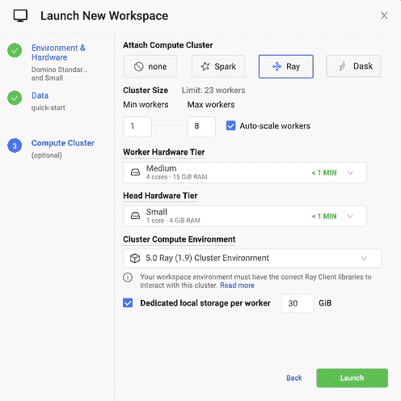
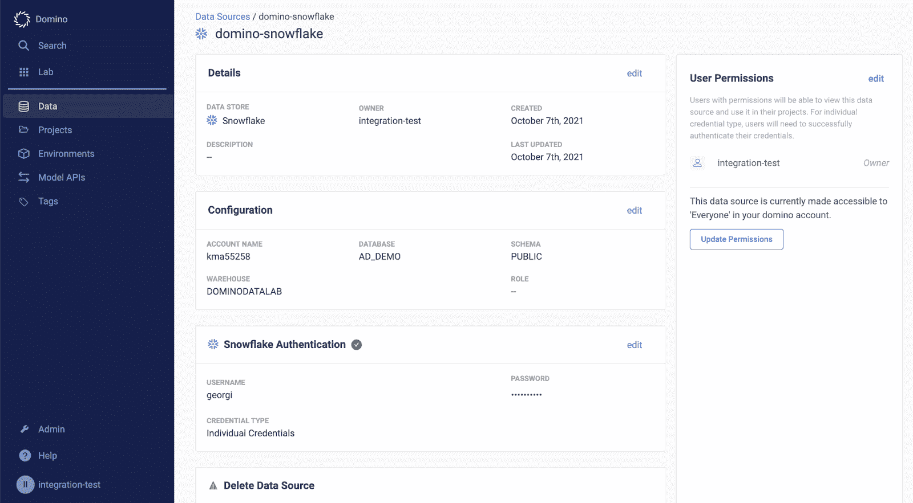
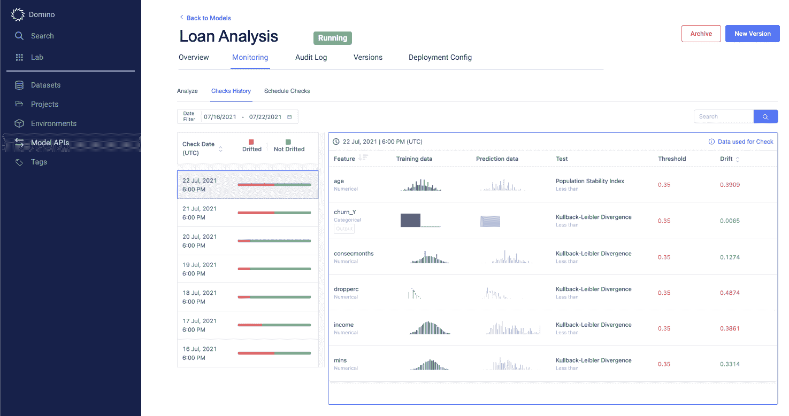
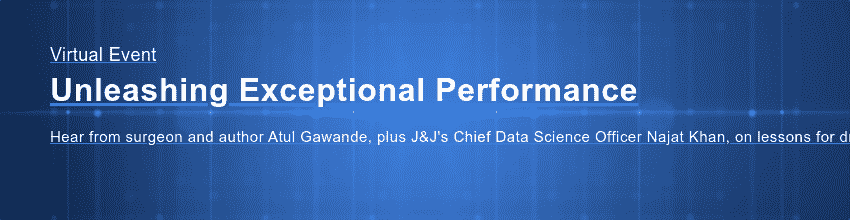

# Domino 5.0:释放模型速度

> 原文：<https://www.dominodatalab.com/blog/whats-new-in-domino-5.0>

每位高管都会告诉你，数据科学和机器学习对他们公司未来的成功至关重要。然而，与此同时，大多数人都会承认，他们在数据科学和机器学习方面的投资尚未带来他们想要的结果。

严峻的事实是，虽然机器学习很容易取得快速胜利，但在整个企业中扩大其影响却极具挑战性——以支持更多的项目、更大的团队和不同的流程。许多团队在数据科学生命周期的各个阶段都会遇到重大摩擦，围绕着使数据科学独一无二的三个基本要素:

1.  **计算。**数据科学家需要前所未有的计算能力和灵活性来试验新的软件工具。大多数公司无法处理现代数据科学技术和工作负载的独特基础架构和软件需求。结果是大量耗时的开发工作，限制了研究的速度。
2.  **数据。**尽管经过了几十年的努力，数据科学家仍然面临着巨大的数据工作摩擦。他们必须在几十个不同的地方寻找他们需要的数据，他们可能没有适当的访问权限，需要 IT 帮助才能获得这些数据，然后每个团队都必须编写自己的数据访问代码才能处理这些数据。
3.  **车型。**对于大多数企业来说，模型是一种新型的数字资产。它们是概率性的，其行为不同于软件等更传统的 IT 资产。数据科学家在部署模型时遇到摩擦，这延迟了业务影响。然后，不一致或不存在的监控和更新实践会危及关键的业务决策和结果。

减少这种摩擦一直是我们对 Domino 的愿景:一个通过改变团队的工作方式，而不是他们工作的内容来加速模型速度的平台。通过自动化最佳实践、创建更多的一致性和增加协作，Domino 就像一个飞轮，帮助数据科学团队更快地变得更好。

> 模型速度对于模型驱动的业务至关重要 
> “作为全球第四大再保险公司，我们采用模型驱动的方法来帮助客户控制和管理风险，包括自然风险、气候风险、健康风险、地缘政治风险、网络风险以及许多其他风险。为此，我们实施了一个多云战略以及 Domino 的企业 MLOps 平台，以提高我们的模型速度，这样我们就可以用过去四分之一的时间来满足客户需求。”
> 
> –SCOR 数据科学主管 Antoine Ly

## Domino 5.0 简介

今天，我们自豪地宣布 [**Domino 5.0**](/resources/introducing-domino-5.0) 的发布——这是我们公司历史上最具雄心和影响力的发布。Domino 5.0 引入了突破性的新功能，解决了数据科学生命周期中的核心摩擦点。

#### 自动缩放聚类

为了让数据科学家拥有更强大的计算能力，Domino 5.0 引入了 [**自动伸缩集群**](/blog/autoscaling-compute-clusters) 。只需几次点击，数据科学家就可以为最流行的分布式计算类型——Spark、Ray 和 Dask——构建弹性集群。这使得数据科学家能够测试更多的想法，并更快地开发更好的模型。Domino 5.0 的突破是能够监控数据科学工作负载，并动态增长和收缩计算集群，以优化利用率、降低成本和支持快速迭代。当结合我们上周宣布的与 NVIDIA AI Enterprise 的 [集成时，工作负载可以加快 100 倍或更多。](https://www.dominodatalab.com/blog/domino-validated-for-nvidia-ai-enterprise)

#### 数据源

为了使对关键数据的访问民主化，Domino 5.0 中的[数据源](/blog/data-connectors)允许数据科学团队安全地共享和重用常见的数据访问模式。数据科学家浪费大量时间试图克服与安装驱动程序和特定库相关的 DevOps 障碍，只是为了访问他们需要的数据。Domino 5.0 简化了整个过程，允许他们更容易地创建新的数据源连接器并与同事共享，或者使用管理员共享的预建连接器——所有这一切都以直观、协作和高度安全的方式进行。

#### 集成监控和自动化洞察

为了简化公司如何操作模型，Domino 5.0 引入了 [集成监控](/blog/integrated-model-monitoring) 和 [自动洞察](/blog/automated-model-insights) 。这种以前独立的 Domino 监控产品(Domino Model Monitor)的紧密集成允许客户极大地简化他们部署、监控和更新模型的工作流程。具体来说，Domino 5.0 将自动为 Domino 中构建的模型建立预测数据捕获管道和模型监控。新的自动化见解有助于数据科学家快速确定模型性能不如新模型时的根本原因，最有可能的原因是预测数据漂移或反馈到 Domino 的真实数据。有了这种洞察力，数据科学家可以根据市场、客户偏好等的变化，快速重构原始开发环境，以重新培训或重建模型。

升级到 Domino 5.0 的 Domino 客户将立即有机会免费试用模型监控。这算不算升级的奖励？

## 结论

借助 Domino 5.0，公司获得了一个统一的平台，可以减少端到端数据科学生命周期中关键点的摩擦——释放模型速度以增加收入、改善客户体验并在竞争中胜出。在接下来的几周内，您将能够阅读关于 Domino 5.0 中许多创新的独立博客，演示视频将展示紧密集成核心数据科学功能对改善数据科学家工作方式的独特优势。

此外，如果您错过了我们的 [Domino 5.0 发布活动](https://go.dominodatalab.com/unleashing-exceptional-performance)，Atul Gawande(著名外科医生、作家和性能改进专家)和 Najat Khan 博士(首席数据科学官和强生让桑制药公司&强生研发战略&全球负责人和强生数据科学委员会&联席主席)将出席，您可以在此观看重播[。](https://go.dominodatalab.com/unleashing-exceptional-performance)

