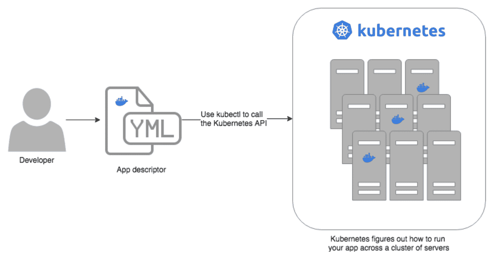
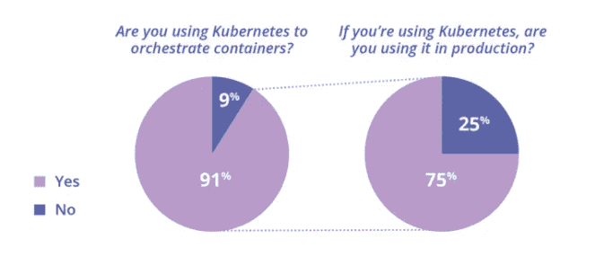
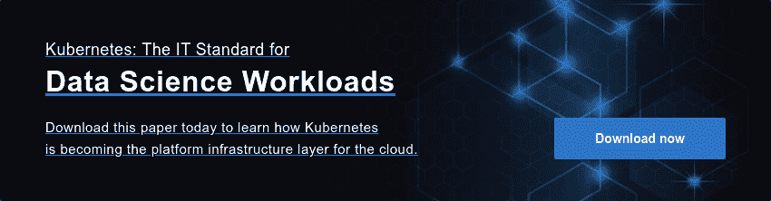

# 为什么 Kubernetes 非常适合数据科学工作负载

> 原文：<https://www.dominodatalab.com/blog/why-kubernetes-is-great-for-data-science-workloads>

Kubernetes 是一个开源容器编排系统，随着 IT 部门转向容器化应用程序和微服务，它正迅速成为必不可少的工具。正如 Kubernetes 在处理一般 IT 工作负载时一样强大，Kubernetes 还提供了支持突发数据科学工作负载的独特优势。在容器的帮助下，数据科学家可以使他们的建模可移植和可复制，并大规模扩展这些相同的容器化的机器学习模型。

## Kubernetes:计算的新基础

在过去的几年里，容器化应用程序在企业计算和数据科学领域变得非常流行。Docker 不仅实现了强大的新 DevOps 流程，还优雅地解决了环境管理的问题。

容器需要被管理并连接到外部世界，以执行调度、负载平衡和分发等任务。Kubernetes(又名 K8s)的开发是为了管理在生产环境中运行的多个容器和主机的复杂架构。它提供了将容器调度到计算集群所需的流程编排，并管理工作负载以确保它们按预期运行。Kubernetes 帮助您管理一组机器上的容器化应用程序(例如 Docker 上的应用程序)。K8s 就像是数据中心的操作系统，抽象出 API 背后的底层硬件:

*来源:[阿蛮功](https://gruntwork.io/static/guides/kubernetes/how-to-deploy-production-grade-kubernetes-cluster-aws/#what-is-kubernetes)*

Kubernetes 也正在成为云的平台基础设施层。在 K8s 之前，当您必须部署多个虚拟机(VM)时，您可能会有任意的负载平衡器、网络、不同的操作系统等等。即使在一个云服务中，也有如此多的变化，以至于你不能把一个分布式应用程序变成真正可移植的。另一方面，Kubernetes 可以作为一个持续可编程的基础设施。Kubernetes 使网络、负载平衡、资源管理和更多部署考虑保持一致。

## 在企业 IT 环境中广受欢迎

在 IT 专业人士中，Kubernetes 正在成为基础设施面向未来的共识 API。根据[云原生计算基金会](https://www.cncf.io/blog/2018/03/06/kubernetes-first-cncf-project-graduate/)的数据，K8s 现在是全球第二大开源项目，仅次于 Linux。在最近 451 Research/StackRox 对 400 多名 IT 专业人员的调查中，91%的人正在使用 Kubernetes，而两年前这一比例仅为 57 %:

*来源:[斯塔克洛克斯](https://www.stackrox.com/kubernetes-adoption-security-and-market-share-for-containers/)*

## 非常适合数据科学工作负载

如果您还记得 Docker/containers 之前数据科学部门的要求，环境和包管理是繁重的。它必须频繁地安装新的软件包。代码对于不同的人会有不同的工作方式(或者有时根本没有)，因为他们的环境是不同的。旧的项目变得不可用，旧的结果变得不可能重现，因为自代码编写以来环境已经发生了变化。Docker 巧妙地解决了这个问题，因为它的映像包含一组软件和配置文件，当分析代码运行时，这些文件应该在适当的位置。Docker 在包装和环境管理以及再现性方面提供了巨大帮助。

**效率和资源利用:** Kubernetes 为容器化应用带来了一系列全新的好处，包括效率和资源利用。K8s 允许数据科学家可扩展地访问 CPU 和 GPU，当计算需要大量活动时，这些 CPU 和 GPU 会自动增加，并在完成时缩减。这是一笔巨大的资产，尤其是在云环境中，成本是基于消耗的资源的。向上或向下扩展集群既快速又简单，因为只需在集群中添加或删除虚拟机即可。这种动态资源利用对数据科学工作负载尤其有利，因为在训练模型或工程功能时，对高性能 CPU、GPU 和 RAM 的需求可能会非常密集，但随后需求会很快再次下降。

Kubernetes 还有助于实现基础设施抽象，可以为数据科学家提供一个计算服务的抽象层，而无需担心底层基础设施。随着越来越多的团体希望利用机器学习来理解他们的数据，Kubernetes 让他们更容易访问他们需要的资源。

**云灵活性:**Kubernetes 对数据科学工作负载的另一个好处是，所有主要的云供应商(包括亚马逊、谷歌和微软)都提供托管服务，以提供构建在其灵活弹性的基础设施上的 Kubernetes 集群。这些供应商中的每一个都经常引入新的基础设施创新，比如新的更强大的 GPU 和 TPU、新的成本结构等等。由于 K8s 支持基础架构之间的应用程序可移植性和灵活性，因此它对云可移植性的支持以及围绕混合云和多云选项的承诺对于数据科学工作负载尤为重要。负责支持数据科学能力的 IT 领导者明白保持云灵活性非常重要。

## 为数据科学定制 Kubernetes

虽然 Kubernetes 为数据科学平台内的工具敏捷性、更快的迭代和可重复性提供了良好的基础，但在为数据科学家进行优化之前，还需要进行大量的定制。为数据科学定制 K8s 应满足以下特征:

*   **可供数据科学家使用的接口:**K8s 的声明式 YAML 语法对于工程师和开发人员来说非常强大，但对于数据科学家来说却不是最直观的接口。数据科学家需要一个直观的界面和 API 来抽象 K8s 的一些概念。
*   **容器化环境管理:**为了能够实现上述再现性，数据科学家需要能够创建、更新和管理将用于其工作的图像。K8s 需要被修改以允许构建容器映像。
*   **集成用户管理和权限:** K8s 提供了一组授权原语，但这通常不足以为协同工作负载提供真正的用户隔离，以及管理敏感信息以使用工作负载的适当机制(例如，数据连接的访问凭证)。
*   **特定于数据科学的调度:**仅靠 K8s 通常不足以正确调度数据科学中常用的复杂多 pod 工作负载。
*   **资源控制:** K8s 需要扩展，以便管理员能够平衡用户对可扩展计算资源的访问，并提供足够的控制来管理成本和防止容量垄断。

当我们在 Kubernetes 上重建计算引擎时，我们自己完成了大部分定制工作。在这个过程中，我们还添加了高可用性、[水平可伸缩性](https://blog.dominodatalab.com/horizontal-scaling-parallel-experimentation)、企业安全性等等——所有这些都基于 Kubernetes 的可伸缩基础。

## 结论

如果您正在计划任何新的 IT 计划来支持您的数据科学工作负载/团队，Kubernetes 支持应该是一个重要的需求。凭借 Kubernetes 的快速增长、编排能力及其跨云和内部系统的互操作性，它提供了无与伦比的管理能力和可移植性。它确保您的系统可以与任何云供应商一起向前发展。它还能有效管理数据科学工作负载的突发性。

Domino 是第一个完全由 Kubernetes 提供的企业数据科学平台。这意味着您可以在任何云或内部基础设施上运行 Domino 工作负载。Domino 与您的 IT 战略和基础设施愿景非常一致，并且在您转向全云或混合本地和云部署时，它可以成为一个关键的推动者。使用 Kubernetes 上的 Domino，您可以让您的数据科学组织能够使用下一代工具和分布式计算框架。

有关 Kubernetes 的更多详细信息，以及为什么有远见的 IT 部门应该现在或在不久的将来采用它，请查看我们的新白皮书。

 

[Twitter](/#twitter) [Facebook](/#facebook) [Gmail](/#google_gmail) [Share](https://www.addtoany.com/share#url=https%3A%2F%2Fwww.dominodatalab.com%2Fblog%2Fwhy-kubernetes-is-great-for-data-science-workloads%2F&title=Why%20Kubernetes%20is%20Great%20for%20Data%20Science%20Workloads)