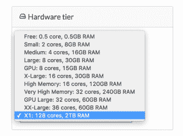

# 来自网飞机器学习的智慧

> 原文：<https://www.dominodatalab.com/blog/wisdom-from-machine-learning-at-netflix>

在五月份的 [Data By The Bay](http://data.bythebay.io/) 上，我们看到了网飞的 Justin Basilico 的精彩演讲:[关于构建机器学习软件的建议](http://www.slideshare.net/justinbasilico/recommendations-for-building-machine-learning-software-62448865)。Justin 描述了一些有效开发机器学习算法并将其集成到软件产品中的原则。

我们发现自己点头表示同意，我们希望根据我们与其他组织的数据科学团队合作的经验，总结一下他的一些观点，这些观点引起了我们最强烈的共鸣。

### 机器学习是迭代的(幻灯片 15-17)

Justin 强调“开发模型是迭代的”，实验是重要的。他还建议“避免双重实现”,这样一旦模型建立起来，就可以很容易地在生产中使用，而不需要重新实现。

Domino 支持在同一个平台上进行实验和生产，因此您可以迭代地开发您的模型，并且只需点击一下鼠标就可以部署它们——而不用担心翻译您的代码或者在不同的基础设施上配置一组匹配的包。

我们有两个短片强调 Domino 如何支持快速迭代实验，并让您将模型部署为 API 以避免双重实现。

### 在分发算法之前最大化单台机器(幻灯片 26)

Justin 建议避免“分布式的诱惑”,尽可能在一台机器上做更多的事情。分布式系统很难——更难安装和使用，也更不可靠！我们完全同意。无论如何，如果你真的需要给定数据的规模，就去分布式——但是如果你能避免的话，不要从分布式开始。

Domino 的方法是使在大规模单个实例上运行分析变得容易。我们一直支持 32 核和 240GB 内存的 AWS 实例，上周，我们支持亚马逊的新 X1 实例，让你在 128 核和 2TB 内存的机器上运行 Jupyter、RStudio、批处理脚本或任何你想要的东西。[你可以在这里阅读更多内容](//blog.dominodatalab.com/high-performance-computing-with-amazons-x1-instance/)。

### 不要仅仅依赖度量进行测试(幻灯片 32)

Justin 解释说，虽然单元测试对于捕捉数学错误很有用，但是查看整个系统的输出也很重要，“至少，比较不同版本之间的意外变化的输出”

我们最近写了我们对数据科学的[单元测试的看法，以及 Domino 的“比较”特性如何促进这种类型的输出比较。](//blog.dominodatalab.com/unit-testing-data-science/)

### 结论

我们在构建 Domino 时就考虑到了这些原则。Domino 支持快速迭代和实验，同时使生产变得容易，而不需要模型的冗余实现。我们主要是通过让您扩展到大型机器(并使用许多机器同时运行多个实验)来做到这一点。我们还通过跟踪所有实验结果并让您进行比较，来实现更全面的测试和比较过程。

如果你喜欢阅读关于实现更成熟的数据科学流程的原则和最佳实践，你会喜欢我们关于[什么是数据科学平台](//blog.dominodatalab.com/what-is-a-data-science-platform/)和我们的[“Joel 测试”的帖子](//blog.dominodatalab.com/joel-test-data-science/)。

Nic McPhee 制作的标题为“[递归雏菊](https://www.flickr.com/photos/gadl/253426762/in/photolist-ooSWW-5fxpCF-3BrGE-6z9eEg-57pvzs-i7PB4-RmMk4-hKJ4x-cfffhA-5kPFAc-8BueGX-9qow3d-9bVPcV-9bHkm9-5kPHaM-4eotPP-C1i2Z-Lcx4B-9bSUPJ-5kTXmj-t4TQ-9bGxf6-7etTW5-bxJ9x9-6Hw3D4-bLCN7c-3p2sCQ-sxfpc-bLCPSZ-bxJ8Aj-6FkYhG-bxJ757-63qeWa-bxJ7A3-bLCM4x-9dNsHs-6tb9fB-8krf4R-bxJ93b-5kTZ6A-9evUAi-3L4mHN-772CSg-7BNQ67-772Ckt-Vqhx7-5kPVX8-8Bqbnb-dLhVz5-772BNi)的横幅图片。由 2.0 在 [CC 下授权。](https://creativecommons.org/licenses/by/2.0/)