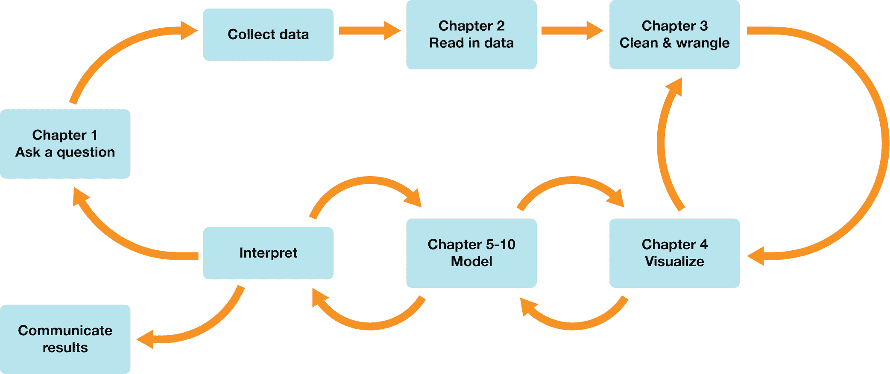

# 前言

> 原文：[`datasciencebook.ca/preface.html`](https://datasciencebook.ca/preface.html)

这本教科书旨在成为数据科学世界的易于理解的入门指南。在这本书中，我们将**数据科学**定义为通过**可重复**和**可审计**的过程从数据中生成洞察的过程。如果你分析了一些数据并将你的分析结果给了朋友或同事，他们应该能够从头到尾重新运行分析并得到与你相同的结果（*可重复性*）。他们还应该能够看到并理解分析中的所有步骤，以及分析发展的历史（*可审计性*）。创建可重复和可审计的分析允许你和其他人轻松地双重检查和验证你的工作。

在本书中，从高层次上讲，你将学习如何

1.  识别数据科学中的常见问题，并且

1.  使用可重复和可审计的工作流程来解决这些问题。

图 0.1 总结了本书每一章你将学习的内容。在整个过程中，你将学习如何使用 R 编程语言(R Core Team 2021)来完成与数据分析相关的所有任务。你将在前四章学习如何使用 R 来加载数据、清洗数据、整理数据（即，将数据重新结构化为可用的格式）以及可视化数据，同时回答描述性和探索性数据分析问题。在接下来的六章中，你将学习如何使用数据科学中的常用方法，包括分类、回归、聚类和估计，来回答预测性、探索性和推断性数据分析问题。在最后几章(11–13)中，你将学习如何使用 Jupyter 将 R 代码、格式化文本和图像组合成一个单一的连贯文档，使用版本控制进行协作，并在自己的计算机上安装和配置数据科学所需的软件。如果你是作为课程的一部分阅读这本书，讲师可能已经为你设置好了所有这些工具；在这种情况下，你可以按照顺序阅读本书的章节。但如果你是独立阅读这本书，你可能想在继续之前尽早跳到这些最后三章，以确保你的计算机已经设置好，以便你可以尝试书中包含的示例代码。

图 0.1：我们将走向何方？

书中的每一章都附有一个配套的工作表，提供练习题以帮助你练习你将学到的概念。我们强烈建议你在阅读完每一章后，在继续阅读下一章之前完成工作表。所有的工作表都可以在 [`worksheets.datasciencebook.ca`](https://worksheets.datasciencebook.ca) 找到；每章末尾的“练习”部分会指引你找到该章的正确工作表。对于每个工作表，你可以通过点击“启动绑定器”按钮在你的浏览器中启动工作表的交互式版本，或者通过点击“查看工作表”预览非交互式版本。如果你决定下载工作表并在自己的机器上运行，请确保遵循第十三章中找到的计算机设置说明。这将确保工作表提供的自动反馈和指导能够按预期工作。

### 参考文献

R 核心团队. 2021. *R：统计计算的语言和环境*. R 统计计算基金会. [`www.R-project.org/`](https://www.R-project.org/).
