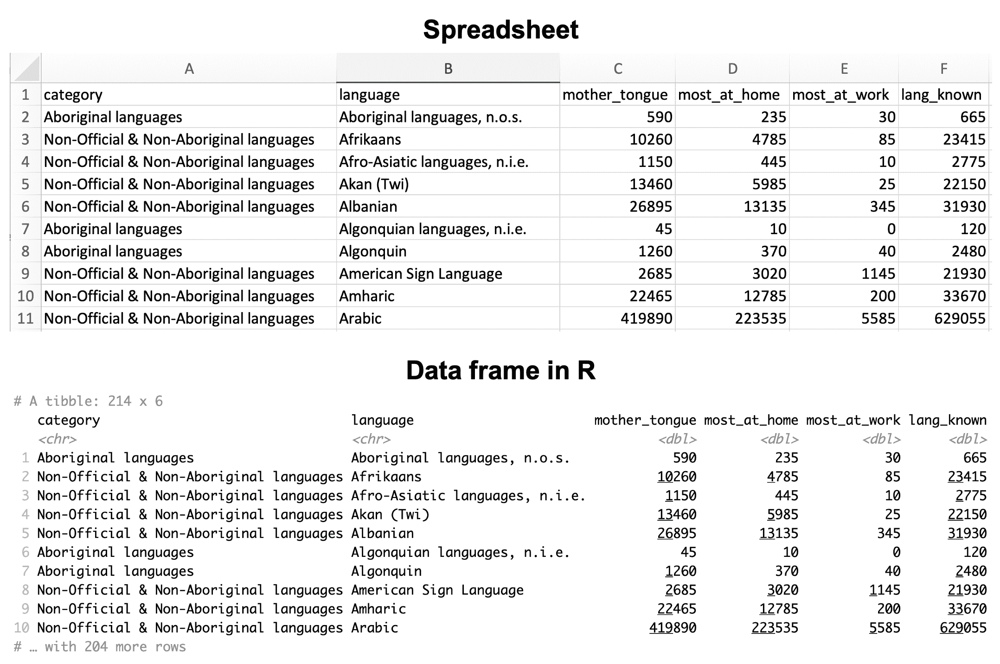
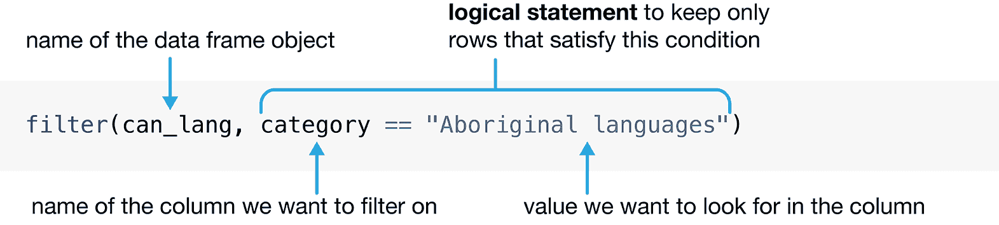
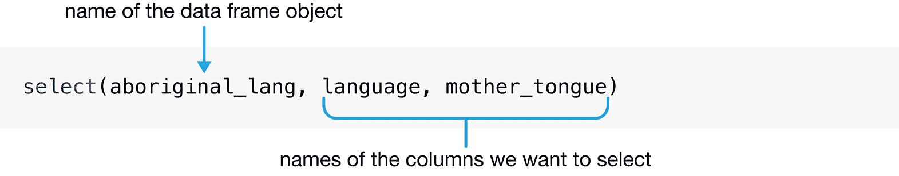
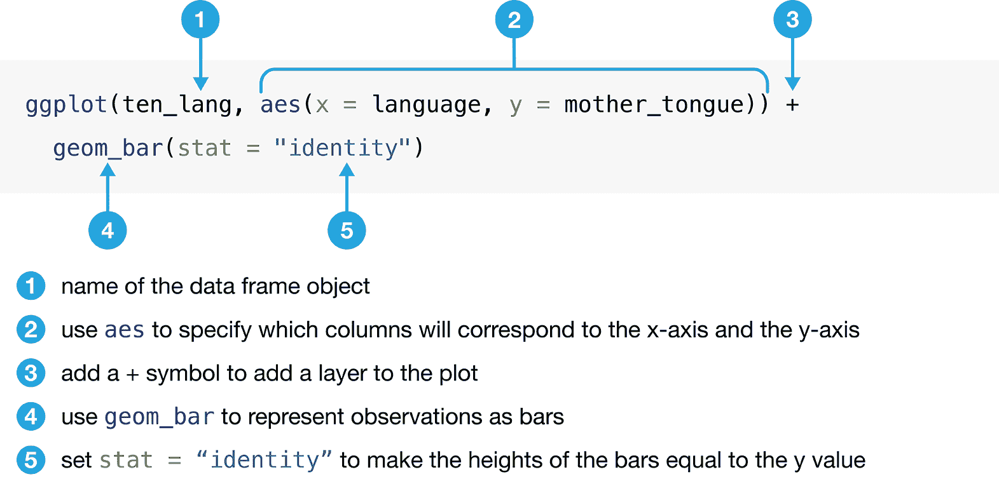
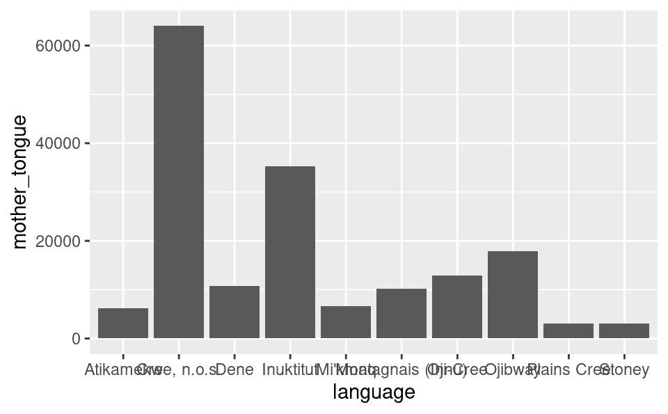
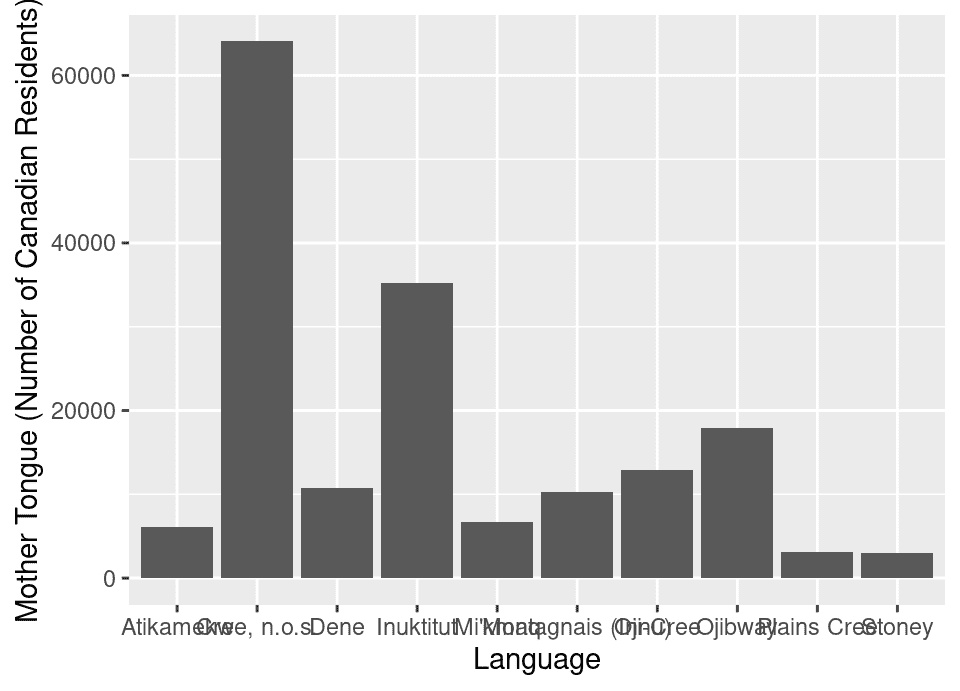
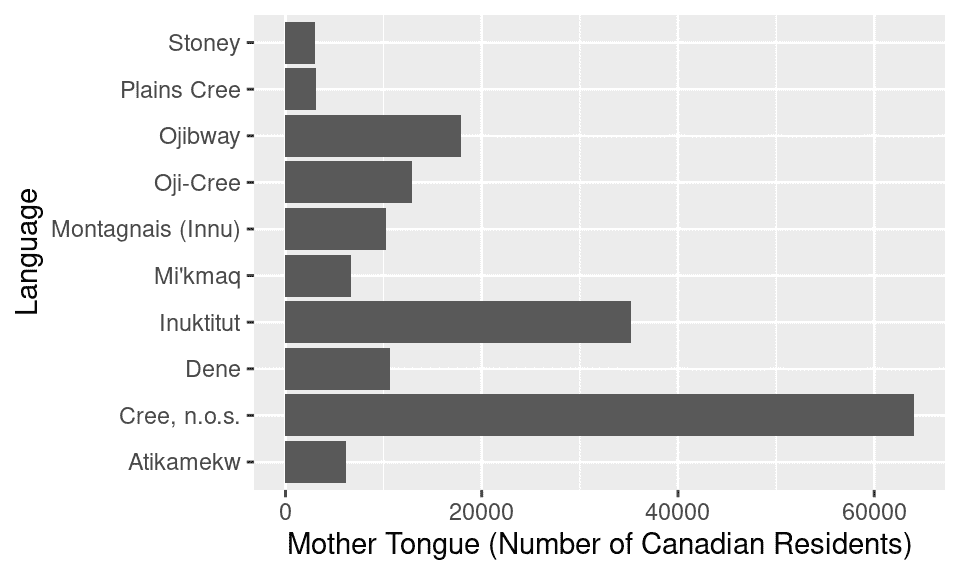
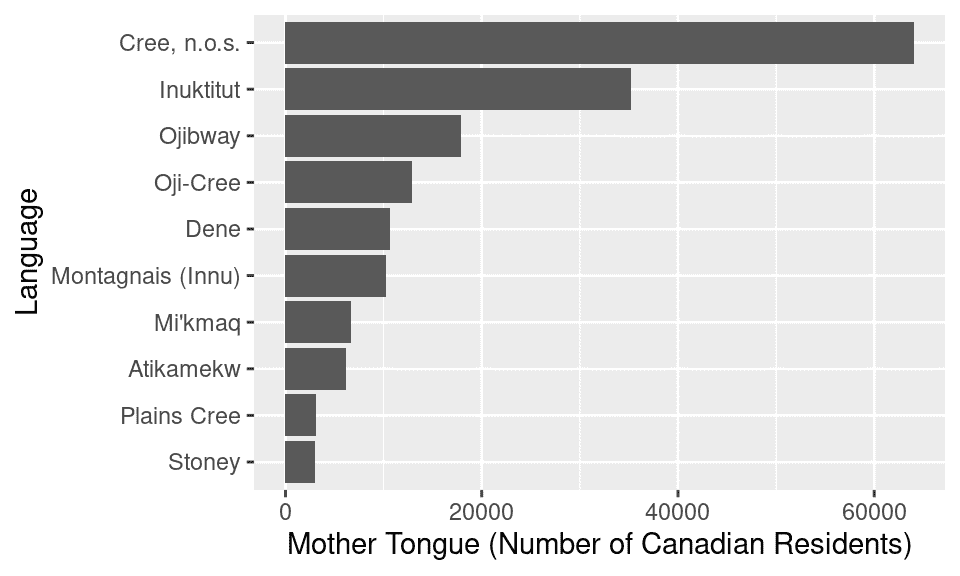

# 第一章 R 和 Tidyverse

> 原文：[`datasciencebook.ca/intro.html`](https://datasciencebook.ca/intro.html)

## 1.1 概述

本章介绍了数据科学和 R 编程语言。目标是从一开始就让你动手实践！我们将进行整个数据分析，并在过程中介绍不同类型的数据分析问题、R 中的一些基本编程概念以及加载数据、清理数据和可视化数据的基础。在接下来的章节中，我们将更详细地探讨这些步骤；但就目前而言，让我们跳入看看我们可以用数据科学做多少事情！

## 1.2 章节学习目标

到本章结束时，读者将能够做到以下事项：

+   识别不同类型的数据分析问题，并将问题分类到正确的类型。

+   将 `tidyverse` 包加载到 R 中。

+   使用 `read_csv` 读取表格数据。

+   使用赋值符号在 R 中创建新变量和对象。

+   使用 `filter`、`select`、`arrange` 和 `slice` 创建和组织表格数据的子集。

+   使用 `mutate` 添加和修改表格数据中的列。

+   使用 `ggplot` 条形图可视化数据。

+   使用 `?` 访问 R 中的帮助和文档工具。

## 1.3 加拿大语言数据集

在本章中，我们将全面分析加拿大居民在家使用的语言数据集（图 1.1）。加拿大存在许多拥有自己文化和语言的土著民族；这些语言通常在加拿大是独特的，在世界其他地方没有使用过（加拿大统计局 2018）。遗憾的是，殖民化导致了这些语言中的许多丢失。例如，在加拿大的寄宿学校中，几代人都不被允许说他们的母语（一个人在童年时期学习的第一语言）。殖民者还更改了他们所谓的“发现”的地方名称（K. Wilson 2018）。这些行为严重损害了加拿大土著语言的连续性，一些语言被认为是“濒危”的，因为很少有人报告说他们使用这些语言。欲了解更多信息，请参阅加拿大地理杂志的文章“Mapping Indigenous Languages in Canada”（Walker 2017）、“They Came for the Children: Canada, Aboriginal peoples, and Residential Schools”（加拿大和解委员会 2012）以及加拿大和解委员会的“Calls to Action”（加拿大和解委员会 2015）。


图 1.1：加拿大地图。

我们在本章中将研究的数据集来自 [`canlang` R 数据包](https://ttimbers.github.io/canlang/) (Timbers 2020)，该数据包收集了 2016 年加拿大人口普查期间的人口语言数据 (加拿大统计局 2016a)。在这个数据集中，记录了 214 种语言，每种语言有六个不同的属性：

1.  `category`: 高级语言类别，描述该语言是否是加拿大的官方语言、原住民（即土著）语言，或非官方和非原住民语言。

1.  `language`: 该语言的名字。

1.  `mother_tongue`: 报告将该语言作为母语的加拿大居民人数。母语通常是指一个人从出生以来接触到的语言。

1.  `most_at_home`: 报告在家中最常使用该语言的加拿大居民人数。

1.  `most_at_work`: 报告在工作中最常使用该语言的加拿大居民人数。

1.  `lang_known`: 报告了解该语言的加拿大居民人数。

根据人口普查，有超过 60 种原住民语言在加拿大被报告为使用语言。假设我们想知道哪些是最常见的；那么我们可能会提出以下问题，我们希望使用我们的数据来回答：

*在 2016 年，加拿大哪些十种原住民语言最常被报告为母语，以及有多少人使用每种语言？*

> **注意：** 没有对数据和问题领域的深入理解，就无法进行数据科学。在这本书中，我们简化了示例中使用的数据集，以便集中讨论方法和基本概念。但在现实生活中，没有领域专家，你无法也不应该进行数据科学。或者，在您自己的专业领域内进行数据科学是很常见的！记住，当您处理数据时，考虑数据的收集方式是至关重要的，这会影响您得出的结论。如果您的数据存在偏差，那么您的结果也会存在偏差！

## 1.4 提出问题

每一个好的数据分析都始于一个 *问题*——就像上面提到的——您希望通过数据来回答。实际上，关于数据的 *类型* 问题有很多：描述性、探索性、预测性、推理性、因果性和机制性，所有这些都在表 1.1 中定义。尽早仔细地制定问题——并正确识别其类型——将指导您的整体分析方法以及选择适当的工具。

表 1.1：数据分析问题类型 (Leek 和 Peng 2015；Peng 和 Matsui 2015)。

| 问题类型 | 描述 | 示例 |
| --- | --- | --- |
| 描述 | 一个询问关于数据集的总结特征而不进行解释的问题（即报告事实）。 | 加拿大的每个省和地区有多少人居住？ |
| 探索 | 一个询问单个数据集中是否存在模式、趋势或关系的问题。通常用于提出未来研究的假设。 | 在收集的关于加拿大 2,000 名居住者的数据集中，政党投票是否会随着财富指标而变化？ |
| 预测 | 一个询问关于预测个人（人或事物）的测量或标签的问题。重点是哪些事物预测某些结果，而不是结果的原因。 | 在下一次加拿大选举中，某人会投票给哪个政党？ |
| 推断 | 一个寻找单个数据集中模式、趋势或关系的问题，并且还要求量化这些发现对更广泛群体的适用性。 | 加拿大所有居住者的财富指标是否会影响政党投票？ |
| 因果 | 一个询问是否改变一个因素会导致在更广泛的群体中另一个因素平均发生变化的问题。 | 加拿大选举中财富是否会导致对某个政治党的投票？ |
| 机制 | 一个询问观察到的模式、趋势或关系的潜在机制的问题（即它是如何发生的？） | 财富是如何导致在加拿大选举中对某个政治党的投票的？ |

在这本书中，你将学习回答前四种类型问题的技术：描述性、探索性、预测性和推断性；因果和机制问题超出了本书的范围。特别是，你将学习如何应用以下分析工具：

1.  **总结：**计算和报告与数据集相关的聚合值。总结通常用于回答描述性问题，偶尔也有助于回答探索性问题。例如，你可能使用总结来回答以下问题：*在这个数据集中，跑者的平均比赛时间是多少？*总结工具在第二章 2 和第三章 3 中详细介绍，但它们在整本书中都会定期出现。

1.  **可视化：**图形化地绘制数据。可视化通常用于回答描述性和探索性问题，但在回答表格 1.1 中所有类型的问题中都起着关键的支持作用。例如，你可能使用可视化来回答以下问题：*在这个数据集中，跑者的比赛时间和年龄之间是否存在任何关系？*这将在第四章 4 中详细介绍，但同样会在整本书中定期出现。

1.  **分类**：预测新观察值的类别或类别。分类用于回答预测性问题。例如，你可能使用分类来回答以下问题：*给定肿瘤平均细胞面积和周长的测量值，肿瘤是良性还是恶性的？*分类在第五章和第六章中有所介绍。

1.  **回归**：预测新观察值的定量值。回归也用于回答预测性问题。例如，你可能使用回归来回答以下问题：*一个体重 50kg 的 20 岁跑者的比赛时间会是多少？*回归在第七章和第八章中有所介绍。

1.  **聚类**：在数据集中找到先前未知/未标记的子组。聚类通常用于回答探索性问题。例如，你可能使用聚类来回答以下问题：*在亚马逊上，哪些产品通常一起购买？*聚类在第九章中有所介绍。

1.  **估计**：从大量项目中测量少量项目并就大组的平均值或比例做出良好的猜测。估计用于回答推断性问题。例如，你可能使用估计来回答以下问题：*在 100 名加拿大人的手机拥有率调查中，整个加拿大人口中拥有安卓手机的比例是多少？*估计在第十章中有所介绍。

参考表 1.1，我们关于土著语言的疑问是一个*描述性问题*的例子：我们正在总结数据集的特征，而不进行进一步的解释。根据上面的列表，看起来我们应该使用可视化，也许还有一些总结来回答这个问题。因此，在本章的剩余部分，我们将努力制作一个可视化，展示加拿大最常见的十种土著语言及其相关的计数，这些数据来自 2016 年的人口普查。

## 1.5 加载表格数据集

数据集在本质上是一个由数字和字符组成的结构化集合。除此之外，实际上并没有严格的规则；数据集可以以许多不同的形式出现！然而，你在野外最常见的数据集形式可能是*表格数据*。想象一下微软 Excel 中的电子表格：表格数据是矩形形状，类似于电子表格，如图 1.2 所示。在这本书中，我们将主要关注表格数据。

由于我们在本书中使用 R 进行数据分析，因此我们首先要做的是将数据加载到 R 中。当我们将表格数据加载到 R 中时，它表示为*数据框*对象。图 1.2 显示了 R 数据框与电子表格非常相似。我们将行称为**观测值**；这些是我们收集数据的单个对象。在图 1.2 中，观测值是语言。我们将列称为**变量**；这些是每个观测值的特征。在图 1.2 中，变量是语言的类别、名称、母语使用者数量等。



图 1.2：R 中的电子表格与数据框对比。

我们将学习如何将第一种数据文件加载到 R 中作为数据框，这种格式是*逗号分隔值*（简称`.csv`）。这些文件的名称以`.csv`结尾，可以使用常见的电子表格程序如 Microsoft Excel 和 Google Sheets 打开和保存。例如，名为`can_lang.csv`的`.csv`文件包含在[本书的代码中](https://github.com/UBC-DSCI/introduction-to-datascience/tree/master/data)。如果我们用纯文本编辑器（如记事本，它只显示没有格式的文本）打开此数据，我们会看到每行单独一行，表中的每个条目由逗号分隔：

```r
category,language,mother_tongue,most_at_home,most_at_work,lang_known
Aboriginal languages,"Aboriginal languages, n.o.s.",590,235,30,665
Non-Official & Non-Aboriginal languages,Afrikaans,10260,4785,85,23415
Non-Official & Non-Aboriginal languages,"Afro-Asiatic languages, n.i.e.",1150,44
Non-Official & Non-Aboriginal languages,Akan (Twi),13460,5985,25,22150
Non-Official & Non-Aboriginal languages,Albanian,26895,13135,345,31930
Aboriginal languages,"Algonquian languages, n.i.e.",45,10,0,120
Aboriginal languages,Algonquin,1260,370,40,2480
Non-Official & Non-Aboriginal languages,American Sign Language,2685,3020,1145,21
Non-Official & Non-Aboriginal languages,Amharic,22465,12785,200,33670
```

要将此数据加载到 R 中以便我们可以对其进行操作（例如，执行分析或创建数据可视化），我们需要使用一个*函数*。函数是 R 中的一个特殊单词，它接受指令（我们称之为*参数*）并执行某些操作。我们将用于将`.csv`文件加载到 R 中的函数称为`read_csv`。在其最基本的使用场景中，`read_csv`期望数据文件：

+   有列名（或*标题*），

+   使用逗号（`,`）分隔列，

+   没有行名。

下面您将看到用于使用`read_csv`函数将数据加载到 R 中的代码。请注意，`read_csv`函数不包括在 R 的基本安装中，这意味着它不是安装 R 时可以直接使用的首要函数之一。因此，在您可以使用它之前，您需要从其他地方加载它。我们将从该地方加载的地方称为 R *包*。R 包是一组函数的集合，一旦加载，就可以在除了内置 R 包函数之外使用。`read_csv`函数可以通过使用`library`函数加载[`tidyverse` R 包](https://tidyverse.tidyverse.org/)（Wickham 2021b; Wickham et al. 2019)来访问。`tidyverse`包包含许多函数，我们将在这本书的整个过程中使用这些函数来加载数据、清理数据、整理数据和可视化数据。

```r
library(tidyverse)
```

```r
## ── Attaching core tidyverse packages ──────────────────────── tidyverse 2.0.0 ──
## ✔ dplyr     1.1.2     ✔ readr     2.1.4
## ✔ forcats   1.0.0     ✔ stringr   1.5.0
## ✔ ggplot2   3.4.2     ✔ tibble    3.2.1
## ✔ lubridate 1.9.2     ✔ tidyr     1.3.0
## ✔ purrr     1.0.1     
## ── Conflicts ────────────────────────────────────────── tidyverse_conflicts() ──
## ✖ dplyr::filter() masks stats::filter()
## ✖ dplyr::lag()    masks stats::lag()
## ℹ Use the conflicted package (<http://conflicted.r-lib.org/>) to force all conflicts to become errors
```

> **注意：**你可能已经注意到，我们在代码行下方得到了一些关于附加包和冲突的额外输出。这些都是 R 中的**消息**示例，它们提供了用户可能需要知道的信息。当加载`tidyverse`时，`Attaching packages`消息是自然的，因为`tidyverse`实际上会自动导入其他包，例如`dplyr`。在未来，当我们在本书中加载`tidyverse`时，我们将关闭这些消息，以帮助提高书籍的可读性。`Conflicts`消息在这种情况下也是完全正常的。这条消息告诉你，来自不同包的函数是否具有相同的名称，这可能会让 R 感到困惑。例如，在这种情况下，`dplyr`包和`stats`包都提供了一个名为`filter`的函数。上面的消息（`dplyr::filter() masks stats::filter()`）是 R 告诉你它将默认使用这个函数的`dplyr`包版本。所以如果你使用`filter`函数，你将使用`dplyr`版本。为了使用`stats`版本，你需要使用它的全名`stats::filter`。消息不是错误，所以通常你不需要在看到消息时采取行动；但你应该始终阅读消息，并批判性地思考它的含义以及你是否需要采取任何行动。

在加载`tidyverse`包之后，我们可以调用`read_csv`函数，并给它传递一个单一参数：文件的名称，即`"can_lang.csv"`。我们必须在文件名和其他我们在代码中使用的字母和单词周围加上引号，以区分构成 R 编程语言的特殊单词（如函数！）。文件名是我们唯一需要提供的参数，因为我们的文件满足了`read_csv`函数在默认使用场景下期望的所有其他条件。图 1.3 描述了如何使用`read_csv`将数据读入 R。


图 1.3：`read_csv`函数的语法。

```r
read_csv("data/can_lang.csv")
```

```r
## # A tibble: 214 × 6
##    category          language mother_tongue most_at_home most_at_work lang_known
##    <chr>             <chr>            <dbl>        <dbl>        <dbl>      <dbl>
##  1 Aboriginal langu… Aborigi…           590          235           30        665
##  2 Non-Official & N… Afrikaa…         10260         4785           85      23415
##  3 Non-Official & N… Afro-As…          1150          445           10       2775
##  4 Non-Official & N… Akan (T…         13460         5985           25      22150
##  5 Non-Official & N… Albanian         26895        13135          345      31930
##  6 Aboriginal langu… Algonqu…            45           10            0        120
##  7 Aboriginal langu… Algonqu…          1260          370           40       2480
##  8 Non-Official & N… America…          2685         3020         1145      21930
##  9 Non-Official & N… Amharic          22465        12785          200      33670
## 10 Non-Official & N… Arabic          419890       223535         5585     629055
## # ℹ 204 more rows
```

> **注意：**还有一个名为`read.csv`的函数也可以加载 csv 文件。在这本书中，我们将**始终**使用`read_csv`，因为它被设计成与其他所有`tidyverse`函数很好地协同工作，我们将广泛使用这些函数。请小心不要意外使用`read.csv`，因为它可能会在你的代码中引起一些难以追踪的错误！

## 1.6 R 中的命名事项

当我们使用`read_csv`加载 2016 年加拿大人口普查语言数据时，我们没有给这个数据框命名。因此，数据只是打印在屏幕上，我们无法对其进行任何其他操作。这并不太有用。更有用的事情是为`read_csv`输出的数据框命名，这样我们就可以在以后的分析和可视化中引用它。

在 R 中为值分配名称的方法是通过 *赋值符号* `<-`。在赋值符号的左侧，你放置你想要使用的名称，而在赋值符号的右侧，你放置你想要名称引用的值。名称可以用来引用 R 中的几乎所有内容，例如数字、单词（也称为字符 *字符串*），以及数据框！下面，我们将 `my_number` 设置为 `3`（`1+2` 的结果），并将 `name` 设置为字符串 `"Alice"`。

```r
my_number <- 1 + 2
name <- "Alice"
```

注意，当我们使用赋值符号 `<-` 在 R 中为某物命名时，我们不需要用引号包围我们创建的名称。这是因为我们正式告诉 R，这个特殊的词表示右侧的值。只有作为赋值符号右侧 *值* 的字符和单词——例如，我们之前指定的文件名 `"data/can_lang.csv"` 或上面的 `"Alice"`——需要用引号包围。

在进行赋值之后，我们可以用我们创建的特殊名称词来代替它们的值。例如，如果我们稍后想对值 `3` 做些操作，我们只需使用 `my_number` 即可。让我们尝试将 2 加到 `my_number` 上；你会看到 R 只是将其解释为将 3 和 2 相加：

```r
my_number + 2
```

```r
## [1] 5
```

对象名称可以由字母、数字、点 `.` 和下划线 `_` 组成。其他符号不会起作用，因为它们在 R 中有自己的含义。例如，`-` 是减号；如果我们尝试使用 `-` 符号分配名称，R 将会抱怨，并且我们会得到一个错误！

```r
my-number <- 1
```

```r
Error in my - number <- 1 : object 'my' not found
```

在 R 中为对象命名有一些约定。在命名对象时，我们建议只使用小写字母、数字和下划线 `_` 来分隔名称中的单词。R 是区分大小写的，这意味着 `Letter` 和 `letter` 在 R 中是两个不同的对象。你还应该尝试给你的对象赋予有意义的名称。例如，你可以将数据框命名为 `x`。然而，使用更有意义的术语，如 `language_data`，将有助于你记住代码中每个名称代表的内容。我们建议遵循 *Tidyverse 风格指南* 中概述的 Tidyverse 命名约定（Wickham 2020）。现在，让我们使用赋值符号将名称 `can_lang` 分配给从 `read_csv` 获取的 2016 年加拿大人口普查语言数据框。

```r
can_lang <- read_csv("data/can_lang.csv")
```

等一下，这次什么都没发生！我们的数据在哪里？实际上，确实发生了某些事情：数据已经被加载进来，并且现在与名称 `can_lang` 相关联。我们可以使用这个名称来访问数据框并对其进行操作。例如，我们可以输入数据框的名称来在屏幕上打印前几行。你也会看到在顶部打印了观测数（即行数）和变量（即列数）。以这种方式打印数据框的前几行是一种快速了解数据框包含内容的便捷方法。

```r
can_lang
```

```r
## # A tibble: 214 × 6
##    category          language mother_tongue most_at_home most_at_work lang_known
##    <chr>             <chr>            <dbl>        <dbl>        <dbl>      <dbl>
##  1 Aboriginal langu… Aborigi…           590          235           30        665
##  2 Non-Official & N… Afrikaa…         10260         4785           85      23415
##  3 Non-Official & N… Afro-As…          1150          445           10       2775
##  4 Non-Official & N… Akan (T…         13460         5985           25      22150
##  5 Non-Official & N… Albanian         26895        13135          345      31930
##  6 Aboriginal langu… Algonqu…            45           10            0        120
##  7 Aboriginal langu… Algonqu…          1260          370           40       2480
##  8 Non-Official & N… America…          2685         3020         1145      21930
##  9 Non-Official & N… Amharic          22465        12785          200      33670
## 10 Non-Official & N… Arabic          419890       223535         5585     629055
## # ℹ 204 more rows
```

## 1.7 使用 `filter` & `select` 创建数据框的子集

现在我们已经将数据加载到 R 中，我们可以开始整理数据，以找到在 2016 年作为加拿大母语的十个最常报告的土著语言。特别是，我们将构建一个包含在 `mother_tongue` 列中计数最大的十个土著语言的表格。`tidyverse` 包中的 `filter` 和 `select` 函数将帮助我们。`filter` 函数允许你获取具有特定值的行子集，而 `select` 函数允许你获取列子集。因此，我们可以使用 `filter` 过滤行以提取数据集中的土著语言，然后使用 `select` 获取我们想要包含在表格中的列。

### 1.7.1 使用 `filter` 提取行

观察上面的 `can_lang` 数据，我们看到 `category` 列包含不同的高级语言类别，包括“土著语言”、“非官方和非土著语言”和“官方语言”。为了回答我们的问题，我们想要过滤我们的数据集，以便我们只关注“土著语言”类别中的语言。

我们可以使用 `filter` 函数从数据帧中获取具有所需值的行子集。图 1.4 概述了使用 `filter` 需要指定的参数。`filter` 的第一个参数是数据帧对象的名称，`can_lang`。第二个参数是用于过滤行的逻辑语句。逻辑语句的结果为 `TRUE` 或 `FALSE`；`filter` 只保留逻辑语句评估为 `TRUE` 的行。例如，在我们的分析中，我们只对“土著语言”高级类别中的语言感兴趣。我们可以使用等价运算符 `==` 来比较 `category` 列的值与 `"Aboriginal languages"` 的值；你将在第三章学习到许多其他类型的逻辑语句。类似于当我们加载数据文件并在文件名周围加上引号时，这里我们需要在 `"Aboriginal languages"` 周围加上引号。使用引号告诉 R 这是一个字符串 *值*，而不是构成 R 编程语言的特殊单词之一，或者是我们已经在编写的代码中给数据帧命名的名称之一。



图 1.4：`filter` 函数的语法。

使用这些参数，`filter` 函数返回一个包含输入数据帧所有列的数据帧，但只包含我们在逻辑过滤器语句中请求的行。

```r
aboriginal_lang <- filter(can_lang, category == "Aboriginal languages")
aboriginal_lang
```

```r
## # A tibble: 67 × 6
##    category          language mother_tongue most_at_home most_at_work lang_known
##    <chr>             <chr>            <dbl>        <dbl>        <dbl>      <dbl>
##  1 Aboriginal langu… Aborigi…           590          235           30        665
##  2 Aboriginal langu… Algonqu…            45           10            0        120
##  3 Aboriginal langu… Algonqu…          1260          370           40       2480
##  4 Aboriginal langu… Athabas…            50           10            0         85
##  5 Aboriginal langu… Atikame…          6150         5465         1100       6645
##  6 Aboriginal langu… Babine …           110           20           10        210
##  7 Aboriginal langu… Beaver             190           50            0        340
##  8 Aboriginal langu… Blackfo…          2815         1110           85       5645
##  9 Aboriginal langu… Carrier           1025          250           15       2100
## 10 Aboriginal langu… Cayuga              45           10           10        125
## # ℹ 57 more rows
```

在 R 中使用函数后检查输出是一个好习惯。我们可以看到原始的 `can_lang` 数据集包含 214 行，有多种 `category`。数据框 `aboriginal_lang` 包含 67 行，看起来它只包含 `category` 列中的“土著语言”语言。所以看起来函数给出了我们想要的结果！

### 1.7.2 使用 `select` 提取列

现在，让我们使用 `select` 从这个数据框中提取 `language` 和 `mother_tongue` 列。图 1.5 展示了 `select` 函数的语法。为了提取这些列，我们需要向 `select` 函数提供三个参数。第一个参数是数据框对象的名称，在这个例子中是 `aboriginal_lang`。第二个和第三个参数是我们想要选择的列名：`language` 和 `mother_tongue`。传递这三个参数后，`select` 函数将返回两个列（我们请求的 `language` 和 `mother_tongue` 列）作为数据框。这段代码也是一个很好的例子，说明了为什么在 R 中能够命名东西是有用的：我们可以看到，我们正在使用我们之前 `filter` 步骤的结果（我们将其命名为 `aboriginal_lang`）在分析的下一步中！



图 1.5：`select` 函数的语法。

```r
selected_lang <- select(aboriginal_lang, language, mother_tongue)
selected_lang
```

```r
## # A tibble: 67 × 2
##    language                     mother_tongue
##    <chr>                                <dbl>
##  1 Aboriginal languages, n.o.s.           590
##  2 Algonquian languages, n.i.e.            45
##  3 Algonquin                             1260
##  4 Athabaskan languages, n.i.e.            50
##  5 Atikamekw                             6150
##  6 Babine (Wetsuwet'en)                   110
##  7 Beaver                                 190
##  8 Blackfoot                             2815
##  9 Carrier                               1025
## 10 Cayuga                                  45
## # ℹ 57 more rows
```

## 1.8 使用 `arrange` 排序和 `slice` 通过索引号选择行

我们已经使用 `filter` 和 `select` 获取了一个只包含数据集中土著语言的表格及其相关计数。然而，我们想知道**十种**最常使用的语言。作为下一步，我们将按从大到小的顺序对 `mother_tongue` 列进行排序，然后只提取前十个行。这就是 `arrange` 和 `slice` 函数大显身手的地方！

`arrange` 函数允许我们根据特定列的值对数据框的行进行排序。图 1.6 详细说明了使用 `arrange` 函数需要指定哪些参数。我们需要将数据框作为第一个参数传递给此函数，并将排序变量作为第二个参数。由于我们想选择最常报告为母语的十种土著语言，我们将使用 `arrange` 函数按 `mother_tongue` 列对 `selected_lang` 数据框中的行进行排序。我们希望按降序（从大到小）排列行，因此在使用它作为参数之前，我们将列传递给 `desc` 函数。


图 1.6：`arrange` 函数的语法。

```r
arranged_lang <- arrange(selected_lang, by = desc(mother_tongue))
arranged_lang
```

```r
## # A tibble: 67 × 2
##    language          mother_tongue
##    <chr>                     <dbl>
##  1 Cree, n.o.s.              64050
##  2 Inuktitut                 35210
##  3 Ojibway                   17885
##  4 Oji-Cree                  12855
##  5 Dene                      10700
##  6 Montagnais (Innu)         10235
##  7 Mi'kmaq                    6690
##  8 Atikamekw                  6150
##  9 Plains Cree                3065
## 10 Stoney                     3025
## # ℹ 57 more rows
```

接下来，我们将使用 `slice` 函数，该函数根据行号选择行。由于我们想选择最常见的十种语言，我们将使用参数 `1:10` 指示我们想要第 1 到 10 行。

```r
ten_lang <- slice(arranged_lang, 1:10)
ten_lang
```

```r
## # A tibble: 10 × 2
##    language          mother_tongue
##    <chr>                     <dbl>
##  1 Cree, n.o.s.              64050
##  2 Inuktitut                 35210
##  3 Ojibway                   17885
##  4 Oji-Cree                  12855
##  5 Dene                      10700
##  6 Montagnais (Innu)         10235
##  7 Mi'kmaq                    6690
##  8 Atikamekw                  6150
##  9 Plains Cree                3065
## 10 Stoney                     3025
```

## 1.9 使用 `mutate` 添加和修改列

回想一下，我们的数据分析问题涉及说前十个最常报告的原住民语言作为母语的加拿大人的 *数量*，而 `ten_lang` 数据框确实包含这些数量……但也许，看到这些数字后，我们开始对与每个数量相关的加拿大 *百分比* 产生了好奇心。在回答第一个问题时，通常会提出新的数据分析问题——所以不要害怕，去探索！为了回答这个附带问题，我们需要将 `mother_tongue` 列中的每个计数除以 2016 年人口普查的总加拿大人口——即 35,151,728，然后乘以 100。我们可以使用 `mutate` 函数执行此计算。我们将 `ten_lang` 数据框作为其第一个参数传递，然后在第二个参数中指定计算百分比的方程。通过在方程的左侧使用新的变量名，我们将在数据框中创建一个新列；如果我们使用现有的名称，我们将修改该变量。在这种情况下，我们将选择创建一个名为 `mother_tongue_percent` 的新列。

```r
canadian_population = 35151728
ten_lang_percent = mutate(ten_lang, mother_tongue_percent = 100 * mother_tongue / canadian_population)
ten_lang_percent
```

```r
## # A tibble: 10 × 3
##    language          mother_tongue mother_tongue_percent
##    <chr>                     <dbl>                 <dbl>
##  1 Cree, n.o.s.              64050               0.182  
##  2 Inuktitut                 35210               0.100  
##  3 Ojibway                   17885               0.0509 
##  4 Oji-Cree                  12855               0.0366 
##  5 Dene                      10700               0.0304 
##  6 Montagnais (Innu)         10235               0.0291 
##  7 Mi'kmaq                    6690               0.0190 
##  8 Atikamekw                  6150               0.0175 
##  9 Plains Cree                3065               0.00872
## 10 Stoney                     3025               0.00861
```

`ten_lang_percent` 数据框显示，在 `ten_lang` 数据框中的十个原住民语言中，作为母语被加拿大人口中的 0.008% 到 0.18% 的人使用。

## 1.10 使用可视化探索数据

我们在 1.8 节中生成的 `ten_lang` 表格回答了我们的初始数据分析问题。我们完成了吗？嗯，还不完全是；表格几乎从来不是向观众展示您分析结果的最佳方式。即使是只有两列的 `ten_lang` 表格也带来了一些困难：例如，您必须非常仔细地检查表格，才能对每种语言的说话者相对数量有一个概念。当您转向更复杂的分析时，这个问题只会变得更糟。相比之下，一种 *可视化* 会以更容易理解的方式传达这些信息。可视化是总结信息以帮助您有效地与观众沟通的出色工具，创建有效的数据可视化是任何数据分析的必要组成部分。在本节中，我们将开发一个可视化，展示在 2016 年最常报告为加拿大母语的十个原住民语言，以及说每种语言的人数。

### 1.10.1 使用 `ggplot` 创建条形图

在我们的数据集中，我们可以看到`language`和`mother_tongue`位于不同的列（或变量）中。此外，每种语言都有一个单独的行（或观察）。因此，数据是以我们所说的*整洁数据*格式存在的。整洁数据是一个基本概念，将在本书的剩余部分中成为一个重要的焦点：`tidyverse`中的许多函数都需要整洁数据，包括我们很快将用于可视化的`ggplot`函数。我们将在第三章中正式介绍整洁数据。

我们将制作一个条形图来可视化我们的数据。条形图是一种图表，其中条形的长度代表某些值，如计数或比例。我们将使用`mother_tongue`和`language`列从我们的`ten_lang`数据框中制作条形图。要使用`ggplot`函数创建这两个变量的条形图，我们必须指定数据框、要放在 x 轴和 y 轴上的变量以及要创建的图表类型。`ggplot`函数及其常见用法如图 1.7 所示。图 1.8 显示了按照图 1.7 中的说明生成的结果条形图。



图 1.7：使用`ggplot`函数创建条形图。

```r
ggplot(ten_lang, aes(x = language, y = mother_tongue)) +
 geom_bar(stat = "identity")
```



图 1.8：加拿大居民最常报告为母语的十种土著语言的条形图。注意，这个可视化尚未完成；仍有改进的空间。

> **注意：** 大多数情况下，R 中的单个表达式必须包含在单行代码中。然而，确实存在一些情况下，你可以让单个 R 表达式跨越多行。上面就是一个例子：在这里，R 知道一行不能以`+`符号结束，因此它会继续读取下一行以确定`+`符号右侧应该是什么。当然，我们可以将所有添加的层放在一行代码中，但将它们分散在多行中对于代码的可读性有很大帮助。

### 1.10.2 格式化 ggplot 对象

很令人兴奋的是，我们已经有能力可视化我们的数据来帮助我们回答问题，但我们还没有完成！我们可以（并且应该）做更多来提高我们创建的数据可视化的可解释性。例如，默认情况下，R 使用列名作为轴标签。通常这些列名没有足够的信息来描述列中的变量。我们真的应该用更信息的标签来替换这个默认设置。对于上面的例子，R 使用列名 `mother_tongue` 作为 y 轴的标签，但大多数人不会知道这是什么。即使他们知道，他们也不知道我们是如何测量这个变量的，或者测量是在哪个群体上进行的。一个读作“母语（加拿大居民数量）”的轴标签将提供更多信息。

在我们创建的 `ggplot` 可视化中添加额外的层是一种常见且简单的方法来改进和细化我们的数据可视化。使用 `+` 符号向 `ggplot` 对象中添加新层。例如，我们可以使用 `xlab`（x 轴标签的简称）和 `ylab`（y 轴标签的简称）函数来添加层，在这些层中我们指定对 x 轴和 y 轴有意义的和信息的标签。再次强调，由于我们正在将单词（例如，“母语（加拿大居民数量）”作为 `xlab` 和 `ylab` 的参数，所以我们用双引号包围它们。我们可以添加更多层来进一步格式化图表，我们将在第四章节中探讨这些。

```r
ggplot(ten_lang, aes(x = language, y = mother_tongue)) +
 geom_bar(stat = "identity") +
 xlab("Language") +
 ylab("Mother Tongue (Number of Canadian Residents)")
```



图 1.9：加拿大居民报告的十种最常见的土著语言的条形图，带有 x 轴和 y 轴标签。请注意，这个可视化尚未完成；还有改进的空间。

结果如图 1.9 所示。这已经是一个相当大的改进了！让我们解决图 1.9 中可视化遇到的下一个主要问题：重叠的 x 轴标签，这目前使得阅读不同的语言名称变得困难。一个解决方案是将图表旋转，使条形水平而不是垂直。为了实现这一点，我们将交换 x 和 y 坐标轴：

```r
ggplot(ten_lang, aes(x = mother_tongue, y = language)) +
 geom_bar(stat = "identity") +
 xlab("Mother Tongue (Number of Canadian Residents)") +
 ylab("Language")
```



图 1.10：加拿大居民报告的十种最常见的土著语言的水平条形图。这个可视化没有更严重的问题，但还可以进一步改进。

如图 1.10 所示，又迈出了重要的一步！可视化中不再存在严重的问题。现在，我们需要对可视化进行细化，使其更适合回答我们在本章早期提出的问题。例如，可以通过根据报告每种语言的加拿大居民数量来组织条形，而不是按字母顺序排列，从而使可视化更加透明。我们可以使用 `reorder` 函数重新排列条形，该函数根据第二个变量（此处为 `mother_tongue`）的值对变量（此处为 `language`）进行排序。

```r
ggplot(ten_lang, aes(x = mother_tongue,
 y = reorder(language, mother_tongue))) +
 geom_bar(stat = "identity") +
 xlab("Mother Tongue (Number of Canadian Residents)") +
 ylab("Language")
```


图 1.11：按顺序重新排列条形图，显示加拿大居民最常报告的十种土著语言。

图 1.11 提供了一个非常清晰且组织良好的答案，回答了我们的原始问题；我们可以看到根据 2016 年加拿大人口普查，最常报告的十种土著语言是什么，以及有多少人使用每种语言。例如，我们可以看到最常报告的土著语言是 Cree n.o.s.，有超过 60,000 名加拿大居民将其报告为他们的母语。

> **注意：** “n.o.s.” 表示 “未另作说明”，因此 Cree n.o.s. 指的是报告 Cree 为其母语的个人。在此数据集中，Cree 语言包括以下类别：Cree n.o.s.、Swampy Cree、Plains Cree、Woods Cree 以及一个“未在其他地方包括的 Cree”类别（包括 Moose Cree、Northern East Cree 和 Southern East Cree）(加拿大统计局 2016b)。

### 1.10.3 整合所有内容

在下面的代码块中，我们将本章的所有内容整合在一起，进行了一些修改。特别是，我们实际上跳过了上面所做的 `select` 步骤；由于你在 `ggplot` 函数中指定了要绘制的变量名称，因此创建可视化时实际上不需要提前选择列。我们还在下面的许多代码行旁边提供了 *注释* 使用井号 `#`。当 R 看到井号 `#` 时，它将忽略该符号之后该行上的所有文本。因此，你可以使用注释来解释代码行以供他人参考，也许更重要的是，供未来的你参考！养成注释代码的习惯以改善其可读性是一个好习惯。

这个练习展示了 R 的强大功能。在相对较少的代码行中，我们执行了整个数据科学工作流程，并使用高度有效的数据可视化！我们提出了一个问题，将数据加载到 R 中，整理数据（使用 `filter`、`arrange` 和 `slice`），并创建数据可视化来帮助我们回答问题。在本章中，你快速尝到了数据科学工作流程的滋味；继续阅读接下来的几章，以更详细地学习每个步骤！

```r
library(tidyverse)

# load the data set
can_lang <- read_csv("data/can_lang.csv")

# obtain the 10 most common Aboriginal languages
aboriginal_lang <- filter(can_lang, category == "Aboriginal languages")
arranged_lang <- arrange(aboriginal_lang, by = desc(mother_tongue))
ten_lang <- slice(arranged_lang, 1:10)

# create the visualization
ggplot(ten_lang, aes(x = mother_tongue,
 y = reorder(language, mother_tongue))) +
 geom_bar(stat = "identity") +
 xlab("Mother Tongue (Number of Canadian Residents)") +
 ylab("Language")
```



图 1.12：将所有内容整合在一起：加拿大居民最常报告为母语的十个原住民语言的条形图。

## 1.11 访问文档

`tidyverse` 包（以及更多）中有很多 R 函数，没有人能期望记住它们每一个的功能或者所有必须给出的参数。幸运的是，R 提供了 `?` 符号，它提供了一种快速调出大多数函数文档的简便方法。要使用 `?` 符号访问文档，你只需在 `?` 符号后放置你好奇的函数名称。例如，如果你忘记了 `filter` 函数的功能或者确切需要传递的参数，你可以运行以下代码：

```r
?filter
```

图 1.13 展示了将弹出的文档，包括函数的高级描述、其参数的描述以及更多内容。请注意，你现在可能会觉得文档中的某些文本有些过于技术性（例如，什么是 `dbplyr`，什么是懒数据框？）。不必担心：随着你阅读这本书，许多这些术语将会被介绍给你，而且你会逐渐但肯定地变得更加熟练于理解和导航如图 1.13 所示的文档。但请记住，文档并不是为了 *教授* 你关于函数的知识；它只是作为一个参考，来 *提醒* 你关于你已经在其他地方学习过的不同函数的参数和用法。


图 1.13：`filter` 函数的文档，包括高级描述、参数列表及其含义等。

## 1.12 练习

本章涵盖的练习材料可以在“R 和 tidyverse”行中的配套[工作表存储库](https://worksheets.datasciencebook.ca)中找到。您可以通过点击“启动 binder”按钮在浏览器中启动工作表的交互式版本。您还可以通过点击“查看工作表”预览非交互式版本的工作表。如果您决定下载工作表并在自己的机器上运行，请确保遵循第十三章中找到的计算机设置说明。这将确保工作表提供的自动反馈和指导能够按预期工作。

### 参考文献

Leek, Jeffrey, and Roger Peng. 2015\. “What Is the Question?” *Science* 347 (6228): 1314–15. Peng, Roger D, and Elizabeth Matsui. 2015\. *The Art of Data Science: A Guide for Anyone Who Works with Data*. Skybrude Consulting, LLC. [`bookdown.org/rdpeng/artofdatascience/`](https://bookdown.org/rdpeng/artofdatascience/). 统计加拿大. 2016a. “Population Census.” [`www12.statcan.gc.ca/census-recensement/2016/dp-pd/index-eng.cfm`](https://www12.statcan.gc.ca/census-recensement/2016/dp-pd/index-eng.cfm). ——. 2016b. “The Aboriginal Languages of First Nations People, Métis and Inuit.” [`www12.statcan.gc.ca/census-recensement/2016/as-sa/98-200-x/2016022/98-200-x2016022-eng.cfm`](https://www12.statcan.gc.ca/census-recensement/2016/as-sa/98-200-x/2016022/98-200-x2016022-eng.cfm). ——. 2018\. “The Evolution of Language Populations in Canada, by Mother Tongue, from 1901 to 2016.” [`www150.statcan.gc.ca/n1/pub/11-630-x/11-630-x2018001-eng.htm`](https://www150.statcan.gc.ca/n1/pub/11-630-x/11-630-x2018001-eng.htm). Timbers, Tiffany. 2020\. *canlang: Canadian Census Language Data*. [`ttimbers.github.io/canlang/`](https://ttimbers.github.io/canlang/). 加拿大和解委员会. 2012\. *他们来带走孩子：加拿大、原住民和寄宿学校*. 加拿大公共工程与政府服务部. ——. 2015\. *行动呼吁*. [`www2.gov.bc.ca/assets/gov/british-columbians-our-governments/indigenous-people/aboriginal-peoples-documents/calls_to_action_english2.pdf`](https://www2.gov.bc.ca/assets/gov/british-columbians-our-governments/indigenous-people/aboriginal-peoples-documents/calls_to_action_english2.pdf). Walker, Nick. 2017\. “Mapping Indigenous Languages in Canada.” *Canadian Geographic*. [`www.canadiangeographic.ca/article/mapping-indigenous-languages-canada`](https://www.canadiangeographic.ca/article/mapping-indigenous-languages-canada). ——. 2020\. *The Tidyverse Style Guide*. [`style.tidyverse.org/`](https://style.tidyverse.org/). ——. 2021b. *tidyverse R package*. [`tidyverse.tidyverse.org/`](https://tidyverse.tidyverse.org/). Wickham, Hadley, Mara Averick, Jennifer Bryan, Winston Chang, Lucy D’Agostino McGowan, Romain François, Garrett Grolemund, et al. 2019\. “Welcome to the tidyverse.” *Journal of Open Source Software* 4 (43): 1686. Wilson, Kory. 2018\. *Pulling Together: Foundations Guide*. BCcampus. [`opentextbc.ca/indigenizationfoundations/`](https://opentextbc.ca/indigenizationfoundations/).
