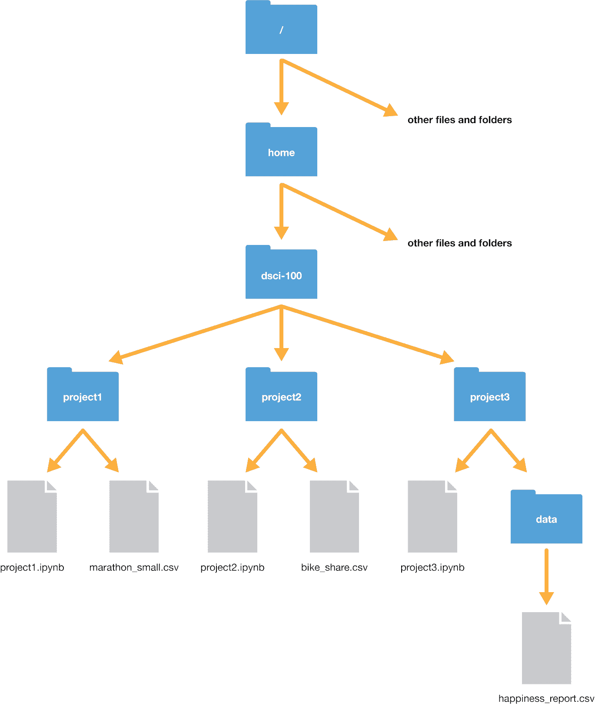
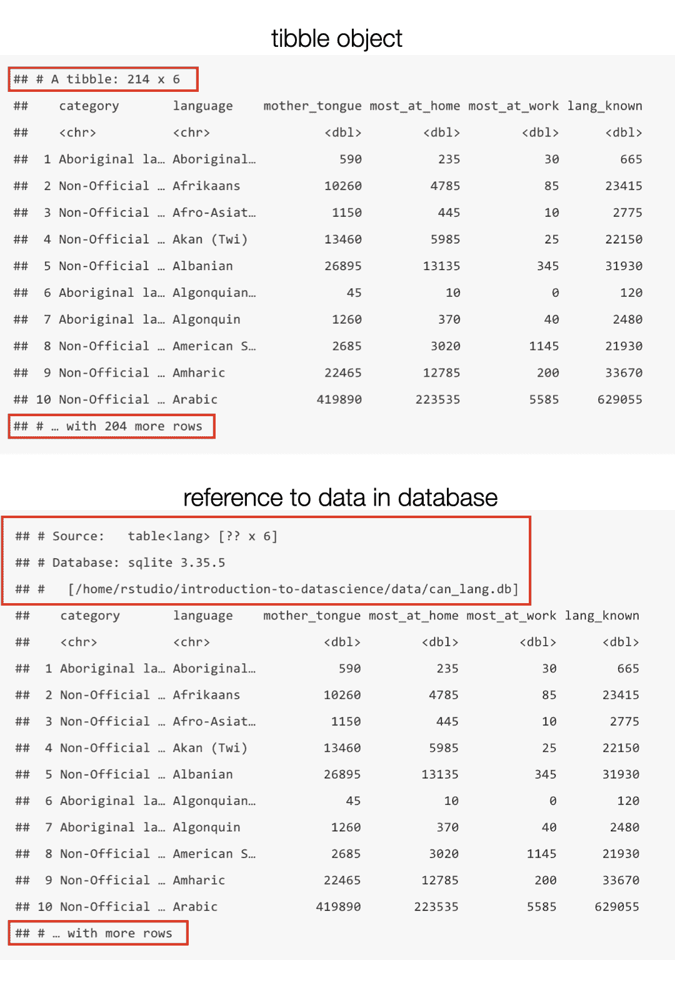
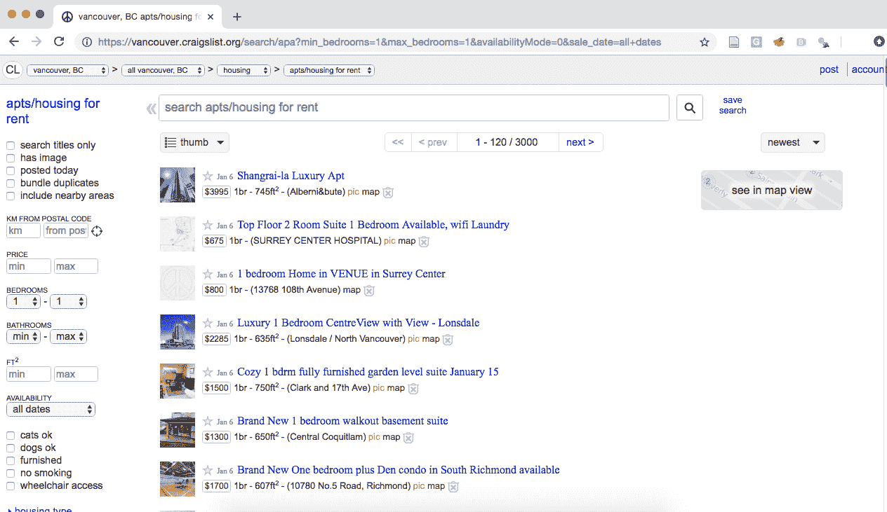
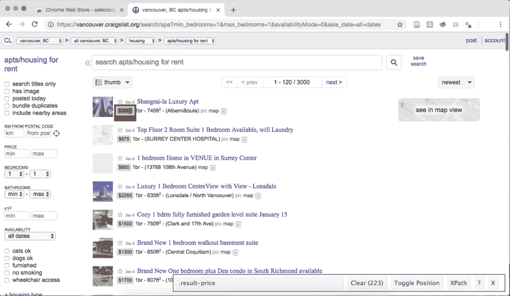
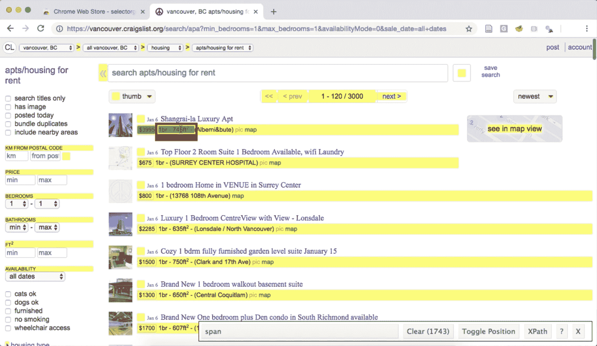
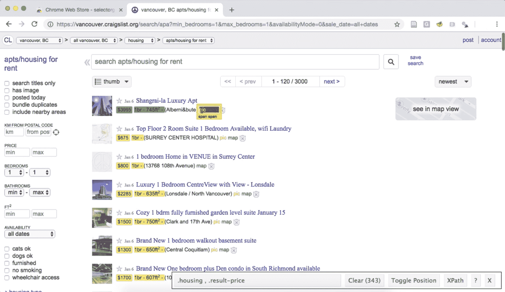
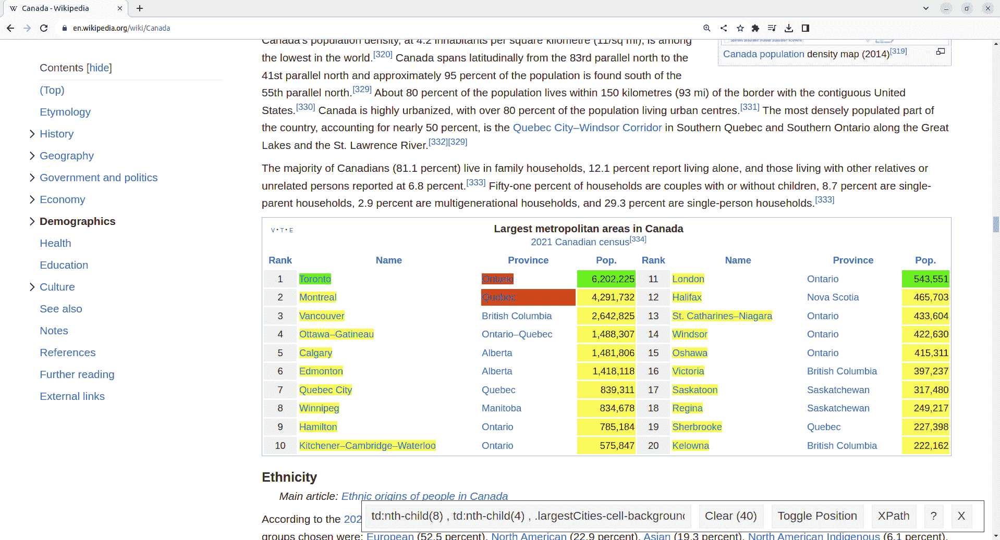
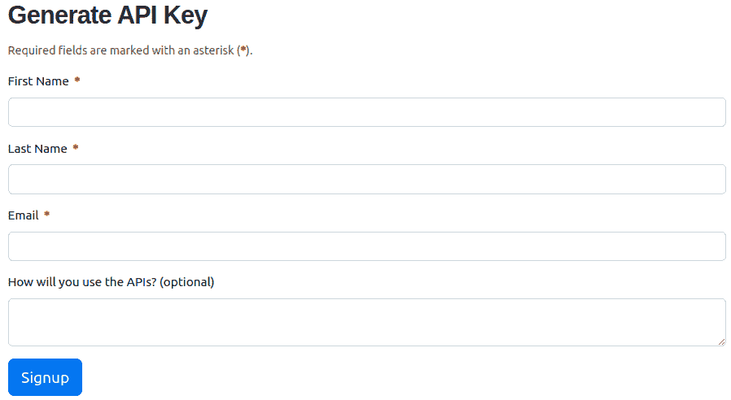
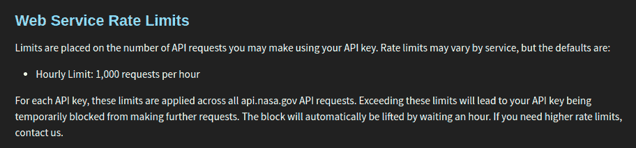
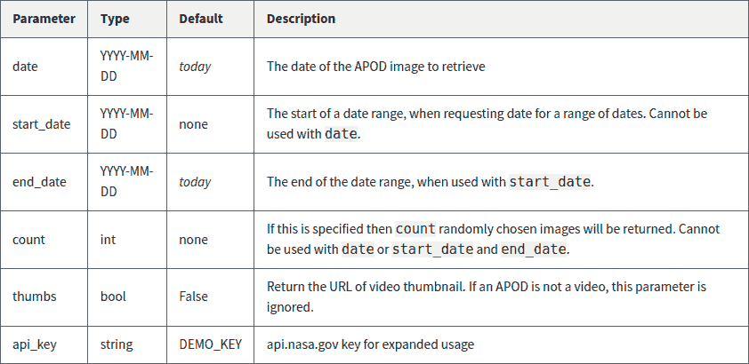

# 第二章 本地及从网络读取数据

> 原文：[`datasciencebook.ca/reading.html`](https://datasciencebook.ca/reading.html)

## 2.1 概述

在本章中，你将学习如何从你的本地设备（例如，你的笔记本电脑）和网络读取各种格式的表格数据到 R。 “读取”（或“加载”）是将数据（以纯文本、数据库、HTML 等形式存储）转换为 R 可以轻松访问和操作的对象（例如，数据框）的过程。因此，读取数据是任何数据分析的入门；除非你首先加载了数据，否则你将无法分析数据。由于数据可以以多种方式存储，因此将数据读取到 R 的方法也有很多。你前期花更多的时间来匹配数据读取方法与你的数据类型，你将需要花更少的时间来重新格式化、清理和整理你的数据（所有数据分析的第二步）。这就像在跑步前确保你的鞋带系得很好，以免后来摔倒！

## 2.2 章节学习目标

到本章结束时，读者将能够完成以下任务：

+   定义路径类型并使用它们定位文件：

    +   绝对文件路径

    +   相对文件路径

    +   统一资源定位符 (URL)

+   使用以下方法从各种类型的路径读取数据到 R：

    +   `read_csv`

    +   `read_tsv`

    +   `read_csv2`

    +   `read_delim`

    +   `read_excel`

+   比较和对比 `read_*` 函数。

+   描述何时使用以下 `read_*` 函数参数：

    +   `skip`

    +   `delim`

    +   `col_names`

+   选择合适的 `tidyverse` `read_*` 函数和函数参数，将给定的纯文本表格数据集加载到 R 中。

+   使用 `rename` 函数重命名数据框中的列。

+   使用 `read_excel` 函数和参数将电子表格文件中的工作表加载到 R 中。

+   使用 `dbplyr` 和 `DBI` 函数与数据库一起工作：

    +   使用 `dbConnect` 连接到数据库。

    +   使用 `dbListTables` 列出数据库中的表。

    +   使用 `tbl` 创建数据库表的引用。

    +   使用 `collect` 将数据库中的数据引入 R。

+   使用 `write_csv` 将数据框保存到 `.csv` 文件。

+   (*可选*) 使用抓取和应用程序编程接口 (API) 从网络获取数据：

    +   使用 `rvest` 包从 URL 读取 HTML 源代码。

    +   使用 `httr2` 包从 NASA “每日天文图片” API 读取数据。

    +   比较从纯文本文件（例如，`.csv`）下载表格数据、从 API 访问数据以及从网站抓取 HTML 源代码。

## 2.3 绝对和相对文件路径

本章将讨论我们可以使用的不同函数来导入数据到 R，但在我们讨论如何使用这些函数将数据读取到 R 之前，我们首先需要讨论数据“在哪里”。当你将数据集加载到 R 中时，你首先需要告诉 R 这些文件在哪里。文件可能存储在你的电脑上（*本地*）或互联网上的某个地方（*远程*）。

文件在计算机上的位置被称为其“路径”。你可以把路径看作是到达文件的指示。有两种类型的路径：*相对* 路径和 *绝对* 路径。相对路径表示文件相对于你的 *工作目录*（即，“你现在所在的位置”）在计算机上的位置。另一方面，绝对路径表示文件相对于计算机文件系统的基础（或 *根*）文件夹的位置，无论你在哪里工作。

假设我们的计算机文件系统看起来像图 2.1 中的那样。我们正在处理一个名为 `project3.ipynb` 的文件，并且我们的当前工作目录是 `project3`；通常情况下，就像这里一样，工作目录是你当前正在工作的目录。



图 2.1：示例文件系统。

假设我们想打开 `happiness_report.csv` 文件。我们有两种方式来指示文件的位置：使用相对路径或使用绝对路径。文件的绝对路径始终以一个斜杠 `/` 开头——代表计算机上的根文件夹——然后通过列出到达文件的文件夹序列，每个文件夹之间用另一个斜杠 `/` 分隔。所以在这种情况下，`happiness_report.csv` 可以通过从根目录开始，进入 `home` 文件夹，然后是 `dsci-100` 文件夹，然后是 `project3` 文件夹，最后是 `data` 文件夹来到达。因此，它的绝对路径是 `/home/dsci-100/project3/data/happiness_report.csv`。我们可以通过将绝对路径作为字符串传递给 `read_csv` 函数来加载该文件。

```r
happy_data <- read_csv("/home/dsci-100/project3/data/happiness_report.csv")
```

如果我们想使用相对路径，我们需要列出从当前工作目录到文件的步骤序列，每个步骤之间用斜杠 `/` 分隔。由于我们目前位于 `project3` 文件夹中，我们只需进入 `data` 文件夹即可到达我们想要的文件。因此，相对路径是 `data/happiness_report.csv`，我们可以通过将相对路径作为字符串传递给 `read_csv` 函数来加载该文件。

```r
happy_data <- read_csv("data/happiness_report.csv")
```

注意，相对路径的开头没有正斜杠；如果我们不小心输入了 `"/data/happiness_report.csv"`，R 会去计算机根目录下寻找名为 `data` 的文件夹——但这个文件夹并不存在！

除了在路径中使用文件夹名称（如`data`和`project3`）来指定位置外，我们还可以指定两个额外的特殊位置：*当前目录*和*上一目录*。我们用一个点`.`来表示当前工作目录，用两个点`..`来表示上一目录。例如，如果我们想从`project3`文件夹中到达`bike_share.csv`文件，我们可以使用相对路径`../project2/bike_share.csv`。我们甚至可以将这两个路径结合起来；例如，我们可以使用（非常愚蠢的）路径`../project2/../project2/./bike_share.csv`来到达`bike_share.csv`文件，其中包含很多冗余的方向：它指示我们返回一个文件夹，然后打开`project2`，然后再次返回一个文件夹，然后再次打开`project2`，然后停留在当前目录，最后到达`bike_share.csv`。哇，真是一次漫长的旅程！

因此，你应该使用哪种类型的路径：相对路径还是绝对路径？一般来说，你应该使用相对路径。使用相对路径可以帮助确保你的代码可以在不同的电脑上运行（并且作为一个额外的优点，相对路径通常更短——更容易输入！）这是因为文件相对于不同电脑的路径通常是相同的，而文件的绝对路径（从电脑根目录到文件的文件夹名称，由`/`表示）通常在不同电脑上是不相同的。例如，假设 Fatima 和 Jayden 正在一起在`happiness_report.csv`数据上工作。Fatima 的文件存储在

`/home/Fatima/project3/data/happiness_report.csv`,

Jayden 的存储位置是

`/home/Jayden/project3/data/happiness_report.csv`.

尽管 Fatima 和 Jayden 将文件存储在他们的电脑上的相同位置（在他们的主文件夹中），但由于他们的用户名不同，绝对路径是不同的。如果 Jayden 的代码使用绝对路径加载`happiness_report.csv`数据，那么这段代码在 Fatima 的电脑上将无法工作。但是，从`project3`文件夹内部（`data/happiness_report.csv`）的相对路径在两台电脑上都是相同的；任何使用相对路径的代码都可以在两台电脑上运行！在附加资源部分，我们包含了一个关于绝对路径和相对路径差异的简短视频链接。您还可以查看`here`包，它提供了在 R 中查找和构建文件路径的方法。

除了存储在您电脑上的文件（即本地文件）之外，我们还需要一种方法来定位存储在互联网其他地方（即远程）的资源。为此，我们使用*统一资源定位符（URL）*，即看起来像[`datasciencebook.ca/`](https://datasciencebook.ca/)的网页地址。URL 指示互联网上资源的位置，以一个网络域名开始，后面跟着一个正斜杠`/`，然后是远程机器上资源所在路径。

## 2.4 从纯文本文件中读取表格数据到 R

### 2.4.1 使用`read_csv`读取逗号分隔值文件

现在我们已经了解了数据可能存在的位置，我们将学习如何使用各种函数将数据导入 R。具体来说，我们将学习如何从纯文本文件（仅包含文本的文档）中 *读取* 表格数据到 R，以及如何将表格数据 *写入* 到文件中。我们使用的函数取决于文件的格式。例如，在上一个章节中，我们学习了在读取 `.csv`（**逗号**分隔**值**）文件时使用 `tidyverse` 的 `read_csv` 函数。在那个案例中，分隔我们的列的 *分隔符* 是逗号（`,`）。我们只学习了数据符合 `read_csv` 函数预期默认值的情况（存在列名，并且逗号用作列之间的分隔符）。在本节中，我们将学习如何读取不满足 `read_csv` 默认期望的文件。

在我们深入探讨数据不是 `tidyverse` 和 `read_csv` 预期默认格式的案例之前，让我们回顾一下默认值保持更简单直接的情况，在这种情况下，我们只需要提供给函数的参数是文件的路径，`data/can_lang.csv`。`can_lang` 数据集包含了 2016 年加拿大人口普查的语言数据。当我们加载数据集时，我们在文件名前放置 `data/`，因为此数据集位于一个名为 `data` 的子文件夹中，该子文件夹相对于我们运行 R 代码的位置。以下是文件 `data/can_lang.csv` 中的文本内容。

```r
category,language,mother_tongue,most_at_home,most_at_work,lang_known
Aboriginal languages,"Aboriginal languages, n.o.s.",590,235,30,665
Non-Official & Non-Aboriginal languages,Afrikaans,10260,4785,85,23415
Non-Official & Non-Aboriginal languages,"Afro-Asiatic languages, n.i.e.",1150,44
Non-Official & Non-Aboriginal languages,Akan (Twi),13460,5985,25,22150
Non-Official & Non-Aboriginal languages,Albanian,26895,13135,345,31930
Aboriginal languages,"Algonquian languages, n.i.e.",45,10,0,120
Aboriginal languages,Algonquin,1260,370,40,2480
Non-Official & Non-Aboriginal languages,American Sign Language,2685,3020,1145,21
Non-Official & Non-Aboriginal languages,Amharic,22465,12785,200,33670
```

下面是如何使用 `read_csv` 将其加载到 R 中的回顾。首先，我们加载 `tidyverse` 包以获取读取数据的 useful functions。

```r
library(tidyverse)
```

接下来，我们使用 `read_csv` 将数据加载到 R 中，并在该调用中指定文件的相对路径。请注意，在使用 `read_csv` 和相关函数后打印出消息是正常和预期的。这个消息会告诉你 R 在将数据读入 R 时推断出的每一列的数据类型。在将来，当我们使用这些和相关函数来加载本书中的数据时，我们将关闭这些消息以帮助提高书籍的可读性。

```r
canlang_data <- read_csv("data/can_lang.csv")
```

```r
## Rows: 214 Columns: 6
## ── Column specification ────────────────────────────────────────────────────────
## Delimiter: ","
## chr (2): category, language
## dbl (4): mother_tongue, most_at_home, most_at_work, lang_known
## 
## ℹ Use `spec()` to retrieve the full column specification for this data.
## ℹ Specify the column types or set `show_col_types = FALSE` to quiet this message.
```

最后，要查看数据框的前 10 行，我们必须调用它：

```r
canlang_data
```

```r
## # A tibble: 214 × 6
##    category          language mother_tongue most_at_home most_at_work lang_known
##    <chr>             <chr>            <dbl>        <dbl>        <dbl>      <dbl>
##  1 Aboriginal langu… Aborigi…           590          235           30        665
##  2 Non-Official & N… Afrikaa…         10260         4785           85      23415
##  3 Non-Official & N… Afro-As…          1150          445           10       2775
##  4 Non-Official & N… Akan (T…         13460         5985           25      22150
##  5 Non-Official & N… Albanian         26895        13135          345      31930
##  6 Aboriginal langu… Algonqu…            45           10            0        120
##  7 Aboriginal langu… Algonqu…          1260          370           40       2480
##  8 Non-Official & N… America…          2685         3020         1145      21930
##  9 Non-Official & N… Amharic          22465        12785          200      33670
## 10 Non-Official & N… Arabic          419890       223535         5585     629055
## # ℹ 204 more rows
```

### 2.4.2 在读取数据时跳过行

通常情况下，关于数据收集方式或其他相关信息会被包含在数据文件的最顶部。这些信息通常以句子和段落的形式书写，没有分隔符，因为它们没有被组织成列。下面是一个例子。这些信息为数据科学家提供了关于数据的 useful context 和信息，然而，它们并没有很好地格式化，也不打算与文件后面跟随的表格数据一起读入数据框单元格中。

```r
Data source: https://ttimbers.github.io/canlang/
Data originally published in: Statistics Canada Census of Population 2016.
Reproduced and distributed on an as-is basis with their permission.
category,language,mother_tongue,most_at_home,most_at_work,lang_known
Aboriginal languages,"Aboriginal languages, n.o.s.",590,235,30,665
Non-Official & Non-Aboriginal languages,Afrikaans,10260,4785,85,23415
Non-Official & Non-Aboriginal languages,"Afro-Asiatic languages, n.i.e.",1150,44
Non-Official & Non-Aboriginal languages,Akan (Twi),13460,5985,25,22150
Non-Official & Non-Aboriginal languages,Albanian,26895,13135,345,31930
Aboriginal languages,"Algonquian languages, n.i.e.",45,10,0,120
Aboriginal languages,Algonquin,1260,370,40,2480
Non-Official & Non-Aboriginal languages,American Sign Language,2685,3020,1145,21
Non-Official & Non-Aboriginal languages,Amharic,22465,12785,200,33670
```

由于这种额外信息出现在文件顶部，使用我们之前使用的`read_csv`方法无法正确将数据加载到 R 中。在这种情况下，我们最终只读取了数据集的一个列。与上述正常和预期的消息相反，这次 R 打印出警告告诉我们，我们的数据读取可能存在问题。

```r
canlang_data <- read_csv("data/can_lang_meta-data.csv")
```

```r
## Warning: One or more parsing issues, call `problems()` on your data frame for details,
## e.g.:
##   dat <- vroom(...)
##   problems(dat)
```

```r
canlang_data
```

```r
## # A tibble: 217 × 1
##    `Data source: https://ttimbers.github.io/canlang/`                           
##    <chr>                                                                        
##  1 "Data originally published in: Statistics Canada Census of Population 2016." 
##  2 "Reproduced and distributed on an as-is basis with their permission."        
##  3 "category,language,mother_tongue,most_at_home,most_at_work,lang_known"       
##  4 "Aboriginal languages,\"Aboriginal languages, n.o.s.\",590,235,30,665"       
##  5 "Non-Official & Non-Aboriginal languages,Afrikaans,10260,4785,85,23415"      
##  6 "Non-Official & Non-Aboriginal languages,\"Afro-Asiatic languages, n.i.e.\",…
##  7 "Non-Official & Non-Aboriginal languages,Akan (Twi),13460,5985,25,22150"     
##  8 "Non-Official & Non-Aboriginal languages,Albanian,26895,13135,345,31930"     
##  9 "Aboriginal languages,\"Algonquian languages, n.i.e.\",45,10,0,120"          
## 10 "Aboriginal languages,Algonquin,1260,370,40,2480"                            
## # ℹ 207 more rows
```

要成功将此类数据读入 R，`skip`参数可以很有用，它告诉 R 在开始读取数据之前应跳过多少行。在上面的例子中，我们将此值设置为 3。

```r
canlang_data <- read_csv("data/can_lang_meta-data.csv",
 skip = 3)
canlang_data
```

```r
## # A tibble: 214 × 6
##    category          language mother_tongue most_at_home most_at_work lang_known
##    <chr>             <chr>            <dbl>        <dbl>        <dbl>      <dbl>
##  1 Aboriginal langu… Aborigi…           590          235           30        665
##  2 Non-Official & N… Afrikaa…         10260         4785           85      23415
##  3 Non-Official & N… Afro-As…          1150          445           10       2775
##  4 Non-Official & N… Akan (T…         13460         5985           25      22150
##  5 Non-Official & N… Albanian         26895        13135          345      31930
##  6 Aboriginal langu… Algonqu…            45           10            0        120
##  7 Aboriginal langu… Algonqu…          1260          370           40       2480
##  8 Non-Official & N… America…          2685         3020         1145      21930
##  9 Non-Official & N… Amharic          22465        12785          200      33670
## 10 Non-Official & N… Arabic          419890       223535         5585     629055
## # ℹ 204 more rows
```

我们是如何知道要跳过三行的？我们查看数据！数据的前三行包含我们不需要导入的信息：

```r
Data source: https://ttimbers.github.io/canlang/
Data originally published in: Statistics Canada Census of Population 2016.
Reproduced and distributed on an as-is basis with their permission.
```

列名从第 4 行开始，所以我们跳过了前 3 行。

### 2.4.3 使用`read_tsv`读取制表符分隔值文件

数据存储的另一种常见方式是使用制表符作为分隔符。注意数据文件`can_lang.tsv`中的列之间使用的是制表符而不是逗号。

```r
category    language    mother_tongue   most_at_home    most_at_work    lang_kno
Aboriginal languages    Aboriginal languages, n.o.s.    590 235 30  665
Non-Official & Non-Aboriginal languages Afrikaans   10260   4785    85  23415
Non-Official & Non-Aboriginal languages Afro-Asiatic languages, n.i.e.  1150
Non-Official & Non-Aboriginal languages Akan (Twi)  13460   5985    25  22150
Non-Official & Non-Aboriginal languages Albanian    26895   13135   345 31930
Aboriginal languages    Algonquian languages, n.i.e.    45  10  0   120
Aboriginal languages    Algonquin   1260    370 40  2480
Non-Official & Non-Aboriginal languages American Sign Language  2685    3020
Non-Official & Non-Aboriginal languages Amharic 22465   12785   200 33670
```

我们可以使用`read_tsv`函数来读取`.tsv`（**t**ab **s**eparated **v**alues）文件。

```r
canlang_data <- read_tsv("data/can_lang.tsv")
canlang_data
```

```r
## # A tibble: 214 × 6
##    category          language mother_tongue most_at_home most_at_work lang_known
##    <chr>             <chr>            <dbl>        <dbl>        <dbl>      <dbl>
##  1 Aboriginal langu… Aborigi…           590          235           30        665
##  2 Non-Official & N… Afrikaa…         10260         4785           85      23415
##  3 Non-Official & N… Afro-As…          1150          445           10       2775
##  4 Non-Official & N… Akan (T…         13460         5985           25      22150
##  5 Non-Official & N… Albanian         26895        13135          345      31930
##  6 Aboriginal langu… Algonqu…            45           10            0        120
##  7 Aboriginal langu… Algonqu…          1260          370           40       2480
##  8 Non-Official & N… America…          2685         3020         1145      21930
##  9 Non-Official & N… Amharic          22465        12785          200      33670
## 10 Non-Official & N… Arabic          419890       223535         5585     629055
## # ℹ 204 more rows
```

如果你将这里的数据框与我们在第 2.4.1 节中使用`read_csv`获得的数据框进行比较，你会注意到它们看起来完全相同：它们有相同数量的列和行，相同的列名，以及相同的条目！所以尽管我们需要根据文件格式使用不同的函数，但两种情况下我们得到的结果数据框（`canlang_data`）都是相同的。

### 2.4.4 使用`read_delim`作为将表格数据读入 R 的更灵活的方法

`read_csv`和`read_tsv`函数实际上是更通用`read_delim`函数的特殊情况。我们可以使用`read_delim`来导入逗号和制表符分隔的值文件，以及更多；我们只需指定分隔符。例如，`can_lang_no_names.tsv`文件包含同一数据集的不同版本，没有列名，并使用制表符而不是逗号作为分隔符。以下是该文件在纯文本编辑器中的外观：

```r
Aboriginal languages    Aboriginal languages, n.o.s.    590 235 30  665
Non-Official & Non-Aboriginal languages Afrikaans   10260   4785    85  23415
Non-Official & Non-Aboriginal languages Afro-Asiatic languages, n.i.e.  1150
Non-Official & Non-Aboriginal languages Akan (Twi)  13460   5985    25  22150
Non-Official & Non-Aboriginal languages Albanian    26895   13135   345 31930
Aboriginal languages    Algonquian languages, n.i.e.    45  10  0   120
Aboriginal languages    Algonquin   1260    370 40  2480
Non-Official & Non-Aboriginal languages American Sign Language  2685    3020
Non-Official & Non-Aboriginal languages Amharic 22465   12785   200 33670
Non-Official & Non-Aboriginal languages Arabic  419890  223535  5585    629055
```

要使用`read_delim`函数将数据读入 R，我们指定文件路径作为第一个参数，提供制表符`"\t"`作为`delim`参数，并将`col_names`参数设置为`FALSE`以表示数据中没有提供列名。请注意，`read_csv`、`read_tsv`和`read_delim`函数都有一个`col_names`参数，默认值为`TRUE`。

> **注意：** `\t`是一个**转义字符**的例子，它始终以反斜杠（`\`）开头。转义字符用于表示非打印字符（如制表符）或具有特殊意义的字符（如引号）。

```r
canlang_data <- read_delim("data/can_lang_no_names.tsv",
 delim = "\t",
 col_names = FALSE)
canlang_data
```

```r
## # A tibble: 214 × 6
##    X1                                      X2             X3     X4    X5     X6
##    <chr>                                   <chr>       <dbl>  <dbl> <dbl>  <dbl>
##  1 Aboriginal languages                    Aborigina…    590    235    30    665
##  2 Non-Official & Non-Aboriginal languages Afrikaans   10260   4785    85  23415
##  3 Non-Official & Non-Aboriginal languages Afro-Asia…   1150    445    10   2775
##  4 Non-Official & Non-Aboriginal languages Akan (Twi)  13460   5985    25  22150
##  5 Non-Official & Non-Aboriginal languages Albanian    26895  13135   345  31930
##  6 Aboriginal languages                    Algonquia…     45     10     0    120
##  7 Aboriginal languages                    Algonquin    1260    370    40   2480
##  8 Non-Official & Non-Aboriginal languages American …   2685   3020  1145  21930
##  9 Non-Official & Non-Aboriginal languages Amharic     22465  12785   200  33670
## 10 Non-Official & Non-Aboriginal languages Arabic     419890 223535  5585 629055
## # ℹ 204 more rows
```

R 中的数据框需要具有列名。因此，如果你读取的数据没有列名，R 将会自动分配名称。在这个例子中，R 分配的列名为 `X1, X2, X3, X4, X5, X6`。在这种情况下，最好手动重命名你的列。当前的列名（`X1, X2` 等）描述性不强，会使你的分析变得混乱。要重命名列，你可以使用来自 [`dplyr` R 包](https://dplyr.tidyverse.org/)（`tidyverse` 一起加载的包之一，因此我们不需要单独加载它）的 `rename` 函数（Wickham, François, et al. 2021）。第一个参数是数据集，在后续参数中，你为要重命名的变量写入 `new_name = old_name`。我们将在下面的 `canlang_data` 数据框中将 `X1, X2, ..., X6` 列重命名为更具描述性的名称。

```r
canlang_data <- rename(canlang_data,
 category = X1,
 language = X2,
 mother_tongue = X3,
 most_at_home = X4,
 most_at_work = X5,
 lang_known = X6)
canlang_data
```

```r
## # A tibble: 214 × 6
##    category          language mother_tongue most_at_home most_at_work lang_known
##    <chr>             <chr>            <dbl>        <dbl>        <dbl>      <dbl>
##  1 Aboriginal langu… Aborigi…           590          235           30        665
##  2 Non-Official & N… Afrikaa…         10260         4785           85      23415
##  3 Non-Official & N… Afro-As…          1150          445           10       2775
##  4 Non-Official & N… Akan (T…         13460         5985           25      22150
##  5 Non-Official & N… Albanian         26895        13135          345      31930
##  6 Aboriginal langu… Algonqu…            45           10            0        120
##  7 Aboriginal langu… Algonqu…          1260          370           40       2480
##  8 Non-Official & N… America…          2685         3020         1145      21930
##  9 Non-Official & N… Amharic          22465        12785          200      33670
## 10 Non-Official & N… Arabic          419890       223535         5585     629055
## # ℹ 204 more rows
```

### 2.4.5 直接从 URL 读取表格数据

我们还可以使用 `read_csv`、`read_tsv` 或 `read_delim`（和相关函数）直接从包含表格数据的 **U**niform **R**esource **L**ocator（URL）读取数据。在这里，我们提供远程文件的 URL 给 `read_*`，而不是我们电脑上本地文件的路径。我们需要用引号包围 URL，就像我们在本地电脑上指定路径时一样。我们使用的所有其他参数与在电脑上使用本地文件时相同。

```r
url <- "https://raw.githubusercontent.com/UBC-DSCI/data/main/can_lang.csv"
canlang_data <- read_csv(url)

canlang_data
```

```r
## # A tibble: 214 × 6
##    category          language mother_tongue most_at_home most_at_work lang_known
##    <chr>             <chr>            <dbl>        <dbl>        <dbl>      <dbl>
##  1 Aboriginal langu… Aborigi…           590          235           30        665
##  2 Non-Official & N… Afrikaa…         10260         4785           85      23415
##  3 Non-Official & N… Afro-As…          1150          445           10       2775
##  4 Non-Official & N… Akan (T…         13460         5985           25      22150
##  5 Non-Official & N… Albanian         26895        13135          345      31930
##  6 Aboriginal langu… Algonqu…            45           10            0        120
##  7 Aboriginal langu… Algonqu…          1260          370           40       2480
##  8 Non-Official & N… America…          2685         3020         1145      21930
##  9 Non-Official & N… Amharic          22465        12785          200      33670
## 10 Non-Official & N… Arabic          419890       223535         5585     629055
## # ℹ 204 more rows
```

### 2.4.6 从 URL 下载数据

有时 URL 上可用的数据格式不够好，不能使用 `read_csv`、`read_tsv`、`read_delim` 或其他相关函数直接将数据读入 R。在需要在我们用 R 处理它之前先下载文件到我们本地电脑的情况中，我们可以使用 `download.file` 函数。第一个参数是 URL，第二个是我们想要存储下载文件的路径。

```r
download.file(url, "data/can_lang.csv")
canlang_data <- read_csv("data/can_lang.csv")
canlang_data
```

```r
## # A tibble: 214 × 6
##    category          language mother_tongue most_at_home most_at_work lang_known
##    <chr>             <chr>            <dbl>        <dbl>        <dbl>      <dbl>
##  1 Aboriginal langu… Aborigi…           590          235           30        665
##  2 Non-Official & N… Afrikaa…         10260         4785           85      23415
##  3 Non-Official & N… Afro-As…          1150          445           10       2775
##  4 Non-Official & N… Akan (T…         13460         5985           25      22150
##  5 Non-Official & N… Albanian         26895        13135          345      31930
##  6 Aboriginal langu… Algonqu…            45           10            0        120
##  7 Aboriginal langu… Algonqu…          1260          370           40       2480
##  8 Non-Official & N… America…          2685         3020         1145      21930
##  9 Non-Official & N… Amharic          22465        12785          200      33670
## 10 Non-Official & N… Arabic          419890       223535         5585     629055
## # ℹ 204 more rows
```

### 2.4.7 在将数据文件读入 R 之前预览它

在上述许多示例中，我们在将数据文件读入 R 之前都提供了数据文件的预览。预览数据对于查看是否有列名、分隔符是什么以及是否有需要跳过的行是至关重要的。当尝试读取数据文件时，你应该自己这样做：使用你偏好的任何文本编辑器打开文件，在将其读入 R 之前检查其内容。

## 2.5 从 Microsoft Excel 文件中读取表格数据

除了纯文本文件之外，还有许多其他方式可以存储表格数据集，同样，也有许多方式将这些数据集加载到 R 中。例如，非常常见的情况是需要将存储为 Microsoft Excel 电子表格（文件扩展名为`.xlsx`）的数据加载到 R 中。为了能够做到这一点，一个关键的知识点是，尽管`.csv`和`.xlsx`文件在加载到 Excel 中时看起来几乎相同，但数据本身存储的方式完全不同。虽然`.csv`文件是纯文本文件，你在文本编辑器中打开文件时看到的字符正是它们所代表的数据，但`.xlsx`文件并非如此。看看一个`.xlsx`文件在文本编辑器中会是什么样子：

```r
,?'O
    _rels/.rels???J1??>E?{7?
<?V????w8?'J???'QrJ???Tf?d??d?o?wZ'???@>?4'?|??hlIo??F
t                                                       8f??3wn
????t??u"/
          %~Ed2??<?w??
                       ?Pd(??J-?E???7?'t(?-GZ?????y???c~N?g[^_r?4
                                                                  yG?O
                                                                      ?K??G?

     ]TUEe??O??c???????6q??s??d?m???\???H?^????3} ?rZY? ?:L60?^?????XTP+?|?
X?a??4VT?,D?Jq
```

这种文件表示方式允许 Excel 文件存储`.csv`文件无法存储的额外内容，例如字体、文本格式、图形、多个工作表等。尽管在纯文本编辑器中看起来很奇怪，但我们仍然可以使用专门为此目的开发的`readxl`包将 Excel 工作表读取到 R 中。

```r
library(readxl)

canlang_data <- read_excel("data/can_lang.xlsx")
canlang_data
```

```r
## # A tibble: 214 × 6
##    category          language mother_tongue most_at_home most_at_work lang_known
##    <chr>             <chr>            <dbl>        <dbl>        <dbl>      <dbl>
##  1 Aboriginal langu… Aborigi…           590          235           30        665
##  2 Non-Official & N… Afrikaa…         10260         4785           85      23415
##  3 Non-Official & N… Afro-As…          1150          445           10       2775
##  4 Non-Official & N… Akan (T…         13460         5985           25      22150
##  5 Non-Official & N… Albanian         26895        13135          345      31930
##  6 Aboriginal langu… Algonqu…            45           10            0        120
##  7 Aboriginal langu… Algonqu…          1260          370           40       2480
##  8 Non-Official & N… America…          2685         3020         1145      21930
##  9 Non-Official & N… Amharic          22465        12785          200      33670
## 10 Non-Official & N… Arabic          419890       223535         5585     629055
## # ℹ 204 more rows
```

如果`.xlsx`文件包含多个工作表，您必须使用`sheet`参数来指定工作表编号或名称。您还可以使用`range`参数指定单元格范围。当单个工作表中包含多个表格（这是许多 Excel 工作表都会遇到的一个令人难过的事情，因为这使得读取数据变得更加困难）时，此功能非常有用。

与纯文本文件一样，在将数据文件导入 R 之前，您应该始终探索数据文件。事先探索数据可以帮助您决定需要哪些参数才能成功将数据加载到 R 中。如果您没有在计算机上安装 Excel 程序，您可以使用其他程序来预览文件。例如，包括 Google Sheets 和 Libre Office。

在表[2.1 中，我们总结了本章中涵盖的`read_*`函数。我们还包括了用于分号`;`分隔数据的`read_csv2`函数，您可能会在十进制以逗号而不是点（例如，一些来自欧洲国家的数据集）表示的数据集中遇到这种情况。

表 2.1：`read_*`函数摘要

| 数据文件类型 | R 函数 | R 包 |
| --- | --- | --- |
| 逗号（`,`）分隔的文件 | `read_csv` | `readr` |
| 制表符（`\t`）分隔的文件 | `read_tsv` | `readr` |
| 分号（`;`）分隔的文件 | `read_csv2` | `readr` |
| 各种格式（`.csv`, `.tsv`） | `read_delim` | `readr` |
| Excel 文件（`.xlsx`） | `read_excel` | `readxl` |

> **注意：** `readr`是`tidyverse`包的一部分，因此我们不需要单独加载此包，因为我们已经加载了`tidyverse`。

## 2.6 从数据库中读取数据

另一种非常常见的数据存储形式是关系型数据库。当你拥有大量数据集或多个用户在项目上工作时，数据库是非常棒的。有许多关系型数据库管理系统，例如 SQLite、MySQL、PostgreSQL、Oracle 等等。这些不同的关系型数据库管理系统各自都有其优势和局限性。几乎所有的数据库都使用 SQL（*结构化查询语言*）从数据库中获取数据。但你不需要知道 SQL 来分析数据库中的数据；已经编写了几个包，允许你连接到关系型数据库并使用 R 编程语言获取数据。在这本书中，我们将通过使用 R 和 SQLite 以及 PostgreSQL 数据库的例子来展示如何做到这一点。

### 2.6.1 从 SQLite 数据库读取数据

SQLite 可能是可以与 R 结合使用的最简单的关系型数据库系统。SQLite 数据库是自包含的，通常存储和访问在单个计算机上，通过一个以`.db`扩展名（或有时是`.sqlite`扩展名）的文件进行（或有时是一个`.sqlite`扩展名）。类似于 Excel 文件，这些不是纯文本文件，不能在纯文本编辑器中读取。

将数据从数据库读取到 R 中的第一步是连接到数据库。我们使用`DBI`（数据库接口）包中的`dbConnect`函数来完成这个操作。这不会读取数据，但只是告诉 R 数据库的位置并打开一个 R 可以用来向数据库发送 SQL 命令的通信通道。

```r
library(DBI)

canlang_conn <- dbConnect(RSQLite::SQLite(), "data/can_lang.db")
```

通常关系型数据库有许多表；因此，为了从数据库中检索数据，你需要知道数据存储的表名。你可以使用`dbListTables`函数获取数据库中所有表的名称：

```r
tables <- dbListTables(canlang_conn)
tables
```

```r
## [1] "lang"
```

`dbListTables`函数只返回了一个名称，这告诉我们这个数据库中只有一个表。为了在数据库中引用一个表（以便我们可以执行选择列和过滤行等操作），我们使用`dbplyr`包中的`tbl`函数。`tbl`函数返回的对象允许我们像处理常规数据框一样处理存储在数据库中的数据；但幕后，`dbplyr`正在将你的函数调用（例如`select`和`filter`）转换为 SQL 查询！

```r
library(dbplyr)

lang_db <- tbl(canlang_conn, "lang")
lang_db
```

```r
## # Source:   table<lang> [?? x 6]
## # Database: sqlite 3.41.2 [/home/rstudio/introduction-to-datascience/data/can_lang.db]
##    category          language mother_tongue most_at_home most_at_work lang_known
##    <chr>             <chr>            <dbl>        <dbl>        <dbl>      <dbl>
##  1 Aboriginal langu… Aborigi…           590          235           30        665
##  2 Non-Official & N… Afrikaa…         10260         4785           85      23415
##  3 Non-Official & N… Afro-As…          1150          445           10       2775
##  4 Non-Official & N… Akan (T…         13460         5985           25      22150
##  5 Non-Official & N… Albanian         26895        13135          345      31930
##  6 Aboriginal langu… Algonqu…            45           10            0        120
##  7 Aboriginal langu… Algonqu…          1260          370           40       2480
##  8 Non-Official & N… America…          2685         3020         1145      21930
##  9 Non-Official & N… Amharic          22465        12785          200      33670
## 10 Non-Official & N… Arabic          419890       223535         5585     629055
## # ℹ more rows
```

虽然看起来我们只是从数据库中得到了一个数据框，但我们并没有！它是一个 *引用*；数据仍然只存储在 SQLite 数据库中。`dbplyr` 包以这种方式工作，因为数据库通常在选择、过滤和连接大型数据集方面比 R 更有效率。通常，数据库甚至不会存储在你的电脑上，而是在网络上的某个更强大的机器上。所以 R 是懒惰的，它会在你明确使用 `collect` 函数告诉它之前，等待将数据带入内存。图 2.2 强调了 R 中的 `tibble` 对象与我们刚刚创建的输出之间的差异。注意在右边的表格中，输出的前两行表明来源是 SQL。最后一行没有显示行数（R 正在尝试避免执行昂贵的查询操作），而 `tibble` 对象的输出则显示了行数。



图 2.2：数据库中的数据引用与 R 中的 tibble 的比较。

我们可以使用 `dbplyr` 包中的 `show_query` 函数查看当我们在 R 中编写 `tbl(canlang_conn, "lang")` 时发送到数据库的 SQL 命令。

```r
show_query(tbl(canlang_conn, "lang"))
```

```r
## <SQL>
## SELECT *
## FROM `lang`
```

上面的输出显示了发送到数据库的 SQL 代码。当我们用 R 中的 `tbl(canlang_conn, "lang")` 编写时，在后台，该函数正在将 R 代码转换为 SQL，将那个 SQL 发送到数据库，然后为我们转换响应。所以 `dbplyr` 为我们做了从 R 到 SQL 以及回转的所有繁重工作；我们只需坚持使用 R 即可！

我们有了 `lang_db` 表引用，用于 2016 年加拿大人口普查数据，我们可以继续像处理常规数据框一样进行操作。例如，让我们做第一章中的相同练习：我们将只获取与土著语言相对应的行，并只保留 `language` 和 `mother_tongue` 列。我们可以使用 `filter` 函数来获取特定的行。下面我们过滤数据，只包括土著语言。

```r
aboriginal_lang_db <- filter(lang_db, category == "Aboriginal languages")
aboriginal_lang_db
```

```r
## # Source:   SQL [?? x 6]
## # Database: sqlite 3.41.2 [/home/rstudio/introduction-to-datascience/data/can_lang.db]
##    category          language mother_tongue most_at_home most_at_work lang_known
##    <chr>             <chr>            <dbl>        <dbl>        <dbl>      <dbl>
##  1 Aboriginal langu… Aborigi…           590          235           30        665
##  2 Aboriginal langu… Algonqu…            45           10            0        120
##  3 Aboriginal langu… Algonqu…          1260          370           40       2480
##  4 Aboriginal langu… Athabas…            50           10            0         85
##  5 Aboriginal langu… Atikame…          6150         5465         1100       6645
##  6 Aboriginal langu… Babine …           110           20           10        210
##  7 Aboriginal langu… Beaver             190           50            0        340
##  8 Aboriginal langu… Blackfo…          2815         1110           85       5645
##  9 Aboriginal langu… Carrier           1025          250           15       2100
## 10 Aboriginal langu… Cayuga              45           10           10        125
## # ℹ more rows
```

在上面，你又可以再次看到这些提示，表明这些数据实际上还没有存储在 R 中：源是 `SQL [?? x 6]`，输出在末尾显示 `... more rows`（两者都表明 R 还不知道总共有多少行！），并且列出了一个数据库类型 `sqlite`。我们没有使用 `collect` 函数，因为我们还没有准备好将数据带入 R。我们仍然可以使用数据库做一些工作，以获取我们想要在 R 中本地处理的少量数据。让我们添加我们数据库查询的第二部分：使用 `select` 函数仅选择 `language` 和 `mother_tongue` 列。

```r
aboriginal_lang_selected_db <- select(aboriginal_lang_db, language, mother_tongue)
aboriginal_lang_selected_db
```

```r
## # Source:   SQL [?? x 2]
## # Database: sqlite 3.41.2 [/home/rstudio/introduction-to-datascience/data/can_lang.db]
##    language                     mother_tongue
##    <chr>                                <dbl>
##  1 Aboriginal languages, n.o.s.           590
##  2 Algonquian languages, n.i.e.            45
##  3 Algonquin                             1260
##  4 Athabaskan languages, n.i.e.            50
##  5 Atikamekw                             6150
##  6 Babine (Wetsuwet'en)                   110
##  7 Beaver                                 190
##  8 Blackfoot                             2815
##  9 Carrier                               1025
## 10 Cayuga                                  45
## # ℹ more rows
```

现在您可以看到，数据库将只返回我们用 `select` 函数请求的两个列。为了实际上将此数据作为数据框检索到 R 中，我们使用 `collect` 函数。下面您将看到，在运行 `collect` 之后，R 知道检索到的数据有 67 行，并且不再列出任何数据库。

```r
aboriginal_lang_data <- collect(aboriginal_lang_selected_db)
aboriginal_lang_data
```

```r
## # A tibble: 67 × 2
##    language                     mother_tongue
##    <chr>                                <dbl>
##  1 Aboriginal languages, n.o.s.           590
##  2 Algonquian languages, n.i.e.            45
##  3 Algonquin                             1260
##  4 Athabaskan languages, n.i.e.            50
##  5 Atikamekw                             6150
##  6 Babine (Wetsuwet'en)                   110
##  7 Beaver                                 190
##  8 Blackfoot                             2815
##  9 Carrier                               1025
## 10 Cayuga                                  45
## # ℹ 57 more rows
```

除了知道行数外，上面显示的两个输出中的数据看起来相当相似。`dbplyr` 提供了许多更多函数（不仅仅是 `filter`），您可以直接将这些数据库引用（`lang_db`）输入到下游分析函数中（例如，`ggplot2` 用于数据可视化）。但是 `dbplyr` 并不提供我们需要的所有分析函数；我们最终仍然需要调用 `collect`。例如，看看当我们尝试使用 `nrow` 来计算数据框中的行数时会发生什么：

```r
nrow(aboriginal_lang_selected_db)
```

```r
## [1] NA
```

或者 `tail` 来预览数据框的最后六行：

```r
tail(aboriginal_lang_selected_db)
```

```r
## Error: tail() is not supported by sql sources
```

此外，一些操作将无法从 `tbl` 函数提供的引用中提取列或单个值。因此，一旦您完成了对 `tbl` 数据库引用对象的整理，建议使用 `collect` 将其作为数据框引入 R。但使用 `collect` 时要非常小心：数据库通常非常大，将整个表读入 R 可能需要很长时间运行，甚至可能使您的机器崩溃。因此，确保在使用 `collect` 将其读入 R 之前，使用 `filter` 和 `select` 在数据库表上减少数据到合理的大小！

### 2.6.2 从 PostgreSQL 数据库读取数据

PostgreSQL（也称为 Postgres）是关系型数据库软件的一个非常流行和开源的选择。与 SQLite 不同，PostgreSQL 使用客户端-服务器数据库引擎，因为它被设计用于在网络上使用和访问。这意味着您在连接到 Postgres 数据库时必须提供更多信息。在调用 `dbConnect` 函数时需要包含的附加信息如下：

+   `dbname`: 数据库名称（单个 PostgreSQL 实例可以托管多个数据库）

+   `host`: 指向数据库位置的 URL

+   `port`: R 和 PostgreSQL 数据库之间的通信端点（通常是 `5432`）

+   `user`: 访问数据库的用户名

+   `password`: 访问数据库的密码

此外，在 `dbConnect` 函数调用中，我们必须使用 `RPostgres` 包而不是 `RSQLite`。以下我们演示如何连接到包含有关加拿大电影信息的 `can_mov_db` 数据库版本。请注意，下面的 `host`（`fakeserver.stat.ubc.ca`）、`user`（`user0001`）和 `password`（`abc123`）都不是真实的；您实际上无法使用这些信息连接到数据库。

```r
library(RPostgres)
canmov_conn <- dbConnect(RPostgres::Postgres(), dbname = "can_mov_db",
 host = "fakeserver.stat.ubc.ca", port = 5432,
 user = "user0001", password = "abc123")
```

在打开连接后，一切看起来和表现几乎与我们在 R 中使用 SQLite 数据库时完全相同。例如，我们再次可以使用 `dbListTables` 来找出 `can_mov_db` 数据库中有哪些表：

```r
dbListTables(canmov_conn)
```

```r
 [1] "themes"            "medium"           "titles"     "title_aliases"       "forms"
 [6] "episodes"          "names"      "names_occupations" "occupation"       "ratings"
```

我们看到这个数据库中有 10 个表。让我们首先查看 `"ratings"` 表，以找到在 `can_mov_db` 数据库中存在的最低评分：

```r
ratings_db <- tbl(canmov_conn, "ratings")
ratings_db
```

```r
# Source:   table<ratings> [?? x 3]
# Database: postgres [user0001@fakeserver.stat.ubc.ca:5432/can_mov_db]
   title              average_rating num_votes
   <chr>                    <dbl>     <int>
 1 The Grand Seduction       6.6       150
 2 Rhymes for Young Ghouls   6.3      1685
 3 Mommy                     7.5      1060
 4 Incendies                 6.1      1101
 5 Bon Cop, Bad Cop          7.0       894
 6 Goon                      5.5      1111
 7 Monsieur Lazhar           5.6       610
 8 What if                   5.3      1401
 9 The Barbarian Invations   5.8        99
10 Away from Her             6.9      2311
# … with more rows
```

要找到数据库中存在的最低评分，我们首先需要使用 `select` 提取 `average_rating` 列：

```r
avg_rating_db <- select(ratings_db, average_rating)
avg_rating_db
```

```r
# Source:   lazy query [?? x 1]
# Database: postgres [user0001@fakeserver.stat.ubc.ca:5432/can_mov_db]
   average_rating
            <dbl>
 1            6.6
 2            6.3
 3            7.5
 4            6.1
 5            7.0
 6            5.5
 7            5.6
 8            5.3
 9            5.8
10            6.9
# … with more rows
```

接下来我们使用 `min` 来找到该列中的最小评分：

```r
min(avg_rating_db)
```

```r
Error in min(avg_rating_db) : invalid 'type' (list) of argument
```

不是最小值，而是出现了一个错误！这是我们需要使用 `collect` 函数将数据带入 R 进行进一步计算的另一个例子：

```r
avg_rating_data <- collect(avg_rating_db)
min(avg_rating_data)
```

```r
[1] 1
```

我们看到给予电影的最低评分是 1，这表明它肯定是一部非常糟糕的电影…

### 2.6.3 我们为什么要费心使用数据库呢？

打开数据库比仅仅打开 `.csv`、`.tsv` 或其他任何纯文本或 Excel 格式要复杂得多。我们必须打开数据库的连接，然后使用 `dbplyr` 将 `tidyverse` 类似的命令（`filter`、`select` 等）转换为数据库理解的 SQL 命令，最后最终 `collect` 结果。并且并非所有 `tidyverse` 命令都可以当前转换为与数据库一起使用。例如，我们可以使用数据库计算平均值，但无法轻松计算中位数。所以你可能想知道：我们为什么要使用数据库呢？

在大规模环境中，数据库是有益的：

+   它们使得可以在多台计算机上存储大型数据集并进行备份。

+   它们提供确保数据完整性和验证输入的机制。

+   它们提供安全和数据访问控制。

+   它们允许多个用户同时且远程访问数据，而不会发生冲突和错误。例如，2021 年每天有数十亿次 Google 搜索（实时统计项目 2021）。你能想象如果 Google 将这些搜索的所有数据存储在一个单独的 `.csv` 文件中会发生什么吗？将会陷入混乱！

## 2.7 将数据从 R 写入 `.csv` 文件

在数据分析的中期和后期，我们经常想要将已更改的数据框（无论是通过过滤、选择、修改或汇总）写入文件，与他人分享或用于分析的另一个步骤。最直接的方法是使用 `tidyverse` 包中的 `write_csv` 函数。此文件的默认参数是使用逗号（`,`）作为分隔符并包含列名。以下我们演示创建一个新版本的加拿大语言数据集，该数据集不包括根据加拿大 2016 年人口普查的官方语言类别，然后将此写入 `.csv` 文件：

```r
no_official_lang_data <- filter(can_lang, category != "Official languages")
write_csv(no_official_lang_data, "data/no_official_languages.csv")
```

## 2.8 从网络获取数据

> **注意：**本节不是教科书其余部分所必需阅读的内容。它包括给那些对从网络获取不同类型数据感兴趣的学习者。

数据并非神奇地出现在你的电脑上；你需要从某处获取它。在本章的早期部分，我们向您展示了如何使用`tidyverse`中的`read_*`函数之一从网络 URL 访问以纯文本、类似电子表格的格式（例如，逗号或制表符分隔）存储的数据。但随着时间的推移，越来越难以找到以这种格式可供从 URL 下载的数据（尤其是大量数据）。相反，网站现在通常提供一种称为**应用程序编程接口（API**）的东西，它提供了一种以编程方式请求数据集子集的方法。这允许网站所有者控制**谁**有权访问数据，他们可以访问数据的**哪一部分**，以及他们可以访问多少**数据**。通常，网站所有者会给你一个**令牌**或**密钥**（一个类似于密码的字符秘密字符串），你必须在访问 API 时提供。

另一个有趣的思考：网站本身**就是**数据！当你将 URL 输入到浏览器窗口中时，你的浏览器会请求**网络服务器**（互联网上另一台计算机，其任务是响应对网站的请求）提供网站的数据，然后你的浏览器将那些数据转换成你可以看到的东西。如果你对网站显示的一些信息感兴趣，你可以通过将那些信息复制粘贴到文件中来**创建**自己的数据集。从网站显示的信息中直接获取信息的过程称为**网络爬取**（有时也称为**屏幕爬取**）。当然，手动复制粘贴信息是一个费时且容易出错的过程，尤其是当需要收集大量信息时。因此，你不必要求你的浏览器将网络服务器提供的信息转换成你可以看到的东西，你可以以**超文本标记语言（HTML**）和**层叠样式表（CSS**）代码的形式以编程方式收集这些数据，并对其进行处理以提取有用信息。HTML 提供了网站的基本结构，并告诉网页如何显示内容（例如，标题、段落、项目符号列表等），而 CSS 帮助样式化内容，并告诉网页 HTML 元素应该如何呈现（例如，颜色、布局、字体等）。

本小节将向您展示使用[`rvest` R 包](https://rvest.tidyverse.org/)（Wickham 2021a）进行网络爬取和利用`httr2` R 包（Wickham 2023）访问 NASA“每日天文图片”API 的基本方法。

### 2.8.1 网络爬取

#### HTML 和 CSS 选择器

当你在浏览器中输入一个 URL 时，你的浏览器会连接到该 URL 的网页服务器，并请求网站的*源代码*。这是浏览器将其转换为你可以看到的数据；因此，如果我们打算通过抓取网站来创建自己的数据，我们必须首先了解这些数据看起来像什么！例如，假设我们感兴趣的是了解温哥华最近可用的单间公寓的平均租金（每平方英尺）。当我们访问温哥华克雷格列表网站并搜索单间公寓时，我们应该看到类似于图 2.3 的内容。



图 2.3：克雷格列表单间公寓广告网页。

根据我们的浏览器显示的内容，找到每个公寓的大小和价格非常容易。但我们希望能够使用 R 获取这些信息，而不需要任何人工努力或复制粘贴。我们通过检查网页服务器实际发送给浏览器以显示给我们的*源代码*来实现这一点。下面我们展示了一段代码片段；整个源代码[包含在这本书的代码中](https://github.com/UBC-DSCI/introduction-to-datascience/blob/main/img/reading/website_source.txt)：

```r
<span class="result-meta">
 <span class="result-price">$800</span>
 <span class="housing">
 1br -
 </span>
 <span class="result-hood"> (13768 108th Avenue)</span>
 <span class="result-tags">
 <span class="maptag" data-pid="6786042973">map</span>
 </span>
 <span class="banish icon icon-trash" role="button">
 <span class="screen-reader-text">hide this posting</span>
 </span>
 <span class="unbanish icon icon-trash red" role="button"></span>
 <a href="#" class="restore-link">
 <span class="restore-narrow-text">restore</span>
 <span class="restore-wide-text">restore this posting</span>
 </a>
 <span class="result-price">$2285</span>
</span>
```

哎呀……你可以看出网页的源代码并不是为人类容易理解而设计的。然而，如果你仔细查看，你会发现我们感兴趣的信息隐藏在混乱之中。例如，在上面的代码片段顶部附近，你可以看到一行看起来像

```r
<span class="result-price">$800</span>
```

那个片段肯定存储了一个特定公寓的价格。通过进一步的调查，你应该能够找到诸如列表的日期和时间、列表的地址等信息。因此，这段源代码很可能包含我们感兴趣的所有信息！

让我们更深入地分析上面的那一行。你可以看到那段代码有一个*开始标签*（位于`<`和`>`之间的单词，例如`<span>`）和一个*结束标签*（与斜杠相同，例如`</span>`）。HTML 源代码通常将这些数据存储在这些开始和结束标签之间。标签是关键词，告诉网页浏览器如何显示或格式化内容。在上面，你可以看到我们想要的信息（`$800`）存储在开始和结束标签（`<span>`和`</span>`）之间。在开始标签中，你还可以看到一个非常有用的“class”（有时与开始标签一起包含的特殊单词）：`class="result-price"`。由于我们希望 R 通过编程方式遍历网站的所有源代码以查找公寓价格，也许我们可以查找所有带有`"result-price"`类的标签，并获取开始和结束标签之间的信息。确实，看看上面源代码的另一行：

```r
<span class="result-price">$2285</span>
```

这又是另一个公寓列表的价格，围绕它的标签具有`"result-price"`类。太棒了！现在我们知道了我们要寻找的模式——一个位于具有`"result-price"`类的开闭标签之间的金额——我们应该能够使用代码从源代码中提取所有匹配的模式以获取我们的数据。这种“模式”被称为*CSS 选择器*（其中 CSS 代表**层叠** **s**tyle **s**heet）。

上述是一个“寻找要查找的模式”的简单例子；许多网站都相当大且复杂，它们的网站源代码也是如此。幸运的是，有一些工具可以使这个过程更容易。例如，[SelectorGadget](https://selectorgadget.com/) 是一个开源工具，它简化了识别生成和查找 CSS 选择器的过程。在附录资源部分的章节末尾，我们包含了一个关于如何安装和使用 SelectorGadget 工具以获取用于网络爬取的 CSS 选择器的简短视频链接。安装并启用该工具后，您可以点击您想要获取适当选择器的网站元素。例如，如果我们点击公寓列表的价格，SelectorGadget 在其工具栏中显示`.result-price`选择器，并突出显示使用该选择器可以获取的所有其他公寓价格（图 2.4）。



图 2.4：在 Craigslist 网页上使用 SelectorGadget 以获取用于获取公寓价格的 CCS 选择器。

如果我们然后点击公寓列表的大小，SelectorGadget 显示`span`选择器，并突出显示页面上的许多行；这表明`span`选择器不够具体，无法仅捕获公寓大小（图 2.5）。



图 2.5：在 Craigslist 网页上使用 SelectorGadget 以获取用于获取公寓大小的 CCS 选择器。

要缩小选择器，我们可以点击一个我们不想要的突出显示的元素。例如，我们可以取消选择“图片/地图”链接，结果只使用`.housing`选择器突出显示我们想要的数据（图 2.6）。



图 2.6：在 Craigslist 网页上使用 SelectorGadget 精炼 CCS 选择器，使其最适用于获取公寓大小。

因此，为了抓取关于公寓列表的面积和租金信息，我们需要分别使用两个 CSS 选择器`.housing`和`.result-price`。选择器小工具将它们作为逗号分隔的列表返回给我们（这里为`.housing , .result-price`），这正是我们需要提供给 R 的格式，如果我们使用多个 CSS 选择器的话。

**注意：你是否有权抓取该网站？**

*在*抓取网页数据之前，你应该始终检查你是否*被允许*抓取它！有两个文件对此很重要：`robots.txt`文件和《服务条款》文档。如果我们查看[Craigslist 的《服务条款》文档](https://www.craigslist.org/about/terms.of.use)，我们会发现以下文本：“*你同意不要通过机器人、蜘蛛、脚本、抓取器、爬虫或任何自动化或手动等效方式（例如，手工）复制/收集 CL 内容。”*所以很遗憾，没有明确的许可，我们不允许抓取该网站。

现在应该怎么办？好吧，我们*可以*请求 Craigslist 的所有者允许我们抓取。然而，我们不太可能得到回复，即使我们得到了回复，他们也不太可能给我们许可。更现实的答案是，我们根本不能抓取 Craigslist。如果我们仍然想找到关于温哥华的租金数据，我们必须去别处。为了继续学习如何从网络上抓取数据，让我们转而抓取来自维基百科的加拿大城市人口数据。我们已经检查了[《服务条款》文档](https://foundation.wikimedia.org/wiki/Terms_of_Use/en)，并且它没有提到禁止网络抓取。我们将使用 SelectorGadget 工具选择我们感兴趣的元素（城市名称和人口计数），并取消选择其他元素以表明我们不感兴趣（省份名称），如图 2.7 所示。



图 2.7：在维基百科网页上使用 SelectorGadget。

我们在章节末尾的附加资源部分提供了一个关于此过程的简短视频教程链接。SelectorGadget 在其工具栏中提供了以下 CSS 选择器列表以供使用：

```r
td:nth-child(8) ,
td:nth-child(4) ,
.largestCities-cell-background+ td a
```

现在我们有了描述我们想要定位的元素属性的 CSS 选择器，我们可以使用它们在网页中找到特定的元素并提取数据。

#### 使用`rvest`

我们将使用`rvest` R 包从维基百科页面抓取数据。我们首先加载`rvest`包：

```r
library(rvest)
```

接下来，我们通过向函数`read_html`提供网页的 URL（用引号括起来）来告诉 R 我们想要抓取哪个页面：

```r
page <- read_html("https://en.wikipedia.org/wiki/Canada")
```

`read_html` 函数直接下载您指定的 URL 页面的源代码，就像您导航到该网站时浏览器会做的那样。但与显示网站给您不同，`read_html` 函数只返回 HTML 源代码本身，我们将其存储在 `page` 变量中。接下来，我们将页面对象发送到 `html_nodes` 函数，同时附带我们从 SelectorGadget 工具获得的 CSS 选择器。确保将选择器用引号括起来；函数 `html_nodes` 预期该参数是一个字符串。我们将 `html_nodes` 函数的结果存储在 `population_nodes` 变量中。注意，下面我们使用带有逗号分隔符（`sep=","`）的 `paste` 函数构建选择器列表。`paste` 函数将元素转换为字符并将值组合成一个列表。我们使用此函数构建选择器列表以保持代码的可读性；这避免了代码行非常长的情况。

```r
selectors <- paste("td:nth-child(8)",
 "td:nth-child(4)",
 ".largestCities-cell-background+ td a", sep = ",")

population_nodes <- html_nodes(page, selectors)
head(population_nodes)
```

```r
## {xml_nodeset (6)}
## [1] <a href="/wiki/Greater_Toronto_Area" title="Greater Toronto Area">Toronto ...
## [2] <td style="text-align:right;">6,202,225</td>
## [3] <a href="/wiki/London,_Ontario" title="London, Ontario">London</a>
## [4] <td style="text-align:right;">543,551\n</td>
## [5] <a href="/wiki/Greater_Montreal" title="Greater Montreal">Montreal</a>
## [6] <td style="text-align:right;">4,291,732</td>
```

> **注意：** `head` 是一个常用于查看 R 对象的简短摘要而不是整个对象（可能查看起来相当多）的函数。例如，在这里 `head` 只显示了 `population_nodes` 对象中的前 6 项。请注意，一些 R 对象默认只打印一个小摘要。例如，`tibble` 数据框只显示前 10 行。但并非所有 R 对象都这样做，这就是 `head` 函数帮助您总结信息的地方。

`population_nodes` 列表中的每个项目都是来自 HTML 文档的节点，该节点与您指定的 CSS 选择器匹配。一个 *节点* 是一个 HTML 标签对（例如，`<td>` 和 `</td>`，它定义了表格的单元格）与存储在标签之间的内容相结合。对于我们的 CSS 选择器 `td:nth-child(4)`，一个将被选中的示例节点将是：

```r
<td style="text-align:left;background:#f0f0f0;">
<a href="/wiki/London,_Ontario" title="London, Ontario">London</a>
</td>
```

接下来，我们使用 `html_text` 函数从节点中提取有意义的数据——换句话说，我们通过该函数去除节点中的 HTML 代码语法和标签。在上述示例节点的情况下，`html_text` 函数返回 `"London"`。

```r
population_text <- html_text(population_nodes)
head(population_text)
```

```r
## [1] "Toronto"   "6,202,225" "London"    "543,551\n" "Montreal"  "4,291,732"
```

太棒了！我们似乎已经从原始 HTML 源代码中提取了感兴趣的数据。但我们还没有完成；数据尚未以最佳格式进行数据分析。城市名称和人口都编码在一个单独的向量中，而不是在一个数据框中，其中有一个字符列用于城市，一个数值列用于人口（就像电子表格一样）。此外，人口中包含逗号（对程序化处理数字没有用），甚至有些在末尾包含换行符（`\n`）。在第三章中，我们将学习更多关于如何使用 R 将此类数据 *整理* 成对数据分析更有用的格式的方法。

### 2.8.2 使用 API

与其将数据文件发布在 URL 上供您下载，如今许多网站提供必须通过编程语言如 R 访问的 API。使用 API 的好处是数据所有者对其提供给用户的控制权更大。然而，与网络爬取不同，没有一种一致的方法可以跨网站访问 API。每个网站通常都有自己的 API，专门为其自己的用例设计。因此，我们在这本书中只提供一个通过 API 访问数据的例子，希望这能给您提供一个足够的基本概念，以便您在需要时学习如何使用另一个 API。特别是，在这本书中，我们将向您展示如何使用 R 中的`httr2`包的基本方法来访问 NASA“每日天文图片”API（顺便说一句，这是一个桌面背景的绝佳来源——看看 2023 年 7 月 13 日图 2.8 中令人惊叹的奥菲乌斯星云复合体的图片(NASA et al. 2023)！）中的数据。


图 2.8：詹姆斯·韦伯太空望远镜的 NIRCam 拍摄的奥菲乌斯分子云复合体图像。

首先，您需要访问[NASA API 页面](https://api.nasa.gov/)并生成一个 API 密钥（即用于在访问 API 时识别您的密码）。请注意，需要一个有效的电子邮件地址与密钥关联。注册表单看起来像图 2.9。填写基本信息后，您将通过电子邮件收到令牌。请确保将密钥保存在安全的地方，并保持其私密性。



图 2.9：生成 NASA API 的访问令牌

**注意：仔细考虑您的 API 使用情况！**

当您访问 API 时，您正在从网络服务器向您的计算机传输数据。网络服务器运行成本高昂，且资源有限。如果您一次性请求*过多数据*，可能会消耗服务器的大量带宽。如果您尝试*过于频繁地*请求数据——例如，如果您在短时间内向服务器发送多个请求——您也可能使服务器过载，使其无法与其他人通信。大多数服务器都有机制在您不小心时撤销您的访问权限，但您应该通过格外小心地编写和运行代码来防止问题发生。您还应该记住，当网站所有者授予您 API 访问权限时，他们通常也会指定您可以请求的数据量限制（或*配额*）。务必注意不要超出配额！因此，在我们尝试使用 API 之前，我们首先访问[NASA 网站](https://api.nasa.gov/)，看看在使用 API 时应遵守哪些限制。这些限制在图 2.10 中概述。



图 2.10：NASA 网站指定每小时请求限制为 1,000 次。

在检查了 NASA 网站后，看起来我们每小时最多可以发送 1,000 个请求。这应该足以满足本节的目的。

#### 访问 NASA API

美国国家航空航天局（NASA）的 API 被称为*HTTP API*：这是一种特别常见的 API 类型，您可以通过访问特定的 URL 来获取数据，就像访问一个普通的网站一样。要对 NASA API 进行查询，我们需要指定三件事。首先，我们指定 API 的 URL*端点*，这只是一个帮助远程服务器理解您试图访问哪个 API 的 URL。NASA 提供各种 API，每个 API 都有自己的端点；在 NASA 的“每日天文图片”API 的情况下，URL 端点是`https://api.nasa.gov/planetary/apod`。其次，我们写`?`，表示将跟随一系列*查询参数*。最后，我们指定一系列以`parameter=value`形式的查询参数，这些参数由`&`字符分隔。NASA 的“每日天文图片”API 接受图 2.11 中显示的参数。



图 2.11：在查询 NASA“每日天文图片”API 时可以指定的参数集，包括语法、默认设置以及每个参数的描述。

例如，要获取 2023 年 7 月 13 日的每日图片，API 查询将有两个参数：`api_key=YOUR_API_KEY`和`date=2023-07-13`。记得用你在 NASA 电子邮件中收到的 API 密钥替换`YOUR_API_KEY`！将所有这些放在一起，查询将如下所示：

```r
https://api.nasa.gov/planetary/apod?api_key=YOUR_API_KEY&date=2023-07-13
```

如果你尝试将此 URL 放入你的网络浏览器中，你实际上会发现服务器会以一些文本响应你的请求：

```r
{"date":"2023-07-13","explanation":"A mere 390 light-years away, Sun-like stars
and future planetary systems are forming in the Rho Ophiuchi molecular cloud
complex, the closest star-forming region to our fair planet. The James Webb
Space Telescope's NIRCam peered into the nearby natal chaos to capture this
infrared image at an inspiring scale. The spectacular cosmic snapshot was
released to celebrate the successful first year of Webb's exploration of the
Universe. The frame spans less than a light-year across the Rho Ophiuchi region
and contains about 50 young stars. Brighter stars clearly sport Webb's
characteristic pattern of diffraction spikes. Huge jets of shocked molecular
hydrogen blasting from newborn stars are red in the image, with the large,
yellowish dusty cavity carved out by the energetic young star near its center.
Near some stars in the stunning image are shadows cast by their protoplanetary
disks.","hdurl":"https://apod.nasa.gov/apod/image/2307/STScI-01_RhoOph.png",
"media_type":"image","service_version":"v1","title":"Webb's
Rho Ophiuchi","url":"https://apod.nasa.gov/apod/image/2307/STScI-01_RhoOph1024.png"}
```

真棒！确实有一些数据，但看不太清楚。实际上，这是一种称为*JSON*（JavaScript Object Notation）的数据的常见格式。在这本书中，我们不会遇到很多这种类型的数据，但就目前而言，你可以将此数据解释为以逗号分隔的`key : value`对。例如，如果你仔细观察，你会看到第一条记录是`"date":"2023-07-13"`，这表明我们确实成功接收了与 2023 年 7 月 13 日相对应的数据。

因此，现在我们的任务是使用 R 编程来完成所有这些工作。我们将加载`httr2`包，并使用`request`函数构建查询，该函数接受一个 URL 参数；你会认出我们之前粘贴到浏览器中的相同查询 URL。然后我们将使用`req_perform`函数发送查询，并最终使用`resp_body_json`函数获取响应的 JSON 表示。

```r
library(httr2)

req <- request("https://api.nasa.gov/planetary/apod?api_key=YOUR_API_KEY&date=2023-07-13")
resp <- req_perform(req)
nasa_data_single <- resp_body_json(resp)
nasa_data_single
```

```r
## $date
## [1] "2023-07-13"
## 
## $explanation
## [1] "A mere 390 light-years away, Sun-like stars and future planetary systems are forming in the Rho Ophiuchi molecular cloud complex, the closest star-forming region to our fair planet. The James Webb Space Telescope's NIRCam peered into the nearby natal chaos to capture this infrared image at an inspiring scale. The spectacular cosmic snapshot was released to celebrate the successful first year of Webb's exploration of the Universe. The frame spans less than a light-year across the Rho Ophiuchi region and contains about 50 young stars. Brighter stars clearly sport Webb's characteristic pattern of diffraction spikes. Huge jets of shocked molecular hydrogen blasting from newborn stars are red in the image, with the large, yellowish dusty cavity carved out by the energetic young star near its center. Near some stars in the stunning image are shadows cast by their protoplanetary disks."
## 
## $hdurl
## [1] "https://apod.nasa.gov/apod/image/2307/STScI-01_RhoOph.png"
## 
## $media_type
## [1] "image"
## 
## $service_version
## [1] "v1"
## 
## $title
## [1] "Webb's Rho Ophiuchi"
## 
## $url
## [1] "https://apod.nasa.gov/apod/image/2307/STScI-01_RhoOph1024.png"
```

我们可以通过使用`start_date`和`end_date`参数一次性获取更多记录，如 2.11 参数表所示。现在让我们获取 2023 年 5 月 1 日至 2023 年 7 月 13 日之间的所有记录，并将结果存储在一个名为`nasa_data`的对象中；现在响应将以 R *列表*的形式出现（你将在第三章中了解更多关于这些内容）。列表中的每一项将对应于一天的数据记录（就像`nasa_data_single`对象一样），总共有 74 项，对应于起始日期和结束日期之间的每一天：

```r
req <- request("https://api.nasa.gov/planetary/apod?api_key=YOUR_API_KEY&start_date=2023-05-01&end_date=2023-07-13")
resp <- req_perform(req)
nasa_data <- resp_body_json(response)
length(nasa_data)
```

```r
## [1] 74
```

为了进一步使用本书中的技术进行数据处理，你需要将这个项目列表转换成数据框。在这里，我们将从 JSON 数据中提取`date`、`title`、`copyright`和`url`变量，并使用提取的信息构建数据框。

> **注意：**理解这段代码对于本书剩余部分不是必需的。它包含在这里是为了那些希望在他们的数据分析中将 JSON 数据解析为数据框的读者。

```r
nasa_df_all <- tibble(bind_rows(lapply(nasa_data, as.data.frame.list)))
nasa_df <- select(nasa_df_all, date, title, copyright, url)
nasa_df
```

```r
## # A tibble: 74 × 4
##    date       title                                        copyright       url  
##    <chr>      <chr>                                        <chr>           <chr>
##  1 2023-05-01 Carina Nebula North                          "\nCarlos Tayl… http…
##  2 2023-05-02 Flat Rock Hills on Mars                      "\nNASA, \nJPL… http…
##  3 2023-05-03 Centaurus A: A Peculiar Island of Stars      "\nMarco Loren… http…
##  4 2023-05-04 The Galaxy, the Jet, and a Famous Black Hole  <NA>           http…
##  5 2023-05-05 Shackleton from ShadowCam                     <NA>           http…
##  6 2023-05-06 Twilight in a Flower                         "Dario Giannob… http…
##  7 2023-05-07 The Helix Nebula from CFHT                    <NA>           http…
##  8 2023-05-08 The Spanish Dancer Spiral Galaxy              <NA>           http…
##  9 2023-05-09 Shadows of Earth                             "\nMarcella Gi… http…
## 10 2023-05-10 Milky Way over Egyptian Desert               "\nAmr Abdulwa… http…
## # ℹ 64 more rows
```

成功——我们已经使用 NASA API 创建了一个小数据集！这些数据与我们从网络爬取得到的数据也相当不同；提取的信息以 JSON 格式直接可用，而不是原始的 HTML 代码（尽管并非 *所有* API 都会以这种令人愉悦的格式提供数据）。从现在开始，`nasa_df` 数据框将存储在你的机器上，你可以随心所欲地玩弄它。例如，你可以使用 `write_csv` 将其保存到文件，并使用 `read_csv` 在稍后将其读入 R；在阅读了接下来的几章后，你将拥有进行更多有趣操作的能力！如果你决定想要从各种 NASA API 中请求更多数据（有关更多示例，请参阅[这里](https://api.nasa.gov/)），请像往常一样注意你请求的数据量以及你请求的频率。

## 2.9 练习

本章涵盖的练习可以在配套的 [worksheets 仓库](https://worksheets.datasciencebook.ca) 中找到，位于“从本地和网络上读取数据”行。你可以通过点击“启动 binder”按钮在你的浏览器中启动工作表的交互式版本。你也可以通过点击“查看工作表”预览非交互式版本的工作表。如果你决定下载工作表并在自己的机器上运行它，请确保遵循第十三章中找到的计算机设置说明。这将确保工作表提供的自动反馈和指导能够按预期工作。

## 2.10 其他资源

+   [`readr` 文档](https://readr.tidyverse.org/) 提供了本章中我们涵盖的许多读取函数的文档。如果你想了解更多关于本章中函数的信息、你可以使用的完整参数集以及其他相关函数，你应该查看这个网站。该网站还提供了一个非常棒的速查表，总结了本章中的许多数据处理函数。

+   有时候你可能会遇到数据状况非常糟糕的情况，以至于本章中我们涵盖的任何读取函数都无法工作。在这种情况下，你可以参考 *R for Data Science* 中的 [数据导入章节](https://r4ds.had.co.nz/data-import.html) (Wickham and Grolemund 2016)，它详细介绍了 R 如何将文件中的文本解析成数据框。

+   [`here` R 包](https://here.r-lib.org/) (Müller 2020) 为你提供了构建或查找文件路径的方法。

+   [`readxl` 文档](https://readxl.tidyverse.org/) 提供了关于从 Excel 读取数据的更多详细信息，例如读取具有多个工作表的或指定要读取的单元格的数据。

+   [rio R 包](https://github.com/leeper/rio) (Leeper 2021) 提供了一套用于在 R 中读取和写入数据的替代工具。它旨在成为数据读取/写入/转换的“瑞士军刀”，并支持多种数据类型（包括由其他统计软件（如 SPSS 和 SAS）生成的数据格式）。

+   Udacity 课程 *Linux 命令行基础* 的一个[视频](https://www.youtube.com/embed/ephId3mYu9o)对绝对路径与相对路径进行了很好的解释。

+   如果你阅读了关于通过抓取和 API 从网络获取数据的子节，我们提供了两个配套教程视频链接，介绍如何使用 SelectorGadget 工具获取所需的 CSS 选择器：

    +   [从 Craigslist 提取公寓列表数据](https://www.youtube.com/embed/YdIWI6K64zo)，以及

    +   [从维基百科提取加拿大城市名称和人口](https://www.youtube.com/embed/O9HKbdhqYzk)。

+   [礼貌的 R 包](https://dmi3kno.github.io/polite/) (Perepolkin 2021) 提供了一套从网站负责任地抓取数据的工具。

### 参考文献

Leeper, Thomas. 2021\. *rio R 包*. [`cloud.r-project.org/web/packages/rio/index.html`](https://cloud.r-project.org/web/packages/rio/index.html).Müller, Kirill. 2020\. *here R 包*. [`here.r-lib.org/`](https://here.r-lib.org/).NASA, ESA, CSA, STScI, K. Pontoppidan (STScI), and A. Pagan (STScI). 2023\. “Rho Ophiuchi Cloud Complex.” *URL: Https://Esawebb.org/Images/Weic2316a/*.Perepolkin, Dmytro. 2021\. *polite R 包*. [`dmi3kno.github.io/polite/`](https://dmi3kno.github.io/polite/).Real Time Statistics Project. 2021\. “Internet Live Stats: Google Search Statistics.” [`www.internetlivestats.com/google-search-statistics/`](https://www.internetlivestats.com/google-search-statistics/).———. 2021a. *rvest R 包*. [`rvest.tidyverse.org/`](https://rvest.tidyverse.org/).———. 2023\. *Httr2: Perform HTTP Requests and Process the Responses*. [`httr2.r-lib.org`](https://httr2.r-lib.org).Wickham, Hadley, Romain François, Lionel Henry, and Kirill Müller. 2021\. *dplyr R 包*. [`dplyr.tidyverse.org/`](https://dplyr.tidyverse.org/).Wickham, Hadley, and Garrett Grolemund. 2016\. *R for Data Science: Import, Tidy, Transform, Visualize, and Model Data*. O’Reilly. [`r4ds.had.co.nz/`](https://r4ds.had.co.nz/).
