# 第三章 数据清洗和整理

> 原文：[`datasciencebook.ca/wrangling.html`](https://datasciencebook.ca/wrangling.html)

## 3.1 概述

本章主要围绕定义整洁数据——一种适合分析的数据格式——以及将原始数据转换为这种格式的工具展开。这将在现实世界的数据科学应用背景下进行展示，提供更多通过整个案例研究进行实践的机会。

## 3.2 章节学习目标

到本章结束时，读者将能够做到以下几点：

+   定义“整洁数据”这一术语。

+   讨论以整洁数据格式存储数据的优点。

+   定义 R 中的向量、列表和数据框，并描述它们之间的关系。

+   描述 R 中常见的数据类型及其用途。

+   使用以下函数执行它们预期的数据整理任务：

    +   `c`

    +   `pivot_longer`

    +   `pivot_wider`

    +   `separate`

    +   `select`

    +   `filter`

    +   `mutate`

    +   `summarize`

    +   `map`

    +   `group_by`

    +   `across`

    +   `rowwise`

+   使用以下运算符执行它们预期的数据整理任务：

    +   `==`, `!=`, `<`, `<=`, `>`, 和 `>=`

    +   `%in%`

    +   `!`, `&`, 和 `|`

    +   `|>` 和 `%>%`

## 3.3 数据框、向量和列表

在第一章和第二章中，*数据框*是重点：我们学习了如何将数据导入 R 作为数据框，并在 R 中对数据框执行基本操作。本书的其余部分，这种模式将继续。我们将使用的大多数工具都将要求数据以 R 中的数据框形式表示。因此，在本节中，我们将更深入地探讨数据框是什么以及它们在 R 中的表示方式。这些知识将有助于我们在数据分析中有效地利用这些对象。

### 3.3.1 什么是数据框？

数据框是 R 中用于存储数据的表格结构。了解数据框非常重要，因为在实践中遇到的大多数数据都可以自然地以表格形式存储。为了精确地定义数据框，我们需要引入一些技术术语：

+   **变量**：可以测量的特征、数字或数量。

+   **观测值**：给定实体的所有测量值。

+   **值**：给定实体单个变量的单一测量。

根据这些定义，**数据框**是 R 中一种用于存储观测值、变量及其值的表格数据结构。在大多数情况下，数据框中的每一列对应一个变量，每一行对应一个观测值。例如，图 3.1 显示了一个城市人口数据集。在这里，变量是“地区、年份、人口”；这些都是可以收集或测量的属性。第一个观测值是“多伦多，2016，2235145”；这些是数据集中第一个实体三个变量所取的值。数据集中总共有 13 个实体，对应图 3.1 中的 13 行。

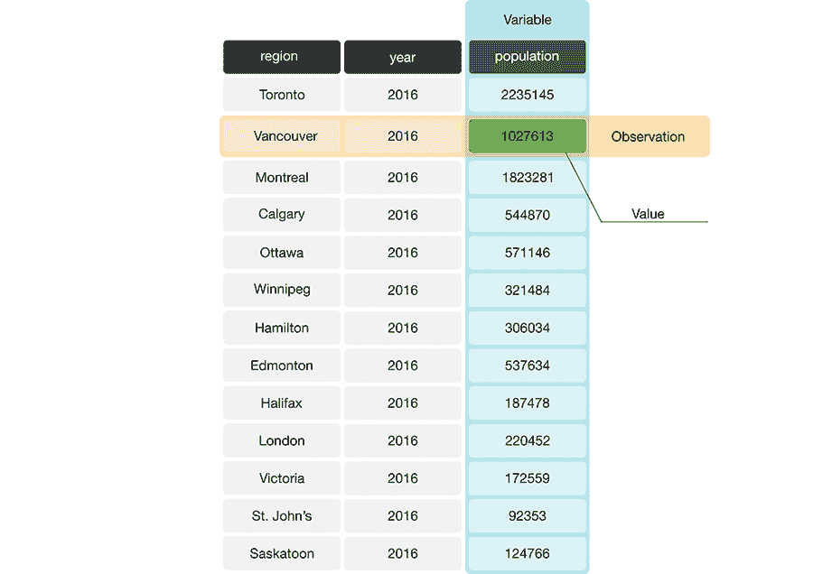

图 3.1：存储有关加拿大各地区人口数据的数据框。在这个示例数据框中，对应于温哥华市观测的行被涂成黄色，对应于人口变量的列被涂成蓝色。

R 将数据框的列存储为 *列表* 或 *向量*。例如，图 3.2 中的数据框有三个向量，其名称分别为 `region`、`year` 和 `population`。接下来的两节将解释列表和向量是什么。

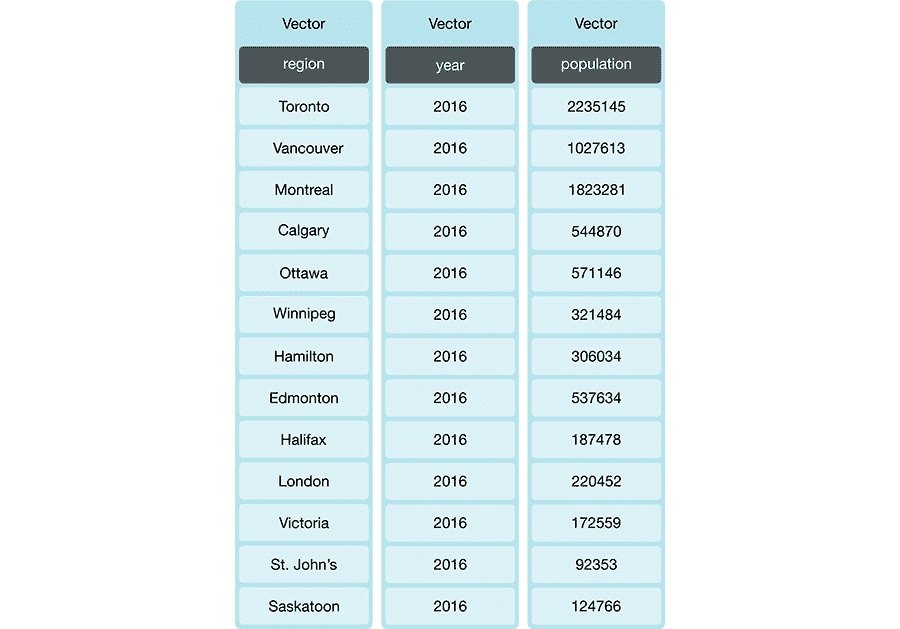

图 3.2：包含三个向量的数据框。

### 3.3.2 什么是向量？

在 R 中，**向量**是包含一个或多个元素的对象。向量元素是有序的，并且它们必须都是相同的 **数据类型**；R 有几种不同的基本数据类型，如表 3.1 所示。图 3.3 提供了一个所有元素都是字符类型的向量的示例。您可以使用 `c` 函数在 R 中创建向量（`c` 代表“连接”）。例如，要创建图 3.3 中所示的 `region` 向量，您将编写：

```r
region <- c("Toronto", "Montreal", "Vancouver", "Calgary", "Ottawa")
region
```

```r
## [1] "Toronto"   "Montreal"  "Vancouver" "Calgary"   "Ottawa"
```

> **注意：** 从技术上讲，这些对象被称为“原子向量”。在这本书中，我们选择称它们为“向量”，这是 R 社区中最常见的称呼。为了完全准确，"向量"是一个总称，包括 R 中的原子向量和列表对象。但这会创造一个令人困惑的情况，即“向量”一词可能意味着“原子向量”或“原子向量和列表的总称”，这取决于上下文。确实非常令人困惑！因此，为了使事情简单，在这本书中，我们 *始终* 使用“向量”一词来指代“原子向量”。我们鼓励那些热衷于学习更多知识的读者阅读 *Advanced R* 中的向量章节 (Wickham 2019)。


图 3.3：字符类型向量的示例。

表 3.1：R 中的基本数据类型

| 数据类型 | 缩写 | 描述 | 示例 |
| --- | --- | --- | --- |
| character | chr | 用引号包围的字母或数字 | “1”， “Hello world!” |
| double | dbl | 带小数值的数字 | 1.2333 |
| integer | int | 不包含小数的数字 | 1L, 20L（其中“L”告诉 R 以整数存储） |
| logical | lgl | 要么为真要么为假 | `TRUE`，`FALSE` |
| 因子 | fct | 用于表示具有有限值（通常是类别）的数据 | 一个具有级别`red`、`green`和`orange`的`color`变量 |

在 R 中，确保你用正确的类型表示数据非常重要。我们在这本书中使用的许多`tidyverse`函数对不同的数据类型有不同的处理方式。你应该使用整数和双精度浮点数类型（两者都属于“数值”类型）来表示数字并进行算术运算。尽管在 R 中双精度浮点数比整数更常见；例如，当你使用`c()`创建数字向量时，或者通过`read_csv`读取整数时，默认数据类型是双精度浮点数。字符用于表示应被视为“文本”的数据，例如单词、名称、路径、URL 等。因子帮助我们编码表示*类别*的变量；因子变量取一个离散集合中的值，称为*级别*（每个类别一个）。级别可以是有序的或无序的。尽管因子有时*看起来*像字符，但它们不是像字符那样用于表示文本、单词、名称和路径；实际上，R 内部使用整数存储因子！R 中还有其他基本数据类型，如*原始*和*复数*，但我们在本教材中不使用这些类型。

### 3.3.3 列表是什么？

列表也是 R 中的对象，它具有多个有序元素。向量与列表的区别在于元素类型一致性的要求。单个向量中的所有元素必须是同一类型（例如，所有元素都是字符），而单个列表中的元素可以是不同类型（例如，字符、整数、逻辑值，甚至是其他列表）。见图 3.4。

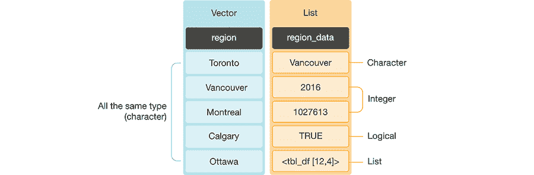

图 3.4：向量与列表的比较。

### 3.3.4 这与数据框有什么关系？

数据框实际上是一种特殊的列表，它遵循两个规则：

1.  每个元素本身必须是向量或列表。

1.  每个元素（向量或列表）必须具有相同的长度。

数据框中的所有列不一定需要是同一类型。图 3.5 显示了一个列是不同类型向量的数据框。但请记住：因为在这个例子中列是*向量*，所以每个列中的元素必须是相同的数据类型。另一方面，如果我们的数据框有*列表*列，则不会有这样的要求。然而，通常更常见的是使用*向量*列，因为单个变量的值通常都是同一类型。


图 3.5：数据框和向量类型。

数据框实际上包含在 R 本身中，无需任何额外的包。然而，本书中使用的`tidyverse`函数都是与一种特殊的数据框类型一起工作的，这种类型称为*tibble*。Tibbles 相对于 R 内置的数据框有一些额外的功能和优势。这包括添加有用的属性（例如分组，我们将在后面讨论）以及在子集时更可预测的类型保留。因为 tibble 只是一个添加了一些功能的数据框，所以我们将在本书中将内置的 R 数据框和 tibbles 统称为*数据框*。

> **注意**：您可以使用`class`函数对一个数据对象进行评估，以确定它是一个内置的 R 数据框还是一个 tibble。如果数据对象是数据框，`class`将返回`"data.frame"`。如果数据对象是 tibble，它将返回`"tbl_df" "tbl" "data.frame"`。您可以使用`tidyverse`的`as_tibble`函数轻松地将内置的 R 数据框转换为 tibbles。例如，我们可以检查我们在前几章中使用的加拿大语言数据集`can_lang`的类，我们看到它是一个 tibble。
> 
> ```r
> class(can_lang)
> ```
> 
> ```r
> ## [1] "spec_tbl_df" "tbl_df"      "tbl"         "data.frame"
> ```

向量、数据框和列表是 R 中的基本数据结构类型，它们是大多数数据分析的核心。我们在表 3.2 中总结了它们。R 编程语言中还有其他几种数据结构（例如，矩阵），但这些超出了本书的范围。

表 3.2：R 中的基本数据结构

| 数据结构 | 描述 |
| --- | --- |
| 向量 | 一个有序的值集合，这些值可以是单个值或多个值，且数据类型相同。 |
| 列表 | 一个有序的值集合，这些值可以是单个值或多个值，且数据类型可能不同。 |
| 数据框 | 一组具有相同长度的向量或列表，带有列名。我们通常使用数据框来表示数据集。 |

## 3.4 整洁数据

表格数据集的组织方式有很多种。本章将重点介绍**整洁数据**的组织格式以及如何使你的原始（可能杂乱）数据变得整洁。整洁数据框满足以下三个标准(Wickham 2014)：

+   每一行代表一个单独的观察值，

+   每一列代表一个单独的变量，并且

+   每个值都是一个单独的单元格（即，它在数据框中的条目不与其他值共享）。

图 3.6 演示了一个满足这些三个标准的数据集。

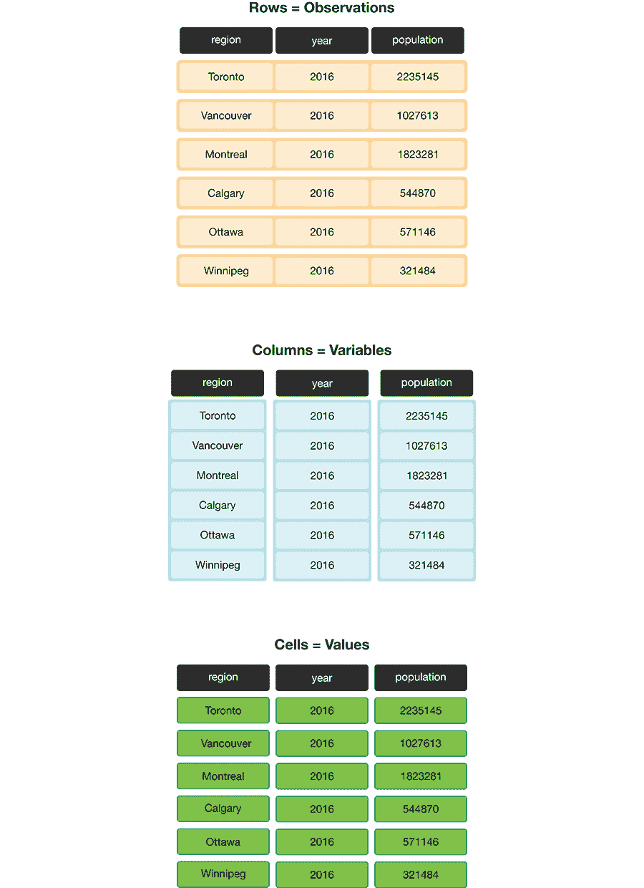

图 3.6：整洁数据满足三个标准。

在分析的第一步确保数据整洁有许多很好的理由。最重要的是，它是一个单一、一致的格式，几乎 `tidyverse` 中的每个函数都认可。无论你的数据中的变量和观测值代表什么，只要数据框是整洁的，你就可以使用相同的工具来操作它、绘制它和分析它。如果你的数据不是整洁的，你将不得不在分析中编写特殊的定制代码，这不仅容易出错，而且难以他人理解。除了使你的分析更容易被他人理解和减少错误之外，整洁数据通常也更容易被人类解释。考虑到这些好处，花时间将数据整理成整洁格式是非常值得的。幸运的是，有许多精心设计的 `tidyverse` 数据清理/整理工具可以帮助你轻松整理数据。让我们在下面探索它们！

> **注意：**对于给定的数据集，整洁数据是否只有一种形状？不一定！这取决于你提出的统计问题和该问题的变量。对于整洁数据，每个变量应该有自己的列。因此，就像匹配你的统计问题与适当的数据分析工具是至关重要的，匹配你的统计问题与适当的变量并确保它们以单独的列形式表示，以使数据整洁也同样重要。

### 3.4.1 整理数据：使用 `pivot_longer` 从宽格式转换为长格式

将存储在单独列中的值合并成一个值，这是将数据整理成整洁格式时经常执行的任务，因为这些值实际上是同一变量的组成部分。数据通常以这种方式存储，因为这种格式有时对人类阅读和理解来说更直观，并且是人类创建数据集。在图 3.7 中，左边的表格以不整洁的、“宽”格式呈现，因为年份值（2006、2011、2016）被存储为列名。因此，这些年份中各个城市的总人口值也被分散在几个列中。

对于人类来说，这个表格很容易阅读，这就是为什么你经常会发现数据以这种宽格式存储。然而，当使用 R 进行数据可视化或统计分析时，这种格式很难处理。例如，如果我们想找到最新的年份，这将是一个挑战，因为年份值被存储为列名，而不是存储在单个列中的值。因此，在我们能够应用一个函数来找到最新的年份（例如，使用 `max`）之前，我们首先需要提取列名，将它们作为一个向量，然后应用一个函数来提取最新的年份。如果你还想找到给定地区在最新年份的人口值，这个问题会更糟。一旦数据被整理，这两个任务都会大大简化。

这种格式的数据还存在另一个问题，那就是我们不知道每年下面的数字实际上代表什么。这些数字代表人口规模？土地面积？并不清楚。为了解决这两个问题，我们可以通过创建一个名为“year”的列和一个名为“population”的列来将这个数据集重塑为整洁数据格式。这种使数据“更长”的转换在图 3.7 的右侧表格中显示。

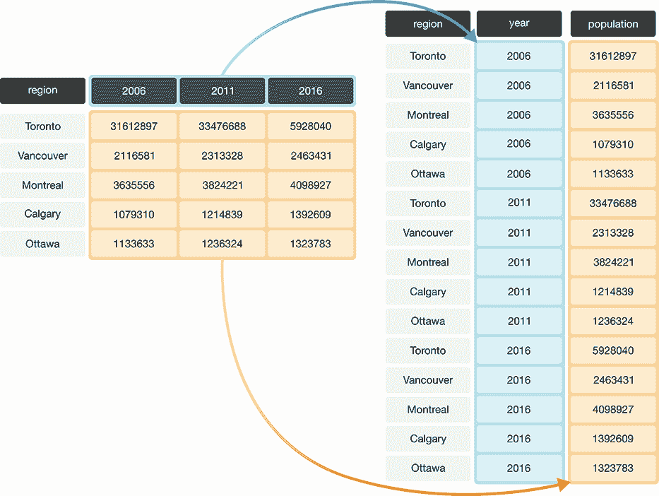

图 3.7：从宽格式到长格式的数据转换。

我们可以使用来自 `tidyverse` 包的 `pivot_longer` 函数在 R 中实现这种效果。`pivot_longer` 函数用于合并列，通常在整理数据时使用，当我们需要将数据框变得更长更窄时。要学习如何使用 `pivot_longer`，我们将通过一个使用 `region_lang_top5_cities_wide.csv` 数据集的例子来操作。这个数据集包含了 2016 年加拿大人口普查中，五个主要加拿大城市（多伦多、蒙特利尔、温哥华、卡尔加里和埃德蒙顿）的加拿大人将每种语言作为母语的计数。为了开始，我们将加载 `tidyverse` 包并使用 `read_csv` 读取（未整理）的数据。

```r
library(tidyverse)

lang_wide <- read_csv("data/region_lang_top5_cities_wide.csv")
lang_wide
```

```r
## # A tibble: 214 × 7
##    category                 language Toronto Montréal Vancouver Calgary Edmonton
##    <chr>                    <chr>      <dbl>    <dbl>     <dbl>   <dbl>    <dbl>
##  1 Aboriginal languages     Aborigi…      80       30        70      20       25
##  2 Non-Official & Non-Abor… Afrikaa…     985       90      1435     960      575
##  3 Non-Official & Non-Abor… Afro-As…     360      240        45      45       65
##  4 Non-Official & Non-Abor… Akan (T…    8485     1015       400     705      885
##  5 Non-Official & Non-Abor… Albanian   13260     2450      1090    1365      770
##  6 Aboriginal languages     Algonqu…       5        5         0       0        0
##  7 Aboriginal languages     Algonqu…       5       30         5       5        0
##  8 Non-Official & Non-Abor… America…     470       50       265     100      180
##  9 Non-Official & Non-Abor… Amharic     7460      665      1140    4075     2515
## 10 Non-Official & Non-Abor… Arabic     85175   151955     14320   18965    17525
## # ℹ 204 more rows
```

上述未整理格式有什么问题？图 3.8 左边的表格代表了“宽”（杂乱）格式的数据。从数据分析的角度来看，这种格式并不理想，因为变量 *region*（多伦多、蒙特利尔、温哥华、卡尔加里和埃德蒙顿）的值被存储为列名。因此，它们不容易被我们应用到数据集上的数据分析函数访问。此外，*母语*变量的值分散在多个列中，这将阻止我们进行任何所需的可视化或统计任务，直到我们将它们合并到一个列中。例如，如果我们想了解在所有五个地区中报告母语数量最多的语言，这个问题在当前的数据格式下将很难回答。虽然我们可以用这种格式找到答案，但如果首先整理我们的数据，回答这个问题会容易得多。如果母语被存储为图 3.8 右边的整洁数据中所示的一个列，我们只需一行代码中的 `max` 函数就可以得到最大值。

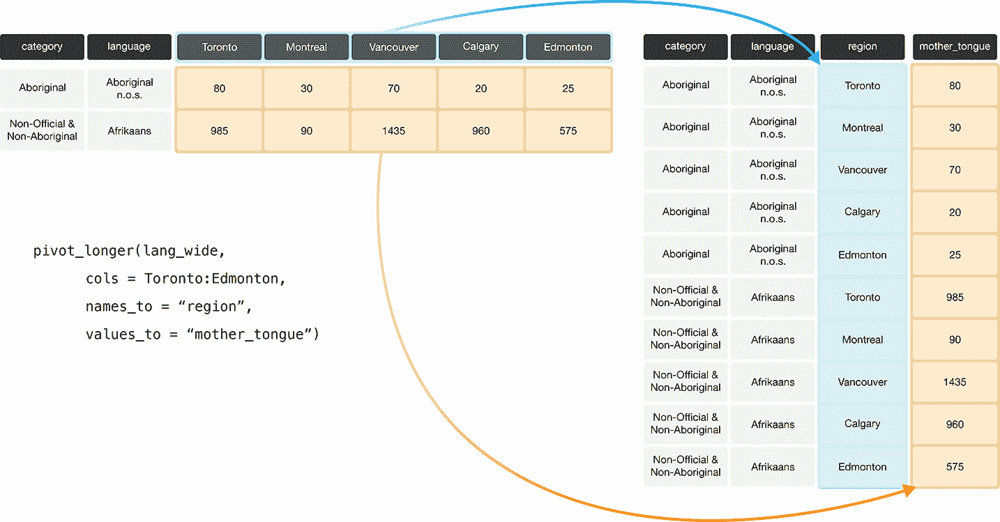

图 3.8：使用 `pivot_longer` 函数从宽格式到长格式转换。

图 3.9 详细说明了在 `pivot_longer` 函数中我们需要指定的参数以完成这种数据转换。

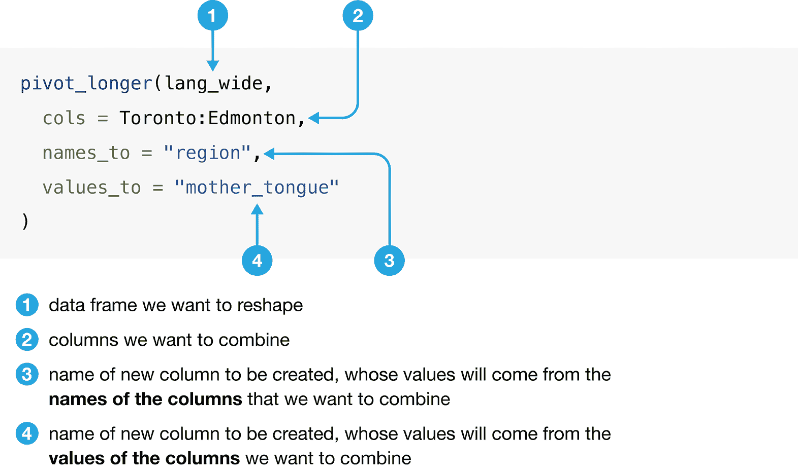

图 3.9：`pivot_longer`函数的语法。

我们使用`pivot_longer`将多伦多、蒙特利尔、温哥华、卡尔加里和埃德蒙顿的列合并成一个名为`region`的单列，并创建一个名为`mother_tongue`的列，该列包含报告每种语言为各自大都市区母语的加拿大人的数量。我们在多伦多和埃德蒙顿之间使用冒号`:`来告诉 R 选择多伦多和埃德蒙顿之间的所有列：

```r
lang_mother_tidy <- pivot_longer(lang_wide,
 cols = Toronto:Edmonton,
 names_to = "region",
 values_to = "mother_tongue"
)

lang_mother_tidy
```

```r
## # A tibble: 1,070 × 4
##    category                                language         region mother_tongue
##    <chr>                                   <chr>            <chr>          <dbl>
##  1 Aboriginal languages                    Aboriginal lang… Toron…            80
##  2 Aboriginal languages                    Aboriginal lang… Montr…            30
##  3 Aboriginal languages                    Aboriginal lang… Vanco…            70
##  4 Aboriginal languages                    Aboriginal lang… Calga…            20
##  5 Aboriginal languages                    Aboriginal lang… Edmon…            25
##  6 Non-Official & Non-Aboriginal languages Afrikaans        Toron…           985
##  7 Non-Official & Non-Aboriginal languages Afrikaans        Montr…            90
##  8 Non-Official & Non-Aboriginal languages Afrikaans        Vanco…          1435
##  9 Non-Official & Non-Aboriginal languages Afrikaans        Calga…           960
## 10 Non-Official & Non-Aboriginal languages Afrikaans        Edmon…           575
## # ℹ 1,060 more rows
```

> **注意**：在上面的代码中，对`pivot_longer`函数的调用被拆分成了多行。在某些情况下这是允许的；例如，像上面那样调用函数，只要行末以逗号`,`结尾，R 就会知道继续读取下一行。将长行拆分到多行中是鼓励的做法，因为它可以显著提高代码的可读性。一般来说，你应该将每行代码限制在大约 80 个字符以内。

上述数据现在已经是整洁的，因为所有三个整洁数据的准则现在都已满足：

1.  所有变量（`category`、`language`、`region`和`mother_tongue`）现在都是数据框中的单独列。

1.  每个观察值（即，该地区的一种语言）都在单独的一行中。

1.  每个值都是一个单独的单元格，即，它在数据框中的行和列位置不与其他值共享。

### 3.4.2 整理：使用 `pivot_wider` 从长格式转换为宽格式

假设我们的观察值分布在多行而不是单行中。例如，在图 3.10 中，左边的表格是不整洁的长格式，因为`count`列包含三个变量（人口、通勤者计数和城市成立年份）以及每个观察值（在这里，地区的人口、通勤者和成立值）的信息分布在三个行中。记住：整洁数据的准则之一是每个观察值必须在单行中。

使用这种格式的数据——其中两个或多个变量混合在单个列中——使得应用许多常用的`tidyverse`函数变得更加困难。例如，找到通勤者的最大数量需要额外的步骤来过滤通勤者的值，然后才能计算最大值。相比之下，如果数据是整洁的，我们只需要计算通勤列的最大值。要将这个不整洁的数据集重塑为整洁的（在这个例子中，更宽的）格式，我们需要创建名为“population”（人口）、“commuters”（通勤者）和“incorporated”（成立）的列。这如图 3.10 的右表所示。

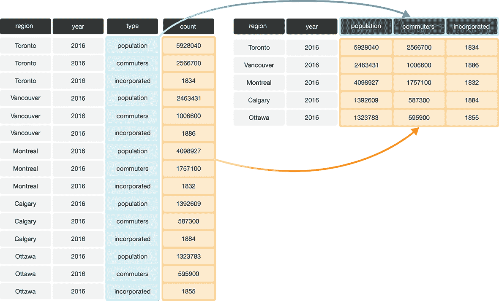

图 3.10：从长格式到宽格式的数据转换。

要在 R 中整理此类数据，我们可以使用`pivot_wider`函数。`pivot_wider`函数通常会增加数据集中的列数（加宽）并减少行数。为了了解如何使用`pivot_wider`，我们将通过`region_lang_top5_cities_long.csv`数据集的示例来操作。此数据集包含五个主要城市（多伦多、蒙特利尔、温哥华、卡尔加里和埃德蒙顿）的加拿大人报告的在家和工作时使用的首选语言的数量。

```r
lang_long <- read_csv("data/region_lang_top5_cities_long.csv")
lang_long
```

```r
## # A tibble: 2,140 × 5
##    region    category             language                     type         count
##    <chr>     <chr>                <chr>                        <chr>        <dbl>
##  1 Montréal  Aboriginal languages Aboriginal languages, n.o.s. most_at_home    15
##  2 Montréal  Aboriginal languages Aboriginal languages, n.o.s. most_at_work     0
##  3 Toronto   Aboriginal languages Aboriginal languages, n.o.s. most_at_home    50
##  4 Toronto   Aboriginal languages Aboriginal languages, n.o.s. most_at_work     0
##  5 Calgary   Aboriginal languages Aboriginal languages, n.o.s. most_at_home     5
##  6 Calgary   Aboriginal languages Aboriginal languages, n.o.s. most_at_work     0
##  7 Edmonton  Aboriginal languages Aboriginal languages, n.o.s. most_at_home    10
##  8 Edmonton  Aboriginal languages Aboriginal languages, n.o.s. most_at_work     0
##  9 Vancouver Aboriginal languages Aboriginal languages, n.o.s. most_at_home    15
## 10 Vancouver Aboriginal languages Aboriginal languages, n.o.s. most_at_work     0
## # ℹ 2,130 more rows
```

上述数据集为什么是不整洁的？在这个例子中，每个观测值是一个区域的语言。然而，每个观测值被分割在多行中：一行记录了`most_at_home`的计数，另一行记录了`most_at_work`的计数。假设这个数据的目标是可视化报告其在家和工作时使用首选语言的加拿大人数量的关系。以当前数据的形式做这件事将是困难的，因为这两个变量存储在同一列中。图 3.11 展示了如何使用`pivot_wider`函数来整理这些数据。


图 3.11：使用`pivot_wider`函数从长格式转换为宽格式。

图 3.12 详细说明了在`pivot_wider`函数中需要指定的参数。


图 3.12：`pivot_wider`函数的语法。

我们将在图 3.12 中详细说明如何应用此函数。

```r
lang_home_tidy <- pivot_wider(lang_long,
 names_from = type,
 values_from = count
)
lang_home_tidy
```

```r
## # A tibble: 1,070 × 5
##    region    category                         language most_at_home most_at_work
##    <chr>     <chr>                            <chr>           <dbl>        <dbl>
##  1 Montréal  Aboriginal languages             Aborigi…           15            0
##  2 Toronto   Aboriginal languages             Aborigi…           50            0
##  3 Calgary   Aboriginal languages             Aborigi…            5            0
##  4 Edmonton  Aboriginal languages             Aborigi…           10            0
##  5 Vancouver Aboriginal languages             Aborigi…           15            0
##  6 Montréal  Non-Official & Non-Aboriginal l… Afrikaa…           10            0
##  7 Toronto   Non-Official & Non-Aboriginal l… Afrikaa…          265            0
##  8 Calgary   Non-Official & Non-Aboriginal l… Afrikaa…          505           15
##  9 Edmonton  Non-Official & Non-Aboriginal l… Afrikaa…          300            0
## 10 Vancouver Non-Official & Non-Aboriginal l… Afrikaa…          520           10
## # ℹ 1,060 more rows
```

上面的数据现在已经整洁！我们可以再次通过三个标准来检查这些数据是否是整洁数据集。

1.  所有统计变量都是数据框中的单独列（即，`most_at_home`和`most_at_work`已经被分离到数据框中的单独列）。

1.  每个观测值（即，每个区域中的每种语言）都在单独的一行中。

1.  每个值都是一个单独的单元格（即，它在数据框中的行和列位置不与其他值共享）。

你可能会注意到，我们在整洁数据集中拥有的列数与杂乱数据集中的一样。因此，`pivot_wider`并没有真正“加宽”数据，正如其名称所暗示的。这仅仅是因为原始的`type`列中只有两个类别。如果它有超过两个，`pivot_wider`将创建更多的列，我们就会看到数据集“加宽”。

### 3.4.3 整理数据：使用`separate`处理多个分隔符

当多个值存储在同一单元格中时，数据也被认为是不整洁的。下面我们展示的数据集甚至比上面我们处理的数据集还要混乱：`Toronto`、`Montréal`、`Vancouver`、`Calgary` 和 `Edmonton` 列包含报告他们在家和工作中主要语言的加拿大人数，这些数字在一个列中通过分隔符（`/`）分隔。列名是变量的值，*而且*每个值都没有自己的单元格！为了将这种混乱的数据转换为整洁数据，我们得解决这些问题。

```r
lang_messy <- read_csv("data/region_lang_top5_cities_messy.csv")
lang_messy
```

```r
## # A tibble: 214 × 7
##    category                 language Toronto Montréal Vancouver Calgary Edmonton
##    <chr>                    <chr>    <chr>   <chr>    <chr>     <chr>   <chr>   
##  1 Aboriginal languages     Aborigi… 50/0    15/0     15/0      5/0     10/0    
##  2 Non-Official & Non-Abor… Afrikaa… 265/0   10/0     520/10    505/15  300/0   
##  3 Non-Official & Non-Abor… Afro-As… 185/10  65/0     10/0      15/0    20/0    
##  4 Non-Official & Non-Abor… Akan (T… 4045/20 440/0    125/10    330/0   445/0   
##  5 Non-Official & Non-Abor… Albanian 6380/2… 1445/20  530/10    620/25  370/10  
##  6 Aboriginal languages     Algonqu… 5/0     0/0      0/0       0/0     0/0     
##  7 Aboriginal languages     Algonqu… 0/0     10/0     0/0       0/0     0/0     
##  8 Non-Official & Non-Abor… America… 720/245 70/0     300/140   85/25   190/85  
##  9 Non-Official & Non-Abor… Amharic  3820/55 315/0    540/10    2730/50 1695/35 
## 10 Non-Official & Non-Abor… Arabic   45025/… 72980/1… 8680/275  11010/… 10590/3…
## # ℹ 204 more rows
```

首先，我们将使用 `pivot_longer` 创建两个列，`region` 和 `value`，类似于我们之前所做的那样。新的 `region` 列将包含区域名称，新的列 `value` 将是进一步分离所需数据的临时存储位置，即报告在家和工作中主要语言的加拿大人数。

```r
lang_messy_longer <- pivot_longer(lang_messy,
 cols = Toronto:Edmonton,
 names_to = "region",
 values_to = "value"
)

lang_messy_longer
```

```r
## # A tibble: 1,070 × 4
##    category                                language                 region value
##    <chr>                                   <chr>                    <chr>  <chr>
##  1 Aboriginal languages                    Aboriginal languages, n… Toron… 50/0 
##  2 Aboriginal languages                    Aboriginal languages, n… Montr… 15/0 
##  3 Aboriginal languages                    Aboriginal languages, n… Vanco… 15/0 
##  4 Aboriginal languages                    Aboriginal languages, n… Calga… 5/0  
##  5 Aboriginal languages                    Aboriginal languages, n… Edmon… 10/0 
##  6 Non-Official & Non-Aboriginal languages Afrikaans                Toron… 265/0
##  7 Non-Official & Non-Aboriginal languages Afrikaans                Montr… 10/0 
##  8 Non-Official & Non-Aboriginal languages Afrikaans                Vanco… 520/…
##  9 Non-Official & Non-Aboriginal languages Afrikaans                Calga… 505/…
## 10 Non-Official & Non-Aboriginal languages Afrikaans                Edmon… 300/0
## # ℹ 1,060 more rows
```

接下来，我们将使用 `separate` 将 `value` 列拆分为两个列。一个列将只包含说在家中最常使用的语言的加拿大人数，另一个列将包含每个地区说在工作中最常使用的语言的加拿大人数。图 3.13 概述了我们使用 `separate` 需要指定的内容。


图 3.13：`separate` 函数的语法。

```r
tidy_lang <- separate(lang_messy_longer,
 col = value,
 into = c("most_at_home", "most_at_work"),
 sep = "/"
)

tidy_lang
```

```r
## # A tibble: 1,070 × 5
##    category                            language region most_at_home most_at_work
##    <chr>                               <chr>    <chr>  <chr>        <chr>       
##  1 Aboriginal languages                Aborigi… Toron… 50           0           
##  2 Aboriginal languages                Aborigi… Montr… 15           0           
##  3 Aboriginal languages                Aborigi… Vanco… 15           0           
##  4 Aboriginal languages                Aborigi… Calga… 5            0           
##  5 Aboriginal languages                Aborigi… Edmon… 10           0           
##  6 Non-Official & Non-Aboriginal lang… Afrikaa… Toron… 265          0           
##  7 Non-Official & Non-Aboriginal lang… Afrikaa… Montr… 10           0           
##  8 Non-Official & Non-Aboriginal lang… Afrikaa… Vanco… 520          10          
##  9 Non-Official & Non-Aboriginal lang… Afrikaa… Calga… 505          15          
## 10 Non-Official & Non-Aboriginal lang… Afrikaa… Edmon… 300          0           
## # ℹ 1,060 more rows
```

这个数据集现在整洁了吗？如果我们回想一下整洁数据的三个标准：

+   每行是一个单独的观察值，

+   每列是一个单独的变量，并且

+   每个值都是一个单独的单元格。

我们可以看到，现在这个数据满足所有三个标准，这使得分析变得更加容易。但我们还没有完成！注意在上述表格中，每个列名下面都出现了 `<chr>` 这个词。列名下的词表示每个列的数据类型。在这里，所有变量都是“字符”数据类型。回想一下，字符数据类型是被引号包围的字母或数字。在 3.4.2 节的先前的例子中，`most_at_home` 和 `most_at_work` 变量是 `<dbl>`（双精度浮点数）——你可以通过查看前几节中的表格来验证这一点——这是一种数值数据类型。这种变化是由于我们在读取这个混乱的数据集时使用的分隔符（`/`）。R 将这些列读取为字符类型，并且默认情况下，`separate` 将返回字符数据类型的列。

将 `region`、`category` 和 `language` 存储为字符（或可能是因子）类型是有意义的。然而，如果我们想应用任何将 `most_at_home` 和 `most_at_work` 列作为数字处理的函数（例如，查找超过列的数值阈值的行）。在这种情况下，如果变量存储为 `character` 类型，将无法完成。幸运的是，`separate` 函数提供了一个自然的方式来解决这个问题：我们可以设置 `convert = TRUE` 将 `most_at_home` 和 `most_at_work` 列转换为正确的数据类型。

```r
tidy_lang <- separate(lang_messy_longer,
 col = value,
 into = c("most_at_home", "most_at_work"),
 sep = "/",
 convert = TRUE
)

tidy_lang
```

```r
## # A tibble: 1,070 × 5
##    category                            language region most_at_home most_at_work
##    <chr>                               <chr>    <chr>         <int>        <int>
##  1 Aboriginal languages                Aborigi… Toron…           50            0
##  2 Aboriginal languages                Aborigi… Montr…           15            0
##  3 Aboriginal languages                Aborigi… Vanco…           15            0
##  4 Aboriginal languages                Aborigi… Calga…            5            0
##  5 Aboriginal languages                Aborigi… Edmon…           10            0
##  6 Non-Official & Non-Aboriginal lang… Afrikaa… Toron…          265            0
##  7 Non-Official & Non-Aboriginal lang… Afrikaa… Montr…           10            0
##  8 Non-Official & Non-Aboriginal lang… Afrikaa… Vanco…          520           10
##  9 Non-Official & Non-Aboriginal lang… Afrikaa… Calga…          505           15
## 10 Non-Official & Non-Aboriginal lang… Afrikaa… Edmon…          300            0
## # ℹ 1,060 more rows
```

现在，我们看到 `<int>` 出现在 `most_at_home` 和 `most_at_work` 列下面，这表明它们是整数数据类型（即，数字）！

## 3.5 使用 `select` 提取一系列列

既然 `tidy_lang` 数据确实是 *tidy* 的，我们就可以开始使用 `tidyverse` 中的强大函数集来操作它了。对于第一个例子，回忆一下第一章中的 `select` 函数，它允许我们从数据框中创建列的子集。假设我们只想从 `tidy_lang` 数据集中选择 `language`、`region`、`most_at_home` 和 `most_at_work` 这些列。使用我们在第一章中学到的知识，我们将 `tidy_lang` 数据框以及所有这些列名传递给 `select` 函数：

```r
selected_columns <- select(tidy_lang,
 language,
 region,
 most_at_home,
 most_at_work)
selected_columns
```

```r
## # A tibble: 1,070 × 4
##    language                     region    most_at_home most_at_work
##    <chr>                        <chr>            <int>        <int>
##  1 Aboriginal languages, n.o.s. Toronto             50            0
##  2 Aboriginal languages, n.o.s. Montréal            15            0
##  3 Aboriginal languages, n.o.s. Vancouver           15            0
##  4 Aboriginal languages, n.o.s. Calgary              5            0
##  5 Aboriginal languages, n.o.s. Edmonton            10            0
##  6 Afrikaans                    Toronto            265            0
##  7 Afrikaans                    Montréal            10            0
##  8 Afrikaans                    Vancouver          520           10
##  9 Afrikaans                    Calgary            505           15
## 10 Afrikaans                    Edmonton           300            0
## # ℹ 1,060 more rows
```

在这里，我们写出了每一列的名称。然而，这种方法很耗时，尤其是如果你有很多列！另一种方法是使用“选择辅助工具”。选择辅助工具是使我们可以更容易地选择列的运算符。例如，我们可以使用选择辅助工具来选择一系列列，而不是逐个输入每个列名。为此，我们使用冒号（`:`）运算符来表示范围。例如，要获取 `tidy_lang` 数据框中从 `language` 到 `most_at_work` 的所有列，我们将 `language:most_at_work` 作为 `select` 函数的第二个参数传递。

```r
column_range <- select(tidy_lang, language:most_at_work)
column_range
```

```r
## # A tibble: 1,070 × 4
##    language                     region    most_at_home most_at_work
##    <chr>                        <chr>            <int>        <int>
##  1 Aboriginal languages, n.o.s. Toronto             50            0
##  2 Aboriginal languages, n.o.s. Montréal            15            0
##  3 Aboriginal languages, n.o.s. Vancouver           15            0
##  4 Aboriginal languages, n.o.s. Calgary              5            0
##  5 Aboriginal languages, n.o.s. Edmonton            10            0
##  6 Afrikaans                    Toronto            265            0
##  7 Afrikaans                    Montréal            10            0
##  8 Afrikaans                    Vancouver          520           10
##  9 Afrikaans                    Calgary            505           15
## 10 Afrikaans                    Edmonton           300            0
## # ℹ 1,060 more rows
```

注意，我们得到了与上面相同的输出，但代码更少（也更清晰！）这种类型的运算符对于大型数据集特别有用。

假设我们想要提取符合特定模式的列，而不仅仅是选择一个范围。例如，假设我们只想选择 `most_at_home` 和 `most_at_work` 这些列。还有其他辅助函数允许我们根据它们的名称选择变量。特别是，我们可以使用 `select` 辅助函数 `starts_with` 来选择以单词“most”开头的列：

```r
select(tidy_lang, starts_with("most"))
```

```r
## # A tibble: 1,070 × 2
##    most_at_home most_at_work
##           <int>        <int>
##  1           50            0
##  2           15            0
##  3           15            0
##  4            5            0
##  5           10            0
##  6          265            0
##  7           10            0
##  8          520           10
##  9          505           15
## 10          300            0
## # ℹ 1,060 more rows
```

我们也可以选择包含下划线 `_` 的列，通过在 `select` 函数中添加 `contains("_")` 作为第二个参数，因为我们注意到我们想要的列包含下划线，而其他列则没有。

```r
select(tidy_lang, contains("_"))
```

```r
## # A tibble: 1,070 × 2
##    most_at_home most_at_work
##           <int>        <int>
##  1           50            0
##  2           15            0
##  3           15            0
##  4            5            0
##  5           10            0
##  6          265            0
##  7           10            0
##  8          520           10
##  9          505           15
## 10          300            0
## # ℹ 1,060 more rows
```

有许多不同的 `select` 辅助函数，可以根据特定标准选择变量。本章末尾的附加资源部分提供了关于 `select` 辅助函数的全面资源。

## 3.6 使用 `filter` 提取行

接下来，我们回顾第一章中的`filter`函数，它允许我们从数据帧中创建行子集。回想一下`filter`函数的两个主要参数：第一个是数据帧对象的名称，第二个是用于过滤行的*逻辑语句*。`filter`函数通过返回逻辑语句评估为`TRUE`的行来工作。本节将突出介绍`filter`函数的更高级用法。特别是，本节深入探讨了在`filter`函数中可以使用各种逻辑语句来选择行子集。

### 3.6.1 使用`==`提取具有特定值的行

假设我们只对`tidy_lang`数据集中对应加拿大官方语言（英语和法语）的行子集感兴趣。我们可以通过使用*等价运算符*（`==`）比较`category`列的值与`"Official languages"`的值来`filter`这些行。使用这些参数，`filter`返回一个数据帧，包含输入数据帧的所有列，但只有我们在逻辑语句中请求的行，即`category`列包含值`"Official languages"`的行。我们将这个数据帧命名为`official_langs`。

```r
official_langs <- filter(tidy_lang, category == "Official languages")
official_langs
```

```r
## # A tibble: 10 × 5
##    category           language region    most_at_home most_at_work
##    <chr>              <chr>    <chr>            <int>        <int>
##  1 Official languages English  Toronto        3836770      3218725
##  2 Official languages English  Montréal        620510       412120
##  3 Official languages English  Vancouver      1622735      1330555
##  4 Official languages English  Calgary        1065070       844740
##  5 Official languages English  Edmonton       1050410       792700
##  6 Official languages French   Toronto          29800        11940
##  7 Official languages French   Montréal       2669195      1607550
##  8 Official languages French   Vancouver         8630         3245
##  9 Official languages French   Calgary           8630         2140
## 10 Official languages French   Edmonton         10950         2520
```

### 3.6.2 使用`!=`提取不具有特定值的行

如果我们想要数据集中除“官方语言”类别之外的所有其他语言类别怎么办？我们可以使用`!=`运算符，它表示“不等于”。因此，如果我们想要找到所有`category`列不等于`"Official languages"`的行，我们可以编写下面的代码。

```r
filter(tidy_lang, category != "Official languages")
```

```r
## # A tibble: 1,060 × 5
##    category                            language region most_at_home most_at_work
##    <chr>                               <chr>    <chr>         <int>        <int>
##  1 Aboriginal languages                Aborigi… Toron…           50            0
##  2 Aboriginal languages                Aborigi… Montr…           15            0
##  3 Aboriginal languages                Aborigi… Vanco…           15            0
##  4 Aboriginal languages                Aborigi… Calga…            5            0
##  5 Aboriginal languages                Aborigi… Edmon…           10            0
##  6 Non-Official & Non-Aboriginal lang… Afrikaa… Toron…          265            0
##  7 Non-Official & Non-Aboriginal lang… Afrikaa… Montr…           10            0
##  8 Non-Official & Non-Aboriginal lang… Afrikaa… Vanco…          520           10
##  9 Non-Official & Non-Aboriginal lang… Afrikaa… Calga…          505           15
## 10 Non-Official & Non-Aboriginal lang… Afrikaa… Edmon…          300            0
## # ℹ 1,050 more rows
```

### 3.6.3 使用`,`或`&`提取满足多个条件的行

假设现在我们只想查看蒙特利尔地区的法语行。为此，我们需要过滤数据集以找到同时满足多个条件的行。我们可以使用逗号符号（`,`），在`filter`函数中，R 将其解释为“和”。下面我们编写代码来过滤`official_langs`数据帧，以子集形式获取满足`region == "Montréal"` *和* `language == "French"`的行。

```r
filter(official_langs, region == "Montréal", language == "French")
```

```r
## # A tibble: 1 × 5
##   category           language region   most_at_home most_at_work
##   <chr>              <chr>    <chr>           <int>        <int>
## 1 Official languages French   Montréal      2669195      1607550
```

我们还可以使用逻辑运算符`&`，它提供了满足一个条件 *和* 另一个条件都满足的情况。在`filter`函数中，你可以互换使用逗号（`,`）或逻辑运算符`&`。

```r
filter(official_langs, region == "Montréal" & language == "French")
```

```r
## # A tibble: 1 × 5
##   category           language region   most_at_home most_at_work
##   <chr>              <chr>    <chr>           <int>        <int>
## 1 Official languages French   Montréal      2669195      1607550
```

### 3.6.4 使用`|`提取至少满足一个条件的行

假设我们只对`official_langs`数据集中对应阿尔伯塔省城市（埃德蒙顿和卡尔加里）的行感兴趣。我们不能使用上面提到的逗号（`,`），因为`region`不能同时等于埃德蒙顿 *和* 卡尔加里。相反，我们可以使用垂直管道（`|`）逻辑运算符，它提供了满足一个条件 *或* 另一个条件 *或* 两个条件都满足的情况。在下面的代码中，我们要求 R 返回`region`列等于“Calgary” *或* “Edmonton”的行。

```r
filter(official_langs, region == "Calgary" | region == "Edmonton")
```

```r
## # A tibble: 4 × 5
##   category           language region   most_at_home most_at_work
##   <chr>              <chr>    <chr>           <int>        <int>
## 1 Official languages English  Calgary       1065070       844740
## 2 Official languages English  Edmonton      1050410       792700
## 3 Official languages French   Calgary          8630         2140
## 4 Official languages French   Edmonton        10950         2520
```

### 3.6.5 使用 `%in%` 提取向量中的值

接下来，假设我们想查看我们五个城市的总人口。让我们读取来自 2016 年加拿大人口普查的 `region_data.csv` 文件，因为它包含不同地区的家庭数量、土地面积、人口和住宅数量的统计数据。

```r
region_data <- read_csv("data/region_data.csv")
region_data
```

```r
## # A tibble: 35 × 5
##    region         households  area population dwellings
##    <chr>               <dbl> <dbl>      <dbl>     <dbl>
##  1 Belleville          43002 1355\.     103472     45050
##  2 Lethbridge          45696 3047\.     117394     48317
##  3 Thunder Bay         52545 2618\.     121621     57146
##  4 Peterborough        50533 1637\.     121721     55662
##  5 Saint John          52872 3793\.     126202     58398
##  6 Brantford           52530 1086\.     134203     54419
##  7 Moncton             61769 2625\.     144810     66699
##  8 Guelph              59280  604\.     151984     63324
##  9 Trois-Rivières      72502 1053\.     156042     77734
## 10 Saguenay            72479 3079\.     160980     77968
## # ℹ 25 more rows
```

要获取五个城市的总人口，我们可以使用 `%in%` 操作符过滤数据集。`%in%` 操作符用于检查一个元素是否属于一个向量。在这里，我们正在过滤那些 `region` 列中的值与我们所感兴趣的五个城市（多伦多、蒙特利尔、温哥华、卡尔加里和埃德蒙顿）中的任何一个匹配的行。

```r
city_names <- c("Toronto", "Montréal", "Vancouver", "Calgary", "Edmonton")
five_cities <- filter(region_data,
 region %in% city_names)
five_cities
```

```r
## # A tibble: 5 × 5
##   region    households  area population dwellings
##   <chr>          <dbl> <dbl>      <dbl>     <dbl>
## 1 Edmonton      502143 9858\.    1321426    537634
## 2 Calgary       519693 5242\.    1392609    544870
## 3 Vancouver     960894 3040\.    2463431   1027613
## 4 Montréal     1727310 4638\.    4098927   1823281
## 5 Toronto      2135909 6270\.    5928040   2235145
```

> **注意：** `==` 和 `%in%` 之间有什么区别？假设我们有两个向量，`vectorA` 和 `vectorB`。如果你在 R 中输入 `vectorA == vectorB`，它将逐元素比较这两个向量。R 会检查 `vectorA` 的第一个元素是否等于 `vectorB` 的第一个元素，`vectorA` 的第二个元素是否等于 `vectorB` 的第二个元素，依此类推。另一方面，`vectorA %in% vectorB` 将 `vectorA` 的第一个元素与 `vectorB` 中的所有元素进行比较。然后 `vectorA` 的第二个元素与 `vectorB` 中的所有元素进行比较，依此类推。注意以下示例中 `==` 和 `%in%` 之间的区别。
> 
> ```r
> c("Vancouver", "Toronto") == c("Toronto", "Vancouver")
> ```
> 
> ```r
> ## [1] FALSE FALSE
> ```
> 
> ```r
> c("Vancouver", "Toronto") %in% c("Toronto", "Vancouver")
> ```
> 
> ```r
> ## [1] TRUE TRUE
> ```

### 3.6.6 使用 `>` 和 `<` 提取高于或低于阈值的行

我们在 3.6.3 节中看到，有 2,669,195 人报告说在蒙特利尔将法语作为他们的家庭主要语言。如果我们对在家庭中将其作为主要语言的人数比蒙特利尔的法语更多的人口地区寻找官方语言感兴趣，那么我们可以使用 `filter` 来获取 `most_at_home` 值大于 2,669,195 的行。我们使用 `>` 符号来查找高于阈值的值，使用 `<` 符号来查找低于阈值的值。`>=` 和 `<=` 符号类似地用于查找等于或高于阈值的值和等于或低于阈值的值。

```r
filter(official_langs, most_at_home > 2669195)
```

```r
## # A tibble: 1 × 5
##   category           language region  most_at_home most_at_work
##   <chr>              <chr>    <chr>          <int>        <int>
## 1 Official languages English  Toronto      3836770      3218725
```

`filter` 返回一个只有一行的数据框，表明在考虑官方语言的情况下，根据 2016 年加拿大人口普查，在多伦多，更多的人将英语而不是法语作为他们的家庭主要语言报告，这比蒙特利尔的法语要多。

## 3.7 使用 `mutate` 修改或添加列

### 3.7.1 使用 `mutate` 修改列

在 3.4.3 节中，当我们首次读取 `"region_lang_top5_cities_messy.csv"` 数据时，所有变量都是“字符”数据类型。在整理过程中，我们使用了 `separate` 函数的 `convert` 参数将 `most_at_home` 和 `most_at_work` 列转换为所需的整数（即数值类）数据类型。但假设我们没有使用 `convert` 参数，需要以其他方式修改列类型。下面我们创建这样的场景，以便我们可以展示如何使用 `mutate` 来更改数据框的列类型。`mutate` 是一个有用的函数，可以修改或创建新的数据框列。

```r
lang_messy <- read_csv("data/region_lang_top5_cities_messy.csv")
lang_messy_longer <- pivot_longer(lang_messy,
 cols = Toronto:Edmonton,
 names_to = "region",
 values_to = "value")
tidy_lang_chr <- separate(lang_messy_longer, col = value,
 into = c("most_at_home", "most_at_work"),
 sep = "/")
official_langs_chr <- filter(tidy_lang_chr, category == "Official languages")

official_langs_chr
```

```r
## # A tibble: 10 × 5
##    category           language region    most_at_home most_at_work
##    <chr>              <chr>    <chr>     <chr>        <chr>       
##  1 Official languages English  Toronto   3836770      3218725     
##  2 Official languages English  Montréal  620510       412120      
##  3 Official languages English  Vancouver 1622735      1330555     
##  4 Official languages English  Calgary   1065070      844740      
##  5 Official languages English  Edmonton  1050410      792700      
##  6 Official languages French   Toronto   29800        11940       
##  7 Official languages French   Montréal  2669195      1607550     
##  8 Official languages French   Vancouver 8630         3245        
##  9 Official languages French   Calgary   8630         2140        
## 10 Official languages French   Edmonton  10950        2520
```

要使用 `mutate`，我们首先在第一个参数中指定数据集，然后在后续参数中指定我们想要修改或创建的列的名称（这里为 `most_at_home` 和 `most_at_work`），一个 `=` 符号，然后是我们想要应用的功能（这里为 `as.numeric`）。在我们想要应用的功能中，我们直接引用我们想要其作用的列名（这里为 `most_at_home` 和 `most_at_work`）。在我们的例子中，我们给列取的名字与数据框中已存在的列名相同（`most_at_home`， `most_at_work`），这将导致 `mutate` 会 *覆盖* 这些列（也称为就地 *修改* 这些列）。如果我们给列取一个新的名字，那么 `mutate` 会创建我们指定的新列名。`mutate` 的通用语法在图 3.14 中详细说明。


图 3.14：`mutate` 函数的语法。

下面我们使用 `mutate` 将 `official_langs` 数据集中的 `most_at_home` 和 `most_at_work` 列转换为数值数据类型，如图 3.14 所示：

```r
official_langs_numeric <- mutate(official_langs_chr,
 most_at_home = as.numeric(most_at_home),
 most_at_work = as.numeric(most_at_work)
)

official_langs_numeric
```

```r
## # A tibble: 10 × 5
##    category           language region    most_at_home most_at_work
##    <chr>              <chr>    <chr>            <dbl>        <dbl>
##  1 Official languages English  Toronto        3836770      3218725
##  2 Official languages English  Montréal        620510       412120
##  3 Official languages English  Vancouver      1622735      1330555
##  4 Official languages English  Calgary        1065070       844740
##  5 Official languages English  Edmonton       1050410       792700
##  6 Official languages French   Toronto          29800        11940
##  7 Official languages French   Montréal       2669195      1607550
##  8 Official languages French   Vancouver         8630         3245
##  9 Official languages French   Calgary           8630         2140
## 10 Official languages French   Edmonton         10950         2520
```

现在我们看到 `most_at_home` 和 `most_at_work` 列下面出现了 `<dbl>`，这表明它们是双精度浮点数据类型（这是一种数值数据类型）！

### 3.7.2 使用 `mutate` 创建新列

我们可以在表中看到，根据 2016 年加拿大人口普查，有 3,836,770 人报告说在家中使用英语作为他们的主要语言。这个数字对我们意味着什么？为了理解这个数字，我们需要上下文。特别是，在收集这些数据时多伦多有多少人？根据 2016 年加拿大人口普查概要，多伦多的人口报告为 5,928,040 人。当我们在这种背景下报告说英语是他们的主要家庭语言的人数时，这个数字就更有意义了。我们甚至可以更进一步，将这个计数转换为相对频率或比例。我们可以通过将报告说他们的主要家庭语言是给定语言的人数除以居住在多伦多的人数来实现这一点。例如，2016 年加拿大人口普查中报告说他们的主要家庭语言是英语的比例在多伦多是 0.65。

让我们使用 `mutate` 在我们的数据框中创建一个新列，该列包含我们本章关注的五个城市中讲英语的人的比例。为了完成这项任务，我们事先需要做两个任务：

1.  创建一个包含城市人口值的向量。

1.  筛选 `official_langs` 数据框，只保留语言为英语的行。

要创建一个包含五个城市（多伦多、蒙特利尔、温哥华、卡尔加里、埃德蒙顿）的人口值的向量，我们将使用 `c` 函数（回想一下 `c` 代表“连接”）：

```r
city_pops <- c(5928040, 4098927, 2463431, 1392609, 1321426)
city_pops
```

```r
## [1] 5928040 4098927 2463431 1392609 1321426
```

接下来，我们将筛选 `official_langs` 数据框，只保留语言为英语的行。我们将得到的新数据框命名为 `english_langs`：

```r
english_langs <- filter(official_langs, language == "English")
english_langs
```

```r
## # A tibble: 5 × 5
##   category           language region    most_at_home most_at_work
##   <chr>              <chr>    <chr>            <int>        <int>
## 1 Official languages English  Toronto        3836770      3218725
## 2 Official languages English  Montréal        620510       412120
## 3 Official languages English  Vancouver      1622735      1330555
## 4 Official languages English  Calgary        1065070       844740
## 5 Official languages English  Edmonton       1050410       792700
```

最后，我们可以使用 `mutate` 创建一个名为 `most_at_home_proportion` 的新列，其值对应于报告说他们的主要家庭语言是英语的人数比例。我们将通过将列除以我们的城市人口向量来计算这个值。

```r
english_langs <- mutate(english_langs,
 most_at_home_proportion = most_at_home / city_pops)

english_langs
```

```r
## # A tibble: 5 × 6
##   category      language region most_at_home most_at_work most_at_home_proport…¹
##   <chr>         <chr>    <chr>         <int>        <int>                  <dbl>
## 1 Official lan… English  Toron…      3836770      3218725                  0.647
## 2 Official lan… English  Montr…       620510       412120                  0.151
## 3 Official lan… English  Vanco…      1622735      1330555                  0.659
## 4 Official lan… English  Calga…      1065070       844740                  0.765
## 5 Official lan… English  Edmon…      1050410       792700                  0.795
## # ℹ abbreviated name: ¹​most_at_home_proportion
```

在上面的计算中，我们必须确保将 `city_pops` 向量按照 `english_langs` 数据框中城市列表的顺序排序。这是因为 R 会执行我们进行的除法计算，通过将 `most_at_home` 列的每个元素除以 `city_pops` 向量的每个元素，并按位置匹配。如果没有这样做，就会导致执行错误的数学运算。

> **注意：** 在更高级的数据整理中，有人可能会通过使用称为“连接”的技术以更不易出错的方式解决这个问题。我们将在本章末尾的附加资源中链接到讨论此内容的资源。

## 3.8 使用管道操作符 `|>` 组合函数

在 R 中，我们经常需要按顺序调用多个函数来处理数据框。如果有许多步骤，基本的方法会很快变得难以阅读。例如，假设我们需要对一个名为 `data` 的数据框执行三个操作：

1.  添加一个新列 `new_col`，它是另一列 `old_col` 的两倍，

1.  筛选行，其中另一列 `other_col` 大于 5，

1.  仅选择那些行的新的列 `new_col`。

执行这三个步骤的一种方法就是简单地编写多行代码，在执行过程中存储临时对象：

```r
output_1 <- mutate(data, new_col = old_col * 2)
output_2 <- filter(output_1, other_col > 5)
output <- select(output_2, new_col)
```

这对于多个原因来说难以理解。读者可能会被误导，认为命名对象 `output_1` 和 `output_2` 由于某种原因很重要，而实际上它们只是临时的中间计算。此外，读者必须逐行查找 `output_1` 和 `output_2` 在后续每一行中的使用位置。

另一种完成这个任务的方法是 *组合* 函数：

```r
output <- select(filter(mutate(data, new_col = old_col * 2),
 other_col > 5),
 new_col)
```

这样的代码也可能难以理解。函数以与 R 计算它们的顺序相反的顺序（从左到右）组合（在上面的例子中，`mutate` 首先发生，然后是 `filter`，然后是 `select`）。这同样是一行很长的代码，一次阅读起来可能很困难。

*管道操作符* (`|>`) 解决了这个问题，使得代码更加清晰且易于理解。`|>` 是 R 内置的，因此你不需要加载任何包来使用它。你可以将管道想象成一个物理管道。它从管道左侧函数的输出中获取数据，并将其作为管道右侧函数的第一个参数传递。下面的代码与之前的两个代码块完成相同的功能：

```r
output <- data |>
 mutate(new_col = old_col * 2) |>
 filter(other_col > 5) |>
 select(new_col)
```

> **注意：** 你可能也注意到了，在管道之后我们将函数调用分跨多行，这与我们在本章前面处理长函数调用时所做的类似。再次强调，这是允许的，也是推荐的，尤其是在管道函数调用创建了一行很长的代码时。这样做可以使你的代码更易于阅读。当你这样做时，重要的是要在每一行末尾使用管道操作符 `|>` 来告诉 R 你的代码将继续到下一行。
> 
> **注意：** 在这本教科书中，我们将使用基础 R 管道操作符语法，`|>`。这个基础 R 的 `|>` 管道操作符受到了之前版本管道操作符 `%>%` 的启发。`%>%` 管道操作符不是 R 内置的，它来自 `magrittr` R 包。`tidyverse` 元包通过 `dplyr` 导入了 `%>%` 管道操作符（`dplyr` 又反过来导入了 `magrittr` R 包）。`%>%` 和 `|>` 之间有一些与更高级 R 使用相关的差异，例如作为 R 包共享和分发代码，但这些超出了本教科书的范围。我们在书中添加这个说明是为了让读者知道 `%>%` 存在，因为它仍然在数据分析代码、许多数据科学书籍和其他资源中广泛使用。在大多数情况下，这两个管道是可以互换的，你可以使用任一。

### 3.8.1 使用 `|>` 结合 `filter` 和 `select`

让我们处理第 3.4.3 节中的整洁`tidy_lang`数据集，该数据集包含五个主要城市（多伦多、蒙特利尔、温哥华、卡尔加里和埃德蒙顿）的加拿大人报告他们在家和工作的主要语言数量：

```r
tidy_lang
```

```r
## # A tibble: 1,070 × 5
##    category                            language region most_at_home most_at_work
##    <chr>                               <chr>    <chr>         <int>        <int>
##  1 Aboriginal languages                Aborigi… Toron…           50            0
##  2 Aboriginal languages                Aborigi… Montr…           15            0
##  3 Aboriginal languages                Aborigi… Vanco…           15            0
##  4 Aboriginal languages                Aborigi… Calga…            5            0
##  5 Aboriginal languages                Aborigi… Edmon…           10            0
##  6 Non-Official & Non-Aboriginal lang… Afrikaa… Toron…          265            0
##  7 Non-Official & Non-Aboriginal lang… Afrikaa… Montr…           10            0
##  8 Non-Official & Non-Aboriginal lang… Afrikaa… Vanco…          520           10
##  9 Non-Official & Non-Aboriginal lang… Afrikaa… Calga…          505           15
## 10 Non-Official & Non-Aboriginal lang… Afrikaa… Edmon…          300            0
## # ℹ 1,060 more rows
```

假设我们想要创建一个只包含温哥华市最常在家说的语言及其数量的数据子集。为此，我们可以使用`filter`和`select`函数。首先，我们使用`filter`创建一个名为`van_data`的数据框，其中只包含温哥华的值。

```r
van_data <- filter(tidy_lang, region == "Vancouver")
van_data
```

```r
## # A tibble: 214 × 5
##    category                            language region most_at_home most_at_work
##    <chr>                               <chr>    <chr>         <int>        <int>
##  1 Aboriginal languages                Aborigi… Vanco…           15            0
##  2 Non-Official & Non-Aboriginal lang… Afrikaa… Vanco…          520           10
##  3 Non-Official & Non-Aboriginal lang… Afro-As… Vanco…           10            0
##  4 Non-Official & Non-Aboriginal lang… Akan (T… Vanco…          125           10
##  5 Non-Official & Non-Aboriginal lang… Albanian Vanco…          530           10
##  6 Aboriginal languages                Algonqu… Vanco…            0            0
##  7 Aboriginal languages                Algonqu… Vanco…            0            0
##  8 Non-Official & Non-Aboriginal lang… America… Vanco…          300          140
##  9 Non-Official & Non-Aboriginal lang… Amharic  Vanco…          540           10
## 10 Non-Official & Non-Aboriginal lang… Arabic   Vanco…         8680          275
## # ℹ 204 more rows
```

然后，我们使用`select`在这个数据框上仅保留我们想要的变量：

```r
van_data_selected <- select(van_data, language, most_at_home)
van_data_selected
```

```r
## # A tibble: 214 × 2
##    language                       most_at_home
##    <chr>                                 <int>
##  1 Aboriginal languages, n.o.s.             15
##  2 Afrikaans                               520
##  3 Afro-Asiatic languages, n.i.e.           10
##  4 Akan (Twi)                              125
##  5 Albanian                                530
##  6 Algonquian languages, n.i.e.              0
##  7 Algonquin                                 0
##  8 American Sign Language                  300
##  9 Amharic                                 540
## 10 Arabic                                 8680
## # ℹ 204 more rows
```

虽然这是有效的代码，但我们可以通过使用管道`|>`来采取更易于阅读的方法。使用管道，我们不需要创建一个中间对象来存储`filter`的输出。相反，我们可以直接将`filter`的输出发送到`select`的输入：

```r
van_data_selected <- filter(tidy_lang, region == "Vancouver") |>
 select(language, most_at_home)

van_data_selected
```

```r
## # A tibble: 214 × 2
##    language                       most_at_home
##    <chr>                                 <int>
##  1 Aboriginal languages, n.o.s.             15
##  2 Afrikaans                               520
##  3 Afro-Asiatic languages, n.i.e.           10
##  4 Akan (Twi)                              125
##  5 Albanian                                530
##  6 Algonquian languages, n.i.e.              0
##  7 Algonquin                                 0
##  8 American Sign Language                  300
##  9 Amharic                                 540
## 10 Arabic                                 8680
## # ℹ 204 more rows
```

但等等…为什么这两个例子中的`select`函数调用看起来不同？记住：当你使用管道时，第一个函数的输出会自动提供给后续函数的第一个参数。因此，你不需要在函数调用中指定第一个参数。在上面的代码中，管道将左侧（`filter`的输出）传递给右侧函数（`select`）的第一个参数，所以在`select`函数中你只看到第二个参数（及以后）。正如你所看到的，这两种方法——带和不带管道——都给出了相同的输出，但第二种方法更清晰、更易于阅读。

### 3.8.2 使用`|>`与两个以上的函数

管道操作符（|>）可以与 R 中的任何函数一起使用。此外，我们可以将两个以上的函数连接起来。例如，我们可以将三个函数连接起来：

+   `filter`行以包含在家最常说的语言数量大于 10,000 的行。

+   仅选择对应于`region`、`language`和`most_at_home`的列，

+   按在家最常说的语言的数量从小到大对数据框行进行`arrange`排序。

如我们在第一章中看到的，我们可以使用`tidyverse`的`arrange`函数按一个或多个列的值对数据框中的行进行排序。在这里，我们传递列名`most_at_home`来按该列中的值对数据框行进行排序，按升序排列。

```r
large_region_lang <- filter(tidy_lang, most_at_home > 10000) |>
 select(region, language, most_at_home) |>
 arrange(most_at_home)

large_region_lang
```

```r
## # A tibble: 67 × 3
##    region    language most_at_home
##    <chr>     <chr>           <int>
##  1 Edmonton  Arabic          10590
##  2 Montréal  Tamil           10670
##  3 Vancouver Russian         10795
##  4 Edmonton  Spanish         10880
##  5 Edmonton  French          10950
##  6 Calgary   Arabic          11010
##  7 Calgary   Urdu            11060
##  8 Vancouver Hindi           11235
##  9 Montréal  Armenian        11835
## 10 Toronto   Romanian        12200
## # ℹ 57 more rows
```

你会注意到，在上面的例子中，我们将`tidy_lang`作为`filter`函数的第一个参数。我们也可以将数据框管道输入到相同的函数序列中，而不是将其用作第一个函数的第一个参数。这两个选择是等效的，我们得到相同的结果。

```r
large_region_lang <- tidy_lang |>
 filter(most_at_home > 10000) |>
 select(region, language, most_at_home) |>
 arrange(most_at_home)

large_region_lang
```

```r
## # A tibble: 67 × 3
##    region    language most_at_home
##    <chr>     <chr>           <int>
##  1 Edmonton  Arabic          10590
##  2 Montréal  Tamil           10670
##  3 Vancouver Russian         10795
##  4 Edmonton  Spanish         10880
##  5 Edmonton  French          10950
##  6 Calgary   Arabic          11010
##  7 Calgary   Urdu            11060
##  8 Vancouver Hindi           11235
##  9 Montréal  Armenian        11835
## 10 Toronto   Romanian        12200
## # ℹ 57 more rows
```

现在我们已经向您展示了管道操作符作为存储临时对象和组合代码的替代方案，这意味着您应该 *永远* 不要存储临时对象或组合代码吗？不一定！有时您仍然会想要做这些事情。例如，您可能在将其输入到绘图函数之前存储一个临时对象，这样您就可以迭代地更改图表，而无需重新执行所有数据转换。此外，管道多个函数可能会让人感到不知所措且难以调试；您可能希望在中间存储一个临时对象，以便在继续下一步之前检查您的结果。

## 3.9 使用 `summarize` 和 `map` 聚合数据

### 3.9.1 在整个列上计算摘要统计

作为许多数据分析的一部分，我们需要计算数据的摘要值（*摘要统计量*）。我们可能想要计算的摘要统计量的例子包括观测值的数量、列的平均/均值值、最小值等。通常，这个摘要统计量是从数据框的值或列中计算出来的，如图 3.15 所示。

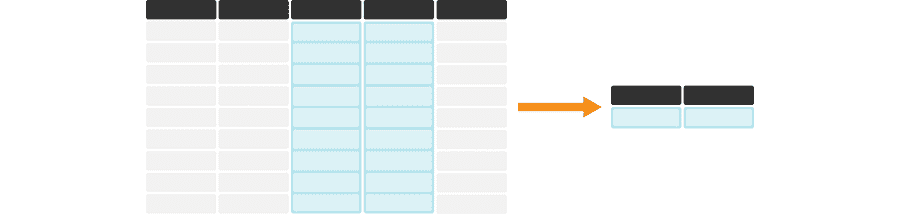

图 3.15：`summarize` 对于计算一个或多个列的摘要统计很有用。在其最简单的使用案例中，它创建一个新的数据框，其中包含每列的摘要统计量。每个表格的较暗、顶行代表列标题。

一个用于计算摘要统计的有用 `dplyr` 函数是 `summarize`，其中第一个参数是数据框，后续参数是我们想要执行的摘要。在这里，我们展示了如何使用 `summarize` 函数来计算报告将特定语言作为其在家主要语言的加拿大人的最小和最大数量。首先，让我们回顾一下 `region_lang` 的样子：

```r
region_lang
```

```r
## # A tibble: 7,490 × 7
##    region   category language mother_tongue most_at_home most_at_work lang_known
##    <chr>    <chr>    <chr>            <dbl>        <dbl>        <dbl>      <dbl>
##  1 St. Joh… Aborigi… Aborigi…             5            0            0          0
##  2 Halifax  Aborigi… Aborigi…             5            0            0          0
##  3 Moncton  Aborigi… Aborigi…             0            0            0          0
##  4 Saint J… Aborigi… Aborigi…             0            0            0          0
##  5 Saguenay Aborigi… Aborigi…             5            5            0          0
##  6 Québec   Aborigi… Aborigi…             0            5            0         20
##  7 Sherbro… Aborigi… Aborigi…             0            0            0          0
##  8 Trois-R… Aborigi… Aborigi…             0            0            0          0
##  9 Montréal Aborigi… Aborigi…            30           15            0         10
## 10 Kingston Aborigi… Aborigi…             0            0            0          0
## # ℹ 7,480 more rows
```

我们应用 `summarize` 来计算报告将特定语言作为其在家主要语言的加拿大人的最小和最大数量，对于任何地区：

```r
summarize(region_lang,
 min_most_at_home = min(most_at_home),
 max_most_at_home = max(most_at_home))
```

```r
## # A tibble: 1 × 2
##   min_most_at_home max_most_at_home
##              <dbl>            <dbl>
## 1                0          3836770
```

从这里我们可以看到，数据集中有一些语言没有人将其作为在家主要语言。我们还看到，在家最常说的主要语言是由 3,836,770 人使用的。

### 3.9.2 当存在 `NA` 时计算摘要统计

在 R 的数据框中，值`NA`通常用来表示缺失数据。许多基本的 R 统计汇总函数（例如`max`、`min`、`mean`、`sum`等）在应用于包含`NA`值的列时将返回`NA`。通常我们并不希望发生这种情况；相反，我们通常希望 R 忽略缺失条目，并使用列中所有其他非`NA`值来计算汇总统计量。幸运的是，许多这些函数提供了一个名为`na.rm`的参数，允许我们告诉函数在遇到`NA`值时该怎么做。特别是，如果我们指定`na.rm = TRUE`，函数将忽略缺失值，并返回所有非缺失条目的汇总。以下是一个结合`summarize`的示例。

首先，我们创建了一个新的`region_lang`数据框版本，命名为`region_lang_na`，其中在`most_at_home`列的第一行有一个看似无害的`NA`：

```r
region_lang_na
```

```r
## # A tibble: 7,490 × 7
##    region   category language mother_tongue most_at_home most_at_work lang_known
##    <chr>    <chr>    <chr>            <dbl>        <dbl>        <dbl>      <dbl>
##  1 St. Joh… Aborigi… Aborigi…             5           NA            0          0
##  2 Halifax  Aborigi… Aborigi…             5            0            0          0
##  3 Moncton  Aborigi… Aborigi…             0            0            0          0
##  4 Saint J… Aborigi… Aborigi…             0            0            0          0
##  5 Saguenay Aborigi… Aborigi…             5            5            0          0
##  6 Québec   Aborigi… Aborigi…             0            5            0         20
##  7 Sherbro… Aborigi… Aborigi…             0            0            0          0
##  8 Trois-R… Aborigi… Aborigi…             0            0            0          0
##  9 Montréal Aborigi… Aborigi…            30           15            0         10
## 10 Kingston Aborigi… Aborigi…             0            0            0          0
## # ℹ 7,480 more rows
```

现在如果我们像上面那样应用`summarize`函数，我们会看到我们不再得到最小和最大值返回，而是只得到一个`NA`！

```r
summarize(region_lang_na,
 min_most_at_home = min(most_at_home),
 max_most_at_home = max(most_at_home))
```

```r
## # A tibble: 1 × 2
##   min_most_at_home max_most_at_home
##              <dbl>            <dbl>
## 1               NA               NA
```

我们可以通过添加`na.rm = TRUE`来解决这个问题，如上所述：

```r
summarize(region_lang_na,
 min_most_at_home = min(most_at_home, na.rm = TRUE),
 max_most_at_home = max(most_at_home, na.rm = TRUE))
```

```r
## # A tibble: 1 × 2
##   min_most_at_home max_most_at_home
##              <dbl>            <dbl>
## 1                0          3836770
```

### 3.9.3 计算行组的汇总统计量

`summarize`的一个常见搭配是`group_by`。将这些函数组合在一起可以让你对数据集中的子组进行汇总，如图 3.16 所示。例如，我们可以使用`group_by`来对`region_lang`数据框中的区域进行分组，然后计算数据集中每个区域报告将语言作为家庭主要语言的加拿大人的最小和最大数量。

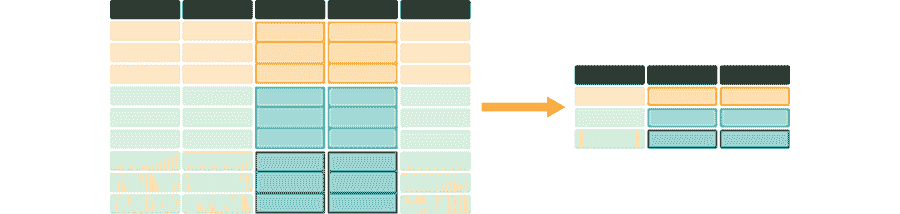

图 3.16：`summarize`和`group_by`对于计算每个组的一个或多个列的汇总统计量非常有用。它创建了一个新的数据框——每个组一行——包含每个被汇总列的汇总统计量。它还创建了一个列，列出分组变量的值。每个表格较暗的顶部行代表列标题。橙色、蓝色和绿色的行对应于在这个卡通示例中代表的三组中的每一组。

`group_by` 函数至少需要两个参数。第一个是要分组的 DataFrame，第二个及以后的参数是用于分组的列。在这里，我们只使用一个列进行分组（`region`），但也可以使用多个列。为此，请用逗号分隔列出额外的列。

```r
group_by(region_lang, region) |>
 summarize(
 min_most_at_home = min(most_at_home),
 max_most_at_home = max(most_at_home)
 )
```

```r
## # A tibble: 35 × 3
##    region               min_most_at_home max_most_at_home
##    <chr>                           <dbl>            <dbl>
##  1 Abbotsford - Mission                0           137445
##  2 Barrie                              0           182390
##  3 Belleville                          0            97840
##  4 Brantford                           0           124560
##  5 Calgary                             0          1065070
##  6 Edmonton                            0          1050410
##  7 Greater Sudbury                     0           133960
##  8 Guelph                              0           130950
##  9 Halifax                             0           371215
## 10 Hamilton                            0           630380
## # ℹ 25 more rows
```

注意，`group_by` 本身不会改变数据的外观。在下面的输出中，分组后的数据集看起来相同，并且它看起来并没有按 `region` 进行分组。相反，`group_by` 只是改变了其他函数如何处理数据，正如我们在上面的 `summarize` 中看到的。

```r
group_by(region_lang, region)
```

```r
## # A tibble: 7,490 × 7
## # Groups:   region [35]
##    region   category language mother_tongue most_at_home most_at_work lang_known
##    <chr>    <chr>    <chr>            <dbl>        <dbl>        <dbl>      <dbl>
##  1 St. Joh… Aborigi… Aborigi…             5            0            0          0
##  2 Halifax  Aborigi… Aborigi…             5            0            0          0
##  3 Moncton  Aborigi… Aborigi…             0            0            0          0
##  4 Saint J… Aborigi… Aborigi…             0            0            0          0
##  5 Saguenay Aborigi… Aborigi…             5            5            0          0
##  6 Québec   Aborigi… Aborigi…             0            5            0         20
##  7 Sherbro… Aborigi… Aborigi…             0            0            0          0
##  8 Trois-R… Aborigi… Aborigi…             0            0            0          0
##  9 Montréal Aborigi… Aborigi…            30           15            0         10
## 10 Kingston Aborigi… Aborigi…             0            0            0          0
## # ℹ 7,480 more rows
```

### 3.9.4 在多列上计算总结统计

有时候我们需要总结多列的统计数据。图 3.17 中的例子说明了这种情况。在这种情况下，单独使用 `summarize` 意味着我们必须逐个输入我们想要总结的每一列的名称。在本节中，我们将介绍两种执行此任务的方法。首先，我们将看到如何使用 `summarize` + `across` 来完成这项任务。然后，我们还将探讨如何使用更通用的迭代函数 `map` 来完成这项任务。

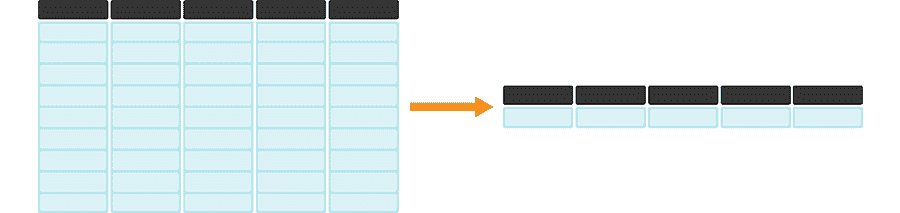

图 3.17：`summarize` + `across` 或 `map` 对于同时高效计算多列的总结统计很有用。每个表格中较暗的顶部行代表列标题。

#### 使用 `summarize` 和 `across` 在多列上计算总结统计

要总结多列的统计数据，我们可以使用我们刚刚学到的新函数 `summarize`。然而，在这种情况下，单独使用 `summarize` 意味着我们必须逐个输入我们想要总结的每一列的名称。为了更有效地完成这项任务，我们可以将 `summarize` 与 `across` 配对，并使用冒号 `:` 来指定我们想要进行统计总结的列的范围。在这里，我们将演示如何找到 `region_lang` 数据集中每个数值列的最大值。

```r
region_lang |>
 summarize(across(mother_tongue:lang_known, max))
```

```r
## # A tibble: 1 × 4
##   mother_tongue most_at_home most_at_work lang_known
##           <dbl>        <dbl>        <dbl>      <dbl>
## 1       3061820      3836770      3218725    5600480
```

> **注意：** 与我们单独使用基础 R 统计总结函数（例如 `max`、`min`、`mean`、`sum` 等）时的情况类似，当我们将 `summarize` + `across` 函数与基础 R 统计总结函数配对使用时，如果我们将它们应用于包含 `NA` 的数据框的列，也会返回 `NA`。
> 
> 为了解决这个问题，我们再次需要添加参数 `na.rm = TRUE`。但在这个情况下，我们需要稍微不同地使用它：我们写一个 `~`，然后调用总结函数，第一个参数是 `.x`，第二个参数是 `na.rm = TRUE`。例如，对于之前使用 `max` 函数的例子，我们会写成
> 
> ```r
> region_lang_na |>
>  summarize(across(mother_tongue:lang_known, ~ max(.x, na.rm = TRUE)))
> ```
> 
> ```r
> ## # A tibble: 1 × 4
> ##   mother_tongue most_at_home most_at_work lang_known
> ##           <dbl>        <dbl>        <dbl>      <dbl>
> ## 1       3061820      3836770      3218725    5600480
> ```
> 
> 这种不寻常语法的含义略超出了本书的范围，但感兴趣的读者可以在 `tidyverse` 的 `purrr` 包中查找 *匿名函数*。

#### `map` 用于计算多个列的摘要统计量

对于将函数应用于多个列的 `summarize` 和 `across` 的替代方案是 `map` 函数族。让我们再次找到 `region_lang` 数据框中每一列的最大值，但这次使用 `map` 函数和 `max` 函数。`map` 函数接受两个参数：一个对象（一个向量、数据框或列表），你想要对其应用函数，以及你想要应用于每一列的函数。请注意，`map` 没有参数来指定要应用函数的 *哪些* 列。因此，在调用 `map` 之前，我们将使用 `select` 函数来选择我们想要获取最大值的列。

```r
region_lang |>
 select(mother_tongue:lang_known) |>
 map(max)
```

```r
## $mother_tongue
## [1] 3061820
## 
## $most_at_home
## [1] 3836770
## 
## $most_at_work
## [1] 3218725
## 
## $lang_known
## [1] 5600480
```

> **注意：** `map` 函数来自 `purrr` 包。但由于 `purrr` 是 tidyverse 的一部分，一旦我们调用了 `library(tidyverse)`，我们就不需要单独加载 `purrr` 包。

输出看起来有点奇怪……我们传递了一个数据框，但输出看起来并不像数据框。实际上，它 *不是* 数据框，而是一个普通的列表：

```r
region_lang |>
 select(mother_tongue:lang_known) |>
 map(max) |>
 typeof()
```

```r
## [1] "list"
```

我们该怎么办？我们应该将其转换为数据框吗？我们可以这样做，但一个更简单的替代方案是只使用不同的 `map` 函数。可供选择的有相当多，它们的工作方式相似，但它们的名称反映了映射操作想要得到的输出类型。表 3.3 列出了常用的 `map` 函数以及它们的输出类型。

表 3.3：R 中的 `map` 函数。

| `map` 函数 | 输出 |
| --- | --- |
| `map` | 列表 |
| `map_lgl` | 逻辑向量 |
| `map_int` | 整数向量 |
| `map_dbl` | 双精度向量 |
| `map_chr` | 字符向量 |
| `map_dfc` | 数据框，列向合并 |
| `map_dfr` | 数据框，行向合并 |

让我们再次获取列的最大值，但这次使用 `map_dfr` 函数将输出作为数据框返回：

```r
region_lang |>
 select(mother_tongue:lang_known) |>
 map_dfr(max)
```

```r
## # A tibble: 1 × 4
##   mother_tongue most_at_home most_at_work lang_known
##           <dbl>        <dbl>        <dbl>      <dbl>
## 1       3061820      3836770      3218725    5600480
```

> **注意：** 与我们使用基础 R 统计摘要函数（例如 `max`、`min`、`mean`、`sum` 等）与 `summarize` 一起使用时类似，当我们将 `map` 函数应用于包含 `NA` 值的列时，也会返回 `NA` 值。
> 
> 为了避免这种情况，我们再次需要添加参数 `na.rm = TRUE`。当我们使用 `map` 时，我们通过在指定函数后添加 `,` 和 `na.rm = TRUE` 来这样做，如下所示：
> 
> ```r
> region_lang_na |>
>  select(mother_tongue:lang_known) |>
>  map_dfr(max, na.rm = TRUE)
> ```
> 
> ```r
> ## # A tibble: 1 × 4
> ##   mother_tongue most_at_home most_at_work lang_known
> ##           <dbl>        <dbl>        <dbl>      <dbl>
> ## 1       3061820      3836770      3218725    5600480
> ```

`map` 函数通常非常有用，可以解决许多涉及在 R 中重复应用函数的问题。此外，它们的使用不仅限于数据框的列；`map` 函数族可以用于将函数应用于向量的元素、列表，甚至（嵌套的！）数据框的列表。要了解更多关于 `map` 函数的信息，请参阅本章末尾的附加资源部分。

## 3.10 使用 `mutate` 和 `across` 在多列上应用函数

有时我们需要在数据框的许多列上应用一个函数。例如，当我们需要在多列上转换度量单位时，我们就需要这样做。我们在图 3.18 中展示了这种数据转换。

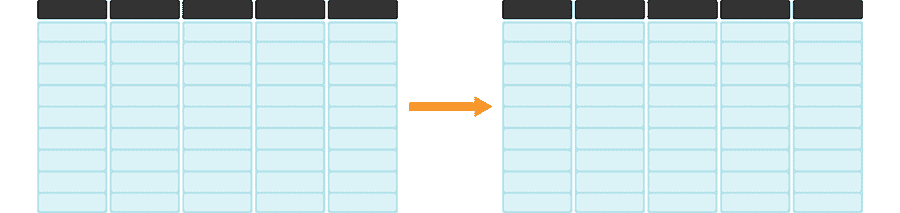

图 3.18: `mutate` 和 `across` 在应用于多列时非常有用。每个表格中较暗的顶部行代表列标题。

例如，假设我们想要使用 `as.integer` 函数将 `region_lang` 数据框中所有数值列从双精度类型转换为整型类型。当我们再次查看 `region_lang` 数据框时，我们可以看到这将是从 `mother_tongue` 到 `lang_known` 的列。

```r
region_lang
```

```r
## # A tibble: 7,490 × 7
##    region   category language mother_tongue most_at_home most_at_work lang_known
##    <chr>    <chr>    <chr>            <dbl>        <dbl>        <dbl>      <dbl>
##  1 St. Joh… Aborigi… Aborigi…             5            0            0          0
##  2 Halifax  Aborigi… Aborigi…             5            0            0          0
##  3 Moncton  Aborigi… Aborigi…             0            0            0          0
##  4 Saint J… Aborigi… Aborigi…             0            0            0          0
##  5 Saguenay Aborigi… Aborigi…             5            5            0          0
##  6 Québec   Aborigi… Aborigi…             0            5            0         20
##  7 Sherbro… Aborigi… Aborigi…             0            0            0          0
##  8 Trois-R… Aborigi… Aborigi…             0            0            0          0
##  9 Montréal Aborigi… Aborigi…            30           15            0         10
## 10 Kingston Aborigi… Aborigi…             0            0            0          0
## # ℹ 7,480 more rows
```

要完成这样的任务，我们可以使用 `mutate` 与 `across` 配对。这与我们在之前使用 `summarize` + `across` 时看到的方式类似。正如我们上面所做的那样，我们再次使用 `across` 来指定列，使用 `select` 语法以及我们想要在指定列上应用的函数。然而，这里的一个关键区别是我们正在使用 `mutate`，这意味着我们得到一个具有相同列数和行数的数据框。唯一改变的是我们对指定列（此处为 `mother_tongue` 到 `lang_known`）应用了转换。

```r
region_lang |>
 mutate(across(mother_tongue:lang_known, as.integer))
```

```r
## # A tibble: 7,490 × 7
##    region   category language mother_tongue most_at_home most_at_work lang_known
##    <chr>    <chr>    <chr>            <int>        <int>        <int>      <int>
##  1 St. Joh… Aborigi… Aborigi…             5            0            0          0
##  2 Halifax  Aborigi… Aborigi…             5            0            0          0
##  3 Moncton  Aborigi… Aborigi…             0            0            0          0
##  4 Saint J… Aborigi… Aborigi…             0            0            0          0
##  5 Saguenay Aborigi… Aborigi…             5            5            0          0
##  6 Québec   Aborigi… Aborigi…             0            5            0         20
##  7 Sherbro… Aborigi… Aborigi…             0            0            0          0
##  8 Trois-R… Aborigi… Aborigi…             0            0            0          0
##  9 Montréal Aborigi… Aborigi…            30           15            0         10
## 10 Kingston Aborigi… Aborigi…             0            0            0          0
## # ℹ 7,480 more rows
```

## 3.11 使用 `rowwise` 和 `mutate` 在一行内对列应用函数

如果你想在行内而不是在列上应用一个函数怎么办？我们在图 3.19 中展示了这种数据转换。


图 3.19: `rowwise` 和 `mutate` 在应用于一行内的列时非常有用。每个表格中较暗的顶部行代表列标题。

例如，假设我们想知道在 `region_lang` 数据集中每个语言和地区的 `mother_tongue`、`most_at_home`、`most_at_work` 和 `lang_known` 之间的最大值。换句话说，我们想要按行应用 `max` 函数。我们将使用（恰如其分的）`rowwise` 函数与 `mutate` 结合来完成此任务。

在应用 `rowwise` 之前，我们将只 `select` 计数列，这样我们就可以在书中轻松地看到数据框的输出中的所有列。因此，对于这个演示，我们正在操作的数据集看起来是这样的：

```r
region_lang |>
 select(mother_tongue:lang_known)
```

```r
## # A tibble: 7,490 × 4
##    mother_tongue most_at_home most_at_work lang_known
##            <dbl>        <dbl>        <dbl>      <dbl>
##  1             5            0            0          0
##  2             5            0            0          0
##  3             0            0            0          0
##  4             0            0            0          0
##  5             5            5            0          0
##  6             0            5            0         20
##  7             0            0            0          0
##  8             0            0            0          0
##  9            30           15            0         10
## 10             0            0            0          0
## # ℹ 7,480 more rows
```

现在我们先应用 `rowwise`，然后再 `mutate`，告诉 R 我们希望 `mutate` 函数在行内和行间应用，而不是在列上应用（这是 `mutate` 的默认行为）：

```r
region_lang |>
 select(mother_tongue:lang_known) |>
 rowwise() |>
 mutate(maximum = max(c(mother_tongue,
 most_at_home,
 most_at_work,
 lang_known)))
```

```r
## # A tibble: 7,490 × 5
## # Rowwise: 
##    mother_tongue most_at_home most_at_work lang_known maximum
##            <dbl>        <dbl>        <dbl>      <dbl>   <dbl>
##  1             5            0            0          0       5
##  2             5            0            0          0       5
##  3             0            0            0          0       0
##  4             0            0            0          0       0
##  5             5            5            0          0       5
##  6             0            5            0         20      20
##  7             0            0            0          0       0
##  8             0            0            0          0       0
##  9            30           15            0         10      30
## 10             0            0            0          0       0
## # ℹ 7,480 more rows
```

我们看到数据框中增加了一个额外的列，名为 `maximum`，它是每个语言和地区在 `mother_tongue`、`most_at_home`、`most_at_work` 和 `lang_known` 之间的最大值。

与 `group_by` 类似，`rowwise` 在单独调用时似乎没有做任何事情。然而，我们可以将 `rowwise` 与其他函数结合使用，以改变这些函数对数据操作的方式。注意，如果我们没有使用 `rowwise` 就使用 `mutate`，我们会计算所有 *所有* 行的最大值，而不是每行的最大值。下面我们将展示如果没有使用 `rowwise` 会发生什么。特别是，每行都会报告相同的最大值；这段代码没有提供期望的结果。

```r
region_lang |>
 select(mother_tongue:lang_known) |>
 mutate(maximum = max(c(mother_tongue,
 most_at_home,
 most_at_home,
 lang_known)))
```

```r
## # A tibble: 7,490 × 5
##    mother_tongue most_at_home most_at_work lang_known maximum
##            <dbl>        <dbl>        <dbl>      <dbl>   <dbl>
##  1             5            0            0          0 5600480
##  2             5            0            0          0 5600480
##  3             0            0            0          0 5600480
##  4             0            0            0          0 5600480
##  5             5            5            0          0 5600480
##  6             0            5            0         20 5600480
##  7             0            0            0          0 5600480
##  8             0            0            0          0 5600480
##  9            30           15            0         10 5600480
## 10             0            0            0          0 5600480
## # ℹ 7,480 more rows
```

## 3.12 摘要

清洗和整理数据可能是一个非常耗时的过程。然而，这是任何数据分析中的关键步骤。我们已经探索了许多不同的函数来清洗和整理数据，使其成为整洁的格式。表 3.4 总结了我们在本章中学到的关键整理函数。在接下来的章节中，你将学习如何使用这些整洁的数据做更多的事情，以回答你迫切的数据科学问题！

表 3.4：数据整理函数摘要

| 函数 | 描述 |
| --- | --- |
| `across` | 允许你将函数应用于多个列 |
| `filter` | 选择数据框的行子集 |
| `group_by` | 允许你将函数应用于行组 |
| `mutate` | 在数据框中添加或修改列 |
| `map` | 通用迭代函数 |
| `pivot_longer` | 通常使数据框更长且更窄 |
| `pivot_wider` | 通常使数据框更宽并减少行数 |
| `rowwise` | 在一行内应用函数 |
| `separate` | 将字符列拆分为多个列 |
| `select` | 选择数据框的列子集 |
| `summarize` | 计算输入的摘要 |

## 3.13 练习

本章涵盖的练习材料可以在“清洗和整理数据”行下的配套 [worksheets 仓库](https://worksheets.datasciencebook.ca) 中找到。你可以通过点击“launch binder”按钮在你的浏览器中启动工作表的交互式版本。你也可以通过点击“view worksheet”预览工作表的非交互式版本。如果你决定下载工作表并在自己的机器上运行它，请确保遵循第十三章中找到的计算机设置说明。这将确保工作表提供的自动反馈和指导能够按预期工作。

## 3.14 其他资源

+   如我们之前提到的，`tidyverse` 实际上是一个 *R 元包*：它安装并加载了一组遵循我们上面讨论的 tidy data 哲学的 R 包。`tidyverse` 包中的一个就是 `dplyr`——一个数据处理的主力工具。你已经遇到了 `dplyr` 的许多函数（`select`、`filter`、`mutate`、`arrange`、`summarize` 和 `group_by`）。为了了解更多关于这些函数的信息，并了解一些其他有用的函数，我们建议你查看 [STAT545 在线笔记](https://stat545.com/) 的第 5-9 章，这些笔记是关于使用 R 进行数据处理、探索和分析的书籍。

+   `dplyr` R 包的文档(Wickham, François, et al. 2021) 是了解本章中函数、你可以使用的完整参数集以及其他相关函数的另一个资源。该网站还提供了一个非常棒的速查表，总结了本章中的许多数据处理函数。

+   查看关于 `tidyselect` R 包的页面(Henry and Wickham 2021)，以获取 `select` 辅助函数的完整列表。这些辅助函数可以与 `select` 函数（以及其他使用 `tidyselect` 语法的功能，如 `pivot_longer`）一起使用，以选择数据框中的列。`select` 辅助函数的文档([`tidyselect.r-lib.org/reference/select_helpers.html`](https://tidyselect.r-lib.org/reference/select_helpers.html)) 是一个有用的参考资料，可以帮助你找到解决特定问题的辅助函数。

+   *《R for Data Science》* (Wickham and Grolemund 2016) 中有几章与数据处理相关，其深度超过了本书的内容。例如，[tidy data 章节](https://r4ds.had.co.nz/tidy-data.html)涵盖了 tidy data、`pivot_longer`/`pivot_wider` 和 `separate`，同时也涵盖了缺失值和额外的数据处理函数（如 `unite`）。[数据转换章节](https://r4ds.had.co.nz/transform.html)涵盖了 `select`、`filter`、`arrange`、`mutate` 和 `summarize`。而[map 函数章节](https://r4ds.had.co.nz/iteration.html#the-map-functions)提供了关于 `map` 函数的更多信息。

+   你有时会遇到需要遍历数据框中项的情况，但上述函数没有一个足够灵活以满足你的需求。在这种情况下，你可能需要考虑使用 [for 循环](https://r4ds.had.co.nz/iteration.html#iteration)。

### 参考文献部分

Henry, Lionel, 和 Hadley Wickham. 2021\. *tidyselect R 包*. [`tidyselect.r-lib.org/`](https://tidyselect.r-lib.org/).Wickham, Hadley. 2014\. “Tidy Data.” *统计软件杂志* 59 (10): 1–23.———. 2019\. *高级 R*. CRC Press. [`adv-r.hadley.nz/`](https://adv-r.hadley.nz/).Wickham, Hadley, Romain François, Lionel Henry, 和 Kirill Müller. 2021\. *dplyr R 包*. [`dplyr.tidyverse.org/`](https://dplyr.tidyverse.org/).Wickham, Hadley 和 Garrett Grolemund. 2016\. *R 语言数据科学：导入、整理、转换、可视化和建模数据*. O’Reilly. [`r4ds.had.co.nz/`](https://r4ds.had.co.nz/).
