# 第四章 有效数据可视化

> 原文：[`datasciencebook.ca/viz.html`](https://datasciencebook.ca/viz.html)

## 4.1 概述

本章将介绍与数据可视化相关的概念和工具，这些概念和工具超出了我们迄今为止所看到和实践的内容。我们将重点关注有效数据可视化的指导原则，并解释独立于任何特定工具或编程语言的可视化。在这个过程中，我们将涵盖使用 R 创建数据可视化（散点图、条形图、折线图和直方图）的一些具体细节。

## 4.2 章节学习目标

到本章结束时，读者将能够做到以下几点：

+   描述在数据集上使用以下类型的可视化来回答特定问题的时机：

    +   散点图

    +   折线图

    +   条形图

    +   直方图

+   给定一个数据集和一个问题，从上述绘图类型中选择，并使用 R 创建一个最佳回答问题的可视化。

+   评估可视化的有效性，并提出改进建议以更好地回答给定问题。

+   参考可视化，用非技术术语传达结论。

+   确定创建有效可视化的一些经验法则。

+   使用 R 中的`ggplot2`包创建和改进上述可视化：

    +   几何对象：`geom_point`，`geom_line`，`geom_histogram`，`geom_bar`，`geom_vline`，`geom_hline`

    +   尺度：`xlim`，`ylim`

    +   美学映射：`x`，`y`，`fill`，`color`，`shape`

    +   标签：`xlab`，`ylab`，`labs`

    +   字体控制和图例定位：`theme`

    +   子图：`facet_grid`

+   定义`ggplot2`对象的三项关键方面：

    +   美学映射

    +   几何对象

    +   尺度

+   描述栅格和矢量输出格式的区别。

+   使用`ggsave`将可视化保存为`.png`和`.svg`格式。

## 4.3 选择可视化

#### *提出问题，并回答它*

可视化的目的是回答关于感兴趣数据集的问题。因此，在创建可视化之前，首先要明确你试图回答的数据问题。一个好的可视化将清楚地回答你的问题而不会分散注意力；一个*优秀*的可视化甚至可以暗示问题本身，而无需额外的解释。想象一下你的可视化是项目海报展示的一部分；即使你不在海报前解释，一个有效的可视化也能将你的信息传达给观众。

回忆起第一章中的不同数据分析问题。在本章中我们将涵盖的视觉化中，我们只能回答*描述性和探索性*问题。请注意，不要使用这里展示的视觉化来回答任何*预测性、推断性、因果性*或*机制性*问题，因为我们还没有学习到正确完成这些任务的工具。

与大多数编码任务一样，犯错并在找到适合你数据和问题的正确可视化之前迭代几次是完全正常（并且相当常见）的。有许多不同类型的绘图图形可供使用（参见*数据可视化基础*的第五章（Wilke 2019）以获取目录）。本书中介绍的类型如图 4.1 所示；你应该选择哪一种取决于你的数据和你要回答的问题。一般来说，何时使用每种类型的图表的指导原则如下：

+   **散点图**用于展示两个定量变量之间的关系

+   **折线图**用于展示相对于一个独立有序量（例如，时间）的趋势

+   **条形图**用于展示数量的比较

+   **直方图**用于展示一个定量变量的分布（即所有可能的值及其出现频率）


图 4.1：散点图、折线图、条形图以及直方图的示例。

所有类型的可视化都有其（误）用途，但通常有三种难以理解或容易被更好的替代方案所取代。特别是，你应该避免使用**饼图**；通常使用条形图更好，因为比较条形高度比比较饼图切片大小更容易。你还应该不使用**三维可视化**，因为它们在转换为静态的二维图像格式时通常难以理解。最后，不要使用表格进行数值比较；人类在快速处理视觉信息方面比文本和数学更擅长。条形图再次通常是更好的替代方案。

## 4.4 精炼可视化

#### *传达信息，最小化噪声*

仅能在 R（或任何其他语言）中制作可视化并不意味着它能有效地将你的信息传达给他人。一旦你选择了要使用的可视化类型，你将需要对其进行精炼以适应你的特定需求。以下是一些进行此操作的实用规则，它们通常分为两类：你想要让你的可视化传达你的信息，并且你想要尽可能减少视觉噪声。人类处理信息的能力有限；这两种类型的精炼都旨在减少观众在查看你的可视化时的心理负担，使他们更容易快速理解和记住你的信息。

**传达信息**

+   确保可视化尽可能简单明了地回答你提出的问题。

+   使用图例和标签，以便你的可视化在没有阅读周围文本的情况下也能理解。

+   确保你可视化中的文本、符号、线条等足够大，以便容易阅读。

+   确保数据清晰可见；不要让数据形状/分布被其他对象（例如，条形图）隐藏。

+   确保使用那些色盲的人也能理解的颜色方案（令人惊讶的是，总体人群中色盲的比例很大——从大约 1%到 10%，取决于性别和血统（Deeb 2005））。例如，[ColorBrewer](https://colorbrewer2.org)和[`RColorBrewer` R 包](https://cran.r-project.org/web/packages/RColorBrewer/index.html) (Neuwirth 2014)提供了选择此类颜色方案的能力，你可以在创建可视化后通过上传到在线工具（如一个[色盲模拟器](https://www.color-blindness.com/coblis-color-blindness-simulator/)）来检查你的可视化。

+   重复性可能是有帮助的；有时以多种方式传达相同的信息可以加强给观众的信息。

**最小化噪声**

+   适度使用颜色。过多的不同颜色可能会分散注意力，创造虚假的模式，并削弱信息。

+   警惕过度绘图。过度绘图是指代表数据的标记重叠，这会成为一个问题，因为它阻止你看到在可视化中发生这种情况的区域有多少数据点。如果你的图表中点或线太多，开始看起来像一团糟，你需要做些不同的事情。

+   只让绘图区域（点、线、条形图所在的地方）达到所需的尺寸。简单的图表可以做得小一些。

+   不要调整坐标轴来放大小的差异。如果差异很小，就显示它很小！

## 4.5 使用 `ggplot2` 创建可视化

#### *迭代构建可视化*

本节将涵盖如何根据数据集和想要回答的问题选择和细化可视化，然后如何使用`ggplot2` R 包在 R 中创建可视化。鉴于`ggplot2`包由`tidyverse`元包加载，我们仍然只需要加载`tidyverse`：

```r
library(tidyverse)
```

### 4.5.1 散点图和线图：莫纳罗亚二氧化碳（CO$_{\text{2}}$）数据集

莫纳罗亚二氧化碳（CO$_{\text{2}}$）数据集（[Mauna Loa CO$_{\text{2}}$ data set](https://www.esrl.noaa.gov/gmd/ccgg/trends/data.html)），由 Pieter Tans 博士、NOAA/GML 和 Ralph Keeling 博士、斯克里普斯海洋研究所整理，记录了从 1959 年起在夏威夷莫纳罗亚研究站的大气二氧化碳（CO$_{\text{2}}$，百万分之一）浓度（Tans and Keeling 2020）。对于这本书，我们将专注于 1980-2020 年的年份。

**问题：** 大气中二氧化碳（CO$_{\text{2}}$）的浓度随时间变化吗？有没有值得注意的有趣模式？

要开始，我们将读取并检查数据：

```r
# mauna loa carbon dioxide data
co2_df <- read_csv("data/mauna_loa_data.csv")
co2_df
```

```r
## # A tibble: 484 × 2
##    date_measured   ppm
##    <date>        <dbl>
##  1 1980-02-01     338.
##  2 1980-03-01     340.
##  3 1980-04-01     341.
##  4 1980-05-01     341.
##  5 1980-06-01     341.
##  6 1980-07-01     339.
##  7 1980-08-01     338.
##  8 1980-09-01     336.
##  9 1980-10-01     336.
## 10 1980-11-01     337.
## # ℹ 474 more rows
```

我们看到`co2_df`数据框中有两列；`date_measured`和`ppm`。`date_measured`列包含测量的日期，类型为`date`。`ppm`列包含在每日期测量的二氧化碳（CO$_{\text{2}}$）的百万分之一值，类型为`double`。

> **注意**：`read_csv`能够将`date_measured`列解析为`date`向量类型，因为它是以国际标准日期格式（称为 ISO 8601）输入的，该格式将日期列为`年-月-日`。`date`向量是具有特殊属性的`double`向量，允许它们正确处理日期。例如，`date`类型向量允许像`ggplot`这样的函数将它们视为数值日期，而不是字符向量，即使它们包含非数值字符（例如，在`co2_df`数据框中的`date_measured`列）。这意味着 R 不会意外地将日期以错误的顺序绘制（即不是按字母数字顺序，如果它是字符向量会发生这种情况）。对日期和时间的深入研究超出了本书的范围，但感兴趣的读者可以参考*《R for Data Science》*（Wickham 和 Grolemund 2016）中的日期和时间章节；请参阅本章末尾的附加资源。

由于我们正在研究两个变量之间的关系（CO$_{\text{2}}$浓度和日期），散点图是一个好的起点。散点图将数据显示为具有`x`（水平轴）和`y`（垂直轴）坐标的单独点。在这里，我们将测量日期作为`x`坐标，将 CO$_{\text{2}}$浓度作为`y`坐标。当使用`ggplot2`包时，我们使用`ggplot`函数创建一个绘图对象。我们需要指定绘图的一些基本方面：

+   要可视化的数据框对象的名称。

    +   在这里，我们指定了`co2_df`数据框。

+   **美学映射**，它告诉`ggplot`数据框中的列如何映射到可视化属性。

    +   要创建美学映射，我们使用`aes`函数。

    +   在这里，我们将绘图`x`轴设置为`date_measured`变量，将绘图`y`轴设置为`ppm`变量。

+   `+`运算符，它告诉`ggplot`我们希望向绘图添加另一个图层。

+   **几何对象**，它指定了映射数据应该如何显示。

    +   要创建几何对象，我们使用一个`geom_*`函数（参见[ggplot 参考](https://ggplot2.tidyverse.org/reference/)以获取几何对象的列表）。

    +   在这里，我们使用`geom_point`函数将我们的数据可视化为散点图。

```r
co2_scatter <- ggplot(co2_df, aes(x = date_measured, y = ppm)) +
 geom_point()

co2_scatter
```

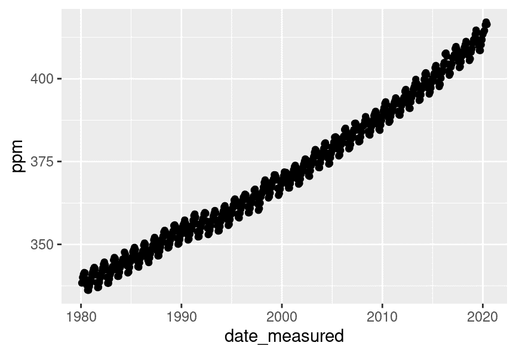

图 4.2：随时间变化的二氧化碳大气浓度散点图。

图 4.2 中的可视化显示了大气中 CO$_{\text{2}}$浓度随时间的明显上升趋势。这个图表肯定了我们的第一个问题，但似乎只能从这个散点图中得出这个结论。

关于这些数据的一个重要注意事项是，我们正在探索的变量之一是时间。时间是一种特殊的定量变量，因为它给数据增加了额外的结构——数据点具有自然顺序。具体来说，数据集中的每个观测值都有一个前驱和一个后继，观测值的顺序很重要；改变它们的顺序会改变它们的含义。在这种情况下，我们通常使用折线图来可视化数据。折线图通过线段连接观测值的`x`和`y`坐标序列，从而强调它们的顺序。

我们可以使用`ggplot`中的`geom_line`函数创建折线图。现在让我们尝试使用默认参数将`co2_df`可视化为一个折线图：

```r
co2_line <- ggplot(co2_df, aes(x = date_measured, y = ppm)) +
 geom_line()

co2_line
```

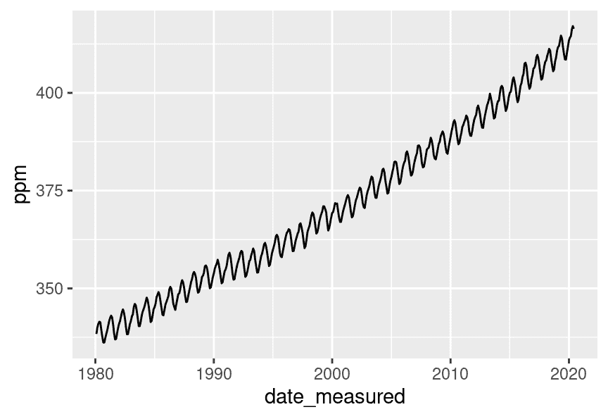

图 4.3：大气中 CO$_{2}$浓度随时间的折线图。

哎！图 4.3 显示数据中确实存在另一个有趣的现象：除了随时间增加外，浓度似乎还在振荡。鉴于目前的可视化，仍然很难判断振荡的速度有多快，但无论如何，折线图似乎比散点图更好地回答了问题。这两个可视化之间的比较也说明了散点图的一个常见问题：通常，点显示得太靠近，甚至重叠在一起，混淆了本应清晰的信息（*过度绘图*）。

现在我们已经确定了可视化的粗略细节，是时候进行细化了。这个图表相当直接，没有太多视觉噪声需要去除。但我们必须做一些事情来提高清晰度，比如添加信息丰富的坐标轴标签，并使字体大小更易读。要添加坐标轴标签，我们使用`xlab`和`ylab`函数。要更改字体大小，我们使用带有`text`参数的`theme`函数：

```r
co2_line <- ggplot(co2_df, aes(x = date_measured, y = ppm)) +
 geom_line() +
 xlab("Year") +
 ylab("Atmospheric CO2 (ppm)") +
 theme(text = element_text(size = 12))

co2_line
```

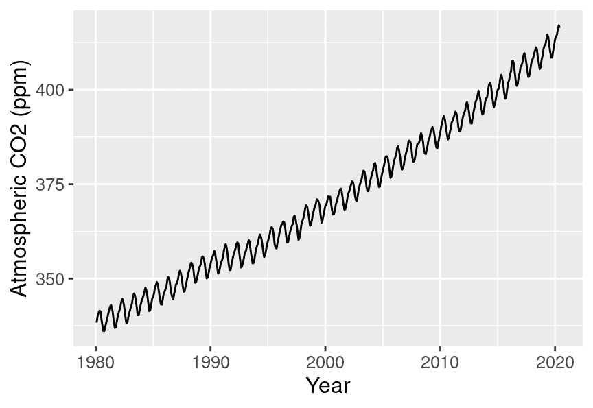

图 4.4：具有更清晰坐标轴和标签的大气中 CO$_{2}$浓度随时间的折线图。

> **注意：** `theme`函数相当复杂，有多个参数可以指定，用于控制可视化的许多非数据方面。对`theme`函数的深入讨论超出了本书的范围。感兴趣的读者可以查阅`theme`函数的文档；请参阅本章末尾的附加资源部分。

最后，让我们通过稍微改变可视化方式来更好地理解振荡。请注意，使用少量可视化来回答你试图回答的问题的不同方面是完全可行的。我们将通过使用**尺度**来实现这一点，这是`ggplot2`的另一个重要特性，它能够轻松地转换不同的变量并设置限制。我们使用`xlim`函数来缩放水平轴，使用`ylim`函数来缩放垂直轴。特别是，在这里，我们将使用`xlim`函数来聚焦于仅五年数据（比如，1990-1994 年）。`xlim`接受一个长度为两个的向量来指定轴的上限和下限。我们可以使用`c`函数来创建这样的向量。请注意，给`xlim`提供的向量必须与映射到该轴的数据类型相同。在这里，我们已经将日期映射到 x 轴，因此我们需要使用`date`函数（来自`tidyverse`的`lubridate` R 包（Spinu, Grolemund, and Wickham 2021; Grolemund and Wickham 2011))来将我们提供给`c`的字符字符串转换为`date`向量。

> **注意：** `lubridate`是一个由`tidyverse`元包安装的包，但它并没有被加载。因此，我们需要在下面的代码中单独加载它。

```r
library(lubridate)

co2_line <- ggplot(co2_df, aes(x = date_measured, y = ppm)) +
 geom_line() +
 xlab("Year") +
 ylab("Atmospheric CO2 (ppm)") +
 xlim(c(date("1990-01-01"), date("1993-12-01"))) +
 theme(text = element_text(size = 12))

co2_line
```

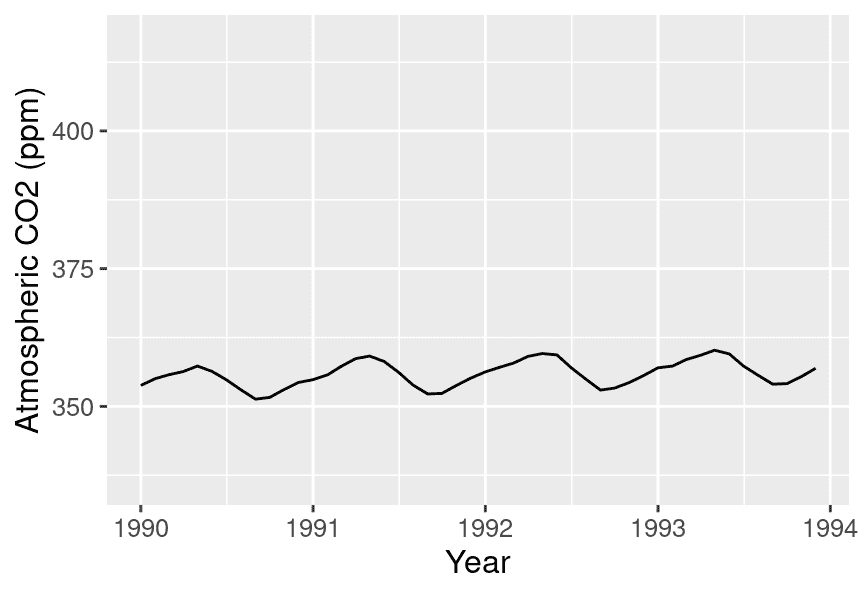

图 4.5：1990 至 1994 年大气中二氧化碳浓度的线图。

有趣！看起来每年大气中的 CO$_{\text{2}}$浓度都会增加，直到大约 4 月份达到峰值，然后减少，直到大约 9 月底，最后又增加，直到年底。在夏威夷，有两个季节：5 月至 10 月的夏季和 11 月至 4 月的冬季。因此，CO$_{\text{2}}$的振荡模式与这两个季节相当吻合。

如您从创建`co2_df`数据框最终可视化的代码中可能已经注意到的，我们在`ggplot`中使用层构建可视化。使用`+`运算符添加新层，我们可以添加尽可能多的层！构建数据可视化的一个有用类比是绘画。我们从一张空白画布开始，首先做的事情是为我们的绘画准备表面，添加底漆。在我们的数据可视化中，这类似于调用`ggplot`并指定我们将使用的数据集。接下来，我们绘制绘画的背景。在我们的数据可视化中，这将是我们在`aes`函数中将数据映射到轴上时。然后我们向绘画中添加关键视觉主题。在我们的数据可视化中，这将是几何对象（例如，`geom_point`、`geom_line`等）。最后，我们专注于添加细节和改进绘画。在我们的数据可视化中，这将是当我们微调轴标签、更改字体、调整点大小以及进行其他相关操作时。

### 4.5.2 散点图：老忠实喷泉喷发时间数据集

`faithful`数据集包含了黄石国家公园怀俄明州老忠实喷泉喷发之间的等待时间以及随后的喷发持续时间（以分钟计）的测量。`faithful`数据集在基础 R 中作为数据框提供，因此不需要加载。我们将其转换为 tibble，以利用这些专用数据框提供的更佳打印输出。

**问题：** 喷发前的等待时间与喷发持续时间之间是否存在关系？

```r
# old faithful eruption time / wait time data
faithful <- as_tibble(faithful)
faithful
```

```r
## # A tibble: 272 × 2
##    eruptions waiting
##        <dbl>   <dbl>
##  1      3.6       79
##  2      1.8       54
##  3      3.33      74
##  4      2.28      62
##  5      4.53      85
##  6      2.88      55
##  7      4.7       88
##  8      3.6       85
##  9      1.95      51
## 10      4.35      85
## # ℹ 262 more rows
```

在这里，我们再次研究两个定量变量（等待时间和喷发时间）之间的关系。但如果你查看数据框的输出，你会注意到，与马乌纳洛亚二氧化碳数据集中的时间不同，这里的两个变量都没有自然顺序。因此，散点图可能是最合适的可视化方式。让我们使用`ggplot`函数创建一个散点图，其中`waiting`变量位于水平轴上，`eruptions`变量位于垂直轴上，并使用`geom_point`几何对象。结果如图 4.6 所示。

```r
faithful_scatter <- ggplot(faithful, aes(x = waiting, y = eruptions)) +
 geom_point()

faithful_scatter
```

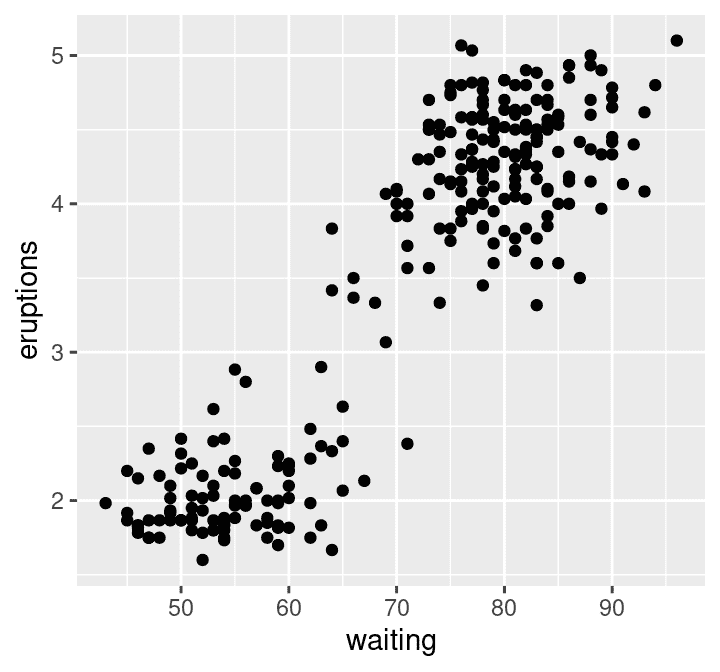

图 4.6：等待时间和喷发时间的散点图。

我们可以在图 4.6 中看到数据倾向于分为两组：一组等待和喷发时间较短，另一组等待和喷发时间较长。请注意，在这种情况下，没有过度绘图：点通常在视觉上很好地分离，形成的模式也很清晰。为了细化可视化，我们只需要添加轴标签并使字体更易读：

```r
faithful_scatter <- ggplot(faithful, aes(x = waiting, y = eruptions)) +
 geom_point() +
 xlab("Waiting Time (mins)") +
 ylab("Eruption Duration (mins)") +
 theme(text = element_text(size = 12))

faithful_scatter
```

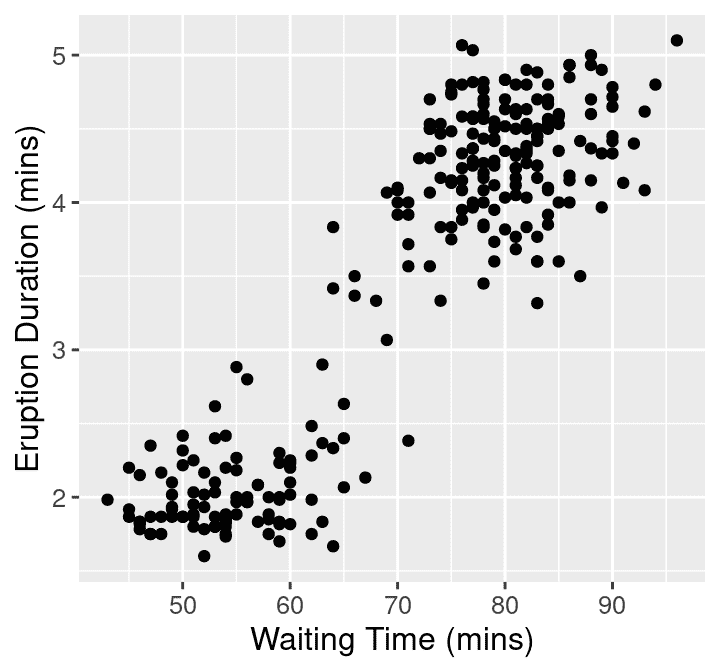

图 4.7：带有更清晰轴和标签的等待时间和爆发时间散点图。

### 4.5.3 轴变换和彩色散点图：加拿大语言数据集

回忆一下来自第 1、2 和 3 章的`can_lang`数据集(Timbers 2020)，它包含了 2016 年加拿大人口普查中的语言计数。

**问题：说某种语言作为母语的人的百分比与在家说该语言作为主要语言的人的百分比之间是否存在关系？在高级语言类别（官方语言、原住民语言或非官方和非原住民语言）中，这种关系的强度是否存在模式？**

要开始，我们将读取和检查数据：

```r
can_lang <- read_csv("data/can_lang.csv")
can_lang
```

```r
## # A tibble: 214 × 6
##    category          language mother_tongue most_at_home most_at_work lang_known
##    <chr>             <chr>            <dbl>        <dbl>        <dbl>      <dbl>
##  1 Aboriginal langu… Aborigi…           590          235           30        665
##  2 Non-Official & N… Afrikaa…         10260         4785           85      23415
##  3 Non-Official & N… Afro-As…          1150          445           10       2775
##  4 Non-Official & N… Akan (T…         13460         5985           25      22150
##  5 Non-Official & N… Albanian         26895        13135          345      31930
##  6 Aboriginal langu… Algonqu…            45           10            0        120
##  7 Aboriginal langu… Algonqu…          1260          370           40       2480
##  8 Non-Official & N… America…          2685         3020         1145      21930
##  9 Non-Official & N… Amharic          22465        12785          200      33670
## 10 Non-Official & N… Arabic          419890       223535         5585     629055
## # ℹ 204 more rows
```

我们将从我们的数据框中的`mother_tongue`和`most_at_home`列开始，绘制散点图。生成的图表显示在图 4.8 中。

```r
ggplot(can_lang, aes(x = most_at_home, y = mother_tongue)) +
 geom_point()
```

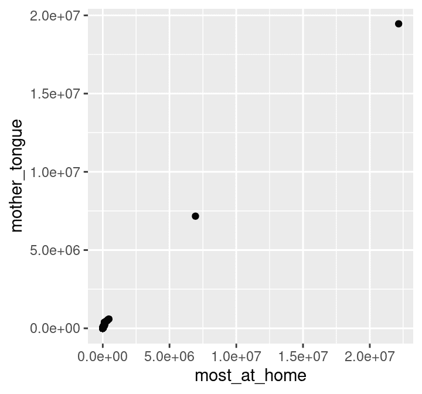

图 4.8：报告母语为加拿大语言的加拿大人与家庭主要语言散点图。

为了提高图 4.8 的可解释性，我们应该用更信息丰富的标签替换默认的轴名称。我们可以使用`\n`在轴名称中创建换行符，这样`\n`之后的单词就会打印在新的一行上。这将使图表上的轴标签更易读。我们还应该增加字体大小以进一步提高可读性。

```r
ggplot(can_lang, aes(x = most_at_home, y = mother_tongue)) +
 geom_point() +
 xlab("Language spoken most at home \n (number of Canadian residents)") +
 ylab("Mother tongue \n (number of Canadian residents)") +
 theme(text = element_text(size = 12))
```

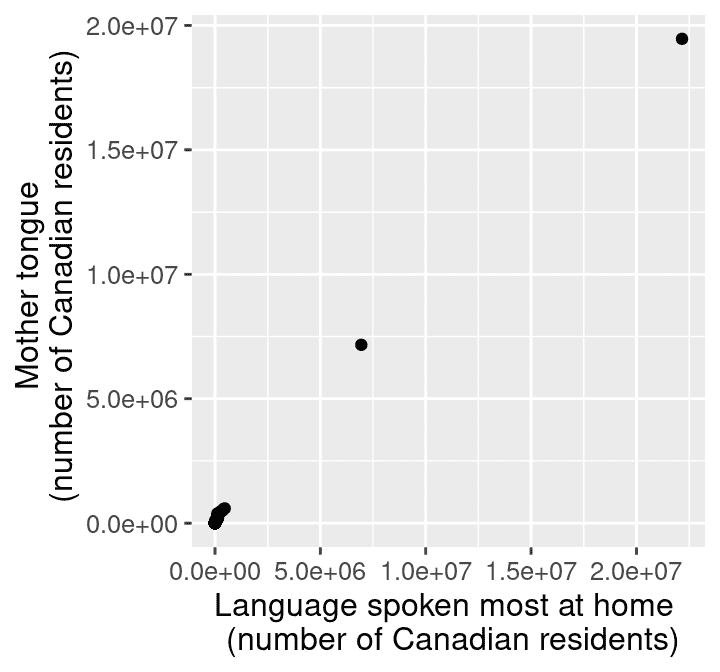

图 4.9：报告母语为加拿大语言的加拿大人与家庭主要语言散点图，x 轴和 y 轴带有标签。

好的！图 4.9 中的轴和标签现在更加易读和可解释。然而，散点本身可能需要一些改进；大多数 214 个数据点都聚集在可视化的左下角。数据聚集是因为在加拿大说英语或法语的人（右上角的两点）比其他语言的人多得多。特别是，最常见的母语语言有 1,946,085,0 人使用，而最不常见的只有 10 人。这两个数字的大小相差 6 位小数！我们可以通过过滤数据来确认右上角的两点对应于加拿大的两种官方语言：

```r
can_lang |>
 filter(language == "English" | language == "French")
```

```r
## # A tibble: 2 × 6
##   category           language mother_tongue most_at_home most_at_work lang_known
##   <chr>              <chr>            <dbl>        <dbl>        <dbl>      <dbl>
## 1 Official languages English       19460850     22162865     15265335   29748265
## 2 Official languages French         7166700      6943800      3825215   10242945
```

回想一下，我们关于这些数据的问题涉及到**所有**语言；因此，为了正确回答我们的问题，我们需要调整坐标轴的刻度，以便我们可以清楚地看到所有的散点。特别是，我们将通过调整水平和垂直坐标轴，使它们处于**对数**（或**log**）刻度上。当你的数据既有**非常大**的值也有**非常小**的值时，对数刻度很有用，因为它有助于分散小值并将大值挤压在一起。例如，$\log_{10}(1) = 0$，$\log_{10}(10) = 1$，$\log_{10}(100) = 2$，以及$\log_{10}(1000) = 3$；在对数刻度上，值 1、10、100 和 1000 之间的距离都是相同的！因此，我们看到应用这个函数是将大值拉近，将小值推远。请注意，如果你的数据可以取值为 0，对数刻度可能不合适（因为在 R 中`log10(0)`是`-Inf`）。在这种情况下，还有其他方法可以转换数据，但这些超出了本书的范围。

我们可以使用`ggplot`可视化中的`scale_x_log10`和`scale_y_log10`函数来实现对数刻度。鉴于 x 和 y 轴有大量数字，我们还应该格式化轴标签，在这些数字中添加逗号以增加其可读性。我们可以在 R 中将`label_comma`函数（来自`scales`包）传递给`scale_x_log10`和`scale_y_log10`函数的`labels`参数。

```r
library(scales)

ggplot(can_lang, aes(x = most_at_home, y = mother_tongue)) +
 geom_point() +
 xlab("Language spoken most at home \n (number of Canadian residents)") +
 ylab("Mother tongue \n (number of Canadian residents)") +
 theme(text = element_text(size = 12)) +
 scale_x_log10(labels = label_comma()) +
 scale_y_log10(labels = label_comma())
```

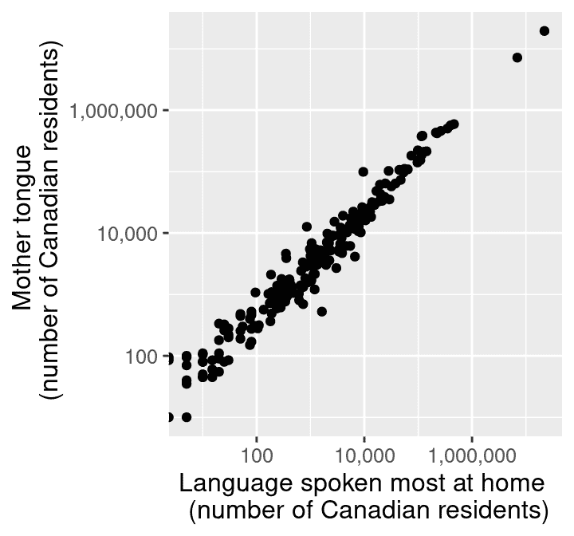

图 4.10：报告母语为加拿大人的语言与在家使用的主要语言之间的散点图，带有调整后的对数 x 和 y 轴。

与第三章中的一些示例类似，我们可以将计数转换为百分比以提供上下文并使其更容易理解。我们可以通过将报告母语或在家使用的主要语言为给定语言的人数除以居住在加拿大的人数，然后乘以 100%来实现这一点。例如，2016 年加拿大人口普查中报告母语为英语的人数为 19,460,850 / 35,151,728 $\times$ 100 % = 55.36%。

在下面，我们使用`mutate`计算报告母语和在家使用的主要语言为所有语言的百分比，对于`can_lang`数据集中的所有语言。由于新列被附加到数据表的末尾，我们在转换后选择了新列，以便您可以清楚地看到从表中突变输出的结果。

```r
can_lang <- can_lang |>
 mutate(
 mother_tongue_percent = (mother_tongue / 35151728) * 100,
 most_at_home_percent = (most_at_home / 35151728) * 100
 )

can_lang |>
 select(mother_tongue_percent, most_at_home_percent)
```

```r
## # A tibble: 214 × 2
##    mother_tongue_percent most_at_home_percent
##                    <dbl>                <dbl>
##  1              0.00168             0.000669 
##  2              0.0292              0.0136   
##  3              0.00327             0.00127  
##  4              0.0383              0.0170   
##  5              0.0765              0.0374   
##  6              0.000128            0.0000284
##  7              0.00358             0.00105  
##  8              0.00764             0.00859  
##  9              0.0639              0.0364   
## 10              1.19                0.636    
## # ℹ 204 more rows
```

最后，我们将编辑可视化，使用我们刚刚计算出的百分比（并更改轴标签以反映这种单位变化）。图 4.11 显示了最终结果。

```r
ggplot(can_lang, aes(x = most_at_home_percent, y = mother_tongue_percent)) +
 geom_point() +
 xlab("Language spoken most at home \n (percentage of Canadian residents)") +
 ylab("Mother tongue \n (percentage of Canadian residents)") +
 theme(text = element_text(size = 12)) +
 scale_x_log10(labels = comma) +
 scale_y_log10(labels = comma)
```

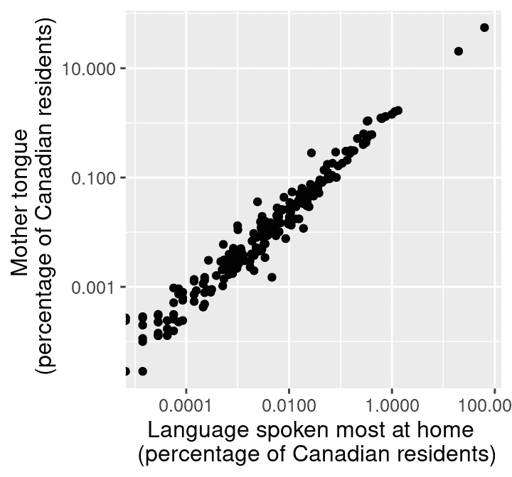

图 4.11：报告将某种语言作为母语的加拿大人百分比与在家使用的主要语言散点图。

图 4.11 是回答本节第一个问题的适当可视化方式，即说某种语言作为母语的人数百分比与在家说该语言作为主要语言的人数百分比之间是否存在关系。要完全回答这个问题，我们需要使用图 4.11 来评估数据的几个关键特征：

+   **方向**：如果当 x 变量增加时，y 变量倾向于增加，那么 y 与 x 有**正相关**关系。如果 y 在 x 增加时倾向于减少，那么 y 与 x 有**负相关**关系。如果 y 在 x 增加时没有明显增加或减少，那么 y 与 x 有**很小或没有**关系。

+   **强度**：如果当 x 变量增加时，y 变量可靠地增加、减少或保持平稳，那么这种关系是**强的**。否则，这种关系是**弱的**。直观上，当散点彼此靠近，看起来更像“线”或“曲线”而不是“云”时，关系是强的。

+   **形状**：如果你可以通过大致穿过数据点的直线，那么这种关系是**线性的**。否则，它是**非线性的**。

在图 4.11 中，我们看到，随着将某种语言作为母语的人数百分比增加，在家说这种语言的人数百分比也相应增加。因此，这两个变量之间存在**正相关**关系。此外，由于图 4.11 中的点相当接近，而且点看起来更像“线”而不是“云”，我们可以说这是一种**强的**关系。最后，由于通过图 4.11 中的这些点画直线可以很好地符合我们观察到的模式，我们可以说这种关系是**线性的**。

接下来是探索性数据分析问题的第二部分！回想一下，我们感兴趣的是了解我们在图 4.11 中发现的关系的强度是否取决于更高级别的语言类别（官方语言、原住民语言和非官方、非原住民语言）。探索这一点的常见方法是通过按组着色我们已创建的散点图中的数据点。例如，鉴于我们拥有 2016 年加拿大人口普查中记录的每种语言的更高级别语言类别，我们可以在先前的散点图中着色点，以表示每种语言的更高级别语言类别。

在这里，我们希望根据它们所属的`category`组来区分值。我们可以在`aes`函数中添加一个参数，指定`category`列应该着色点。添加此参数将根据它们的组着色点，并在绘图旁边添加图例。

```r
ggplot(can_lang, aes(x = most_at_home_percent,
 y = mother_tongue_percent,
 color = category)) +
 geom_point() +
 xlab("Language spoken most at home \n (percentage of Canadian residents)") +
 ylab("Mother tongue \n (percentage of Canadian residents)") +
 theme(text = element_text(size = 12)) +
 scale_x_log10(labels = comma) +
 scale_y_log10(labels = comma)
```

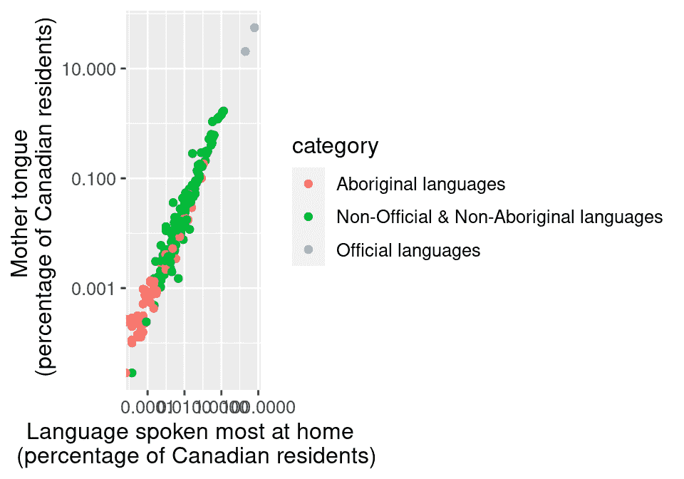

图 4.12：按语言类别着色的加拿大人报告的母语百分比与家庭主要语言的散点图。

图 4.12 中的图例占据了宝贵的绘图区域。我们可以通过使用`theme`函数的`legend.position`和`legend.direction`参数来移动图例标题来改进这一点。在这里，我们将`legend.position`设置为`"top"`，以便将图例放在绘图上方，并将`legend.direction`设置为`"vertical"`，这样图例项就会垂直堆叠。当`legend.position`设置为`"top"`或`"bottom"`时，默认方向是水平堆叠图例项。然而，这对于这个特定的可视化效果来说效果不佳，因为图例标签相当长，如果这样显示，就会超出页面范围。

```r
ggplot(can_lang, aes(x = most_at_home_percent,
 y = mother_tongue_percent,
 color = category)) +
 geom_point() +
 xlab("Language spoken most at home \n (percentage of Canadian residents)") +
 ylab("Mother tongue \n (percentage of Canadian residents)") +
 theme(text = element_text(size = 12),
 legend.position = "top",
 legend.direction = "vertical") +
 scale_x_log10(labels = comma) +
 scale_y_log10(labels = comma)
```

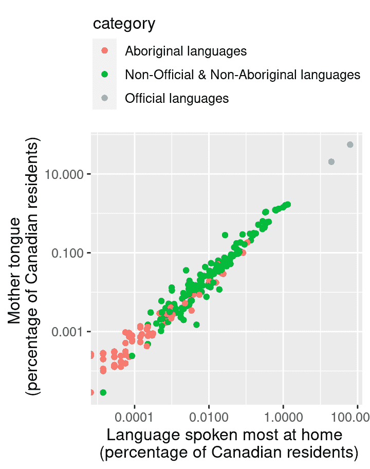

图 4.13：按语言类别着色并编辑图例的加拿大人报告的母语百分比与家庭主要语言的散点图。

在图 4.13 中，点使用的是默认的 `ggplot2` 颜色调色板。但如果你想要使用不同的颜色呢？在 R 中，有两个提供替代颜色调色板的包是 `RColorBrewer` (Neuwirth 2014) 和 `ggthemes` (Arnold 2019)；在这本书中，我们将介绍如何使用 `RColorBrewer`。您可以使用 `display.brewer.all` 函数可视化 `RColorBrewer` 提供的颜色调色板列表。您还可以通过将 `colorblindFriendly = TRUE` 添加到函数中来打印颜色盲友好调色板的列表。

```r
library(RColorBrewer)
display.brewer.all(colorblindFriendly = TRUE)
```

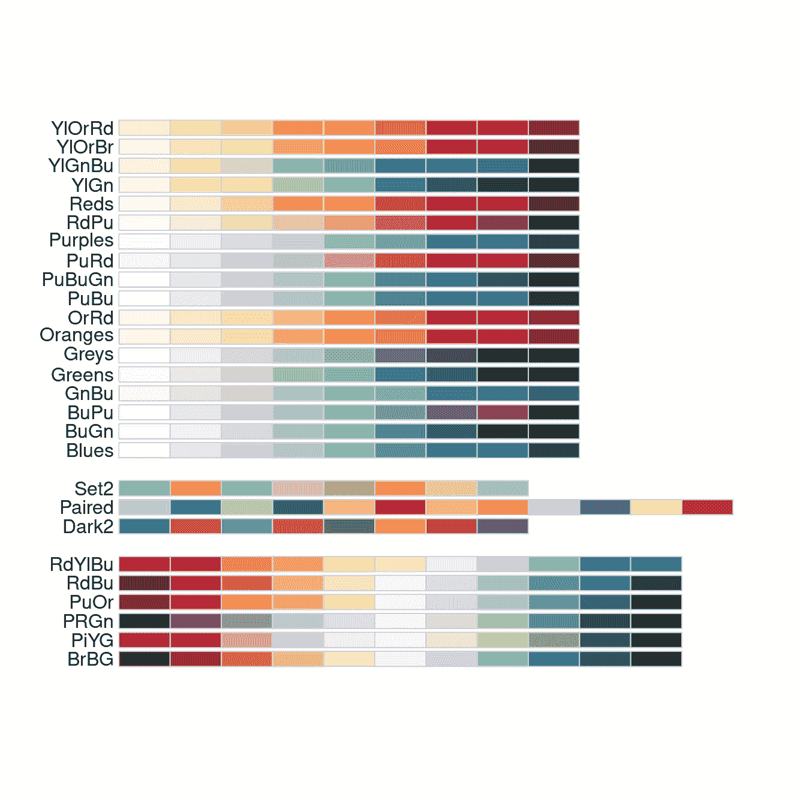

图 4.14：来自 `RColorBrewer` R 包的可用的颜色调色板。

从图 4.14 中，我们可以选择我们想要在图表中使用的颜色调色板。要更改颜色调色板，我们添加表示我们想要使用的调色板的 `scale_color_brewer` 层。您可以使用这个 [色盲模拟器](https://www.color-blindness.com/coblis-color-blindness-simulator/) 来检查您的可视化是否对色盲友好。下面我们选择了 `"Set2"` 调色板，结果如图 4.15 所示。我们还设置了 `shape` 美学映射到 `category` 变量；这使得散点图中的点形状因类别而异。这种视觉冗余——即，通过散点图的颜色和形状传达相同的信息——可以进一步提高您可视化的清晰度和可访问性。

```r
ggplot(can_lang, aes(x = most_at_home_percent,
 y = mother_tongue_percent,
 color = category,
 shape = category)) +
 geom_point() +
 xlab("Language spoken most at home \n (percentage of Canadian residents)") +
 ylab("Mother tongue \n (percentage of Canadian residents)") +
 theme(text = element_text(size = 12),
 legend.position = "top",
 legend.direction = "vertical") +
 scale_x_log10(labels = comma) +
 scale_y_log10(labels = comma) +
 scale_color_brewer(palette = "Set2")
```

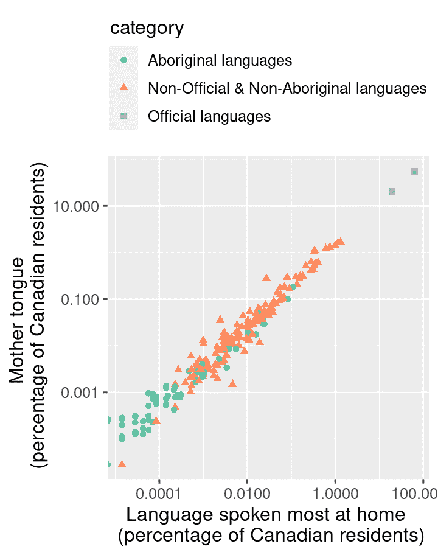

图 4.15：加拿大人报告的语言作为母语与家庭主要语言百分比的散点图，按语言类别着色，使用色盲友好颜色。

从图 4.15 的可视化中，我们现在可以清楚地看到，绝大多数加拿大人报告说，他们的一种官方语言是他们的母语，也是他们在家里最常说的语言。当我们考虑探索性问题的第二部分时，我们会看到什么？我们会看到作为母语和作为家庭主要语言的所说话语之间的关系有何不同？根据图 4.15，似乎没有太大的差异。对于每个高级语言类别，似乎存在一个强烈的、积极的、线性的关系，即说某种语言作为母语的人数百分比与说它作为家庭主要语言的人数百分比之间的关系。无论类别如何，这种关系看起来都很相似。

这是否意味着这种关系在世界上所有语言中都是正相关的？更进一步，如果我们知道有多少人将其作为家庭中的主要语言，我们能否仅使用这种数据可视化来预测有多少人将某种语言作为母语？这两个问题的答案都是“不！”然而，通过探索性数据分析，我们可以创建新的假设、想法和问题（如本段开头所述）。回答这些问题通常涉及进行更复杂的分析，有时甚至需要收集额外的数据。我们将在本书的后面部分看到更多这样的复杂分析。

### 4.5.4 条形图：岛屿陆地数据集

`islands.csv` 数据集包含地球陆地面积列表以及它们的面积（以千平方英里为单位）(McNeil 1977)。

**问题：** 大陆（北美洲/南美洲、非洲、欧洲、亚洲、澳大利亚、南极洲）是地球最大的七个陆地吗？如果是这样，那么在这些大陆之后，接下来几个最大的陆地是什么？

要开始，我们将读取并检查数据：

```r
# islands data
islands_df <- read_csv("data/islands.csv")
islands_df
```

```r
## # A tibble: 48 × 3
##    landmass      size landmass_type
##    <chr>        <dbl> <chr>        
##  1 Africa       11506 Continent    
##  2 Antarctica    5500 Continent    
##  3 Asia         16988 Continent    
##  4 Australia     2968 Continent    
##  5 Axel Heiberg    16 Other        
##  6 Baffin         184 Other        
##  7 Banks           23 Other        
##  8 Borneo         280 Other        
##  9 Britain         84 Other        
## 10 Celebes         73 Other        
## # ℹ 38 more rows
```

在这里，我们有一个地球陆地面积的数据框，并试图比较它们的面积。回答这个问题的正确可视化类型是条形图。在条形图中，每个条形的高度代表一个 *数量*（大小、计数、比例、百分比等）。它们特别适用于比较分类变量不同组之间的计数或比例。然而，请注意，条形图通常不应用于显示平均值或中位数，因为它们隐藏了关于数据变异的重要信息。相反，最好显示所有单个数据点的分布，例如，使用直方图，我们将在第 4.5.5 节中进一步讨论。

我们指定我们想要使用 `ggplot2` 中的 `geom_bar` 函数来创建条形图。然而，默认情况下，`geom_bar` 将条形的高度设置为数据框中值出现的次数（其 *计数*）；在这里，我们想要绘制数据框中的确切值，即陆地面积。因此，我们必须将 `stat = "identity"` 参数传递给 `geom_bar`。结果如图 4.16 所示。

```r
islands_bar <- ggplot(islands_df, aes(x = landmass, y = size)) +
 geom_bar(stat = "identity")

islands_bar
```

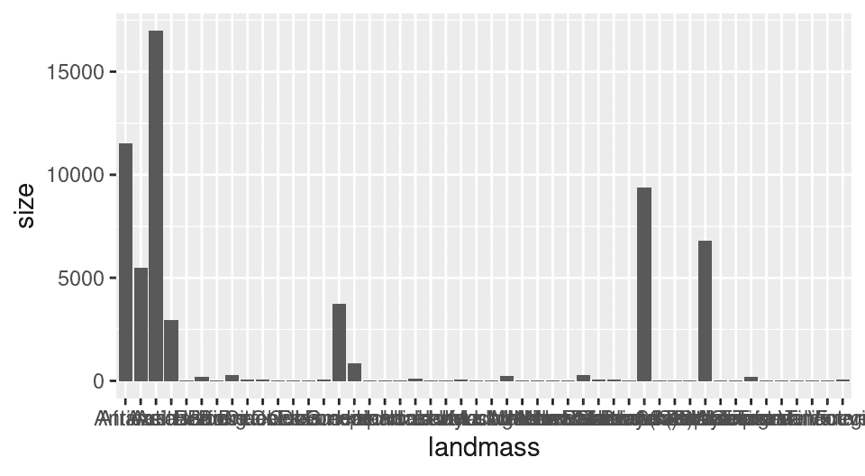

图 4.16：地球陆地面积的条形图，标签被压缩。

好的，不错！图 4.16 确实是我们需要的可视化类型，因为我们可以清楚地看到并比较陆地的面积。主要问题是较小陆地的面积难以区分，而且由于空间太小，陆地的名称相互遮挡。但请记住，我们提出的问题只是关于最大的陆地；让我们通过只保留最大的 12 个陆地来使图表更清晰。我们使用`slice_max`函数来做这件事：`order_by`参数是我们想要用于比较的列名，而`n`参数指定要保留的行数。然后为了给标签留出足够的空间，我们将使用水平条形而不是垂直条形。我们通过交换`x`和`y`变量来实现这一点。

> **注意：**回想一下，在第一章中，我们使用了`arrange`然后是`slice`来获取一个变量的最大值的前十行。我们也可以使用`slice_max`函数来完成这个目的。`slice_max`和`slice_min`函数与`arrange`后跟`slice`达到相同的目标，但它们更有效率，因为它们专门为此目的而设计。一般来说，当有更专业的函数可用时，使用它们是好的！

```r
islands_top12 <- slice_max(islands_df, order_by = size, n = 12)
islands_bar <- ggplot(islands_top12, aes(x = size, y = landmass)) +
 geom_bar(stat = "identity")

islands_bar
```

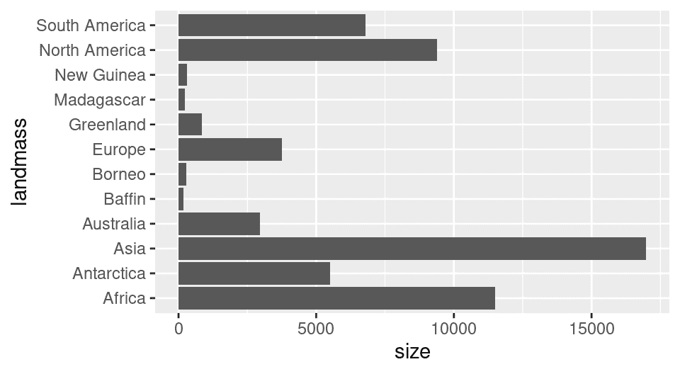

图 4.17：地球最大 12 个陆地的条形图。

图 4.17 现在确实更清晰了，并允许我们肯定地回答我们的问题（“最大的 7 个陆地是大陆吗？”）。然而，我们仍然可以通过根据条形是否对应大陆来着色条形，以及通过按陆地面积而不是按字母顺序组织条形来改进这个可视化。用于着色条形的数据存储在`landmass_type`列中，所以我们向美学映射中添加了`fill`参数并将其设置为`landmass_type`。我们使用`scale_fill_manual`函数手动选择两种颜色用于条形：`"darkorange"`用于橙色和`"steelblue"`用于蓝色。为了按`size`变量组织陆地，我们将在美学映射中使用`tidyverse`的`fct_reorder`函数，按其`size`变量组织陆地。传递给`fct_reorder`的第一个参数是我们想要重新排序的水平因子列的名称（在这里，`landmass`）。第二个参数是我们想要用于排序的列名（在这里，`size`）。`fct_reorder`函数默认按升序排序，但可以通过设置`.desc = TRUE`改为降序排序。我们在这里这样做是为了让最大的条形最接近轴线，这更具有视觉吸引力。

为了最终完成这个图表，我们将自定义坐标轴和图例标签，并为图表添加标题。图表标题并不总是必需的，尤其是在它将与现有的标题或周围上下文重复时（例如，在带有注释的幻灯片演示中）。但是，如果您决定包含一个，一个好的图表标题应该提供您希望读者关注的要点，例如，“地球的七个最大陆地是大陆，”或对显示信息的更一般性总结，例如，“地球的十二个最大陆地。”

为了进行这些最终调整，我们将使用`labs`函数而不是本章前面看到的`xlab`和`ylab`函数，因为`labs`允许我们修改图例标签和标题，以及坐标轴标签。我们在图中为每个美学映射提供一个标签——在这种情况下，`x`、`y`和`fill`——以及一个用于`title`参数的标签。最后，我们再次使用`theme`函数来更改字体大小。

```r
islands_bar <- ggplot(islands_top12,
 aes(x = size,
 y = fct_reorder(landmass, size, .desc = TRUE),
 fill = landmass_type)) +
 geom_bar(stat = "identity") +
 labs(x = "Size (1000 square mi)",
 y = "Landmass",
 fill = "Type",
 title = "Earth's twelve largest landmasses") +
 scale_fill_manual(values = c("steelblue", "darkorange")) +
 theme(text = element_text(size = 10))

islands_bar
```

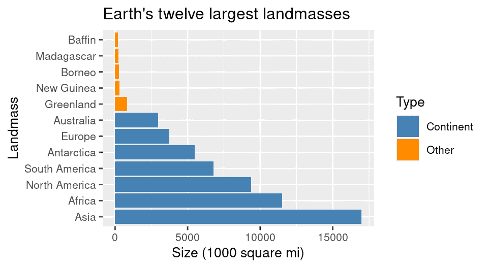

图 4.18：按陆地类型着色的大地球 12 个最大陆地的条形图，具有更清晰的坐标轴和标签。

图 4.184.18 现在是一个非常有效的可视化工具，用于回答我们的原始问题。陆地按其大小组织，并且大陆的颜色与其他陆地不同，这使得大陆是最大的七个陆地这一点非常清晰。

### 4.5.5 直方图：米歇尔逊光速数据集

`morley`数据集包含了在 1879 年进行的实验中收集到的光速测量数据。进行了五个实验，每个实验进行了 20 次运行——这意味着每个实验中收集了 20 次光速的测量数据(Michelson 1882)。`morley`数据集在基础 R 中作为数据框提供，因此不需要加载。由于光速是一个非常大的数字（真实值是 299,792.458 km/sec），数据被编码为测量光速减去 299,000。这种编码使我们能够关注测量中的变化，这些变化通常比 299,000 小得多。如果我们使用完整的大速度测量，测量中的变化将不明显，这将使得研究实验之间的差异变得困难。请注意，我们将`morley`数据转换为 tibble，以利用这些专用数据框提供的更美观的打印输出。

**问题**：鉴于我们现在对光速（每秒 299,792.458 公里）的了解，每个实验的准确性如何？

```r
# michelson morley experimental data
morley <- as_tibble(morley)
morley
```

```r
## # A tibble: 100 × 3
##     Expt   Run Speed
##    <int> <int> <int>
##  1     1     1   850
##  2     1     2   740
##  3     1     3   900
##  4     1     4  1070
##  5     1     5   930
##  6     1     6   850
##  7     1     7   950
##  8     1     8   980
##  9     1     9   980
## 10     1    10   880
## # ℹ 90 more rows
```

在这个实验数据中，迈克尔逊试图测量一个单一的定量数值（光速）。数据集包含对这个单一数量的许多测量。为了了解实验的准确性，我们需要可视化测量的分布（即所有可能的值及其出现的频率）。我们可以使用 *直方图* 来做到这一点。直方图通过将数据分成组，然后使用垂直条来显示每个组中数据点的数量，帮助我们可视化特定变量在数据集中的分布情况。

要在 `ggplot2` 中创建直方图，我们将使用 `geom_histogram` 几何对象，将 x 轴设置为 `Speed` 测量变量。像往常一样，让我们使用默认参数来看看效果如何。

```r
morley_hist <- ggplot(morley, aes(x = Speed)) +
 geom_histogram()

morley_hist
```


图 4.19：迈克尔逊光速数据的直方图。

图 4.19 是一个很好的起点。然而，除非我们能看到真实值，否则我们无法通过这个可视化来判断测量的准确性。为了可视化光速的真实值，我们将使用 `geom_vline` 函数添加一条垂直线。要使用 `geom_vline` 绘制垂直线，我们需要指定线应该在 x 轴的哪个位置绘制。我们可以通过设置 `xintercept` 参数来实现。在这里，我们将其设置为 792.458，这是光速的真实值减去 299,000；这确保了它与 `morley` 数据框中的测量方式相同。我们还想微调这条垂直线，通过设置 `linetype = "dashed"` 使其呈现虚线样式。还有一个类似的功能，`geom_hline`，用于绘制水平线。请注意，*垂直线* 用于表示 *水平轴* 上的数量，而 *水平线* 用于表示 *垂直轴* 上的数量。

```r
morley_hist <- ggplot(morley, aes(x = Speed)) +
 geom_histogram() +
 geom_vline(xintercept = 792.458, linetype = "dashed")

morley_hist
```

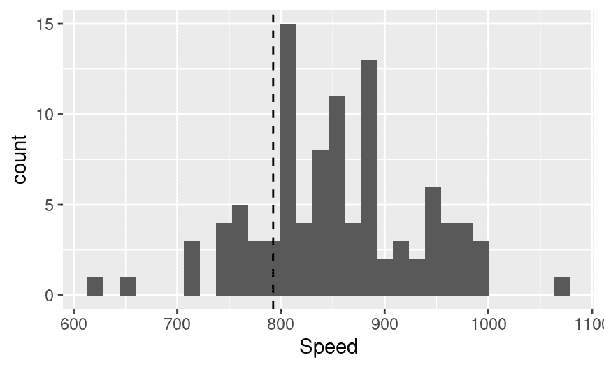

图 4.20：带有表示真实光速的垂直线的迈克尔逊光速数据直方图。

在图 4.20 中，我们仍然无法判断哪些实验（在 `Expt` 列中表示）导致了哪些测量；也许有些实验比其他实验更准确。为了完全回答我们的问题，我们需要在视觉上将测量值分开。我们可以尝试使用 *彩色* 直方图来实现这一点，其中不同实验的计数以不同的颜色堆叠在一起。我们可以通过将 `Expt` 变量添加到 `fill` 美学映射中来创建按 `Expt` 变量着色的直方图。我们通过将 `geom_histogram` 中的 `alpha` 参数设置为 `0.5` 来确保不同的颜色可以被人看到（尽管它们都堆叠在一起），这使得条形稍微半透明。我们还指定了 `position = "identity"` 在 `geom_histogram` 中，以确保每个实验的直方图将并排叠加，而不是堆叠条形（这是条形图或当它们按另一个分类变量着色时的默认设置）。

```r
morley_hist <- ggplot(morley, aes(x = Speed, fill = Expt)) +
 geom_histogram(alpha = 0.5, position = "identity") +
 geom_vline(xintercept = 792.458, linetype = "dashed")

morley_hist
```

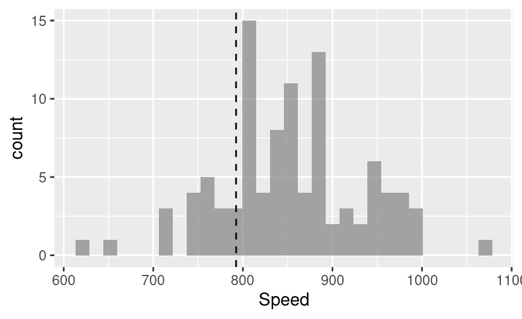

图 4.21：尝试按实验着色米歇尔逊光速数据直方图。

好吧，图 4.21 看起来……等等！直方图的颜色还是全部一样的！这里发生了什么？嗯，如果你还记得第三章，你为每个变量使用的 *数据类型* 可以影响 R 和 `tidyverse` 如何处理它。在这里，我们确实在 `morley` 数据框中的数据类型上遇到了问题。特别是，`Expt` 列目前是一个 *整数*（你可以在本节开头打印的数据框中 `Expt` 列下面的 `<int>` 标签看到）。但我们要将其视为 *类别*，即每种实验类型应该有一个类别。

为了解决这个问题，我们可以通过在 `fill` 美学映射中传递它来将 `Expt` 变量转换为 *因子*。回想一下，因子是 R 中常用来表示类别的数据类型。通过编写 `as_factor(Expt)`，我们确保 R 会将此变量视为因子，并且颜色将被离散映射。

```r
morley_hist <- ggplot(morley, aes(x = Speed, fill = as_factor(Expt))) +
 geom_histogram(alpha = 0.5, position = "identity") +
 geom_vline(xintercept = 792.458, linetype = "dashed")

morley_hist
```

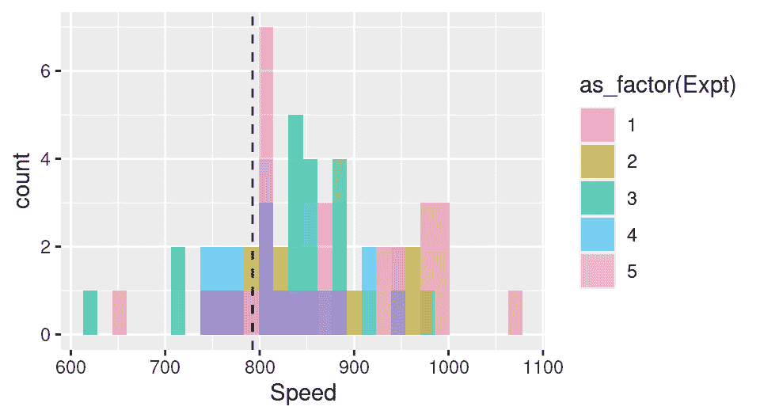

图 4.22：按实验因子着色的米歇尔逊光速数据直方图。

> **注意：**因子以两种方式影响图表：（1）确保在适当的地方将颜色映射为离散（如本例所示），以及（2）图表中级别的顺序。`ggplot` 考虑因子级别的顺序，而不是数据框中数据的顺序。学习如何重新排序你的因子级别将帮助你重新排序图表中因子的标签。

不幸的是，尝试通过视觉上分离实验编号的做法造成了一些混乱。图 4.22 中的所有颜色都混合在一起了，尽管可以从这里得出一些见解（例如，实验 1 和 3 有一些最不准确的测量），但这并不是传达我们的信息和回答问题的最清晰方式。让我们尝试一种不同的策略，即创建一个单独直方图网格。

我们使用`facet_grid`函数来创建一个由多个子图组成的网格状图表。`facet_grid`的参数指定了用于将图表分割成子图的变量（s），以及如何分割它们（即，行或列）。如果要将图表水平分割，即分割成行，则使用`rows`参数。如果要将图表垂直分割，即分割成列，则使用`cols`参数。`rows`和`cols`参数都用于指定在创建子图时分割数据的列名。请注意，列名必须被`vars`函数包围。此函数允许列名在数据框的上下文中正确评估。

```r
morley_hist <- ggplot(morley, aes(x = Speed, fill = as_factor(Expt))) +
 geom_histogram() +
 facet_grid(rows = vars(Expt)) +
 geom_vline(xintercept = 792.458, linetype = "dashed")

morley_hist
```

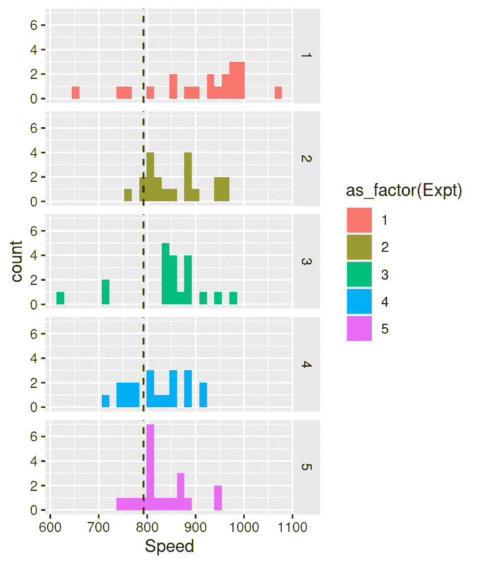

图 4.23：按实验垂直分割的迈克尔逊光速数据直方图。

图 4.23 中的可视化现在清楚地显示了不同实验之间的准确性。最不稳定的测量来自实验 1。那里的测量值从大约 650–1050 km/sec 不等。最稳定的测量来自实验 2。那里的测量值从大约 750–950 km/sec 不等。最不同的实验仍然得到了相当相似的结果！

为了使这个可视化更加清晰，我们需要做两个细节处理。首先，我们需要使用`labs`函数添加信息丰富的轴标签，并使用`theme`函数增加字体大小以便阅读。其次，尽管在这个图表上比较实验相对容易，但要获得所有实验整体准确性的感觉却很困难。例如，图表上的值 800 相对于光速的真实值有多准确？为了回答这个问题，我们将使用`mutate`函数将我们的数据转换成相对准确度的度量，而不是绝对度量：

```r
morley_rel <- mutate(morley,
 relative_accuracy = 100 *
 ((299000 + Speed) - 299792.458) / (299792.458))

morley_hist <- ggplot(morley_rel,
 aes(x = relative_accuracy,
 fill = as_factor(Expt))) +
 geom_histogram() +
 facet_grid(rows = vars(Expt)) +
 geom_vline(xintercept = 0, linetype = "dashed") +
 labs(x = "Relative Accuracy (%)",
 y = "# Measurements",
 fill = "Experiment ID") +
 theme(text = element_text(size = 12))

morley_hist
```

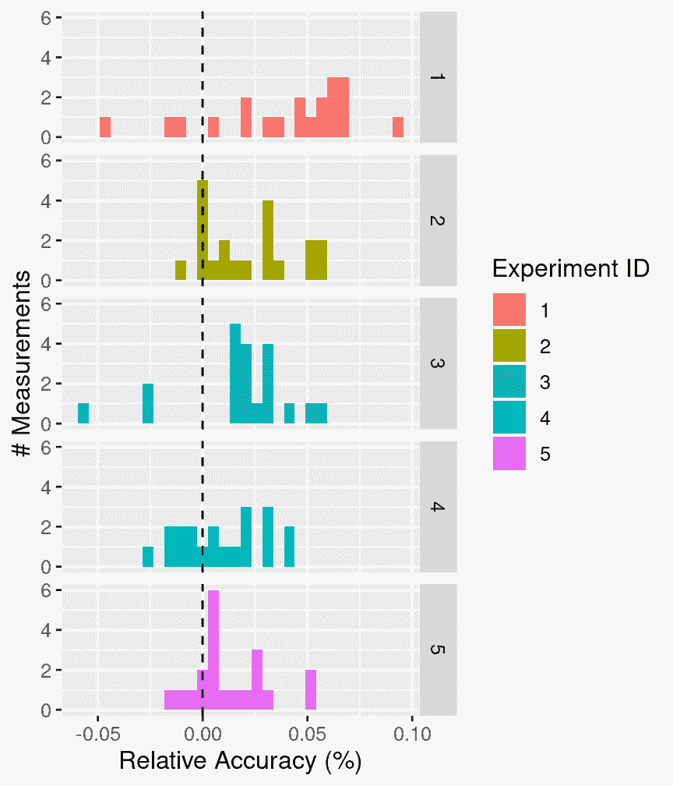

图 4.24：按实验垂直分割的相对精度直方图，具有更清晰的轴和标签。

哇，令人印象深刻！从 1879 年对这些光速的测量中，误差大约为真实速度的*0.05%*。图 4.24 展示了尽管实验 2 和 5 可能是最准确的，但考虑到当时的技术水平，所有实验都做得相当出色。

#### 为直方图选择箱宽

当你在 R 中创建直方图时，默认使用的箱数是 30。自然地，这并不总是正确的数字。你可以通过在`geom_histogram`几何对象中使用`bins`参数来自定义箱数。你还可以使用`geom_histogram`几何对象中的`binwidth`参数设置箱的*宽度*。但是，应该使用多少个箱或箱宽才是正确的呢？

很遗憾，没有硬性规则来确定正确的箱数或宽度。这完全取决于你的问题；正确的箱数或箱宽是帮助你回答你提出的问题的那个。为你的问题选择正确的设置通常需要迭代。我们建议设置*箱宽*（而不是*箱数*），因为它通常更直接地对应于你感兴趣的问题中的值。例如，如果你正在查看人类身高的直方图，1 英寸的箱宽可能是合理的，而要使用的箱数并不立即明确。通常，尝试几个箱宽以查看哪个最能清楚地捕捉你想要回答的问题中的数据是个好主意。

为了了解不同的箱宽如何影响可视化效果，让我们在这个章节中实验一下我们一直在工作的直方图。在图 4.25 中，我们比较了默认设置与设置了`binwidth`为 0.001、0.01 和 0.1 的三个其他直方图。在这种情况下，我们可以看到默认的箱数和 0.01 的箱宽都有效地帮助我们回答了问题。另一方面，0.001 和 0.1 的箱宽太小和太大。

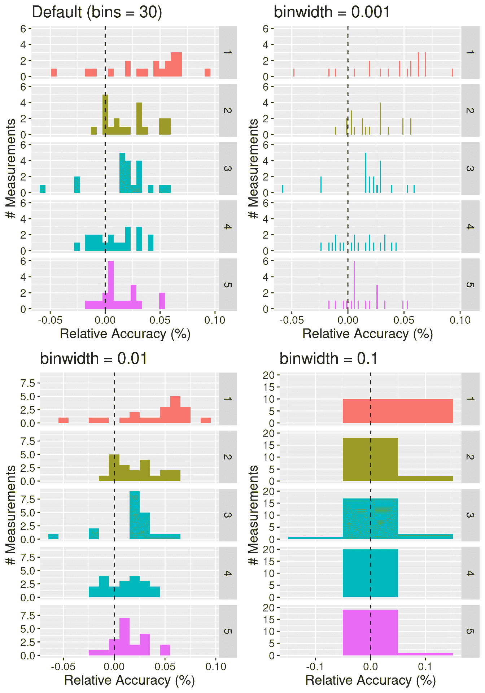

图 4.25：箱宽变化对直方图的影响。

#### 向`ggplot`绘图对象添加层

`ggplot`的一个强大功能是你可以对单个绘图对象进行迭代，一次添加和改进一层。如果你使用赋值符号（`<-`）将你的绘图存储为命名对象，你可以使用`+`运算符对其进行添加。例如，如果我们想给最后一个创建的绘图（`morley_hist`）添加一个标题，我们可以使用`+`运算符和`ggtitle`函数添加一个标题层。结果如图 4.26 所示。

```r
morley_hist_title <- morley_hist +
 ggtitle("Speed of light experiments \n were accurate to about 0.05%")

morley_hist_title
```

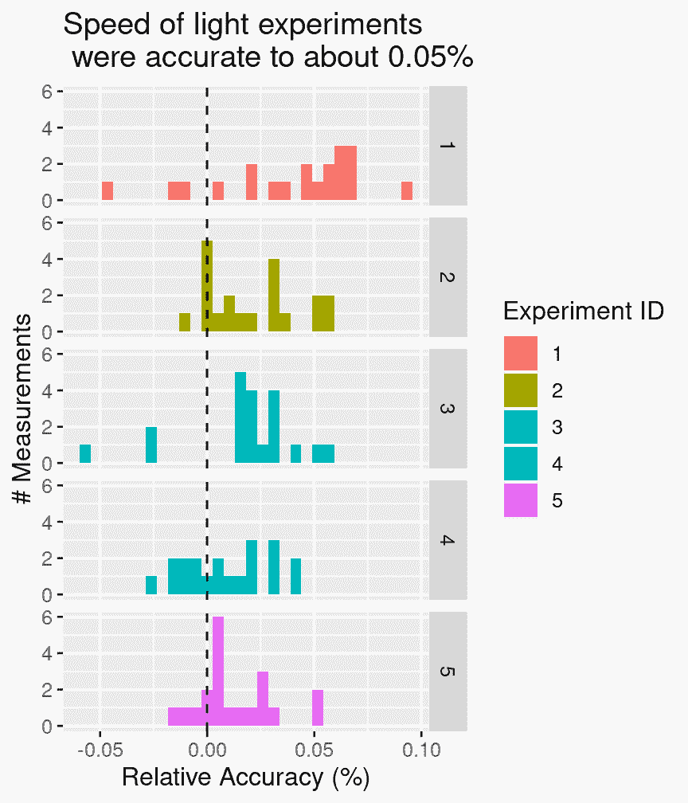

图 4.26：按实验垂直分割的相对准确度直方图，带有描述性标题，突出可视化的要点。

> **注意：** 好的可视化标题清楚地传达了给观众的要点。通常，那是在制作可视化之前提出的问题的答案。

## 4.6 解释可视化

#### *讲述一个故事*

通常，你的可视化不会单独展示，而是作为更大演示的一部分。此外，可视化可以为演示的任何方面提供支持信息，从开场到结论。例如，你可以在演示的开头使用探索性可视化来激发你对更详细的数据分析/模型的兴趣，使用分析结果的可视化来展示你的分析发现了什么，甚至可以在演示结束时提出未来工作的方向。

无论可视化出现在哪里，讨论你的可视化作为一个故事都是一种好方法：

1.  建立背景和范围，并描述你为什么这样做。

1.  提出你的可视化回答的问题。说明为什么回答这个问题很重要。

1.  使用你的可视化来回答问题。确保你描述了可视化的所有方面（包括描述坐标轴）。但你可以根据回答问题的需要强调不同的方面：

    +   **趋势（线条）：** 线条是否很好地描述了趋势？如果是这样，趋势是**线性**的，如果不是，趋势是**非线性**的。趋势是增加、减少还是两者都不是？趋势中是否存在周期性的振荡（波动）？趋势是嘈杂的（线条是否“跳来跳去”）还是平滑的？

    +   **分布（散点、直方图）：** 数据分布有多广？它们大致集中在哪里？是否存在任何明显的“簇”或“子组”，这些在直方图中会表现为多个峰值？

    +   **两个变量的分布（散点）：** 变量之间是否存在清晰/强烈的关联（点落在明显的模式中），是弱关联（点落在模式中但存在一些噪声），还是没有可识别的关联（数据太嘈杂，无法得出任何结论）？

    +   **数量（条形）：** 条形相对于彼此有多大？不同组条形中是否存在模式？

1.  总结你的发现，并使用它们来激发你接下来要讨论的内容。

下面是两个例子，说明了如何描述本章前面出现的示例可视化，并采取这四个步骤。每个步骤都用其数字编号表示，例如（3）。

**莫纳罗亚大气二氧化碳测量：** (1) 许多当前形式的能源生成和转换——从汽车引擎到天然气发电厂——都依赖于燃烧化石燃料，并产生温室气体，通常是二氧化碳（CO\(_{\text{2}}\））作为副产品。地球大气中这些气体的过多积累将导致其捕获更多的太阳热量，从而导致全球变暖。 (2) 为了评估大气中二氧化碳浓度随时间增加的速度，我们（3）使用了来自夏威夷莫纳罗亚观测站的数据集，该数据集包含 1980 年至 2020 年的二氧化碳测量数据。我们绘制了二氧化碳浓度（垂直轴）随时间（水平轴）的变化图。从这张图中，你可以看到随着时间的推移，一个清晰、持续上升且总体上呈线性趋势。也存在一种每年发生一次的周期性振荡，与夏威夷的季节相吻合，其振幅相对于整体趋势的增长来说很小。这表明大气中的二氧化碳浓度随时间明显增加，并且（4）也许值得进一步调查其成因。

**米歇尔光速实验：** (1) 我们对光物理学的现代理解从 19 世纪末以来有了显著的进步，当时米歇尔和莫雷的实验首次证明了光具有有限的速度。根据现代实验，我们知道它以大约 299,792.458 千米/秒的速度移动。 (2) 但我们最初是如何准确测量这个基本物理常数的，以及某些实验是否比其他实验产生了更准确的结果？ (3) 为了更好地理解这一点，我们绘制了米歇尔在 1879 年进行的 5 个实验的数据，每个实验有 20 次试验，并将它们作为堆叠在一起的历史图。水平轴显示了测量精度相对于我们今天所知的真光速的百分比。从这种可视化中，你可以看到大多数结果的最大相对误差不超过 0.05%。你还可以看到实验 1 和 3 的测量值与真实值相差最远，而实验 5 倾向于提供最一致准确的结果。 (4) 值得进一步调查这些实验之间的差异，以了解为什么它们产生了不同的结果。

## 4.7 保存可视化

#### *选择适合您需求的输出格式*

正如存储数据集有多种方式一样，存储可视化图像也有多种方式。你选择哪种方式可能取决于几个因素，例如文件大小/类型限制（例如，如果你将可视化作为会议论文的一部分提交或提交给海报印刷店）以及它将在哪里显示（例如，在线、在论文中、在海报上、在广告牌上、在演讲幻灯片上）。一般来说，图像有两种类型：*光栅*格式和*矢量*格式。

**位图**图像表示为二维的方形像素网格，每个像素都有自己的颜色。位图图像在存储之前通常会被压缩，以减少占用的空间。如果加载和显示时图像不能完美地重新创建，则压缩格式是有损的，希望这种变化不会引起注意。另一方面，无损格式允许完美地显示原始图像。

+   *常见文件类型:*

    +   [JPEG](https://en.wikipedia.org/wiki/JPEG) (`.jpg`, `.jpeg`): 有损，通常用于照片

    +   [PNG](https://en.wikipedia.org/wiki/Portable_Network_Graphics) (`.png`): 无损，通常用于图表/线图

    +   [BMP](https://en.wikipedia.org/wiki/BMP_file_format) (`.bmp`): 无损，原始图像数据，无压缩（很少使用）

    +   [TIFF](https://en.wikipedia.org/wiki/TIFF) (`.tif`, `.tiff`): 通常无损，无压缩，主要用于图形艺术、出版

+   *开源软件:* [GIMP](https://www.gimp.org/)

**矢量**图像表示为数学对象（线条、表面、形状、曲线）的集合。当计算机显示图像时，它会使用它们的数学公式重新绘制所有元素。

+   *常见文件类型:*

    +   [SVG](https://en.wikipedia.org/wiki/Scalable_Vector_Graphics) (`.svg`): 通用用途

    +   [EPS](https://en.wikipedia.org/wiki/Encapsulated_PostScript) (`.eps`): 通用用途（很少使用）

+   *开源软件:* [Inkscape](https://inkscape.org/)

矢量和位图图像具有相反的优点和缺点。固定宽度和高度的位图图像无论显示什么内容，加载所需的空间和时间都是相同的（一个例外是压缩算法可能会使某些图像的图像缩小更多或运行更快）。矢量图像根据图像的复杂程度占用空间和时间，因为每次显示时计算机都必须绘制所有元素。例如，如果你有一个存储为 SVG 文件的包含一百万个点的散点图，打开图像可能需要你的计算机一些时间。另一方面，你可以随意放大/缩放矢量图形，而不会使图像看起来不好，而位图图像最终会开始看起来“像素化”。

> **注意:** 可移植文档格式[PDF](https://en.wikipedia.org/wiki/PDF) (`.pdf`)通常用于存储**矢量**和**位图**格式。如果你尝试打开一个 PDF，并且它加载时间很长，那可能是因为有一个复杂的矢量图形图像，你的计算机正在渲染。

让我们学习如何使用[Old Faithful 数据集](https://www.stat.cmu.edu/~larry/all-of-statistics/=data/faithful.dat) (Hardle 1991)的散点图将这些不同的文件格式保存图像，如图 4.27 所示。

```r
library(svglite) # we need this to save SVG files
faithful_plot <- ggplot(data = faithful, aes(x = waiting, y = eruptions)) +
 geom_point() +
 labs(x = "Waiting time to next eruption \n (minutes)",
 y = "Eruption time \n (minutes)") +
 theme(text = element_text(size = 12))

faithful_plot
```

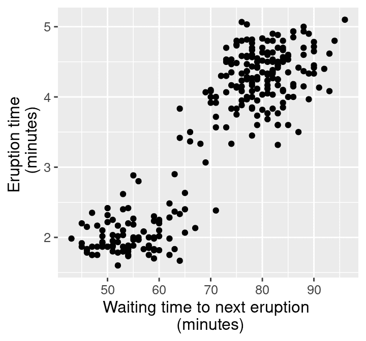

图 4.27：等待时间和喷发时间的散点图。

现在我们有一个命名的 `ggplot` 图表对象，我们可以使用 `ggsave` 函数保存包含此图像的文件。`ggsave` 通过将其第一个参数作为要创建的图像的文件名来工作。这可以包括你想要保存文件的目录路径（例如，`img/viz/filename.png` 将文件名为 `filename` 的文件保存到 `img/viz/` 目录），以及作为第二个参数的图表对象名称。要保存的图像类型由文件扩展名指定。例如，要创建 PNG 图像文件，我们指定文件扩展名为 `.png`。以下我们演示如何为 `faithful_plot` 保存 PNG、JPG、BMP、TIFF 和 SVG 文件类型：

```r
ggsave("img/viz/faithful_plot.png", faithful_plot)
ggsave("img/viz/faithful_plot.jpg", faithful_plot)
ggsave("img/viz/faithful_plot.bmp", faithful_plot)
ggsave("img/viz/faithful_plot.tiff", faithful_plot)
ggsave("img/viz/faithful_plot.svg", faithful_plot)
```

表 4.1：将 Old Faithful 数据集的散点图保存为不同文件格式时的文件大小。

| 图像类型 | 文件类型 | 图像大小 |
| --- | --- | --- |
| 位图 | PNG | 0.15 MB |
| 位图 | JPG | 0.42 MB |
| 位图 | BMP | 3.15 MB |
| 位图 | TIFF | 9.44 MB |
| 矢量 | SVG | 0.03 MB |

查看表 4.1 中的文件大小。哇，这差距相当大！注意，对于这样一个简单的包含少量图形元素（点）的图表，矢量图形格式（SVG）比未压缩的位图图像（BMP、TIFF）小 100 多倍。此外，JPG 格式是 PNG 格式的两倍大，因为 JPG 压缩算法是为自然图像（而非图表）设计的。

在图 4.28 中，我们还展示了当我们放大到一个只有 2 个数据点的矩形时图像的样子。你可以看到矢量图形格式为什么如此有用：因为它们只是基于数学公式，矢量图形可以放大到任意大小。这使得它们非常适合各种尺寸的演示媒体，从论文到海报到广告牌。


图 4.28：放大查看 `faithful`，位图（PNG，左侧）和矢量（SVG，右侧）格式。

## 4.8 练习

本章涵盖的练习可以在配套的 [worksheets 仓库](https://worksheets.datasciencebook.ca) 的“有效的数据可视化”行中找到。你可以通过点击“启动 binder”按钮在你的浏览器中启动工作表的交互式版本。你也可以通过点击“查看工作表”预览非交互式版本的工作表。如果你决定下载工作表并在自己的机器上运行它，请确保遵循第十三章中找到的计算机设置说明。这将确保工作表提供的自动反馈和指导按预期工作。

## 4.9 其他资源

+   [ggplot2 R 包页面](https://ggplot2.tidyverse.org) (Wickham, Chang, et al. 2021)是您想了解更多关于本章中函数、您可以使用的一整套参数以及其他相关函数的地方。该网站还提供了一个非常棒的速查表，总结了本章中的许多数据处理函数。

+   《数据可视化基础》（Wilke 2019）提供了大量关于设计有效可视化信息。它不特定于任何特定的编程语言或库。如果您想提高您的可视化技能，这是您应该查看的下一个地方。

+   《R 数据科学》（Wickham and Grolemund 2016）有一章关于使用`ggplot2`创建可视化（Wickham and Grolemund 2016）。这个参考专门针对 R 和`ggplot2`，但它提供了对`ggplot2`提供的全部工具集的更详细介绍。如果您想学习如何在`ggplot2`中制作比本章中包含的更复杂的可视化，您应该查看这一章。

+   [主题函数文档](https://ggplot2.tidyverse.org/reference/theme.html)是查看您如何微调可视化中非数据方面的绝佳参考。

+   《R 数据科学》（Wickham and Grolemund 2016）有一章关于[日期和时间](https://r4ds.had.co.nz/dates-and-times.html)。如果您想了解`date`向量，包括如何创建它们，以及如何使用`lubridate`包有效地处理持续时间、时期和区间，您应该查看这一章。

### 参考文献
