# 第五章 分类 I：训练与预测

> 原文：[`datasciencebook.ca/classification1.html`](https://datasciencebook.ca/classification1.html)

## 5.1 概述

在前面的章节中，我们专注于描述性和探索性数据分析问题。本章和下一章一起构成了我们首次尝试回答关于数据的**预测**问题。特别是，我们将专注于**分类**，即使用一个或多个变量来预测感兴趣的分类变量的值。本章将涵盖分类的基础知识、如何预处理数据以使其适合用于分类器，以及如何使用我们的观察数据来做出预测。下一章将专注于如何评估分类器预测的准确性，以及如何改进我们的分类器（如果可能）以最大化其准确性。

## 5.2 本章学习目标

到本章结束时，读者将能够做到以下几点：

+   识别适合进行预测的分类器的情况。

+   描述训练数据集是什么以及它在分类中的应用。

+   解释分类器的输出。

+   当有两个预测变量时，手动计算图上点之间的直线（欧几里得）距离。

+   解释 K 最近邻分类算法。

+   使用`tidymodels`在 R 中执行 K 最近邻分类。

+   使用`recipe`作为预处理步骤来中心化、缩放、平衡和插补数据。

+   使用`workflow`结合预处理和模型训练。

## 5.3 分类问题

在许多情况下，我们希望根据当前情况以及过去的经验进行预测。例如，医生可能希望根据患者的症状和医生过去与患者的经验来诊断患者是患病还是健康；电子邮件提供商可能希望根据电子邮件的文本和过去的电子邮件文本数据来标记给定的电子邮件为“垃圾邮件”或“非垃圾邮件”；或者信用卡公司可能希望根据当前的购买项目、金额和位置以及过去的购买来预测购买是否欺诈。这些任务都是**分类**的例子，即根据观察的其他变量（有时称为**特征**）预测一个分类类别（有时称为**标签**）。

通常，分类器将一个未知类别的观察（例如，新患者）分配到一个类别（例如，患病或健康），这是基于它与已知类别的其他观察的相似程度（例如，已知疾病和症状的先前患者）。我们用作预测基础的已知类别的观察称为**训练集**；这个名字来源于我们使用这些数据来训练或教授我们的分类器。一旦教授完毕，我们就可以使用分类器对新数据做出预测，这些新数据我们不知道其类别。

我们可以使用许多可能的方法来预测一个观察值的分类类别/标签。在这本书中，我们将重点关注广泛使用的**K 最近邻**算法（Fix 和 Hodges 1951；Cover 和 Hart 1967）。在你的未来研究中，你可能会遇到决策树、支持向量机（SVMs）、逻辑回归、神经网络等；下一章末尾的附加资源部分提供了开始学习这些其他方法的起点。还值得一提的是，基本分类问题有许多变体。例如，我们关注的是**二元分类**的设置，其中只涉及两个类别（例如，健康或疾病的诊断），但你也可能遇到涉及两个以上类别的多类别分类问题（例如，健康、支气管炎、肺炎或普通感冒）。

## 5.4 探索数据集

在本章和下一章中，我们将研究由威廉·H·沃尔伯格博士、W·尼克·斯特里特和奥利维·L·曼加萨里安创建的[数字化乳腺癌图像特征](https://archive.ics.uci.edu/ml/datasets/Breast+Cancer+Wisconsin+%28Diagnostic%29)数据集，Street、沃尔伯格和曼加萨里安 1993。数据集中的每一行代表一个肿瘤样本的图像，包括诊断（良性或恶性）和几个其他测量值（细胞纹理、周长、面积等）。每个图像的诊断都是由医生进行的。

与所有数据分析一样，我们首先需要明确一个我们想要回答的精确问题。在这里，问题是**预测性的**：我们能否使用我们可用的肿瘤图像测量值来预测未来的肿瘤图像（未知诊断）显示的是良性还是恶性肿瘤？回答这个问题很重要，因为传统的、非数据驱动的肿瘤诊断方法相当主观，并且依赖于诊断医生的技术和经验。此外，良性肿瘤通常不会造成危险；细胞停留在同一位置，肿瘤在变得非常大之前就会停止生长。相比之下，在恶性肿瘤中，细胞会侵犯周围组织并扩散到附近的器官，在那里它们可以造成严重损害（斯坦福健康护理 2021）。因此，快速准确地诊断肿瘤类型以指导患者治疗非常重要。

### 5.4.1 加载癌症数据

我们的第一步是使用可视化来加载、整理和探索数据，以便更好地理解我们所处理的数据。我们首先加载分析所需的`tidyverse`包。

```r
library(tidyverse)
```

在这种情况下，包含乳腺癌数据集的文件是一个带有标题的`.csv`文件。我们将使用不带额外参数的`read_csv`函数，然后检查其内容：

```r
cancer <- read_csv("data/wdbc.csv")
cancer
```

```r
## # A tibble: 569 × 12
##        ID Class Radius Texture Perimeter   Area Smoothness Compactness Concavity
##     <dbl> <chr>  <dbl>   <dbl>     <dbl>  <dbl>      <dbl>       <dbl>     <dbl>
##  1 8.42e5 M      1.10   -2.07     1.27    0.984      1.57       3.28      2.65  
##  2 8.43e5 M      1.83   -0.353    1.68    1.91      -0.826     -0.487    -0.0238
##  3 8.43e7 M      1.58    0.456    1.57    1.56       0.941      1.05      1.36  
##  4 8.43e7 M     -0.768   0.254   -0.592  -0.764      3.28       3.40      1.91  
##  5 8.44e7 M      1.75   -1.15     1.78    1.82       0.280      0.539     1.37  
##  6 8.44e5 M     -0.476  -0.835   -0.387  -0.505      2.24       1.24      0.866 
##  7 8.44e5 M      1.17    0.161    1.14    1.09      -0.123      0.0882    0.300 
##  8 8.45e7 M     -0.118   0.358   -0.0728 -0.219      1.60       1.14      0.0610
##  9 8.45e5 M     -0.320   0.588   -0.184  -0.384      2.20       1.68      1.22  
## 10 8.45e7 M     -0.473   1.10    -0.329  -0.509      1.58       2.56      1.74  
## # ℹ 559 more rows
## # ℹ 3 more variables: Concave_Points <dbl>, Symmetry <dbl>,
## #   Fractal_Dimension <dbl>
```

### 5.4.2 描述癌症数据集中的变量

乳腺癌可以通过进行 *活检* 来诊断，这是一个从体内取出组织并检查疾病存在的过程。传统上这些程序相当侵入性；现代方法，如用于收集现有数据集的细针穿刺，只提取少量组织，侵入性较小。基于为该数据集收集的每个乳腺组织样本的数字图像，测量了图像中每个细胞核的十个不同变量（以下变量列表的第 3-12 项），然后记录了每个变量的核平均值。作为数据准备的一部分，这些值已经被 *标准化（居中和缩放）*；我们将在本章后面讨论这意味着什么以及为什么这样做。每个图像还由医生给出了一个唯一的 ID 和诊断。因此，该数据集中每个图像的变量总数为：

1.  ID：识别号

1.  类别：诊断（M = 恶性或 B = 良性）

1.  半径：从中心到轮廓上点的距离的平均值

1.  纹理：灰度值的标准差

1.  周长：周围轮廓的长度

1.  面积：轮廓内的面积

1.  平滑度：半径长度的局部变化

1.  紧凑度：周长平方与面积的比率

1.  凹度：轮廓凹部的严重程度

1.  凹点：轮廓的凹部数量

1.  对称性：当镜像时核的相似程度

1.  分形维度：衡量轮廓“粗糙”程度的一个度量

下面我们使用 `glimpse` 预览数据框。当有大量列时，这个函数可以让我们更容易地检查数据，因为它以列向下打印数据（而不是横向）。

```r
glimpse(cancer)
```

```r
## Rows: 569
## Columns: 12
## $ ID                <dbl> 842302, 842517, 84300903, 84348301, 84358402, 843786…
## $ Class             <chr> "M", "M", "M", "M", "M", "M", "M", "M", "M", "M", "M…
## $ Radius            <dbl> 1.0960995, 1.8282120, 1.5784992, -0.7682333, 1.74875…
## $ Texture           <dbl> -2.0715123, -0.3533215, 0.4557859, 0.2535091, -1.150…
## $ Perimeter         <dbl> 1.26881726, 1.68447255, 1.56512598, -0.59216612, 1.7…
## $ Area              <dbl> 0.98350952, 1.90703027, 1.55751319, -0.76379174, 1.8…
## $ Smoothness        <dbl> 1.56708746, -0.82623545, 0.94138212, 3.28066684, 0.2…
## $ Compactness       <dbl> 3.28062806, -0.48664348, 1.05199990, 3.39991742, 0.5…
## $ Concavity         <dbl> 2.65054179, -0.02382489, 1.36227979, 1.91421287, 1.3…
## $ Concave_Points    <dbl> 2.53024886, 0.54766227, 2.03543978, 1.45043113, 1.42…
## $ Symmetry          <dbl> 2.215565542, 0.001391139, 0.938858720, 2.864862154, …
## $ Fractal_Dimension <dbl> 2.25376381, -0.86788881, -0.39765801, 4.90660199, -0…
```

从上面的数据摘要中，我们可以看到 `Class` 是字符类型（用 `<chr>` 表示）。我们可以使用 `distinct` 函数查看该列中存在的所有唯一值。我们看到有两种诊断：良性，用“B”表示，和恶性，用“M”表示。

```r
cancer |>
 distinct(Class)
```

```r
## # A tibble: 2 × 1
##   Class
##   <chr>
## 1 M    
## 2 B
```

由于我们将使用 `Class` 作为分类变量，所以使用 `as_factor` 函数将其转换为因子类型是个好主意。我们还将通过使用 `fct_recode` 方法将“M”重命名为“Malignant”和“B”重命名为“Benign”来提高我们分析的可读性。`fct_recode` 方法用于用其他名称替换因子值的名称。`fct_recode` 的参数是你想要修改的列，后跟任意数量的形式为 `"new name" = "old name"` 的参数，以指定重命名方案。

```r
cancer <- cancer |>
 mutate(Class = as_factor(Class)) |>
 mutate(Class = fct_recode(Class, "Malignant" = "M", "Benign" = "B"))
glimpse(cancer)
```

```r
## Rows: 569
## Columns: 12
## $ ID                <dbl> 842302, 842517, 84300903, 84348301, 84358402, 843786…
## $ Class             <fct> Malignant, Malignant, Malignant, Malignant, Malignan…
## $ Radius            <dbl> 1.0960995, 1.8282120, 1.5784992, -0.7682333, 1.74875…
## $ Texture           <dbl> -2.0715123, -0.3533215, 0.4557859, 0.2535091, -1.150…
## $ Perimeter         <dbl> 1.26881726, 1.68447255, 1.56512598, -0.59216612, 1.7…
## $ Area              <dbl> 0.98350952, 1.90703027, 1.55751319, -0.76379174, 1.8…
## $ Smoothness        <dbl> 1.56708746, -0.82623545, 0.94138212, 3.28066684, 0.2…
## $ Compactness       <dbl> 3.28062806, -0.48664348, 1.05199990, 3.39991742, 0.5…
## $ Concavity         <dbl> 2.65054179, -0.02382489, 1.36227979, 1.91421287, 1.3…
## $ Concave_Points    <dbl> 2.53024886, 0.54766227, 2.03543978, 1.45043113, 1.42…
## $ Symmetry          <dbl> 2.215565542, 0.001391139, 0.938858720, 2.864862154, …
## $ Fractal_Dimension <dbl> 2.25376381, -0.86788881, -0.39765801, 4.90660199, -0…
```

让我们再次使用 `distinct` 函数验证我们已经成功将 `Class` 列转换为因子变量，并将其值重命名为“Benign”和“Malignant”。

```r
cancer |>
 distinct(Class)
```

```r
## # A tibble: 2 × 1
##   Class    
##   <fct>    
## 1 Malignant
## 2 Benign
```

### 5.4.3 探索癌症数据

在我们开始任何建模之前，让我们探索我们的数据集。下面我们使用 `group_by`、`summarize` 和 `n` 函数来找出我们数据集中良性肿瘤观察值和恶性肿瘤观察值的数量和百分比。`summarize` 中的 `n` 函数与 `group_by` 配对时，计算每个 `Class` 组中的观察值数量。然后我们通过除以观察值总数并乘以 100 来计算每个组中的百分比。我们有 357（63%）个良性肿瘤观察值和 212（37%）个恶性肿瘤观察值。

```r
num_obs <- nrow(cancer)
cancer |>
 group_by(Class) |>
 summarize(
 count = n(),
 percentage = n() / num_obs * 100
 )
```

```r
## # A tibble: 2 × 3
##   Class     count percentage
##   <fct>     <int>      <dbl>
## 1 Malignant   212       37.3
## 2 Benign      357       62.7
```

接下来，让我们绘制一个散点图来可视化周长和凹度变量之间的关系。我们不会使用 `ggplot` 的默认调色板，而是选择我们自己的色盲友好颜色——`"darkorange"`用于橙色，`"steelblue"`用于蓝色——并将它们作为 `values` 参数传递给 `scale_color_manual` 函数。

```r
perim_concav <- cancer |>
 ggplot(aes(x = Perimeter, y = Concavity, color = Class)) +
 geom_point(alpha = 0.6) +
 labs(x = "Perimeter (standardized)",
 y = "Concavity (standardized)",
 color = "Diagnosis") +
 scale_color_manual(values = c("darkorange", "steelblue")) +
 theme(text = element_text(size = 12))
perim_concav
```

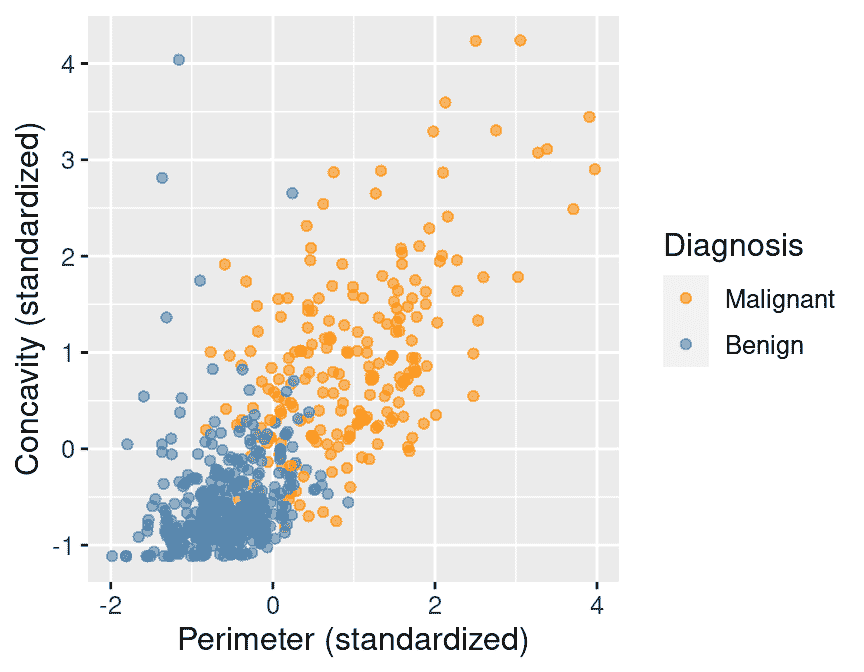

图 5.1：根据诊断标签着色的凹度与周长散点图。

在图 5.1 中，我们可以看到恶性观察值通常落在图表区域的右上角。相比之下，良性观察值通常落在图表的左下角。换句话说，良性观察值倾向于具有较低的凹度和周长值，而恶性观察值倾向于具有较大的值。假设我们获得了一个新的观察值，它不在当前数据集中，并且测量了所有变量（即没有医生对肿瘤类别的诊断的图像）。我们可以计算标准化的周长和凹度值，结果可能是 1 和 1\. 我们能否使用这些信息将该观察值分类为良性或恶性？根据散点图，你如何对该新观察值进行分类？如果标准化的凹度和周长值分别是 1 和 1，那么该点将位于恶性点的橙色云团的中间，因此我们可能将其分类为恶性。根据我们的可视化，似乎可以准确预测具有未知诊断的肿瘤图像的 `Class` 变量（即诊断）。

## 5.5 使用 K 近邻进行分类

为了在实际中对新观察值进行预测，我们需要一个分类算法。在这本书中，我们将使用 K 近邻分类算法。为了预测新观察值的标签（在此处将其分类为良性或恶性），K 近邻分类器通常在训练集中找到 $K$ 个“最近”或“最相似”的观察值，然后使用它们的诊断来对新观察值的诊断进行预测。$K$ 是我们必须提前选择的数字；现在，我们假设有人已经为我们选择了 $K$。我们将在下一章中介绍如何自己选择 $K$。

为了说明 K 近邻分类的概念，我们将通过一个例子来讲解。假设我们有一个新的观测值，其标准化周长为 2，标准化凹度为 4，其诊断“类别”未知。这个新的观测值在图 5.2 中用红色、菱形点表示。


图 5.2：凹度与周长之间的散点图，新的观测值用一个红色菱形表示。

图 5.3 显示，这个新观测值最近的点是 **恶性**，坐标为 (2.1, 3.6)。这里的想法是，如果一个点在散点图中接近另一个点，那么它们的周长和凹度值相似，因此我们可能期望它们会有相同的诊断。


图 5.3：凹度与周长之间的散点图。新的观测值用一个红色菱形表示，并有一条线指向最近的邻居，该邻居具有恶性的标签。

假设我们有一个新的观测值，其标准化周长为 0.2，凹度为 3.3。查看图 5.4 中的散点图，你会如何分类这个红色、菱形的观测值？这个新点的最近邻是一个位于 (0.2, 2.7) 的 **良性** 观测值。考虑到其他附近的点，这个预测看起来正确吗？可能不正确。

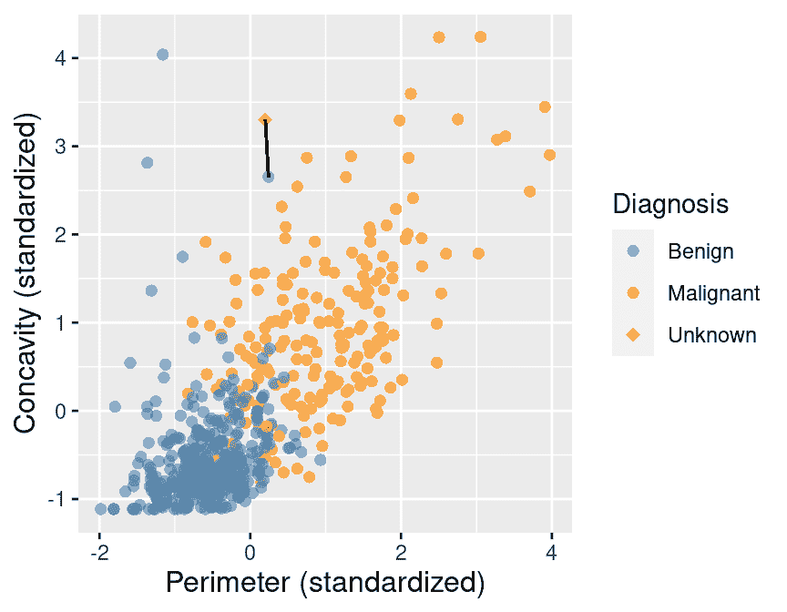

图 5.4：凹度与周长之间的散点图。新的观测值用一个红色菱形表示，并有一条线指向最近的邻居，该邻居具有良性的标签。

为了提高预测的准确性，我们可以考虑几个邻近的点，比如 $K = 3$，这些点距离新的观测值最近，以预测其诊断类别。在这三个最近点中，我们使用 *多数类别* 作为对新观测值的预测。如图 5.5 所示，我们看到我们的新观测值最近的三个邻居中有两个的诊断为恶性。因此，我们进行多数投票，并将新的红色、菱形观测值分类为恶性。


图 5.5：凹度与周长之间的散点图，以及三个最近邻点。

在这里，我们选择了 $K=3$ 个最近的观测，但 $K=3$ 没有什么特殊之处。我们也可以使用 $K=4, 5$ 或更多（尽管我们可能希望选择一个奇数以避免平局）。我们将在下一章中更详细地讨论如何选择 $K$。

### 5.5.1 点之间的距离

我们决定哪些点是相对于我们的新观测最近的 $K$ 个，使用的是*直线距离*（我们通常只称之为*距离*）。假设我们有两个观测 $a$ 和 $b$，每个观测都有两个预测变量，$x$ 和 $y$。用 $a_x$ 和 $a_y$ 表示观测 $a$ 的变量 $x$ 和 $y$ 的值；$b_x$ 和 $b_y$ 对于观测 $b$ 有类似的定义。那么，在 x-y 平面上观测 $a$ 和 $b$ 之间的直线距离可以使用以下公式计算：

$$距离 = \sqrt{(a_x -b_x)² + (a_y - b_y)²}$$

为了找到新观测的 $K$ 个最近邻，我们计算新观测到训练数据中每个观测的距离，并选择与 $K$ 个*最小*距离值对应的 $K$ 个观测。例如，假设我们想使用 $K=5$ 个邻居来分类周长为 0 且凸度为 3.5 的新观测，如图 5.6 中的红色菱形所示。让我们计算新点与训练集中每个观测之间的距离，以找到最近的 $K=5$ 个邻居。你将在下面的 `mutate` 步骤中看到，我们使用上述公式计算直线距离：我们将两个观测的周长和凸度坐标之间的差异平方，然后相加，并取平方根。为了找到 $K=5$ 个最近邻，我们将使用 `slice_min` 函数。

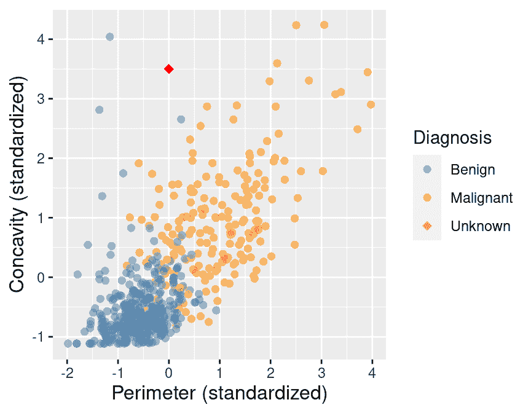

图 5.6：凸度与周长的散点图，新观测用红色菱形表示。

```r
new_obs_Perimeter <- 0
new_obs_Concavity <- 3.5
cancer |>
 select(ID, Perimeter, Concavity, Class) |>
 mutate(dist_from_new = sqrt((Perimeter - new_obs_Perimeter)² +
 (Concavity - new_obs_Concavity)²)) |>
 slice_min(dist_from_new, n = 5) # take the 5 rows of minimum distance
```

```r
## # A tibble: 5 × 5
##        ID Perimeter Concavity Class     dist_from_new
##     <dbl>     <dbl>     <dbl> <fct>             <dbl>
## 1   86409     0.241      2.65 Benign            0.881
## 2  887181     0.750      2.87 Malignant         0.980
## 3  899667     0.623      2.54 Malignant         1.14 
## 4  907914     0.417      2.31 Malignant         1.26 
## 5 8710441    -1.16       4.04 Benign            1.28
```

在表 5.1 中，我们详细展示了如何使用 `mutate` 步骤来计算训练数据中每个最近邻的 `dist_from_new` 变量（即到新观测的距离）。

表 5.1：评估新观测点到其 5 个最近邻的距离

| 周长 | 凸度 | 距离 | 类别 |
| --- | --- | --- | --- |
| 0.24 | 2.65 | $\sqrt{(0 - 0.24)² + (3.5 - 2.65)²} = 0.88$ | 良性 |
| 0.75 | 2.87 | $\sqrt{(0 - 0.75)² + (3.5 - 2.87)²} = 0.98$ | 恶性 |
| 0.62 | 2.54 | $\sqrt{(0 - 0.62)² + (3.5 - 2.54)²} = 1.14$ | 恶性 |
| 0.42 | 2.31 | $\sqrt{(0 - 0.42)² + (3.5 - 2.31)²} = 1.26$ | 恶性 |
| -1.16 | 4.04 | $\sqrt{(0 - (-1.16))² + (3.5 - 4.04)²} = 1.28$ | 良性 |

这个计算的结果显示，我们新观测值的 5 个最近邻中有 3 个是恶性的；由于这是多数，我们将我们的新观测值分类为恶性。这 5 个邻居在图 5.7 中被圈出。

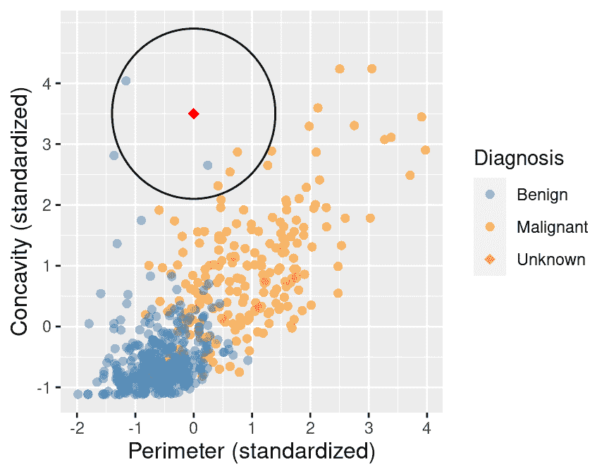

图 5.7：凹度与周长的散点图，周围圈出了 5 个最近邻。

### 5.5.2 多于两个解释变量

虽然上述描述是针对两个预测变量，但当你有更多预测变量时，完全相同的 K 近邻算法同样适用。每个预测变量都可能提供新的信息来帮助我们创建分类器。唯一的区别是点之间距离的公式。假设我们有两个观测值 $a$ 和 $b$ 的 $m$ 个预测变量，即 $a = (a_{1}, a_{2}, \dots, a_{m})$ 和 $b = (b_{1}, b_{2}, \dots, b_{m})$。

距离公式变为

$$\mathrm{Distance} = \sqrt{(a_{1} -b_{1})² + (a_{2} - b_{2})² + \dots + (a_{m} - b_{m})²}.$$

这个公式仍然对应于直线距离，只是在更高维度的空间中。假设我们想要计算一个周长为 0、凹度为 3.5、对称度为 1 的新观测值与另一个周长、凹度和对称度分别为 0.417、2.31 和 0.837 的观测值之间的距离。我们有两个具有三个预测变量（周长、凹度和对称度）的观测值。之前，当我们有两个变量时，我们计算了每个（两个）变量之间的平方差的和，然后取平方根。现在我们将做同样的事情，只是对于我们的三个变量。我们计算距离如下

$$\mathrm{Distance} =\sqrt{(0 - 0.417)² + (3.5 - 2.31)² + (1 - 0.837)²} = 1.27.$$

让我们计算新观测值与训练集中每个观测值之间的距离，以找到当有三个预测变量时 $K=5$ 的最近邻。

```r
new_obs_Perimeter <- 0
new_obs_Concavity <- 3.5
new_obs_Symmetry <- 1
cancer |>
 select(ID, Perimeter, Concavity, Symmetry, Class) |>
 mutate(dist_from_new = sqrt((Perimeter - new_obs_Perimeter)² +
 (Concavity - new_obs_Concavity)² +
 (Symmetry - new_obs_Symmetry)²)) |>
 slice_min(dist_from_new, n = 5) # take the 5 rows of minimum distance
```

```r
## # A tibble: 5 × 6
##         ID Perimeter Concavity Symmetry Class     dist_from_new
##      <dbl>     <dbl>     <dbl>    <dbl> <fct>             <dbl>
## 1   907914     0.417      2.31    0.837 Malignant          1.27
## 2 90439701     1.33       2.89    1.10  Malignant          1.47
## 3   925622     0.470      2.08    1.15  Malignant          1.50
## 4   859471    -1.37       2.81    1.09  Benign             1.53
## 5   899667     0.623      2.54    2.06  Malignant          1.56
```

基于这三个预测变量的 $K=5$ 个最近邻，我们将新观测值分类为恶性，因为 5 个最近邻中有 4 个来自恶性类别。图 5.8 展示了我们将这些数据可视化为三维散点图，并从新观测值到其五个最近邻画线的样子。

图 5.8：标准化对称性、凹度和周长变量的 3D 散点图。请注意，通常我们不建议使用 3D 可视化；这里我们仅以 3D 形式展示数据，以说明高维和最近邻的形态，供学习参考。

### 5.5.3 K 近邻算法总结

为了使用 K 近邻分类器对新观测值进行分类，我们必须执行以下操作：

1.  计算新观测值与训练集中每个观测值之间的距离。

1.  根据距离对数据表进行升序排序。

1.  选择排序表中排名前 $K$ 的行。

1.  根据邻近类别的多数投票来对新观测进行分类。

## 5.6 使用 `tidymodels` 的 K 近邻算法

在 R 中自己编写 K 近邻算法的代码可能会变得复杂，尤其是如果我们想要处理多个类别、超过两个变量，或者预测多个新观测的类别时。幸运的是，在 R 中，K 近邻算法已经在 `tidymodels` 包中实现，包括 [`parsnip` R 包](https://parsnip.tidymodels.org/) (Kuhn and Vaughan 2021)，以及你将在本书的此章节和未来章节中遇到的许多其他模型。`tidymodels` 集合提供了帮助构建和使用模型（如分类器）的工具。使用这个集合中的包将有助于使我们的代码简单、可读和准确；我们编写的代码越少，我们可能犯的错误就越少。我们首先通过加载 `tidymodels` 开始。

```r
library(tidymodels)
```

让我们通过 `tidymodels` 如何执行 K 近邻分类来一步步说明。我们将使用上面的 `cancer` 数据集，以周长和凹凸性作为预测变量，并使用 $K = 5$ 个邻居来构建我们的分类器。然后我们将使用这个分类器来预测一个新观测的周长为 0、凹凸性为 3.5 且诊断标签未知的诊断标签。让我们挑选出我们想要的两个预测变量和类别标签，并将它们存储在一个名为 `cancer_train` 的新数据集中：

```r
cancer_train <- cancer |>
 select(Class, Perimeter, Concavity)
cancer_train
```

```r
## # A tibble: 569 × 3
##    Class     Perimeter Concavity
##    <fct>         <dbl>     <dbl>
##  1 Malignant    1.27      2.65  
##  2 Malignant    1.68     -0.0238
##  3 Malignant    1.57      1.36  
##  4 Malignant   -0.592     1.91  
##  5 Malignant    1.78      1.37  
##  6 Malignant   -0.387     0.866 
##  7 Malignant    1.14      0.300 
##  8 Malignant   -0.0728    0.0610
##  9 Malignant   -0.184     1.22  
## 10 Malignant   -0.329     1.74  
## # ℹ 559 more rows
```

接下来，我们通过调用 `nearest_neighbor` 函数创建一个 K 近邻分类的 *模型规范*，指定我们想要使用 $K = 5$ 个邻居（我们将在下一章讨论如何选择 $K$），并且每个邻近点在投票时应该具有相同的权重（`weight_func = "rectangular"`）。`weight_func` 参数控制邻居在分类新观测时如何投票；将其设置为 `"rectangular"`，则每个最近的 $K$ 个邻居将获得上述描述中的确切 1 票。其他选择，其中每个邻居的投票权重不同，可以在 [`parsnip` 网站上找到](https://parsnip.tidymodels.org/reference/nearest_neighbor.html)。在 `set_engine` 参数中，我们指定将用于训练模型的包或系统。在这里，`kknn` 是我们将用于执行 K 近邻分类的 R 包。最后，我们通过 `set_mode` 函数指定这是一个分类问题。

```r
knn_spec <- nearest_neighbor(weight_func = "rectangular", neighbors = 5) |>
 set_engine("kknn") |>
 set_mode("classification")
knn_spec
```

```r
## K-Nearest Neighbor Model Specification (classification)
## 
## Main Arguments:
##   neighbors = 5
##   weight_func = rectangular
## 
## Computational engine: kknn
```

为了在乳腺癌数据上拟合模型，我们需要将模型规范和数据集传递给 `fit` 函数。我们还需要指定要使用哪些变量作为预测变量以及要使用哪个变量作为响应变量。下面，`Class ~ Perimeter + Concavity` 参数指定 `Class` 是响应变量（我们想要预测的那个），而 `Perimeter` 和 `Concavity` 都将用作预测变量。

```r
knn_fit <- knn_spec |>
 fit(Class ~ Perimeter + Concavity, data = cancer_train)
```

我们还可以使用一个方便的缩写语法，使用点号，`Class ~ .`，来表示我们想要在模型中使用除`Class`之外的所有变量作为预测因子。在这个特定的设置中，由于`Concavity`和`Perimeter`是`cancer_train`数据框中唯一的两个预测因子，`Class ~ Perimeter + Concavity`和`Class ~ .`是等价的。一般来说，你可以使用`+`符号选择单个预测因子，或者你可以使用`.`符号指定使用**所有**预测因子。

```r
knn_fit <- knn_spec |>
 fit(Class ~ ., data = cancer_train)
knn_fit
```

```r
## parsnip model object
## 
## 
## Call:
## kknn::train.kknn(formula = Class ~ ., data = data, ks = min_rows(5,     data, 5)
## , kernel = ~"rectangular")
## 
## Type of response variable: nominal
## Minimal misclassification: 0.07557118
## Best kernel: rectangular
## Best k: 5
```

在这里，你可以看到最终的训练模型摘要。它确认用于训练模型的计算引擎是`kknn::train.kknn`。它还显示了 K 最近邻模型犯错的比率，但我们现在将忽略它，并在下一章中更详细地讨论。最后，它（有些令人困惑地）显示“最佳”权重函数是“矩形”和“最佳”的$K$设置是 5；但因为我们之前已经指定了这些，所以 R 只是在这里重复那些设置。在下一章中，我们将实际上让 R 为我们找到$K$的值。

最后，我们通过调用`predict`函数，传递我们刚刚创建的拟合对象以及新的观察本身，对新观察进行预测。如上所述，当我们手动运行 K 最近邻分类算法时，`knn_fit`对象将新观察分类为恶性。请注意，`predict`函数输出一个包含单个变量名为`.pred_class`的数据框。

```r
new_obs <- tibble(Perimeter = 0, Concavity = 3.5)
predict(knn_fit, new_obs)
```

```r
## # A tibble: 1 × 1
##   .pred_class
##   <fct>      
## 1 Malignant
```

这个预测的恶性标签是否是这一观察的实际类别？嗯，我们不知道，因为我们没有这个观察的诊断——这正是我们试图预测的内容！分类器的预测并不一定正确，但在下一章中，我们将学习如何量化我们认为我们的预测有多准确。

## 5.7 使用`tidymodels`进行数据预处理

### 5.7.1 中心化和缩放

当使用 K 最近邻分类时，每个变量的**尺度**（即其大小和值域）很重要。由于分类器通过识别最近的观察来预测类别，任何具有大尺度的变量将比具有小尺度的变量有更大的影响。但仅仅因为一个变量具有大尺度**并不意味着**它在做出准确预测时更重要。例如，假设你有一个包含两个特征的数据集，工资（以美元计）和受教育年限，你想预测相应的职业类型。当我们计算邻近距离时，1000 美元的差异与 10 年教育年限的差异相比是巨大的。但对我们概念理解和解决问题的回答来说，情况正好相反；10 年的教育年限与年薪 1000 美元的差异相比是巨大的！

在许多其他预测模型中，每个变量的*中心*（例如，其均值）也很重要。例如，如果我们有一个以开尔文度测量的温度变量，以及同一个数据集以摄氏度测量的温度，这两个变量将相差一个常数偏移量 273（尽管它们包含的信息完全相同）。同样，在我们的假设职业分类示例中，我们可能会看到工资变量的中心在数万之间，而教育年数的中心在个位数。尽管这不会影响 K 最近邻分类算法，但这种大的偏移量可能会改变使用许多其他预测模型的结果。

为了缩放和居中我们的数据，我们需要找到变量的*均值*（平均数，它量化了一组数字的“中心”值）和*标准差*（一个量化值分布情况的数字）。对于变量的每个观测值，我们减去均值（即居中变量）并除以标准差（即缩放变量）。当我们这样做时，数据就被说成是*标准化*的，并且数据集中的所有变量都将具有均值为 0 和标准差为 1。为了说明标准化对 K 最近邻算法的影响，我们将读取原始的、未标准化的威斯康星州乳腺癌数据集；直到现在，我们一直在使用该数据集的标准化版本。和之前一样，我们将`Class`变量转换为因子类型，并将值重命名为“Malignant”和“Benign”。为了简化问题，我们只使用`Area`、`Smoothness`和`Class`变量：

```r
unscaled_cancer <- read_csv("data/wdbc_unscaled.csv") |>
 mutate(Class = as_factor(Class)) |>
 mutate(Class = fct_recode(Class, "Benign" = "B", "Malignant" = "M")) |>
 select(Class, Area, Smoothness)
unscaled_cancer
```

```r
## # A tibble: 569 × 3
##    Class      Area Smoothness
##    <fct>     <dbl>      <dbl>
##  1 Malignant 1001      0.118 
##  2 Malignant 1326      0.0847
##  3 Malignant 1203      0.110 
##  4 Malignant  386\.     0.142 
##  5 Malignant 1297      0.100 
##  6 Malignant  477\.     0.128 
##  7 Malignant 1040      0.0946
##  8 Malignant  578\.     0.119 
##  9 Malignant  520\.     0.127 
## 10 Malignant  476\.     0.119 
## # ℹ 559 more rows
```

观察上面未缩放和未居中的数据，你可以看到面积测量值之间的差异远大于平滑度测量值之间的差异。这会影响预测结果吗？为了找出答案，我们将为这两种预测因子（按诊断结果着色）创建散点图，包括我们刚刚加载的未标准化数据和该数据的标准化版本。但首先，我们需要使用`tidymodels`对`unscaled_cancer`数据集进行标准化。

在`tidymodels`框架中，所有数据预处理都使用来自[`recipes` R 包](https://recipes.tidymodels.org/)（Kuhn and Wickham 2021）的`recipe`。在这里，我们将初始化一个针对上面提到的`unscaled_cancer`数据集的 recipe，指定`Class`变量是响应变量，所有其他变量都是预测变量：

```r
uc_recipe <- recipe(Class ~ ., data = unscaled_cancer)
uc_recipe
```

```r
## 
## ── Recipe ──────────
## 
## ── Inputs 
## Number of variables by role
## outcome:   1
## predictor: 2
```

到目前为止，配方中还没有太多内容；只是关于响应变量和预测变量的数量声明。让我们为所有预测变量添加缩放（`step_scale`）和居中（`step_center`）步骤，以便它们各自具有均值为 0 和标准差为 1。请注意，`tidyverse` 实际上提供了 `step_normalize`，它可以在单个配方步骤中同时进行居中和缩放；在这本书中，我们将保持 `step_scale` 和 `step_center` 分开，以强调概念上存在两个步骤。`prep` 函数通过使用数据（在这里，`unscaled_cancer`）来计算运行配方所需的所有必要内容（在这种情况下，列均值和标准差）来最终确定配方：

```r
uc_recipe <- uc_recipe |>
 step_scale(all_predictors()) |>
 step_center(all_predictors()) |>
 prep()
uc_recipe
```

```r
## 
## ── Recipe ──────────
## 
## ── Inputs 
## Number of variables by role
## outcome:   1
## predictor: 2
## 
## ── Training information 
## Training data contained 569 data points and no incomplete rows.
## 
## ── Operations 
## • Scaling for: Area, Smoothness | Trained
## • Centering for: Area, Smoothness | Trained
```

现在，你可以看到配方包括对所有预测变量的缩放和居中步骤。请注意，当你向配方添加步骤时，你必须指定要应用步骤的列。在这里，我们使用了 `all_predictors()` 函数来指定每个步骤应应用于所有预测变量。然而，这里可以使用许多不同的参数，以及使用与 `select` 函数相同的语法命名特定的列。例如：

+   `all_nominal()` 和 `all_numeric()`: 指定所有分类变量或所有数值变量

+   `all_predictors()` 和 `all_outcomes()`: 指定所有预测变量或所有响应变量

+   `面积, 平滑度`: 指定 `面积` 和 `平滑度` 变量

+   `-类别`: 指定除 `类别` 变量之外的所有内容

你可以在 `recipes` 参考页面上找到所有步骤和变量选择函数的完整集合（[recipes reference page](https://recipes.tidymodels.org/reference/index.html)）。

在这一点上，我们已经根据输入到配方中的数据计算了所需的统计量，但数据尚未进行缩放和居中。要实际缩放和居中数据，我们需要将 `bake` 函数应用于未缩放的数据。

```r
scaled_cancer <- bake(uc_recipe, unscaled_cancer)
scaled_cancer
```

```r
## # A tibble: 569 × 3
##      Area Smoothness Class    
##     <dbl>      <dbl> <fct>    
##  1  0.984      1.57  Malignant
##  2  1.91      -0.826 Malignant
##  3  1.56       0.941 Malignant
##  4 -0.764      3.28  Malignant
##  5  1.82       0.280 Malignant
##  6 -0.505      2.24  Malignant
##  7  1.09      -0.123 Malignant
##  8 -0.219      1.60  Malignant
##  9 -0.384      2.20  Malignant
## 10 -0.509      1.58  Malignant
## # ℹ 559 more rows
```

我们必须同时进行 `bake` 和 `prep` 来缩放和居中数据，这看起来可能有些多余。然而，我们分两步进行这样做，以便如果我们想的话，可以在 `bake` 步骤中指定不同的数据集。例如，我们可能想要指定不属于训练集的新数据。

你可能会想知道我们为什么要做这么多工作来对变量进行居中和缩放。我们难道不能在构建 K 近邻模型之前手动对 `Area` 和 `Smoothness` 变量进行缩放和居中吗？技术上*是的*；但这样做是容易出错的。特别是，我们可能会在做出预测时意外忘记应用相同的居中和缩放，或者意外应用与我们训练时使用的不同的居中和缩放。正确使用 `recipe` 有助于保持我们的代码简单、可读且无错误。此外，请注意，只有在你想亲自检查预处理步骤的结果时才需要使用 `prep` 和 `bake`。你将在第 5.8 节中进一步看到，`tidymodels` 提供了工具，可以在无需额外编码努力的情况下自动应用 `prep` 和 `bake`。

图 5.9 展示了两个并排的散点图——一个用于 `unscaled_cancer`，另一个用于 `scaled_cancer`。每个图都有用其 $K=3$ 个最近邻标注的新观测值。在原始未标准化数据图中，你可以看到三个最近邻的选择有些奇怪。特别是，“邻居”在良性观测值的云团中视觉上非常接近，并且邻居都与新观测值几乎垂直对齐（这就是为什么在这个图表上看起来只有一条黑色线的原因）。图 5.10 展示了未标准化图上该区域的特写。在这里，最近邻的计算主要由更大的规模变量域主导。图 5.9 中右侧的标准化数据图显示了最近邻选择的更直观合理的选取。因此，当我们使用预测算法时，标准化数据可以以重要方式改变事物。在预测建模之前，你应该将数据标准化作为预处理的一部分，并且你应该始终仔细思考你的问题域以及你是否需要标准化你的数据。

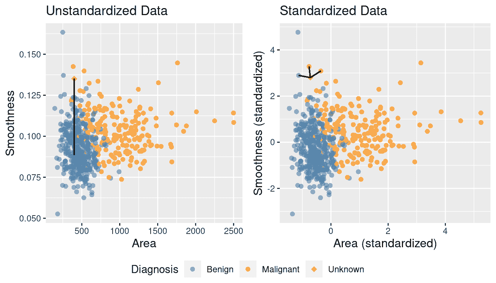

图 5.9：未标准化和标准化数据中 K = 3 个最近邻的比较。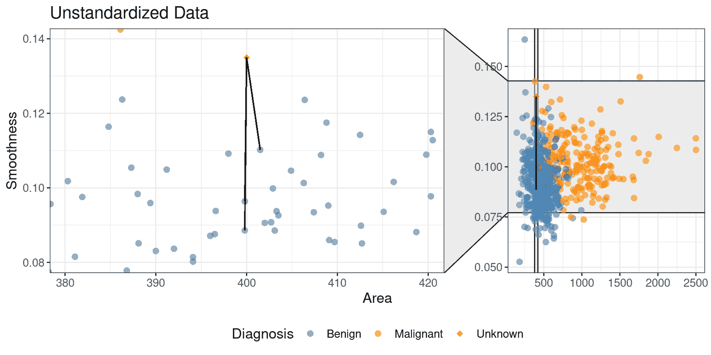

图 5.10：未标准化数据中三个最近邻的特写。

### 5.7.2 平衡

对于分类器的数据集，另一个潜在问题是**类别不平衡**，即当一个标签比另一个标签更常见时。由于像 K 最近邻算法这样的分类器使用附近点的标签来预测新点的标签，如果整体上具有一个标签的数据点比另一个标签多得多，那么算法更有可能在一般情况下选择那个标签（即使数据“模式”表明否则）。类别不平衡实际上是一个相当常见且重要的问题：从罕见疾病的诊断到恶意电子邮件检测，有许多情况中，“重要”的类别（疾病的存在，恶意电子邮件）比“不重要”的类别（无疾病，正常电子邮件）要少得多。

为了更好地说明问题，让我们重新审视缩放后的乳腺癌数据，`cancer`；但现在我们将删除许多恶性肿瘤的观察数据，模拟如果癌症很少见的数据看起来会是什么样子。我们将通过只从恶性组中选择 3 个观察数据，并保留所有良性观察数据来实现这一点。我们使用`slice_head`函数选择这些 3 个观察数据，该函数接受两个参数：一个类似数据框的对象，以及从顶部选择行数（`n`）。我们将使用`bind_rows`函数将两个结果过滤后的数据框粘合在一起，并将结果命名为`rare_cancer`。新的不平衡数据在图 5.11 中显示。

```r
rare_cancer <- bind_rows(
 filter(cancer, Class == "Benign"),
 cancer |> filter(Class == "Malignant") |> slice_head(n = 3)
 ) |>
 select(Class, Perimeter, Concavity)

rare_plot <- rare_cancer |>
 ggplot(aes(x = Perimeter, y = Concavity, color = Class)) +
 geom_point(alpha = 0.5) +
 labs(x = "Perimeter (standardized)",
 y = "Concavity (standardized)",
 color = "Diagnosis") +
 scale_color_manual(values = c("darkorange", "steelblue")) +
 theme(text = element_text(size = 12))

rare_plot
```

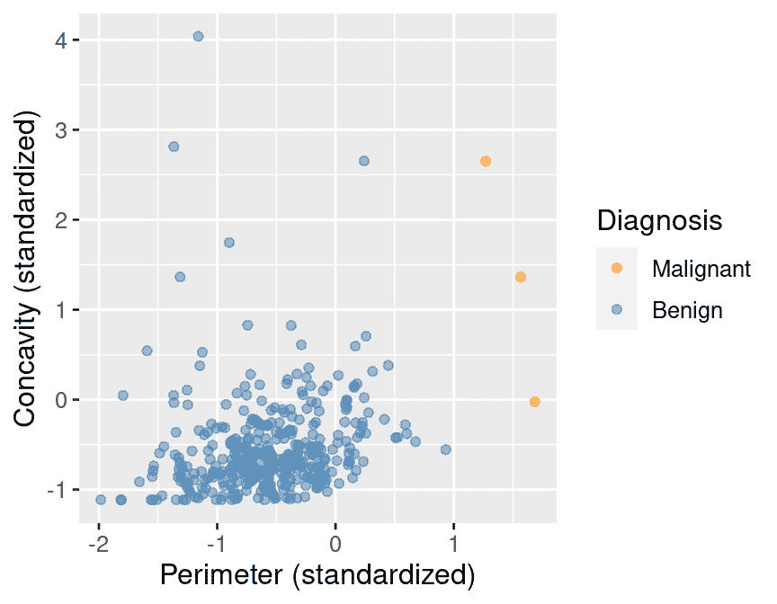

图 5.11：不平衡数据。

假设我们现在决定在 K 最近邻分类中使用 $K = 7$。由于只有 3 个恶性肿瘤的观察数据，分类器将**总是预测肿瘤为良性，无论其凹度和周长如何**！这是因为在一个由 7 个观察数据组成的多数投票中，最多只有 3 个是恶性的（我们总共只有 3 个恶性观察数据），所以至少有 4 个必须是良性的，良性投票总是获胜。例如，图 5.12 展示了对于一个新的肿瘤观察数据，它非常接近训练数据中标记为恶性的三个观察数据。

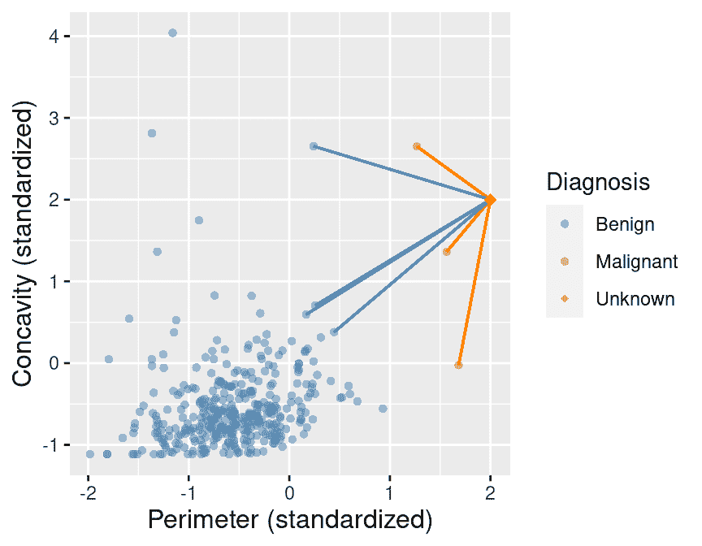

图 5.12：不平衡数据，突出显示新观察点附近的 7 个最近邻。

图 5.13 展示了如果我们将图中每个区域的背景颜色设置为 K 最近邻分类器对新观察点的预测，会发生什么。我们可以看到决策总是“良性”，对应蓝色。

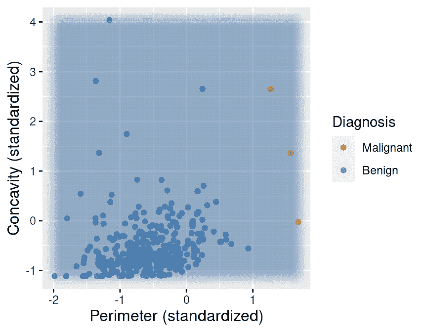

图 5.13：不平衡数据，背景颜色表示分类器的决策，点代表标记的数据。

尽管问题简单，但以统计上可靠的方式解决它实际上相当复杂，并且需要比我们在本教材中涵盖的更多细节和数学。就目前目的而言，通过*过采样*稀有类别来重新平衡数据就足够了。换句话说，我们将多次复制数据集中的稀有观测，以在 K 最近邻算法中赋予它们更多的投票权。为了做到这一点，我们将向早期的`uc_recipe`食谱中添加一个过采样步骤，使用来自`themis`R 包的`step_upsample`函数。我们下面将展示如何做到这一点，并使用`group_by`和`summarize`函数来查看我们的类别现在是否平衡：

```r
library(themis)

ups_recipe <- recipe(Class ~ ., data = rare_cancer) |>
 step_upsample(Class, over_ratio = 1, skip = FALSE) |>
 prep()

ups_recipe
```

```r
## 
## ── Recipe ──────────
## 
## ── Inputs 
## Number of variables by role
## outcome:   1
## predictor: 2
## 
## ── Training information 
## Training data contained 360 data points and no incomplete rows.
## 
## ── Operations 
## • Up-sampling based on: Class | Trained
```

```r
upsampled_cancer <- bake(ups_recipe, rare_cancer)

upsampled_cancer |>
 group_by(Class) |>
 summarize(n = n())
```

```r
## # A tibble: 2 × 2
##   Class         n
##   <fct>     <int>
## 1 Malignant   357
## 2 Benign      357
```

现在假设我们使用 K=7 在这个*平衡*数据上训练我们的 K 最近邻分类器。图 5.14 显示了现在当我们将散点图每个区域的背景颜色设置为 K 最近邻分类器将做出的决策时会发生什么。我们可以看到决策更加合理；当点接近标记为恶性的点时，分类器预测为恶性肿瘤，反之亦然，当它们更接近良性肿瘤观测点时。

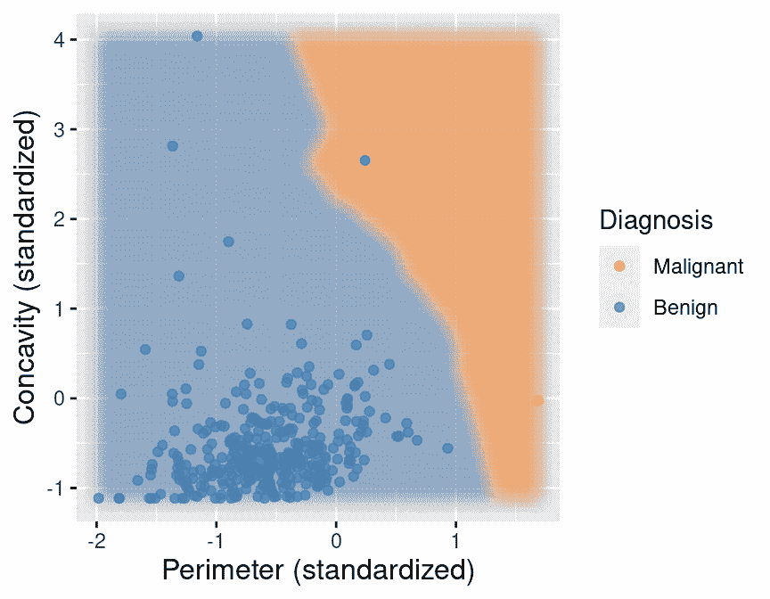

图 5.14：通过背景颜色表示分类器决策的上采样数据。

### 5.7.3 缺失数据

在野外真实数据集中最常见的问题之一是*缺失数据*，即某些变量的值未被记录的观测。不幸的是，尽管它很常见，但正确处理缺失数据非常具有挑战性，通常依赖于对数据、设置以及数据收集方式的专家知识。处理缺失数据的一个典型挑战是缺失条目可能包含*信息*：一个条目缺失的事实与其它变量的值相关。例如，来自边缘化群体的调查参与者可能不太可能回答某些类型的提问，如果他们担心诚实地回答会带来负面后果。在这种情况下，如果我们简单地丢弃包含缺失条目的数据，我们就会通过无意中移除许多该群体受访者而使调查的结论产生偏差。因此，在现实问题中忽视这个问题很容易导致误导性的分析，产生有害的影响。在这本书中，我们将仅介绍在缺失条目只是“随机缺失”的情况下处理缺失条目的技术，即缺失条目的事实*与观察的其他任何方面无关*。

让我们加载并检查一个经过修改的肿瘤图像数据子集，该子集中有几个缺失条目：

```r
missing_cancer <- read_csv("data/wdbc_missing.csv") |>
 select(Class, Radius, Texture, Perimeter) |>
 mutate(Class = as_factor(Class)) |>
 mutate(Class = fct_recode(Class, "Malignant" = "M", "Benign" = "B"))
missing_cancer
```

```r
## # A tibble: 7 × 4
##   Class     Radius Texture Perimeter
##   <fct>      <dbl>   <dbl>     <dbl>
## 1 Malignant NA      NA         1.27 
## 2 Malignant  1.83   -0.353     1.68 
## 3 Malignant  1.58   NA         1.57 
## 4 Malignant -0.768   0.254    -0.592
## 5 Malignant  1.75   -1.15      1.78 
## 6 Malignant -0.476  -0.835    -0.387
## 7 Malignant  1.17    0.161     1.14
```

回想一下，K-最近邻分类通过计算到附近训练观测值的直线距离来进行预测，因此需要访问训练数据中所有观测值的*所有*变量的值。那么，在存在缺失数据的情况下，我们如何执行 K-最近邻分类呢？嗯，由于缺失条目的观测值并不多，一个选项是在构建 K-最近邻分类器之前简单地删除这些观测值。我们可以通过在处理数据之前使用`tidyverse`中的`drop_na`函数来完成这项工作。

```r
no_missing_cancer <- missing_cancer |> drop_na()
no_missing_cancer
```

```r
## # A tibble: 5 × 4
##   Class     Radius Texture Perimeter
##   <fct>      <dbl>   <dbl>     <dbl>
## 1 Malignant  1.83   -0.353     1.68 
## 2 Malignant -0.768   0.254    -0.592
## 3 Malignant  1.75   -1.15      1.78 
## 4 Malignant -0.476  -0.835    -0.387
## 5 Malignant  1.17    0.161     1.14
```

然而，当许多行存在缺失条目时，这种策略将不会奏效，因为我们可能会丢弃过多的数据。在这种情况下，另一种可能的方法是对缺失条目进行*插补*，即根据数据集中其他观测值填充合成值。一个合理的选择是执行*均值插补*，即使用每个变量现有条目的平均值来填充缺失条目。要执行均值插补，我们需要将`step_impute_mean`步骤添加到`tidymodels`预处理配方中。

```r
impute_missing_recipe <- recipe(Class ~ ., data = missing_cancer) |>
 step_impute_mean(all_predictors()) |>
 prep()
impute_missing_recipe
```

```r
## 
## ── Recipe ──────────
## 
## ── Inputs 
## Number of variables by role
## outcome:   1
## predictor: 3
## 
## ── Training information 
## Training data contained 7 data points and 2 incomplete rows.
## 
## ── Operations 
## • Mean imputation for: Radius, Texture, Perimeter | Trained
```

为了可视化均值插补的效果，让我们直接使用`bake`函数将配方应用于`missing_cancer`数据框。插补步骤使用相应变量的平均值填充缺失条目。

```r
imputed_cancer <- bake(impute_missing_recipe, missing_cancer)
imputed_cancer
```

```r
## # A tibble: 7 × 4
##   Radius Texture Perimeter Class    
##    <dbl>   <dbl>     <dbl> <fct>    
## 1  0.847  -0.385     1.27  Malignant
## 2  1.83   -0.353     1.68  Malignant
## 3  1.58   -0.385     1.57  Malignant
## 4 -0.768   0.254    -0.592 Malignant
## 5  1.75   -1.15      1.78  Malignant
## 6 -0.476  -0.835    -0.387 Malignant
## 7  1.17    0.161     1.14  Malignant
```

在[recipes 文档](https://recipes.tidymodels.org/reference/index.html)中可以找到许多其他缺失数据插补的选项。然而，无论你决定如何处理数据分析中的缺失数据，始终都要批判性地思考设置、数据的收集方式以及你正在回答的问题。

## 5.8 在`workflow`中组合

`tidymodels`包集合还提供了`workflow`，这是一种将多个数据分析步骤链接在一起的方法，而不需要大量其他中间步骤的代码。为了说明整个流程，让我们从`wdbc_unscaled.csv`数据从头开始。首先，我们将加载数据，创建一个模型，并指定一个配方来定义数据应该如何预处理：

```r
# load the unscaled cancer data
# and make sure the response variable, Class, is a factor
unscaled_cancer <- read_csv("data/wdbc_unscaled.csv") |>
 mutate(Class = as_factor(Class)) |>
 mutate(Class = fct_recode(Class, "Malignant" = "M", "Benign" = "B"))

# create the K-NN model
knn_spec <- nearest_neighbor(weight_func = "rectangular", neighbors = 7) |>
 set_engine("kknn") |>
 set_mode("classification")

# create the centering / scaling recipe
uc_recipe <- recipe(Class ~ Area + Smoothness, data = unscaled_cancer) |>
 step_scale(all_predictors()) |>
 step_center(all_predictors())
```

注意，这些步骤与之前完全相同，只有一个主要区别：我们没有使用`select`函数从数据框中提取相关变量，而是通过配方中的公式`Class ~ Area + Smoothness`（而不是`Class ~ .`）简单地指定了要使用的相关变量。你也会注意到我们没有在配方上调用`prep()`；当它放在工作流程中时，这是不必要的。

我们现在将使用`add_recipe`和`add_model`函数将这些步骤放入一个`工作流程`中，最后我们将使用`fit`函数在`unscaled_cancer`数据上运行整个工作流程。注意这里与之前的一个不同点：我们在`fit`函数中不包括公式。这同样是因为我们在配方中已经包含了公式，所以没有必要重新指定它：

```r
knn_fit <- workflow() |>
 add_recipe(uc_recipe) |>
 add_model(knn_spec) |>
 fit(data = unscaled_cancer)

knn_fit
```

```r
## ══ Workflow [trained] ══════════
## Preprocessor: Recipe
## Model: nearest_neighbor()
## 
## ── Preprocessor ──────────
## 2 Recipe Steps
## 
## • step_scale()
## • step_center()
## 
## ── Model ──────────
## 
## Call:
## kknn::train.kknn(formula = ..y ~ ., data = data, ks = min_rows(7,     data, 5), 
## kernel = ~"rectangular")
## 
## Type of response variable: nominal
## Minimal misclassification: 0.112478
## Best kernel: rectangular
## Best k: 7
```

与之前一样，fit 对象列出了训练模型的函数以及“最佳”的邻居数量和权重函数设置（目前，这些只是我们在创建`knn_spec`时手动选择的值）。但现在 fit 对象还包括有关整体工作流程的信息，包括中心化和缩放预处理步骤。换句话说，当我们使用`predict`函数与`knn_fit`对象对新观察结果进行预测时，它将首先将相同的配方步骤应用于新观察结果。作为一个例子，我们将预测两个新观察结果的类别标签：一个`Area = 500`和`Smoothness = 0.075`，另一个`Area = 1500`和`Smoothness = 0.1`。

```r
new_observation <- tibble(Area = c(500, 1500), Smoothness = c(0.075, 0.1))
prediction <- predict(knn_fit, new_observation)

prediction
```

```r
## # A tibble: 2 × 1
##   .pred_class
##   <fct>      
## 1 Benign     
## 2 Malignant
```

分类器预测第一个观察结果是良性的，而第二个是恶性的。图 5.15 展示了这个训练好的 K 最近邻模型将在大量新观察结果上做出的预测。尽管你现在已经看到过几次这样的彩色预测地图可视化，但我们没有包括生成它们的代码，因为这有点复杂。对于想要一个学习挑战的读者，我们现在将其包含在下面。基本思路是使用`expand.grid`函数创建一个合成新观察值的网格，预测每个的标签，并使用具有非常高的透明度（低`alpha`值）和大型点半径的彩色散点图来可视化预测。看看你是否能弄清楚每一行的作用！

> **注意：**理解此代码对于本教科书其余部分不是必需的。它包含在此处是为了那些想要在自己的数据分析中使用类似可视化的读者。

```r
# create the grid of area/smoothness vals, and arrange in a data frame
are_grid <- seq(min(unscaled_cancer$Area),
 max(unscaled_cancer$Area),
 length.out = 100)
smo_grid <- seq(min(unscaled_cancer$Smoothness),
 max(unscaled_cancer$Smoothness),
 length.out = 100)
asgrid <- as_tibble(expand.grid(Area = are_grid,
 Smoothness = smo_grid))

# use the fit workflow to make predictions at the grid points
knnPredGrid <- predict(knn_fit, asgrid)

# bind the predictions as a new column with the grid points
prediction_table <- bind_cols(knnPredGrid, asgrid) |>
 rename(Class = .pred_class)

# plot:
# 1\. the colored scatter of the original data
# 2\. the faded colored scatter for the grid points
wkflw_plot <-
 ggplot() +
 geom_point(data = unscaled_cancer,
 mapping = aes(x = Area,
 y = Smoothness,
 color = Class),
 alpha = 0.75) +
 geom_point(data = prediction_table,
 mapping = aes(x = Area,
 y = Smoothness,
 color = Class),
 alpha = 0.02,
 size = 5) +
 labs(color = "Diagnosis",
 x = "Area",
 y = "Smoothness") +
 scale_color_manual(values = c("darkorange", "steelblue")) +
 theme(text = element_text(size = 12))

wkflw_plot
```

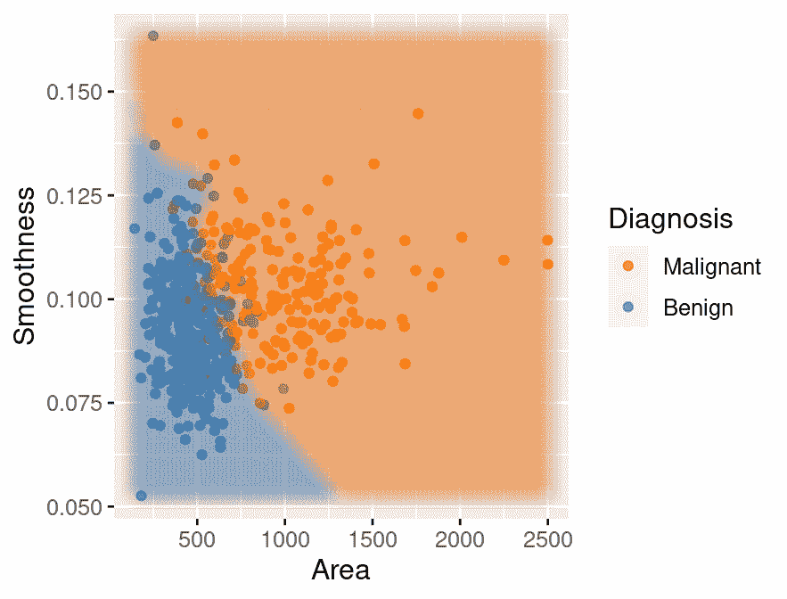

图 5.15：平滑度与面积散点图，其中背景颜色表示分类器的决策。

## 5.9 练习

本章涵盖的练习材料可以在“分类 I：训练和预测”行中的配套[工作表存储库](https://worksheets.datasciencebook.ca)中找到。您可以通过点击“启动绑定器”按钮在浏览器中启动工作表的交互式版本。您还可以通过点击“查看工作表”预览非交互式版本的工作表。如果您决定下载工作表并在自己的机器上运行，请确保遵循第十三章中找到的计算机设置说明。这将确保工作表提供的自动反馈和指导能够按预期工作。

### 参考文献

Cover, Thomas, 和 Peter Hart. 1967. “最近邻模式分类。” *IEEE 信息系统传输* 13 (1): 21–27. Fix, Evelyn, 和 Joseph Hodges. 1951. “判别分析。非参数判别：一致性属性。” 美国空军医学院，德克萨斯州兰道夫空军基地。Kuhn, Max, 和 David Vaughan. 2021. *parsnip R 包*. [`parsnip.tidymodels.org/`](https://parsnip.tidymodels.org/). Kuhn, Max, 和 Hadley Wickham. 2021. *recipes R 包*. [`recipes.tidymodels.org/`](https://recipes.tidymodels.org/). Stanford Health Care. 2021. “什么是癌症？” [`stanfordhealthcare.org/medical-conditions/cancer/cancer.html`](https://stanfordhealthcare.org/medical-conditions/cancer/cancer.html). Street, William Nick, William Wolberg, 和 Olvi Mangasarian. 1993. “用于乳腺癌诊断的核特征提取。” 在 *国际电子成像：科学和技术研讨会* 中。
