# 第六章 分类 II：评估与调整

> [`datasciencebook.ca/classification2.html`](https://datasciencebook.ca/classification2.html)

## 6.1 概述

本章继续介绍通过分类进行预测建模。虽然上一章涵盖了训练和数据预处理，但本章重点介绍如何评估分类器的性能，以及如何（如果可能）改进分类器以最大化其准确率。

## 6.2 章节学习目标

到本章结束时，读者将能够做到以下几点：

+   描述训练集、验证集和测试集是什么，以及它们在分类中的应用。

+   将数据分为训练集、验证集和测试集。

+   描述随机种子是什么，以及它在可重复数据分析中的重要性。

+   使用`set.seed`函数在 R 中设置随机种子。

+   描述并解释准确率、精确率、召回率和混淆矩阵。

+   使用测试集、单个验证集和交叉验证在 R 中评估分类准确率、精确率和召回率。

+   在 R 中生成混淆矩阵。

+   通过最大化估计的交叉验证准确率来选择 K 最近邻分类器中的邻居数量。

+   描述欠拟合和过拟合，并将其与 K 最近邻分类中的邻居数量联系起来。

+   描述 K 最近邻分类算法的优点和缺点。

## 6.3 评估性能

有时我们的分类器可能会做出错误的预测。虽然我们不希望分类器做出太多的错误预测，但分类器不需要 100%正确才能有用。我们如何衡量我们的分类器有多“好”？让我们回顾一下[威斯康星乳腺癌图像数据](https://archive.ics.uci.edu/ml/datasets/Breast+Cancer+Wisconsin+%28Diagnostic%29) (Street, Wolberg, 和 Mangasarian 1993)，并思考我们的分类器在实际应用中会如何使用。对一位新患者的肿瘤将进行活检，生成的图像将被分析，分类器将被要求判断肿瘤是良性还是恶性。这里的关键词是“新”：如果我们的分类器能够在训练期间未见过的数据上提供准确的预测，那么它就是“好”的，因为这表明它实际上已经了解了预测变量和响应变量之间的关系，而不是仅仅记住单个训练数据示例的标签。但是，我们如何在不访问医院收集更多肿瘤图像的情况下评估我们的分类器呢？

诀窍是将数据分为一个**训练集**和一个**测试集**（图 6.1），并在构建分类器时仅使用**训练集**。然后，为了评估分类器的性能，我们首先将**测试集**中的标签留出，然后使用分类器预测**测试集**中的标签。如果我们的预测与**测试集**中观察到的实际标签相匹配，那么我们有信心认为我们的分类器也可能准确地预测没有已知类别标签的新观察结果。

> **注意：** 如果机器学习有一个黄金法则，那可能就是：*你不能使用测试数据来构建模型!* 如果你这样做，模型会“看到”测试数据，使其看起来比实际情况更准确。想象一下，在预测患者肿瘤是恶性还是良性时，高估分类器的准确性会有多糟糕！

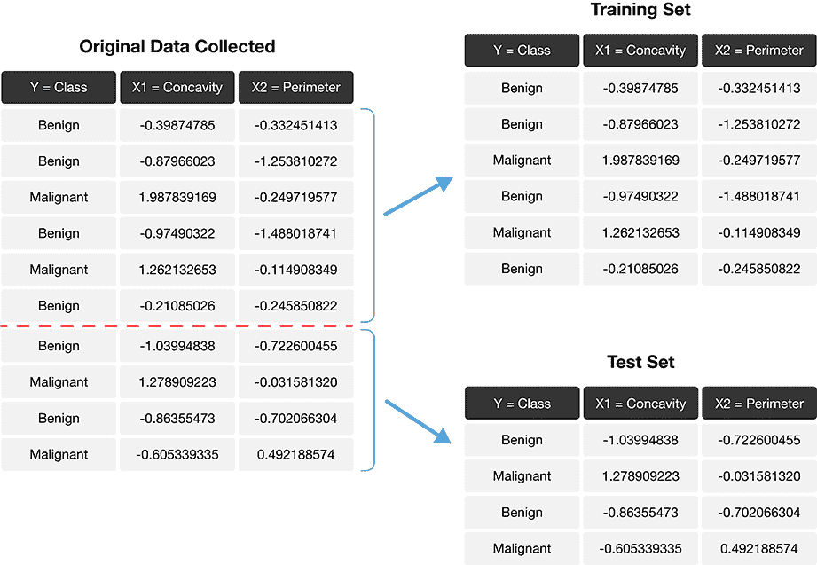

图 6.1：将数据分为训练集和测试集。

我们如何确切地评估我们的预测与测试集中观察到的实际标签的匹配程度呢？我们可以做的一件事是计算预测**准确性**。这是分类器做出正确预测的示例比例。为了计算这个值，我们将正确预测的数量除以做出的预测总数。评估我们的预测是否与测试集中的实际标签匹配的过程在图 6.2 中得到了说明。

$$\mathrm{accuracy} = \frac{\mathrm{number \; of \; correct \; predictions}}{\mathrm{total \; number \; of \; predictions}}$$

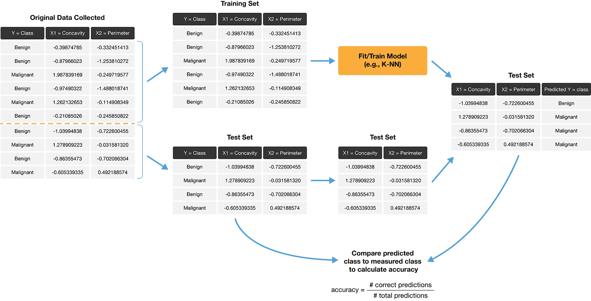

图 6.2：分割数据并找到预测准确性的过程。

准确性是一个方便的、通用的方法，可以用一个数字来总结分类器的性能。但预测准确性本身并不能说明全部情况。特别是，仅凭准确性并不能告诉我们分类器通常犯错误的频率，也不能告诉我们分类器犯的**错误类型**。通过进一步检查**混淆矩阵**，我们可以获得更全面的性能视图。混淆矩阵显示了每种类型的测试集标签被正确和错误预测的数量，这为我们提供了关于分类器倾向于犯的**错误类型**的更多细节。表 6.1 展示了对于有 65 个观察值的测试集的肿瘤图像数据，混淆矩阵可能看起来像什么。

表 6.1：肿瘤图像数据的示例混淆矩阵。

|  | 实际为恶性 | 实际为良性 |
| --- | --- | --- |
| **预测为恶性** | 1 | 4 |
| **预测良性** | 3 | 57 |

在表 6.1 的例子中，我们看到有 1 个恶性观察被正确地分类为恶性（左上角），以及 57 个良性观察被正确地分类为良性（右下角）。然而，我们也可以看到分类器犯了一些错误：它将 3 个恶性观察错误地分类为良性，并将 4 个良性观察错误地分类为恶性。这个分类器的准确率大约为 89%，由以下公式给出

$$\mathrm{accuracy} = \frac{\mathrm{number \; of \; correct \; predictions}}{\mathrm{total \; number \; of \; predictions}} = \frac{1+57}{1+57+4+3} = 0.892.$$

但我们也可以看到，分类器只识别出了 4 个总恶性肿瘤中的 1 个；换句话说，它错误地将数据集中 75%的恶性病例分类了！在这个例子中，将一个恶性肿瘤错误分类为良性是一个可能带来灾难性错误的错误，因为它可能导致需要治疗的病人没有得到治疗。由于我们特别关注识别恶性病例，即使准确率达到 89%，这个分类器也可能是不被接受的。

在分类问题中，通常更关注一个标签而不是另一个标签。在这种情况下，我们通常将我们更感兴趣识别的标签称为**正**标签，而将另一个称为**负**标签。在肿瘤的例子中，我们将恶性观察称为**正**，将良性观察称为**负**。然后我们可以使用以下术语来讨论分类器可以做出的四种预测，对应于混淆矩阵中的四个条目：

+   **真阳性**：一个恶性观察被正确地分类为恶性（表 6.1 的左上角）。

+   **假阳性**：一个良性观察被错误地分类为恶性（表 6.1 的右上角）。

+   **真阴性**：一个良性观察被正确地分类为良性（表 6.1 的右下角）。

+   **假阴性**：一个恶性观察被错误地分类为良性（表 6.1 的左下角）。

一个完美的分类器将没有假阴性和假阳性（因此，准确率为 100%）。然而，在实际应用中，分类器几乎总是会犯一些错误。因此，你应该考虑在你的应用中哪种类型的错误最重要，并使用混淆矩阵来量化并报告它们。我们可以使用混淆矩阵计算的两个常用指标是分类器的**精确度**和**召回率**。这些指标通常与准确率一起报告。*精确度*衡量分类器做出的正类预测中有多少实际上是正类。直观上，我们希望分类器具有*高*精确度：对于具有高精确度的分类器，如果分类器报告说一个新的观察结果是正类，我们可以相信这个新的观察结果确实是正类。我们可以使用混淆矩阵中的条目来计算分类器的精确度，公式如下

$$\mathrm{precision} = \frac{\mathrm{number \; of \; correct \; positive \; predictions}}{\mathrm{total \; number \; of \; positive \; predictions}}.$$

*召回率*衡量测试集中被识别为正类的正类观察数量。直观上，我们希望分类器具有*高*召回率：对于具有高召回率的分类器，如果测试数据中存在正类观察，我们可以相信分类器会找到它。我们也可以使用混淆矩阵中的条目来计算分类器的召回率，公式如下

$$\mathrm{recall} = \frac{\mathrm{number \; of \; correct \; positive \; predictions}}{\mathrm{total \; number \; of \; positive \; test \; set \; observations}}.$$

在表 6.1 中给出的示例中，我们得到精确度和召回率分别是

$$\mathrm{precision} = \frac{1}{1+4} = 0.20, \quad \mathrm{recall} = \frac{1}{1+3} = 0.25.$$

所以即使准确率达到 89%，分类器的精确度和召回率仍然相对较低。在这个数据分析的背景下，召回率尤为重要：如果有人患有恶性肿瘤，我们当然希望能够识别出来。仅仅 25%的召回率可能是不被接受的！

> **注意：**同时实现高精度和高召回率是困难的；高精度的模型往往召回率低，反之亦然。作为一个例子，我们可以轻松地制作一个具有**完美召回率**的分类器：**总是**猜测为正！这个分类器当然会找到测试集中的每一个正类观察值，但在过程中会做出很多错误的正类预测，并且精度低。同样，我们也可以轻松地制作一个具有**完美精度**的分类器：**永远**不猜测为正！这个分类器永远不会错误地将观察值识别为正类，但在过程中会做出很多错误的负类预测。实际上，这个分类器的召回率将是 0%！当然，大多数真实世界的分类器都介于这两个极端之间。但这些例子有助于说明，在某个类别对结果有影响（即存在**正**标签）的情况下，在设计分类器时，必须在精度和召回率之间做出权衡。

## 6.4 随机性和种子

从本章开始，我们的数据分析将经常涉及使用**随机性**。我们在需要做出公平、无偏见且不受人类输入影响的分析决策时使用随机性。例如，在本章中，我们需要将数据集分成训练集和测试集来评估我们的分类器。我们当然不希望手动选择如何分割数据，因为我们想避免无意中影响评估结果。因此，我们让 R **随机**分割数据。在未来的章节中，我们将以许多其他方式使用随机性，例如，帮助我们从一个较大的数据集中选择一小部分数据，选择数据分组，等等。

然而，随机性的使用与良好数据分析实践的主要原则之一——**可重复性**——相矛盾。回想一下，可重复的分析每次运行都会产生相同的结果；如果我们把随机性包含在分析中，我们不会每次都得到不同的结果吗？诀窍在于在 R（以及其他编程语言）中，随机性实际上并不是随机的！相反，R 使用一个**随机数生成器**，它产生一个完全由**种子值**决定的数字序列。一旦你使用 `set.seed` 函数设置了种子值，之后的所有操作可能看起来是随机的，但实际上是完全可重复的。只要选择相同的种子值，你就能得到相同的结果！

让我们用一个例子来探究在 R 中种子是如何工作的。假设我们想在 R 中使用 `sample` 函数随机选择 0 到 9 之间的 10 个数字，但我们希望它是可重复的。在使用 `sample` 函数之前，我们调用 `set.seed` 并传递任何整数作为参数。这里，我们传递了数字 `1`。

```r
set.seed(1)
random_numbers1 <- sample(0:9, 10, replace = TRUE)
random_numbers1
```

```r
##  [1] 8 3 6 0 1 6 1 2 0 4
```

你可以看到，`random_numbers1` 是一个包含从 0 到 9 的 10 个数字的列表，从所有迹象来看，看起来是随机的。如果我们再次运行 `sample` 函数，我们将得到一批看起来也是随机的 10 个新数字。

```r
random_numbers2 <- sample(0:9, 10, replace = TRUE)
random_numbers2
```

```r
##  [1] 4 9 5 9 6 8 4 4 8 8
```

如果我们想强制 R 产生相同的随机数字序列，我们可以简单地再次使用相同的参数值调用 `set.seed` 函数。

```r
set.seed(1)
random_numbers1_again <- sample(0:9, 10, replace = TRUE)
random_numbers1_again
```

```r
##  [1] 8 3 6 0 1 6 1 2 0 4
```

```r
random_numbers2_again <- sample(0:9, 10, replace = TRUE)
random_numbers2_again
```

```r
##  [1] 4 9 5 9 6 8 4 4 8 8
```

注意到在设置种子之后，我们以相同的顺序得到了相同的两个数字序列。`random_numbers1` 和 `random_numbers1_again` 产生了相同的数字序列，对于 `random_numbers2` 和 `random_numbers2_again` 也是如此。如果我们为种子选择一个不同的值——比如说，4235——我们将得到一个不同的随机数字序列。

```r
set.seed(4235)
random_numbers1_different <- sample(0:9, 10, replace = TRUE)
random_numbers1_different
```

```r
##  [1] 8 3 1 4 6 8 8 4 1 7
```

```r
random_numbers2_different <- sample(0:9, 10, replace = TRUE)
random_numbers2_different
```

```r
##  [1] 3 7 8 2 8 8 6 3 3 8
```

换句话说，尽管 R 生成的数字序列看起来是随机的，但当我们设置种子值时，它们是完全确定的！

这对数据分析意味着什么呢？嗯，`sample` 当然不是在 R 中使用随机性的唯一函数。我们在 `tidymodels`、`tidyverse` 以及其他地方使用的许多函数都使用了随机性——其中一些甚至没有告诉你。因此，在每次数据分析的开始，在加载包之后，你应该调用 `set.seed` 函数并传递你选择的整数。此外，请注意，当 R 启动时，它会创建自己的种子值来使用。所以，如果你在你的代码中明确没有调用 `set.seed` 函数，你的结果可能无法重现。最后，务必在数据分析的开始处只设置一次种子。每次你设置种子，你都在插入你自己的主观输入，从而影响分析。如果你在分析过程中多次使用 `set.seed`，R 使用的随机性看起来可能不会像它应该的那样随机。

总结来说：如果你想使你的分析可重现，即每次运行时都产生相同的结果，确保在分析开始时恰好使用一次 `set.seed`。`set.seed` 中的不同参数值会导致不同的随机模式，但只要你选择相同的参数值，你的结果就会相同。在本教材的剩余部分，我们将在每一章的开始处设置一次种子。

## 6.5 使用 `tidymodels` 评估性能

现在回到评估分类器的话题！在 R 中，我们可以使用 `tidymodels` 包不仅执行 K 最近邻分类，还可以评估我们的分类效果如何。让我们通过一个例子来了解如何使用 `tidymodels` 工具评估一个分类器，使用的是上一章中的乳腺癌数据集。我们开始分析，通过加载所需的包，读取乳腺癌数据，然后制作一个快速散点图可视化，展示肿瘤细胞凹凸度与平滑度按诊断着色，如图 6.3。你也会注意到，我们在分析开始时使用 `set.seed` 函数设置了随机种子，如第 6.4 节所述。

```r
# load packages
library(tidyverse)
library(tidymodels)

# set the seed
set.seed(1)

# load data
cancer <- read_csv("data/wdbc_unscaled.csv") |>
 # convert the character Class variable to the factor datatype
 mutate(Class = as_factor(Class))  |>
 # rename the factor values to be more readable
 mutate(Class = fct_recode(Class, "Malignant" = "M", "Benign" = "B"))

# create scatter plot of tumor cell concavity versus smoothness,
# labeling the points be diagnosis class
perim_concav <- cancer |>
 ggplot(aes(x = Smoothness, y = Concavity, color = Class)) +
 geom_point(alpha = 0.5) +
 labs(color = "Diagnosis") +
 scale_color_manual(values = c("darkorange", "steelblue")) +
 theme(text = element_text(size = 12))

perim_concav
```

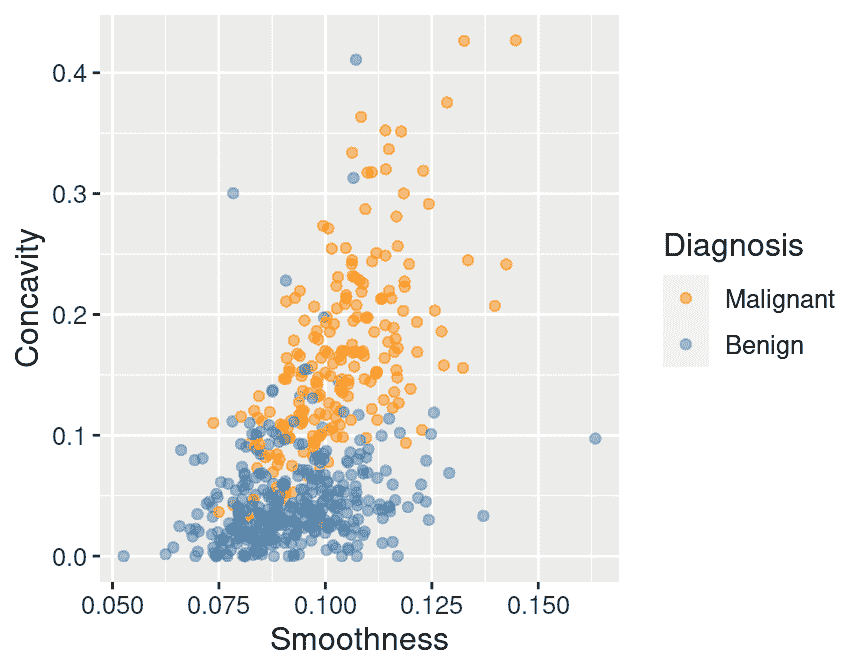

图 6.3：按诊断标签着色的肿瘤细胞凹凸度与平滑度散点图。

### 6.5.1 创建训练/测试拆分

一旦我们决定要回答一个预测问题并进行了初步的探索，接下来要做的事情就是将数据拆分为训练集和测试集。通常，训练集占数据量的 50%到 95%，而测试集则是剩余的 5%到 50%；这种直觉是，你希望在训练一个准确模型（通过使用更大的训练数据集）和获得对其性能的准确评估（通过使用更大的测试数据集）之间进行权衡。在这里，我们将使用 75%的数据进行训练，25%的数据进行测试。

来自 `tidymodels` 的 `initial_split` 函数为我们处理了数据拆分的流程。在拆分数据时，它还应用了两个非常重要的步骤，以确保从测试数据中得到的准确度估计是合理的。首先，它在拆分之前对数据进行**洗牌**，这确保了数据中存在的任何顺序都不会影响最终进入训练集和测试集的数据。其次，它根据类别标签**分层**数据，以确保每个类别在大约相同的比例下出现在训练集和测试集中。例如，在我们的数据集中，大约 63%的观测值来自良性类别，37%来自恶性类别，因此 `initial_split` 确保大约 63%的训练数据是良性的，37%的训练数据是恶性的，测试数据中也存在相同的比例。

让我们使用 `initial_split` 函数来创建训练集和测试集。我们将指定 `prop = 0.75`，这样我们原始数据集的 75%将最终进入训练集。我们还将设置 `strata` 参数为分类标签变量（在这里，`Class`），以确保训练集和测试集包含每个观察类别的正确比例。然后 `training` 和 `testing` 函数将训练集和测试数据集提取到两个单独的数据框中。请注意，`initial_split` 函数使用随机性，但由于我们在本章早期设置了种子，所以分割将是可重复的。

```r
cancer_split <- initial_split(cancer, prop = 0.75, strata = Class)
cancer_train <- training(cancer_split)
cancer_test <- testing(cancer_split)
```

```r
glimpse(cancer_train)
```

```r
## Rows: 426
## Columns: 12
## $ ID                <dbl> 8510426, 8510653, 8510824, 854941, 85713702, 857155,…
## $ Class             <fct> Benign, Benign, Benign, Benign, Benign, Benign, Beni…
## $ Radius            <dbl> 13.540, 13.080, 9.504, 13.030, 8.196, 12.050, 13.490…
## $ Texture           <dbl> 14.36, 15.71, 12.44, 18.42, 16.84, 14.63, 22.30, 21.…
## $ Perimeter         <dbl> 87.46, 85.63, 60.34, 82.61, 51.71, 78.04, 86.91, 74.…
## $ Area              <dbl> 566.3, 520.0, 273.9, 523.8, 201.9, 449.3, 561.0, 427…
## $ Smoothness        <dbl> 0.09779, 0.10750, 0.10240, 0.08983, 0.08600, 0.10310…
## $ Compactness       <dbl> 0.08129, 0.12700, 0.06492, 0.03766, 0.05943, 0.09092…
## $ Concavity         <dbl> 0.066640, 0.045680, 0.029560, 0.025620, 0.015880, 0.…
## $ Concave_Points    <dbl> 0.047810, 0.031100, 0.020760, 0.029230, 0.005917, 0.…
## $ Symmetry          <dbl> 0.1885, 0.1967, 0.1815, 0.1467, 0.1769, 0.1675, 0.18…
## $ Fractal_Dimension <dbl> 0.05766, 0.06811, 0.06905, 0.05863, 0.06503, 0.06043…
```

```r
glimpse(cancer_test)
```

```r
## Rows: 143
## Columns: 12
## $ ID                <dbl> 842517, 84300903, 84501001, 84610002, 848406, 848620…
## $ Class             <fct> Malignant, Malignant, Malignant, Malignant, Malignan…
## $ Radius            <dbl> 20.570, 19.690, 12.460, 15.780, 14.680, 16.130, 19.8…
## $ Texture           <dbl> 17.77, 21.25, 24.04, 17.89, 20.13, 20.68, 22.15, 14.…
## $ Perimeter         <dbl> 132.90, 130.00, 83.97, 103.60, 94.74, 108.10, 130.00…
## $ Area              <dbl> 1326.0, 1203.0, 475.9, 781.0, 684.5, 798.8, 1260.0, …
## $ Smoothness        <dbl> 0.08474, 0.10960, 0.11860, 0.09710, 0.09867, 0.11700…
## $ Compactness       <dbl> 0.07864, 0.15990, 0.23960, 0.12920, 0.07200, 0.20220…
## $ Concavity         <dbl> 0.08690, 0.19740, 0.22730, 0.09954, 0.07395, 0.17220…
## $ Concave_Points    <dbl> 0.070170, 0.127900, 0.085430, 0.066060, 0.052590, 0.…
## $ Symmetry          <dbl> 0.1812, 0.2069, 0.2030, 0.1842, 0.1586, 0.2164, 0.15…
## $ Fractal_Dimension <dbl> 0.05667, 0.05999, 0.08243, 0.06082, 0.05922, 0.07356…
```

从上面的代码中的 `glimpse` 可以看出，训练集包含 426 个观测值，而测试集包含 143 个观测值。这对应于 75% / 25%的训练/测试分割，正如我们期望的那样。回想一下第五章，我们使用 `glimpse` 函数来查看具有大量列的数据，因为它以列向下打印数据（而不是横跨页面）。

我们可以使用 `group_by` 和 `summarize` 来找到 `cancer_train` 中恶性和良性类别的百分比，我们看到大约 63%的训练数据是良性的，37%是恶性的，这表明当我们分割数据时，我们的类别比例大致得到了保留。

```r
cancer_proportions <- cancer_train |>
 group_by(Class) |>
 summarize(n = n()) |>
 mutate(percent = 100*n/nrow(cancer_train))

cancer_proportions
```

```r
## # A tibble: 2 × 3
##   Class         n percent
##   <fct>     <int>   <dbl>
## 1 Malignant   159    37.3
## 2 Benign      267    62.7
```

### 6.5.2 预处理数据

正如我们在上一章中提到的，K 近邻对预测因子的规模很敏感，因此我们应该进行一些预处理来标准化它们。在执行此操作时，我们需要考虑的另一个额外因素是，我们应该使用**仅**训练数据创建标准化预处理器。这确保了我们的测试数据不会影响模型训练的任何方面。一旦我们创建了标准化预处理器，我们就可以将其分别应用于训练集和测试数据集。

幸运的是，`tidymodels` 的 `recipe` 框架帮助我们正确处理这个问题。下面我们仅使用训练数据（由于第一行中的 `data = cancer_train`）构建和准备这个配方。

```r
cancer_recipe <- recipe(Class ~ Smoothness + Concavity, data = cancer_train) |>
 step_scale(all_predictors()) |>
 step_center(all_predictors())
```

### 6.5.3 训练分类器

现在我们已经将原始数据集分为训练集和测试集，我们可以使用上一章学到的技术，仅使用训练集来创建我们的 K 近邻分类器。目前，我们只需选择邻居数 $K$ 为 3，并使用凹度和平滑度作为预测因子。和之前一样，我们需要创建一个模型规范，将模型规范和配方组合成一个工作流程，然后最终使用 `fit` 函数和训练数据 `cancer_train` 来构建分类器。

```r
knn_spec <- nearest_neighbor(weight_func = "rectangular", neighbors = 3) |>
 set_engine("kknn") |>
 set_mode("classification")

knn_fit <- workflow() |>
 add_recipe(cancer_recipe) |>
 add_model(knn_spec) |>
 fit(data = cancer_train)

knn_fit
```

```r
## ══ Workflow [trained] ══════════
## Preprocessor: Recipe
## Model: nearest_neighbor()
## 
## ── Preprocessor ──────────
## 2 Recipe Steps
## 
## • step_scale()
## • step_center()
## 
## ── Model ──────────
## 
## Call:
## kknn::train.kknn(formula = ..y ~ ., data = data, ks = min_rows(3,     data, 5), 
## kernel = ~"rectangular")
## 
## Type of response variable: nominal
## Minimal misclassification: 0.1126761
## Best kernel: rectangular
## Best k: 3
```

### 6.5.4 在测试集中预测标签

现在我们有了 K 最近邻分类器对象，我们可以用它来预测测试集的类别标签。我们使用`bind_cols`将预测列添加到原始测试数据中，创建`cancer_test_predictions`数据框。`Class`变量包含实际诊断，而`.pred_class`包含分类器预测的诊断。

```r
cancer_test_predictions <- predict(knn_fit, cancer_test) |>
 bind_cols(cancer_test)

cancer_test_predictions
```

```r
## # A tibble: 143 × 13
##    .pred_class       ID Class     Radius Texture Perimeter  Area Smoothness
##    <fct>          <dbl> <fct>      <dbl>   <dbl>     <dbl> <dbl>      <dbl>
##  1 Benign        842517 Malignant   20.6    17.8     133\.  1326      0.0847
##  2 Malignant   84300903 Malignant   19.7    21.2     130   1203      0.110 
##  3 Malignant   84501001 Malignant   12.5    24.0      84.0  476\.     0.119 
##  4 Malignant   84610002 Malignant   15.8    17.9     104\.   781      0.0971
##  5 Benign        848406 Malignant   14.7    20.1      94.7  684\.     0.0987
##  6 Malignant   84862001 Malignant   16.1    20.7     108\.   799\.     0.117 
##  7 Malignant     849014 Malignant   19.8    22.2     130   1260      0.0983
##  8 Malignant    8511133 Malignant   15.3    14.3     102\.   704\.     0.107 
##  9 Malignant     852552 Malignant   16.6    21.4     110    905\.     0.112 
## 10 Malignant     853612 Malignant   11.8    18.7      77.9  441\.     0.111 
## # ℹ 133 more rows
## # ℹ 5 more variables: Compactness <dbl>, Concavity <dbl>, Concave_Points <dbl>,
## #   Symmetry <dbl>, Fractal_Dimension <dbl>
```

### 6.5.5 评估性能

最后，我们可以评估我们的分类器性能。首先，我们将检查准确率。为此，我们使用`tidymodels`中的`metrics`函数，指定`truth`和`estimate`参数：

```r
cancer_test_predictions |>
 metrics(truth = Class, estimate = .pred_class) |>
 filter(.metric == "accuracy")
```

```r
## # A tibble: 1 × 3
##   .metric  .estimator .estimate
##   <chr>    <chr>          <dbl>
## 1 accuracy binary         0.853
```

在指标数据框中，我们过滤了`.metric`列，因为我们只对`accuracy`行感兴趣。其他条目涉及本书范围之外的其他指标。查看`.estimate`变量的值显示，分类器在测试数据上的估计准确率为 85%。为了计算精确率和召回率，我们可以使用`tidymodels`中的`precision`和`recall`函数。我们首先使用`levels`函数检查`Class`变量中标签的顺序：

```r
cancer_test_predictions |> pull(Class) |> levels()
```

```r
## [1] "Malignant" "Benign"
```

这表明`"Malignant"`是第一级。因此，我们将`truth`和`estimate`参数设置为`Class`和`.pred_class`，就像之前一样，但还指定“阳性”类别对应于第一因子水平，通过`event_level="first"`。如果标签顺序相反，我们将使用`event_level="second"`。

```r
cancer_test_predictions |>
 precision(truth = Class, estimate = .pred_class, event_level = "first")
```

```r
## # A tibble: 1 × 3
##   .metric   .estimator .estimate
##   <chr>     <chr>          <dbl>
## 1 precision binary         0.767
```

```r
cancer_test_predictions |>
 recall(truth = Class, estimate = .pred_class, event_level = "first")
```

```r
## # A tibble: 1 × 3
##   .metric .estimator .estimate
##   <chr>   <chr>          <dbl>
## 1 recall  binary         0.868
```

输出显示，分类器在测试数据上的估计精确率和召回率分别为 77%和 87%。最后，我们可以使用`conf_mat`函数查看分类器的*混淆矩阵*。

```r
confusion <- cancer_test_predictions |>
 conf_mat(truth = Class, estimate = .pred_class)
confusion
```

```r
##            Truth
## Prediction  Malignant Benign
##   Malignant        46     14
##   Benign            7     76
```

混淆矩阵显示，46 个观察值被正确预测为恶性，76 个观察值被正确预测为良性。它还显示分类器犯了一些错误；特别是，它将 7 个观察值错误地分类为良性，而实际上它们是恶性的，还有 14 个观察值被错误地分类为恶性，而实际上它们是良性的。使用我们之前提到的公式，我们可以看到准确率、精确率和召回率与 R 报告的一致。

$$\mathrm{accuracy} = \frac{\mathrm{number \; of \; correct \; predictions}}{\mathrm{total \; number \; of \; predictions}} = \frac{46+76}{46+76+14+7} = 0.853$$

$$\mathrm{precision} = \frac{\mathrm{number \; of \; correct \; positive \; predictions}}{\mathrm{total \; number \; of \; positive \; predictions}} = \frac{46}{46 + 14} = 0.767$$

$$\mathrm{recall} = \frac{\mathrm{number \; of \; correct \; positive \; predictions}}{\mathrm{total \; number \; of \; positive \; test \; set \; observations}} = \frac{46}{46+7} = 0.868$$

### 6.5.6 临界性分析性能

我们现在知道，分类器在测试数据集上的准确率为 85%，精确率为 77%，召回率为 87%。听起来相当不错！等等，*这是否真的很好？或者我们是否需要更高的准确率？

通常，准确率（以及如果适用的话，精确率和召回率）的*良好*值取决于应用；你必须批判性地分析你在解决问题的背景下准确率。例如，如果我们正在构建一种良性 99%的肿瘤分类器，那么一个准确率达到 99%的分类器并不特别令人印象深刻（只需总是猜测良性！）。而且，除了准确率之外，我们还需要考虑精确率和召回率：如前所述，分类器所犯的错误类型在许多应用中也很重要。在之前的 99%良性观察的例子中，如果分类器预测“良性”而实际类别是“恶性”（一个假阴性），这可能会导致患者没有获得适当的医疗关注。换句话说，在这种情况下，我们需要分类器有*高召回率*。另一方面，如果分类器在实际上为“良性”时猜测“恶性”（一个假阳性），那么患者可能会去看医生，医生可以提供专业的诊断。换句话说，我们可以在追求高召回率的同时牺牲一些精确率。这就是为什么不仅要看准确率，还要看混淆矩阵的重要性。

然而，对于任何分类问题，你都可以有一个简单的基线进行比较：*多数分类器*。多数分类器*总是*从训练数据中猜测多数类标签，而不考虑预测变量的值。在考虑准确率时，这有助于你有一个量化的概念。如果多数分类器在某个问题上的准确率达到 90%，那么你可能希望你的 K 最近邻分类器做得比这更好。如果你的分类器在多数分类器的基础上有显著的改进，这意味着至少你的方法从预测变量中提取了一些有用的信息。但要注意：改进多数分类器并不*必然*意味着分类器足够好，可以适用于你的应用。

例如，在乳腺癌数据中，回想一下训练数据中良性观察和恶性观察的比例如下：

```r
cancer_proportions
```

```r
## # A tibble: 2 × 3
##   Class         n percent
##   <fct>     <int>   <dbl>
## 1 Malignant   159    37.3
## 2 Benign      267    62.7
```

由于良性类代表了大多数训练数据，多数分类器会*总是*预测新的观测结果是良性的。多数分类器的估计准确性通常与训练数据中多数类的比例相当接近。在这种情况下，我们会怀疑多数分类器的准确性大约为 63%。我们构建的 K 近邻分类器比这做得好得多，准确率为 85%。这意味着从准确性的角度来看，K 近邻分类器在基本多数分类器的基础上有了相当大的改进。太好了！但我们仍然需要谨慎；在这个应用中，很可能非常重要，不要误诊任何恶性肿瘤，以避免遗漏真正需要医疗护理的患者。上面的混淆矩阵显示，分类器确实将相当数量的恶性肿瘤误诊为良性（53 个恶性肿瘤中的 7 个，或 13%）！因此，尽管准确性超过了多数分类器，但我们的批判性分析表明，这个分类器可能不适合该应用。

## 6.6 调整分类器

统计学和机器学习中的大多数预测模型都有*参数*。一个*参数*是在事先必须选择的一个数字，它决定了模型行为的一些方面。例如，在 K 近邻分类算法中，$K$是一个我们必须选择的参数，它决定了有多少邻居参与类别投票。通过选择不同的$K$值，我们创建了不同的分类器，它们会做出不同的预测。

那么，我们如何选择$K$的*最佳*值，即*调整*模型？并且是否有可能以原则性的方式做出这个选择？在这本书中，我们将专注于最大化分类器的准确性。理想情况下，我们希望以某种方式最大化我们的分类器在尚未见过的数据上的准确性。但我们不能在构建模型的过程中使用我们的测试数据集。因此，我们将再次使用我们在评估分类器时使用的相同技巧：我们将把我们的*训练数据本身*分成两个子集，使用一个来训练模型，然后使用另一个来评估它。在本节中，我们将详细介绍这个过程的细节，以及如何使用它来帮助你为你的分类器选择一个好的参数值。

**记住：**在调整过程中不要触碰测试集。调整是模型训练的一部分！

### 6.6.1 交叉验证

选择参数 $K$ 的第一步是能够仅使用训练数据来评估分类器。如果这可行，那么我们可以仅使用训练数据来比较不同 $K$ 值的分类器性能——并选择最佳——这样我们就能得到一个单一的分类器。正如本节开头所建议的，我们将通过分割训练数据，在一个子集上训练，在另一个子集上评估来实现这一点。用于评估的训练数据子集通常被称为**验证集**。

然而，这与我们之前进行的训练/测试分割有一个关键的不同。具体来说，我们被迫只对数据进行一次**分割**。这是因为最终，我们必须生成一个单一的分类器。如果我们对数据进行多个不同的训练和测试数据分割，我们将生成多个不同的分类器。但在调整分类器时，我们可以自由地基于多个训练数据分割创建多个分类器，评估它们，然后根据**所有**不同的结果选择参数值。如果我们只对整体训练数据进行一次分割，我们最佳参数的选择将强烈依赖于最终幸运地进入验证集的数据。也许通过使用多个不同的训练/验证分割，我们可以得到更好的准确度估计，这将导致对整体训练数据集中邻居数量 $K$ 的更好选择。

让我们在 R 中研究这个想法！特别是，我们将生成五个不同的整体训练数据训练/验证分割，训练五个不同的 K 近邻模型，并评估它们的准确度。我们将从一个单一的分割开始。

```r
# create the 25/75 split of the training data into training and validation
cancer_split <- initial_split(cancer_train, prop = 0.75, strata = Class)
cancer_subtrain <- training(cancer_split)
cancer_validation <- testing(cancer_split)

# recreate the standardization recipe from before
# (since it must be based on the training data)
cancer_recipe <- recipe(Class ~ Smoothness + Concavity,
 data = cancer_subtrain) |>
 step_scale(all_predictors()) |>
 step_center(all_predictors())

# fit the knn model (we can reuse the old knn_spec model from before)
knn_fit <- workflow() |>
 add_recipe(cancer_recipe) |>
 add_model(knn_spec) |>
 fit(data = cancer_subtrain)

# get predictions on the validation data
validation_predicted <- predict(knn_fit, cancer_validation) |>
 bind_cols(cancer_validation)

# compute the accuracy
acc <- validation_predicted |>
 metrics(truth = Class, estimate = .pred_class) |>
 filter(.metric == "accuracy") |>
 select(.estimate) |>
 pull()

acc
```

```r
## [1] 0.8598131
```

使用这个分割的准确度估计为 86%。现在我们重复上述代码 4 次更多，这将生成 4 个更多的分割。因此，我们得到五个不同的数据洗牌，因此得到五个不同的准确度值：86.0%，89.7%，88.8%，86.0%，86.9%。这些值中没有一个必然比其他任何值“更正确”；它们只是使用我们的整体训练数据构建的分类器的真实、潜在准确度的五个估计。我们可以通过取它们的平均值（这里为 87%）来结合估计，以尝试得到对分类器准确度的单一评估；这会减少任何一个（不）幸运的验证集对估计的影响。

在实践中，我们不使用随机分割，而是使用更结构化的分割过程，以确保数据集中的每个观察值只在一个验证集中使用一次。这种策略的名称是 **交叉验证**。在 **交叉验证** 中，我们将 **整体训练数据** 分成 $C$ 个大小均匀的块。然后，迭代地使用 $1$ 个块作为 **验证集**，并将剩余的 $C-1$ 个块作为 **训练集**。这个过程在图 6.4 中显示。在此，使用 $C=5$ 个不同的数据集块，产生了 5 个不同的 **验证集** 选择；我们称之为 *5 折* 交叉验证。

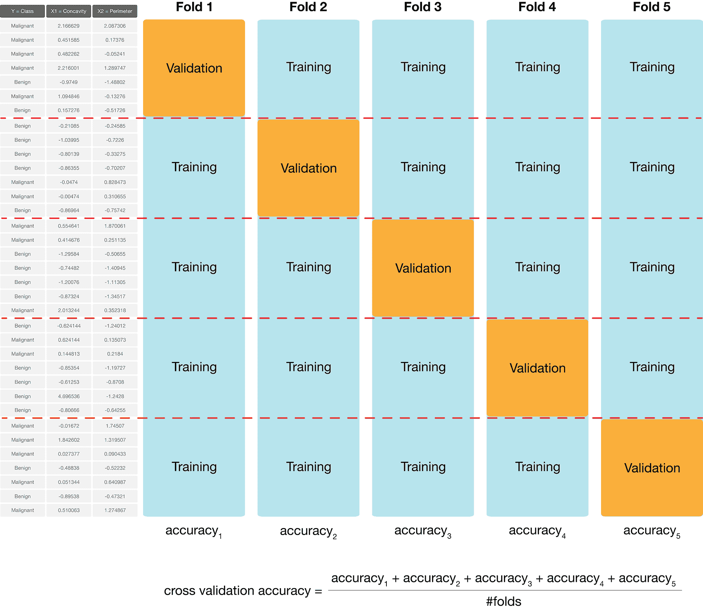

图 6.4：5 折交叉验证。

要在 R 中使用 `tidymodels` 执行 5 折交叉验证，我们使用另一个函数：`vfold_cv`。此函数会自动将我们的训练数据分成 `v` 折。我们将 `strata` 参数设置为分类标签变量（在此处为 `Class`），以确保训练集和验证集包含每个观察类别正确的比例。

```r
cancer_vfold <- vfold_cv(cancer_train, v = 5, strata = Class)
cancer_vfold
```

```r
## #  5-fold cross-validation using stratification 
## # A tibble: 5 × 2
##   splits           id   
##   <list>           <chr>
## 1 <split [340/86]> Fold1
## 2 <split [340/86]> Fold2
## 3 <split [341/85]> Fold3
## 4 <split [341/85]> Fold4
## 5 <split [342/84]> Fold5
```

然后，当我们创建我们的数据分析工作流程时，我们使用 `fit_resamples` 函数而不是 `fit` 函数进行训练。这将在每个训练/验证分割上运行交叉验证。

```r
# recreate the standardization recipe from before
# (since it must be based on the training data)
cancer_recipe <- recipe(Class ~ Smoothness + Concavity,
 data = cancer_train) |>
 step_scale(all_predictors()) |>
 step_center(all_predictors())

# fit the knn model (we can reuse the old knn_spec model from before)
knn_fit <- workflow() |>
 add_recipe(cancer_recipe) |>
 add_model(knn_spec) |>
 fit_resamples(resamples = cancer_vfold)

knn_fit
```

```r
## # Resampling results
## # 5-fold cross-validation using stratification 
## # A tibble: 5 × 4
##   splits          id    .metrics         .notes          
##   <list>          <chr> <list>          <list>          
## 1 <split [340/86]> Fold1 <tibble [2 × 4]> <tibble [0 × 3]>
## 2 <split [340/86]> Fold2 <tibble [2 × 4]> <tibble [0 × 3]>
## 3 <split [341/85]> Fold3 <tibble [2 × 4]> <tibble [0 × 3]>
## 4 <split [341/85]> Fold4 <tibble [2 × 4]> <tibble [0 × 3]>
## 5 <split [342/84]> Fold5 <tibble [2 × 4]> <tibble [0 × 3]>
```

`collect_metrics` 函数用于聚合分类器验证准确率的均值和标准误差，该准确率是跨所有折叠的。你将在 `.metric` 列下 `accuracy` 所在的行中找到与准确率相关的结果。你应该将均值（`mean`）视为估计的准确率，而标准误差（`std_err`）是我们对均值不确定性的度量。对此的详细讨论超出了本章的范围；但大致来说，如果你的估计均值是 0.89，标准误差是 0.02，你可以预期分类器的 *真实* 平均准确率大约在 87% 到 91% 之间（尽管它可能超出这个范围）。你可以忽略指标数据框中的其他列，因为它们不会提供任何额外的见解。你也可以忽略 `.metric` 列中带有 `roc_auc` 的整个第二行，因为它超出了本书的范围。

```r
knn_fit |>
 collect_metrics()
```

```r
## # A tibble: 2 × 6
##   .metric  .estimator  mean     n std_err .config             
##   <chr>    <chr>      <dbl> <int>   <dbl> <chr>               
## 1 accuracy binary     0.890     5  0.0180 Preprocessor1_Model1
## 2 roc_auc  binary     0.925     5  0.0151 Preprocessor1_Model1
```

我们可以选择任何数量的折数，通常使用的折数越多，我们的准确率估计将越好（标准误差越低）。然而，我们受限于计算能力：我们选择的折数越多，所需的计算就越多，因此运行分析所需的时间就越长。所以当你进行交叉验证时，你需要考虑数据的大小、算法的速度（例如，K 近邻算法）以及你电脑的速度。在实践中，这是一个试错过程，但通常 $C$ 被选择为 5 或 10。在这里，我们将尝试 10 折交叉验证，看看我们是否能得到更低的标准误差：

```r
cancer_vfold <- vfold_cv(cancer_train, v = 10, strata = Class)

vfold_metrics <- workflow() |>
 add_recipe(cancer_recipe) |>
 add_model(knn_spec) |>
 fit_resamples(resamples = cancer_vfold) |>
 collect_metrics()

vfold_metrics
```

```r
## # A tibble: 2 × 6
##   .metric  .estimator  mean     n std_err .config             
##   <chr>    <chr>      <dbl> <int>   <dbl> <chr>               
## 1 accuracy binary     0.890    10  0.0127 Preprocessor1_Model1
## 2 roc_auc  binary     0.913    10  0.0150 Preprocessor1_Model1
```

在这种情况下，使用 10 次交叉验证而不是 5 次交叉验证确实减少了标准误差，尽管减少的量并不显著。事实上，由于数据分割的随机性，有时你甚至可能会在增加折叠次数时得到更高的标准误差！我们可以通过大量增加折叠次数来使标准误差的减少更加显著。在下面的代码中，我们展示了当 $C = 50$ 时的结果；在实际应用中，选择如此大的折叠次数通常需要很长时间来运行，所以我们通常坚持使用 5 或 10。

```r
cancer_vfold_50 <- vfold_cv(cancer_train, v = 50, strata = Class)

vfold_metrics_50 <- workflow() |>
 add_recipe(cancer_recipe) |>
 add_model(knn_spec) |>
 fit_resamples(resamples = cancer_vfold_50) |>
 collect_metrics()

vfold_metrics_50
```

```r
## # A tibble: 2 × 6
##   .metric  .estimator  mean     n std_err .config             
##   <chr>    <chr>      <dbl> <int>   <dbl> <chr>               
## 1 accuracy binary     0.884    50 0.00568 Preprocessor1_Model1
## 2 roc_auc  binary     0.926    50 0.0148  Preprocessor1_Model1
```

### 6.6.2 参数值选择

使用 5 次和 10 次交叉验证，我们估计我们的分类器的预测准确率大约在 89% 左右。这好不好完全取决于数据分析的下游应用。在当前情况下，我们正在尝试预测肿瘤诊断，误预测的潜在后果是昂贵的、破坏性的化疗/放疗或患者死亡。因此，我们可能希望在这个应用中做得比 89% 更好。

为了提高我们的分类器，我们有一个参数选择：邻居数量，$K$。由于交叉验证帮助我们评估分类器的准确率，我们可以使用交叉验证来计算一个合理范围内的每个 $K$ 值的准确率，然后选择给我们最佳准确率的 $K$ 值。`tidymodels` 包提供了一种非常简单的语法来调整模型：在模型规范中应指定要调整的每个模型参数为 `tune()`，而不是给出一个特定的值。

```r
knn_spec <- nearest_neighbor(weight_func = "rectangular",
 neighbors = tune()) |>
 set_engine("kknn") |>
 set_mode("classification")
```

然后，我们不会使用 `fit` 或 `fit_resamples`，而是使用 `tune_grid` 函数为参数值范围内的每个值拟合模型。特别是，我们首先创建一个包含要尝试的 $K$ 值序列的 `neighbors` 变量的数据框；下面我们使用 `seq` 函数创建包含从 1 到 100（步长为 5）的值的 `k_vals` 数据框，其中包含 `neighbors` 变量。然后我们将该数据框传递给 `tune_grid` 的 `grid` 参数。

```r
k_vals <- tibble(neighbors = seq(from = 1, to = 100, by = 5))

knn_results <- workflow() |>
 add_recipe(cancer_recipe) |>
 add_model(knn_spec) |>
 tune_grid(resamples = cancer_vfold, grid = k_vals) |>
 collect_metrics()

accuracies <- knn_results |>
 filter(.metric == "accuracy")

accuracies
```

```r
## # A tibble: 20 × 7
##    neighbors .metric  .estimator  mean     n std_err .config              
##        <dbl> <chr>    <chr>      <dbl> <int>   <dbl> <chr>                
##  1         1 accuracy binary     0.866    10  0.0165 Preprocessor1_Model01
##  2         6 accuracy binary     0.890    10  0.0153 Preprocessor1_Model02
##  3        11 accuracy binary     0.887    10  0.0173 Preprocessor1_Model03
##  4        16 accuracy binary     0.887    10  0.0142 Preprocessor1_Model04
##  5        21 accuracy binary     0.887    10  0.0143 Preprocessor1_Model05
##  6        26 accuracy binary     0.887    10  0.0170 Preprocessor1_Model06
##  7        31 accuracy binary     0.897    10  0.0145 Preprocessor1_Model07
##  8        36 accuracy binary     0.899    10  0.0144 Preprocessor1_Model08
##  9        41 accuracy binary     0.892    10  0.0135 Preprocessor1_Model09
## 10        46 accuracy binary     0.892    10  0.0156 Preprocessor1_Model10
## 11        51 accuracy binary     0.890    10  0.0155 Preprocessor1_Model11
## 12        56 accuracy binary     0.873    10  0.0156 Preprocessor1_Model12
## 13        61 accuracy binary     0.876    10  0.0104 Preprocessor1_Model13
## 14        66 accuracy binary     0.871    10  0.0139 Preprocessor1_Model14
## 15        71 accuracy binary     0.876    10  0.0104 Preprocessor1_Model15
## 16        76 accuracy binary     0.873    10  0.0127 Preprocessor1_Model16
## 17        81 accuracy binary     0.876    10  0.0135 Preprocessor1_Model17
## 18        86 accuracy binary     0.873    10  0.0131 Preprocessor1_Model18
## 19        91 accuracy binary     0.873    10  0.0140 Preprocessor1_Model19
## 20        96 accuracy binary     0.866    10  0.0126 Preprocessor1_Model20
```

我们可以通过绘制准确率与 $K$ 的关系图来决定最佳邻居数量，如图 6.5 所示。

```r
accuracy_vs_k <- ggplot(accuracies, aes(x = neighbors, y = mean)) +
 geom_point() +
 geom_line() +
 labs(x = "Neighbors", y = "Accuracy Estimate") +
 theme(text = element_text(size = 12))

accuracy_vs_k
```

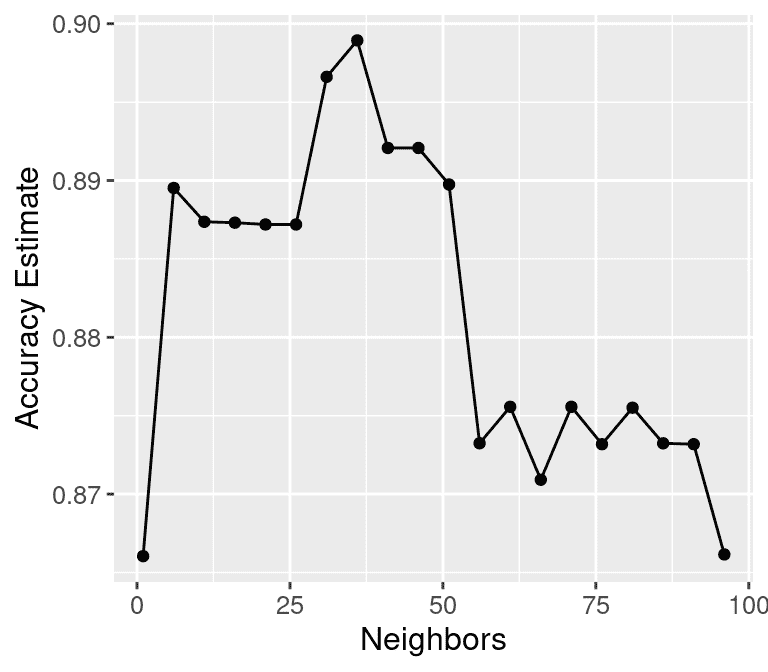

图 6.5：估计准确率与邻居数量的关系图。

我们还可以通过访问 `accuracies` 数据框中的 `neighbors` 变量，并找到 `mean` 变量最高的位置，程序化地获得具有最高准确率的邻居数量。请注意，像上面那样可视化结果仍然很有用，因为这提供了关于模型性能如何变化的额外信息。

```r
best_k <- accuracies |>
 arrange(desc(mean)) |>
 head(1) |>
 pull(neighbors)
best_k
```

```r
## [1] 36
```

将邻居数量设置为 $K =$ 36 提供了最高的交叉验证准确率估计（89.89%）。但这里没有确切或完美的答案；从 $K = 30$ 到 $60$ 的任何选择都是合理有据的，因为所有这些在分类器准确率上的差异都很小。记住：你在这个图表上看到的值是**估计**我们分类器真实准确率的。尽管 $K =$ 36 的值比这个图表上的其他值都要高，但这并不意味着分类器实际上在这个参数值下更准确！一般来说，当我们选择 $K$（以及其他预测模型的参数）时，我们寻找的是这样一个值：

+   我们得到了大致最优的准确率，因此我们的模型很可能会准确；

+   将值更改为附近的值（例如，添加或减去一个小数）并不会太多地降低准确率，因此我们的选择在存在不确定性的情况下是可靠的；

+   训练模型的花费并不巨大（例如，在我们的情况下，如果 $K$ 太大，预测就会变得昂贵！）。

我们知道 $K =$ 36 提供了最高的估计准确率。此外，图 6.5 显示，如果我们增加或减少 $K$ 到 $K =$ 36 附近，估计准确率的变化量很小。最后，$K =$ 36 并不会产生过高的训练计算成本。考虑到这三点，我们确实会选择 $K =$ 36 作为分类器。

### 6.6.3 欠拟合/过拟合

为了增强一点直观感受，如果我们不断增大邻居数量 $K$ 会发生什么？实际上，准确率实际上开始下降！让我们指定一个更大的 $K$ 值范围来尝试在 `tune_grid` 的 `grid` 参数中。图 6.6 展示了当我们从 1 变化到几乎等于训练集观察数量时，估计准确率的图表。

```r
k_lots <- tibble(neighbors = seq(from = 1, to = 385, by = 10))

knn_results <- workflow() |>
 add_recipe(cancer_recipe) |>
 add_model(knn_spec) |>
 tune_grid(resamples = cancer_vfold, grid = k_lots) |>
 collect_metrics()

accuracies_lots <- knn_results |>
 filter(.metric == "accuracy")

accuracy_vs_k_lots <- ggplot(accuracies_lots, aes(x = neighbors, y = mean)) +
 geom_point() +
 geom_line() +
 labs(x = "Neighbors", y = "Accuracy Estimate") +
 theme(text = element_text(size = 12))

accuracy_vs_k_lots
```

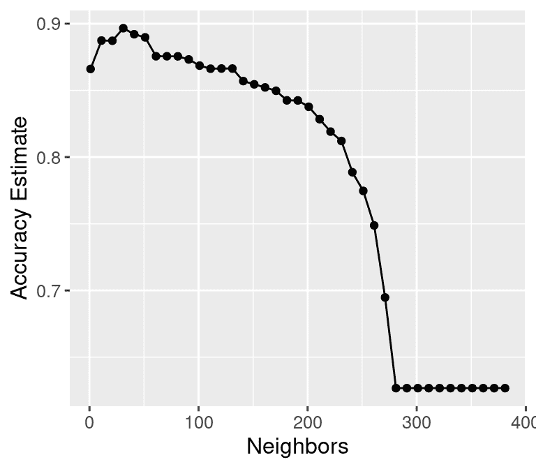

图 6.6：多个 $K$ 值下准确率估计与邻居数量的图表。

**欠拟合**：我们的分类器实际上发生了什么，导致了这种情况？随着邻居数量的增加，越来越多的训练观察值（以及那些离点越来越远的观察值）对新的观察值的类别有“发言权”。这导致了一种“平均效应”的发生，使得我们的分类器预测肿瘤为恶性或良性之间的边界变得平滑并变得更加*简单*。如果你将这一点推向极端，将 $K$ 设置为整个训练数据集的大小，那么分类器将始终预测相同的标签，而不管新的观察值看起来如何。一般来说，如果模型*对训练数据的影响不足*，则称模型**欠拟合**数据。

**过拟合**：相反，当我们减少邻居数量时，每个单独的数据点对附近点的投票越来越强。由于数据本身是嘈杂的，这导致了一个更“锯齿状”的边界，对应于一个**更简单**的模型。如果您将这种情况推向极端，设置$K = 1$，那么分类器本质上只是将每个新的观测值与其在训练数据集中的最近邻匹配。这与大$K$的情况一样有问题，因为分类器对新数据变得不可靠：如果我们有一个不同的训练集，预测将完全不同。一般来说，如果模型**过度依赖于**训练数据，我们说它**过拟合**了数据。

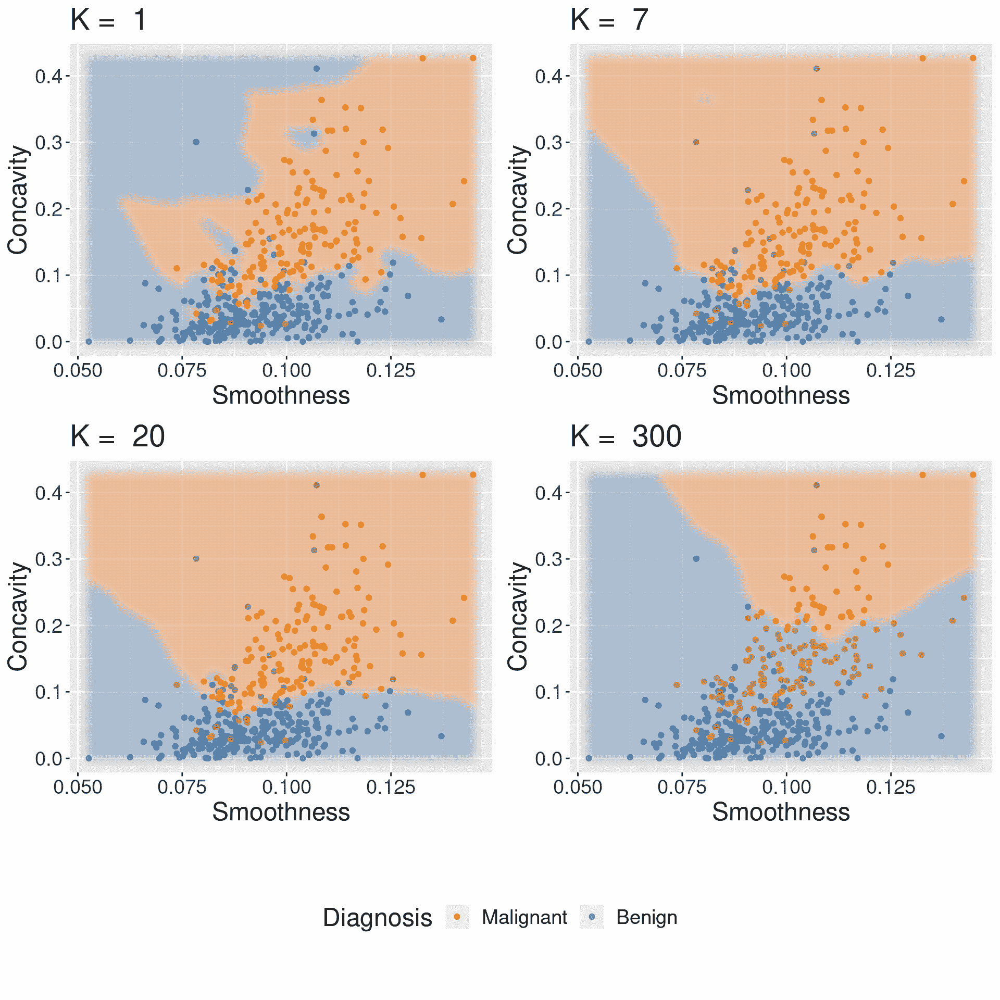

图 6.7：K 在过拟合和欠拟合中的影响。

过拟合和欠拟合都存在问题，会导致模型对新数据的泛化能力不佳。在拟合模型时，我们需要在这两者之间找到一个平衡点。您可以在图 6.7 中看到这两个效果，该图显示了当我们设置邻居数量$K$为 1、7、20 和 300 时，分类器是如何变化的。

### 6.6.4 在测试集上评估

现在我们已经调整了 K-NN 分类器，并设置了$K =$ 36，我们已经完成了模型的构建，现在是时候评估其预测在保留的测试数据上的质量了，正如我们在第 6.5.5 节中做的那样。我们首先需要使用所选的邻居数量在整个训练数据集上重新训练 K-NN 分类器。

```r
cancer_recipe <- recipe(Class ~ Smoothness + Concavity, data = cancer_train) |>
 step_scale(all_predictors()) |>
 step_center(all_predictors())

knn_spec <- nearest_neighbor(weight_func = "rectangular", neighbors = best_k) |>
 set_engine("kknn") |>
 set_mode("classification")

knn_fit <- workflow() |>
 add_recipe(cancer_recipe) |>
 add_model(knn_spec) |>
 fit(data = cancer_train)

knn_fit
```

```r
## ══ Workflow [trained] ══════════════════════════════════════════════════════════
## Preprocessor: Recipe
## Model: nearest_neighbor()
## 
## ── Preprocessor ────────────────────────────────────────────────────────────────
## 2 Recipe Steps
## 
## • step_scale()
## • step_center()
## 
## ── Model ───────────────────────────────────────────────────────────────────────
## 
## Call:
## kknn::train.kknn(formula = ..y ~ ., data = data, ks = min_rows(36,     data, 5), kernel = ~"rectangular")
## 
## Type of response variable: nominal
## Minimal misclassification: 0.1150235
## Best kernel: rectangular
## Best k: 36
```

然后为了对测试数据上最佳模型的估计准确性进行预测和评估，我们使用与本章早期相同的方法，使用`predict`和`metrics`函数。然后我们可以将这些预测传递给`precision`、`recall`和`conf_mat`函数，以评估估计的精确度和召回率，并打印出混淆矩阵。

```r
cancer_test_predictions <- predict(knn_fit, cancer_test) |>
 bind_cols(cancer_test)

cancer_test_predictions |>
 metrics(truth = Class, estimate = .pred_class) |>
 filter(.metric == "accuracy")
```

```r
## # A tibble: 1 × 3
##   .metric  .estimator .estimate
##   <chr>    <chr>          <dbl>
## 1 accuracy binary         0.860
```

```r
cancer_test_predictions |>
 precision(truth = Class, estimate = .pred_class, event_level="first")
```

```r
## # A tibble: 1 × 3
##   .metric   .estimator .estimate
##   <chr>     <chr>          <dbl>
## 1 precision binary           0.8
```

```r
cancer_test_predictions |>
 recall(truth = Class, estimate = .pred_class, event_level="first")
```

```r
## # A tibble: 1 × 3
##   .metric .estimator .estimate
##   <chr>   <chr>          <dbl>
## 1 recall  binary         0.830
```

```r
confusion <- cancer_test_predictions |>
 conf_mat(truth = Class, estimate = .pred_class)
confusion
```

```r
##            Truth
## Prediction  Malignant Benign
##   Malignant        44     11
##   Benign            9     79
```

初看之下，这有点令人惊讶：尽管调整了邻居的数量，分类器的准确度只改变了一小部分！我们最初的模型（$K =$ 3，在我们知道如何调整之前）的估计准确度为 85%，而调整后的模型（$K =$ 36）的估计准确度为 86%。再次查看图 6.5 以查看一系列邻居的交叉验证准确度估计，这个结果就不再那么令人惊讶了。从 1 到大约 96 个邻居，交叉验证准确度估计的变化只有大约 3%，每个估计的标准误差约为 1%。由于交叉验证准确度估计的是测试集准确度，因此测试集准确度变化不大是预期的。此外，注意$K =$ 3 的模型有 77%的精确度和 87%的召回率，而调整后的模型有 80%的精确度和 83%的召回率。鉴于召回率下降——记住，在这个应用中，召回率对于确保我们找到所有患有恶性肿瘤的患者至关重要——在这个设置中，调整后的模型实际上可能更不理想。无论如何，重要的是要批判性地思考调整的结果。调整以最大化准确度的模型不一定适用于特定的应用。

## 6.7 概述

分类算法使用一个或多个定量变量来预测另一个分类变量的值。特别是，K 最近邻算法通过首先找到训练数据中与新的观测值最近的$K$个点，然后从这些训练观测值中返回多数类投票来实现这一点。我们可以通过将数据随机分为训练集和测试集来调整和评估分类器。训练集用于构建分类器，我们可以通过交叉验证最大化估计的准确度来调整分类器（例如，选择 K-NN 中的邻居数量）。在调整好模型后，我们可以使用测试集来估计其准确度。整个过程总结在图 6.8 中。

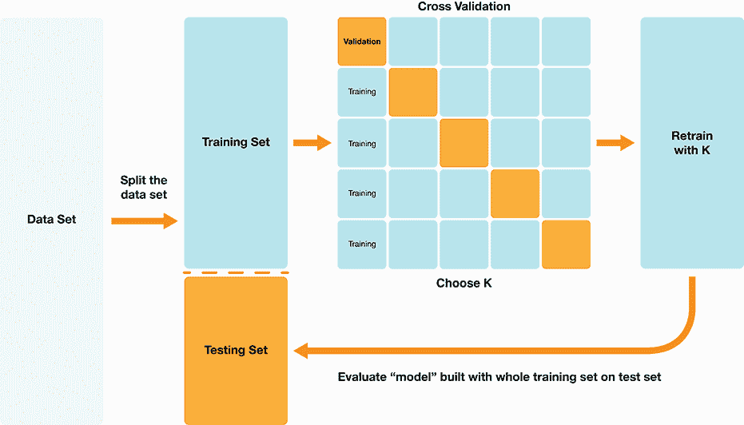

图 6.8：K-NN 分类概述。

使用`tidymodels`执行 K 最近邻分类的整体工作流程如下：

1.  使用`initial_split`函数将数据分为训练集和测试集。将`strata`参数设置为类别标签变量。现在暂时将测试集放在一边。

1.  使用`vfold_cv`函数将训练数据分割用于交叉验证。

1.  创建一个`recipe`，指定类别标签和预测变量，以及所有变量的预处理步骤。将训练数据作为`recipe`的`data`参数传递。

1.  创建一个`nearest_neighbors`模型规范，其中`neighbors = tune()`。

1.  将配方和模型规范添加到`workflow()`中，并在训练/验证拆分上使用`tune_grid`函数来估计不同$K$值范围内的分类器准确度。

1.  选择一个$K$值，它产生高准确度估计，并且当$K$改变到附近的值时，估计不会变化太多。

1.  为最佳参数值（即$K$）创建一个新的模型规范，并使用`fit`函数重新训练分类器。

1.  使用`predict`函数在测试集上评估分类器的估计准确度。

在这两章的最后，我们专注于 K 近邻算法，但我们可以使用许多其他方法来预测分类标签。所有算法都有其优点和缺点，我们在这里总结了 K-NN 的这些特点。

**优点：** K 近邻分类

1.  是一个简单直观的算法，

1.  对数据必须看起来像什么几乎没有假设，

1.  适用于二元（两类）和多类（多于两类）分类问题。

**弱点：** K 近邻分类

1.  当训练数据量增大时变得非常慢，

1.  可能不会在大量预测变量的情况下表现良好，

1.  当类别不平衡时可能表现不佳，

## 6.8 预测变量选择

> **注意：** 本节不是教科书其余部分的要求阅读内容。它包括给那些对学习不相关变量如何影响分类器性能以及如何选择有用的变量子集作为预测变量感兴趣的读者。

调整你的分类器时，另一个可能重要的部分是选择你的数据中哪些变量将被视为预测变量。技术上，你可以从使用单个预测变量到使用数据中的每一个变量进行选择；K 近邻算法接受任何数量的预测变量。然而，使用更多预测变量并不总是能带来更好的预测！实际上，有时包括不相关预测变量可能会实际上对分类器性能产生负面影响。

### 6.8.1 不相关预测变量的影响

让我们来看一个例子，其中 K 近邻算法在给定更多预测变量时表现更差。在这个例子中，我们将乳腺癌数据修改为仅包含原始数据中的`Smoothness`、`Concavity`和`Perimeter`变量。然后，我们添加了我们自己使用随机数生成器创建的不相关变量。这些不相关变量对于每个观测值，其值为 0 或 1 的概率相等，无论`Class`变量的值如何。换句话说，不相关变量与`Class`变量之间没有有意义的关联。

```r
cancer_irrelevant |>
 select(Class, Smoothness, Concavity, Perimeter, Irrelevant1, Irrelevant2)
```

```r
## # A tibble: 569 × 6
##    Class     Smoothness Concavity Perimeter Irrelevant1 Irrelevant2
##    <fct>          <dbl>     <dbl>     <dbl>       <dbl>       <dbl>
##  1 Malignant     0.118     0.300      123\.            1           0
##  2 Malignant     0.0847    0.0869     133\.            0           0
##  3 Malignant     0.110     0.197      130             0           0
##  4 Malignant     0.142     0.241       77.6           0           1
##  5 Malignant     0.100     0.198      135\.            0           0
##  6 Malignant     0.128     0.158       82.6           1           0
##  7 Malignant     0.0946    0.113      120\.            0           1
##  8 Malignant     0.119     0.0937      90.2           1           0
##  9 Malignant     0.127     0.186       87.5           0           0
## 10 Malignant     0.119     0.227       84.0           1           1
## # ℹ 559 more rows
```

接下来，我们构建了一系列包含`平滑度`、`凹度`和`周长`作为预测变量的 K-NN 分类器，同时也包含越来越多的无关变量。特别是，我们创建了包含 0、5、10、15、20 和 40 个无关预测因子的 6 个数据集。然后，我们为每个数据集构建了一个通过 5 折交叉验证调整的模型。图 6.9 显示了估计的交叉验证准确率与无关预测因子数量的关系。随着我们添加更多的无关预测变量，我们分类器的估计准确率下降。这是因为无关变量会给每对观测值之间的距离添加一个随机量；无关变量越多，它们的影响就越大，也就越容易破坏对新观测值进行类别预测的最近邻集。

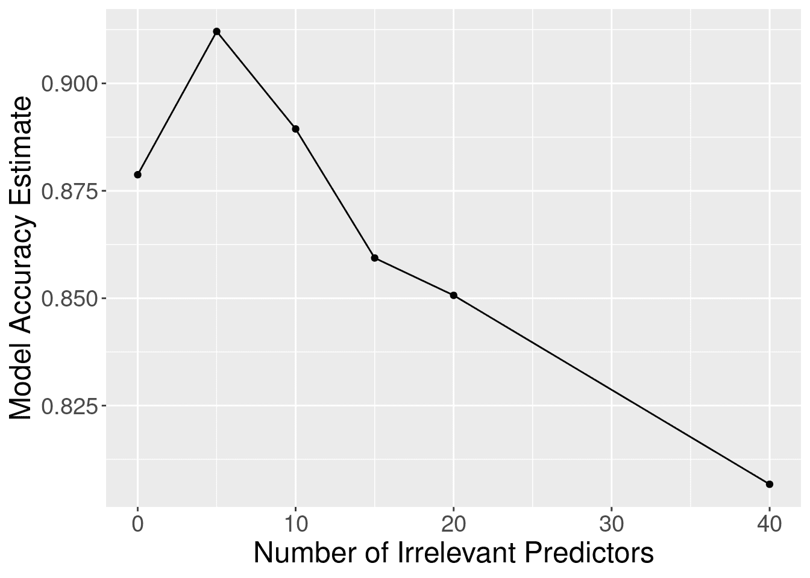

图 6.9：包含无关预测因子的影响。

虽然准确率如预期的那样下降，但图 6.9 中一个令人惊讶的事情是它显示，即使在有 40 个无关变量的情况下，该方法仍然优于基线多数分类器（准确率约为 63%）。这怎么可能呢？图 6.10 提供了答案：K-近邻分类器的调整过程通过增加邻居的数量来对抗无关变量带来的额外随机性。当然，由于无关变量带来的所有额外噪声，邻居的数量不会平滑地增加；但总体趋势是增加的。图 6.11 证实了这一证据；如果我们把邻居的数量固定为$K=3$，准确率会更快地下降。

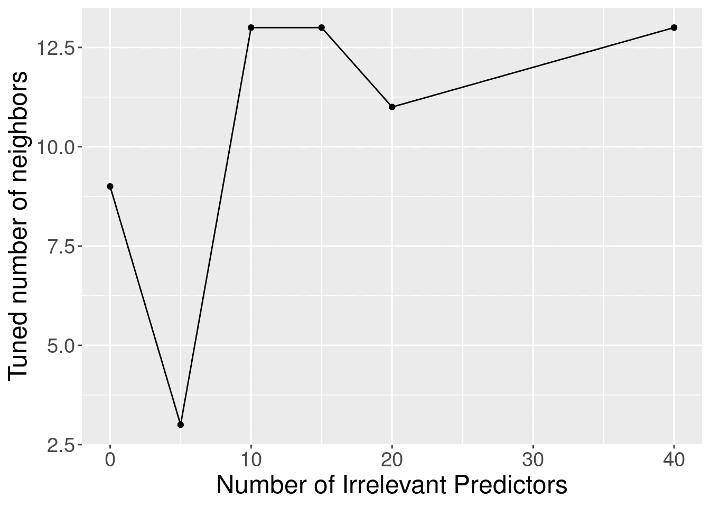

图 6.10：不同数量无关预测因子下的调整邻居数量。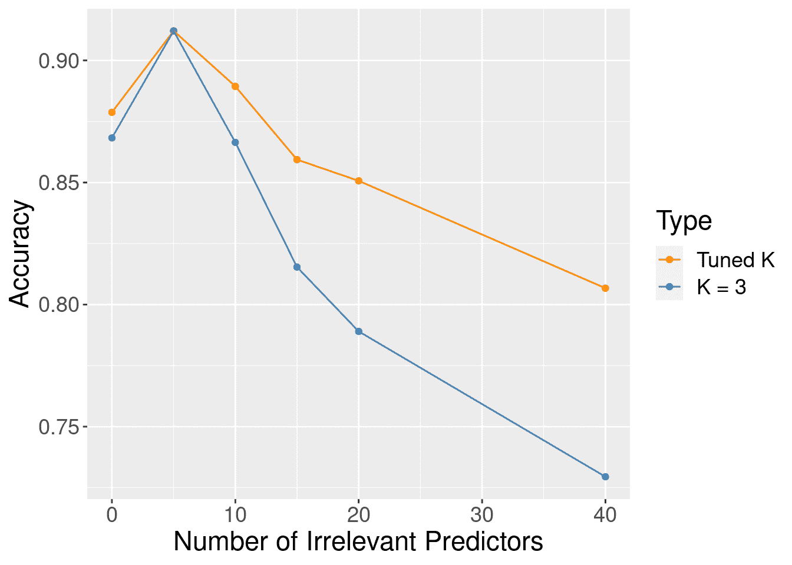

图 6.11：调整和未调整邻居数量的准确率与无关预测因子数量之间的关系。

### 6.8.2 寻找一组好的预测变量子集

那么，如果我们不考虑理想情况，使用所有变量作为预测因子，这显然是不理想的，我们应该如何选择我们**应该**使用的变量呢？一个简单的方法是依靠你对数据的科学理解来判断哪些变量不太可能是有用的预测因子。例如，在我们一直在研究的癌症数据中，`ID`变量只是观察的一个唯一标识符。由于它与细胞测量的任何属性无关，因此`ID`变量不应作为预测因子使用。当然，这是一个非常明确的情况。但剩余变量的选择则不那么明显，因为它们似乎都是合理的候选人。不清楚哪个子集将创建最佳的分类器。人们可以使用可视化和其他探索性分析来尝试帮助理解哪些变量可能是相关的，但这个过程在考虑许多变量时既耗时又容易出错。因此，我们需要一种更系统和程序化的方法来选择变量。在一般情况下，这是一个非常难以解决的问题，已经开发出许多适用于特定感兴趣情况的方法。在这里，我们将讨论两种基本选择方法，作为对这个主题的介绍。请参阅本章末尾的附加资源，以了解您可以在哪里了解更多关于变量选择的信息，包括更高级的方法。

你可能会想到的第一个用于系统选择预测因子的方法是尝试所有可能的预测因子子集，然后选择导致“最佳”分类器的集合。这种方法确实是一种众所周知的变量选择方法，被称为**最佳子集选择**（Beale, Kendall, and Mann 1967; Hocking and Leslie 1967）。特别是，你

1.  为每个可能的预测因子子集创建一个单独的模型。

1.  使用交叉验证调整每一个，

1.  选择给出最高交叉验证准确率的预测因子子集。

最佳子集选择适用于任何分类方法（K-NN 或其他）。然而，当你有相当数量的预测变量可供选择时（比如说，大约 10 个），它就会变得非常慢。这是因为可能的预测变量子集的数量会随着预测变量数量的增加而迅速增长，你必须为每一个子集训练模型（这本身就是一个缓慢的过程！）。例如，如果我们有 2 个预测变量——让我们称它们为 A 和 B——那么我们有 3 个变量集要尝试：只有 A，只有 B，最后是 A 和 B 一起。如果我们有 3 个预测变量——A，B 和 C——那么我们有 7 个要尝试：A，B，C，AB，BC，AC 和 ABC。一般来说，我们需要为$m$个预测变量训练的模型数量是$2^m-1$；换句话说，当我们达到 10 个预测变量时，我们需要训练超过*一千*个模型，而当有 20 个预测变量时，我们需要训练超过*一百万*个模型！所以尽管这是一个简单的方法，但最佳子集选择通常在实践中的计算成本太高，难以使用。

另一个想法是通过每次添加一个预测变量来迭代构建模型。这种方法——称为*前向选择*（Eforymson 1966；Draper and Smith 1966）——也适用范围广泛，相当直接。它包括以下步骤：

1.  从一个没有预测变量的模型开始。

1.  运行以下 3 个步骤，直到没有预测变量为止：

    1.  对于每个未使用的预测变量，将其添加到模型中，形成一个*候选模型*。

    1.  调整所有候选模型。

    1.  更新模型，使其成为具有最高交叉验证精度的候选模型。

1.  选择在精度和简单性之间提供最佳权衡的模型。

假设你有$m$个总的预测变量可供使用。在第一次迭代中，你必须制作$m$个候选模型，每个模型有 1 个预测变量。然后在第二次迭代中，你必须制作$m-1$个候选模型，每个模型有 2 个预测变量（你之前选择的那个和一个新的）。这种模式会持续进行，直到你想要进行多少次迭代。如果你将这种方法一直运行到没有可供选择的预测变量为止，你最终将训练$\frac{1}{2}m(m+1)$个单独的模型。这比最佳子集选择要求的$2^m-1$个模型是一个巨大的改进！例如，最佳子集选择需要训练超过 1000 个候选模型，而前向选择只需要训练 55 个候选模型。因此，我们将继续使用前向选择来展开本节的其余部分。

> **注意：** 在我们继续前进之前，有一个警告需要提醒。你训练的每一个额外模型都会增加你运气不佳并偶然发现一个交叉验证准确度估计很高，但在测试数据和未来观察中真实准确度却很低的风险。由于前向选择涉及训练大量模型，你发生这种情况的风险相当高。为了将这种风险降到最低，只有在你拥有大量数据并且预测因子总数相对较小的情况下才使用前向选择。更高级的方法受此问题的影响较小；关于更高级预测因子选择方法的更多信息，请参阅本章末尾的附加资源。

### 6.8.3 R 中的前向选择

现在我们转向在 R 中实现前向选择。不幸的是，使用`tidymodels`框架没有内置的方法来做这件事，所以我们将不得不自己编写代码。首先，我们将使用`select`函数提取一个较小的预测因子集来在这个示例中使用——`Smoothness`、`Concavity`、`Perimeter`、`Irrelevant1`、`Irrelevant2`和`Irrelevant3`——以及`Class`变量作为标签。我们还将提取所有预测因子的列名。

```r
cancer_subset <- cancer_irrelevant |>
 select(Class,
 Smoothness,
 Concavity,
 Perimeter,
 Irrelevant1,
 Irrelevant2,
 Irrelevant3)

names <- colnames(cancer_subset |> select(-Class))

cancer_subset
```

```r
## # A tibble: 569 × 7
##    Class     Smoothness Concavity Perimeter Irrelevant1 Irrelevant2 Irrelevant3
##    <fct>          <dbl>     <dbl>     <dbl>       <dbl>       <dbl>       <dbl>
##  1 Malignant     0.118     0.300      123\.            1           0           1
##  2 Malignant     0.0847    0.0869     133\.            0           0           0
##  3 Malignant     0.110     0.197      130             0           0           0
##  4 Malignant     0.142     0.241       77.6           0           1           0
##  5 Malignant     0.100     0.198      135\.            0           0           0
##  6 Malignant     0.128     0.158       82.6           1           0           1
##  7 Malignant     0.0946    0.113      120\.            0           1           1
##  8 Malignant     0.119     0.0937      90.2           1           0           0
##  9 Malignant     0.127     0.186       87.5           0           0           1
## 10 Malignant     0.119     0.227       84.0           1           1           0
## # ℹ 559 more rows
```

前向选择代码的关键思想是使用`paste`函数（它将用空格分隔的字符串连接起来）为我们要构建模型的每个预测因子子集创建一个模型公式。`collapse`参数告诉`paste`在列表项之间放置什么；为了创建一个公式，我们需要在变量之间放置一个`+`符号。作为一个例子，让我们为所有预测因子创建一个模型公式，它应该输出类似`Class ~ Smoothness + Concavity + Perimeter + Irrelevant1 + Irrelevant2 + Irrelevant3`的内容：

```r
example_formula <- paste("Class", "~", paste(names, collapse="+"))
example_formula
```

```r
## [1] "Class ~ Smoothness+Concavity+Perimeter+Irrelevant1+Irrelevant2+Irrelevant3"
```

最后，我们需要编写一些代码来执行逐个寻找最佳预测因子添加到模型中的任务。如果你还记得整理章节的结尾，我们提到有时需要比我们之前使用的更灵活的迭代形式，在这些情况下，人们通常求助于一个*for 循环*；请参阅*《R for Data Science》*中的[迭代章节](https://r4ds.had.co.nz/iteration.html)（Wickham 和 Grolemund 2016）。在这里，我们将使用两个 for 循环：一个用于增加预测因子集的大小（下面可以看到`for (i in 1:length(names))`），另一个用于检查每一轮要添加哪个预测因子（下面可以看到`for (j in 1:length(names))`）。对于要尝试的每个预测因子集，我们构建一个模型公式，将其传递给一个`recipe`，构建一个使用 5 折交叉验证调整 K-NN 分类器的`workflow`，并最终记录估计的准确度。

```r
# create an empty tibble to store the results
accuracies <- tibble(size = integer(),
 model_string = character(),
 accuracy = numeric())

# create a model specification
knn_spec <- nearest_neighbor(weight_func = "rectangular",
 neighbors = tune()) |>
 set_engine("kknn") |>
 set_mode("classification")

# create a 5-fold cross-validation object
cancer_vfold <- vfold_cv(cancer_subset, v = 5, strata = Class)

# store the total number of predictors
n_total <- length(names)

# stores selected predictors
selected <- c()

# for every size from 1 to the total number of predictors
for (i in 1:n_total) {
 # for every predictor still not added yet
 accs <- list()
 models <- list()
 for (j in 1:length(names)) {
 # create a model string for this combination of predictors
 preds_new <- c(selected, names[[j]])
 model_string <- paste("Class", "~", paste(preds_new, collapse="+"))

 # create a recipe from the model string
 cancer_recipe <- recipe(as.formula(model_string),
 data = cancer_subset) |>
 step_scale(all_predictors()) |>
 step_center(all_predictors())

 # tune the K-NN classifier with these predictors,
 # and collect the accuracy for the best K
 acc <- workflow() |>
 add_recipe(cancer_recipe) |>
 add_model(knn_spec) |>
 tune_grid(resamples = cancer_vfold, grid = 10) |>
 collect_metrics() |>
 filter(.metric == "accuracy") |>
 summarize(mx = max(mean))
 acc <- acc$mx |> unlist()

 # add this result to the dataframe
 accs[[j]] <- acc
 models[[j]] <- model_string
 }
 jstar <- which.max(unlist(accs))
 accuracies <- accuracies |>
 add_row(size = i,
 model_string = models[[jstar]],
 accuracy = accs[[jstar]])
 selected <- c(selected, names[[jstar]])
 names <- names[-jstar]
}
accuracies
```

```r
## # A tibble: 6 × 3
##    size model_string                                                    accuracy
##   <int> <chr>                                                              <dbl>
## 1     1 Class ~ Perimeter                                                  0.896
## 2     2 Class ~ Perimeter+Concavity                                        0.916
## 3     3 Class ~ Perimeter+Concavity+Smoothness                             0.931
## 4     4 Class ~ Perimeter+Concavity+Smoothness+Irrelevant1                 0.928
## 5     5 Class ~ Perimeter+Concavity+Smoothness+Irrelevant1+Irrelevant3     0.924
## 6     6 Class ~ Perimeter+Concavity+Smoothness+Irrelevant1+Irrelevant3…    0.902
```

好奇！前向选择过程首先添加了三个有意义的变量 `Perimeter`（周长）、`Concavity`（凹度）和 `Smoothness`（平滑度），然后是无关变量。图 6.12 可视化了模型中预测变量数量与准确率之间的关系。你可以看到，随着有意义的预测变量的添加，估计的准确率显著提高；而当你添加无关变量时，准确率要么表现出小幅波动，要么随着模型尝试调整邻居数量以解释额外的噪声而下降。为了从序列中挑选出合适的模型，你必须平衡高准确率和模型简单性（即拥有更少的预测变量和更低的过拟合风险）。找到这种平衡的方法是寻找图 6.12 中的 *肘部*，即图表上准确率停止急剧增加并趋于平稳或开始下降的位置。图 6.12 中的肘部似乎出现在具有 3 个预测变量的模型处；在此之后，准确率趋于平稳。因此，在这里，准确率和预测变量数量的最佳权衡发生在 3 个变量上：`Class ~ Perimeter + Concavity + Smoothness`。换句话说，我们已经成功从模型中移除了无关的预测变量！然而，始终值得记住的是，交叉验证给你提供的是对真实准确率的 *估计*；在查看此图表时，你必须运用你的判断力来决定肘部的位置，以及添加变量是否提供了有意义的准确率提升。

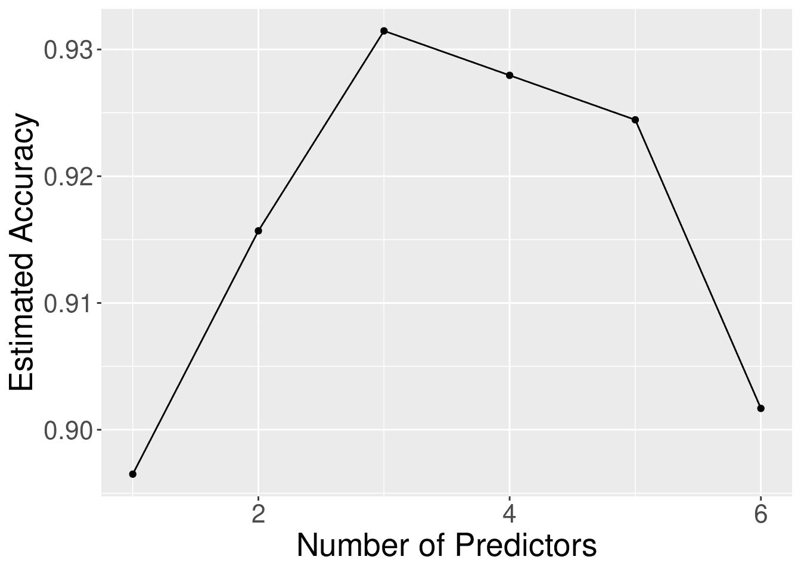

图 6.12：使用前向选择构建的模型序列的预测变量数量与估计准确率的关系图

> **注意：** 由于选择哪些变量作为预测变量是调整你的分类器的一部分，因此你 *不能使用你的测试数据* 进行此过程！

## 6.9 练习

本章涵盖的练习可以在配套的 [worksheets 仓库](https://worksheets.datasciencebook.ca) 中找到，位于“分类 II：评估和调整”行。你可以通过点击“launch binder”按钮在你的浏览器中启动工作表的交互式版本。你也可以通过点击“view worksheet”预览工作表的非交互式版本。如果你决定下载工作表并在自己的机器上运行它，请确保遵循第十三章中找到的计算机设置说明。这将确保工作表提供的自动反馈和指导按预期工作。

## 6.10 补充资源

+   [`tidymodels` 网站](https://tidymodels.org/packages) 是了解前两章中函数和包的更多细节以及高级使用的优秀参考。除此之外，它还有一个[优秀的入门教程](https://www.tidymodels.org/start/)和[一个广泛的更高级示例列表](https://www.tidymodels.org/learn/)，你可以使用这些示例在本书范围之外继续学习。值得注意的是，`tidymodels` 包不仅仅用于分类，因此网站上的示例也超出了分类的范围。在接下来的两章中，你将学习另一种预测建模设置，因此你可能只在这些章节阅读完毕后再访问该网站。

+   *《统计学习引论》* (James 等人 2013) 在学习分类的过程中提供了一个很好的下一步。第四章讨论了分类的附加基本技术，这些技术我们没有涉及，例如逻辑回归、线性判别分析和朴素贝叶斯。第五章深入探讨了交叉验证。第八章和第九章涵盖了决策树和支持向量机，这两种非常流行但更高级的分类方法。最后，第六章介绍了选择预测变量的多种方法。请注意，尽管这本书仍然是一本非常易于理解的入门教材，但它比我们要求的数学背景要深一些。

### 参考文献

Beale, Evelyn Martin Lansdowne, Maurice George Kendall, 和 David Mann. 1967. “多变量分析中变量的剔除。” *Biometrika* 54 (3-4): 357–66. Draper, Norman 和 Harry Smith. 1966. *应用回归分析*. Wiley. Eforymson, M. 1966. “逐步回归——回顾过去和未来。” 在 *数学统计学会东部区域会议* 中。Hocking, Ronald 和 R. N. Leslie. 1967. “回归分析中选择最佳子集。” *Technometrics* 9 (4): 531–40. James, Gareth, Daniela Witten, Trevor Hastie 和 Robert Tibshirani. 2013. *统计学习引论*. 第 1 版. Springer. [`www.statlearning.com/`](https://www.statlearning.com/). Street, William Nick, William Wolberg 和 Olvi Mangasarian. 1993. “用于乳腺肿瘤诊断的核特征提取。” 在 *国际电子成像：科学和技术研讨会* 中。Wickham, Hadley 和 Garrett Grolemund. 2016. *R 语言数据科学：导入、整理、转换、可视化和建模数据*. O’Reilly. [`r4ds.had.co.nz/`](https://r4ds.had.co.nz/).
