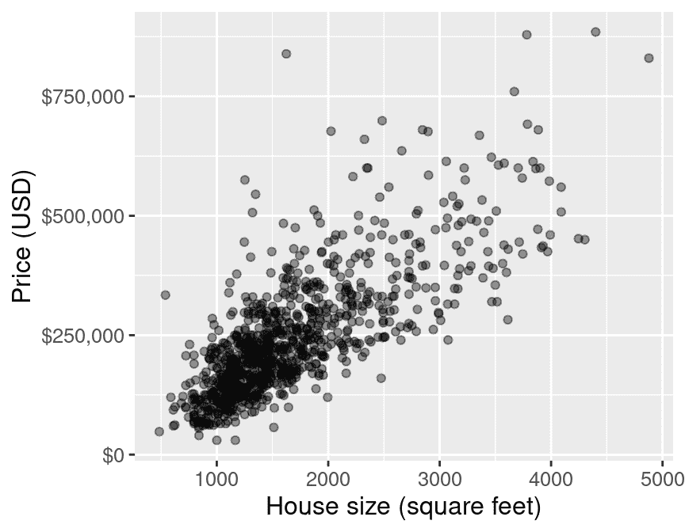
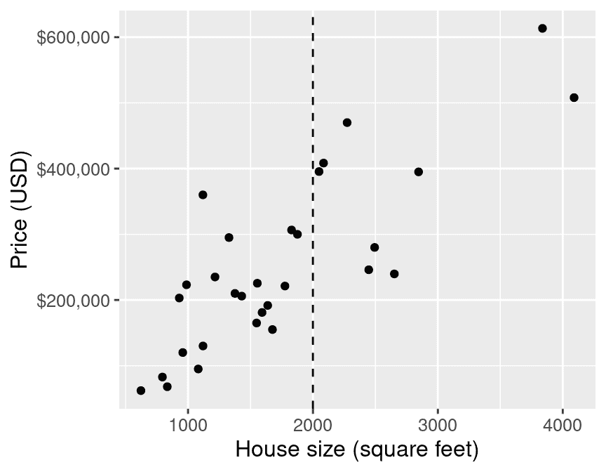
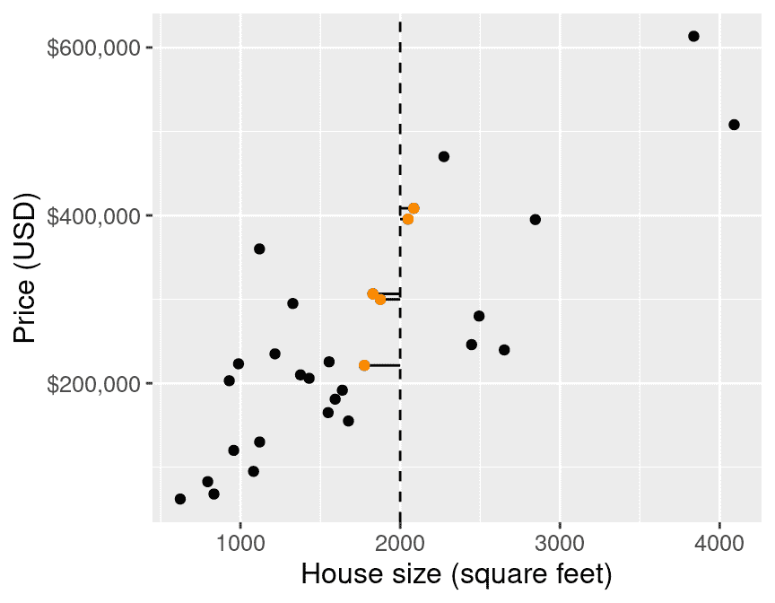
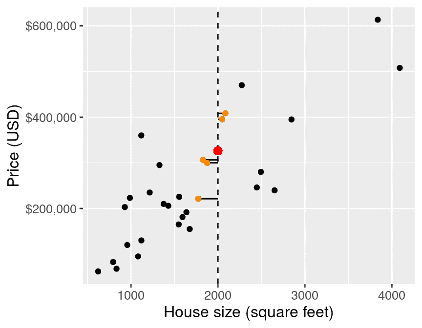
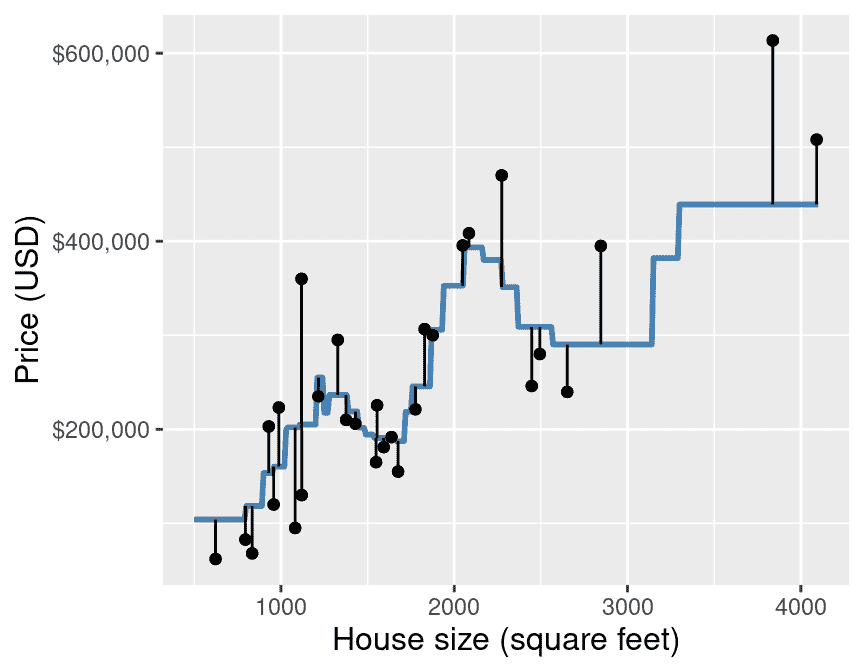
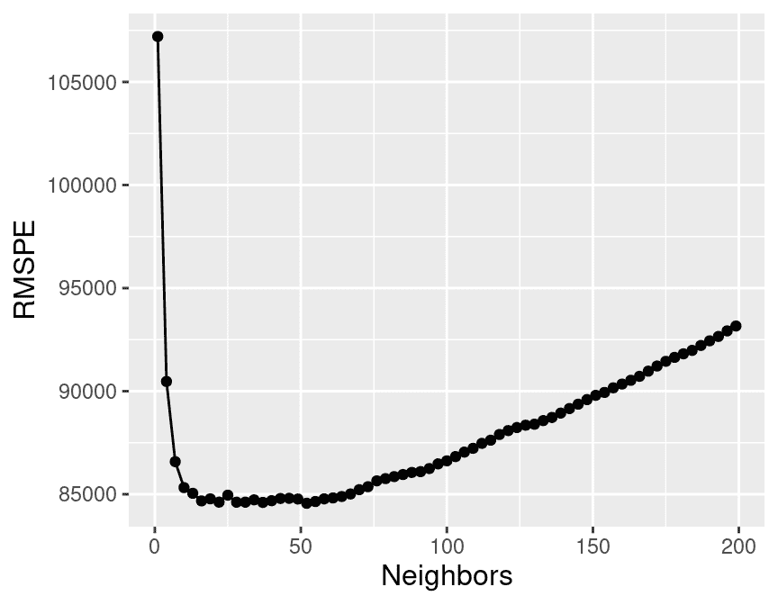
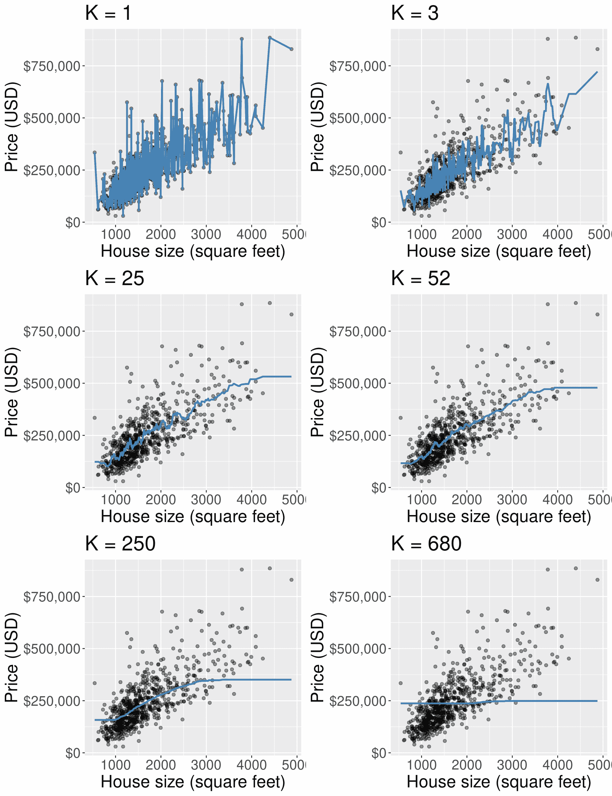
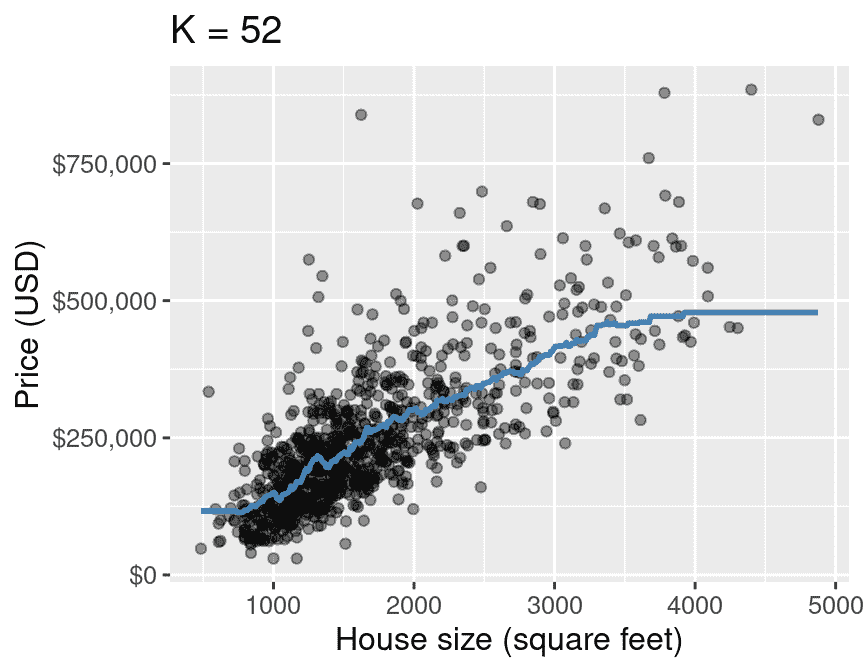
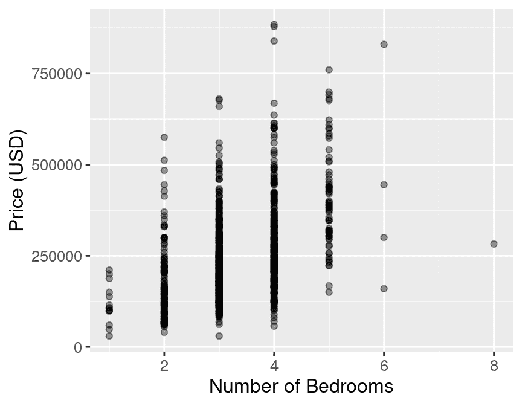

# 第七章 回归 I：K 最近邻

> 原文：[`datasciencebook.ca/regression1.html`](https://datasciencebook.ca/regression1.html)

## 7.1 概述

本章继续我们探索回答预测问题的旅程。在这里，我们将专注于预测*数值*变量，并使用*回归*来完成这项任务。这与前两章不同，前两章专注于通过分类预测分类变量。然而，回归与分类有许多相似之处：例如，就像在分类的情况下，我们将我们的数据分为训练集、验证集和测试集，我们将使用`tidymodels`工作流程，我们将使用 K 最近邻（K-NN）方法进行预测，我们将使用交叉验证来选择 K。由于这些程序如此相似，在阅读本章之前，请务必阅读第五章和第六章——我们将在这里更快地介绍已经覆盖的概念。本章将主要关注只有一个预测变量的情况，但本章的结尾展示了如何进行包含多个预测变量的回归，即*多元回归*。需要注意的是，回归也可以用来回答推断和因果问题，但这超出了本书的范围。

## 7.2 章节学习目标

在本章结束时，读者将能够做到以下事项：

+   识别适合进行预测分析的情境。

+   解释 K 最近邻（K-NN）回归算法，并描述它与 K-NN 分类的不同之处。

+   解释 K-NN 回归的输出。

+   在包含两个或更多变量的数据集中，使用 R 执行 K 最近邻回归。

+   使用均方根预测误差（RMSPE）在 R 中评估 K-NN 回归预测质量。

+   使用交叉验证或测试集在 R 中估计 RMSPE。

+   通过最小化估计的交叉验证均方根预测误差（RMSPE）来选择 K 最近邻回归中的邻居数量。

+   描述欠拟合和过拟合，并将其与 K 最近邻回归中的邻居数量联系起来。

+   描述 K 最近邻回归的优点和缺点。

## 7.3 回归问题

回归，就像分类一样，是一个预测性问题设置，我们希望利用过去的信息来预测未来的观测值。但在回归的情况下，目标是预测*数值*而不是*类别*值。你想要预测的变量通常被称为*响应变量*。例如，我们可以尝试使用一个人每周花在锻炼上的小时数来预测他们在年度波士顿马拉松的赛跑时间。另一个例子，我们可以尝试使用房屋的大小来预测其销售价格。这两个响应变量——赛跑时间和销售价格——都是数值，因此根据过去的数据预测它们被认为是回归问题。

就像在分类设置中一样，有许多可能的方法我们可以用来预测数值响应变量。在本章中，我们将重点介绍**K 最近邻**算法(Fix and Hodges 1951；Cover and Hart 1967)，在下一章中我们将研究**线性回归**。在你的未来研究中，你可能会遇到回归树、样条和一般局部回归方法；下一章末尾的附加资源部分提供了开始学习这些其他方法的起点。

许多来自分类的概念可以映射到回归的设置中。例如，回归模型根据过去观测数据集中相似观测值的响应变量来预测新观测值的响应变量。在构建回归模型时，我们首先将数据分为训练集和测试集，以确保我们评估的方法在训练期间未看到的观测值上的性能。最后，我们可以使用交叉验证来评估不同模型参数选择（例如，K 在 K 最近邻模型中）。主要区别在于我们现在预测的是数值变量而不是类别变量。

> **注意：**通常你可以通过从你的数据中取两个观测值 X 和 Y 的响应变量，并问自己，“响应变量 X 是否比响应变量 Y*多*？”来判断一个变量是数值的还是类别的——因此是否需要执行回归或分类。如果变量是类别的，这个问题将没有意义。（蓝色是否比红色多？良性是否比恶性多？）如果变量是数值的，它将是有意义的。（1.5 小时是否比 2.25 小时多？$500,000 是否比$400,000 多？）但是，在应用这个启发式方法时要小心：有时类别变量在你的数据中会被编码为数字（例如，“1”代表“良性”，而“0”代表“恶性”）。在这些情况下，你必须询问标签的*意义*（“良性”和“恶性”），而不是它们的值（“1”和“0”）。

## 7.4 探索数据集

在本章和下一章中，我们将研究一个数据集，该数据集包含加利福尼亚州萨克拉门托的[932 笔房地产交易](https://support.spatialkey.com/spatialkey-sample-csv-data/)，最初在《萨克拉门托蜜蜂报》上报道。我们首先需要制定一个精确的问题，这是我们想要回答的问题。在这个例子中，我们的问题仍然是预测性的：我们能否使用萨克拉门托，加利福尼亚地区房屋的大小来预测其销售价格？对这个问题的严格、定量的回答可能有助于房地产经纪人向客户建议某个特定列表的价格是否合理，或者如何设定新列表的价格。我们开始分析，通过加载数据、检查数据并设置种子值。

```r
library(tidyverse)
library(tidymodels)
library(gridExtra)

set.seed(5)

sacramento <- read_csv("data/sacramento.csv")
sacramento
```

```r
## # A tibble: 932 × 9
##    city           zip     beds baths  sqft type        price latitude longitude
##    <chr>          <chr>  <dbl> <dbl> <dbl> <chr>       <dbl>    <dbl>     <dbl>
##  1 SACRAMENTO     z95838     2     1   836 Residential 59222     38.6     -121.
##  2 SACRAMENTO     z95823     3     1  1167 Residential 68212     38.5     -121.
##  3 SACRAMENTO     z95815     2     1   796 Residential 68880     38.6     -121.
##  4 SACRAMENTO     z95815     2     1   852 Residential 69307     38.6     -121.
##  5 SACRAMENTO     z95824     2     1   797 Residential 81900     38.5     -121.
##  6 SACRAMENTO     z95841     3     1  1122 Condo       89921     38.7     -121.
##  7 SACRAMENTO     z95842     3     2  1104 Residential 90895     38.7     -121.
##  8 SACRAMENTO     z95820     3     1  1177 Residential 91002     38.5     -121.
##  9 RANCHO_CORDOVA z95670     2     2   941 Condo       94905     38.6     -121.
## 10 RIO_LINDA      z95673     3     2  1146 Residential 98937     38.7     -121.
## # ℹ 922 more rows
```

科学问题指导我们的初步探索：我们感兴趣的数据集中的列是`sqft`（房屋大小，以可居住平方英尺计）和`price`（房屋销售价格，以美元（USD）计）。第一步是将数据可视化为散点图，我们将预测变量（房屋大小）放在 x 轴上，我们将我们想要预测的响应变量（销售价格）放在 y 轴上。

> **注意：**鉴于图 7.1 中的 y 轴单位是美元，我们格式化轴标签，在房屋价格前放置美元符号，以及逗号以增加较大数字的可读性。我们可以在 R 中通过将`dollar_format`函数（来自`scales`包）传递给`scale_y_continuous`函数的`labels`参数来实现这一点。

```r
eda <- ggplot(sacramento, aes(x = sqft, y = price)) +
 geom_point(alpha = 0.4) +
 xlab("House size (square feet)") +
 ylab("Price (USD)") +
 scale_y_continuous(labels = dollar_format()) +
 theme(text = element_text(size = 12))

eda
```



图 7.1：价格（美元）与房屋大小（平方英尺）的散点图。

图表显示在图 7.1 中。我们可以看到，在萨克拉门托，加利福尼亚，随着房屋大小的增加，其销售价格也增加。因此，我们可以推断，我们可能能够使用尚未售出的房屋的大小（我们不知道其销售价格）来预测其最终销售价格。请注意，我们在此处并不建议更大的房屋大小*导致*更高的销售价格；只是房屋价格往往随着房屋大小而增加，我们可能能够使用后者来预测前者。

## 7.5 K-最近邻回归

与分类的情况类似，我们可以在回归中使用基于 K-最近邻的方法进行预测。在我们深入创建模型并评估其预测房屋销售价格的效果之前，让我们先从图 7.1 中的数据样本开始，了解 K-最近邻（K-NN）在回归环境中的工作原理。这个子样本是为了让我们能够用几个数据点来说明 K-NN 回归的机制；在本章的后面部分，我们将使用所有数据。

为了获取一个大小为 30 的小随机样本，我们将使用`slice_sample`函数，并输入用于采样的数据框和要随机选择的行数。

```r
small_sacramento <- slice_sample(sacramento, n = 30)
```

接下来，假设我们在萨克拉门托市发现了一座我们感兴趣购买的 2,000 平方英尺的房子，其广告标价为$350,000。我们应该出价购买这个房子的要价，还是它标价过高，我们应该出价更低？如果没有其他信息，我们可以通过使用我们已有的数据来预测基于已观察到的销售价格的销售价格，从而得到这个问题的良好答案。但在图 7.2 中，你可以看到我们没有观察到大小为*正好*2,000 平方英尺的房子。我们如何预测销售价格？

```r
small_plot <- ggplot(small_sacramento, aes(x = sqft, y = price)) +
 geom_point() +
 xlab("House size (square feet)") +
 ylab("Price (USD)") +
 scale_y_continuous(labels = dollar_format()) +
 geom_vline(xintercept = 2000, linetype = "dashed") +
 theme(text = element_text(size = 12))

small_plot
```



图 7.2：价格（美元）与房屋大小（平方英尺）的散点图，x 轴上用垂直线表示 2,000 平方英尺。

我们将采用分类章节中的相同直觉，并使用新感兴趣点的邻近点来建议/预测其销售价格。对于图 7.2 中显示的例子，我们找到并标记了与我们观察到的 2,000 平方英尺房屋的 5 个最近邻居。

```r
nearest_neighbors <- small_sacramento |>
 mutate(diff = abs(2000 - sqft)) |>
 slice_min(diff, n = 5)

nearest_neighbors
```

```r
## # A tibble: 5 × 10
##   city       zip     beds baths  sqft type        price latitude longitude  diff
##   <chr>      <chr>  <dbl> <dbl> <dbl> <chr>       <dbl>    <dbl>     <dbl> <dbl>
## 1 ROSEVILLE  z95661     3   2    2049 Residenti… 395500     38.7     -121\.    49
## 2 ANTELOPE   z95843     4   3    2085 Residenti… 408431     38.7     -121\.    85
## 3 SACRAMENTO z95823     4   2    1876 Residenti… 299940     38.5     -121\.   124
## 4 ROSEVILLE  z95747     3   2.5  1829 Residenti… 306500     38.8     -121\.   171
## 5 SACRAMENTO z95825     4   2    1776 Multi_Fam… 221250     38.6     -121\.   224
```



图 7.3：价格（美元）与房屋大小（平方英尺）的散点图，以及到 5 个最近邻居的线条（用橙色突出显示）。

图 7.3 说明了我们感兴趣的新的 2,000 平方英尺房屋的 5 个最近邻居（按房屋大小）之间的房屋大小差异。现在我们已经获得了这些最近邻居，我们可以使用他们的值来预测新房的销售价格。具体来说，我们可以取这 5 个值的平均值作为我们的预测值，如图 7.4 中的红色点所示。

```r
prediction <- nearest_neighbors |>
 summarise(predicted = mean(price))

prediction
```

```r
## # A tibble: 1 × 1
##   predicted
##       <dbl>
## 1   326324.
```



图 7.4：价格（美元）与房屋大小（平方英尺）的散点图，以及基于 5 个最近邻居的预测价格，用红色点表示。

我们的预测价格是 $326,324（在图 7.4 中以红色点表示），这比 $350,000 少得多；也许我们可能想要以低于广告中列出的标价提供房屋。但这只是故事的开头。在这里，我们仍然有与 K-NN 分类相同的问题，即我们选择哪个 $K$，我们的模型在做出预测方面是否表现良好？在接下来的几节中，我们将针对 K-NN 回归的上下文来解答这些问题。

在此，我们想强调 K-NN 回归算法的一个优点，即它能够很好地处理非线性关系（即，如果关系不是一条直线）。这源于使用最近邻来预测值。该算法实际上对数据必须具有什么样子才能工作几乎没有假设。

## 7.6 训练、评估和调整模型

如同往常，我们必须首先将一些测试数据放在一个保险箱中，我们将在选择最终模型后再回来查看。现在就让我们处理这个问题。请注意，在本章的剩余部分，我们将使用整个萨克拉门托数据集，而不是我们在本章早期使用的较小的 30 个点的样本（见图 7.2）。

```r
sacramento_split <- initial_split(sacramento, prop = 0.75, strata = price)
sacramento_train <- training(sacramento_split)
sacramento_test <- testing(sacramento_split)
```

接下来，我们将使用交叉验证来选择 $K$。在 K-NN 分类中，我们使用准确率来查看我们的预测与真实标签匹配得如何。在回归设置中，我们不能使用相同的指标，因为我们的预测几乎永远不会 *完全* 匹配真实响应变量的值。因此，在 K-NN 回归的背景下，我们将使用均方根预测误差（RMSPE）代替。计算 RMSPE 的数学公式是：

$$\text{RMSPE} = \sqrt{\frac{1}{n}\sum\limits_{i=1}^{n}(y_i - \hat{y}_i)²}$$

其中：

+   $n$ 是观测数，

+   $y_i$ 是第 $i^\text{th}$ 次观察的观测值，并且

+   $\hat{y}_i$ 是第 $i^\text{th}$ 次观察的预测/预测值。

换句话说，我们计算测试（或验证）集中每个观测值的预测值与真实响应值之间的*平方*差异，计算平均值，然后最后取平方根。我们使用*平方*差异（而不是差异）的原因是差异可以是正的或负的，即我们可以高估或低估真实响应值。图 7.5 展示了预测值与真实响应值之间的正负差异。因此，如果我们想衡量误差——即我们的预测值与真实响应值之间的距离——我们想要确保我们只累加正数，较大的正数代表较大的错误。如果预测值非常接近真实值，那么 RMSPE 将会很小。相反，如果预测值与真实值差异很大，那么 RMSPE 将会相当大。当我们使用交叉验证时，我们将选择给出最小 RMSPE 的$K$值。



图 7.5：价格（美元）与房屋面积（平方英尺）的散点图，包括示例预测（蓝色线条）以及与真实响应值的误差比较（垂直线条）。

> **注意：** 当使用许多代码包（包括`tidymodels`）时，我们将得到的评估输出用于评估我们的 K-NN 回归模型的预测质量，被标记为“RMSE”，即“均方根误差”。为什么是这样，而不是 RMSPE？在统计学中，我们试图用非常精确的语言来表示我们是在计算训练数据上的预测误差（*样本内*预测）还是在测试数据上的预测误差（*样本外*预测）。当在训练数据上预测和评估预测质量时，我们说 RMSE。相比之下，当在测试或验证数据上预测和评估预测质量时，我们说 RMSPE。计算 RMSE 和 RMSPE 的公式完全相同；唯一不同的是$y$是训练数据还是测试数据。但许多人只是使用 RMSE，并依赖上下文来表示正在计算均方根误差的数据。

现在我们知道了如何评估我们的模型预测数值的好坏，让我们使用 R 来进行交叉验证并选择最优的$K$。首先，我们将创建一个预处理数据的配方。请注意，我们在预处理中包括标准化以养成良好的习惯，但由于我们只有一个预测因子，从技术上讲这不是必要的；没有比较不同尺度的两个预测因子的风险。接下来，我们为 K 近邻回归创建一个模型规范。请注意，我们现在在模型规范中使用`set_mode("regression")`来表示回归问题，而不是前几章中的分类问题。使用`set_mode("regression")`实际上告诉`tidymodels`我们需要使用不同的度量（RMSPE，而不是准确率）来进行调整和评估。然后我们创建一个 5 折交叉验证对象，并将配方和模型规范组合在一起形成一个工作流程。

```r
sacr_recipe <- recipe(price ~ sqft, data = sacramento_train) |>
 step_scale(all_predictors()) |>
 step_center(all_predictors())

sacr_spec <- nearest_neighbor(weight_func = "rectangular",
 neighbors = tune()) |>
 set_engine("kknn") |>
 set_mode("regression")

sacr_vfold <- vfold_cv(sacramento_train, v = 5, strata = price)

sacr_wkflw <- workflow() |>
 add_recipe(sacr_recipe) |>
 add_model(sacr_spec)

sacr_wkflw
```

```r
## ══ Workflow ══════════
## Preprocessor: Recipe
## Model: nearest_neighbor()
## 
## ── Preprocessor ──────────
## 2 Recipe Steps
## 
## • step_scale()
## • step_center()
## 
## ── Model ──────────
## K-Nearest Neighbor Model Specification (regression)
## 
## Main Arguments:
##   neighbors = tune()
##   weight_func = rectangular
## 
## Computational engine: kknn
```

接下来，我们对从 1 到 200 的邻居数量网格进行交叉验证。以下代码调整模型并返回每个邻居数量的均方根预测误差（RMSPE）。在`sacr_results`结果数据框的输出中，我们看到`neighbors`变量包含$K$的值，`mean`包含通过交叉验证估计的 RMSPE 的值，而`std_err`包含一个与我们对平均值不确定性的度量相对应的值。对此的详细讨论超出了本章的范围；但大致来说，如果你的估计均方根预测误差为$100,000，标准误差为$1,000，你可以预期真实的 RMSPE 大约在$99,000 到$101,000 之间（尽管它可能超出这个范围）。你可以忽略度量数据框中的其他列，因为它们不会提供任何额外的见解。

```r
gridvals <- tibble(neighbors = seq(from = 1, to = 200, by = 3))

sacr_results <- sacr_wkflw |>
 tune_grid(resamples = sacr_vfold, grid = gridvals) |>
 collect_metrics() |>
 filter(.metric == "rmse")

# show the results
sacr_results
```

```r
## # A tibble: 67 × 7
##    neighbors .metric .estimator    mean     n std_err .config              
##        <dbl> <chr>   <chr>        <dbl> <int>   <dbl> <chr>                
##  1         1 rmse    standard   107206\.     5   4102\. Preprocessor1_Model01
##  2         4 rmse    standard    90469\.     5   3312\. Preprocessor1_Model02
##  3         7 rmse    standard    86580\.     5   3062\. Preprocessor1_Model03
##  4        10 rmse    standard    85321\.     5   3395\. Preprocessor1_Model04
##  5        13 rmse    standard    85045\.     5   3641\. Preprocessor1_Model05
##  6        16 rmse    standard    84675\.     5   3679\. Preprocessor1_Model06
##  7        19 rmse    standard    84776\.     5   3984\. Preprocessor1_Model07
##  8        22 rmse    standard    84617\.     5   3952\. Preprocessor1_Model08
##  9        25 rmse    standard    84953\.     5   3929\. Preprocessor1_Model09
## 10        28 rmse    standard    84612\.     5   3917\. Preprocessor1_Model10
## # ℹ 57 more rows
```



图 7.6：邻居数量对 RMSPE 的影响。

图 7.6 展示了均方根预测误差（RMSPE）如何随着邻居数量$K$的变化而变化。我们取最小 RMSPE 来找到邻居数量的最佳设置：

```r
# show only the row of minimum RMSPE
sacr_min <- sacr_results |>
 filter(mean == min(mean))

sacr_min
```

```r
## # A tibble: 1 × 7
##   neighbors .metric .estimator   mean     n std_err .config              
##       <dbl> <chr>   <chr>       <dbl> <int>   <dbl> <chr>                
## 1        52 rmse    standard   84561\.     5   4470\. Preprocessor1_Model18
```

当$K =$ 52 时，出现最小的 RMSPE。

## 7.7 欠拟合和过拟合

与分类设置类似，通过将邻居数量设置得太小或太大，我们导致 RMSPE 增加，如图 7.6 所示。这里发生了什么？

图 7.7 展示了不同的$K$设置对回归模型的影响。每个图表显示了我们的 K-NN 回归模型在 6 个不同$K$值（1、3、25、52、250 和 680，几乎整个训练集）的训练数据上的房价预测值。对于每个模型，我们预测数据集中观察到的可能住宅面积范围（此处为 500 至 5,000 平方英尺）的价格，并将预测价格以蓝色线条绘制。



图 7.7：从 K-NN 回归模型预测的房价值（以蓝色线条表示）对应于六个不同的$K$值。

图 7.7 显示，当$K$ = 1 时，蓝色线条完美地穿过（几乎）所有我们的训练观察值。这是因为我们对于一个特定区域（通常）的预测值仅依赖于单个观察值。一般来说，当$K$值太小，线条会非常接近地跟随训练数据，即使它并不完全匹配。如果我们使用来自萨克拉门托房地产市场的不同训练数据集的房价和面积，我们最终会得到完全不同的预测。换句话说，模型过多地受到了数据的影响。因为模型非常接近地跟随训练数据，它将不会对新观察值做出准确的预测，而新观察值通常不会有与原始训练数据相同的波动。回想一下分类章节中的内容，这种模型过多地受到噪声数据影响的行称为*过拟合*；我们在回归的上下文中也使用这个相同的术语。

那么，图 7.7 中$K$值相当大的图表又如何呢？例如，$K$ = 250 或 680。在这种情况下，蓝色线条变得极其平滑，实际上当$K$等于训练数据点的数量时，它会变得平坦。这是因为我们对于一个特定 x 值（此处，住宅大小）的预测值依赖于许多邻近的观察值；在$K$等于训练集大小的情况下，预测值仅仅是房价的平均值（完全忽略了住宅大小）。与$K=1$的例子相比，平滑且不灵活的蓝色线条并不非常接近地跟随训练观察值。换句话说，模型没有足够地受到训练数据的影响。回想一下分类章节中的内容，这种行为称为*欠拟合*；我们在回归的上下文中再次使用这个相同的术语。

理想情况下，我们希望上述两种情况都不存在。相反，我们希望有一个模型（1）遵循训练数据中的整体“趋势”，这样模型实际上使用训练数据来学习一些有用的东西，并且（2）不遵循噪声波动，这样我们可以确信我们的模型将很好地转移到/泛化到其他新的数据。如果我们探索$K$的其他值，特别是$K$ = 52（如交叉验证所建议的），我们可以看到它实现了这个目标：它遵循房价与房屋大小增加的趋势，但不太受价格中特殊变化的干扰。所有这些都类似于选择$K$如何影响前一章中讨论的 K-最近邻分类。

## 7.8 在测试集上评估

为了评估我们的模型在预测未见数据时的表现，我们将评估其在测试数据上的均方根误差（RMSPE）。为此，我们首先将在整个训练数据集上重新训练我们的 K-NN 回归模型，使用$K =$ 52 个邻居。然后我们将使用`predict`在测试数据上做出预测，并再次使用`metrics`函数来计算回归质量的摘要。因为我们指定在`set_mode`中执行回归，所以`metrics`函数知道要输出与回归相关的质量摘要，而不是，比如说，分类。

```r
kmin <- sacr_min |> pull(neighbors)

sacr_spec <- nearest_neighbor(weight_func = "rectangular", neighbors = kmin) |>
 set_engine("kknn") |>
 set_mode("regression")

sacr_fit <- workflow() |>
 add_recipe(sacr_recipe) |>
 add_model(sacr_spec) |>
 fit(data = sacramento_train)

sacr_summary <- sacr_fit |>
 predict(sacramento_test) |>
 bind_cols(sacramento_test) |>
 metrics(truth = price, estimate = .pred) |>
 filter(.metric == 'rmse')

sacr_summary
```

```r
## # A tibble: 1 × 3
##   .metric .estimator .estimate
##   <chr>   <chr>          <dbl>
## 1 rmse    standard      90529.
```

我们最终模型的测试误差，通过 RMSPE 评估，是$90,529。请注意，RMSPE 是用响应变量的相同单位来衡量的。换句话说，在新观测值上，我们预计我们的预测误差大约是$90,529。从一个角度来看，这是一个好消息：这几乎与我们的调整模型的交叉验证 RMSPE 估计（$84,561）相同，因此我们可以认为该模型似乎很好地泛化到了它以前从未见过的新的数据。然而，正如 K-NN 分类的情况一样，RMSPE 的这个值是否“好”——也就是说，大约$90,529 的误差是否可以接受——完全取决于应用。在这个应用中，这个误差不是不可接受的，但也不是可以忽略的；$90,529 可能代表一个家庭买家的预算中相当大的部分，并可能决定他们是否能够出价购买房屋。

最后，图 7.8 显示了我们的最终模型在萨克拉门托地区可能遇到的房屋面积范围内的预测结果。请注意，我们不仅对那些在我们的数据中偶然出现的房屋面积预测房价，我们还对数据集中最小值和最大值之间的均匀间隔值（大约 500 到 5000 平方英尺）进行预测。我们将这个预测线叠加在原始房价数据的散点图上，这样我们就可以定性评估模型是否很好地拟合了数据。您在本章中已经看到了几个类似的图表，但在这里我们也提供了生成它的代码，作为学习的机会。

```r
sqft_prediction_grid <- tibble(
 sqft = seq(
 from = sacramento |> select(sqft) |> min(),
 to = sacramento |> select(sqft) |> max(),
 by = 10
 )
)

sacr_preds <- sacr_fit |>
 predict(sqft_prediction_grid) |>
 bind_cols(sqft_prediction_grid)

plot_final <- ggplot(sacramento, aes(x = sqft, y = price)) +
 geom_point(alpha = 0.4) +
 geom_line(data = sacr_preds,
 mapping = aes(x = sqft, y = .pred),
 color = "steelblue",
 linewidth = 1) +
 xlab("House size (square feet)") +
 ylab("Price (USD)") +
 scale_y_continuous(labels = dollar_format()) +
 ggtitle(paste0("K = ", kmin)) +
 theme(text = element_text(size = 12))

plot_final
```



图 7.8：最终 K-NN 回归模型的房价预测值（蓝色线）。

## 7.9 多变量 K-NN 回归

与 K-NN 分类一样，我们可以在 K-NN 回归中使用多个预测变量。在这种情况下，我们对预测变量的尺度也有同样的担忧。再次强调，预测是通过识别最接近我们想要预测的新点的$K$个观测值来进行的；任何处于大尺度的变量将比小尺度的变量有更大的影响。但是，由于我们构建的`recipe`对所有的预测变量进行了缩放和中心化，所以这一点已经为我们处理好了。

注意，我们在 K-NN 回归中对预测变量选择的担忧与 K-NN 分类中相同：拥有更多的预测变量并不总是更好的，选择使用哪些预测变量可能会对预测质量产生重大影响。幸运的是，我们也可以在 K-NN 回归中使用分类章节中的预测变量选择算法。由于算法是相同的，我们在此章中不再重复介绍。

我们现在将使用`tidymodels`演示对萨克拉门托房地产数据的多元 K-NN 回归分析。这次我们将使用房屋面积（以平方英尺计）以及卧室数量作为我们的预测变量，并继续使用房屋销售价格作为我们试图预测的响应变量。在开始建模数据之前进行探索性数据分析，例如可视化数据，总是一个好的做法。图 7.9 显示，卧室数量可能提供有用的信息，有助于预测房屋的销售价格。

```r
plot_beds <- sacramento |>
 ggplot(aes(x = beds, y = price)) +
 geom_point(alpha = 0.4) +
 labs(x = 'Number of Bedrooms', y = 'Price (USD)') +
 theme(text = element_text(size = 12))
plot_beds
```



图 7.9：房价与卧室数量的散点图。

图 7.9 显示，随着卧室数量的增加，房屋的销售价格也倾向于增加，但这种关系相当弱。将卧室数量添加到我们的模型中能否提高我们预测价格的能力？为了回答这个问题，我们必须创建一个新的 K-NN 回归模型，使用房屋面积和卧室数量，然后我们可以将其与我们之前提出的仅使用房屋面积的那个模型进行比较。现在让我们来做这件事吧！

首先，我们将为分析构建一个新的模型规范和配方。请注意，我们使用公式 `price ~ sqft + beds` 来表示我们有两个预测因子，并将 `neighbors = tune()` 设置为告诉 `tidymodels` 为我们调整邻居的数量。

```r
sacr_recipe <- recipe(price ~ sqft + beds, data = sacramento_train) |>
 step_scale(all_predictors()) |>
 step_center(all_predictors())
sacr_spec <- nearest_neighbor(weight_func = "rectangular",
 neighbors = tune()) |>
 set_engine("kknn") |>
 set_mode("regression")
```

接下来，我们将使用 5 折交叉验证来通过最小均方根误差（RMSPE）选择邻居的数量：

```r
gridvals <- tibble(neighbors = seq(1, 200))

sacr_multi <- workflow() |>
 add_recipe(sacr_recipe) |>
 add_model(sacr_spec) |>
 tune_grid(sacr_vfold, grid = gridvals) |>
 collect_metrics() |>
 filter(.metric == "rmse") |>
 filter(mean == min(mean))

sacr_k <- sacr_multi |>
 pull(neighbors)
sacr_multi
```

```r
## # A tibble: 1 × 7
##   neighbors .metric .estimator   mean     n std_err .config               
##       <int> <chr>   <chr>       <dbl> <int>   <dbl> <chr>                 
## 1        11 rmse    standard   81839\.     5   3108\. Preprocessor1_Model011
```

在这里，我们可以看到当 $K =$ 11 时，交叉验证得到的估计 RMSPE 最小。如果我们想将这个多变量 K-NN 回归模型与只有单一预测因子作为模型调优过程的一部分进行比较（例如，如果我们正在运行第七章中描述的向前选择），那么我们必须比较仅使用交叉验证通过训练数据估计的 RMSPE。回顾一下，单一预测因子模型的交叉验证估计 RMSPE 为$84,561。多变量模型的交叉验证估计 RMSPE 为$81,839。因此，在这种情况下，通过添加这个额外的预测因子，我们没有大幅提高模型。

不论如何，让我们继续分析，看看我们如何使用多变量 K-NN 回归模型进行预测，并评估其在测试数据上的性能。我们首先需要使用 $K =$ 11 在整个训练数据集上重新训练模型，然后使用该模型在测试数据上进行预测。

```r
sacr_spec <- nearest_neighbor(weight_func = "rectangular",
 neighbors = sacr_k) |>
 set_engine("kknn") |>
 set_mode("regression")

knn_mult_fit <- workflow() |>
 add_recipe(sacr_recipe) |>
 add_model(sacr_spec) |>
 fit(data = sacramento_train)

knn_mult_preds <- knn_mult_fit |>
 predict(sacramento_test) |>
 bind_cols(sacramento_test)

knn_mult_mets <- metrics(knn_mult_preds, truth = price, estimate = .pred) |>
 filter(.metric == 'rmse')

knn_mult_mets
```

```r
## # A tibble: 1 × 3
##   .metric .estimator .estimate
##   <chr>   <chr>          <dbl>
## 1 rmse    standard      90862.
```

这次，当我们对相同的数据集执行 K-NN 回归时，我们还包含了卧室数量作为预测因子，我们得到了$90,862 的 RMSPE 测试误差。图 7.10 可视化了模型在数据之上的预测。这次预测是一个 3D 空间中的表面，而不是 2D 空间中的线，因为我们有两个预测因子而不是一个。

图 7.10：K-NN 回归模型的预测以 3D 空间中的表面形式表示，并使用三个预测因子（价格、房屋面积和卧室数量）叠加在数据之上。请注意，通常我们不建议使用 3D 可视化；这里我们仅使用 3D 可视化来展示预测表面的样子，以供学习之用。

我们可以看到，在这种情况下，我们有两个预测因子，预测形成的是一个表面而不是一条线。因为新添加的预测因子（卧室数量）与价格（价格变化，卧室数量也变化）相关，并且不是完全由房屋大小（我们的另一个预测因子）决定的，所以我们得到了额外的有用信息，以便进行预测。例如，在这个模型中，我们会预测，对于面积为 2,500 平方英尺的房屋，随着卧室数量的增加，成本通常会略有增加。如果没有额外的卧室数量预测因子，我们会预测这两所房子的价格相同。

## 7.10 K-NN 回归的优缺点

就像 K-NN 分类（或任何预测算法）一样，K-NN 回归既有优点也有缺点。以下是一些列出的：

**优点：** K 近邻回归

1.  是一个简单直观的算法，

1.  对数据必须呈现的样子要求很少，并且

1.  在非线性关系（即，如果关系不是一条直线）中表现良好。

**弱点：** K 近邻回归

1.  当训练数据量增大时，会变得非常慢，

1.  可能在大批预测因子的情况下表现不佳，并且

1.  可能无法很好地预测超出训练数据中输入值范围的情况。

## 7.11 练习

本章所涵盖的练习材料可以在配套的[工作表存储库](https://worksheets.datasciencebook.ca)中找到，位于“回归 I：K 近邻”行。您可以通过点击“启动绑定器”按钮在浏览器中启动工作表的交互式版本。您还可以通过点击“查看工作表”预览非交互式版本的工作表。如果您决定下载工作表并在自己的机器上运行它，请确保遵循第十三章中找到的计算机设置说明。这将确保工作表提供的自动反馈和指导按预期工作。

### 参考文献

Cover, Thomas, 和 Peter Hart. 1967. “Nearest Neighbor Pattern Classification.” *IEEE Transactions on Information Theory* 13 (1): 21–27. Fix, Evelyn, 和 Joseph Hodges. 1951. “Discriminatory Analysis. Nonparametric Discrimination: Consistency Properties.” USAF School of Aviation Medicine, Randolph Field, Texas.
