# 第八章 回归 II：线性回归

> 原文：[`datasciencebook.ca/regression2.html`](https://datasciencebook.ca/regression2.html)

## 8.1 概述

到目前为止，我们使用基于 K 近邻（K-NN）的方法解决了所有预测问题——无论是分类还是回归。在回归的背景下，还有一种常用的方法，称为 *线性回归*。本章介绍了线性回归的基本概念，展示了如何使用 `tidymodels` 在 R 中执行线性回归，并比较了其与 K-NN 回归的优缺点。通常情况下，我们关注的是只有一个预测变量和一个感兴趣的响应变量的情况；但本章最后通过一个使用 *多元线性回归* 的例子来结束，当存在多个预测变量时。

## 8.2 章节学习目标

到本章结束时，读者将能够做到以下内容：

+   使用 R 对训练数据拟合简单和多元线性回归模型。

+   在测试数据上评估线性回归模型。

+   比较和对比从 K 近邻回归和线性回归获得的相同数据集的预测结果。

+   描述线性回归如何受到异常值和多重共线性影响。

## 8.3 简单线性回归

在上一章的结尾，我们提到了 K-NN 回归的一些局限性。虽然这种方法简单易懂，但 K-NN 回归在训练数据预测变量范围之外预测效果不佳，并且随着训练数据集的增长，该方法会显著变慢。幸运的是，K-NN 回归有一个替代方案——*线性回归*，它解决了这两个局限性。线性回归在实践中也非常常用，因为它提供了一个可解释的数学方程，描述了预测变量和响应变量之间的关系。在本章的第一部分，我们将重点关注 *简单* 线性回归，它只涉及一个预测变量和一个响应变量；稍后，我们将考虑 *多元* 线性回归，它涉及多个预测变量。与 K-NN 回归一样，简单线性回归涉及预测一个数值响应变量（如比赛时间、房价或身高）；但 *如何* 它对新观测值的预测与 K-NN 回归有很大不同。简单线性回归不是通过查看最近的 K 个邻居并对其值进行平均来预测，而是通过训练数据创建一条最佳拟合直线，然后“查找”使用这条线的预测值。

> **注意：** 虽然我们在前面的章节中没有涉及，但还有一种流行的分类方法叫做 *逻辑回归*（尽管名字中包含“回归”这个词，有些令人困惑，但它用于分类）。在逻辑回归中——类似于线性回归——你将模型“拟合”到训练数据上，然后“查找”每个新观察值的预测。逻辑回归和 K-NN 分类的优势/劣势比较类似于线性回归和 K-NN 回归。在学习逻辑回归之前，对线性回归有一个良好的理解是有用的。阅读本章后，请参阅分类章节末尾的“附加资源”部分，以了解更多关于逻辑回归的信息。

让我们回到第七章中的萨克拉门托房屋数据，学习如何应用线性回归并将其与 K-NN 回归进行比较。目前，我们将考虑房屋数据的一个较小版本，以帮助使我们的可视化更清晰。回想一下我们的预测问题：我们能否使用萨克拉门托，加利福尼亚地区房屋的面积来预测其销售价格？特别是，回想一下我们遇到了一栋新的 2,000 平方英尺的房屋，我们对其感兴趣，并标价为$350,000。我们应该出价这个标价，还是这个价格过高/低估了？为了使用简单线性回归来回答这个问题，我们使用我们已有的数据来绘制通过现有数据点的最佳拟合直线。数据的小子集以及最佳拟合线如图 8.1 所示。

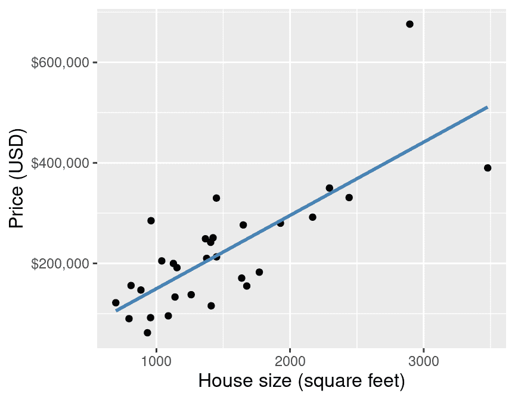

图 8.1：萨克拉门托房屋数据子集中销售价格与面积的散点图，以及最佳拟合线。

直线的方程是：

$$\text{房屋销售价格} = \beta_0 + \beta_1 \cdot (\text{房屋面积}),$$ 其中

+   $\beta_0$ 是这条线的 *y 轴截距*（当房屋面积为 0 时的价格）

+   $\beta_1$ 是这条线的 *斜率*（随着房屋面积的增大，价格增加的速度）

因此，使用数据来找到最佳拟合线等价于找到参数化（对应于）最佳拟合线的系数 $\beta_0$ 和 $\beta_1$。当然，在这个特定的问题中，0 平方英尺房屋的概念有点荒谬；但你可以将这里的 $\beta_0$ 视为“基础价格”，$\beta_1$ 视为每平方英尺空间的价格增加。让我们进一步思考这个问题：如果你尝试评估一个 6*百万*平方英尺大小的房屋的价格，方程会发生什么变化？或者负 2,000 平方英尺呢？实际上，公式中没有任何东西会出错；如果你要求它，线性回归会愉快地为非合理的预测值做出预测。但即使你可以做出这些大胆的预测，你也不应该这样做。你应该只在大约原始数据范围内做出预测，如果合理的话，可以稍微超出这个范围。例如，图 8.1 中的数据在低端只达到大约 800 平方英尺，但使用线性回归模型在 600 平方英尺处做出预测可能是合理的。

回到例子！一旦我们得到了系数 $\beta_0$ 和 $\beta_1$，我们就可以使用上面的方程来评估给定预测变量值（这里为 2,000 平方英尺）的预测销售价格。图 8.2 展示了这个过程。

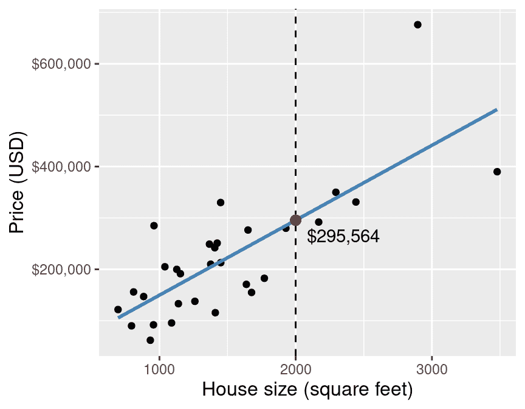

图 8.2：销售价格与面积散点图，最佳拟合线和预测的 2,000 平方英尺房屋销售价格的红色点。

通过对这个小数据集进行简单线性回归来预测 2,000 平方英尺房屋的销售价格，我们得到预测值为$295,564。但是等等…简单线性回归是如何选择最佳拟合线的呢？可以通过数据点画出许多不同的线条。一些可能的例子在图 8.3 中展示。

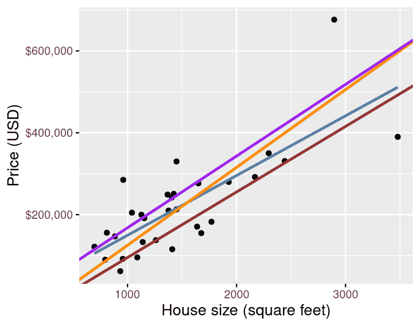

图 8.3：销售价格与面积散点图，数据点之间可以画出许多可能的线条。

简单线性回归通过选择使自身与训练数据中每个观测数据点的**平均平方垂直距离**最小化的直线来选择最佳拟合直线（相当于最小化 RMSE）。图 8.4 展示了这些垂直距离为红色线条。最后，为了评估简单线性回归模型的预测准确性，我们使用 RMSPE——与 K-NN 回归中使用的相同的预测性能度量。

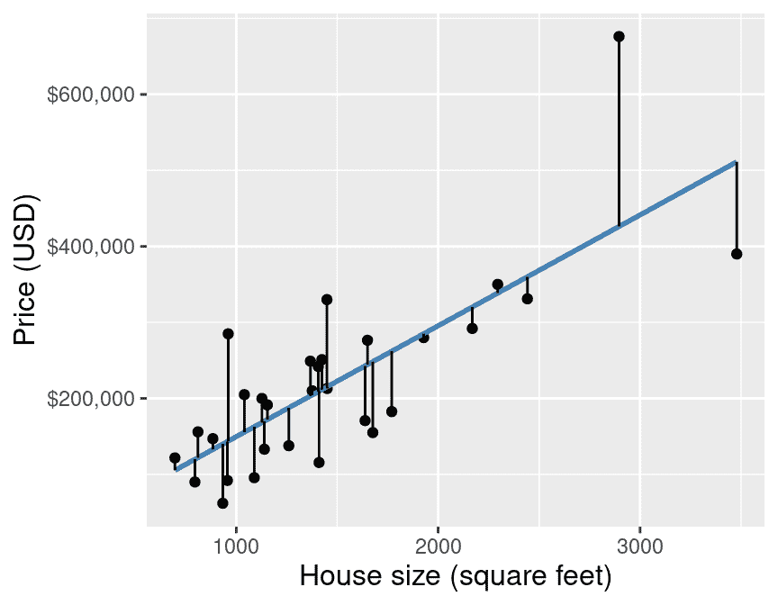

图 8.4：销售价格与面积散点图，红色线条表示预测值与观测数据点之间的垂直距离。

## 8.4 R 中的线性回归

我们可以使用`tidymodels`在 R 中执行简单的线性回归，其方式与执行 K-NN 回归非常相似。为此，我们不是使用`kknn`引擎创建一个`nearest_neighbor`模型规范，而是使用一个`linear_reg`模型规范和一个`lm`引擎。另一个不同之处在于，在线性回归的上下文中，我们不需要选择$K$，因此我们不需要进行交叉验证。以下我们展示了如何使用常规的`tidymodels`工作流程，使用完整的萨克拉门托房地产数据集，通过简单线性回归方法预测房屋销售价格。

如同往常，我们首先加载包，设置种子，加载数据，并将一些测试数据放在一个锁箱中，以便在选择最终模型后返回。现在让我们处理这些事情。

```r
library(tidyverse)
library(tidymodels)

set.seed(7)

sacramento <- read_csv("data/sacramento.csv")

sacramento_split <- initial_split(sacramento, prop = 0.75, strata = price)
sacramento_train <- training(sacramento_split)
sacramento_test <- testing(sacramento_split)
```

现在我们有了训练数据，我们将创建模型规范和配方，并拟合我们的简单线性回归模型：

```r
lm_spec <- linear_reg() |>
 set_engine("lm") |>
 set_mode("regression")

lm_recipe <- recipe(price ~ sqft, data = sacramento_train)

lm_fit <- workflow() |>
 add_recipe(lm_recipe) |>
 add_model(lm_spec) |>
 fit(data = sacramento_train)

lm_fit
```

```r
## ══ Workflow [trained] ══════════
## Preprocessor: Recipe
## Model: linear_reg()
## 
## ── Preprocessor ──────────
## 0 Recipe Steps
## 
## ── Model ──────────
## 
## Call:
## stats::lm(formula = ..y ~ ., data = data)
## 
## Coefficients:
## (Intercept)         sqft  
##     18450.3        134.8
```

> **注意：** 你在这里会注意到的一个额外差异是，我们没有对预测变量进行标准化（即，缩放和居中）。在 K 最近邻模型中，回想一下，模型拟合会根据我们是否首先进行标准化而改变。在线性回归中，标准化不会影响拟合（尽管它会影响方程中的系数！）。所以如果你想标准化，那也没关系——不会有什么坏处——但是如果你保留预测变量的原始形式，通常更容易在之后解释最佳拟合系数。

我们的系数是（截距）$\beta_0=$ 18450 和（斜率）$\beta_1=$ 135。这意味着最佳拟合直线的方程是

$$\text{房屋销售价格} = 18450 + 135\cdot (\text{房屋面积}).$$

换句话说，模型预测房屋从 0 平方英尺的 18,450 美元开始，每增加一平方英尺，房屋成本增加 135 美元。最后，我们在测试数据集上进行预测，以评估我们的模型表现如何：

```r
lm_test_results <- lm_fit |>
 predict(sacramento_test) |>
 bind_cols(sacramento_test) |>
 metrics(truth = price, estimate = .pred)

lm_test_results
```

```r
## # A tibble: 3 × 3
##   .metric .estimator .estimate
##   <chr>   <chr>          <dbl>
## 1 rmse    standard   88528\.   
## 2 rsq     standard       0.608
## 3 mae     standard   61892.
```

我们最终模型的测试误差，通过 RMSPE 评估，为$88,528。请记住，这是以响应变量的单位来计算的，在这里是指美元（USD）。这意味着我们的模型在根据房屋大小预测房价方面“很好”吗？再次，回答这个问题很棘手，需要了解你打算如何使用预测。

为了可视化简单线性回归模型，我们可以绘制所有可能遇到的房屋大小的预测房价。由于我们的模型是线性的，我们只需要计算最小和最大房屋大小的预测价格，然后通过直线连接它们。我们将这个预测线叠加在原始房价数据的散点图上，这样我们就可以定性评估模型是否很好地拟合数据。图 8.5 显示了结果。

```r
sqft_prediction_grid <- tibble(
 sqft = c(
 sacramento |> select(sqft) |> min(),
 sacramento |> select(sqft) |> max()
 )
)

sacr_preds <- lm_fit |>
 predict(sqft_prediction_grid) |>
 bind_cols(sqft_prediction_grid)

lm_plot_final <- ggplot(sacramento, aes(x = sqft, y = price)) +
 geom_point(alpha = 0.4) +
 geom_line(data = sacr_preds,
 mapping = aes(x = sqft, y = .pred),
 color = "steelblue",
 linewidth = 1) +
 xlab("House size (square feet)") +
 ylab("Price (USD)") +
 scale_y_continuous(labels = dollar_format()) +
 theme(text = element_text(size = 12))

lm_plot_final
```

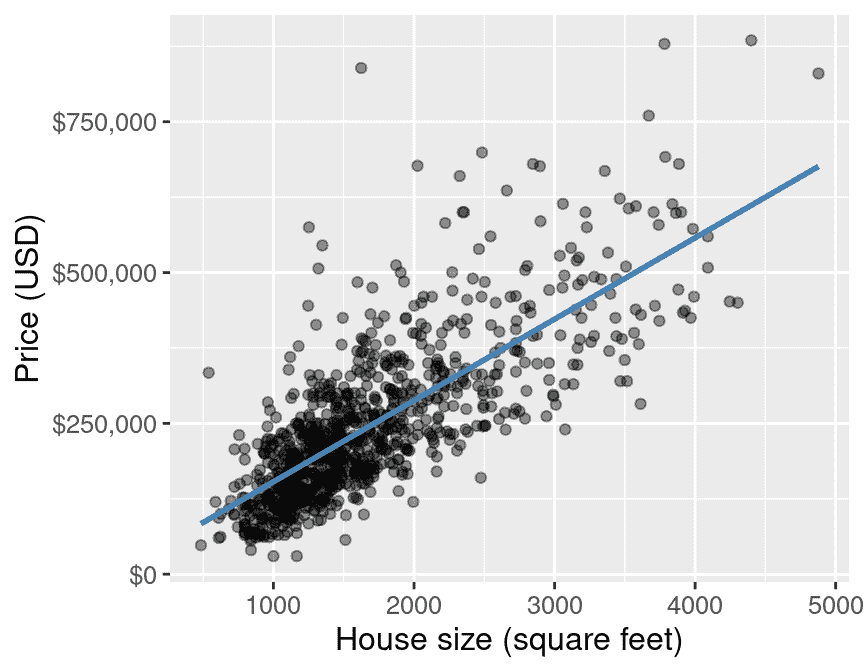

图 8.5：销售价格与大小关系的散点图，以及萨克拉门托全部住房数据的最佳拟合线。

我们可以通过访问由`fit`函数输出的拟合对象来从我们的模型中提取系数；我们首先必须使用`extract_fit_parsnip`函数从工作流程中提取它，然后应用`tidy`函数将结果转换为数据框：

```r
coeffs <- lm_fit |>
 extract_fit_parsnip() |>
 tidy()

coeffs
```

```r
## # A tibble: 2 × 5
##   term        estimate std.error statistic   p.value
##   <chr>          <dbl>     <dbl>     <dbl>     <dbl>
## 1 (Intercept)   18450\.   7916\.        2.33 2.01e-  2
## 2 sqft            135\.      4.31     31.2  1.37e-134
```

## 8.5 比较简单线性回归和 K-NN 回归

现在我们对简单线性回归和 K-NN 回归都有了基本的了解，我们可以开始比较和对比这些方法以及它们所做的预测。首先，让我们看看简单线性回归模型预测的视觉化，这是针对萨克拉门托房地产数据（从房屋大小预测价格）以及从同一问题中获得的“最佳”K-NN 回归模型，如图 8.6 所示。

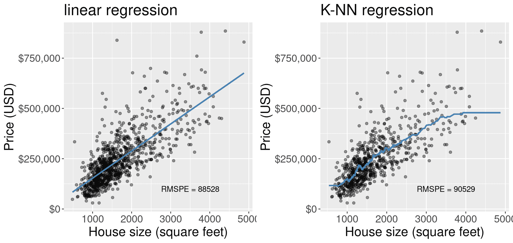

图 8.6：简单线性回归和 K-NN 回归的比较。

我们在图 8.6 中观察到哪些差异？一个明显的差异是蓝色线的形状。在简单线性回归中，我们被限制在一条直线上，而在 K-NN 回归中，我们的线要灵活得多，可以相当曲折。但是，将模型限制为直线有一个主要的可解释性优势。一条直线可以用两个数字来定义，即垂直截距和斜率。截距告诉我们当所有预测变量都等于 0 时预测是什么；斜率告诉我们，在预测变量单位增加的情况下，我们预测的响应变量单位增加是多少。K-NN 回归，尽管实现和理解都很简单，但其曲折的线没有这样的可解释性。

然而，在某些情况下，使用简单线性回归模型也可能存在缺点，尤其是在响应变量和预测变量之间的关系不是线性的，而是其他形状（例如，曲线或振荡）时。在这些情况下，简单线性回归模型的预测模型会欠拟合，意味着模型/预测值与实际观察值匹配得不是很好。这样的模型在评估训练数据上的模型拟合优度时可能具有相当高的 RMSE，在评估测试数据集上的模型预测质量时可能具有相当高的 RMSPE。在这种情况下，K-NN 回归可能表现得更好。此外，你可以在未来的书籍中了解到其他类型的回归，这些回归在预测此类数据时可能表现得更好。

这两个模型在萨克拉门托房价数据集上的比较如何？在图 8.6 中，我们还打印了从未用于训练/拟合模型的测试数据集上预测得到的 RMSPE。简单线性回归模型的 RMSPE 略低于 K-NN 回归模型的 RMSPE。考虑到简单线性回归模型也更容易解释，如果我们实际比较这些模型，我们可能会选择使用简单线性回归模型。

最后，请注意，K-NN 回归模型在数据的左右边界处变得“平坦”，而线性模型预测的是恒定的斜率。预测观察数据范围之外的数据被称为*外推*；K-NN 和线性模型在外推时的行为相当不同。根据应用的不同，平坦或恒定的斜率趋势可能更有意义。例如，如果我们的房价数据略有不同，线性模型实际上可能预测了一个小房子的*负*价格（如果截距 $\beta_0$ 为负），这显然不符合现实。另一方面，随着房价的增加，房屋面积增加的趋势可能对大房子继续适用，因此 K-NN 的“平坦”外推可能不符合现实。

## 8.6 多元线性回归

正如在 K-NN 分类和 K-NN 回归中一样，我们可以从只有一个预测器的简单情况扩展到具有多个预测器的案例，这被称为*多元线性回归*。为此，我们遵循与 K-NN 回归非常相似的方法：我们只是在配方中的模型公式中添加更多的预测器。但请记住，我们不需要使用交叉验证来选择任何参数，也不需要标准化（即，中心和缩放）数据以进行线性回归。再次提醒，我们关于多个预测器的担忧与多元 K-NN 回归和分类设置中的担忧相同：拥有更多预测器**并不**总是更好的。但由于分类章节中的相同预测器选择算法也适用于线性回归设置，因此它将不会在本章中再次介绍。

我们将使用萨克拉门托房地产数据来演示多元线性回归，其中房屋面积（以平方英尺计）以及卧室数量作为预测器，并继续使用房屋销售价格作为响应变量。我们将首先修改配方中的公式，包括`sqft`和`beds`变量作为预测器：

```r
mlm_recipe <- recipe(price ~ sqft + beds, data = sacramento_train)
```

现在我们可以构建我们的工作流程并拟合模型：

```r
mlm_fit <- workflow() |>
 add_recipe(mlm_recipe) |>
 add_model(lm_spec) |>
 fit(data = sacramento_train)

mlm_fit
```

```r
## ══ Workflow [trained] ══════════
## Preprocessor: Recipe
## Model: linear_reg()
## 
## ── Preprocessor ──────────
## 0 Recipe Steps
## 
## ── Model ──────────
## 
## Call:
## stats::lm(formula = ..y ~ ., data = data)
## 
## Coefficients:
## (Intercept)         sqft         beds  
##     72547.8        160.6     -29644.3
```

最后，我们将在测试数据集上进行预测，以评估我们模型的质量：

```r
lm_mult_test_results <- mlm_fit |>
 predict(sacramento_test) |>
 bind_cols(sacramento_test) |>
 metrics(truth = price, estimate = .pred)

lm_mult_test_results
```

```r
## # A tibble: 3 × 3
##   .metric .estimator .estimate
##   <chr>   <chr>          <dbl>
## 1 rmse    standard   88739\.   
## 2 rsq     standard       0.603
## 3 mae     standard   61732.
```

我们模型通过 RMSPE 评估的测试误差为$88,739。在有两个预测器的情况下，我们可以绘制线性回归创建的最佳拟合平面，如图 8.7 所示。

图 8.7：最佳拟合线性回归平面叠加在数据之上（使用价格、房屋面积和卧室数量作为预测器）。请注意，通常我们不建议使用 3D 可视化；这里我们仅使用 3D 可视化来展示回归平面在学习目的下的样子。

我们可以看到，具有两个预测器的线性回归预测形成了一个平坦的平面。这是线性回归的特点，与 K-NN 回归等其他方法得到的扭曲、灵活的表面不同。正如讨论的那样，这在一方面可能是有利的，即对于每个预测器，我们可以从线性回归中得到斜率和截距，从而从数学上描述平面。我们可以从我们的模型对象中提取这些斜率值，如下所示：

```r
mcoeffs <- mlm_fit |>
 extract_fit_parsnip() |>
 tidy()

mcoeffs
```

```r
## # A tibble: 3 × 5
##   term        estimate std.error statistic   p.value
##   <chr>          <dbl>     <dbl>     <dbl>     <dbl>
## 1 (Intercept)   72548\.  11670\.        6.22 8.76e- 10
## 2 sqft            161\.      5.93     27.1  8.34e-111
## 3 beds         -29644\.   4799\.       -6.18 1.11e-  9
```

然后使用这些斜率来编写一个数学方程来描述预测平面：

$$\text{house sale price} = \beta_0 + \beta_1\cdot(\text{house size}) + \beta_2\cdot(\text{number of bedrooms}),$$ 其中：

+   $\beta_0$ 是超平面的垂直截距（当房屋面积和卧室数量都是 0 时的价格）

+   $\beta_1$ 是第一个预测器的斜率（在保持卧室数量不变的情况下，房价随房屋面积增加的变化速度）

+   $\beta_2$是第二个预测变量的*斜率*（在保持房屋面积不变的情况下，随着卧室数量的增加，价格变化的快慢）

最后，我们可以从上面的模型输出中填充$\beta_0$、$\beta_1$和$\beta_2$的值，以创建最佳拟合数据平面的方程：

$$\text{房价} = 72548 + 161\cdot (\text{房屋面积}) -29644 \cdot (\text{卧室数量})$$

这个模型比多变量 K-NN 回归模型更可解释；我们可以写出一个数学方程来解释每个预测变量是如何影响预测的。但就像往常一样，我们应该质疑多变量线性回归与其他工具（如简单线性回归和多变量 K-NN 回归）相比做得如何。如果这种比较是模型调整过程的一部分——例如，如果我们正在尝试多变量线性回归和 K-NN 回归的许多不同预测变量集——我们必须仅使用我们的训练数据来进行这种比较。但如果我们已经决定了一个小数量（例如，2 或 3）的调整候选模型，并且我们想要进行最终比较，我们可以通过比较测试数据上方法的预测误差来完成。

```r
lm_mult_test_results
```

```r
## # A tibble: 3 × 3
##   .metric .estimator .estimate
##   <chr>   <chr>          <dbl>
## 1 rmse    standard   88739\.   
## 2 rsq     standard       0.603
## 3 mae     standard   61732.
```

我们得到多变量线性回归模型的均方根预测误差（RMSPE）为$88,739.45。这个预测误差小于多变量 K-NN 回归模型的预测误差，这表明我们可能应该选择线性回归来预测这个数据集上的房价。回顾本章前面提到的只有一个预测变量的简单线性回归模型，我们看到该模型的 RMSPE 为$88,527.75，这与我们的更复杂模型几乎相同。如前所述，这并不总是如此：通常包括更多预测变量要么会正面要么会负面地影响未见测试数据的预测性能。

## 8.7 多重共线性与异常值

在执行（可能是多变量）线性回归时可能会出什么问题？本节将介绍两个常见问题——*异常值*和*共线性预测变量*——并说明它们对预测的影响。

### 8.7.1 异常值

异常值是不遵循其余数据通常模式的数据点。在线性回归的设置中，这些是到最佳拟合线的垂直距离要么远高于，要么远低于基于其余数据的预期。异常值的问题在于它们可能会对最佳拟合线产生*过多的影响*。一般来说，没有超出本书范围的先进技术，很难准确判断哪些数据是异常值。

但为了说明当存在异常值时可能发生的情况，图 8.8 再次展示了萨克拉门托住房数据的一个小子集，除了我们增加了一个*单个*数据点（用红色突出显示）。这所房子面积为 5,000 平方英尺，售价仅为$50,000。数据分析师并不知道，这所房子是以一个荒谬的低价由父母卖给子女的。当然，这并不代表其他数据点所遵循的真实住房市场价值；这个数据点是*异常值*。我们用蓝色绘制了原始的最佳拟合线，用红色绘制了包含异常值的新最佳拟合线。你可以看到红色线与蓝色线有多么不同，这完全是由于那个额外的异常数据点造成的。

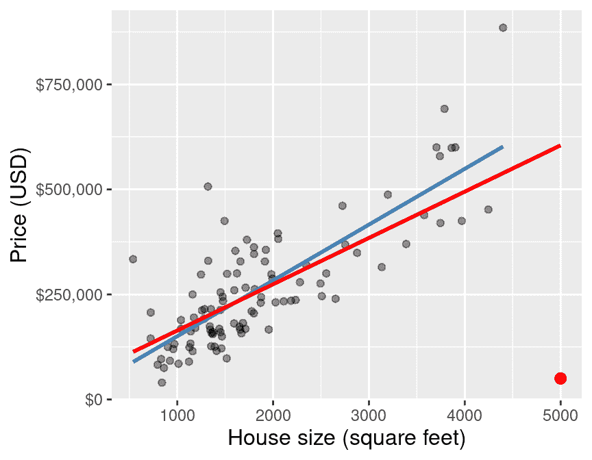

图 8.8：数据子集的散点图，异常值用红色突出显示。

幸运的是，如果你有足够的数据，包含一个或两个异常值——只要它们的值不是*太*离谱——通常不会对最佳拟合线产生大的影响。图 8.9 展示了当我们使用整个原始萨克拉门托训练数据时，之前提到的那个异常数据点如何影响最佳拟合线。你可以看到，在这个更大的数据集中，添加异常值时线的变化很小。尽管如此，当进行线性回归时，仍然非常重要，要批判性地思考任何单个数据点对模型的影响程度。

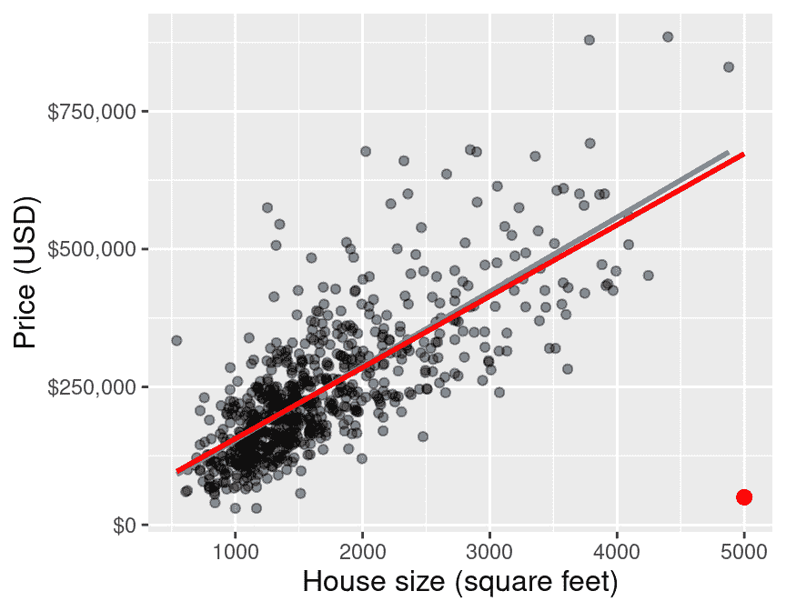

图 8.9：完整数据的散点图，异常值用红色突出显示。

### 8.7.2 多重共线性

当进行多元线性回归时，第二个问题，并且是一个更加微妙的问题可能会发生。特别是，如果你包括多个彼此之间强线性相关的预测变量，描述最佳拟合平面的系数可能会非常不可靠——数据的小幅变化可能导致系数的大幅变化。考虑一个使用萨克拉门托住房数据的极端例子，其中房子由两个人分别测量了两次。由于两个人各自都有轻微的不准确，两次测量可能不会完全一致，但它们之间非常强地线性相关，如图 8.10 所示。

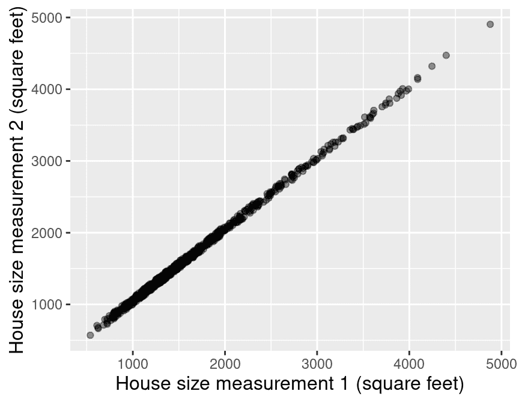

图 8.10：由第 1 个人测量的房屋面积（平方英尺）与由第 2 个人测量的房屋面积（平方英尺）的散点图。

如果我们再次将多元线性回归模型拟合到这些数据上，那么最佳拟合平面的回归系数对数据的精确值非常敏感。例如，如果我们对数据进行微小的改变——例如，通过运行交叉验证，将数据随机分成不同的块——系数会大幅变化：

最佳拟合 1：$\text{房价} = 22535 + (220)\cdot (\text{房屋面积 1 (平方英尺)}) + (-86) \cdot (\text{房屋面积 2 (平方英尺)})$.

最佳拟合 2：$\text{房价} = 15966 + (86)\cdot (\text{房屋面积 1 (平方英尺)}) + (49) \cdot (\text{房屋面积 2 (平方英尺)})$.

最佳拟合 3：$\text{房价} = 17178 + (107)\cdot (\text{房屋面积 1 (平方英尺)}) + (27) \cdot (\text{房屋面积 2 (平方英尺)})$.

因此，在进行多元线性回归时，避免包括非常线性相关的预测变量是很重要的。然而，实现这一点的技术超出了本书的范围；请参阅本章末尾的附加资源列表，以了解您可以在哪里了解更多信息。

## 8.8 设计新的预测变量

在我们的初步探索中，我们非常幸运地发现了一个预测变量（房屋面积），它似乎与我们的响应变量（售价）有有意义且几乎是线性的关系。但如果我们不能立即找到这样的变量，我们应该怎么办？好吧，有时这仅仅是一个事实，数据中的变量与响应变量之间没有足够的关系，无法提供有用的预测。例如，如果唯一可用的预测变量是“当前房屋所有者最喜欢的冰淇淋口味”，我们可能几乎没有希望使用该变量来预测房屋的售价（除非未来有任何关于房地产市场和房屋所有者冰淇淋偏好的重大科学发现）。在这种情况下，唯一的选择是获取更多有用变量的测量值。

然而，存在许多情况，预测变量确实与响应变量有有意义的关系，但这种关系不符合你选择的回归方法的假设。例如，一个包含两个变量——`x`和`y`——的数据框`df`，这两个变量之间存在非线性关系，将无法被简单的线性回归完全捕捉，如图 8.11 所示。

```r
df
```

```r
## # A tibble: 100 × 2
##        x      y
##    <dbl>  <dbl>
##  1 0.102 0.0720
##  2 0.800 0.532 
##  3 0.478 0.148 
##  4 0.972 1.01  
##  5 0.846 0.677 
##  6 0.405 0.157 
##  7 0.879 0.768 
##  8 0.130 0.0402
##  9 0.852 0.576 
## 10 0.180 0.0847
## # ℹ 90 more rows
```

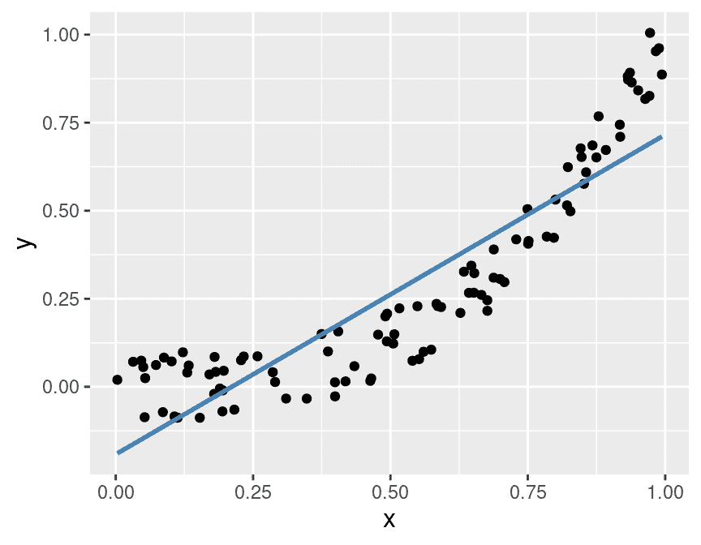

图 8.11：预测变量和响应变量之间非线性关系的示例数据集。

而不是试图通过在`x`上使用线性回归来预测响应`y`，我们可能对我们的问题有一些科学背景，这表明`y`应该是`x`的三次函数。因此，在进行回归之前，我们可能需要使用`mutate`函数*创建一个新的预测变量* `z`：

```r
df <- df |>
 mutate(z = x³)
```

然后，我们可以使用预测变量 `z` 对 `y` 进行线性回归，如图 8.12 所示。在这里，你可以看到变换后的预测变量 `z` 有助于线性回归模型做出更准确的预测。请注意，在图 8.11 和 8.12 之间，`y` 的响应值没有任何变化；唯一的变化是将 `x` 值替换为 `z` 值。

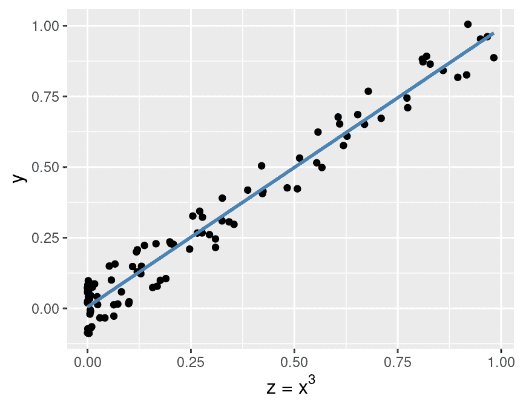

图 8.12：变换后的预测变量与响应变量之间的关系。

将预测变量（以及在过程中可能组合多个预测变量）进行变换的过程称为*特征工程*。在实际数据分析问题中，你需要依靠对问题的深入理解——以及前几章中的处理工具——来构建有用的新特征，从而提高预测性能。

> **注意：**特征工程是*调整你的模型的一部分*，因此你不应该使用你的测试数据来评估你产生的特征的质量。你可以自由使用交叉验证！

## 8.9 回归的其他方面

到目前为止，在这本教科书中，我们只将回归用于预测的上下文。然而，回归也可以被视为一种理解和量化单个预测变量对感兴趣响应变量的影响的方法。在本章的房屋示例中，除了使用过去的数据来预测未来的销售价格之外，我们还可能对描述房屋大小和卧室数量与房价之间的个体关系感兴趣，量化这些关系的强度，并评估我们估计其大小准确性的程度。甚至更进一步，我们可能对了解预测变量是否*导致*价格变化感兴趣。回归的这些方面超出了本书的范围；但你在本处学到的材料应该为你提供一个知识基础，这将有助于你在转向更高级的书籍时受益。

## 8.10 练习

本章涵盖的练习材料可以在配套的 [worksheets 仓库](https://worksheets.datasciencebook.ca) 中找到，位于“回归 II：线性回归”行。你可以通过点击“启动 binder”按钮在你的浏览器中启动工作表的交互式版本。你也可以通过点击“查看工作表”预览非交互式版本的工作表。如果你决定下载工作表并在自己的机器上运行它，请确保遵循第十三章中找到的计算机设置说明。这将确保工作表提供的自动反馈和指导按预期工作。

## 8.11 其他资源

+   [`tidymodels`网站](https://tidymodels.org/packages)是了解前两章中函数和包的更多细节以及高级使用的优秀参考。除此之外，它还提供了一个[优秀的入门教程](https://www.tidymodels.org/start/)和[一系列更高级的示例](https://www.tidymodels.org/learn/)，你可以使用这些示例在本书范围之外继续学习。

+   《*现代探索*》(Ismay and Kim 2020)是另一本使用`tidyverse` / `tidymodels`框架的教科书。第六章很好地补充了本章的内容；它涵盖了一些比我们更不涉及数学的更高级概念。在继续阅读下一参考之前，请先阅读这一章。还值得注意的是，这本书在回归的一般方法上采取了更多的“解释性”/“推断性”方法（在第 5、6 和 10 章），这为我们在本书中采取的预测方法提供了一个很好的补充。

+   《*统计学习导论*》(James et al. 2013)是学习回归过程中的一个很好的下一站。第三章在比我们这里所讲稍微数学化的水平上介绍了线性回归，但并不是太大的跳跃，因此应该提供一个良好的过渡。第六章讨论了当你有一个具有许多预测因子的数据集时，如何选择“信息性”预测因子子集，并且你预计其中只有少数是相关的。第七章涵盖了比线性回归模型更灵活的回归模型，但仍然保持了线性回归的计算效率。相比之下，我们之前提到的 K-NN 方法确实更加灵活，但在给定大量数据时变得非常慢。

### 参考文献

Ismay, Chester, 和 Albert Kim. 2020. *通过数据科学进行统计推断：R 和 Tidyverse 的现代探索*. Chapman; Hall/CRC Press. [`moderndive.com/`](https://moderndive.com/).James, Gareth, Daniela Witten, Trevor Hastie, 和 Robert Tibshirani. 2013. *统计学习导论*. 第 1 版. Springer. [`www.statlearning.com/`](https://www.statlearning.com/).
