# 第九章 聚类

> 原文：[`datasciencebook.ca/clustering.html`](https://datasciencebook.ca/clustering.html)

## 9.1 概述

作为探索性数据分析的一部分，查看数据中是否存在有意义的子组（或*聚类*）通常很有帮助。这种分组可以用于许多目的，例如提出新问题或改进预测分析。本章介绍了使用 K-means 算法进行聚类的方法，包括选择聚类数量的技术。

## 9.2 章节学习目标

到本章结束时，读者将能够做到以下几项：

+   描述一个聚类是适当技术的情况，以及它可能从数据中提取的见解。

+   解释 K-means 聚类算法。

+   解释 K-means 分析的结果。

+   区分聚类、分类和回归。

+   确定何时在聚类之前需要对变量进行缩放，并使用 R 来完成此操作。

+   使用`tidymodels`工作流程在 R 中执行 K-means 聚类。

+   使用肘部方法选择 K-means 的聚类数量。

+   使用 R 中的彩色散点图可视化 K-means 聚类的结果。

+   描述 K-means 聚类算法的优点、局限性和假设。

## 9.3 聚类

聚类是一种数据分析技术，涉及将数据集分成相关数据的子组。例如，我们可能使用聚类将文档数据集分成与主题相对应的组，将人类遗传信息数据集分成与祖先亚种群相对应的组，或将在线客户数据集分成与购买行为相对应的组。一旦数据被分离，例如，我们可以使用子组来提出关于数据的新问题，并随后进行预测建模练习。在本课程中，聚类仅用于探索性分析，即揭示数据中的模式。

注意，聚类是一个与分类或回归根本不同的任务。特别是，分类和回归都是**监督任务**，其中有一个**响应变量**（一个类别标签或值），并且我们有带有标签/值的过去数据的例子，这有助于我们预测未来数据的标签/值。相比之下，聚类是一个**无监督任务**，因为我们试图理解和检查数据的结构，而没有任何响应变量标签或值来帮助我们。这种方法既有优点也有缺点。聚类不需要对数据进行额外的注释或输入。例如，虽然几乎不可能用人工主题标签注释维基百科上的所有文章，但我们可以在没有这些信息的情况下聚类文章，以自动找到与主题相对应的分组。然而，由于没有响应变量，评估聚类的“质量”并不容易。在分类中，我们可以使用测试数据集来评估预测性能。在聚类中，没有单一的好的评估选择。在这本书中，我们将使用可视化来确定聚类的质量，并将严格的评估留给更高级的课程。

就像在分类的情况下，有许多可能的方法我们可以用来聚类我们的观察结果以寻找子组。在这本书中，我们将重点关注广泛使用的 K-means 算法(Lloyd 1982)。在你的未来研究中，你可能会遇到层次聚类、主成分分析、多维尺度分析等；请参阅本章末尾的附加资源部分，了解如何开始学习这些其他方法。

> **注意：**还存在所谓的**半监督**任务，其中只有部分数据带有响应变量标签/值，但绝大多数没有。目标是尝试揭示数据中的潜在结构，以便能够猜测缺失的标签。这种任务在例如，当一个人有一个未标记的数据集太大而无法手动标记，但愿意提供一些信息性示例标签作为“种子”来猜测所有数据的标签时是有益的。

## 9.4 一个示例

在本章中，我们将关注来自[Palmerpenguins R 包](https://allisonhorst.github.io/palmerpenguins/)（Horst, Hill, and Gorman 2020）的数据集。这个数据集由 Kristen Gorman 博士和南极洲 Palmer 站长期生态研究站收集，包括在该地区发现的成年企鹅的测量数据（图 9.1）(Gorman, Williams, and Fraser 2014）。我们的目标将是使用两个变量——企鹅喙和鳍长，两者都以毫米为单位——来确定我们的数据中是否存在不同的企鹅类型。了解这一点可能有助于我们以数据驱动的方式发现和分类物种。请注意，我们已经将数据集的大小减少到 18 个观测值和 2 个变量；这将帮助我们制作清晰的视觉图表，说明聚类如何用于学习目的。


图 9.1：一只 Gentoo 企鹅。

在我们开始之前，我们将加载`tidyverse`元包并设置一个随机种子。这将确保我们能够访问所需的函数，并且我们的分析将是可重复的。正如我们将在本章后面更详细地学习的那样，在这里设置种子很重要，因为 K-means 聚类算法在为每个簇选择起始位置时使用随机性。

```r
library(tidyverse)
set.seed(1)
```

现在我们可以加载并预览`penguins`数据。

```r
penguins <- read_csv("data/penguins.csv")
penguins
```

```r
## # A tibble: 18 × 2
##    bill_length_mm flipper_length_mm
##             <dbl>             <dbl>
##  1           39.2               196
##  2           36.5               182
##  3           34.5               187
##  4           36.7               187
##  5           38.1               181
##  6           39.2               190
##  7           36                 195
##  8           37.8               193
##  9           46.5               213
## 10           46.1               215
## 11           47.8               215
## 12           45                 220
## 13           49.1               212
## 14           43.3               208
## 15           46                 195
## 16           46.7               195
## 17           52.2               197
## 18           46.8               189
```

我们将首先使用一个标准化的数据版本，即`penguins_standardized`，来展示 K-means 聚类是如何工作的（回忆第五章中的标准化）。在本章的后面部分，我们将回到原始的`penguins`数据，看看如何将标准化自动包含到聚类流程中。

```r
penguins_standardized
```

```r
## # A tibble: 18 × 2
##    bill_length_standardized flipper_length_standardized
##                       <dbl>                       <dbl>
##  1                   -0.641                      -0.190
##  2                   -1.14                       -1.33 
##  3                   -1.52                       -0.922
##  4                   -1.11                       -0.922
##  5                   -0.847                      -1.41 
##  6                   -0.641                      -0.678
##  7                   -1.24                       -0.271
##  8                   -0.902                      -0.434
##  9                    0.720                       1.19 
## 10                    0.646                       1.36 
## 11                    0.963                       1.36 
## 12                    0.440                       1.76 
## 13                    1.21                        1.11 
## 14                    0.123                       0.786
## 15                    0.627                      -0.271
## 16                    0.757                      -0.271
## 17                    1.78                       -0.108
## 18                    0.776                      -0.759
```

接下来，我们可以使用这个数据集创建一个散点图，看看我们是否能在数据集中检测到亚型或组。

```r
ggplot(penguins_standardized,
 aes(x = flipper_length_standardized,
 y = bill_length_standardized)) +
 geom_point() +
 xlab("Flipper Length (standardized)") +
 ylab("Bill Length (standardized)") +
 theme(text = element_text(size = 12))
```

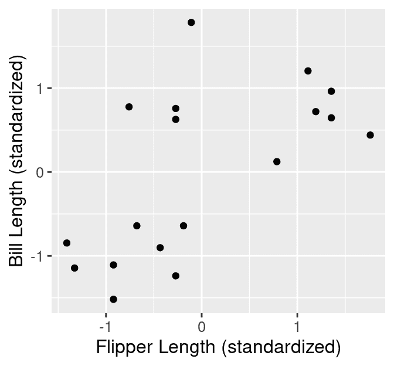

图 9.2：标准化喙长度与标准化鳍长度的散点图。

根据图 9.2 中的可视化，我们可能会怀疑在我们的数据集中存在几种企鹅亚型。我们可以从图 9.2 中看到大约 3 个观测值组，包括：

1.  一个小鳍和喙长度组，

1.  一个小鳍长度但大喙长度组，

1.  一个大鳍和喙长度组。

数据可视化是当我们只有少量变量时，给我们一个这种模式的大致感觉的伟大工具。但是，如果我们要将数据分组——并选择组数——作为可重复分析的一部分，我们需要一些更自动化的东西。此外，随着我们在聚类时考虑的变量数量的增加，通过可视化找到分组变得更加困难。将数据严格分离成组的方法是使用聚类算法。在本章中，我们将重点关注*K-means*算法，这是一种广泛使用且通常非常有效的聚类方法，结合*肘部方法*来选择聚类数量。这个程序将数据分离成组；图 9.3 显示了这些用彩色散点表示的组。

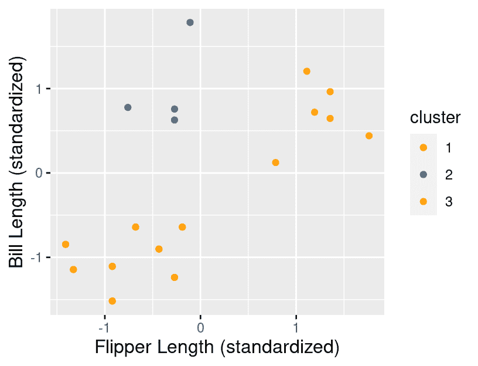

图 9.3：标准化喙长与标准化鳍长散点图，分组用颜色表示。

这些组的标签是什么？不幸的是，我们没有任何标签。K-means，就像几乎所有的聚类算法一样，只输出无意义的“聚类标签”，通常是整数：1，2，3 等。但在这种简单的情况下，我们可以很容易地在散点图上可视化聚类，我们可以使用它们在图上的位置来给这些组赋予人为的标签：

+   短鳍长和短喙长（橙色聚类），

+   短鳍长和长喙长（蓝色聚类）。

+   以及长鳍长和长喙长（黄色聚类）。

一旦我们做出了这些决定，我们就可以使用它们来告知我们的物种分类或对我们的数据提出进一步的问题。例如，我们可能对了解鳍长与喙长之间的关系感兴趣，而这种关系可能取决于我们拥有的企鹅类型。

## 9.5 K-means

### 9.5.1 测量聚类质量

K-means 算法是一种将数据分组到 K 个聚类的过程。它从数据的初始聚类开始，然后通过调整数据到聚类的分配来迭代地改进它，直到不能再进一步改进。但是，我们如何衡量聚类的“质量”，以及改进它意味着什么？在 K-means 聚类中，我们通过聚类的*内部平方和距离总和*（WSSD）来衡量聚类质量。计算这一过程涉及两个步骤。首先，我们通过计算聚类中每个变量的均值来找到聚类中心。例如，假设我们有一个包含四个观察值的聚类，我们使用两个变量$x$和$y$来聚类数据。然后，我们会计算聚类中心的坐标$\mu_x$和$\mu_y$：

$$\mu_x = \frac{1}{4}(x_1+x_2+x_3+x_4) \quad \mu_y = \frac{1}{4}(y_1+y_2+y_3+y_4).$$

在示例的第一个集群中，有 4 个数据点。这些点及其集群中心（标准化鳍长-0.35，标准化喙长 0.99）在图 9.4 中突出显示。

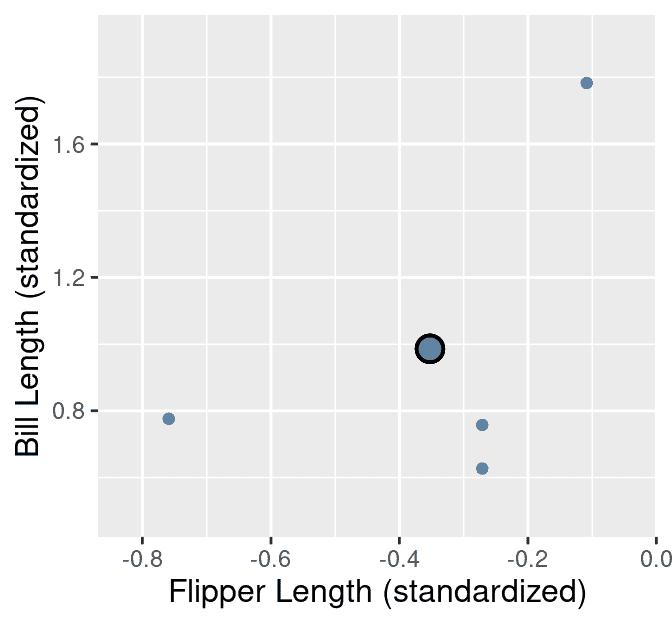

图 9.4：企鹅`标准化`数据集示例中的集群 1。观测值以小蓝色点表示，集群中心以大蓝色点加黑色轮廓突出显示。

计算 WSSD 的第二步是将集群中每个点到集群中心的平方距离相加。我们使用我们在第五章中学到的直线/欧几里得距离公式。在上面的 4 观测值集群示例中，我们会通过以下方式计算 WSSD $S²$：

$$\begin{align*} S² = \left((x_1 - \mu_x)² + (y_1 - \mu_y)²\right) + \left((x_2 - \mu_x)² + (y_2 - \mu_y)²\right) + \\ \left((x_3 - \mu_x)² + (y_3 - \mu_y)²\right) + \left((x_4 - \mu_x)² + (y_4 - \mu_y)²\right). \end{align*}$$

这些距离在图 9.5 中用线条表示，这是企鹅数据示例的第一个集群。

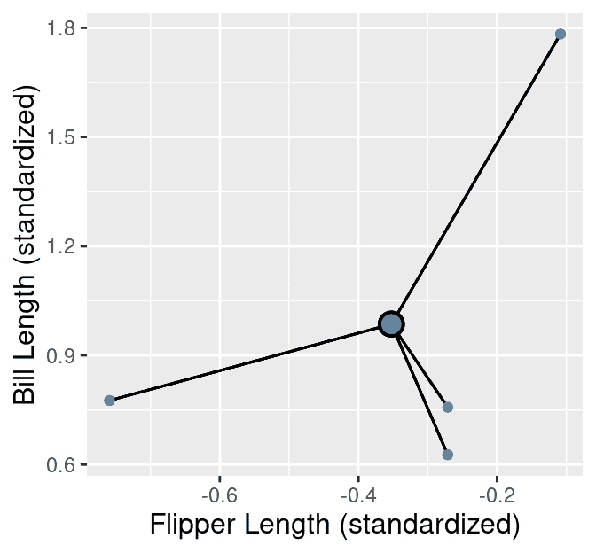

图 9.5：企鹅`标准化`数据集示例中的集群 1。观测值以小蓝色点表示，集群中心以大蓝色点加黑色轮廓突出显示。观测值到集群中心的距离以黑色线条表示。

$S²$的值越大，集群就越分散，因为大的$S²$意味着点离集群中心很远。然而，请注意，“大”是相对于聚类变量的规模*以及*集群中点的数量而言的。如果一个集群中的点非常接近中心，但如果集群中有许多数据点，它仍然可能有一个大的$S²$。

在我们计算了所有集群的 WSSD 之后，我们将它们相加以得到*总 WSSD*。对于我们的示例，这意味着将 18 个观测值的平方距离相加。这些距离在图 9.6 中以黑色线条表示。


图 9.6：`penguins_standardized`数据集示例中的所有聚类。观测值用小橙色、蓝色和黄色点表示，聚类中心由黑色轮廓的大点表示。观测值到各自聚类中心的距离用黑色线条表示。

由于 K-means 使用直线距离来衡量聚类的质量，因此它仅限于基于定量变量的聚类。然而，请注意，K-means 算法的变体以及其他一些聚类算法完全使用其他距离度量，以便对非定量数据进行聚类。这些内容超出了本书的范围。

### 9.5.2 聚类算法

我们开始 K-means 算法时选择 K，并将大致相等数量的观测值随机分配给 K 个聚类中的每一个。一个示例随机初始化如图 9.7 所示。

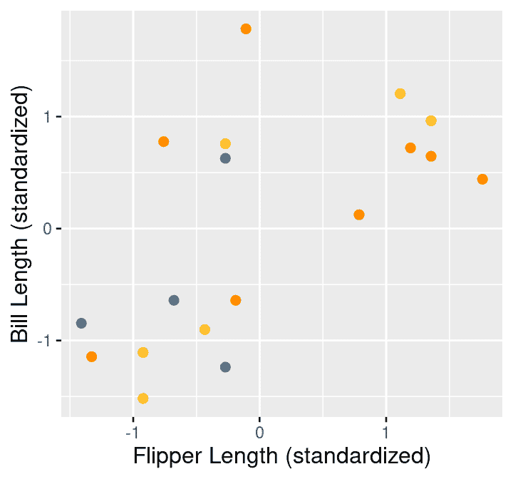

图 9.7：标签的随机初始化。

然后，K-means 由两个主要步骤组成，这两个步骤试图最小化所有聚类上的 WSSD 总和，即*总 WSSD*：

1.  **中心更新：** 计算每个聚类的中心。

1.  **标签更新：** 将每个数据点重新分配到最近的中心所在的聚类。

这两个步骤会重复进行，直到聚类分配不再改变。我们在图 9.8 中展示了 K-means 的前四次迭代的样子。在每一行中，每对图表对应一个迭代，其中这对图表中的左图描述了中心更新，而这对图表中的右图描述了标签更新（即数据重新分配到聚类中）。


图 9.8：在`penguins_standardized`示例数据集上进行的 K-means 聚类的前四次迭代。每一对图表对应一个迭代。在每一对图表中，第一个图表描述了中心更新，第二个图表描述了数据重新分配到聚类中。聚类中心由黑色轮廓的大点表示。

注意，在这个时候，我们可以终止算法，因为第四次迭代中没有任何分配发生变化；从这一点开始，中心和标签都将保持不变。

> **注意：** K-means 是否**保证**在某一点停止，或者可能会无限迭代？实际上，幸运的是，答案是 K-means 保证在*某些*迭代次数后停止。对于感兴趣的读者，这个逻辑有三个步骤：（1）标签更新和中心更新在每个迭代中都会减少总 WSSD，（2）总 WSSD 始终大于或等于 0，（3）将数据分配到聚类的可能方式只有有限种。所以，在某个点上，总 WSSD 必须停止减少，这意味着没有任何分配在改变，算法终止。

### 9.5.3 随机重启

与我们在前几章中研究的分类和回归模型不同，K-means 可能会陷入一个不良的解。例如，图 9.9 展示了 K-means 不幸的随机初始化。

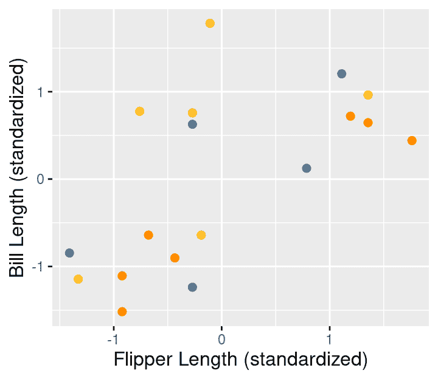

图 9.9：标签的随机初始化。

图 9.10 显示了 K-means 迭代的外观，其中包含图 9.9 中显示的不幸随机初始化。

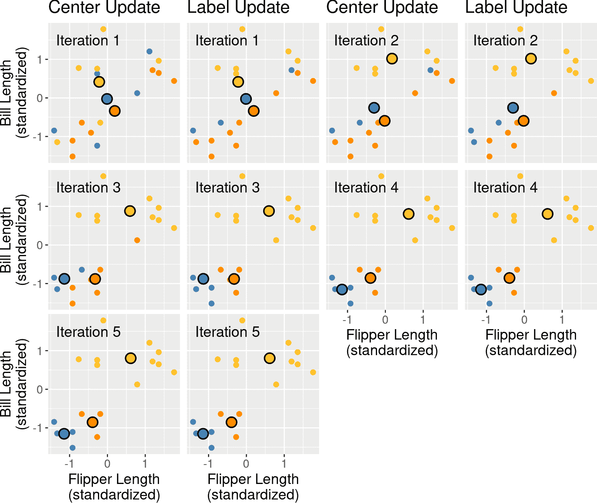

图 9.10：penguins_standardized 示例数据集上 K-means 聚类的第一次五次迭代，具有较差的随机初始化。每对图对应一个迭代。在每对图中，第一个图描述了中心更新，第二个图描述了数据重新分配到聚类。聚类中心由黑色轮廓的大点表示。

这看起来像是数据的一个相对较差的聚类，但 K-means 无法改进它。在使用 K-means 聚类数据时解决此问题，我们应该随机重新初始化标签几次，为每次初始化运行 K-means，并选择具有最低最终总 WSSD 的聚类。

### 9.5.4 选择 K

为了使用 K-means 聚类数据，我们还必须选择聚类数量 K。但在分类中不同，我们没有响应变量，也不能使用交叉验证和一些模型预测误差的度量来执行。此外，如果 K 选择得太小，那么多个聚类会被分组在一起；如果 K 太大，那么聚类会被细分。在这两种情况下，我们可能会错过数据中的有趣结构。图 9.11 通过显示 K 从 1 到 9 的不同聚类来说明了 K 对我们企鹅鳍长和喙长数据的 K-means 聚类的影响。

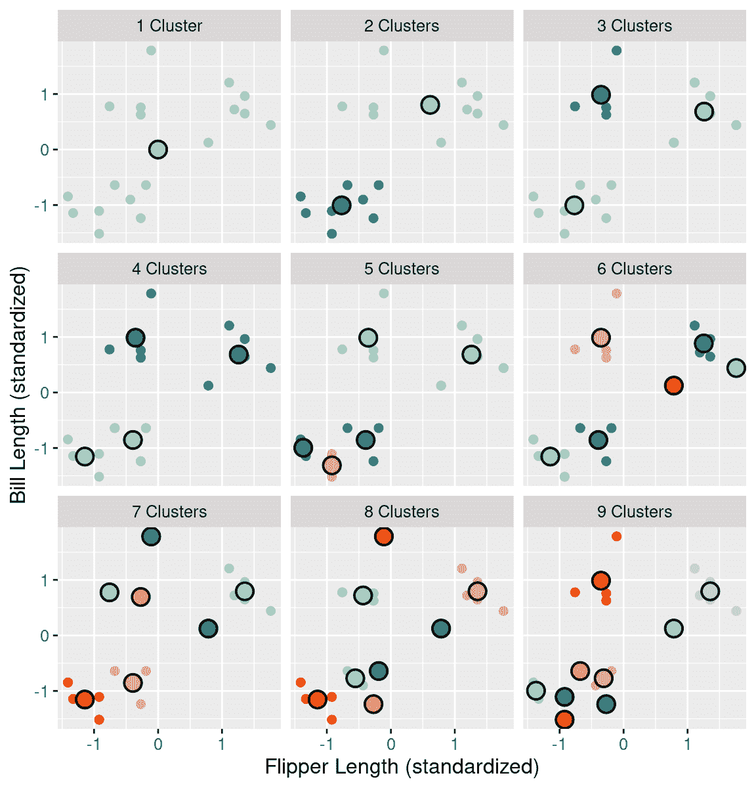

图 9.11：K 从 1 到 9 的企鹅数据聚类图。聚类中心由黑色轮廓的大点表示。

如果我们将 K 设置为小于 3，那么聚类将合并分离的数据组；这会导致较大的总 WSSD，因为聚类中心不接近聚类中的任何数据点。另一方面，如果我们设置 K 大于 3，聚类将细分数据子组；这确实仍然会减少总 WSSD，但只是减少的幅度很小。如果我们绘制总 WSSD 与聚类数量的关系图，我们会看到当达到大约正确的聚类数量时，总 WSSD 的减少趋于平稳（或形成“肘部形状”）（见图 9.12）。

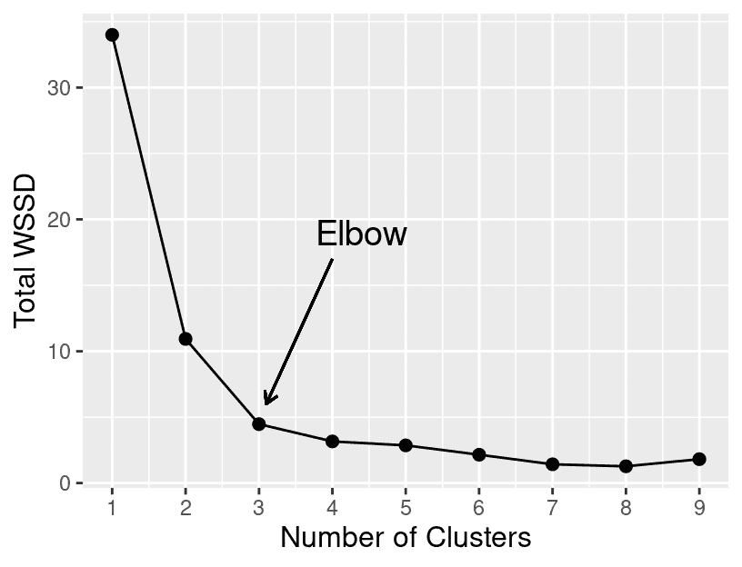

图 9.12：K 从 1 到 9 的总 WSSD。

## 9.6 R 中的 K-means

我们可以使用与早期分类和回归章节中类似的`tidymodels`工作流程在 R 中执行 K-means 聚类。我们首先加载包含必要功能的`tidyclust`库。

```r
library(tidyclust)
```

返回到原始（未标准化的）`penguins`数据，回想一下 K-means 聚类使用直线距离来决定哪些点彼此相似。因此，数据中每个变量的*尺度*将影响哪些聚类数据点被分配。尺度大的变量在决定聚类分配时比尺度小的变量有更大的影响。为了解决这个问题，我们需要创建一个配方，在聚类之前使用`step_scale`和`step_center`预处理步骤标准化我们的数据。标准化将确保在聚类之前每个变量的平均值是 0，标准差是 1。我们将指定所有变量都通过模型公式`~ .`用于聚类。

> **注意：**配方最初是为特定的*预测性*数据分析问题设计的——如分类和回归，而不是聚类问题。因此，我们在 R 中使用来构建配方的函数在聚类环境中有点不自然。特别是，我们将在这里将“predictors”视为“用于聚类的变量”。因此，模型公式`~ .`指定所有变量都是“predictors”，即所有变量都应用于聚类。同样，当我们使用`all_predictors()`函数在预处理步骤中时，我们真正意味着“将此步骤应用于用于聚类的所有变量。”

```r
kmeans_recipe <- recipe(~ ., data=penguins) |>
 step_scale(all_predictors()) |>
 step_center(all_predictors())
kmeans_recipe
```

```r
## 
## ── Recipe ──────────
## 
## ── Inputs 
## Number of variables by role
## predictor: 2
## 
## ── Operations 
## • Scaling for: all_predictors()
## • Centering for: all_predictors()
```

为了表明我们正在进行 K-means 聚类，我们将使用`k_means`模型规范。我们将使用`num_clusters`参数来指定聚类数（在这里我们选择 K = 3），并指定我们使用的是`"stats"`引擎。

```r
kmeans_spec <- k_means(num_clusters = 3) |>
 set_engine("stats")
kmeans_spec
```

```r
## K Means Cluster Specification (partition)
## 
## Main Arguments:
##   num_clusters = 3
## 
## Computational engine: stats
```

要实际运行 K-means 聚类，我们将配方和模型规范组合在一个工作流程中，并使用`fit`函数。请注意，K-means 算法使用随机初始化的分配；但由于我们之前设置了随机种子，聚类将是可重复的。

```r
kmeans_fit <- workflow() |>
 add_recipe(kmeans_recipe) |>
 add_model(kmeans_spec) |>
 fit(data = penguins)

kmeans_fit
```

```r
## ══ Workflow [trained] ══════════
## Preprocessor: Recipe
## Model: k_means()
## 
## ── Preprocessor ──────────
## 2 Recipe Steps
## 
## • step_scale()
## • step_center()
## 
## ── Model ──────────
## K-means clustering with 3 clusters of sizes 4, 6, 8
## 
## Cluster means:
##   bill_length_mm flipper_length_mm
## 1      0.9858721        -0.3524358
## 2      0.6828058         1.2606357
## 3     -1.0050404        -0.7692589
## 
## Clustering vector:
##  [1] 3 3 3 3 3 3 3 3 2 2 2 2 2 2 1 1 1 1
## 
## Within cluster sum of squares by cluster:
## [1] 1.098928 1.247042 2.121932
##  (between_SS / total_SS =  86.9 %)
## 
## Available components:
## 
## [1] "cluster"      "centers"      "totss"        "withinss"     "tot.withinss"
## [6] "betweenss"    "size"         "iter"         "ifault"
```

如上图所示，拟合对象包含大量可用于可视化聚类、选择 K 值和评估总 WSSD 的信息。让我们先从将聚类可视化为一个彩色散点图开始！为了做到这一点，我们首先需要使用`tidyclust`中的`augment`函数增强我们的原始数据框。我们可以通过这种方式实现。

```r
clustered_data <- kmeans_fit |>
 augment(penguins)
clustered_data
```

```r
## # A tibble: 18 × 3
##    bill_length_mm flipper_length_mm .pred_cluster
##             <dbl>             <dbl> <fct>        
##  1           39.2               196 Cluster_1    
##  2           36.5               182 Cluster_1    
##  3           34.5               187 Cluster_1    
##  4           36.7               187 Cluster_1    
##  5           38.1               181 Cluster_1    
##  6           39.2               190 Cluster_1    
##  7           36                 195 Cluster_1    
##  8           37.8               193 Cluster_1    
##  9           46.5               213 Cluster_2    
## 10           46.1               215 Cluster_2    
## 11           47.8               215 Cluster_2    
## 12           45                 220 Cluster_2    
## 13           49.1               212 Cluster_2    
## 14           43.3               208 Cluster_2    
## 15           46                 195 Cluster_3    
## 16           46.7               195 Cluster_3    
## 17           52.2               197 Cluster_3    
## 18           46.8               189 Cluster_3
```

现在我们已经将聚类分配包含在`clustered_data`整洁数据框中，我们可以像图 9.13 中所示的那样可视化它们。请注意，我们在这里绘制的是*未标准化的*数据；如果我们出于某种原因想要可视化配方中的*标准化*数据，我们需要使用`bake`函数来首先获取它。

```r
cluster_plot <- ggplot(clustered_data,
 aes(x = flipper_length_mm,
 y = bill_length_mm,
 color = .pred_cluster),
 size = 2) +
 geom_point() +
 labs(x = "Flipper Length",
 y = "Bill Length",
 color = "Cluster") +
 scale_color_manual(values = c("steelblue",
 "darkorange",
 "goldenrod1")) +
 theme(text = element_text(size = 12))

cluster_plot
```

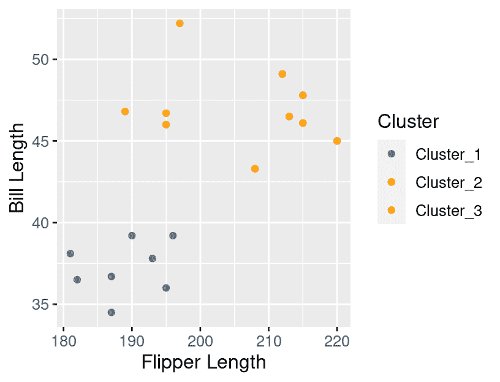

图 9.13：由 K-means 返回的聚类分配着色的数据。

如上所述，我们还需要通过在总 WSSD 与聚类数量之间的图中找到“肘部”来选择 K 值。我们可以使用`glance`函数从具有 3 个聚类的聚类中获得总 WSSD（`tot.withinss`）。

```r
glance(kmeans_fit)
```

```r
## # A tibble: 1 × 4
##   totss tot.withinss betweenss  iter
##   <dbl>        <dbl>     <dbl> <int>
## 1    34         4.47      29.5     2
```

为了计算各种 K 值的总 WSSD，我们将创建一个包含名为`num_clusters`的列的数据框，其中包含我们想要运行 K-means 的每个 K 值的行（在这里，1 到 9）。

```r
penguin_clust_ks <- tibble(num_clusters = 1:9)
penguin_clust_ks
```

```r
## # A tibble: 9 × 1
##   num_clusters
##          <int>
## 1            1
## 2            2
## 3            3
## 4            4
## 5            5
## 6            6
## 7            7
## 8            8
## 9            9
```

然后，我们再次构建我们的模型规范，这次指定我们想要调整`num_clusters`参数。

```r
kmeans_spec <- k_means(num_clusters = tune()) |>
 set_engine("stats")
kmeans_spec
```

```r
## K Means Cluster Specification (partition)
## 
## Main Arguments:
##   num_clusters = tune()
## 
## Computational engine: stats
```

我们在流程中将配方和规范结合起来，然后使用 `tune_cluster` 函数在 `num_clusters` 的不同设置上运行 K-means。`grid` 参数控制我们想要尝试的 K 的值——在这种情况下，存储在 `penguin_clust_ks` 数据框中的 1 到 9 的值。我们将 `resamples` 参数设置为 `apparent(penguins)`，以告诉 K-means 对每个 `num_clusters` 的值在整个数据集上运行。最后，我们使用 `collect_metrics` 函数收集结果。

```r
kmeans_results <- workflow() |>
 add_recipe(kmeans_recipe) |>
 add_model(kmeans_spec) |>
 tune_cluster(resamples = apparent(penguins), grid = penguin_clust_ks) |>
 collect_metrics()
kmeans_results
```

```r
## # A tibble: 18 × 7
##    num_clusters .metric          .estimator   mean     n std_err .config        
##           <int> <chr>            <chr>       <dbl> <int>   <dbl> <chr>          
##  1            1 sse_total        standard   34         1      NA Preprocessor1_…
##  2            1 sse_within_total standard   34         1      NA Preprocessor1_…
##  3            2 sse_total        standard   34         1      NA Preprocessor1_…
##  4            2 sse_within_total standard   10.9       1      NA Preprocessor1_…
##  5            3 sse_total        standard   34         1      NA Preprocessor1_…
##  6            3 sse_within_total standard    4.47      1      NA Preprocessor1_…
##  7            4 sse_total        standard   34         1      NA Preprocessor1_…
##  8            4 sse_within_total standard    3.54      1      NA Preprocessor1_…
##  9            5 sse_total        standard   34         1      NA Preprocessor1_…
## 10            5 sse_within_total standard    2.23      1      NA Preprocessor1_…
## 11            6 sse_total        standard   34         1      NA Preprocessor1_…
## 12            6 sse_within_total standard    1.75      1      NA Preprocessor1_…
## 13            7 sse_total        standard   34         1      NA Preprocessor1_…
## 14            7 sse_within_total standard    2.06      1      NA Preprocessor1_…
## 15            8 sse_total        standard   34         1      NA Preprocessor1_…
## 16            8 sse_within_total standard    2.46      1      NA Preprocessor1_…
## 17            9 sse_total        standard   34         1      NA Preprocessor1_…
## 18            9 sse_within_total standard    0.906     1      NA Preprocessor1_…
```

总 WSSD 结果对应于当 `.metric` 变量等于 `sse_within_total` 时的 `mean` 列。我们可以使用 `filter` 和 `mutate` 获得包含此信息的整洁数据框。

```r
kmeans_results <- kmeans_results |>
 filter(.metric == "sse_within_total") |>
 mutate(total_WSSD = mean) |>
 select(num_clusters, total_WSSD)
kmeans_results
```

```r
## # A tibble: 9 × 2
##   num_clusters total_WSSD
##          <int>      <dbl>
## 1            1     34    
## 2            2     10.9  
## 3            3      4.47 
## 4            4      3.54 
## 5            5      2.23 
## 6            6      1.75 
## 7            7      2.06 
## 8            8      2.46 
## 9            9      0.906
```

现在我们有 `total_WSSD` 和 `num_clusters` 作为数据框中的列，我们可以制作一个折线图（图 9.14）并寻找“肘部”以确定使用哪个 K 的值。

```r
elbow_plot <- ggplot(kmeans_results, aes(x = num_clusters, y = total_WSSD)) +
 geom_point() +
 geom_line() +
 xlab("K") +
 ylab("Total within-cluster sum of squares") +
 scale_x_continuous(breaks = 1:9) +
 theme(text = element_text(size = 12))

elbow_plot
```

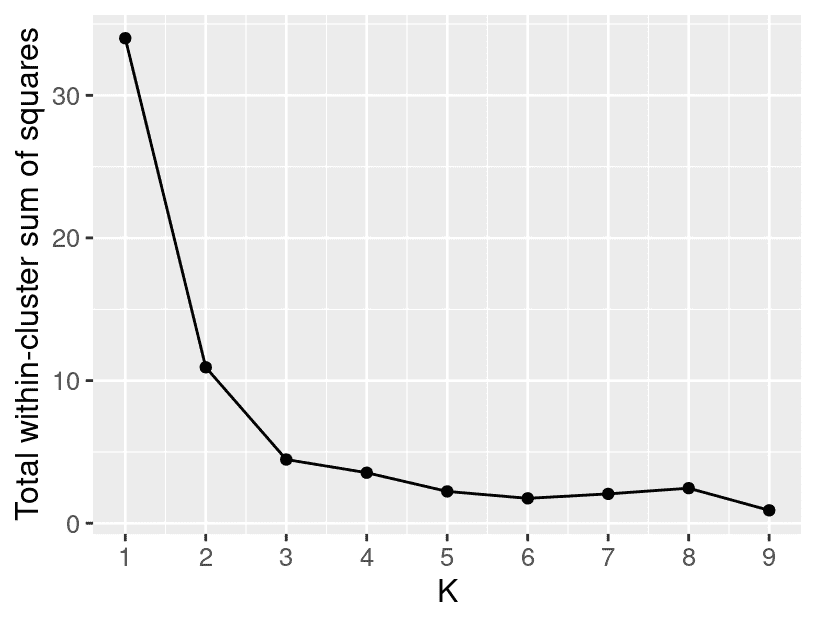

图 9.14：显示总 WSSD 与簇数关系的图。

看起来对于这些数据，3 个簇是合适的选择。但为什么在总 WSSD 图中这里会有一个“峰值”？总 WSSD 不应该随着我们添加更多簇而总是减少吗？从技术上讲是的，但请记住：K-means 可能会陷入一个不良的解。不幸的是，对于 K = 8，我们有一个不幸的初始化，发现了一个不良的聚类！我们可以通过在模型指定中的 `nstart` 参数尝试几个不同的随机初始化来帮助防止找到不良聚类。在这里，我们将尝试使用 10 次重启。

```r
kmeans_spec <- k_means(num_clusters = tune()) |>
 set_engine("stats", nstart = 10)
kmeans_spec
```

```r
## K Means Cluster Specification (partition)
## 
## Main Arguments:
##   num_clusters = tune()
## 
## Engine-Specific Arguments:
##   nstart = 10
## 
## Computational engine: stats
```

现在，如果我们用新的模型指定重新运行相同的流程，K-means 聚类将针对每个 K 的值执行 `nstart = 10` 次。然后，`collect_metrics` 函数将为每个 K 的值选择 10 次运行中的最佳聚类，并报告该最佳聚类的结果。图 9.15 显示了使用 10 次重启得到的总 WSSD 图；峰值消失了，总 WSSD 如预期那样减少。我们执行 K-means 聚类的次数越多，找到良好聚类（如果存在的话）的可能性就越大。你应该为 `nstart` 选择什么值呢？答案是这取决于许多因素：数据集的大小和特征，以及你的计算机有多强大。从分析的角度来看，`nstart` 值越大越好，但这也存在一个权衡，即进行多次聚类可能会花费很长时间。所以这是需要权衡的事情。

```r
kmeans_results <- workflow() |>
 add_recipe(kmeans_recipe) |>
 add_model(kmeans_spec) |>
 tune_cluster(resamples = apparent(penguins), grid = penguin_clust_ks) |>
 collect_metrics() |>
 filter(.metric == "sse_within_total") |>
 mutate(total_WSSD = mean) |>
 select(num_clusters, total_WSSD)

elbow_plot <- ggplot(kmeans_results, aes(x = num_clusters, y = total_WSSD)) +
 geom_point() +
 geom_line() +
 xlab("K") +
 ylab("Total within-cluster sum of squares") +
 scale_x_continuous(breaks = 1:9) +
 theme(text = element_text(size = 12))

elbow_plot
```

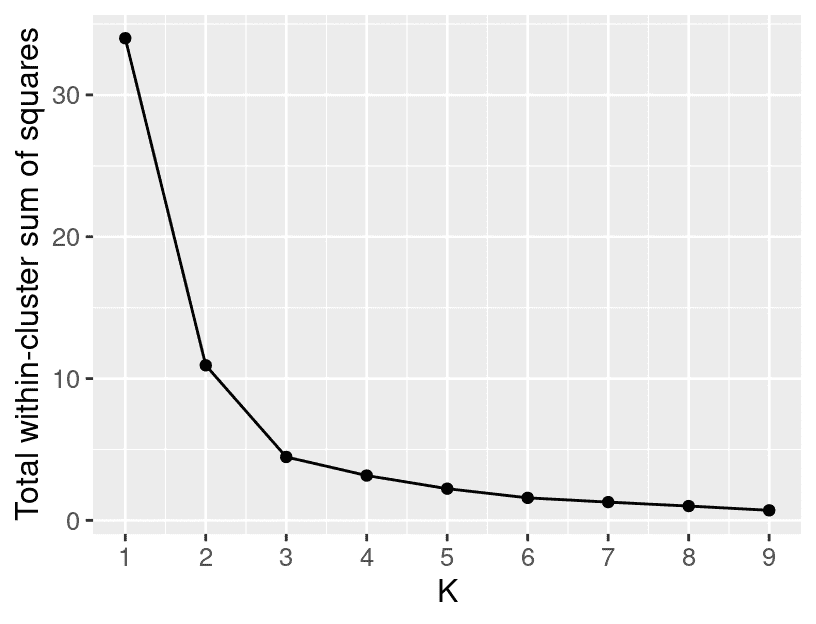

图 9.15：当 K-means 使用 10 次重启运行时，显示总 WSSD 与簇数关系的图。

## 9.7 练习

本章涵盖的练习题可以在配套的[工作表存储库](https://worksheets.datasciencebook.ca)中找到，位于“聚类”行。您可以通过点击“启动绑定器”按钮在浏览器中启动工作表的交互式版本。您还可以通过点击“查看工作表”预览非交互式版本的工作表。如果您决定下载工作表并在自己的机器上运行，请确保遵循第十三章中找到的计算机设置说明。这将确保工作表提供的自动反馈和指导能够按预期工作。

## 9.8 其他资源

+   *An Introduction to Statistical Learning* (James et al. 2013)的第十章是学习聚类和一般无监督学习过程的绝佳下一站。在聚类的特定领域，它提供了对 K-means 的绝佳介绍，同时也涵盖了当你预期数据中存在子组，以及子组内的子组等时，如何进行*层次聚类*。在更广泛的无监督学习领域，它涵盖了*主成分分析（PCA）*，这是一种非常流行的减少数据集中预测变量数量的技术。

### 参考文献

Gorman, Kristen, Tony Williams, 和 William Fraser. 2014. “南极企鹅（Pygoscelis 属）群体中的生态性性别二态性和环境可变性。” *PLoS ONE* 9 (3)。Horst, Allison, Alison Hill, 和 Kristen Gorman. 2020. *palmerpenguins: Palmer Archipelago Penguin Data*。[`allisonhorst.github.io/palmerpenguins/`](https://allisonhorst.github.io/palmerpenguins/)。James, Gareth, Daniela Witten, Trevor Hastie, 和 Robert Tibshirani. 2013. *An Introduction to Statistical Learning*。第 1 版。Springer。[`www.statlearning.com/`](https://www.statlearning.com/)。Lloyd, Stuart. 1982. “PCM 中的最小二乘量化。” *IEEE Transactions on Information Theory* 28 (2): 129–37。
