# 第十章 统计推断

> 原文：[`datasciencebook.ca/inference.html`](https://datasciencebook.ca/inference.html)

## 10.1 概述

实践中的典型数据分析任务是，基于从感兴趣总体中抽取的观察数据，对未知方面做出结论；我们通常不会得到整个总体的数据。关于数据集中总结、模式、趋势或关系如何扩展到更广泛总体的数据分析问题被称为**推断问题**。本章将从从总体抽样的基本思想开始，然后介绍统计推断中的两种常见技术：*点估计*和*区间估计*。

## 10.2 章节学习目标

到本章结束时，读者将能够做到以下几点：

+   描述可以用统计推断回答的现实世界中的问题示例。

+   定义常见的总体参数（例如，均值、比例、标准差），这些参数通常使用样本数据进行估计，并从样本中估计这些参数。

+   定义以下统计抽样术语：总体、样本、总体参数、点估计和抽样分布。

+   解释总体参数和样本点估计之间的区别。

+   使用 R 从有限总体中抽取随机样本。

+   使用 R 从有限总体中创建抽样分布。

+   描述样本大小如何影响抽样分布。

+   定义自举。

+   使用 R 创建自举分布来近似抽样分布。

+   对比自举和抽样分布。

## 10.3 为什么我们需要抽样？

我们经常需要理解我们在数据子集中观察到的数量与更广泛总体中的相同数量之间的关系。例如，假设一家零售商正在考虑销售 iPhone 配件，并且他们想要估计市场可能有多大。此外，他们还想要制定如何在北美大学和校园中推广产品的策略。这家零售商可能会提出以下问题：

*在北美所有本科生中，拥有 iPhone 的比例是多少？*

在上述问题中，我们感兴趣的是对北美所有本科生做出结论；这被称为**总体**。一般来说，总体是我们感兴趣研究的所有个体或案例的完整集合。进一步来说，在上述问题中，我们感兴趣的是基于整个总体计算一个数量——iPhone 拥有者的比例。这个比例被称为**总体参数**。一般来说，总体参数是整个总体的数值特征。为了在上述例子中计算这个数字，我们需要询问北美所有的大学生是否拥有 iPhone。在实践中，直接计算总体参数通常既耗时又昂贵，有时甚至不可能。

一种更实际的方法是对一个**样本**进行测量，即从总体中收集的一组个体。然后我们可以计算一个**样本估计值**——样本的数值特征，用来估计总体参数。例如，假设我们随机选取了来自北美十名本科生（样本）并计算了拥有 iPhone 的学生比例（样本估计值）。在这种情况下，我们可能会怀疑这个比例是整个总体中拥有 iPhone 的学生比例的合理估计。图 10.1 展示了这个过程。一般来说，使用样本对从其抽取的更广泛总体做出结论的过程被称为**统计推断**。

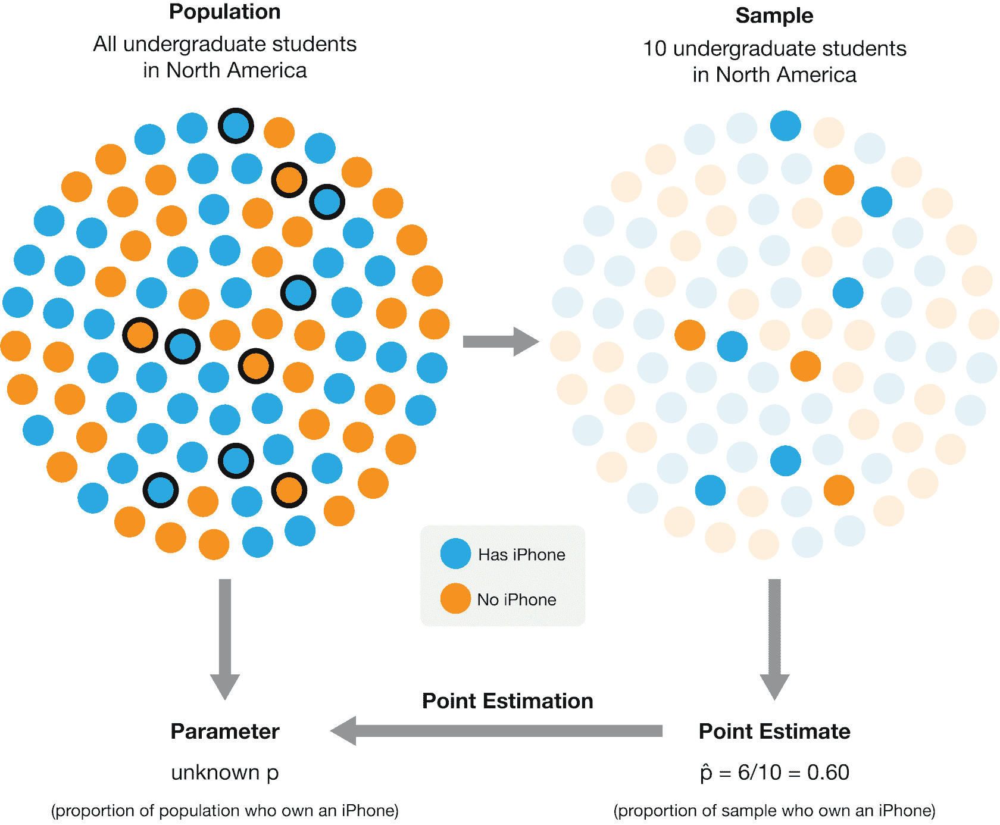

图 10.1：使用来自更广泛总体的样本来获得总体参数的点估计的过程。在这种情况下，10 个样本中有 6 个拥有 iPhone，导致估计的总体比例为 60%的 iPhone 拥有者。在这个示例说明中，实际的总体比例为 53.8%。

注意，比例并不是我们可能感兴趣的**唯一**一种总体参数。例如，假设一名在加拿大不列颠哥伦比亚大学就读的本科生正在寻找出租的公寓。他们需要制定预算，因此想知道温哥华单身公寓的租金。这个学生可能会提出以下问题：

*温哥华单身公寓月租金的平均价格是多少？*

在这种情况下，群体包括温哥华市所有的一室公寓租赁，群体参数是**每月平均价格**。在这里，我们使用平均值作为中心度量来描述一室公寓租赁价格的“典型值”。但即使在这个例子中，我们也可能对许多其他群体参数感兴趣。例如，我们知道温哥华市不是每个一室公寓租赁的每月价格都相同。学生可能对每月价格的变化程度感兴趣，并希望找到租赁价格的扩散（或变异性）的度量，例如标准差。或者，学生可能对每月租金超过 1000 美元的一室公寓租赁的比例感兴趣。我们想要回答的问题将帮助我们确定我们想要估计的参数。如果我们能够以某种方式观察到温哥华市一室公寓租赁供应的整个群体，我们就可以精确地计算出这些数字；因此，这些都是群体参数。在实际应用中，你会遇到许多种类的观察和群体参数，但在这章中，我们将关注两种设置：

1.  使用分类观察来估计某一类别的比例

1.  使用定量观察来估计平均值（或均值）

## 10.4 抽样分布

### 10.4.1 比例的抽样分布

我们将使用来自[Inside Airbnb](http://insideairbnb.com/) (Cox n.d.)的数据集的例子。Airbnb 是一个在线市场，用于安排度假租赁和住宿。数据集包含 2020 年 9 月加拿大温哥华的房源信息。我们的数据包括 ID 号、社区、房间类型、租赁可容纳的人数、浴室数量、卧室数量、床的数量和每晚的价格。

```r
library(tidyverse)

set.seed(123)

airbnb <- read_csv("data/listings.csv")
airbnb
```

```r
## # A tibble: 4,594 × 8
##       id neighbourhood     room_type accommodates bathrooms bedrooms  beds price
##    <dbl> <chr>             <chr>            <dbl> <chr>        <dbl> <dbl> <dbl>
##  1     1 Downtown          Entire h…            5 2 baths          2     2   150
##  2     2 Downtown Eastside Entire h…            4 2 baths          2     2   132
##  3     3 West End          Entire h…            2 1 bath           1     1    85
##  4     4 Kensington-Cedar… Entire h…            2 1 bath           1     0   146
##  5     5 Kensington-Cedar… Entire h…            4 1 bath           1     2   110
##  6     6 Hastings-Sunrise  Entire h…            4 1 bath           2     3   195
##  7     7 Renfrew-Collingw… Entire h…            8 3 baths          4     5   130
##  8     8 Mount Pleasant    Entire h…            2 1 bath           1     1    94
##  9     9 Grandview-Woodla… Private …            2 1 privat…        1     1    79
## 10    10 West End          Private …            2 1 privat…        1     1    75
## # ℹ 4,584 more rows
```

假设温哥华市想要了解 Airbnb 短租信息以帮助制定城市法规，并且他们想知道有多少 Airbnb 房源被列为整栋房屋或公寓（而不是私人或共享房间）。因此，他们可能想要估计所有 Airbnb 房源中“房源类型”被列为“整栋房屋或公寓”的真实比例。当然，我们通常无法访问整个群体，但在这里（为了学习目的）让我们假设我们的数据集代表了加拿大温哥华市所有 Airbnb 短租房源的群体。我们可以找到`room_type == "Entire home/apt"`的房源比例。

```r
airbnb |>
 summarize(
 n =  sum(room_type == "Entire home/apt"),
 proportion = sum(room_type == "Entire home/apt") / nrow(airbnb)
 )
```

```r
## # A tibble: 1 × 2
##       n proportion
##   <int>      <dbl>
## 1  3434      0.747
```

我们可以看到数据集中`Entire home/apt`房源的比例是 0.747。这个值，0.747，是群体参数。记住，这个参数值在真实数据分析问题中通常是未知的，因为通常不可能对整个群体进行测量。

相反，也许我们可以用一小部分数据来近似它！为了调查这个想法，让我们尝试随机选择 40 个房源（即，从我们的总体中抽取一个大小为 40 的随机样本），并计算该样本的比例。我们将使用`infer`包中的`rep_sample_n`函数来抽取样本。`rep_sample_n`的参数是（1）要抽取的数据框，以及（2）要抽取的样本大小。

```r
library(infer)

sample_1 <- rep_sample_n(tbl = airbnb, size = 40)

airbnb_sample_1 <- summarize(sample_1,
 n = sum(room_type == "Entire home/apt"),
 prop = sum(room_type == "Entire home/apt") / 40
)

airbnb_sample_1
```

```r
## # A tibble: 1 × 3
##   replicate     n  prop
##       <int> <int> <dbl>
## 1         1    28   0.7
```

在这里，我们看到在这个随机样本中，整个房屋/公寓房源的比例是 0.7。哇——这几乎接近我们的真实人口值！但请记住，我们使用 40 个样本大小的随机样本来计算这个比例。这有两个后果。首先，这个值只是一个*估计值*，即我们使用这个样本对我们的人口参数的最佳猜测。鉴于我们在这里估计一个单一值，我们通常将其称为**点估计**。其次，由于样本是随机的，如果我们再抽取一个大小为 40 的随机样本并计算该样本的比例，我们不会得到相同的答案：

```r
sample_2 <- rep_sample_n(airbnb, size = 40)

airbnb_sample_2 <- summarize(sample_2,
 n = sum(room_type == "Entire home/apt"),
 prop = sum(room_type == "Entire home/apt") / 40
)

airbnb_sample_2
```

```r
## # A tibble: 1 × 3
##   replicate     n  prop
##       <int> <int> <dbl>
## 1         1    35 0.875
```

确认了！这次我们的估计值不同。这意味着我们的点估计可能不可靠。确实，由于**抽样变异性**，估计值会因样本而异。但我们究竟应该期望我们的随机样本的估计值会有多大的变化？或者换句话说，基于单个样本，我们真的可以信任我们的点估计到什么程度？

为了理解这一点，我们将从我们的房源人口中模拟许多大小为 40 的样本（远不止两个），并计算每个样本中整个房屋/公寓房源的比例。这种模拟将创建许多样本比例，我们可以使用直方图来可视化这些比例。从总体中抽取给定大小（我们通常称之为$n$）的所有可能样本的估计值的分布称为**抽样分布**。抽样分布将帮助我们了解我们期望从这个总体中抽取的样本比例会有多大的变化。

我们再次使用`rep_sample_n`从我们的 Airbnb 房源人口中抽取 40 个样本。但这次我们将`reps`参数设置为 20,000，以指定我们想要抽取 20,000 个大小为 40 的样本。

```r
samples <- rep_sample_n(airbnb, size = 40, reps = 20000)
samples
```

```r
## # A tibble: 800,000 × 9
## # Groups:   replicate [20,000]
##    replicate    id neighbourhood room_type accommodates bathrooms bedrooms  beds
##        <int> <dbl> <chr>         <chr>            <dbl> <chr>        <dbl> <dbl>
##  1         1  4403 Downtown      Entire h…            2 1 bath           1     1
##  2         1   902 Kensington-C… Private …            2 1 shared…        1     1
##  3         1  3808 Hastings-Sun… Entire h…            6 1.5 baths        1     3
##  4         1   561 Kensington-C… Entire h…            6 1 bath           2     2
##  5         1  3385 Mount Pleasa… Entire h…            4 1 bath           1     1
##  6         1  4232 Shaughnessy   Entire h…            6 1.5 baths        2     2
##  7         1  1169 Downtown      Entire h…            3 1 bath           1     1
##  8         1   959 Kitsilano     Private …            1 1.5 shar…        1     1
##  9         1  2171 Downtown      Entire h…            2 1 bath           1     1
## 10         1  1258 Dunbar South… Entire h…            4 1 bath           2     2
## # ℹ 799,990 more rows
## # ℹ 1 more variable: price <dbl>
```

注意，`replicate`列表示每个房源所属的复制或样本。在上面的例子中，由于 R 默认只打印前几行，看起来所有的房源都将`replicate`设置为 1。但你可以使用`tail()`函数检查最后几项，以验证我们确实创建了 20,000 个样本（或复制）。

```r
tail(samples)
```

```r
## # A tibble: 6 × 9
## # Groups:   replicate [1]
##   replicate    id neighbourhood  room_type accommodates bathrooms bedrooms  beds
##       <int> <dbl> <chr>          <chr>            <dbl> <chr>        <dbl> <dbl>
## 1     20000  3414 Marpole        Entire h…            4 1 bath           2     2
## 2     20000  1974 Hastings-Sunr… Private …            2 1 shared…        1     1
## 3     20000  1846 Riley Park     Entire h…            4 1 bath           2     3
## 4     20000   862 Downtown       Entire h…            5 2 baths          2     2
## 5     20000  3295 Victoria-Fras… Private …            2 1 shared…        1     1
## 6     20000   997 Dunbar Southl… Private …            1 1.5 shar…        1     1
## # ℹ 1 more variable: price <dbl>
```

现在我们已经获得了样本，我们需要计算每个样本中整个家庭/公寓列表的比例。我们首先按`replicate`变量分组——将每个样本中的列表集合在一起——然后使用`summarize`计算每个样本中的比例。我们下面打印出结果数据框的前几行和最后几行，以表明我们最终得到了 20,000 个点估计值，每个样本一个。

```r
sample_estimates <- samples |>
 group_by(replicate) |>
 summarize(sample_proportion = sum(room_type == "Entire home/apt") / 40)

sample_estimates
```

```r
## # A tibble: 20,000 × 2
##    replicate sample_proportion
##        <int>             <dbl>
##  1         1             0.85 
##  2         2             0.85 
##  3         3             0.65 
##  4         4             0.7  
##  5         5             0.75 
##  6         6             0.725
##  7         7             0.775
##  8         8             0.775
##  9         9             0.7  
## 10        10             0.675
## # ℹ 19,990 more rows
```

```r
tail(sample_estimates)
```

```r
## # A tibble: 6 × 2
##   replicate sample_proportion
##       <int>             <dbl>
## 1     19995             0.75 
## 2     19996             0.675
## 3     19997             0.625
## 4     19998             0.75 
## 5     19999             0.875
## 6     20000             0.65
```

现在我们可以通过图 10.2 中的直方图可视化样本量为 40 的样本比例的抽样分布。请记住：在现实世界中，我们无法访问整个总体。因此，我们无法进行多次抽样，也无法实际构建或可视化抽样分布。我们创建了这个特定的例子，以便我们确实能够访问整个总体，这让我们可以直接为了学习目的可视化抽样分布。

```r
sampling_distribution <- ggplot(sample_estimates, aes(x = sample_proportion)) +
 geom_histogram(color = "lightgrey", bins = 12) +
 labs(x = "Sample proportions", y = "Count") +
 theme(text = element_text(size = 12))

sampling_distribution
```

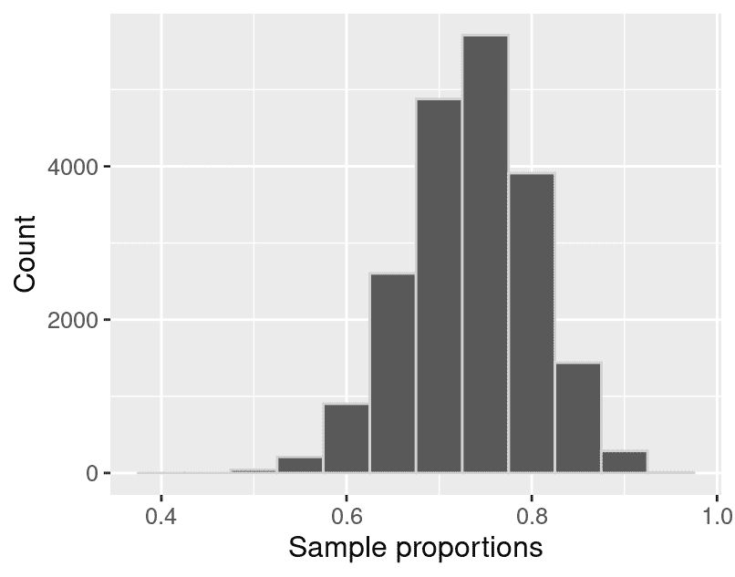

图 10.2：样本量为 40 的样本比例抽样分布。

图 10.2 中的抽样分布看起来呈钟形，大致对称，并且有一个峰值。它围绕着 0.7，样本比例从大约 0.4 到大约 1。实际上，我们可以计算样本比例的均值。

```r
sample_estimates |>
 summarize(mean_proportion = mean(sample_proportion))
```

```r
## # A tibble: 1 × 1
##   mean_proportion
##             <dbl>
## 1           0.747
```

我们注意到样本比例围绕着总体比例值，0.747！一般来说，抽样分布的均值应该等于总体比例。这是一个好消息，因为它意味着样本比例既不是对总体比例的高估也不是低估。换句话说，如果你像我们上面那样抽取许多样本，就不会有高估或低估总体比例的趋势。在一个你只能访问单个样本的真实数据分析环境中，这意味着你会怀疑你的样本点估计值大致同样有可能高于或低于真实总体比例。

### 10.4.2 均值的抽样分布

在上一节中，我们感兴趣的变量——`room_type`——是**分类的**，总体参数是一个比例。正如章节引言中提到的，对于每种类型的变量，都有许多选择总体参数的方法。如果我们想对**定量**变量的总体进行推断，会怎样呢？例如，一位访问加拿大的温哥华的旅行者可能希望估计 Airbnb 列表的每晚平均价格（或平均值）。了解平均值可以帮助他们判断某个列表是否定价过高。我们可以通过直方图可视化每晚价格的总体分布。

```r
population_distribution <- ggplot(airbnb, aes(x = price)) +
 geom_histogram(color = "lightgrey") +
 labs(x = "Price per night (dollars)", y = "Count") +
 theme(text = element_text(size = 12))

population_distribution
```

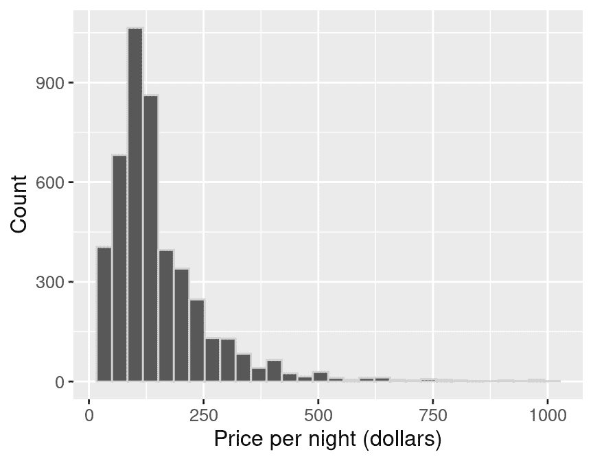

图 10.3：加拿大温哥华所有 Airbnb 列表每晚价格（美元）的总体分布。

在图 10.3 中，我们看到总体分布有一个峰值。它也是偏斜的（即，不对称）：大多数列表每晚的价格低于 250 美元，但少数列表的价格要高得多，在直方图的右侧形成了一个长尾。除了可视化总体分布，我们还可以计算总体均值，即所有 Airbnb 列表每晚的平均价格。

```r
population_parameters <- airbnb |>
 summarize(mean_price = mean(price))

population_parameters
```

```r
## # A tibble: 1 × 1
##   mean_price
##        <dbl>
## 1     154.51
```

温哥华，不列颠哥伦比亚省的所有 Airbnb 租赁每晚的平均价格为 154.51 美元。这个值是我们的总体参数，因为我们是用总体数据来计算它的。

现在假设我们没有访问到总体数据（这通常是情况），但我们仍然想要估计每晚的平均价格。我们可以通过随机抽取尽可能多的 Airbnb 列表来回答这个问题。比如说，我们可以为 40 个列表做这件事。这样的样本会是什么样子？让我们利用我们确实可以访问到总体数据这一事实，并在 R 中模拟抽取一个 40 个列表的随机样本，再次使用`rep_sample_n`。

```r
one_sample <- airbnb |>
 rep_sample_n(40)
```

我们可以创建一个直方图来可视化样本中观察值的分布（见图 10.4），并计算样本的均值。

```r
sample_distribution <- ggplot(one_sample, aes(price)) +
 geom_histogram(color = "lightgrey") +
 labs(x = "Price per night (dollars)", y = "Count") +
 theme(text = element_text(size = 12))

sample_distribution
```


图 10.4：40 个 Airbnb 列表每晚价格（美元）的分布。

```r
estimates <- one_sample |>
 summarize(mean_price = mean(price))

estimates
```

```r
## # A tibble: 1 × 2
##   replicate mean_price
##       <int>      <dbl>
## 1         1     155.80
```

40 个样本的平均值为 155.80 美元。这个数字是总体均值的点估计。回想一下，总体均值是 154.51 美元。所以我们的估计相当接近总体参数：均值大约有 0.8%的误差。请注意，在实践中我们通常无法计算估计的准确性，因为我们无法访问总体参数；如果我们可以，我们就不需要估计它了！

此外，回想一下上一节的内容，点估计可能会变化；如果我们从总体中再次随机抽取样本，我们的估计值可能会改变。那么，我们上面的点估计只是运气好吗？在这个例子中，我们的估计在不同大小的 40 个样本中会有多大的变化？由于我们可以访问到总体，我们可以抽取许多样本，并绘制 40 个样本大小的样本均值的抽样分布，以了解这种变化。在这种情况下，我们将使用 20,000 个 40 个样本大小的样本。

```r
samples <- rep_sample_n(airbnb, size = 40, reps = 20000)
samples
```

```r
## # A tibble: 800,000 × 9
## # Groups:   replicate [20,000]
##    replicate    id neighbourhood room_type accommodates bathrooms bedrooms  beds
##        <int> <dbl> <chr>         <chr>            <dbl> <chr>        <dbl> <dbl>
##  1         1  1177 Downtown      Entire h…            4 2 baths          2     2
##  2         1  4063 Downtown      Entire h…            2 1 bath           1     1
##  3         1  2641 Kitsilano     Private …            1 1 shared…        1     1
##  4         1  1941 West End      Entire h…            2 1 bath           1     1
##  5         1  2431 Mount Pleasa… Entire h…            2 1 bath           1     1
##  6         1  1871 Arbutus Ridge Entire h…            4 1 bath           2     2
##  7         1  2557 Marpole       Private …            3 1 privat…        1     2
##  8         1  3534 Downtown      Entire h…            2 1 bath           1     1
##  9         1  4379 Downtown      Entire h…            4 1 bath           1     0
## 10         1  2161 Downtown      Entire h…            4 2 baths          2     2
## # ℹ 799,990 more rows
## # ℹ 1 more variable: price <dbl>
```

现在我们可以计算每个重复样本的样本均值，并绘制 40 个样本大小的样本均值的抽样分布。

```r
sample_estimates <- samples |>
 group_by(replicate) |>
 summarize(mean_price = mean(price))

sample_estimates
```

```r
## # A tibble: 20,000 × 2
##    replicate mean_price
##        <int>      <dbl>
##  1         1     160.06
##  2         2     173.18
##  3         3     131.20
##  4         4     176.96
##  5         5     125.65
##  6         6     148.84
##  7         7     134.82
##  8         8     137.26
##  9         9     166.11
## 10        10     157.81
## # ℹ 19,990 more rows
```

```r
sampling_distribution_40 <- ggplot(sample_estimates, aes(x = mean_price)) +
 geom_histogram(color = "lightgrey") +
 labs(x = "Sample mean price per night (dollars)", y = "Count") +
 theme(text = element_text(size = 12))

sampling_distribution_40
```

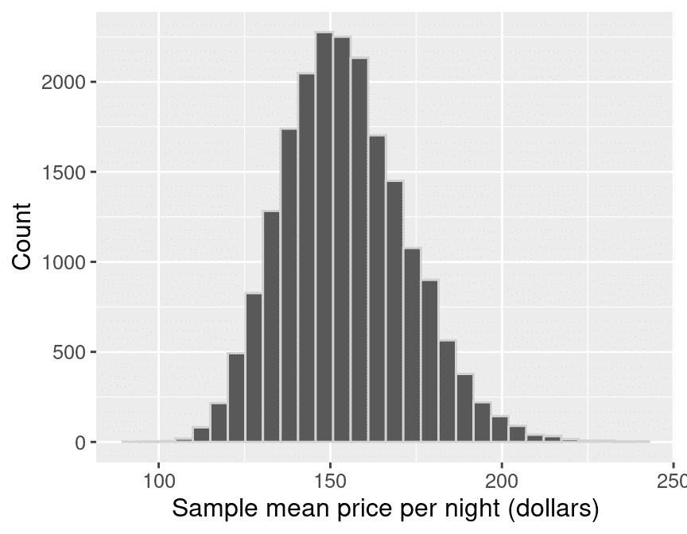

图 10.5：样本量为 40 的样本均值抽样分布。

在图 10.5 中，均值的抽样分布有一个峰值，呈钟形。大多数估计值在 140 美元到 170 美元之间；但在这个范围之外（即点估计与总体参数不接近）的情况占相当大的比例。因此，当我们仅用 0.8%的误差估计总体均值时，确实非常幸运。

让我们在一个图表中可视化总体分布、样本分布和样本分布，以便在图 10.6 中比较它们。比较这三个分布，分布的中心都在大约相同的价格（约 150 美元）附近。原始的总体分布有一个长的右尾，样本分布与总体分布的形状相似。然而，样本分布的形状既不像总体分布也不像样本分布。相反，它呈钟形，并且比总体或样本分布的分布范围更窄。样本均值的变化小于单个观察值，因为在任何随机样本中都会有一些高值和一些低值，这将使平均值不会过于极端。

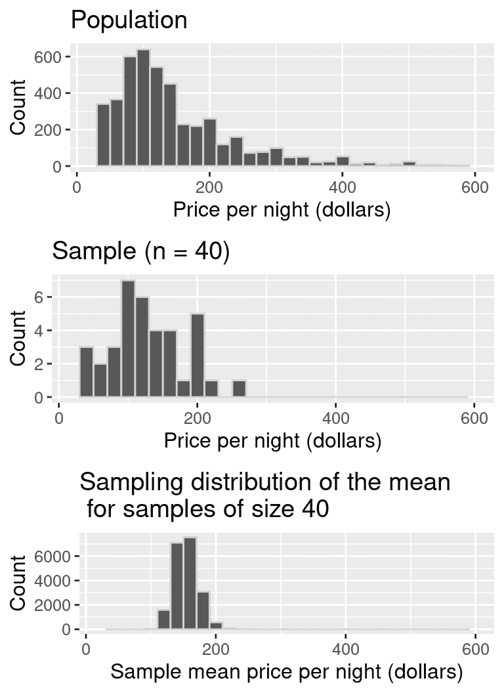

图 10.6：比较总体分布、样本分布和样本分布。

由于样本均值的抽样分布存在相当大的变异——即我们获得的点估计并不非常可靠——有没有什么方法可以提高估计的准确性？提高点估计的一种方法是通过取一个**更大的**样本。为了说明这种方法的影响，我们将取 20、50、100 和 500 个样本，并绘制样本均值的抽样分布。我们用垂直虚线表示抽样分布的均值。

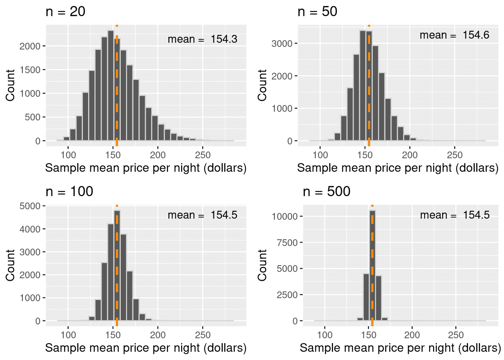

图 10.7：比较样本分布，均值以垂直虚线突出显示。

根据图 10.7 的可视化，关于样本均值的三个要点变得清晰。首先，样本均值的均值（跨样本）等于总体均值。换句话说，抽样分布是以总体均值为中心的。其次，增加样本量会减小抽样分布的离散程度（即变异性）。因此，更大的样本量会导致对总体参数的点估计更加可靠。第三，样本均值的分布大致呈钟形。

> **注意：** 你可能会注意到，在图 10.7 中 `n = 20` 的情况下，分布并不是 *完全* 的钟形。右侧有点偏斜！你也许还会注意到，在 `n = 50` 的情况以及更大样本量时，这种偏斜似乎消失了。一般来说，对于均值和比例的抽样分布，只有在样本量足够大时才会变成钟形。那么“足够大”是多少呢？不幸的是，这完全取决于具体问题。但作为一个经验法则，通常至少需要 20 个样本就足够了。

### 10.4.3 概述

1.  点估计是使用来自总体的样本计算出的单个值（例如，均值或比例）。

1.  估计的抽样分布是从同一总体中抽取的固定大小样本的估计值的分布。

1.  抽样分布的形状通常是钟形的，有一个峰值，并且以总体均值或比例为中心。

1.  抽样分布的离散程度与样本量相关。随着样本量的增加，抽样分布的离散程度减小。

## 10.5 自举法

### 10.5.1 概述

**为什么对抽样分布如此重视？**

在上一节中，我们看到了如何使用来自总体的观察样本来计算总体参数的 **点估计**。由于我们构建的例子中我们可以访问总体，因此我们可以评估估计的准确性，甚至可以了解估计值对于来自总体的不同样本会有多大的变化。但在实际数据分析环境中，我们通常只有一个来自总体的样本，并且无法访问总体本身。因此，我们无法像上一节那样构建抽样分布。正如我们所看到的，我们的样本估计值与总体参数可能会有很大的差异。因此，仅从单个样本中报告点估计可能是不够的。我们还需要报告点估计值的不确定性。

不幸的是，如果我们不能完全访问总体，就无法构建确切的抽样分布。然而，如果我们能够以某种方式**近似**抽样分布的外观，我们可以使用这种近似来报告我们的样本点估计的不确定性（就像我们上面使用**确切**抽样分布所做的那样）。有几种方法可以实现这一点；在这本书中，我们将使用**自助法**。我们将讨论**区间估计**并使用来自总体的单个样本构建**置信区间**。置信区间是我们总体参数的合理值范围。

这里是关键思想。首先，如果你抽取一个足够大的样本，它看起来就像总体。注意图 10.8 中从总体中抽取的不同大小的样本的直方图形状。我们看到，对于足够大的样本，样本的分布看起来就像总体的分布。

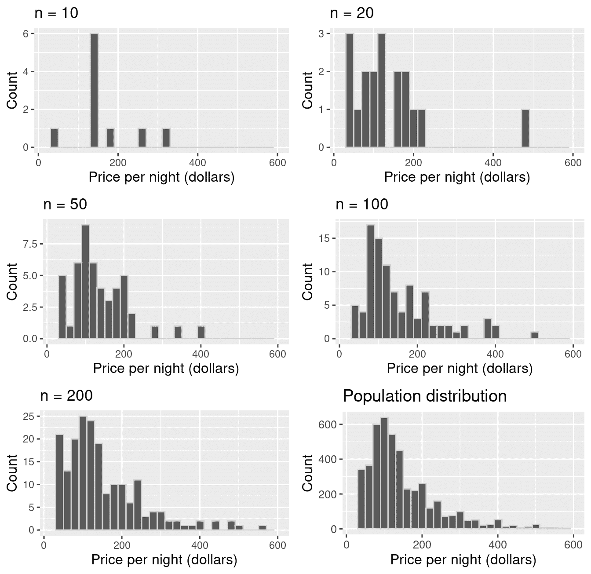

图 10.8：不同大小的样本与总体比较。

在上一节中，我们从一个总体中抽取了许多相同大小的样本，以了解样本估计的变异性。但如果我们样本的大小足够大，以至于看起来像我们的总体，我们可以假装我们的样本就是总体，并从其中抽取更多相同大小的样本（带替换）！这种非常巧妙的技巧被称为**自助法**。请注意，通过从我们的单个观察样本中抽取许多样本，我们并没有获得真正的抽样分布，而是一种我们称之为**自助分布**的近似。

> **注意：**在使用自助法时，我们必须带替换进行抽样。否则，如果我们有一个大小为 $n$ 的样本，并且从中获得了一个大小为 $n$ 的不带替换的样本，它将只是返回我们的原始样本！

本节将探讨如何使用 R 从单个样本创建自助分布。该过程在图 10.9 中进行了可视化。对于一个大小为 $n$ 的样本，你会执行以下操作：

1.  从原始样本中随机选择一个观察值，该样本是从总体中抽取的。

1.  记录观察值的值。

1.  替换那个观察值。

1.  重复步骤 1–3（带替换的抽样）直到你获得 $n$ 个观察值，这些观察值构成一个自助样本。

1.  计算自助样本中 $n$ 个观察值的自助点估计（例如，均值、中位数、比例、斜率等）。

1.  重复步骤 1–5 多次，以创建一个点估计分布（自助分布）。

1.  计算围绕我们观察到的点估计值的合理值范围。

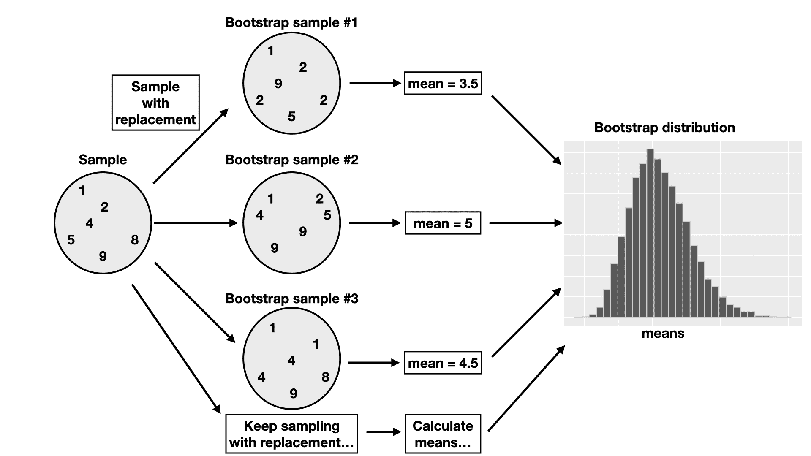

图 10.9：自助过程的概述。

### 10.5.2 R 中的自助法

让我们继续使用我们的 Airbnb 示例来说明我们如何仅使用来自总体的单个样本来创建和使用自举分布。再次假设我们感兴趣的是使用单个样本大小 40 来估计加拿大温哥华所有 Airbnb 列表的每晚平均价格。回想一下我们的点估计是$155.80。样本中的价格直方图显示在图 10.10 中。

```r
one_sample
```

```r
## # A tibble: 40 × 8
##       id neighbourhood     room_type accommodates bathrooms bedrooms  beds price
##    <dbl> <chr>             <chr>            <dbl> <chr>        <dbl> <dbl> <dbl>
##  1  3928 Marpole           Private …            2 1 shared…        1     1    58
##  2  3013 Kensington-Cedar… Entire h…            4 1 bath           2     2   112
##  3  3156 Downtown          Entire h…            6 2 baths          2     2   151
##  4  3873 Dunbar Southlands Private …            5 1 bath           2     3   700
##  5  3632 Downtown Eastside Entire h…            6 2 baths          3     3   157
##  6   296 Kitsilano         Private …            1 1 shared…        1     1   100
##  7  3514 West End          Entire h…            2 1 bath           1     1   110
##  8   594 Sunset            Entire h…            5 1 bath           3     3   105
##  9  3305 Dunbar Southlands Entire h…            4 1 bath           1     2   196
## 10   938 Downtown          Entire h…            7 2 baths          2     3   269
## # ℹ 30 more rows
```

```r
one_sample_dist <- ggplot(one_sample, aes(price)) +
 geom_histogram(color = "lightgrey") +
 labs(x = "Price per night (dollars)", y = "Count") +
 theme(text = element_text(size = 12))

one_sample_dist
```

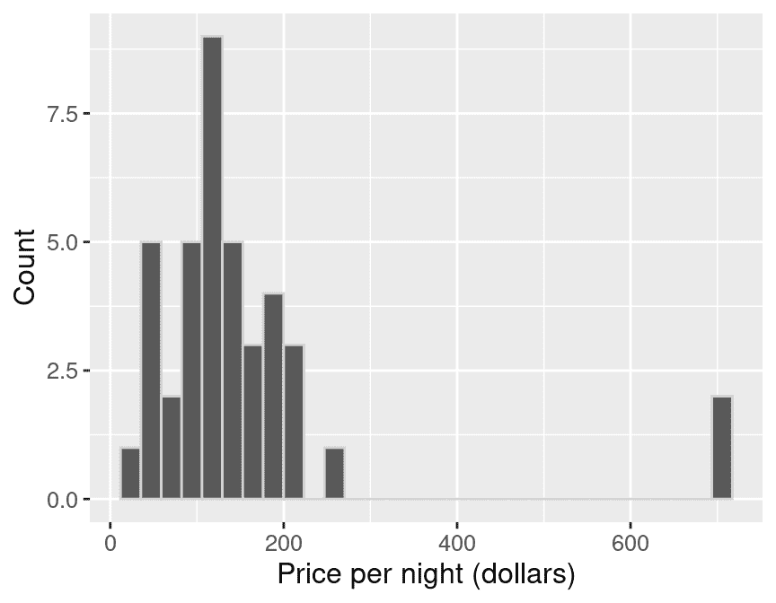

图 10.10：40 个样本大小的每晚价格（美元）直方图。

样本的直方图是偏斜的，有几个观测值偏右。样本的平均值为 $155.80。记住，在实践中，我们通常只有一个来自总体的样本。因此，这个样本和估计值是我们唯一可以工作的数据。

我们现在执行上述列出的步骤 1-5，在 R 中生成单个自举样本，并从该自举样本中计算一个点估计。我们将使用与创建我们的抽样分布时相同的`rep_sample_n`函数。但关键的是，注意我们现在将`one_sample`——我们的 40 个样本大小——作为第一个参数。并且由于我们需要有放回地抽样，我们将`replace`参数的值从默认的`FALSE`更改为`TRUE`。

```r
boot1 <- one_sample |>
 rep_sample_n(size = 40, replace = TRUE, reps = 1)
boot1_dist <- ggplot(boot1, aes(price)) +
 geom_histogram(color = "lightgrey") +
 labs(x = "Price per night (dollars)", y =  "Count") +
 theme(text = element_text(size = 12))

boot1_dist
```

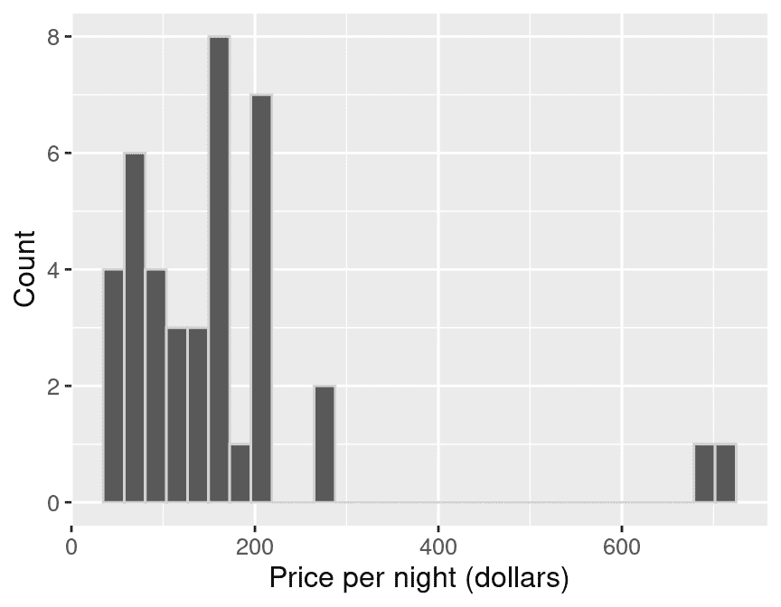

图 10.11：自举分布。

```r
summarize(boot1, mean_price = mean(price))
```

```r
## # A tibble: 1 × 2
##   replicate mean_price
##       <int>      <dbl>
## 1         1     164.20
```

注意在图 10.11 中，我们的自举样本直方图与原始样本直方图形状相似。尽管分布的形状相似，但它们并不相同。你也会注意到原始样本均值和自举样本均值不同。这可能是什么原因呢？记住，我们是从原始样本中有放回地抽样的，所以我们不会再次得到相同的样本值。我们*假装*我们的单个样本接近总体，我们试图通过从我们的原始样本中抽取一个来模拟从总体中抽取另一个样本。 

现在我们使用`rep_sample_n`从原始样本(`one_sample`)中抽取 20,000 个自举样本，并计算这些重复样本的均值。回想一下，这假设`one_sample` *看起来*像我们的原始总体；但由于我们没有访问到总体本身，这通常是我们可以做到的最好的。

```r
boot20000 <- one_sample |>
 rep_sample_n(size = 40, replace = TRUE, reps = 20000)

boot20000
```

```r
## # A tibble: 800,000 × 9
## # Groups:   replicate [20,000]
##    replicate    id neighbourhood room_type accommodates bathrooms bedrooms  beds
##        <int> <dbl> <chr>         <chr>            <dbl> <chr>        <dbl> <dbl>
##  1         1  1276 Hastings-Sun… Entire h…            2 1 bath           1     1
##  2         1  3235 Hastings-Sun… Entire h…            2 1 bath           1     1
##  3         1  1301 Oakridge      Entire h…           12 2 baths          2    12
##  4         1   118 Grandview-Wo… Entire h…            4 1 bath           2     2
##  5         1  2550 Downtown Eas… Private …            2 1.5 shar…        1     1
##  6         1  1006 Grandview-Wo… Entire h…            5 1 bath           3     4
##  7         1  3632 Downtown Eas… Entire h…            6 2 baths          3     3
##  8         1  1923 West End      Entire h…            4 2 baths          2     2
##  9         1  3873 Dunbar South… Private …            5 1 bath           2     3
## 10         1  2349 Kerrisdale    Private …            2 1 shared…        1     1
## # ℹ 799,990 more rows
## # ℹ 1 more variable: price <dbl>
```

```r
tail(boot20000)
```

```r
## # A tibble: 6 × 9
## # Groups:   replicate [1]
##   replicate    id neighbourhood  room_type accommodates bathrooms bedrooms  beds
##       <int> <dbl> <chr>          <chr>            <dbl> <chr>        <dbl> <dbl>
## 1     20000  1949 Kitsilano      Entire h…            3 1 bath           1     1
## 2     20000  1025 Kensington-Ce… Entire h…            3 1 bath           1     1
## 3     20000  3013 Kensington-Ce… Entire h…            4 1 bath           2     2
## 4     20000  2868 Downtown       Entire h…            2 1 bath           1     1
## 5     20000  3156 Downtown       Entire h…            6 2 baths          2     2
## 6     20000  1923 West End       Entire h…            4 2 baths          2     2
## # ℹ 1 more variable: price <dbl>
```

让我们看一下自举样本的前六个重复的直方图。

```r
six_bootstrap_samples <- boot20000 |>
 filter(replicate <= 6)

ggplot(six_bootstrap_samples, aes(price)) +
 geom_histogram(color = "lightgrey") +
 labs(x = "Price per night (dollars)", y = "Count") +
 facet_wrap(~replicate) +
 theme(text = element_text(size = 12))
```

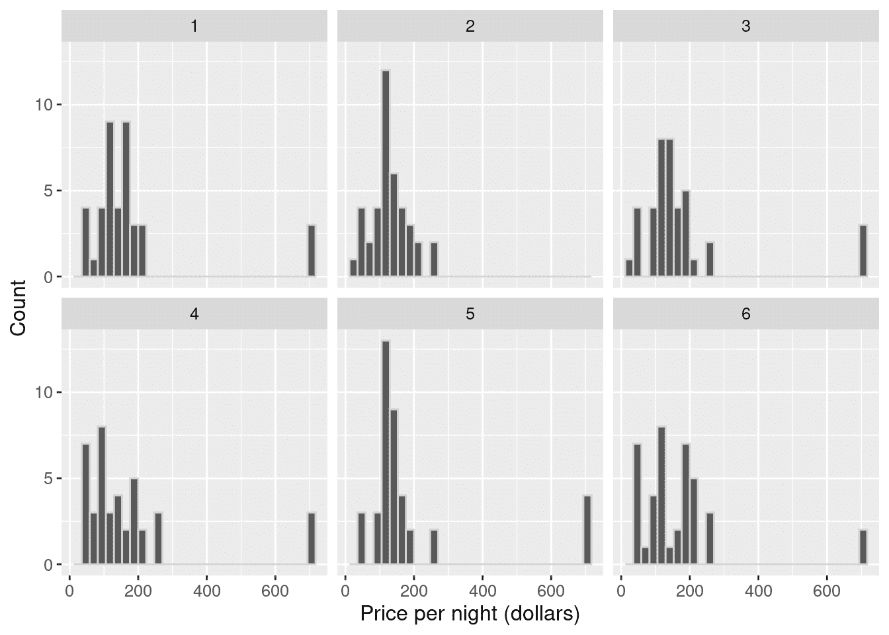

图 10.12：自举样本的前六个重复的直方图。

我们在图 10.12 中看到自举样本的不同之处。我们还可以计算这六个重复样本的样本均值。

```r
six_bootstrap_samples |>
 group_by(replicate) |>
 summarize(mean_price = mean(price))
```

```r
## # A tibble: 6 × 2
##   replicate mean_price
##       <int>      <dbl>
## 1         1     177.2 
## 2         2     131.45
## 3         3     179.10
## 4         4     171.35
## 5         5     191.32
## 6         6     170.05
```

我们可以看到，自助样本分布和样本均值是不同的。它们之所以不同，是因为我们是**有放回地**进行抽样的。现在我们将计算 20,000 个自助样本的点估计值，并生成我们的点估计的自助分布。自助分布（图 10.13）表明，如果我们再次抽样，我们可能会如何预期我们的点估计的表现。

```r
boot20000_means <- boot20000 |>
 group_by(replicate) |>
 summarize(mean_price = mean(price))

boot20000_means
```

```r
## # A tibble: 20,000 × 2
##    replicate mean_price
##        <int>      <dbl>
##  1         1     177.2 
##  2         2     131.45
##  3         3     179.10
##  4         4     171.35
##  5         5     191.32
##  6         6     170.05
##  7         7     178.83
##  8         8     154.78
##  9         9     163.85
## 10        10     209.28
## # ℹ 19,990 more rows
```

```r
tail(boot20000_means)
```

```r
## # A tibble: 6 × 2
##   replicate mean_price
##       <int>      <dbl>
## 1     19995     130.40
## 2     19996     189.18
## 3     19997     168.98
## 4     19998     168.23
## 5     19999     155.73
## 6     20000     136.95
```

```r
boot_est_dist <- ggplot(boot20000_means, aes(x = mean_price)) +
 geom_histogram(color = "lightgrey") +
 labs(x = "Sample mean price per night (dollars)", y = "Count") +
 theme(text = element_text(size = 12))

boot_est_dist
```

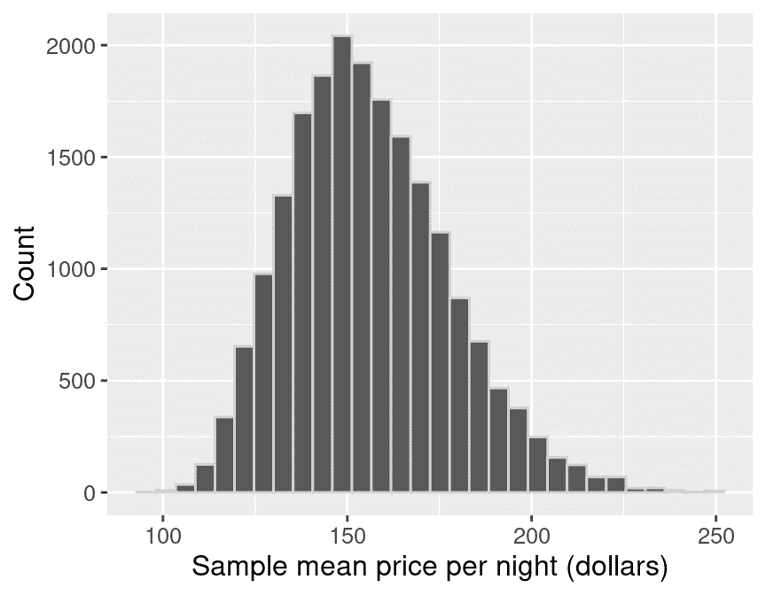

图 10.13：自助样本均值的分布。

让我们比较我们通过从原始样本（大小为 40）中多次抽样构建的自助分布，与从总体中多次抽样的真实抽样分布。

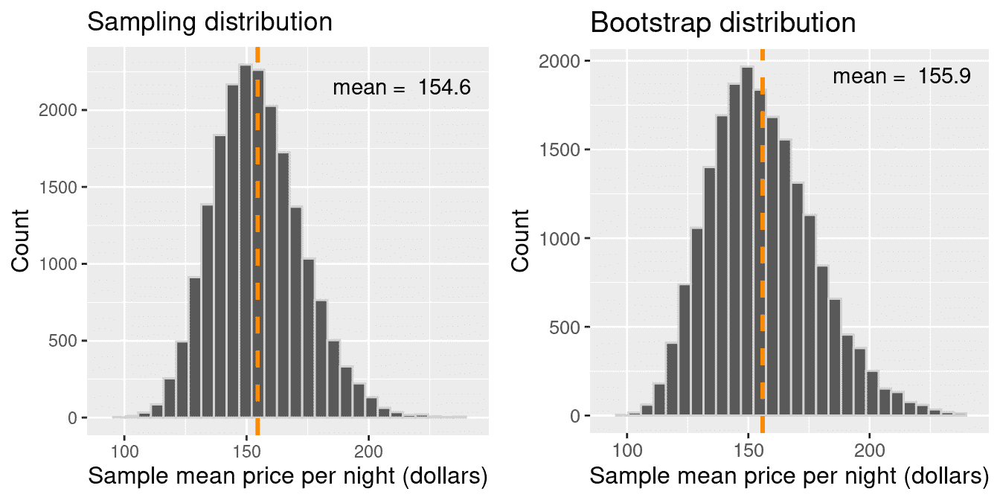

图 10.14：自助样本均值分布与抽样分布的比较。

从图 10.14 中我们可以提取出两个关键点。首先，真实抽样分布和自助分布的形状和分布范围相似；自助分布让我们能够感受到点估计的变异性。第二个重要点是这两个分布的均值不同。抽样分布以 $154.51$ 为中心，这是总体均值。然而，自助分布以原始样本每晚的平均价格 $155.87$ 为中心。因为我们是从原始样本中反复重新抽样，所以我们看到自助分布以原始样本的均值为中心（与样本均值的抽样分布不同，后者以总体参数值为中心）。

图 10.15 总结了自助过程。这里的想法是，当我们只有一个样本时，我们可以使用自助样本均值的分布来近似样本均值的抽样分布。由于自助分布很好地近似了抽样分布的分布范围，我们可以使用自助分布的范围来帮助我们为我们的总体参数估计开发一个合理的范围！

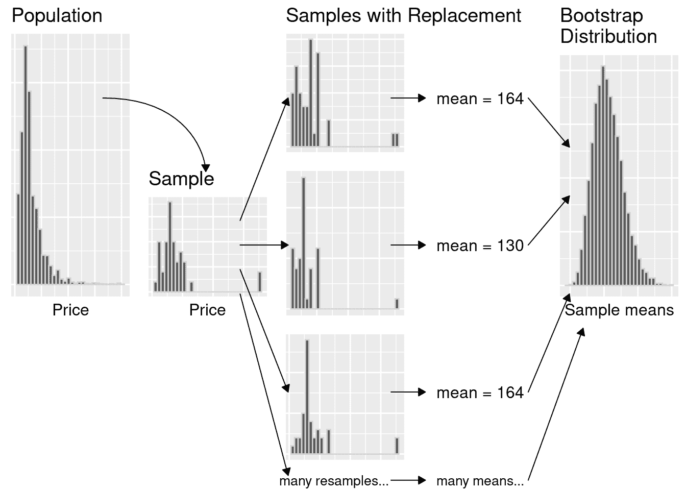

图 10.15：自助过程的总结。

### 10.5.3 使用自助法计算合理的范围

现在我们已经构建了自举分布，让我们用它来创建一个近似 95%百分位数的自举置信区间。**置信区间**是对于总体参数的合理值范围。我们将找到覆盖自举分布中间 95%的值范围，从而得到一个 95%的置信区间。你可能想知道，“95%置信”是什么意思？如果我们取 100 个随机样本并计算 100 个 95%置信区间，那么大约 95%的区间会捕捉到总体参数的值。注意，95%并没有什么特殊之处。我们可以使用其他水平，例如 90%或 99%。我们的置信水平与精度之间存在平衡。更高的置信水平对应于更宽的区间范围，而较低的置信水平对应于较窄的区间范围。因此，我们选择水平是基于我们愿意承担的错误机会，以及错误对我们应用的含义。一般来说，我们选择置信水平，以便我们对自己的不确定性感到舒适，但又不至于过于严格以至于区间没有帮助。例如，如果我们的决策影响人类生活，错误的影响是致命的，我们可能希望非常自信并选择一个更高的置信水平。

要计算 95%百分位数的自举置信区间，我们将执行以下操作：

1.  将自举分布中的观测值按升序排列。

1.  找到一个值，使得 2.5%的观测值低于它（2.5%百分位数）。使用该值作为区间的下限。

1.  找到一个值，使得 97.5%的观测值低于它（97.5%百分位数）。使用该值作为区间的上限。

在 R 中，我们可以使用`quantile()`函数来完成此操作。分位数以比例而不是百分比表示，因此 2.5th 和 97.5th 百分位数分别是 0.025 和 0.975 分位数。

```r
bounds <- boot20000_means |>
 select(mean_price) |>
 pull() |>
 quantile(c(0.025, 0.975))

bounds
```

```r
##  2.5% 97.5% 
##   119   204
```

我们的范围，$119.28 到 $203.63，涵盖了自举分布中样本平均价格的中间 95%。我们可以在图 10.16 中可视化这个区间。

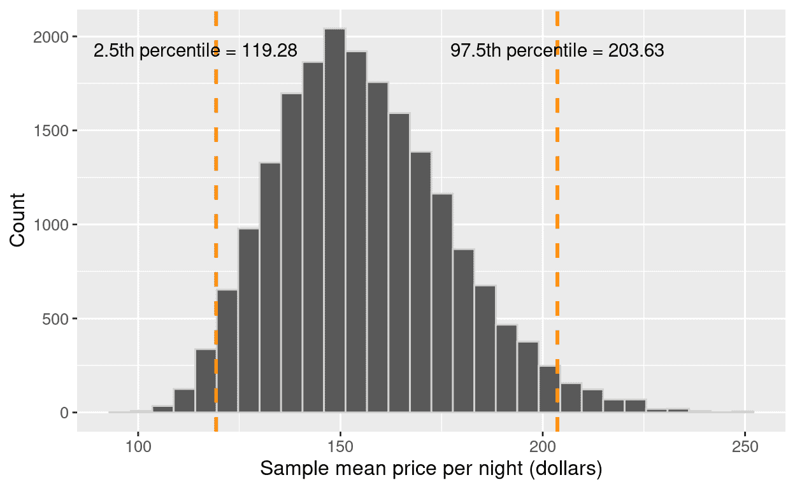

图 10.16：自举样本均值的分布，带有百分位数上下限。

为了完成我们对总体参数的估计，我们将报告点估计以及置信区间的下限和上限。在这里，40 个 Airbnb 列表的样本平均每晚价格为 155.80 美元，我们“有 95%的信心”认为温哥华所有 Airbnb 列表的真实平均每晚价格在 119.28 美元到 203.63 美元之间。请注意，我们的区间确实包含了真实的总体平均值，154.51 美元！然而，在实践中，我们不知道我们的区间是否捕捉到了总体参数，因为我们通常只有一个样本，而不是整个总体。当我们只有一个样本时，这是我们能做到的最好了！

本章只是统计推断之旅的开始。我们可以将这里学到的概念扩展到做更多的事情，比如报告点估计和置信区间，例如测试群体之间的真实差异、变量之间的关联性测试等等。我们只是触及了统计推断的表面；然而，这里展示的材料将为你在未来可能学习的更高级统计技术打下基础！

## 10.6 练习

本章涵盖的练习可以在配套的[工作表存储库](https://worksheets.datasciencebook.ca)中的两个“统计推断”行中找到。您可以通过点击“启动绑定器”按钮在浏览器中启动每个工作表的交互式版本。您也可以通过点击“查看工作表”预览每个工作表的非交互式版本。如果您决定下载工作表并在自己的机器上运行它们，请确保遵循第十三章中找到的计算机设置说明。这将确保工作表提供的自动反馈和指导能够按预期工作。

## 10.7 补充资源

+   *《现代潜水》*（Ismay 和 Kim 2020）的第七章到第十章提供了关于推断的绝佳下一步学习。特别是，第七章和第八章以比本章更深入的方式介绍了使用`tidyverse`和`infer`进行抽样和自助法。第九章和第十章超出了本章的范围，并开始提供推断的一些初步数学基础以及测试假设和执行回归中推断概念的更高级应用。这些材料为深入了解统计学的技术方面提供了一个很好的起点。

+   在《现代探索》之后，*《开放入门统计学》（Diez, Çetinkaya-Rundel, and Barr 2019*）的第四章至第七章提供了一个良好的下一步学习。尽管它仍然绝对是一本入门文本，但在这里内容会变得稍微有点数学化。根据你的背景，你可能实际上想先从第一章至第三章开始学习，在那里你将学习概率论的一些基本概念。虽然这可能看起来像是一个偏离，但概率论是*统计学的语言*；如果你对概率有扎实的掌握，更高级的统计学就会自然而然地对你来说变得容易！

### 参考文献

Cox, Murray. n.d. “Inside Airbnb.” [`insideairbnb.com/`](http://insideairbnb.com/).Diez, David, Mine Çetinkaya-Rundel, and Christopher Barr. 2019\. *OpenIntro Statistics*. OpenIntro, Inc. [`openintro.org/book/os/`](https://openintro.org/book/os/).Ismay, Chester, and Albert Kim. 2020\. *Statistical Inference via Data Science: A Modern Dive into R and the Tidyverse*. Chapman; Hall/CRC Press. [`moderndive.com/`](https://moderndive.com/).
