# 第十一章 使用 Jupyter 将代码和文本结合

> [`datasciencebook.ca/jupyter.html`](https://datasciencebook.ca/jupyter.html)

## 11.1 概述

典型的数据分析不仅涉及编写和执行代码，还包括编写文本和显示图像，这些图像有助于讲述分析的故事。实际上，理想情况下，我们希望将这些三种媒体*交织*在一起，其中文本和图像作为代码及其输出的叙述。在本章中，我们将向您展示如何使用 Jupyter 笔记本（数据科学中常见的编码平台）来实现这一点。Jupyter 笔记本正是我们所需要的：它们允许您在单个文档中结合文本、图像和（可执行！）代码。在本章中，我们将重点介绍使用 Jupyter 笔记本进行 R 编程和通过网页界面编写文本的方法。这些技能对于使您的分析运行至关重要；想想看，这就像早上穿衣服一样！请注意，我们假设您已经设置了 Jupyter 并准备好使用。如果不是这种情况，请首先阅读第十三章，了解如何在您的计算机上安装和配置 Jupyter。

## 11.2 章节学习目标

到本章结束时，读者将能够做到以下内容：

+   创建新的 Jupyter 笔记本。

+   在 Jupyter 笔记本中编写、编辑和执行 R 代码。

+   在 Jupyter 笔记本中编写、编辑和查看文本。

+   在 Jupyter 中打开和查看纯文本数据文件。

+   将 Jupyter 笔记本导出为其他标准文件类型（例如，`.html`，`.pdf`）。

## 11.3 Jupyter

Jupyter (Kluyver 等人 2016) 是一个基于网络的交互式开发环境，用于创建、编辑和执行称为 Jupyter 笔记本的文档。Jupyter 笔记本是包含计算机代码（及其输出）和可格式化文本的文档。鉴于它们在单个文档中将这两种分析工件结合在一起——代码与输出或书面报告是分开的——笔记本是创建可重复数据分析的主要工具之一。可重复的数据分析是指您在分析相同数据时可以可靠且轻松地重新创建相同的结果。尽管这听起来像是任何数据分析都应该始终为真，但在现实中，这并不常见；需要做出有意识的努力以可重复的方式进行数据分析。Jupyter 笔记本的外观示例如图 11.1 所示。

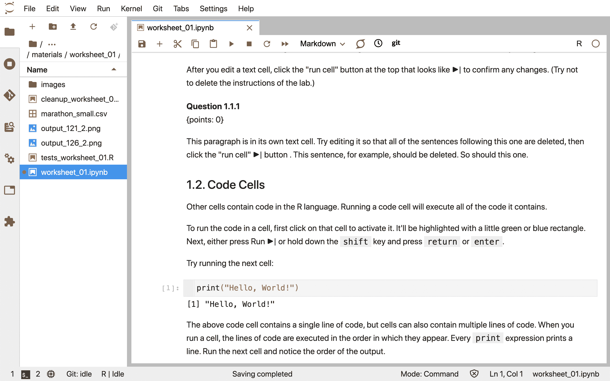

图 11.1：Jupyter 笔记本的截图。

### 11.3.1 访问 Jupyter

开始使用 Jupyter 的一种最简单的方法是使用一个名为 JupyterHub 的基于网络的平台。JupyterHubs 通常已经安装了 Jupyter、R、多个 R 包和协作工具，并已配置好，可供使用。JupyterHubs 通常由组织创建和提供，需要认证才能访问。例如，如果您作为课程的一部分阅读这本书，您的讲师可能已经为您设置了一个 JupyterHub！Jupyter 也可以安装在自己的计算机上；请参阅第十三章获取说明。

## 11.4 代码单元格

Jupyter 笔记本中包含代码的部分被称为代码单元格。尚未执行的代码单元格在其左侧方括号内没有编号（见图 11.2）。运行代码单元格将执行其中包含的所有代码，并且（如果有）输出将直接显示在生成它的代码下方。输出可能包括打印的文本或数字、数据框和数据可视化。已执行的单元格在其左侧方括号内也有一个编号。这个数字表示单元格运行的顺序（见图 11.3）。

图 11.2：Jupyter 中的一个尚未执行的代码单元格。![Jupyter 中的一个已执行的代码单元格。]

图 11.3：Jupyter 中已执行的代码单元格。

### 11.4.1 执行代码单元格

代码单元格可以独立运行，也可以作为执行整个笔记本的一部分，通过在 Jupyter 的**运行**或**内核**菜单中找到的“**运行所有**”命令之一来实现。独立运行单个代码单元格通常用于编辑或编写自己的 R 代码时。执行整个笔记本通常用于确保在与其他人分享之前，分析能够完整运行，以及当笔记本作为自动化过程的一部分使用时。

要独立运行代码单元格，首先需要激活该单元格。这可以通过用光标点击它来完成。Jupyter 会通过在其左侧突出显示蓝色矩形来指示单元格已被激活。在单元格被激活后（见图 11.4），可以通过在工具栏中按下**运行**（▶）按钮，或者使用键盘快捷键 `Shift + Enter` 来运行单元格。

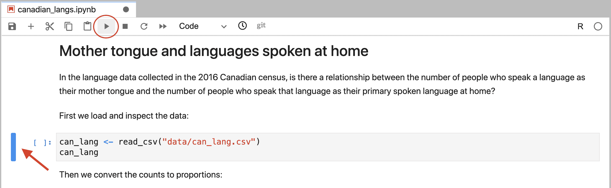

图 11.4：一个已激活的、准备运行的单元格。单元格左侧的蓝色矩形（由红色箭头标注）表示它准备运行。可以通过点击运行按钮（用红色圆圈标注）来运行单元格。

要执行整个笔记本中的所有代码单元格，你有三种选择：

1.  从菜单中选择**运行** >> **运行所有单元格**。

1.  从菜单中选择**内核** >> **重启内核并运行所有单元格…**（图 11.511.5）。

1.  在工具栏中点击（⏭）按钮。

所有这些命令都会导致笔记本中的所有代码单元格运行。然而，它们之间有一个细微的差别。特别是，只有上面的选项 2 和 3 会在运行所有单元格之前重启 R 会话；选项 1 不会重启会话。重启 R 会话意味着在运行此命令之前由运行单元格创建的所有先前对象将被删除。换句话说，重启会话然后运行所有单元格（选项 2 或 3）模拟了你在执行整个笔记本之前完全重启 Jupyter 时笔记本代码的运行方式。

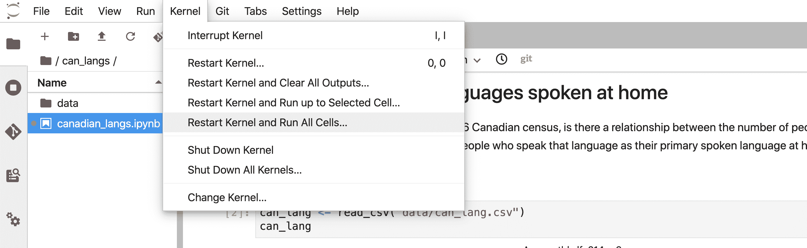

图 11.5：可以通过点击“重启内核并运行所有单元格”来完成重启 R 会话。

### 11.4.2 内核

内核是一个执行笔记本内部代码并输出结果的程序。为 Jupyter 创建了多种不同编程语言的核心，这意味着 Jupyter 可以解释和执行多种不同编程语言的代码。要运行 R 代码，你的笔记本需要一个 R 核心。在窗口的右上角，你可以看到一个圆圈，表示内核的状态。如果圆圈是空的（◯），则内核处于空闲状态，准备执行代码。如果圆圈是填充的（⬤），则内核正在忙于运行某些代码。

你可能会遇到内核长时间卡住的问题，你的笔记本运行非常缓慢且无响应，或者内核失去了连接。如果发生这种情况，请尝试以下步骤：

1.  在屏幕顶部，点击**内核**，然后**中断内核**。

1.  如果这还不解决问题，请点击**内核**，然后**重启内核…**如果你这样做，你将不得不从笔记本的开始处运行你的代码单元格，直到你暂停工作的地方。

1.  如果这仍然没有帮助，请重启 Jupyter。首先，通过点击屏幕左上角的**文件**来保存你的工作，然后**保存笔记本**。接下来，如果你是通过 JupyterHub 服务器访问 Jupyter，从**文件**菜单点击**Hub 控制面板**。选择**停止我的服务器**来关闭它，然后点击**我的服务器**按钮来重新启动它。如果你在自己的电脑上运行 Jupyter，从**文件**菜单点击**关闭**，然后再次启动 Jupyter。最后，导航回你正在工作的笔记本。

### 11.4.3 创建新的代码单元格

要在 Jupyter 中创建新的代码单元格（图 11.6），点击工具栏中的`+`按钮。默认情况下，Jupyter 中所有新的单元格都是代码单元格，所以接下来你只需在刚刚创建的新单元格中编写 R 代码即可！

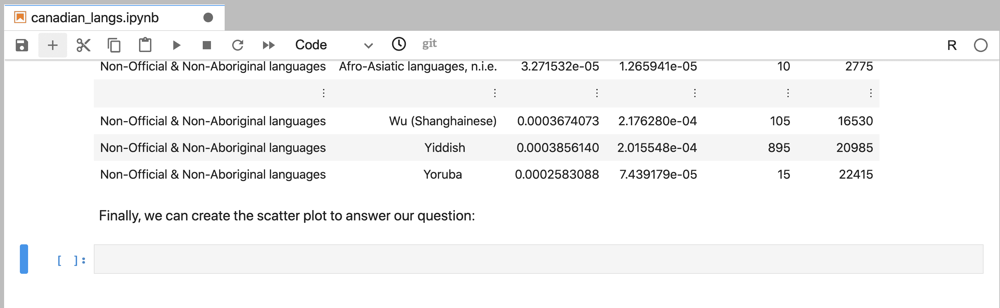

图 11.6：可以通过点击+按钮创建新单元格，默认为代码单元格。

## 11.5 Markdown 单元格

Jupyter 笔记本中的文本单元格被称为 Markdown 单元格。Markdown 单元格是富格式文本单元格，这意味着你可以**加粗**和*斜体*文本，创建主题标题，创建项目符号和编号列表，等等。这些单元格被命名为“Markdown”，因为它们使用*Markdown 语言*来指定富文本格式。你不需要学习 Markdown 就可以在 Jupyter 的 Markdown 单元格中写文本；纯文本就可以正常工作。然而，你最终可能想学习一点 Markdown，以便能够创建格式优美的分析。查看本章末尾的附加资源，以了解你可以从哪里开始学习 Markdown。

### 11.5.1 编辑 Markdown 单元格

要在 Jupyter 中编辑 Markdown 单元格，你需要双击单元格。一旦这样做，文本的未格式化（或*未渲染*）版本将显示出来（图 11.7）。然后你可以使用键盘来编辑文本。要查看格式化（或*渲染*）后的文本（图 11.8），点击工具栏中的**运行**（▶）按钮，或使用`Shift + Enter`快捷键。

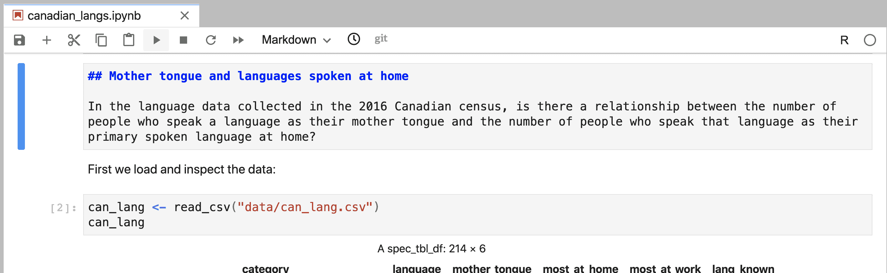

图 11.7：Jupyter 中的一个 Markdown 单元格，尚未渲染且可编辑。![Jupyter 中的一个已渲染并显示富文本格式的 Markdown 单元格]

图 11.8：Jupyter 中的一个已渲染并显示富文本格式的 Markdown 单元格。

### 11.5.2 创建新的 Markdown 单元格

要在 Jupyter 中创建新的 Markdown 单元格，点击工具栏中的`+`按钮。默认情况下，Jupyter 中所有新的单元格都是代码单元格，因此需要将单元格格式更改为被识别和渲染为 Markdown 单元格。为此，使用鼠标点击单元格以确保它被激活。然后点击工具栏上标有“代码”（位于⏭按钮旁边）的下拉框，将其从“**代码**”更改为“**Markdown**”（图 11.9）。

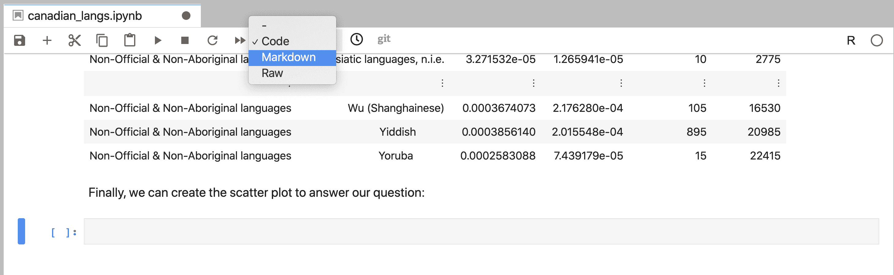

图 11.9：新单元格默认为代码单元格。要创建 Markdown 单元格，必须更改单元格格式。

## 11.6 保存你的工作

就像你工作的任何文件一样，经常保存你的工作以避免丢失进度是至关重要的！Jupyter 有一个自动保存功能，其中打开的文件会定期保存。默认情况下，这是每两分钟保存一次。你也可以通过从**文件**菜单中选择**保存笔记本**，点击工具栏上的磁盘图标，或者使用键盘快捷键（Windows 上的`Control + S`，或 Mac OS 上的`Command + S`）手动保存 Jupyter 笔记本。

## 11.7 运行笔记本的最佳实践

### 11.7.1 执行代码单元格的最佳实践

如你现在可能知道（或者至少可以想象）的，Jupyter 笔记本非常适合交互式编辑、编写和运行 R 代码；这正是它们被设计的目的！因此，Jupyter 笔记本在代码单元格执行顺序方面具有灵活性。这种灵活性意味着可以使用**运行**（▶）按钮以任何任意顺序运行代码单元格。但这种灵活性也有缺点：它可能导致无法以线性顺序（从笔记本的顶部到底部）执行的 Jupyter 笔记本。非线性笔记本是有问题的，因为线性顺序是代码文档的传统运行方式，当其他人运行你的笔记本时，他们会有这样的期望。最后，如果代码被用于某些自动化流程中，它将需要从笔记本的顶部到底部以线性顺序运行。

最常见的无意中创建非线性笔记本的方式是仅依靠使用▶按钮来执行单元格。例如，假设你编写了一些 R 代码来创建一个 R 对象，比如说一个名为`y`的变量。当你执行这个单元格并创建`y`时，它将一直存在，直到你用 R 代码故意删除它，或者当 Jupyter 笔记本 R 会话（即内核）停止或重启。它也可以在另一个不同的代码单元格中引用（图 11.10）。总的来说，这意味着你可以在笔记本中更上面的地方写一个引用`y`的代码单元格，并在当前会话中无错误地执行它（图 11.11）。如果，并且只有在，你以相同的非常规顺序运行单元格的情况下，这也可以在未来会话中成功完成。然而，记住这个非常规顺序是困难的，而且这并不是其他人期望你执行代码的顺序。因此，在未来，如果笔记本以传统的线性顺序（图 11.12）运行，这会导致错误。

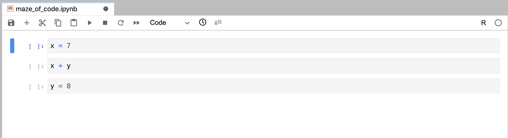

图 11.10：代码的编写顺序错误，但尚未执行。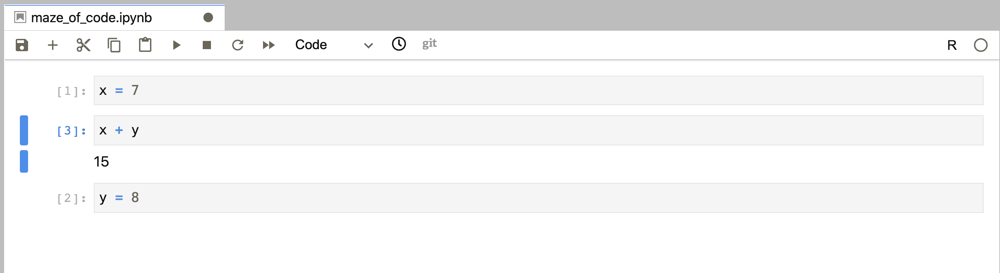

图 11.11：代码的编写顺序错误，并且使用运行按钮以非线性顺序执行而没有错误。执行顺序可以通过跟踪代码单元格左侧的数字来追踪；它们的顺序表示单元格执行的顺序。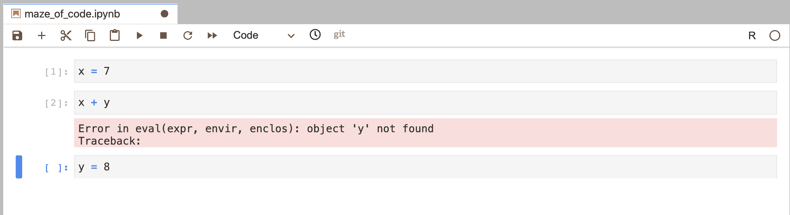

图 11.12：代码的编写顺序错误，但使用“重启内核并运行所有单元格…”以线性顺序执行。这导致第二个代码单元格执行时出现错误，并且它未能运行笔记本中的所有代码单元格。

您也可能意外地创建了一个无法正常工作的笔记本，这是因为在单元格中创建了一个后来被删除的对象。在这种情况下，该对象仅存在于那个特定的 R 会话中，一旦笔记本重启并再次运行，该对象将不再存在。如果该对象在笔记本中的另一个单元格中被引用，当笔记本在新会话中再次运行时，将会发生错误。

当编写代码时，这些事件可能不会对当前的 R 会话产生负面影响；但正如您现在所看到的，它们很可能会在未来会话中运行笔记本时导致错误。在新的 R 会话中定期执行整个笔记本将有助于防止这种情况。如果您重启会话，并在按顺序运行所有单元格时出现新的错误，您至少可以意识到存在问题。尽早了解这个问题将允许您修复问题并确保笔记本可以从头到尾线性运行。

我们建议作为最佳实践，在任何工作周期内至少在 2-3 次运行整个笔记本在一个新的 R 会话中。请注意，关键的是，您必须通过重启内核在新的 R 会话中执行此操作。我们建议使用菜单中的**内核** >> **重启内核并运行所有单元格…**命令或工具栏中的⏭按钮。请注意，**运行** >> **运行所有单元格**菜单项不会重启内核，因此不足以防止这些错误。

### 11.7.2 在笔记本中包含 R 包的最佳实践

如今，大多数数据分析都依赖于 R 中未内置的外部 R 包中的函数。本书中我们高度依赖的 `tidyverse` 元包就是一个例子。此包为我们提供了诸如 `read_csv`（读取数据）、`select`（选择列）和 `ggplot`（创建高质量图形）等函数的访问权限。

如书中之前所述，在使用包含的函数之前，需要先加载外部 R 包。我们推荐的做法是使用 `library(package_name)`。但在 Jupyter 笔记本中，这一行代码应该写在哪里呢？一个想法是在笔记本中使用函数之前加载库。然而，尽管技术上可行，但这会在其他人查看或尝试运行笔记本时产生隐藏的，或者至少是不明显的 R 包依赖关系。这些隐藏的依赖关系可能导致在另一台计算机上执行笔记本时出错，如果所需的 R 包未安装。此外，如果数据分析代码运行时间较长，揭示需要安装以使分析无错误运行的隐藏依赖关系可能需要花费大量时间。

因此，我们建议你在 Jupyter 笔记本顶部附近的一个代码单元中加载所有 R 包。在开始时加载所有包确保在调用其函数之前所有包都已加载，假设笔记本是按照上述建议从上到下线性顺序运行的。这也使得其他人查看或运行笔记本时能够看到分析中使用了哪些外部 R 包，因此，他们应该安装哪些包在自己的计算机上以成功运行分析。

### 11.7.3 运行笔记本的最佳实践总结

1.  编写代码以便可以按线性顺序执行。

1.  当你在 Jupyter 笔记本中编写代码时，通常需要通过 Jupyter 菜单中的 **Kernel** >> **Restart Kernel and Run All Cells…** 命令或工具栏中的 ⏭ 按钮以线性顺序和完整顺序（每次工作会话中 2–3 次）运行整个笔记本。

1.  将加载外部 R 包的代码写在 Jupyter 笔记本的上部附近。

## 11.8 探索数据文件

在尝试将数据文件读入 R 之前预览数据文件是至关重要的，以查看是否存在列名，分隔符是什么，以及是否有需要跳过的行。在 Jupyter 中，您可以通过在 Jupyter 文件浏览器中右键单击文件名，选择**打开方式**，然后选择**编辑器**（图 11.13），来以纯文本格式（例如，逗号和制表符分隔的文件）预览存储为纯文本文件的数据文件（图 11.14）。假设您没有指定使用编辑器打开数据文件。在这种情况下，Jupyter 会为您渲染一个漂亮的表格，您将无法看到列分隔符，因此您将不知道使用哪个函数，以及为它们指定哪些参数和值。

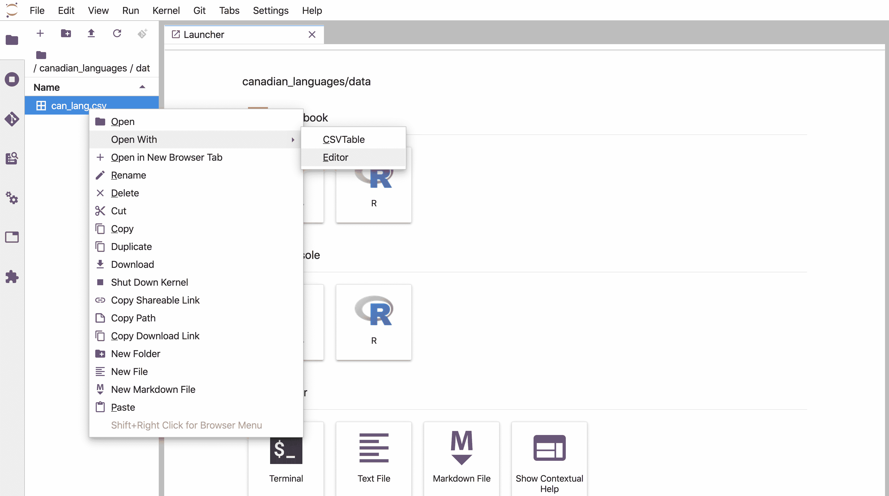

图 11.13：在 Jupyter 中使用编辑器打开数据文件。在 Jupyter 编辑器中查看的数据文件。

图 11.14：在 Jupyter 编辑器中查看的数据文件。

## 11.9 导出为不同的文件格式

在 Jupyter 中，查看、编辑和运行 R 代码是在具有文件扩展名`.ipynb`的 Jupyter 笔记本文件格式中完成的。这种文件格式不容易在 Jupyter 之外打开和查看。因此，为了与不常用 Jupyter 的人分享您的分析，建议您将执行的分析导出为更常见的文件类型，例如`.html`文件或`.pdf`文件。我们建议在执行分析后导出 Jupyter 笔记本，这样您也可以分享代码的输出。请注意，然而，您的观众将无法使用`.html`或`.pdf`文件来*运行*您的分析。如果您希望您的观众能够重现分析，您必须向他们提供`.ipynb` Jupyter 笔记本文件。

### 11.9.1 导出为 HTML

导出为`.html`将生成一个任何人都可以使用网络浏览器（例如，Firefox、Safari、Chrome 或 Edge）打开的可共享文件。`.html`输出将生成一个与 Jupyter 中的 Jupyter 笔记本外观相似的文档。在此处需要注意的是，如果您的 Jupyter 笔记本中有图像，您需要共享图像文件和`.html`文件才能查看它们。

### 11.9.2 导出为 PDF

导出为`.pdf`将生成一个任何人都可以使用许多程序打开的可共享文件，包括 Adobe Acrobat、Preview、网络浏览器等。将内容导出为 PDF 的好处是它是一个独立的文档，即使 Jupyter 笔记本包含了图像文件的引用。遗憾的是，默认设置将导致文档在视觉上看起来与 Jupyter 笔记本大不相同。字体、页面边距和其他细节在`.pdf`输出中会看起来不同。

## 11.10 创建新的 Jupyter 笔记本

在某个时候，你可能会想创建一个新的、全新的 Jupyter 笔记本用于自己的项目，而不是查看、运行或编辑由其他人启动的笔记本。为此，导航到 **启动器** 选项卡，并在 **笔记本** 标题下点击 R 图标。如果看不到 **启动器** 选项卡，你可以通过点击 Jupyter 文件资源管理器顶部的 **+** 按钮来获取一个新的（图 11.15）。

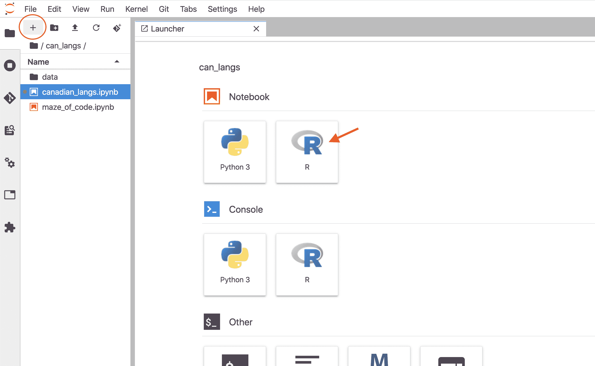

图 11.15：点击笔记本标题下的 R 图标将创建一个新的带有 R 内核的 Jupyter 笔记本。

一旦你创建了一个新的 Jupyter 笔记本，请确保给它一个描述性的名称，因为默认文件名是 `Untitled.ipynb`。你可以通过首先右键单击你刚刚创建的笔记本的文件名，然后点击 **重命名** 来更改文件名。这将使文件名可编辑。使用你的键盘来更改名称。按下 `Enter` 键或在 Jupyter 界面中的任何其他地方点击都将保存更改后的文件名。

我们建议不要在文件名中使用空白或非标准字符。这样做不会阻止你在 Jupyter 中使用该文件。然而，当你开始进行涉及重复和自动化的更高级数据科学项目时，这类事情会变得麻烦。我们建议使用小写字母命名文件，并使用破折号（`-`）或下划线（`_`）分隔单词。

## 11.11 其他资源

+   [JupyterLab 文档](https://jupyterlab.readthedocs.io/en/latest/) 是寻找更多关于在 Jupyter 笔记本中工作信息的良好去处。这份文档深入探讨了我们在本章中涵盖的所有主题，并涵盖了更多高级主题。

+   如果你热衷于学习用于富文本格式的 Markdown 语言，两个不错的起点是 CommonMark 的 [Markdown 快速参考](https://commonmark.org/help/) 和 [Markdown 教程](https://commonmark.org/help/tutorial/).

### 参考文献

Kluyver, Thomas, Benjamin Ragan-Kelley, Fernando Pérez, Brian Granger, Matthias Bussonnier, Jonathan Frederic, Kyle Kelley, 等人. 2016. “Jupyter Notebooks: A Publishing Format for Reproducible Computational Workflows.” In *Positioning and Power in Academic Publishing: Players, Agents and Agendas: Proceedings of the $20^{\text{th}}$ International Conference on Electronic Publishing*. Vol. 87\. Amsterdam: IOS Press.
