# 第十二章 版本控制协作

> 原文：[`datasciencebook.ca/version-control.html`](https://datasciencebook.ca/version-control.html)
> 
> *你主要与你自己协作，而两个月前的我从未回复过邮件。*
> 
> –Mark T. Holder

## 12.1 概述

本章将介绍使用版本控制系统来跟踪项目在其生命周期中的更改，在协作团队中共享和编辑代码，以及将完成的项目分发给目标受众。本章还将介绍如何使用两种最常用的版本控制工具：Git 用于本地版本控制，GitHub 用于远程版本控制。我们将重点关注在标准数据科学项目中日常使用的最常见版本控制操作。Git 有许多用户界面；在本章中，我们将介绍 Jupyter Git 界面。

## 12.2 章节学习目标

到本章结束时，读者将能够做到以下几件事情：

+   描述版本控制是什么以及为什么数据分析项目可以从它中受益。

+   在 GitHub 上创建远程版本控制仓库。

+   使用 Jupyter 的 Git 版本控制工具进行项目版本控制和协作：

    +   克隆远程版本控制仓库以创建本地仓库。

    +   将更改提交到本地版本控制仓库。

    +   将本地更改推送到远程版本控制仓库。

    +   从远程版本控制仓库拉取更改到本地版本控制仓库。

    +   解决合并冲突。

+   给予协作者访问远程 GitHub 仓库的权限。

+   使用 GitHub 问题与协作者进行沟通。

+   在与他人协作的项目中使用最佳实践。

## 12.3 什么是版本控制，为什么我应该使用它？

数据分析项目通常需要迭代和修订，从最初的想法到为预期受众准备好的成品。如果没有对分析中做出的更改进行有意识和故意的跟踪，项目往往会变得混乱。这种混乱可能会对分析项目产生严重、负面的影响，包括代码无法重现的结果、包含遗忘或难以找到的想法片段的临时文件、令人困惑的文件名，这使得不清楚哪个是当前的工作版本（例如，`document_final_draft_final.txt`，`to_hand_in_final_v2.txt`等），以及更多。

此外，数据分析项目的迭代性质意味着，大多数时候，与观众分享的分析的最终版本只是开发过程中探索的一部分。数据可视化和建模方法的变化，以及一些负面结果，通常只能从审查最终、精炼的分析中观察到。这些分析发展部分的可观察性不足可能导致其他人重复那些不起作用的事情，而不是看到那些不起作用的事情，并以此作为新、更有成效方法的跳板。

最后，数据分析通常由一个团队而不是一个人完成。这意味着文件需要在多台计算机之间共享，并且多个人经常同时编辑项目。在这种情况下，确定谁拥有项目的最新版本以及如何解决冲突性编辑可能是一个真正的挑战。

*版本控制*有助于解决这些挑战。版本控制是记录文档变更的过程，包括变更发生的时间和谁做出的变更，以及它们的发展历史。它还提供了查看项目早期版本和撤销变更的手段。版本控制最常用于软件开发，但可以用于任何类型项目的任何电子文件，包括数据分析。能够记录和查看数据分析项目的历史对于理解为什么做出使用一种方法而不是另一种方法的决策等至关重要。版本控制还通过共享编辑的工具促进协作，并解决冲突性编辑。但即使你独自工作，你也应该使用版本控制。它帮助你跟踪你所做的工作、何时完成以及你计划做什么！

要对项目进行版本控制，通常需要两样东西：一个*版本控制系统*和一个*代码仓库托管服务*。版本控制系统是负责跟踪变更、与他人共享你做出的变更、从他人那里获取变更以及解决冲突性编辑的软件。代码仓库托管服务负责在线存储受控项目的副本（即*代码仓库*），你和你合作的伙伴可以远程访问它，讨论问题和错误，并分发你的最终产品。对于这两项，有各种各样的选择。在本教材中，我们将使用 Git 进行版本控制，并使用 GitHub 进行代码仓库托管，因为这两个平台目前是最广泛使用的。在章节末尾的附加资源部分，我们列出了今天许多常见的版本控制系统和代码仓库托管服务。

> **注意：**从技术上讲，您**不必**使用仓库托管服务。例如，您可以对仅存储在您计算机文件夹中的项目进行版本控制——永远不在仓库托管服务上共享。但使用仓库托管服务提供了一些重大好处，包括管理合作者访问权限、讨论和跟踪错误的工具，以及允许外部合作者贡献工作的能力，更不用说在云端备份您的工作的安全性了。由于大多数仓库托管服务现在都提供免费账户，所以很少会有您不想为项目使用仓库托管服务的情况。

## 12.4 版本控制仓库

通常情况下，当我们对数据分析项目进行版本控制时，我们会创建两个仓库副本（见图 12.1）。一个副本我们用作主工作区，在这里我们创建、编辑和删除文件。这个副本通常被称为**本地仓库**。本地仓库通常存在于我们的计算机或笔记本电脑上，但也可以存在于服务器上的工作区中（例如，JupyterHub）。另一个副本通常存储在仓库托管服务中（例如，GitHub），我们可以轻松地与我们的合作者共享它。这个副本通常被称为**远程仓库**。

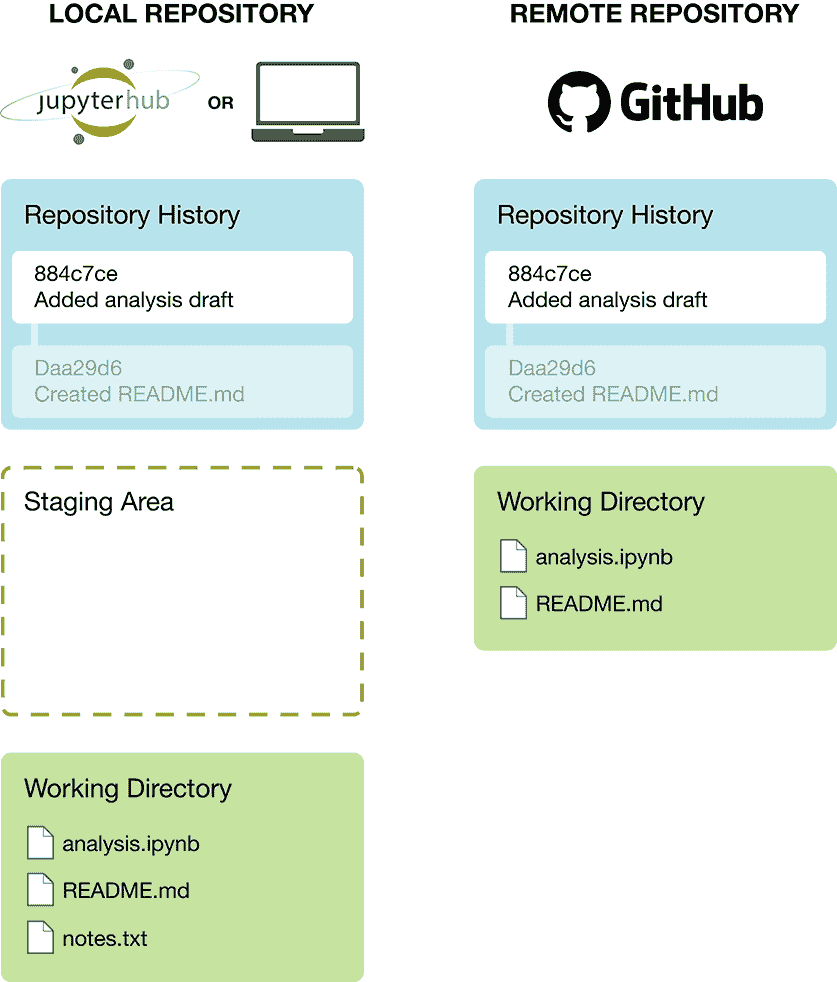

图 12.1：本地和远程版本控制仓库的示意图。

仓库的两个副本都有一个**工作目录**，您可以在其中创建、存储、编辑和删除文件（例如，图 12.1 中的 `analysis.ipynb`）。仓库的两个副本也维护了完整的项目历史（见图 12.1）。这个历史记录了所有已创建的项目文件版本。仓库历史不是自动生成的；Git 必须明确告知何时记录项目的版本。这些记录被称为**提交**。它们是文件内容的快照以及记录创建时仓库的元数据（谁创建了提交，何时创建等）。在图 12.1 中显示的本地和远程仓库中，有两个提交以矩形的形式表示在“仓库历史”部分中。白色矩形代表最近的提交，而模糊的矩形代表之前的提交。每个提交都可以通过您在提交时编写的**消息**和 Git 自动为您添加的**提交哈希**来识别。

消息的目的是包含一个简短、丰富的描述，说明自上次提交以来完成了哪些工作。消息充当了项目在其生命周期中变化的非常有用的叙述。如果你想要查看或回退到项目的早期版本，消息可以帮助你识别要查看或回退到的提交。在图 12.1 中，你可以看到两个这样的消息，每个提交一个：`Created README.md`和`Added analysis draft`。

哈希是一个由大约 40 个字母和数字组成的字符串。哈希的作用是作为提交的唯一标识符，并由 Git 用于索引项目历史。尽管哈希很长——想象一下，为了查看旧项目版本，你需要输入 40 个精确的字符！——Git 能够处理哈希的较短版本。在图 12.1 中，你可以看到两个这样的缩短的哈希，每个提交一个：`Daa29d6`和`884c7ce`。

## 12.5 版本控制工作流程

当你在本地版本控制的仓库中工作时，通常有三个额外的步骤是你必须作为常规工作流程的一部分来执行的。除了仅仅处理文件——创建、编辑和删除文件，就像你通常做的那样——你还必须：

1.  告诉 Git 何时在本地仓库中提交你的变更。

1.  告诉 Git 何时将你的新提交发送到远程 GitHub 仓库。

1.  告诉 Git 何时从远程 GitHub 仓库检索任何新的变更（其他人所做的）。

在本节中，我们将详细讨论这三个步骤。

### 12.5.1 提交本地仓库的变更

当你在本地版本控制仓库中的文件（例如，使用 Jupyter）上工作并保存你的工作，这些变更最初只存在于本地仓库的工作目录中（图 12.2）。

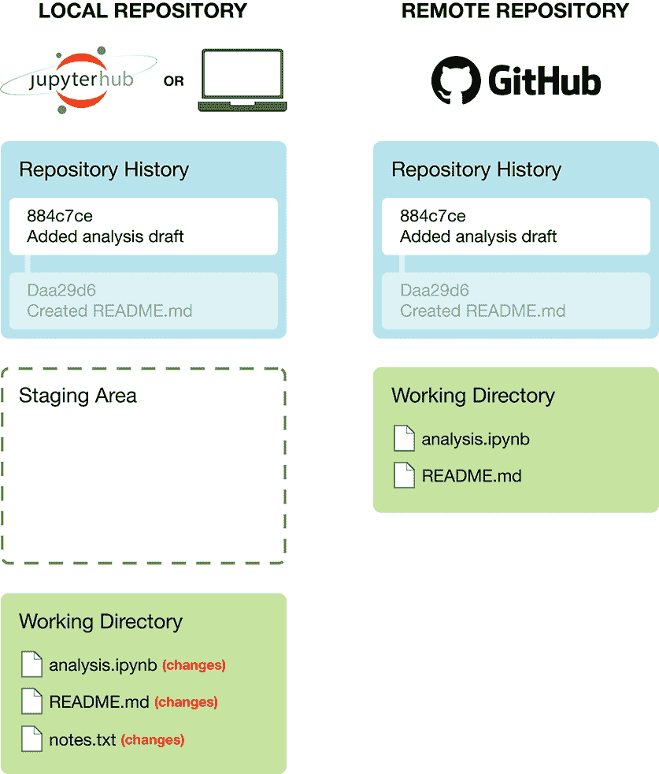

图 12.2：本地仓库中文件有变更。

当你达到想要 Git 记录当前工作版本的状态时，你需要**提交**（即，快照）你的变更。这一步骤的前提是告诉 Git 哪些文件应该包含在这个快照中。我们称这一步为**添加**文件到**暂存区**。请注意，暂存区不是你电脑上的一个真实物理位置；它实际上是一个概念上的占位符，直到这些文件被提交。Git 版本控制系统使用暂存区的优点是你可以选择只提交某些文件的变更。例如，在图 12.3 中，我们只添加了分析项目重要的两个文件（`analysis.ipynb`和`README.md`），而不是项目个人笔记（`notes.txt`）。

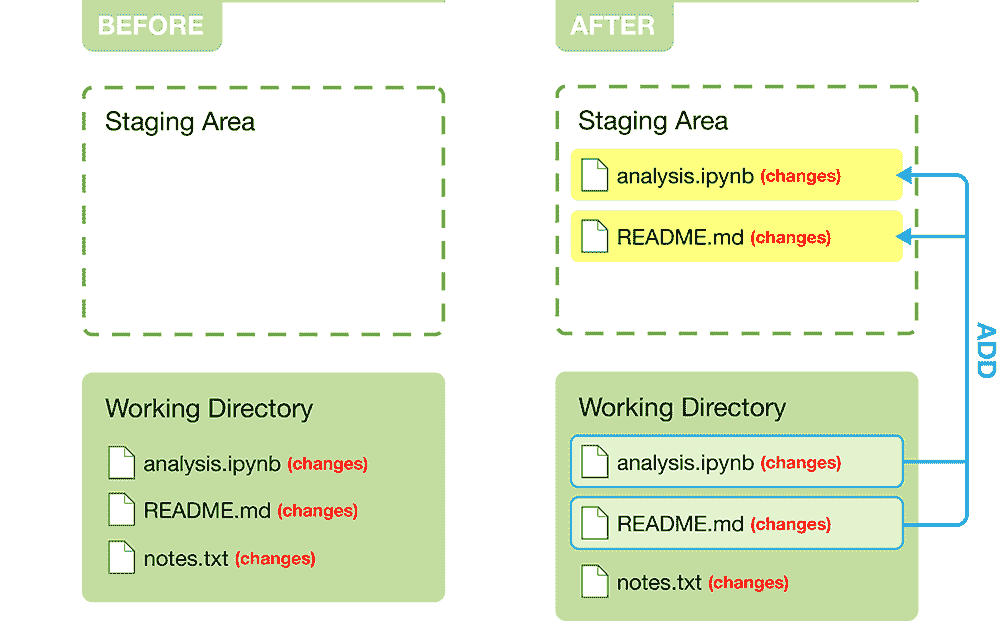

图 12.3：将修改后的文件添加到本地仓库的暂存区。

一旦我们希望提交的文件被添加到暂存区，我们就可以将这些文件提交到仓库历史记录中（见图 12.4）。当我们这样做时，我们必须包含一个有用的*提交信息*来告知协作者（这通常包括未来的您！）关于所做的更改。在图 12.4 中，信息是`关于更改的信息...`；在您的工作中，您应该确保用关于更改的信息替换这个信息。这里也很重要的是要注意，这些更改只被提交到本地仓库的历史记录中。GitHub 上的远程仓库没有改变，协作者还看不到您的新更改。

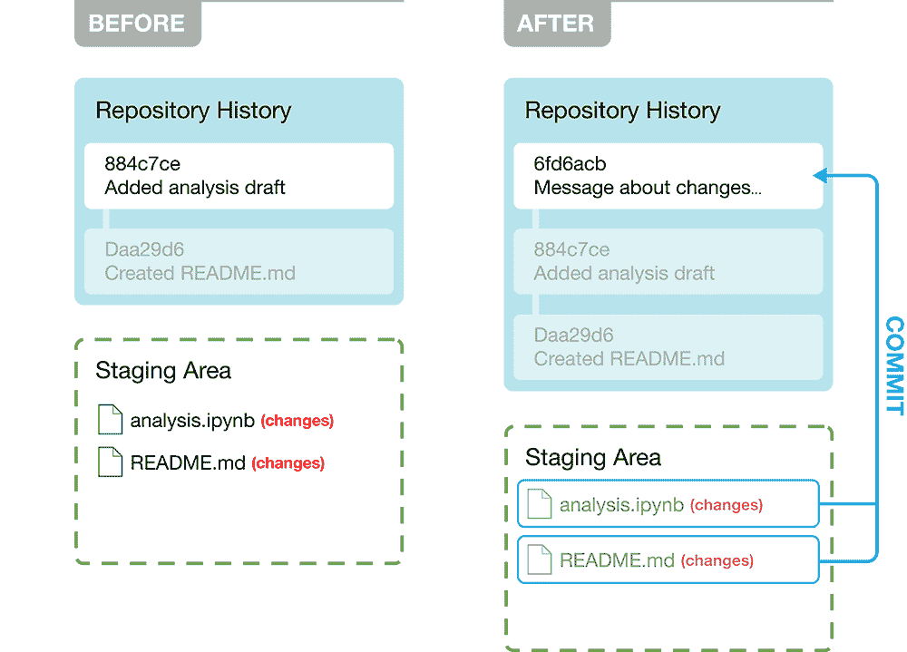

图 12.4：将暂存区中修改后的文件提交到本地仓库历史记录，并附上关于更改的信息。

### 12.5.2 推送更改到远程仓库

一旦您提交了一个或多个想要与协作者共享的更改，您需要将这些更改**推送**（即发送）回 GitHub（见图 12.5）。这会更新远程仓库（即 GitHub）的历史记录，以匹配您本地仓库中的内容。现在，当协作者与远程仓库交互时，他们将能够看到您所做的更改。而且您也可以放心，因为您的工作现在已在云端备份！

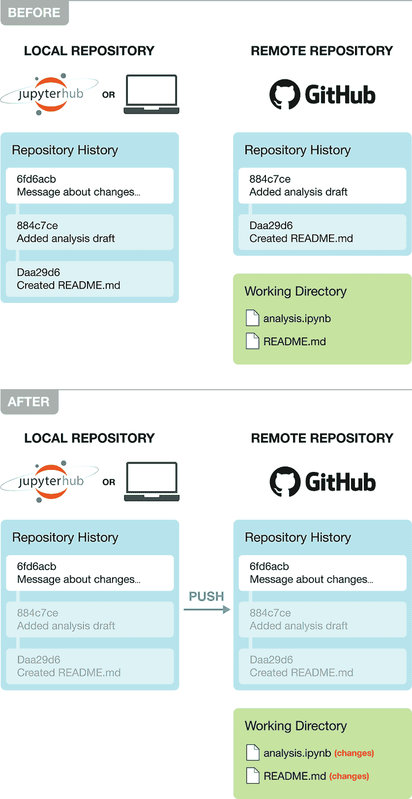

图 12.5：将提交推送到 GitHub 上的远程仓库以发送更改。

### 12.5.3 从远程仓库拉取更改

如果您在与协作者共同进行项目工作，他们也会对文件进行更改（例如，对 Jupyter 笔记本中的分析代码和项目的 README 文件进行更改），并将这些更改提交到他们自己的本地仓库，然后将提交推送到远程 GitHub 仓库以与您共享。当他们推送更改时，这些更改最初只存在于远程 GitHub 仓库中，而不是您的本地仓库中（见图 12.6）。

图 12.6：由协作者推动的更改或直接在 GitHub 上创建的更改将不会自动发送到您的本地仓库。

要从 GitHub 上的远程仓库获取新的更改，您需要将这些更改**拉取**到您自己的本地仓库。通过拉取更改，您将本地仓库同步到 GitHub 上现有的内容（如图 12.7 所示）。此外，直到您从远程仓库拉取更改之前，您将无法推送任何更多更改（尽管您仍然可以在自己的本地仓库中工作并提交更改）。

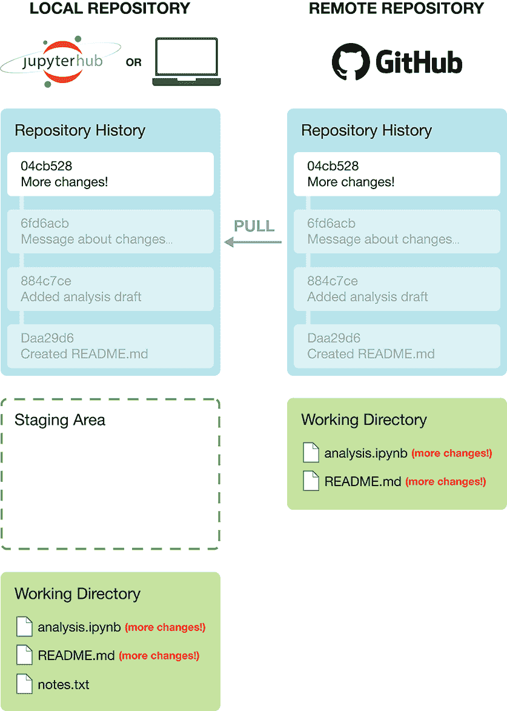

图 12.7：从远程 GitHub 仓库拉取更改以同步您的本地仓库。

## 12.6 使用 GitHub 处理远程仓库

现在您已经了解了 Git 版本控制的一些关键概念和工作流程，我们将逐步介绍实际步骤。开始使用版本控制的新项目有多种不同的方式。为了简单和易于设置，我们建议首先创建一个远程仓库。本节将介绍如何在 GitHub 上创建和编辑远程仓库。一旦您设置了远程仓库，我们建议**克隆**（或复制）该仓库以创建一个本地仓库，您主要在这个本地仓库中工作。您可以在自己的计算机上或服务器上的工作区（例如，JupyterHub 服务器）上克隆仓库。下面的 12.7 节将详细介绍这一步骤。

### 12.6.1 在 GitHub 上创建远程仓库

在您能够在 GitHub 上创建远程仓库之前，您需要一个 GitHub 账户；您可以在[`github.com/`](https://github.com/)注册一个免费账户。一旦您登录了您的账户，您可以通过点击右上角的“+”图标，然后点击“New Repository”，如图 12.8 所示来创建一个新的仓库以托管您的项目。

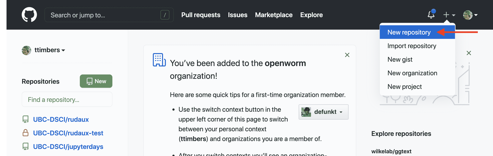

图 12.8：在 GitHub 上，可以通过点击“+”菜单中的“New Repository”来创建新的仓库。

仓库可以设置各种配置，包括名称、可选描述以及是否包含几个模板文件。选择最重要的配置项之一是向外界展示的可见性，要么是公开的，要么是私有的。**公开**的仓库可以被任何人查看。**私有**的仓库只能由您查看。无论是公开的还是私有的仓库，都只能由您编辑，但您可以通过给予其他协作者访问权限来更改这一点。

要开始使用具有模板`README.md`文件的**公开**仓库，请按照图 12.9 中所示采取以下步骤：

1.  输入您项目仓库的名称。在下面的示例中，我们使用`canadian_languages`。大多数仓库遵循类似的命名约定，只涉及由下划线或连字符分隔的小写字母单词。

1.  选择您仓库的隐私选项。

1.  选择“添加一个 README 文件。”这将在您的仓库根目录中创建一个模板文件`README.md`。

1.  当您对仓库名称和配置满意时，点击绿色的“创建仓库”按钮。

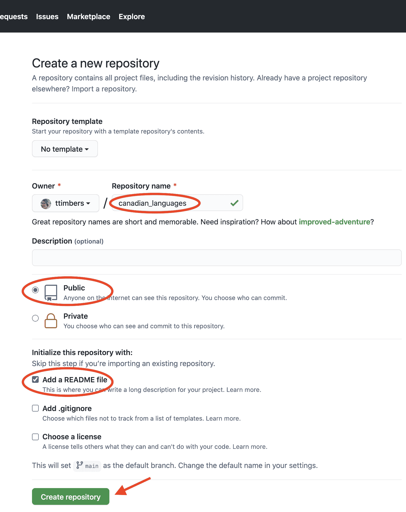

图 12.9：公共项目且以 README.md 模板文件初始化的仓库配置。

一个新创建的公共仓库，带有`README.md`模板文件，其外观应类似于图 12.10 中所示。

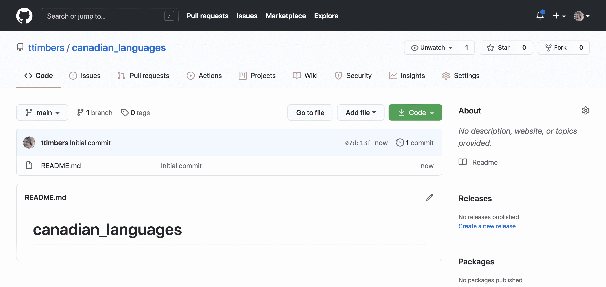

图 12.10：公共项目且以 README.md 模板文件初始化的仓库配置。

### 12.6.2 使用笔工具在 GitHub 上编辑文件

可以使用笔工具来编辑现有的纯文本文件。当您点击笔工具时，文件将在一个文本框中打开，您可以使用键盘进行更改（见图 12.11 和 12.12）。

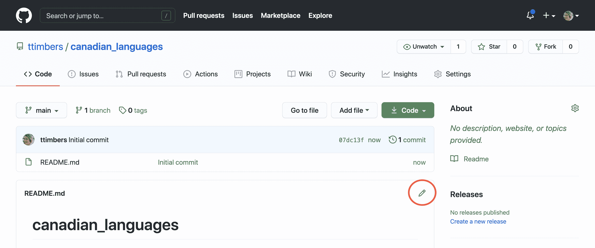

图 12.11：点击笔工具打开用于编辑纯文本文件的文本框。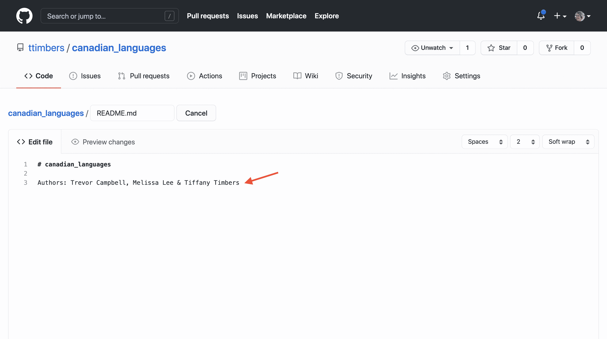

图 12.12：点击笔工具后可以进行编辑的文本框。

完成您的编辑后，可以通过*提交*您的更改来“保存”。当您在仓库中*提交一个文件*时，版本控制系统会拍摄该文件的一个快照。随着您继续在项目上工作，随着时间的推移，您可能会对单个文件进行多次提交；这为该文件生成一个有用的版本历史。在 GitHub 上，如果您点击绿色的“提交更改”按钮，它将保存文件并执行提交（见图 12.13）。

从第 12.5.1 节回忆，您通常在提交之前必须将文件添加到暂存区。为什么我们在 GitHub 上直接工作时不需要这样做？在幕后，当您点击绿色“提交更改”按钮时，GitHub 实际上是在提交之前将那个文件添加到暂存区。但请注意，在 GitHub 上，您每次只能提交一个文件的更改。当您在自己的本地仓库中工作时，您可以同时提交多个文件的更改。这在涉及修改多个文件的项目“改进”时特别有用。您还可以在本地仓库中执行诸如运行代码之类的操作，这在 GitHub 上是不可能的。总的来说，GitHub 上的编辑仅限于对纯文本文件进行的小幅编辑。

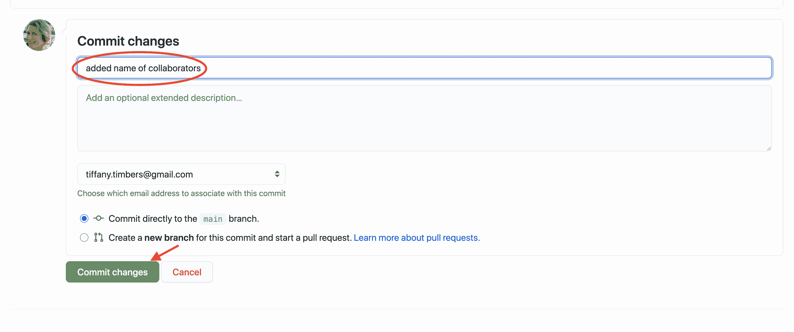

图 12.13：使用笔工具保存更改需要提交这些更改，并关联一个提交信息。

### 12.6.3 使用“添加文件”菜单在 GitHub 上创建文件

“添加文件”菜单可用于创建新的纯文本文件并将文件从您的计算机上传。要创建一个新的纯文本文件，请点击“添加文件”下拉菜单并选择“创建新文件”选项（图 12.14）（version-control.html#fig:create-new-file-01）。

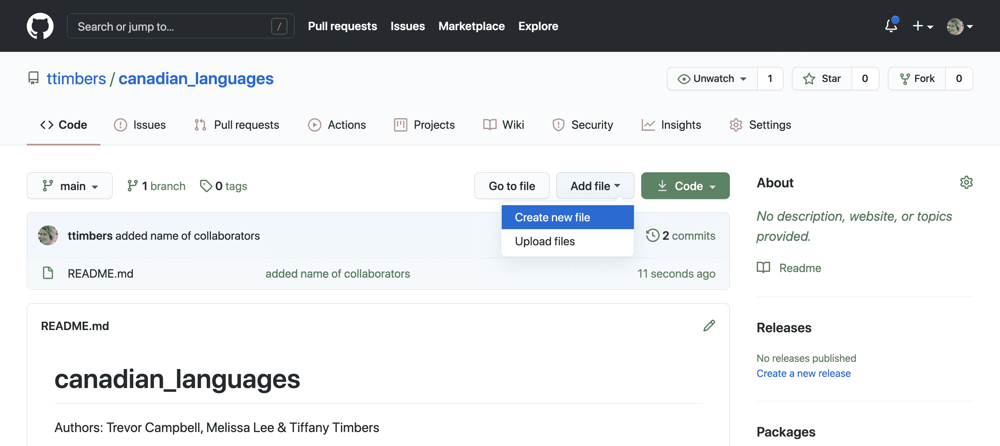

图 12.14：在 GitHub 上可以直接创建新的纯文本文件。

将打开一个页面，其中包含一个用于输入文件名的小文本框，以及一个较大的文本框，可以在其中输入所需的文件内容文本。注意两个标签，“编辑新文件”和“预览”。在它们之间切换可以让您输入和编辑文本，并分别查看文本渲染后的样子（图 12.15）（version-control.html#fig:create-new-file-02）。请注意，GitHub 理解并使用与 Jupyter 笔记本非常相似的 Markdown 语法来渲染`.md`文件，因此“预览”标签对于检查 Markdown 代码的正确性特别有帮助。

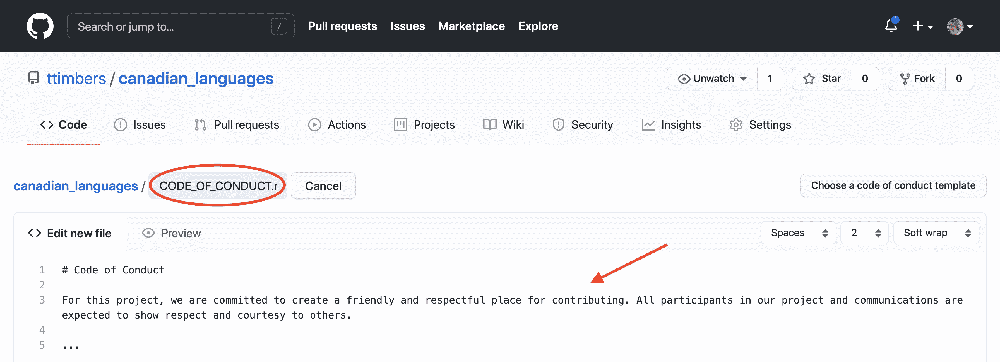

图 12.15：新的纯文本文件需要在红色圆圈中的文本框中输入文件名，并在较大的文本框（红色箭头）中输入文件内容。

通过点击页面底部的绿色“提交更改”按钮（图 12.16）保存并提交您的更改（version-control.html#fig:create-new-file-03）。

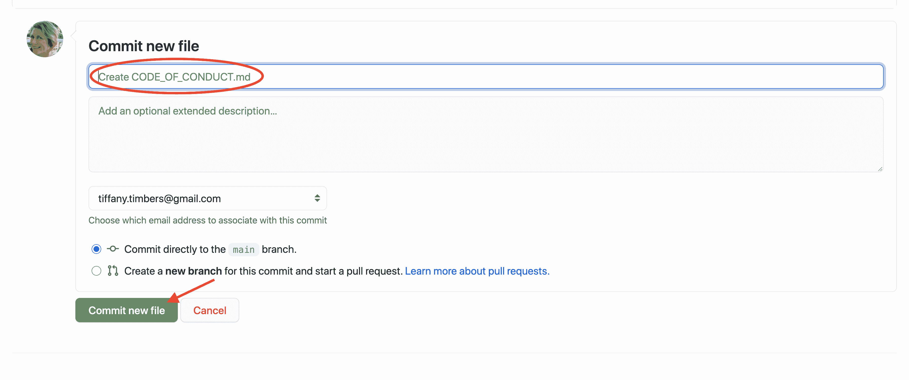

图 12.16：要保存，新创建的文件需要与关联的提交信息一起提交。

你还可以通过使用“添加文件”下拉菜单并选择“上传文件”（图 12.17）来上传你在本地计算机上创建的文件。要选择要上传的文件，你可以将它们拖放到图 12.18 中显示的灰色框区域，或者点击“选择你的文件”链接来访问文件浏览器对话框。一旦选择了要上传的文件，请点击页面底部的绿色“提交更改”按钮（图 12.18）。

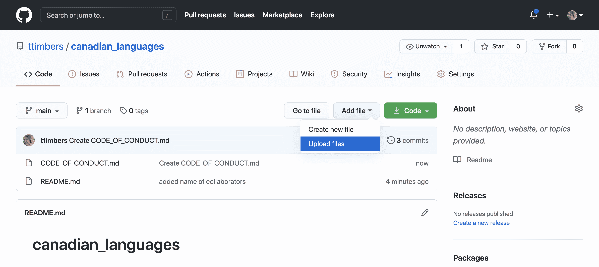

图 12.17：任何类型的文件都可以上传到 GitHub。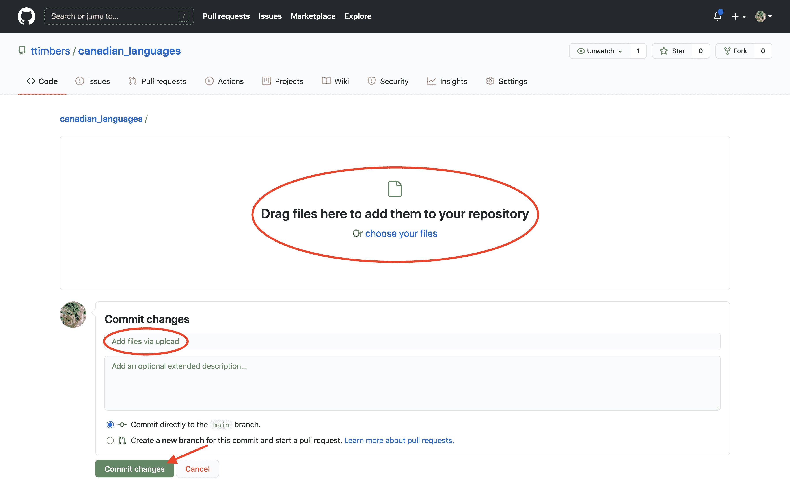

图 12.18：通过将文件拖动到 GitHub 网站（红色圆圈）或点击“选择你的文件”来指定要上传的文件。上传的文件也需要与相关的提交信息一起提交。

注意，Git 和 GitHub 旨在跟踪单个文件的变化。**不要**将整个项目作为一个存档文件（例如，`.zip`）上传。如果你这样做，Git 只能跟踪整个`.zip`文件的变化，这将无法被人类阅读。提交一个大存档文件会违背使用版本控制的目的：你将无法查看、解释或找到项目实际内容中的任何变化的历史记录！

## 12.7 使用 Jupyter 处理本地仓库

虽然有几种方法可以在 GitHub 上创建和编辑文件，但它们并不足以高效地创建和编辑复杂的文件，或者需要执行以评估其是否工作的文件（例如，包含代码的文件）。例如，你无法直接在 GitHub 上运行用 R 代码编写的分析。因此，能够将 GitHub 上创建的远程仓库连接到本地编码环境是非常有用的。这可以通过创建并在此仓库的本地副本中工作来实现。在本章中，我们将重点介绍如何通过 Jupyter 使用 Jupyter Git 扩展与 Git 进行交互。Jupyter Git 扩展可以在你的本地计算机上或 JupyterHub 服务器上运行。我们建议在阅读本章之前先阅读第十一章，以了解如何使用 Jupyter。

### 12.7.1 生成 GitHub 个人访问令牌

要在本地仓库和 GitHub 上的远程仓库之间发送和检索工作，你将经常需要通过 GitHub 进行身份验证以证明你有所需的权限。有多种方法可以做到这一点，但对于初学者，我们推荐使用 HTTPS 方法，因为它更简单，且设置要求较低。为了使用 HTTPS 方法，GitHub 要求你提供一个**个人访问令牌**。个人访问令牌就像密码一样——所以请保密！——但它可以让你对令牌可以访问的账户部分有更精细的控制，并允许你为身份验证设置过期日期。要生成个人访问令牌，你必须首先访问[`github.com/settings/tokens`](https://github.com/settings/tokens)，这将带你到账户设置中的“个人访问令牌”页面。一旦到达那里，点击“生成新令牌”（图 12.19）。请注意，你可能需要使用用户名和密码重新进行身份验证才能继续。

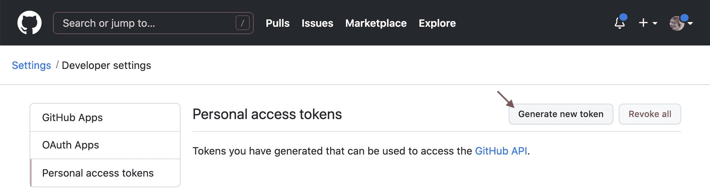

图 12.19：用于启动创建新个人访问令牌的“生成新令牌”按钮。它位于账户设置中的“开发者设置”页面“个人访问令牌”部分。

你将被要求添加一个备注来描述你的个人访问令牌的目的。接下来，你需要为令牌选择权限；这是你可以控制令牌可以访问的账户部分的地方。确保只选择你绝对需要的权限。在图 12.20 中，我们只勾选了“repo”框，这使令牌可以访问我们的仓库（以便我们可以推送和拉取），但无法访问我们其他 GitHub 账户功能。最后，要生成令牌，滚动到该页面的底部并点击绿色的“生成令牌”按钮（图 12.20)。

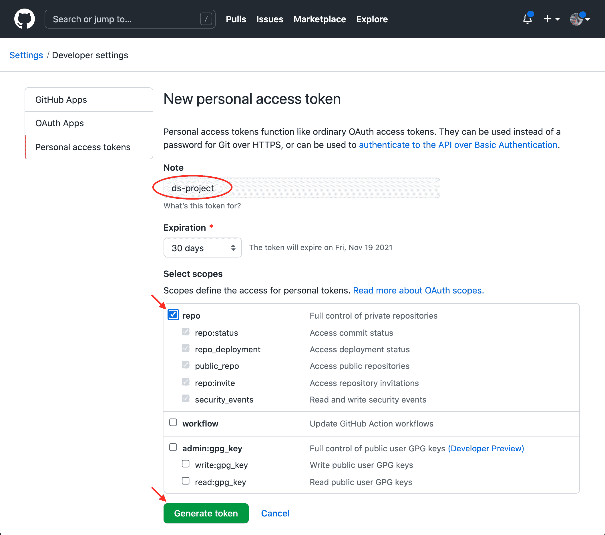

图 12.20：创建新个人访问令牌的网页。

最后，你将被带到可以查看和复制你刚刚生成的个人访问令牌的页面（图 12.21）。由于它提供了访问你账户某些部分的能力，你应该像对待密码一样对待这个令牌；例如，你应该考虑使用密码管理器安全地存储它（以及你的其他密码和令牌！）注意，这个页面只会向你显示一次令牌，所以请确保你立即将其存储在安全的地方。如果你不小心忘记了存储它，也不要担心——你可以通过点击你令牌旁边的“删除”按钮来删除该令牌，并从头开始生成一个新的。要了解更多关于 GitHub 身份验证的信息，请参阅本章末尾的附加资源部分。

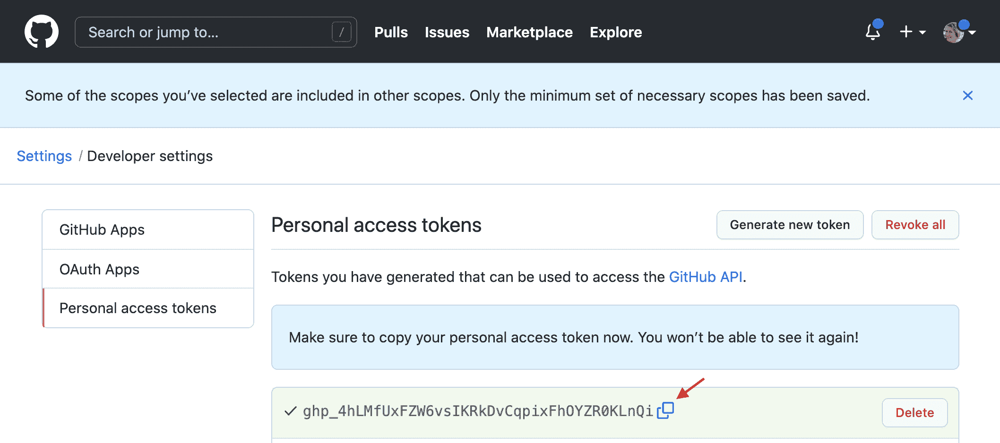

图 12.21：新生成个人访问令牌的显示。

### 12.7.2 使用 Jupyter 克隆仓库

*克隆* GitHub 上的远程仓库以创建本地仓库，结果是一个知道其来源的副本，因此知道在哪里发送/接收新的提交编辑。为了做到这一点，首先从 GitHub 代码下拉菜单的 HTTPS 标签页中复制 URL（图 12.22）。

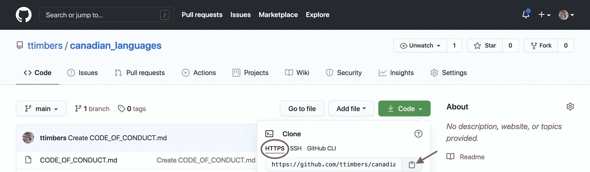

图 12.22：绿色的“代码”下拉菜单包含对应远程 GitHub 仓库位置的远程地址（URL）。

打开 Jupyter，点击文件浏览器标签页上的 Git+图标（图 12.23）。

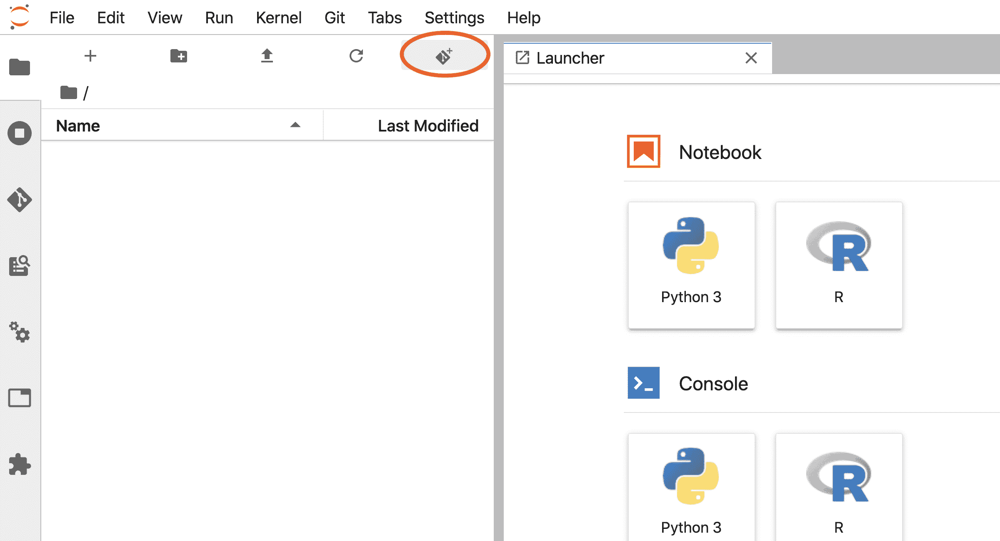

图 12.23：Jupyter Git Clone 图标（红色圆圈）。

将你创建的 GitHub 项目仓库的 URL 粘贴并点击蓝色的“CLONE”按钮（图 12.24）。

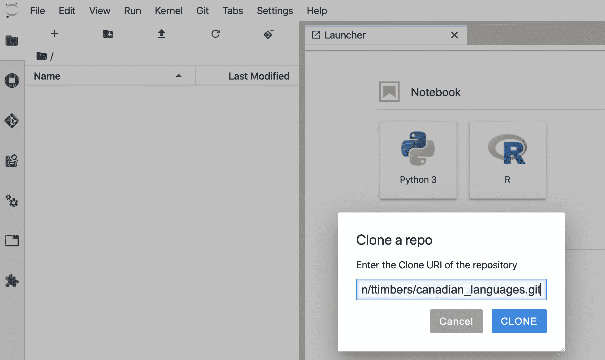

图 12.24：在 Jupyter 中输入对应 GitHub 仓库位置的远程地址（URL）的提示框。

在文件浏览器标签页上，你现在会看到一个仓库文件夹。在这个文件夹内将包含 GitHub 上所有存在的文件（图 12.25）。

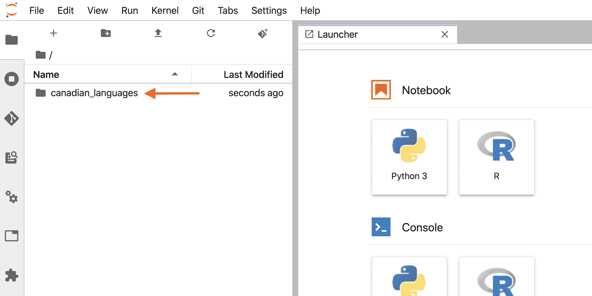

图 12.25：通过 Jupyter 文件浏览器可以看到并访问克隆的 GitHub 仓库。

### 12.7.3 指定要提交的文件

现在你已经从 GitHub 克隆了远程仓库以创建本地仓库，你可以开始编辑、创建和删除文件。例如，假设你创建并保存了一个新的文件（命名为 `eda.ipynb`），你希望将其发送回 GitHub 上的项目仓库（图 12.26）。要将此修改后的文件“添加”到暂存区（即标记为希望提交的更改文件），请点击 Jupyter 左侧远端的 Jupyter Git 扩展图标（图 12.26）。

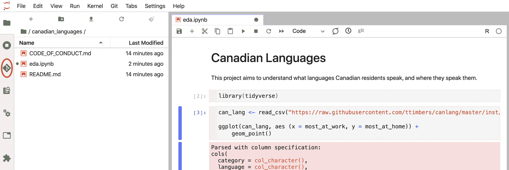

图 12.26：Jupyter Git 扩展图标（用红色圆圈标注）。

这将打开 Jupyter Git 图形用户界面面板。接下来，点击你想要“添加”的文件（图 12.27）旁边的加号（+）。请注意，因为这是该文件的第一次更改，它属于“未跟踪”标题。然而，下次你编辑此文件并想要添加更改时，你将在“已更改”标题下找到它。

你也会在“未跟踪”标题下看到 `eda-checkpoint.ipynb` 文件。这是 Jupyter 在你编辑 `eda.ipynb` 时创建的一个临时“检查点文件”。通常，你不想将自动生成的文件添加到 Git 仓库中；只添加你直接创建和编辑的文件。

图 12.27：通过加号（+）将 `eda.ipynb` 添加到暂存区。

点击加号（+）将文件从“未跟踪”标题移动到“已暂存”标题，这样 Git 就知道你想要快照其当前状态作为提交（图 12.28）。现在你准备好“提交”更改了。确保包含一个（清晰且有帮助的！）关于更改了什么的消息，以便你的合作者（以及未来的你）知道这次提交发生了什么。

图 12.28：添加 `eda.ipynb` 使其在暂存区中可见。

### 12.7.4 提交更改

要与相关的提交信息一起快照更改，你必须在 Git 面板底部的文本框中输入信息并点击蓝色“提交”按钮（图 12.29）。强烈建议写一些有用且有意义的信息，关于更改了什么。这些提交信息以及特定提交的日期时间戳是导航项目历史的主要手段，以防你需要查看或检索文件的过去版本，或者将项目回滚到早期状态。当你第一次点击“提交”按钮时，你将被提示输入你的姓名和电子邮件。这只需要在每个你使用 Git 的机器上做一次。

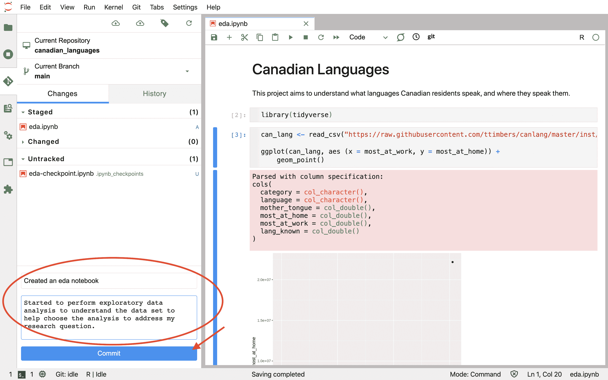

图 12.29：在蓝色提交按钮可以用来记录提交之前，必须在 Jupyter Git 扩展的提交文本框中添加提交信息。

在“提交”文件（夹）后，您将看到现在有 0 个“暂存”文件。您现在可以准备好将更改推送到 GitHub 上的远程仓库（图 12.30）。

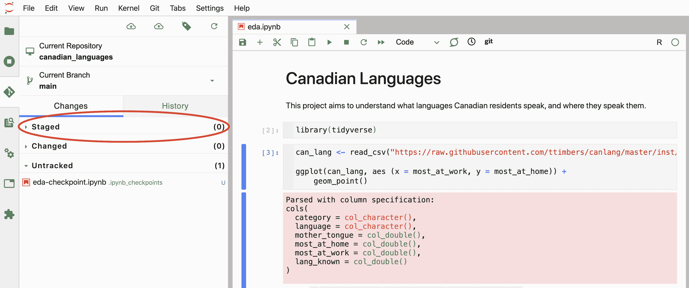

图 12.30：记录提交后，暂存区应为空。

### 12.7.5 将提交推送到 GitHub

要将提交的更改发送回 GitHub 上的远程仓库，您需要*推送*它们。为此，请在 Jupyter Git 选项卡上点击带有向上箭头的云图标（图 12.31）。

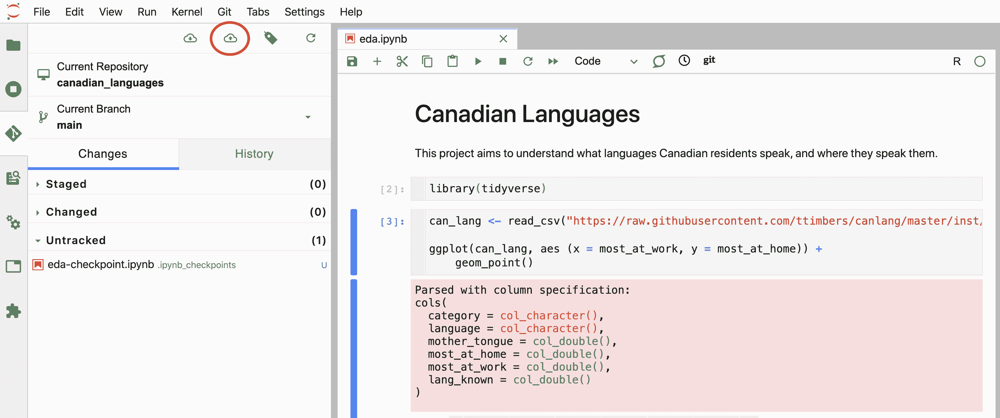

图 12.31：Jupyter Git 扩展的“推送”按钮（用红色圆圈标注）。

然后，您将被提示输入您的 GitHub 用户名和您之前生成的个人访问令牌（不是您的账户密码！）！点击蓝色“确定”按钮以启动推送（图 12.32）。

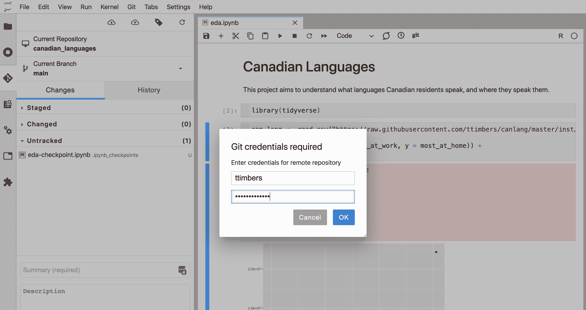

图 12.32：输入您的 Git 凭据以授权将推送至远程仓库。

如果文件已成功推送到 GitHub 的项目仓库，您将看到一个成功消息（图 12.33）。点击“忽略”以继续在 Jupyter 中工作。

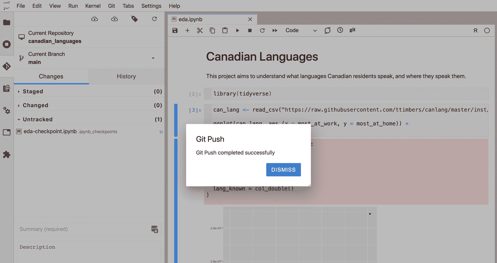

图 12.33：推送成功的提示信息。

如果您访问 GitHub 上的远程仓库，您将看到更改现在也存在那里（图 12.34）！

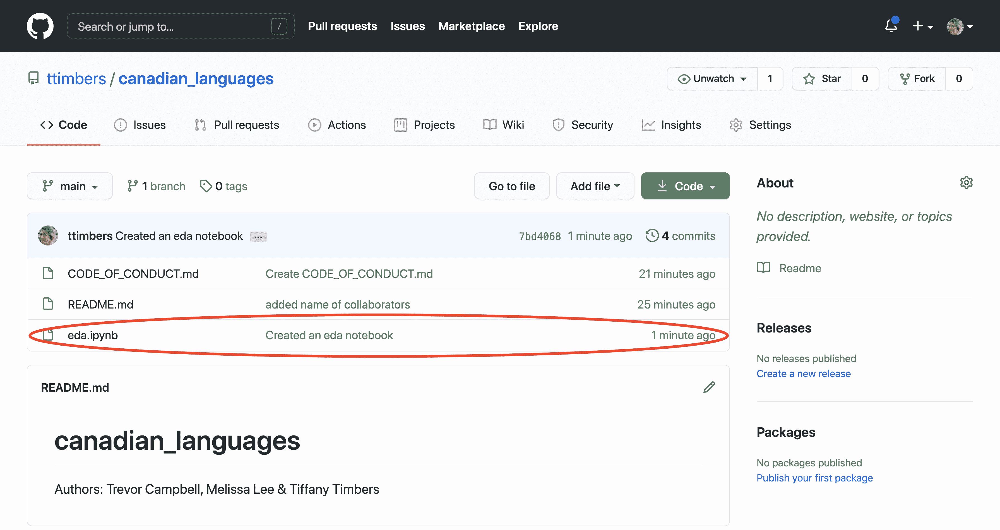

图 12.34：GitHub 网页界面显示了提交消息的预览，以及每个文件的最新推送提交时间。

## 12.8 协作

### 12.8.1 授予合作者对项目的访问权限

如前所述，GitHub 允许您控制谁可以访问您的项目。公共和私有项目的默认设置都是，只有创建 GitHub 仓库的人才有权限创建、编辑和删除文件（*写入权限*）。要授予您的合作者对项目的写入权限，请转到“设置”选项卡（图 12.35）。

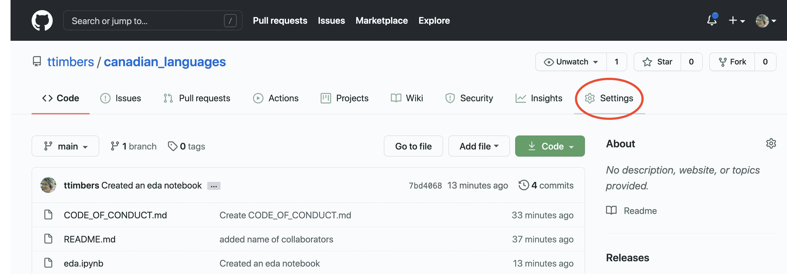

图 12.35：GitHub 网页界面上的“设置”标签页。

然后点击“管理访问”（见图 12.36）。

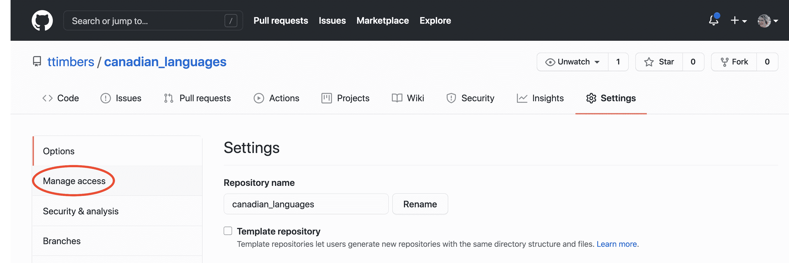

图 12.36：GitHub 网页界面上的“管理访问”标签页。

然后点击绿色的“邀请合作者”按钮（见图 12.37）。

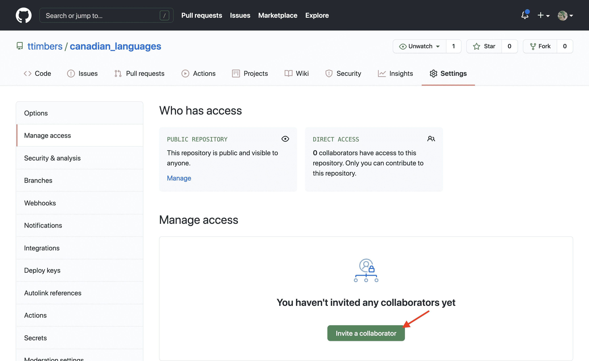

图 12.37：GitHub 网页界面上的“邀请合作者”按钮。

输入合作者的 GitHub 用户名或电子邮件，并在它出现时选择他们的名字（见图 12.38）。

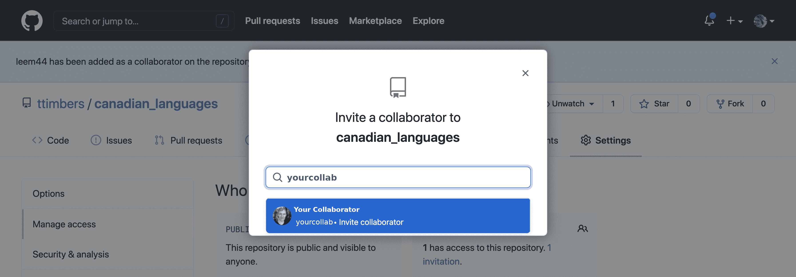

图 12.38：在此文本框中可以输入合作者的 GitHub 用户名或电子邮件。

最后，点击绿色的“将合作者添加到这个仓库”按钮（见图 12.39）。

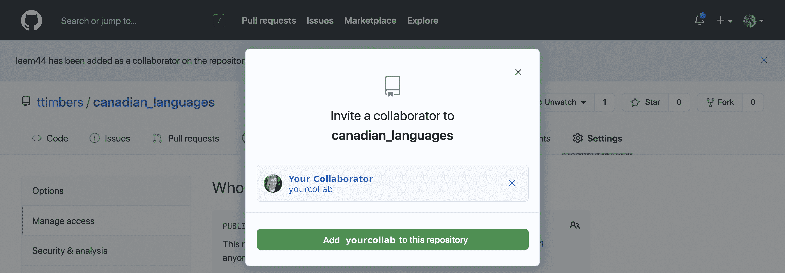

图 12.39：在 GitHub 网页界面上添加合作者到仓库的确认按钮。

之后，你应该在“管理访问”标签页下看到新添加的合作者。他们应该会收到一封邀请邮件，邀请他们作为合作者加入 GitHub 仓库。他们需要接受这个邀请才能获得写入权限。

### 12.8.2 使用 Jupyter 从 GitHub 拉取更改

现在我们将逐步介绍如何使用 Jupyter Git 扩展工具从合作者那里拉取对`eda.ipynb`分析文件所做的更改（见图 12.40）。

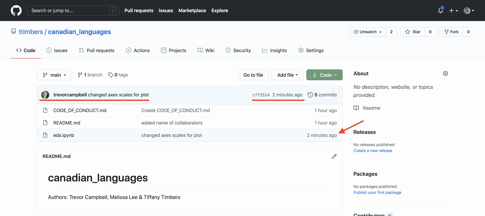

图 12.40：GitHub 界面显示最后将提交推送到远程仓库的人的名字、相关提交信息的预览、唯一的提交标识符以及提交快照的时间。

你可以通过在 Jupyter 中点击带有向下箭头的云图标来告诉 Git 进行“拉取”（见图 12.41）。

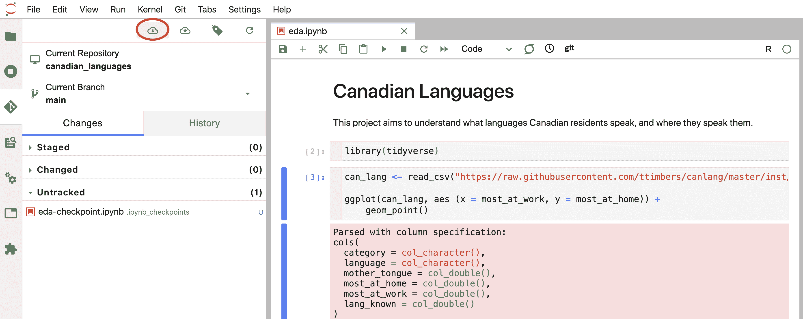

图 12.41：Jupyter Git 扩展的克隆按钮。

一旦成功从 GitHub 拉取文件，你需要点击“关闭”以继续工作（见图 12.42）。

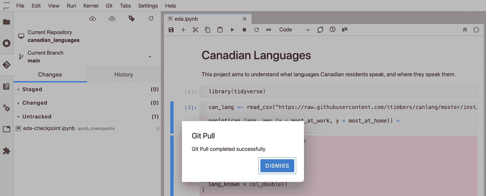

图 12.42：从远程仓库成功拉取更改后的提示。

然后当您打开（或刷新）您刚刚拉取更改的文件时，您应该能够看到它们（图 12.43）。

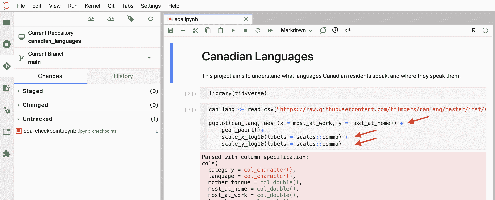

图 12.43：合作者对 `eda.ipynb`（红色箭头突出显示的代码）所做的更改。

审查您项目更改的历史记录可以非常有用。您可以直接在 Jupyter 中通过点击 Git 选项卡中的“历史”来做到这一点（图 12.44）。

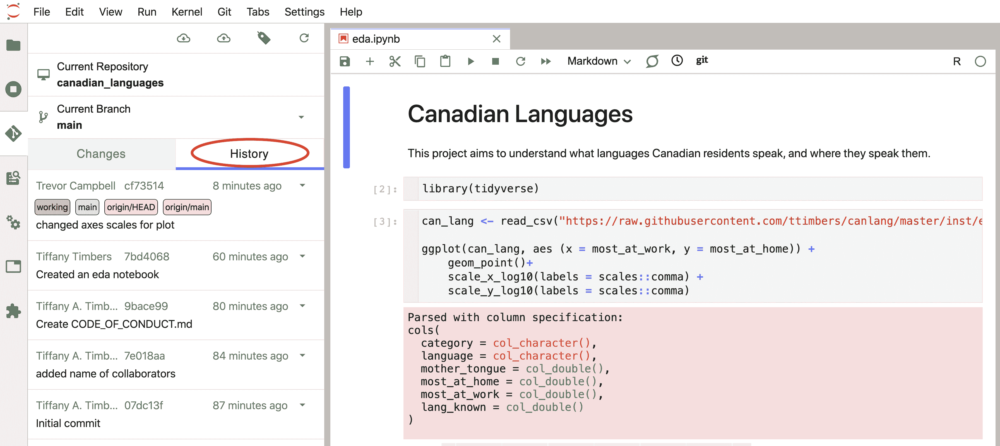

图 12.44：使用 Jupyter Git 扩展查看版本控制仓库历史。

在开始工作于本地副本之前，在每次工作会话的开始时拉取任何更改是一种良好的做法。如果您不这样做，并且您的合作者已将一些更改推送到 GitHub 上的项目，那么您将无法在拉取更改之前将您的更改推送到 GitHub。这种情况可以通过图 12.45 中显示的错误信息来识别。

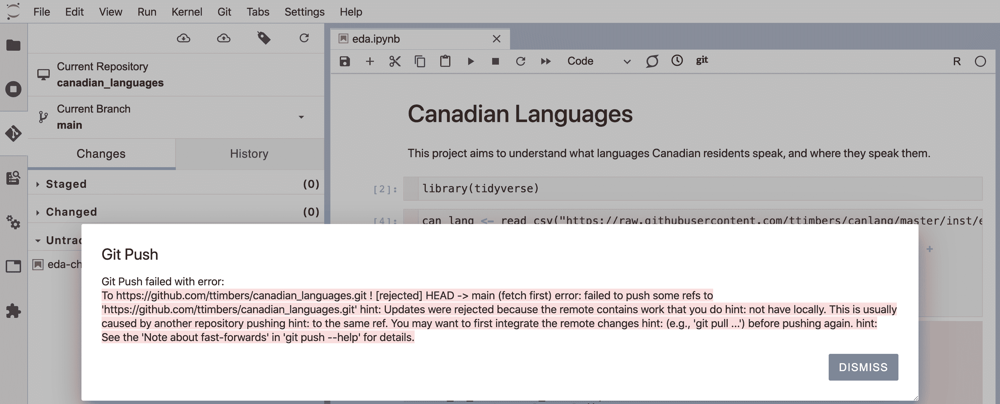

图 12.45：指示远程仓库中存在您本地没有更改的错误信息。

通常，摆脱这种情况并不太麻烦。首先，您需要拉取 GitHub 上存在的更改，这些更改您在本地仓库中还没有。通常在这种情况下，Git 可以自动为您合并更改，即使您和您的合作者正在同一文件的不同的部分工作！

然而，如果您和您的合作者对同一文件的同一行进行了更改，Git 将无法自动合并更改——它将不知道是保留您的版本、合作者的版本，还是两者的某种混合。当这种情况发生时，Git 将会告诉您在某些文件中存在合并冲突（图 12.46）。

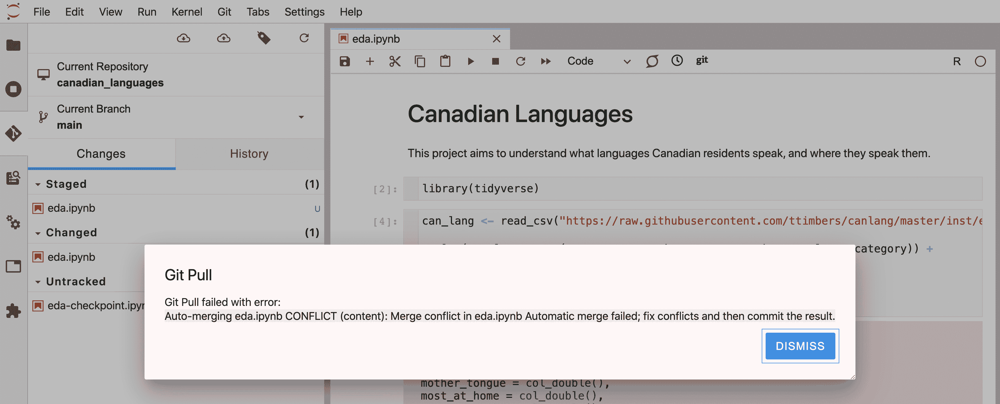

图 12.46：指示您和您的合作者对同一文件的同一行进行了更改，Git 将无法自动合并更改的错误信息。

### 12.8.3 处理合并冲突

为了修复合并冲突，你需要在一个纯文本编辑器中打开有问题的文件，并寻找 Git 在文件中放置的特殊标记，以告诉你合并冲突发生的位置（图 12.47）。

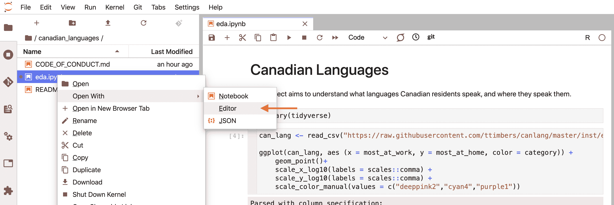

图 12.47：如何在 Jupyter 中以纯文本文件视图打开 Jupyter 笔记本。

合并冲突的开始由 `<<<<<<< HEAD` 预先标识，而合并冲突的结束则由 `>>>>>>>` 标记。在这两个标记之间，Git 还插入了一个分隔符（`=======`）。分隔符之前的变化版本是你的更改，而分隔符之后的变化版本是 GitHub 上存在的变化。在图 12.48 中，你可以看到在你的本地仓库中有一行代码调用 `scale_color_manual` 并带有三个颜色值（`deeppink2`、`cyan4` 和 `purple1`）。看起来你的合作者也对这一行进行了编辑，只是使用了不同的颜色（`blue3`、`red3` 和 `black`）！

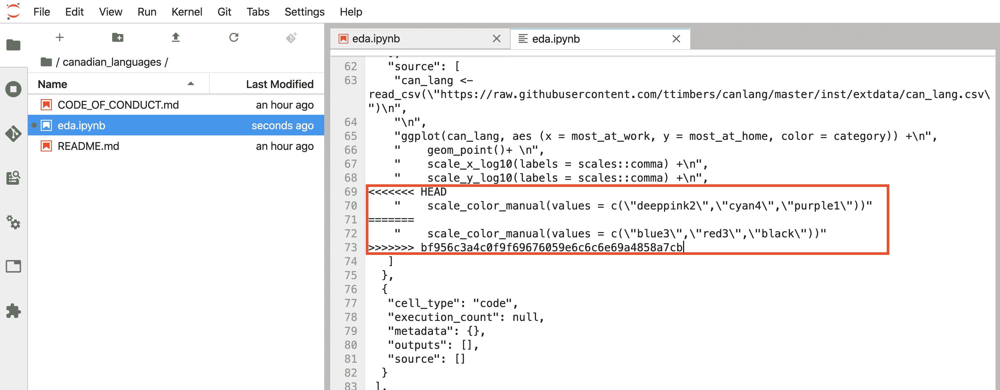

图 12.48：合并冲突标识符（用红色突出显示）。

一旦你决定保留更改的哪个版本（或是什么组合），你需要使用纯文本编辑器来移除 Git 添加的特殊标记（图 12.49）。

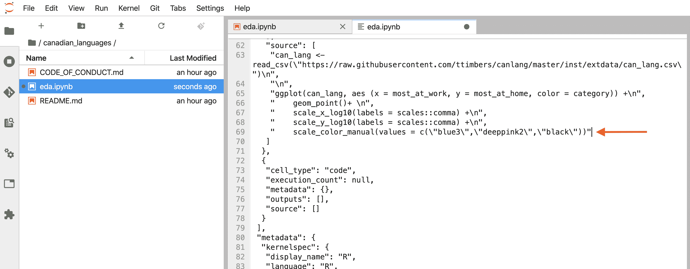

图 12.49：已解决合并冲突的文件。

在你能够将你的更改推送到 GitHub 之前，必须保存文件，将其添加到暂存区，然后提交。

### 12.8.4 使用 GitHub 的问题进行沟通

当你在团队中协作完成一个项目时，你不仅希望有一个关于谁在何时更改了哪些文件的历史记录——你还需要一个记录决策、提出想法、识别和解决问题的记录，以及围绕项目的所有其他沟通。电子邮件和消息应用都非常适合一般沟通，但它们并不是为特定项目沟通设计的：它们通常没有按项目子主题组织对话、搜索与特定错误或软件版本相关的对话等功能。

GitHub 的 *问题* 是一种替代电子邮件和消息应用的书面沟通媒介，专门设计用于促进项目特定的沟通。问题从项目 GitHub 页面上的“问题”标签页中 *打开*，即使在对话结束后问题被 *关闭*（与电子邮件不同，问题通常不会被删除）。通常每个主题都会创建一个问题线程，并且可以使用 GitHub 的搜索工具轻松搜索。所有问题对所有项目协作者都是可访问的，所以没有人会被排除在对话之外。最后，可以将问题设置为当创建新问题或问题线程中发布新帖子时，团队成员会收到电子邮件通知。也可以通过电子邮件回复问题。鉴于所有这些优势，我们强烈推荐使用问题进行项目相关沟通。

要打开 GitHub 问题，首先点击“问题”标签页（图 12.50）。

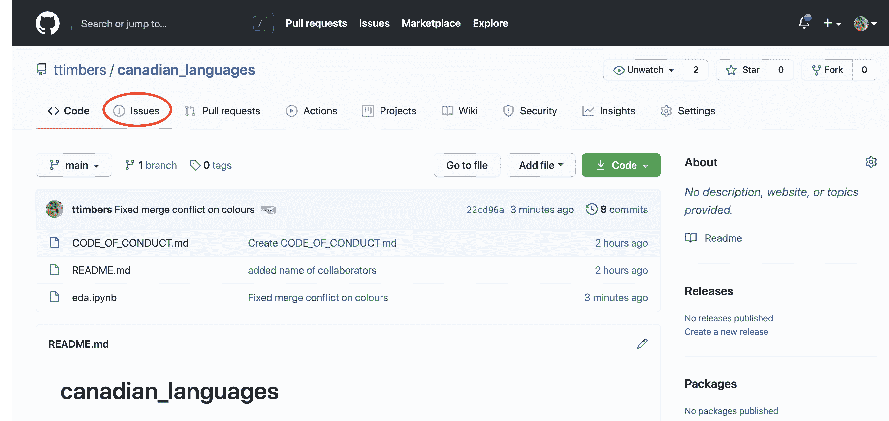

图 12.50：GitHub 网页界面上的“问题”标签页。

接着点击“新建问题”按钮（图 12.51）。

图 12.51：GitHub 网页界面上的“新建问题”按钮。

添加问题标题（类似于电子邮件的主题行），然后将消息正文放入较大的文本框中。最后，点击“提交新问题”以发布问题与他人分享（图 12.52）。

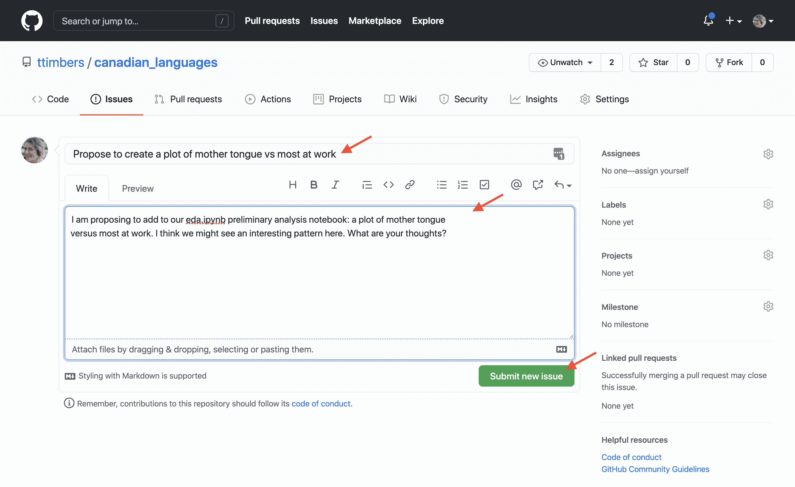

图 12.52：创建新的 GitHub 问题的对话框和提交按钮。

你可以通过在较大的文本框中添加你的书面回复并点击评论（图 12.53）来回复某人打开的问题。

图 12.53：回复 GitHub 问题的对话框。

当对话得到解决时，你可以点击“关闭问题”。关闭的问题可以在稍后通过点击“问题”标签页中的“已关闭”标题链接来查看（图 12.54）。

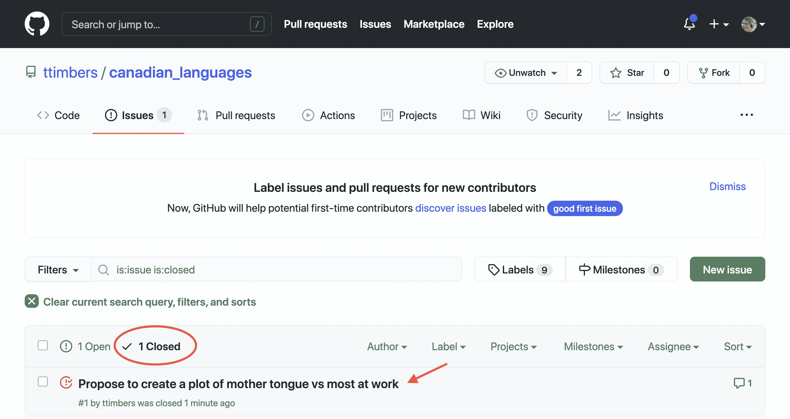

图 12.54：GitHub 网页界面上的“已关闭”问题标签页。

## 12.9 练习

本章涵盖的练习题可以在“与版本控制协作”行中的配套[工作表存储库](https://worksheets.datasciencebook.ca)中找到。您可以通过点击“启动绑定器”按钮在浏览器中启动工作表的交互式版本。您还可以通过点击“查看工作表”预览非交互式版本的工作表。如果您决定下载工作表并在自己的机器上运行，请确保遵循第十三章中找到的计算机设置说明。这将确保工作表提供的自动反馈和指导能够按预期工作。

## 12.10 其他资源

现在您已经掌握了 Git 和 GitHub 版本控制的基础知识，您可以通过以下资源扩展您的知识：

+   GitHub 的[指南网站](https://docs.github.com/)和[*Happy Git and GitHub for the useR*](https://happygitwithr.com/)是学习更多关于 Git 和 GitHub 的绝佳资源。

+   [科学计算中的良好实践](https://journals.plos.org/ploscompbiol/article?id=10.1371/journal.pcbi.1005510#sec014) (G. Wilson 等人 2017) 提供了更多关于数据分析项目中有用的工作流程和“足够好”实践的建议。

+   除了[GitHub](https://github.com)之外，还有其他流行的 Git 仓库托管服务，如[GitLab](https://gitlab.com)和[BitBucket](https://bitbucket.org)。比较所有这些选项超出了本书的范围，并且直到您成为更高级的用户，您完全可以继续使用 GitHub。只需注意，您有多种选择！

+   GitHub 的[创建个人访问令牌的文档](https://docs.github.com/en/authentication/keeping-your-account-and-data-secure/creating-a-personal-access-token)和*Happy Git and GitHub for the useR* [个人访问令牌章节](https://happygitwithr.com/https-pat.html)都是如果您需要更多帮助生成和使用个人访问令牌的绝佳额外资源。

### 参考文献

Wilson, Greg, Jennifer Bryan, Karen Cranston, Justin Kitzes, Lex Nederbragt, 和 Tracy Teal. 2017. “科学计算中的良好实践。” *PLoS Computational Biology* 13 (6).
