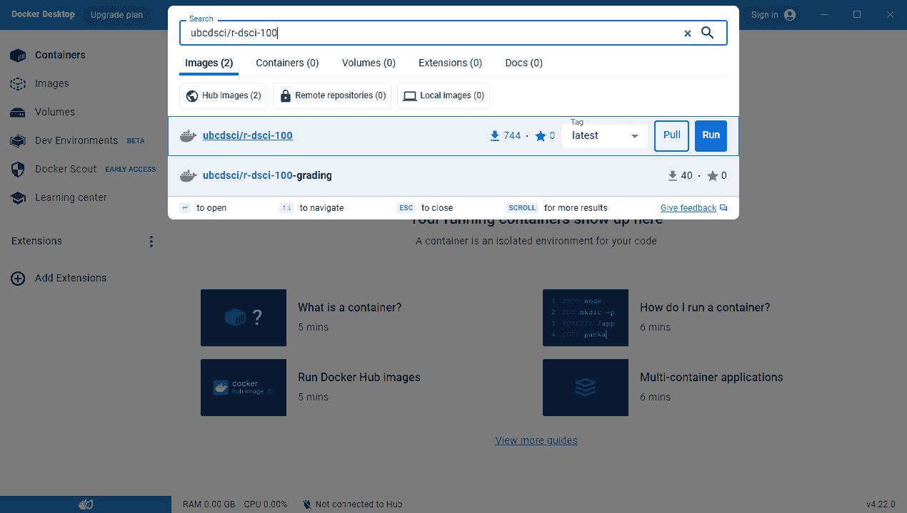
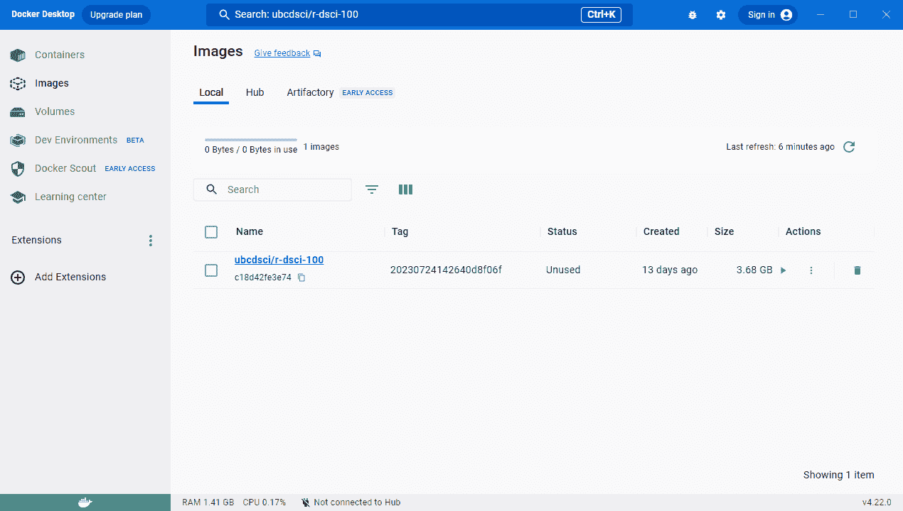
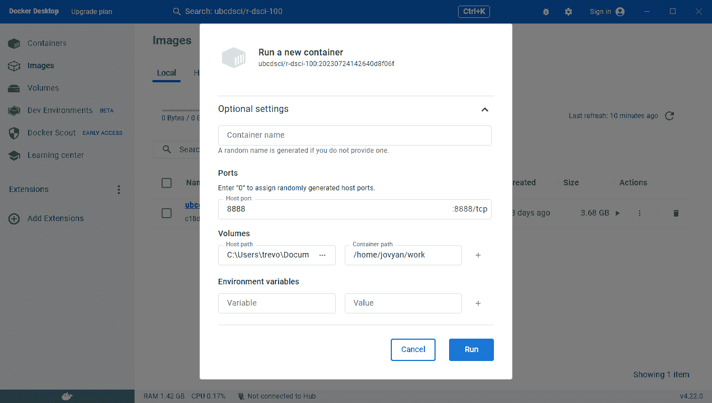
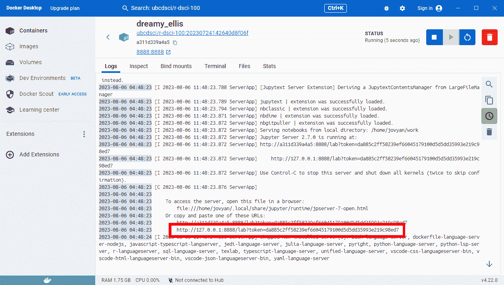
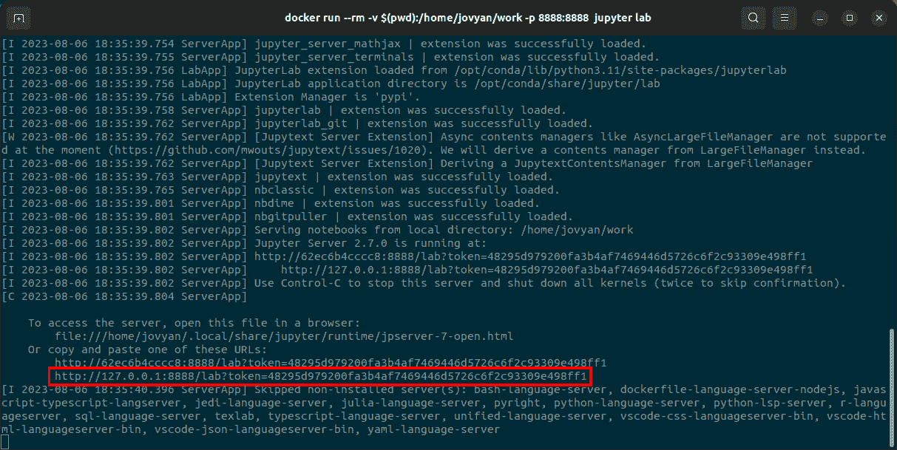
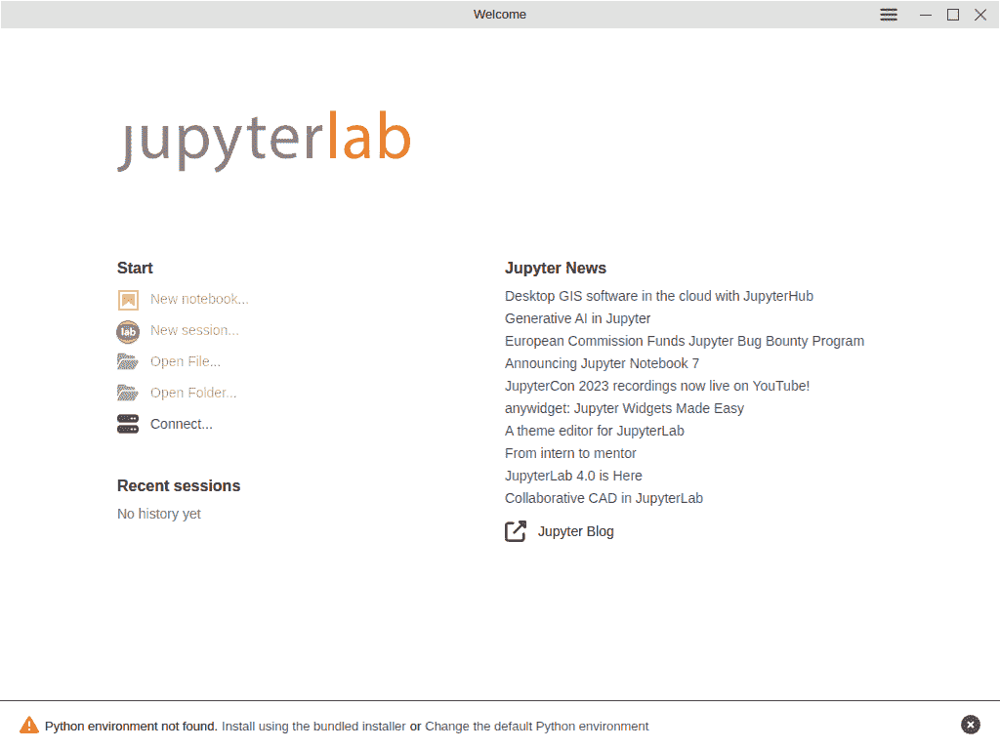
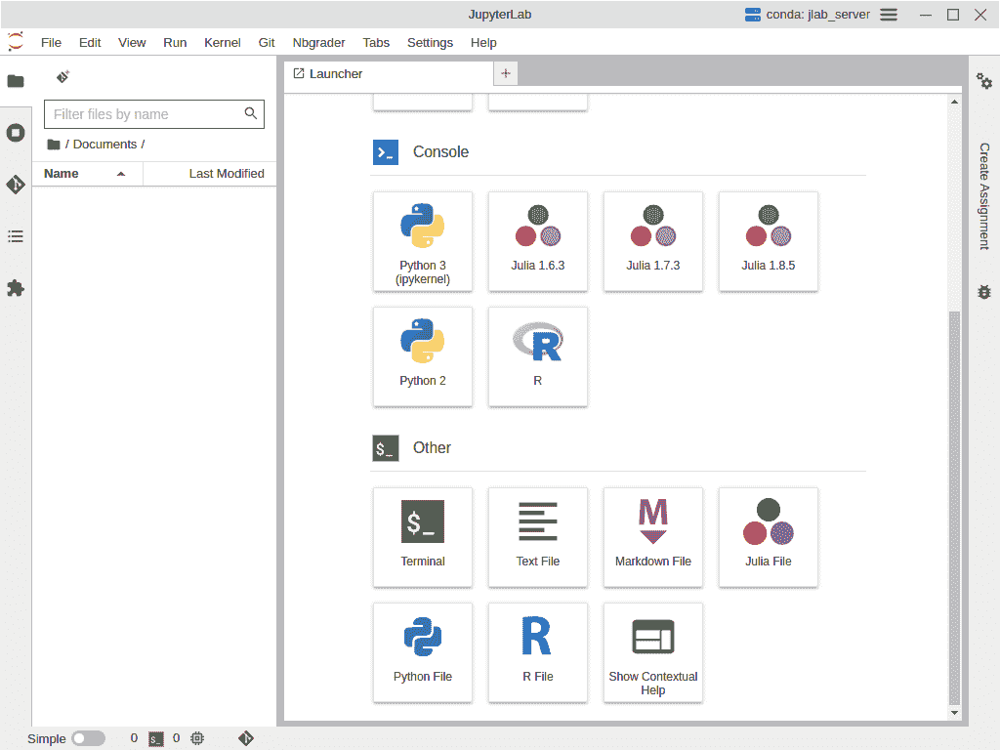

# 第十三章 设置您的计算机

> 原文：[`datasciencebook.ca/setup.html`](https://datasciencebook.ca/setup.html)

## 13.1 概述

在本章中，你将学习如何在自己的计算机上设置跟随本书所需的软件。鉴于安装说明可能因计算机配置而异，我们提供了适用于多个操作系统（Ubuntu Linux、MacOS 和 Windows）的说明。尽管本章中的说明可能在许多系统上都能工作，但我们已经特别验证了它们在以下计算机上可以正常工作：

+   运行 Windows 10 Home、MacOS 13 Ventura 或 Ubuntu 22.04，

+   使用 64 位 CPU，

+   与互联网有连接，

+   使用英语作为默认语言。

## 13.2 本章学习目标

到本章结束时，读者将能够完成以下任务：

+   下载本书附带的工作表。

+   安装 Docker 虚拟化引擎。

+   使用运行在 Docker 容器内的 JupyterLab 编辑和运行工作表。

+   安装 Git、JupyterLab 桌面版和 R 包。

+   使用 JupyterLab 桌面版编辑和运行工作表。

## 13.3 获取本书的工作表

包含本书练习的工作表可在[`worksheets.datasciencebook.ca`](https://worksheets.datasciencebook.ca)在线找到。您可以直接从表格最右侧列中的 Binder 链接启动工作表。这是访问工作表的最简单方法，但请注意，您将无法保存您的作品并在以后再次返回。为了保存您的进度，您需要将工作表下载到自己的计算机上并在本地工作。您可以使用[页面顶部的链接](https://github.com/UBC-DSCI/data-science-a-first-intro-worksheets/archive/refs/heads/main.zip)将工作表作为压缩的 zip 文件下载。一旦解压缩下载的文件，您将获得一个包含本书所有 Jupyter 笔记本工作表的文件夹。有关使用 Jupyter 笔记本的说明，请参阅第十一章。

## 13.4 使用 Docker 进行工作

下载工作表后，你接下来需要在自己的计算机上安装和运行所需的软件，以便在 Jupyter 笔记本上工作。手动进行此设置可能相当棘手，因为它涉及相当多的不同软件包，更不用说确保所有版本的正确性——除非所有版本都完全正确，否则工作表和自动评分测试可能无法正常工作！为了简化流程，我们建议你安装[Docker](https://docker.com)。Docker 允许你在预先构建的*容器*内运行 Jupyter 笔记本，该容器包含运行本书附带工作表所需的精确版本的所有软件包。

> **注意：** 一个*容器*是你计算机内的一个虚拟用户空间。在容器内，你可以独立运行软件，而不会干扰你机器上已经存在的其他软件。在这本书中，我们使用容器来运行 R 编程语言的特定版本以及其他必要的包。容器确保工作表能够正确运行，即使你在计算机上安装了不同的 R 版本——甚至如果你根本未安装 R！

### 13.4.1 Windows

**安装** 要在 Windows 上安装 Docker，请访问[在线 Docker 文档](https://docs.docker.com/desktop/install/windows-install/)，并下载`Docker Desktop Installer.exe`文件。双击文件以打开安装程序，并按照安装向导上的说明进行操作，当提示时选择**WSL-2**而不是**Hyper-V**。

> **注意：** 有时，当你第一次在 Windows 上运行 Docker 时，可能会遇到错误信息。你可能看到的常见错误包括：
> 
> +   如果你需要更新 WSL，你可以在开始菜单中输入`cmd.exe`以运行命令行。输入`wsl --update`以更新 WSL。
> +   
> +   如果你的计算机上的管理员账户与你的用户账户不同，你必须将用户添加到“docker-users”组中。以管理员身份运行计算机管理，导航到`本地用户`和`组 -> 组 -> docker-users`。右键单击并将用户添加到组中。注销并重新登录以使更改生效。
> +   
> +   如果你需要启用虚拟化，你需要编辑你的 BIOS。重启计算机，并使用热键（通常是 Delete、Esc 和/或 F# 键之一）进入 BIOS。查找“高级”菜单，并在你的 CPU 设置下将“虚拟化”选项设置为“启用”。然后保存更改并重新启动你的机器。如果你不熟悉 BIOS 编辑，你可能需要找一个专家来帮助你，因为编辑 BIOS 可能是危险的。关于如何进行此操作的详细说明超出了本书的范围。

**运行 JupyterLab** 运行 Docker Desktop。一旦它开始运行，您需要下载并运行我们为工作表提供的 Docker *镜像*（一个 *镜像* 就像是一个带有所有正确预安装软件包的计算机的“快照”）。您只需要执行这一步一次；下次运行 Docker Desktop 时，镜像将保持不变。在 Docker Desktop 的搜索栏中输入 `ubcdsci/r-dsci-100`，因为这正是镜像的名称。您将在列表中看到 `ubcdsci/r-dsci-100` 镜像（图 13.1），在标签下拉菜单中选择“latest”。在继续之前，我们需要将“latest”更改为正确的镜像版本。要找到正确的标签，请打开工作表存储库中的[`Dockerfile`](https://raw.githubusercontent.com/UBC-DSCI/data-science-a-first-intro-worksheets/main/Dockerfile)，并查找后面跟着由数字和字母组成的标签的 `FROM ubcdsci/r-dsci-100:` 行。回到 Docker Desktop，在“标签”下拉菜单中，点击该标签以选择正确的镜像版本。然后点击“拉取”按钮以下载镜像。



图 13.1：Docker Desktop 搜索窗口。确保在点击“拉取”按钮下载之前，点击标签下拉菜单并找到正确的镜像版本。

一旦镜像下载完成，请点击 Docker Desktop 窗口左侧的“镜像”按钮（图 13.2）。您将在“本地”标签下看到最近下载的镜像。



图 13.2：Docker Desktop 镜像标签页。

要使用该镜像启动一个 *容器*，请点击图像旁边的播放按钮。这将打开运行配置菜单（图 13.3）。展开“可选设置”下拉菜单。在“主机端口”文本框中输入 `8888`。在“卷”部分，点击“主机路径”框并导航到存储您的 Jupyter 工作表的文件夹。在“容器路径”文本框中输入 `/home/jovyan/work`。然后点击“运行”按钮以启动容器。



图 13.3：Docker Desktop 容器运行配置菜单。

点击“运行”按钮后，您将看到一个终端。终端将打印一些文本，作为 Docker 容器启动。一旦文本停止滚动，找到终端中以 `http://127.0.0.1:8888` 开头的 URL（如图 13.4 中的红色框所示），并将其粘贴到您的浏览器中以启动 JupyterLab。



图 13.4：运行 Docker 容器后的终端文本。红色框表示您应该粘贴到浏览器中打开 JupyterLab 的 URL。

当您完成工作后，请确保通过点击图 13.4 顶部右角的红色垃圾桶符号关闭并移除容器。您必须这样做后才能再次启动容器。有关在 Windows 上安装和运行 Docker 以及故障排除技巧的更多信息，请参阅 [在线 Docker 文档](https://docs.docker.com/desktop/install/windows-install/)。

### 13.4.2 MacOS

**安装** 要在 MacOS 上安装 Docker，请访问 [在线 Docker 文档](https://docs.docker.com/desktop/install/mac-install/)，并下载适合您计算机的 `Docker.dmg` 安装文件。要了解哪个安装程序适合您的机器，您需要知道您的计算机是否具有 Intel 处理器（旧机器）或 Apple 处理器（新机器）；[Apple 支持页面](https://support.apple.com/en-ca/HT211814) 有信息可以帮助您确定您的处理器类型。下载后，双击文件以打开安装程序，然后将 Docker 图标拖到应用程序文件夹中。双击应用程序文件夹中的图标以启动 Docker。在安装窗口中，使用推荐设置。

**运行 JupyterLab** 运行 Docker Desktop。一旦启动，请按照 Windows 部分中关于 *运行 JupyterLab* 的说明操作（用户界面相同）。有关在 MacOS 上安装和运行 Docker 以及故障排除技巧的更多信息，请参阅 [在线 Docker 文档](https://docs.docker.com/desktop/install/mac-install/)。

### 13.4.3 Ubuntu

**安装** 要在 Ubuntu 上安装 Docker，打开终端并输入以下五个命令。

```r
sudo apt update
sudo apt install ca-certificates curl gnupg
curl -fsSL https://get.docker.com -o get-docker.sh
sudo chmod u+x get-docker.sh
sudo sh get-docker.sh
```

**运行 JupyterLab** 首先，打开工作表存储库中的 `Dockerfile`（[链接](https://raw.githubusercontent.com/UBC-DSCI/data-science-a-first-intro-worksheets/main/Dockerfile)），找到 `FROM ubcdsci/r-dsci-100:` 后跟一个由数字和字母组成的标签。然后在终端中，导航到您想要运行 JupyterLab 的目录，并运行以下命令，将 `TAG` 替换为您之前找到的 *标签*。

```r
docker run --rm -v $(pwd):/home/jovyan/work -p 8888:8888 ubcdsci/r-dsci-100:TAG jupyter lab
```

随后，终端将打印一些文本，作为 Docker 容器启动时的输出。一旦文本停止滚动，找到你的终端中以 `http://127.0.0.1:8888` 开头的 URL（如图 13.5 中的红色框所示），并将其粘贴到浏览器中以启动 JupyterLab。有关在 Ubuntu 上安装和运行 Docker 以及故障排除技巧的更多信息，请参阅 [在线 Docker 文档](https://docs.docker.com/engine/install/ubuntu/)。



图 13.5：在 Ubuntu 中运行 Docker 容器后的终端文本。红色框表示你应该将其粘贴到浏览器中打开 JupyterLab 的 URL。

## 13.5 使用 JupyterLab 桌面版

你也可以使用 [JupyterLab 桌面版](https://github.com/jupyterlab/jupyterlab-desktop) 在你的计算机上运行本书的配套工作表。与 Docker 相比，JupyterLab 桌面版的优点是安装起来可能更容易；Docker 有时会遇到一些相当技术性的问题（尤其是在 Windows 计算机上），需要专家进行故障排除。JupyterLab 桌面版的缺点是，你最终可能无法获得所有 R 包的正确版本，这些 R 包是工作表所需的。另一方面，Docker *保证* 工作表将按预期工作。

在本节中，我们将介绍如何安装 JupyterLab 桌面版、Git 以及 JupyterLab Git 扩展（如第十二章所述，用于版本控制），以及运行本书中代码所需的所有 R 包。

### 13.5.1 Windows

**安装** 首先，我们将安装 Git 以进行版本控制。访问 [Git 下载页面](https://git-scm.com/download/win) 并下载 Windows 版本的 Git。下载完成后，运行安装程序并接受所有页面的默认配置。接下来，访问 [JupyterLab 桌面版主页的“安装”部分](https://github.com/jupyterlab/jupyterlab-desktop#installation)。下载 Windows 版本的 `JupyterLab-Setup-Windows.exe` 安装程序文件。双击安装程序以运行它，使用默认设置。通过点击桌面上的图标来运行 JupyterLab 桌面版。

**配置 JupyterLab 桌面版** 接下来，在出现的 JupyterLab 桌面版图形界面（图 13.6）中，你将在底部看到显示“未找到 Python 环境”的文本。点击“使用捆绑的安装程序安装”来设置环境。



图 13.6：JupyterLab Desktop 的图形用户界面。接下来，我们需要添加 JupyterLab Git 扩展（以便我们可以在 JupyterLab Desktop 内部直接使用版本控制），IRkernel（以启用 R 编程语言），以及各种 R 软件包。在 JupyterLab Desktop 用户界面中点击“新建会话…”，然后滚动到最底部，在“其他”标题下点击“终端”（图 13.7）。

图 13.7：一个 JupyterLab Desktop 会话，显示了底部的终端选项。

在此终端中，运行以下命令：

```r
pip install --upgrade jupyterlab-git
conda env update --file https://raw.githubusercontent.com/UBC-DSCI/data-science-a-first-intro-worksheets/main/environment.yml
```

第二个命令会安装`environment.yml`文件中指定的特定 R 和包版本，该文件位于[工作表存储库](https://worksheets.datasciencebook.ca)中。我们将始终保持`environment.yml`文件中的版本更新，以确保它们与书中附带的学习工作表兼容。一旦所有软件安装完成，在开始进行数据分析之前，完全重启 JupyterLab Desktop 是一个好主意。这将确保您放置的所有软件和设置都正确设置并准备好使用。

### 13.5.2 MacOS

**安装** 首先，我们将安装 Git 以进行版本控制。打开终端（[如何视频](https://youtu.be/5AJbWEWwnbY)）并输入以下命令：

```r
xcode-select --install
```

接下来，访问[JupyterLab Desktop 主页的“安装”部分](https://github.com/jupyterlab/jupyterlab-desktop#installation)。下载`JupyterLab-Setup-MacOS-x64.dmg`或`JupyterLab-Setup-MacOS-arm64.dmg`安装文件。要了解哪个安装程序适合您的机器，您需要知道您的计算机是否具有 Intel 处理器（旧机器）或 Apple 处理器（新机器）；[Apple 支持页面](https://support.apple.com/en-ca/HT211814)有信息可以帮助您确定您的处理器。下载后，双击文件以打开安装程序，然后将 JupyterLab Desktop 图标拖到应用程序文件夹中。在应用程序文件夹中双击图标以启动 JupyterLab Desktop。

**配置 JupyterLab Desktop** 从现在开始，随着 JupyterLab Desktop 的运行，按照 Windows 部分中的*配置 JupyterLab Desktop*说明来设置环境，安装 JupyterLab Git 扩展，并安装工作表所需的各个 R 软件包。

### 13.5.3 Ubuntu

**安装** 首先，我们将安装 Git 以进行版本控制。打开终端并输入以下命令：

```r
sudo apt update
sudo apt install git
```

接下来，访问[JupyterLab Desktop 主页的“安装”部分](https://github.com/jupyterlab/jupyterlab-desktop#installation)。为 Ubuntu/Debian 下载`JupyterLab-Setup-Debian.deb`安装文件。打开终端，导航到安装文件下载的位置，并运行以下命令

```r
sudo dpkg -i JupyterLab-Setup-Debian.deb
```

使用以下命令运行 JupyterLab 桌面

```r
jlab
```

**配置 JupyterLab 桌面** 从此点开始，当 JupyterLab 桌面运行时，请按照 Windows 部分中关于 *配置 JupyterLab 桌面* 的说明进行操作，以设置环境、安装 JupyterLab Git 扩展程序以及安装工作表所需的各个 R 软件包。
