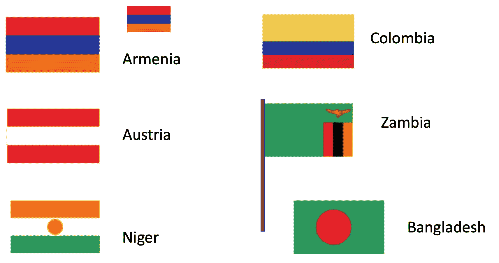

# 3.1 入门

> 原文：[`dcic-world.org/2025-08-27/getting-started.html`](https://dcic-world.org/2025-08-27/getting-started.html)

| |   3.1.1 激励示例：旗帜 |
| --- | --- |
| |   3.1.2 数字 |
| |   3.1.3 表达式 |
| |   3.1.4 术语 |
| |   3.1.5 字符串 |
| |   3.1.6 图像 |
| |   3.1.6.1 组合图像 |
| |   3.1.6.2 制作旗帜 |
| |   3.1.7 退后一步：类型、错误和文档 |
| |   3.1.7.1 类型和合约 |
| |   3.1.7.2 格式和符号错误 |
| |   3.1.7.3 寻找其他函数：文档 |

#### 3.1.1 激励示例：旗帜 "链接到这里")

想象一下，你正在创办一家图形设计公司，并希望能够为你的客户提供不同尺寸和配置的旗帜图像。以下图表显示了你的软件将需要帮助你创建的图像样本：



在我们尝试编写代码来创建这些不同的图像之前，你应该退后一步，看看这些图像集合，并尝试识别图像的特性，这些特性可能有助于我们决定要做什么。为了帮助做到这一点，我们将回答一对具体问题，以帮助我们理解这些图像：

+   你对旗帜有什么观察？

+   你对旗帜或可能生成它们的程序有什么疑问？

> 现在就做！
> 
> > 实际写下你的答案。注意数据和信息的特性是计算中的基本技能。

你可能注意到的某些事情：

+   一些旗帜具有相似的结构，只是颜色不同

+   一些旗帜有不同的尺寸

+   一些旗帜有杆子

+   这些看起来相当简单，但一些真正的旗帜上有复杂的图案

…等等。

你可能想知道的一些事情：

+   我需要能够手工绘制这些图像吗？

+   我们能否用相同的代码生成不同大小的旗帜？

+   如果我们有一个非矩形的旗帜怎么办？

…等等。

我们注意到的特性暗示了一些我们需要能够做到的事情，以便编写生成旗帜的程序：

+   我们可能需要计算条纹的高度，从整个旗帜的尺寸（我们将使用数字编写程序）

+   我们需要一种方法来向程序描述颜色（我们将学习字符串）

+   我们需要一种方法来根据不同颜色和简单形状创建图像（我们将创建和组合表达式）

让我们开始吧！

#### 3.1.2 数字 "链接到这里")

从简单开始：计算 3 和 5 的和。

要用计算机进行这个计算，我们需要写下计算并要求计算机运行或评估计算，以便我们得到一个数字作为返回。一个让你编写和运行程序的软件或网络应用程序被称为编程环境。在本课程的第一个部分，我们将使用一种名为 Pyret 的语言。

前往 [在线编辑器](https://code.pyret.org/editor)（我们以后会将其称为“CPO”）。现在，我们只会在右侧（交互面板）工作。

››› 被称为“提示符”——<wbr>这就是我们告诉 CPO 运行程序的地方。让我们告诉它计算 `3` 和 `5` 的和。以下是我们要写的代码：


> ```py
> 3 + 5
> ```


按下回车键，计算结果将显示在提示符下方的一行，如下所示：


> ```py
> 3 + 5
> ```


```py
8
```


并不奇怪，我们还可以进行其他算术计算


> ```py
> 2 * 6
> ```


```py
12
```


（注意：`*` 是我们写乘号的方式。）

如果我们尝试 `3 + 4 * 5` 会怎样？

> 现在就做！
> 
> > 尝试一下！看看 Pyret 会说什么。

Pyret 给了你一个错误信息。它说的是 Pyret 不确定我们是指

```py
(3 + 4) * 5
```

或者

```py
3 + (4 * 5)
```

因此，它要求我们包含括号以使其明确。每种编程语言都有一套关于如何编写程序的规则。Pyret 的规则要求在算术运算符周围使用括号以避免歧义。


> ```py
> (3 + 4) * 5
> ```


```py
35
```


> ```py
> 3 + (4 * 5)
> ```


```py
23
```


另一个 Pyret 规则要求在算术运算符周围使用空格。看看如果你忘记空格会发生什么：


> ```py
> 3+4
> ```


Pyret 会显示一个不同的错误信息，突出显示代码中格式不正确的部分，以及 Pyret 检测到的问题的解释。要修复错误，你可以在右侧面板中按上箭头键并编辑先前的计算以添加空格。

> 现在就做！
> 
> > 现在就尝试做，并确认你已经成功了！

如果我们想要超越基本的算术运算符呢？比如说，我们想要两个数字的最小值。我们会这样写


> ```py
> num-min(2, 8)
> ```


为什么是 `num-`？这是因为“最小值”是一个在除了数字以外的数据上也有意义的概念；Pyret 将最小运算符称为 `num-min` 以避免歧义。

#### 3.1.3 表达式 "链接到此处")

注意，当我们运行 `num-min` 时，我们会得到一个数字作为返回值（就像我们对 `+`、`*` 等操作符所做的那样）。这意味着我们应该能够在需要数字的其他计算中使用 `num-min` 的结果：


> ```py
> 5 * num-min(2, 8)
> ```


```py
10
```


> ```py
> (1 + 5) * num-min(2, 8)
> ```


```py
12
```


希望你开始看到一些模式。我们可以通过使用操作来组合较小计算的结果，从较小的计算构建更复杂的计算。我们将使用术语“表达式”来指代 Pyret 可以理解和评估为答案的计算格式。

> 练习
> 
> > 在 CPO 中，尝试编写以下每个计算的公式：
> > 
> > +   从 7 中减去 3，然后将结果乘以 4
> > +   
> > +   从 7 和 4 的乘积中减去 3
> > +   
> > +   3 和 5 的和除以 2
> > +   
> > +   从 10 中减去 5 和 -20 的最大值
> > +   
> > +   2 除以 3 和 5 的和
> > +   
> 现在就做！
> 
> > 如果你得到一个分数作为响应怎么办？
> > 
> > 如果你不确定如何得到一个分数，有两种方法：你可以编写一个产生分数答案的表达式，或者你可以直接输入一个（例如，`1/3`）。
> > 
> > 无论哪种方式，你都可以点击交互面板中的结果来更改数字的显示方式。试试看！

#### 3.1.4 术语 "链接到这里")

看一个交互式示例


> ```py
> (3 + 4) * (5 + 1)
> ```


```py
42
```


实际上，这个交互式示例中有几种类型的信息，我们应该给它们命名：

+   表达式：用编程语言的正式符号编写的计算

    这里的一些例子包括 `4`、`5 + 1` 和 `(3 + 4) * (5 + 1)`

+   值：一个无法进一步计算的表达式（它是它自己的结果）

    到目前为止，我们看到的唯一值都是数字。

+   程序：你想要运行的表达式序列

#### 3.1.5 字符串 "链接到这里")

如果我们想编写一个使用除数字之外的信息的程序，比如某人的名字呢？对于名字和其他类似文本的数据，我们使用所谓的字符串。以下是一些例子：

```py
"Kathi"
"Go Bears!"
"CSCI0111"
"Carberry, Josiah"
```

我们注意到什么？字符串可以包含空格、标点符号和数字。我们使用它们来捕获文本数据。在我们的标志示例中，我们将使用字符串来命名颜色：`"red"`、`"blue"`等。

注意，字符串是区分大小写的，这意味着大小写很重要（我们很快就会看到它在哪里很重要）。

#### 3.1.6 图像 "链接到这里")

我们已经看到了两种数据类型：数字和字符串。对于标志，我们还需要图像。图像与数字和字符串都不同（你不能用一个单一的数字来描述整个图像——好吧，除非你深入到计算机科学，但让我们不要走得太远）。

Pyret 内置了对图像的支持。当你启动 Pyret 时，你会看到一个灰色线条，上面写着“use context essentials2021”（或类似的内容）。这条线配置了 Pyret 的一些基本功能，这些功能超出了基本的数字和字符串。

> 现在就做！
> 
> > 按下“运行”按钮（以激活 essentials 中的功能），然后在交互式提示符中写入每个 Pyret 表达式，以查看它们产生的内容：
> > 
> > +   `circle(30, "solid", "red")`
> > +   
> > +   `circle(30, "outline", "blue")`
> > +   
> > +   `rectangle(20, 10, "solid", "purple")`

每个这样的表达式都命名了要绘制的形状，然后配置了随后的括号中的形状。配置信息包括形状尺寸（圆的半径，矩形的长和宽，均以屏幕像素为单位），一个字符串表示是否要绘制实心形状或仅绘制轮廓，然后是一个字符串，表示绘制形状时要使用的颜色。

Pyret 了解哪些形状和颜色？请稍等片刻，我们很快就会在文档中展示如何查找此类信息。

##### 3.1.6.1 图像组合 "链接到这里")

之前，我们看到了我们可以使用像`+`和`*`这样的运算符通过表达式来组合数字。每次你在编程中获得一种新的数据类型时，你应该问一下该语言为你提供了哪些操作来处理这种数据。在 Pyret 中处理图像的情况下，该集合包括以下能力：

+   旋转它们

+   缩放它们

+   翻转它们

+   将两个并排放置

+   将一个放在另一个上面

+   以及更多...

让我们看看如何使用其中的一些。

> 练习
> 
> > 将以下表达式输入 Pyret：
> > 
> > ```py
> > rotate(45, rectangle(20, 30, "solid", "red"))
> > ```
> > 
> > `45`代表什么？尝试用不同的数字替换`45`以确认或细化你的假设。
> > 
> > ```py
> > overlay(circle(25, "solid", "yellow"),
> >   rectangle(50, 50, "solid", "blue"))
> > ```
> > 
> > 你能用散文描述`overlay`的功能吗？
> > 
> > ```py
> > above(circle(25, "solid", "red"),
> >   rectangle(30, 50, "solid", "blue"))
> > ```
> > 
> > 使用`rotate`或`above`操作会得到什么类型的值？（提示：你的答案应该是数字、字符串或图像之一）

这些例子让我们对表达式有了更深入的思考。我们有像数字和字符串这样的简单值。我们有像`+`或`rotate`这样的操作或函数，它们可以组合值（在计算机科学中更常用“函数”这个术语，而你的数学课程可能更常用“操作”）。每个函数都产生一个值，这个值可以用作另一个函数的输入。我们通过使用值和函数的输出作为其他函数的输入来构建表达式。

例如，我们使用了`above`来从两个较小的图像中创建一个图像。我们可以使用以下表达式来旋转该图像。

```py
rotate(45,
  above(circle(25, "solid", "red"),
    rectangle(30, 50, "solid", "blue")))
```

将一个函数的输出用作另一个函数的输入的想法被称为组合。大多数有趣的程序都源于将一个计算的结果与另一个计算的结果组合起来。熟悉组合表达式是学习编程的必要第一步。

> 练习
> 
> > 尝试创建以下图像：
> > 
> > +   一个蓝色三角形（你选择大小）。与`circle`一样，有一个`triangle`函数，它接受边长、填充样式和颜色，并产生一个等边三角形的图像。
> > +   
> > +   一个黄色矩形内的蓝色三角形
> > +   
> > +   一个以特定角度定位的三角形
> > +   
> > +   一个有 3 个嵌套圆圈，中心对齐的靶心（例如，[Target](https://www.target.com/)标志）
> > +   
> > +   你想要的任何东西——<wbr>玩得开心，享受乐趣！
> > +   
> > 瞄准点可能有点挑战性。`overlay`函数只接受两个图像，所以你需要考虑如何使用组合来叠加三个圆。

##### 3.1.6.2 制作旗帜 "链接到这里")

我们准备好制作我们的第一面旗帜了！让我们从亚美尼亚的旗帜开始，它有三条水平条纹：顶部是红色，中间是蓝色，底部是橙色。

> 练习
> 
> > 使用我们迄今为止学到的函数来创建亚美尼亚国旗的图像。你选择尺寸（我们建议宽度在 100 到 300 之间）。
> > 
> > 在过程中列出你想到的问题和想法。

#### 3.1.7 回顾：类型、错误和文档 "链接到这里")

现在你已经了解了如何创建标志图像，让我们回到之前仔细看看你已经遇到的两个概念：类型和错误信息。

##### 3.1.7.1 类型与契约 "链接到这里")

现在我们正在将函数组合起来，用较小的表达式构建更复杂表达式，我们将不得不跟踪哪些组合是有意义的。考虑以下 Pyret 代码示例：

```py
8 * circle(25, "solid", "red")
```

你期望这个会产生什么值？乘法意味着应该在数字上工作，但这段代码要求 Pyret 将一个数字和一个图像相乘。这甚至有意义吗？

这段代码没有意义，实际上如果我们尝试运行它，Pyret 将产生一个错误信息。

> 现在行动起来！
> 
> > 尝试运行那段代码，然后查看错误信息。写下错误信息告诉你的关于出了什么问题的信息（我们很快就会回到你的列表）。

错误信息的底部说：

`*` 运算符期望得到两个数字

注意到“数字”这个词。Pyret 在告诉你哪种信息与 `*` 操作一起工作。在编程中，值被组织成类型（例如，数字、字符串、图像）。这些类型随后被用来描述函数处理什么样的输入和结果（也称为输出）。例如，* 期望得到两个数字，然后返回一个数字。我们尝试的最后一个表达式违反了那个预期，所以 Pyret 产生了错误信息。

谈论“违反预期”听起来几乎像是法律术语，不是吗？是的，术语契约指的是使用特定函数时所需的输入类型和承诺的输出类型。以下是一些 Pyret 合约的例子（以你在文档中看到的符号编写）：

```py
* :: (x1 :: Number, x2 :: Number) -> Number

circle :: (radius :: Number,
           mode :: String,
           color :: String) -> Image

rotate :: (degrees :: Number,
           img :: Image) -> Image

overlay :: (upper-img :: Image,
            lower-img :: Image) -> Image
```

> 现在行动起来！
> 
> > 看看这些契约中的符号模式。你能标记出各个部分以及它们似乎提供的信息吗？

让我们仔细看看 `overlay` 合约，以确保你理解如何阅读它。它给我们提供了几条信息：

+   有一个名为 `overlay` 的函数

+   它接受两个输入（括号内的部分），它们都具有 `Image` 类型

+   第一个输入是将在顶部显示的图像

+   第二个输入是将在底部显示的图像

+   调用函数（在 `->` 之后）的输出将具有 `Image` 类型

通常，我们将双冒号 (`::`) 读取为“具有类型”。我们将箭头 (`->`) 读取为“返回”。

每当你将较小的表达式组合成更复杂的表达式时，较小表达式产生的类型必须与用于组合它们的函数所需的类型相匹配。在我们的错误 `*` 表达式中，`*` 的契约期望两个数字作为输入，但我们为第二个输入提供了一个图像。当我们尝试运行该表达式时，这导致了错误信息。

合同还总结了函数期望的输入数量。看看 `circle` 函数的合同。它期望三个输入：一个数字（半径），一个字符串（样式）和一个字符串（颜色）。如果我们忘记了样式字符串，只提供了半径和颜色，会怎样呢？

```py
circle(100, "purple")
```

这里的错误不是关于输入类型，而是关于提供的输入数量。

> 练习
> 
> > 在 Pyret 中运行一些表达式，这些表达式为函数的某些输入提供了错误的数据类型。运行其他表达式，其中你为函数提供了错误数量的输入。
> > 
> > 不正确类型错误中常见的文本是什么？错误数量的输入中常见的文本是什么？
> > 
> > 记住这些，以便你在编程时能识别出它们。

##### 3.1.7.2 格式和符号错误 "链接至此")

我们刚刚看到了两种在编程过程中可能犯的错误：为函数提供错误类型的输入和为函数提供错误数量的输入。你可能还遇到了一种额外的错误，比如在编程的标点符号上犯错误。例如，你可能输入了如下示例：

+   `3+7`

+   `circle(50 "solid" "red")`

+   `circle(50, "solid", "red")`

+   `circle(50, "solid," "red")`

+   `circle 50, "solid," "red")`

> 立刻行动！
> 
> > 确保你能找出这些错误中的每一个！如果需要，在 Pyret 中评估这些表达式。

你已经知道各种用于写作散文的标点规则。代码也有标点规则，编程工具对遵循这些规则非常严格。虽然你可以省略逗号并仍然提交论文，但如果编程环境中有标点错误，它将无法评估你的表达式。

> 立刻行动！
> 
> > 列出你认为到目前为止遇到的 Pyret 代码的标点规则。

这是我们的列表：

+   在算术运算符周围需要空格。

+   需要括号来表示运算顺序。

+   当我们使用一个函数时，我们在输入周围放置一对括号，并用逗号分隔输入。

+   如果我们用双引号开始一个字符串，我们需要另一个双引号来结束该字符串。

在编程中，我们使用术语“语法”来指代编写正确表达式（我们明确没有说“标点规则”，因为规则超出了你认为是标点的范围，但这是一个合适的起点）。最初在语法上犯错误是很常见的。随着时间的推移，你会内化这些规则。现在，如果你从 Pyret 获得有关语法的错误，不要气馁。这都是学习过程的一部分。

##### 3.1.7.3 查找其他函数：文档 "链接至此")

到目前为止，你可能想知道你还能用图像做什么。我们提到了缩放图像。我们还能制作哪些其他形状？有没有一个列表列出了我们可以用图像做的所有事情？

每种编程语言都附带文档，这是你了解各种操作和函数的地方，以及配置它们参数的选项。对于新手程序员来说，文档可能会令人不知所措，因为它包含了很多你甚至不知道你需要的细节。让我们看看作为初学者如何使用文档。

打开[Pyret 图像文档](https://www.pyret.org/docs/latest/image.html)。关注左侧的侧边栏。在顶部，你会看到一个包含文档中所有不同主题的列表。向下滚动，直到你在侧边栏中看到“rectangle”（矩形）：围绕它，你会看到你可以用来创建不同形状的各种函数名称。再向下滚动一点，你会看到一个用于组合和操作图像的函数列表。

如果你点击一个形状或函数名称，你将在右侧区域中看到该函数的详细信息。你会看到一个阴影框中的合约，该函数的功能描述（在框下），然后是使用该函数的具体示例或两个示例。你可以将任何示例复制并粘贴到 Pyret 中，以查看它们是如何工作的（例如，更改输入）。

目前，你需要的一切文档信息都在图像部分。随着我们的深入，我们将进一步了解 Pyret 和文档。

#### 3.1.1 激励示例：旗帜 "链接到这里")

想象一下，你正在创办一家图形设计公司，并希望能够为你的客户提供不同大小和配置的旗帜图像。以下图表显示了你的软件将需要帮助你创建的图像样本：


在我们尝试编写代码来创建这些不同的图像之前，你应该退后一步，看看这些图像的集合，并尝试识别图像的特征，这些特征可能有助于我们决定要做什么。为了帮助做到这一点，我们将回答一对具体问题，以帮助我们理解图像：

+   你对旗帜有什么观察？

+   你对旗帜或可能产生它们的程序有什么疑问？

> 现在就做！
> 
> > 实际写下你的答案。注意数据和信息的特征是计算中的基本技能。

你可能注意到的一些事情：

+   一些旗帜有相似的结构，只是颜色不同

+   一些旗帜有不同的尺寸

+   一些旗帜有旗杆

+   大多数这些看起来都很简单，但一些真正的旗帜上有复杂的图案

…等等。

你可能想知道的一些事情：

+   我需要能够手工绘制这些图像吗？

+   我们能否从相同的代码生成不同大小的旗帜？

+   如果我们有一个非矩形的旗帜怎么办？

…等等。

我们注意到的特征暗示了一些我们需要能够做到的事情来编写生成旗帜的程序：

+   我们可能想要根据旗帜的整体尺寸计算条纹的高度（我们将使用数字编写程序）

+   我们需要一种方法来向程序描述颜色（我们将学习字符串）

+   我们需要一种方法来根据不同颜色的简单形状创建图像（我们将创建和组合表达式）

让我们开始吧！

#### 3.1.2 数字 "链接至此")

从简单开始：计算 3 和 5 的和。

要用计算机进行这个计算，我们需要写下计算过程，并让计算机运行或评估计算，以便我们得到一个数字作为结果。一个让你编写和运行程序的软件或网络应用程序被称为编程环境。在本课程的第一个部分，我们将使用一种名为 Pyret 的语言。

前往 [在线编辑器](https://code.pyret.org/editor)（我们以后将称之为“CPO”）。现在，我们只会在右侧（交互窗格）工作。

“›››”被称为“提示”——<wbr>这是我们告诉 CPO 运行程序的地方。让我们告诉它将 `3` 和 `5` 相加。以下是我们要写的代码：


> ```py
> 3 + 5
> ```


按下 Return 键，计算的结果将出现在提示符下方的行上，如下所示：


> ```py
> 3 + 5
> ```


```py
8
```


不出所料，我们可以进行其他算术计算


> ```py
> 2 * 6
> ```


```py
12
```


（注意：`*` 是我们写乘号的方式。）

假设我们尝试 `3 + 4 * 5` 会怎样？

> 现在就做！
> 
> > 尝试一下！看看 Pyret 会说什么。

Pyret 给了你一个错误信息。它说的是 Pyret 不确定我们是否意味着

```py
(3 + 4) * 5
```

或者

```py
3 + (4 * 5)
```

因此它要求我们包含括号以使其明确。每种编程语言都有一套关于如何编写程序的规则。Pyret 的规则要求在算术运算符周围使用括号以避免歧义。


> ```py
> (3 + 4) * 5
> ```


```py
35
```


> ```py
> 3 + (4 * 5)
> ```


```py
23
```


另一个 Pyret 规则要求在算术运算符周围使用空格。看看如果你忘记空格会发生什么：


> ```py
> 3+4
> ```


Pyret 将显示不同的错误信息，突出显示代码中格式不正确的部分，以及 Pyret 检测到的问题的解释。要修复错误，你可以在右侧窗格中按上箭头键并编辑之前的计算以添加空格。

> 现在就做！
> 
> > 现在就尝试做，确认你已经成功！

如果我们想要超越基本的算术运算符呢？比如说，我们想要两个数字的最小值。我们会这样写


> ```py
> num-min(2, 8)
> ```


为什么是 `num-`？因为“最小值”是一个在除了数字以外的数据上也有意义的概念；Pyret 将最小运算符称为 `num-min` 以避免歧义。

#### 3.1.3 表达式 "链接至此")

注意，当我们运行 `num-min` 时，我们会得到一个数字作为返回值（就像我们对 `+`、`*` 等操作符所做的那样）。这意味着我们应该能够在期望数字的其他计算中使用 `num-min` 的结果：


> ```py
> 5 * num-min(2, 8)
> ```


```py
10
```


> ```py
> (1 + 5) * num-min(2, 8)
> ```


```py
12
```


希望你开始看到一种模式。我们可以通过使用操作来组合较小计算的结果，从较小的计算中构建更复杂的计算。我们将使用“表达式”一词来指代用 Pyret 可以理解和评估为答案的格式编写的计算。

> 练习
> 
> > 在 CPO 中，尝试为以下计算编写每个表达式的表达式：
> > 
> > +   从 7 中减去 3，然后将结果乘以 4
> > +   
> > +   从 7 和 4 的乘积中减去 3
> > +   
> > +   3 和 5 的和，除以 2
> > +   
> > +   从 10 中减去 5 和 -20 的最大值
> > +   
> > +   2 除以 3 和 5 的和
> > +   
> 现在就做！
> 
> > 如果你得到一个分数作为响应怎么办？
> > 
> > 如果你不确定如何得到一个分数，有两种方法：你可以编写一个产生分数答案的表达式，或者你可以直接输入一个（例如，`1/3`）。
> > 
> > 无论哪种方式，你都可以点击交互面板中的结果来更改数字的显示方式。试试看！

#### 3.1.4 术语 "链接至此")

看一下这样的交互


> ```py
> (3 + 4) * (5 + 1)
> ```


```py
42
```


在这个交互中实际上有几种类型的信息，我们应该给它们命名：

+   表达式：用编程语言的正式符号书写的计算

    这里包括 `4`，`5 + 1` 和 `(3 + 4) * (5 + 1)`

+   值：无法进一步计算的表达式（它是自己的结果）

    到目前为止，我们看到的唯一值都是数字。

+   程序：你想要运行的表达式序列

#### 3.1.5 字符串 "链接至此")

如果我们想要编写一个使用除数字之外的信息的程序，比如某人的名字呢？对于名字和其他类似文本的数据，我们使用所谓的字符串。以下是一些示例：

```py
"Kathi"
"Go Bears!"
"CSCI0111"
"Carberry, Josiah"
```

我们注意到什么？字符串可以包含空格、标点符号和数字。我们使用它们来捕获文本数据。对于我们的旗帜示例，我们将使用字符串来命名颜色：“`red`”，“`blue`”等。

注意，字符串是区分大小写的，这意味着大小写很重要（我们很快就会看到它在哪里很重要）。

#### 3.1.6 图像 "链接至此")

我们已经看到了两种类型的数据：数字和字符串。对于旗帜，我们还需要图像。图像与数字和字符串都不同（你不能用一个单一的数字来描述整个图像——<wbr>好吧，除非你深入到计算机科学，但让我们不要走得太远）。

Pyret 具有内置的图像支持。当你启动 Pyret 时，你会看到一个灰色线条，上面写着“使用 context essentials2021”（或类似的内容）。这一行配置 Pyret 以一些基本功能，这些功能超出了基本数字和字符串。

> 现在就做！
> 
> > 点击“运行”按钮（以激活 essentials 中的功能），然后在交互提示符中写下这些 Pyret 表达式，以查看它们会产生什么结果：
> > 
> > +   `circle(30, "solid", "red")`
> > +   
> > +   `circle(30, "outline", "blue")`
> > +   
> > +   `rectangle(20, 10, "solid", "purple")`

每个这些表达式都命名了要绘制的形状，然后配置了随后的括号中的形状。配置信息包括形状尺寸（圆的半径，矩形的长和宽，均以屏幕像素为单位），一个字符串表示是否要创建实心形状或仅绘制轮廓，然后是一个字符串，表示绘制形状时要使用的颜色。

Pyret 知道哪些形状和颜色？请稍等片刻，我们将在稍后向您展示如何在文档中查找此类信息。

##### 3.1.6.1 组合图像 "链接到此处")

之前，我们看到我们可以使用像 `+` 和 `*` 这样的操作通过表达式组合数字。每次你在编程中获得一种新的数据类型时，你应该问一下该语言为你提供了哪些操作来处理这种数据。在 Pyret 中处理图像的情况下，该集合包括以下能力：

+   旋转它们

+   缩放它们

+   将它们翻转

+   将两个图像并排放置

+   将一个图像放在另一个图像的上方

+   以及更多...

让我们看看如何使用其中的一些。

> 练习
> 
> > 将以下表达式输入到 Pyret 中：
> > 
> > ```py
> > rotate(45, rectangle(20, 30, "solid", "red"))
> > ```
> > 
> > `45` 代表什么？尝试用不同的数字替换 `45` 来验证或完善你的假设。
> > 
> > ```py
> > overlay(circle(25, "solid", "yellow"),
> >   rectangle(50, 50, "solid", "blue"))
> > ```
> > 
> > 你能用散文描述 `overlay` 的作用吗？
> > 
> > ```py
> > above(circle(25, "solid", "red"),
> >   rectangle(30, 50, "solid", "blue"))
> > ```
> > 
> > 使用 `rotate` 或 `above` 操作会得到什么类型的值？（提示：你的答案应该是数字、字符串或图像之一）

这些例子让我们对表达式有了更深入的思考。我们有像数字和字符串这样的简单值。我们有像 `+` 或 `rotate` 这样的操作或函数，它们可以组合值（在计算机科学中，“函数”这个词更常用，而你的数学课可能更常用“操作”）。每个函数都产生一个值，这个值可以用作另一个函数的输入。我们通过使用值和函数的输出作为其他函数的输入来构建表达式。

例如，我们使用 `above` 将两个较小的图像组合成一张图像。我们可以使用以下表达式来旋转这张图像。

```py
rotate(45,
  above(circle(25, "solid", "red"),
    rectangle(30, 50, "solid", "blue")))
```

将一个函数的输出用作另一个函数的输入的想法被称为组合。大多数有趣的程序都源于将一个计算的结果与另一个计算的结果组合起来。熟悉组合表达式是学习编程的必要第一步。

> 练习
> 
> > 尝试创建以下图像：
> > 
> > +   一个蓝色三角形（你可以选择大小）。与 `circle` 类似，有一个 `triangle` 函数，它接受边长、填充样式和颜色，并生成一个等边三角形的图像。
> > +   
> > +   一个蓝色三角形在黄色矩形内部
> > +   
> > +   一个以特定角度定位的三角形
> > +   
> > +   一个有 3 个嵌套圆的靶心（例如，[Target](https://www.target.com/) 的标志）
> > +   
> > +   随意发挥——<wbr>玩得开心！
> > +   
> > 靶心可能有点挑战性。`overlay` 函数只接受两个图像，所以你需要考虑如何使用组合来叠加三个圆。

##### 3.1.6.2 制作旗帜 "链接到此处")

我们准备好制作我们的第一个旗帜了！让我们从亚美尼亚的旗帜开始，它有三条水平条纹：顶部是红色，中间是蓝色，底部是橙色。

> 练习
> 
> > 使用我们迄今为止学到的函数来创建亚美尼亚国旗的图像。你选择尺寸（我们建议宽度在 100 到 300 之间）。
> > 
> > 列出你在过程中想到的问题和想法。

##### 3.1.6.1 组合图像 "链接到此处")

之前，我们看到了可以使用`+`和`*`这样的操作通过表达式组合数字。每次你在编程中获得一种新的数据类型时，你应该问一下语言为你提供了哪些操作来处理这种数据。在 Pyret 中处理图像的情况下，该集合包括以下能力：

+   旋转它们

+   放大它们

+   翻转它们

+   将两个并排放置

+   将一个放在另一个上面

+   以及更多...

让我们看看如何使用其中的一些。

> 练习
> 
> > 将以下表达式输入 Pyret：
> > 
> > ```py
> > rotate(45, rectangle(20, 30, "solid", "red"))
> > ```
> > 
> > `45`代表什么？尝试用不同的数字替换`45`以确认或完善你的假设。
> > 
> > ```py
> > overlay(circle(25, "solid", "yellow"),
> >   rectangle(50, 50, "solid", "blue"))
> > ```
> > 
> > 你能用散文描述`overlay`的功能吗？
> > 
> > ```py
> > above(circle(25, "solid", "red"),
> >   rectangle(30, 50, "solid", "blue"))
> > ```
> > 
> > 使用`rotate`或`above`操作你会得到什么类型的值？（提示：你的答案应该是数字、字符串或图像之一）

这些例子让我们对表达式进行更深入的思考。我们有像数字和字符串这样的简单值。我们有将值组合起来的操作或函数，如`+`或`rotate`（在计算机科学中，“函数”这个词更常用，而你的数学课可能使用了“操作”）。每个函数都产生一个值，这个值可以用作另一个函数的输入。我们通过使用值和函数的输出作为其他函数的输入来构建表达式。

例如，我们使用了`above`来从两个较小的图像创建一个图像。我们可以使用以下表达式旋转该图像。

```py
rotate(45,
  above(circle(25, "solid", "red"),
    rectangle(30, 50, "solid", "blue")))
```

将一个函数的输出用作另一个函数的输入的想法被称为组合。大多数有趣的程序都源于将一个计算的结果与另一个计算的结果组合起来。熟悉组合表达式是学习编程的必要第一步。

> 练习
> 
> > 尝试创建以下图像：
> > 
> > +   一个蓝色三角形（你选择大小）。与`circle`一样，有一个`triangle`函数，它接受边长、填充样式和颜色，并生成一个等边三角形的图像。
> > +   
> > +   一个蓝色三角形在黄色矩形内
> > +   
> > +   一个以角度定向的三角形
> > +   
> > +   一个有 3 个嵌套圆的中心对齐的靶心（例如，[Target](https://www.target.com/)的标志）
> > +   
> > +   随意发挥——<wbr>玩得开心！
> > +   
> > 击中靶心可能有点挑战性。`overlay`函数只接受两个图像，所以你需要考虑如何使用组合来叠加三个圆。

##### 3.1.6.2 制作旗帜 "链接到此处")

我们准备好制作我们的第一面旗帜了！让我们从亚美尼亚国旗开始，它有三条水平条纹：顶部是红色，中间是蓝色，底部是橙色。

> 练习
> 
> > 使用我们迄今为止学到的函数来创建亚美尼亚国旗的图像。你可以选择尺寸（我们建议宽度在 100 到 300 之间）。
> > 
> > 沿途列出你想到的问题和想法。

#### 3.1.7 回顾：类型、错误和文档 "链接至此")

现在你已经了解了如何创建旗帜图像，让我们回到之前，更仔细地看看你已经遇到的两个概念：类型和错误信息。

##### 3.1.7.1 类型与合约 "链接至此")

现在我们正在组合函数，用较小的表达式构建更复杂的表达式，我们必须跟踪哪些组合是有意义的。考虑以下 Pyret 代码示例：

```py
8 * circle(25, "solid", "red")
```

你期望这个会产生什么值？乘法操作是针对数字设计的，但这段代码要求 Pyret 将一个数字和一个图像相乘。这甚至有意义吗？

这段代码没有意义，实际上如果我们尝试运行它，Pyret 将会显示错误信息。

> 立即行动！
> 
> > 尝试运行这段代码，然后查看错误信息。写下错误信息告诉你关于出错的信息（我们很快就会回到你的列表）。

错误信息的底部说：

`*`操作符期望被给两个数字

注意到“数字”这个词。Pyret 在告诉你哪些信息与`*`操作一起工作。在编程中，值被组织成类型（例如，数字、字符串、图像）。这些类型被用来描述函数处理什么样的输入和结果（也称为输出）。例如，`*`期望被给两个数字，然后返回一个数字。我们最后尝试的表达式违反了这个期望，所以 Pyret 产生了错误信息。

谈论“违反预期”听起来几乎像是法律术语，不是吗？是的，合约这个术语指的是使用特定函数时所需的输入类型和承诺的输出类型。以下是一些 Pyret 合约的例子（使用你在文档中看到的记法）：

```py
* :: (x1 :: Number, x2 :: Number) -> Number

circle :: (radius :: Number,
           mode :: String,
           color :: String) -> Image

rotate :: (degrees :: Number,
           img :: Image) -> Image

overlay :: (upper-img :: Image,
            lower-img :: Image) -> Image
```

> 立即行动！
> 
> > 看看这些合约中的符号模式。你能标记各个部分以及它们似乎提供的信息吗？

让我们仔细看看`overlay`合约，以确保你理解如何阅读它。它提供了几条信息：

+   有一个名为`overlay`的函数

+   它接受两个输入（括号内的部分），它们都具有`Image`类型

+   第一个输入是将在顶部显示的图像

+   第二个输入是将在底部显示的图像

+   调用函数的输出（在`->`之后）将具有`Image`类型

通常，我们将双冒号（`::`）读作“具有类型”。我们将箭头（`->`）读作“返回”。

无论何时你将较小的表达式组合成更复杂的表达式，较小表达式的类型必须与你要使用的函数所需的类型相匹配。在我们的错误 `*` 表达式中，`*` 的合同期望两个数字作为输入，但我们为第二个输入提供了一个图像。当我们尝试运行该表达式时，这导致了一个错误信息。

合同还总结了函数期望多少个输入。看看 `circle` 函数的合同。它期望三个输入：一个数字（用于半径），一个字符串（用于样式），以及一个字符串（用于颜色）。如果我们忘记了样式字符串，只提供了半径和颜色，会怎样呢？

```py
circle(100, "purple")
```

这里的错误不是关于输入的类型，而是关于提供的输入数量。

> 练习
> 
> > 在 Pyret 中运行一些表达式，这些表达式为函数的某些输入提供了错误的数据类型。运行其他表达式时，你提供了错误数量的函数输入。
> > 
> > 不正确类型错误和不正确输入数量错误有什么共同之处？什么文本是错误的输入数量错误的共同之处？
> > 
> > 注意这些，以便你在编程时能识别它们。

##### 3.1.7.2 格式和符号错误 "链接到这里")

我们刚刚看到了两种不同的错误，我们可能在编程时犯这些错误：为函数提供错误类型的输入和为函数提供错误数量的输入。你可能还遇到了一种额外的错误，比如当你犯编程标点符号错误时。例如，你可能输入了以下示例：

+   `3+7`

+   `circle(50 "solid" "red")`

+   `circle(50, "solid, "red")`

+   `circle(50, "solid," "red")`

+   `circle 50, "solid," "red")`

> 现在就做！
> 
> > 确保你能找出这些错误中的每一个！如有必要，在 Pyret 中评估这些表达式。

你已经知道各种标点符号规则用于写作散文。代码也有标点符号规则，编程工具对遵循这些规则非常严格。虽然你可以省略逗号并仍然提交论文，但如果表达式中有标点符号错误，编程环境将无法评估你的表达式。

> 现在就做！
> 
> > 列出你认为到目前为止遇到的 Pyret 代码的标点符号规则。

这里是我们的列表：

+   在算术运算符周围需要空格。

+   括号用于表示运算顺序。

+   当我们使用一个函数时，我们在输入周围放置一对括号，并用逗号分隔输入。

+   如果我们用双引号开始一个字符串，我们需要另一个双引号来结束该字符串。

在编程中，我们使用术语“语法”来指代书写正确表达式时的规则（我们明确没有说“标点符号的规则”，因为规则超出了您认为的标点符号，但这是一个合适的起点）。最初在语法上犯错误是很常见的。随着时间的推移，您会内化这些规则。现在，如果您从 Pyret 中得到关于语法的错误，请不要气馁。这都是学习过程的一部分。

##### 3.1.7.3 查找其他函数：文档 "链接到此处")

到目前为止，您可能想知道您还可以用图像做什么。我们提到了缩放图像。我们可以制作哪些其他形状？有没有一个列表列出了我们可以用图像做的所有事情？

每种编程语言都附带文档，您可以在其中找到各种操作和函数，以及配置它们参数的选项。对于新手程序员来说，文档可能会令人不知所措，因为它包含了很多您甚至不知道自己需要的信息。让我们看看您如何作为初学者使用文档。

打开[Pyret 图像文档](https://www.pyret.org/docs/latest/image.html)。关注左侧的侧边栏。在顶部，您将看到文档中涵盖的所有不同主题的列表。向下滚动，直到您在侧边栏中看到“矩形”：围绕它，您将看到您可以使用来创建不同形状的各种函数名称。再向下滚动一点，您将看到用于组合和操作图像的函数列表。

如果您点击一个形状或函数名称，您将在右侧区域中看到有关使用该函数的详细信息。您将看到一个阴影框中的合约，该函数的功能描述（在框下），然后是使用该函数的具体示例或两个示例。您可以将任何示例复制并粘贴到 Pyret 中，以查看它们的工作方式（例如，更改输入）。

目前，您需要的所有文档信息都在“图像”部分。随着我们的深入，我们将进一步了解 Pyret 和文档。

##### 3.1.7.1 类型和合约 "链接到此处")

现在我们正在组合函数，用较小的表达式构建更复杂的表达式，我们必须跟踪哪些组合是有意义的。考虑以下 Pyret 代码示例：

```py
8 * circle(25, "solid", "red")
```

您期望这个会产生什么值？乘法本应作用于数字，但这段代码要求 Pyret 将一个数字和一个图像相乘。这甚至有意义吗？

这段代码没有意义，实际上如果我们尝试运行它，Pyret 将产生一个错误信息。

> 现在行动起来！
> 
> > 尝试运行那段代码，然后查看错误信息。写下错误信息中关于出错原因的信息（我们很快就会回到您的列表）。

错误信息的底部写道：

`*`运算符期望得到两个数字

注意到“数字”这个词。Pyret 在告诉你与 `*` 操作一起工作的信息类型。在编程中，值被组织成类型（例如，数字、字符串、图像）。这些类型被用来描述函数使用的输入和结果（也称为输出）。例如，* 期望被给出两个数字，然后返回一个数字。我们尝试的最后一个表达式违反了这一期望，所以 Pyret 产生了错误信息。

谈论“违反期望”听起来几乎像是法律术语，不是吗？是的，术语合同指的是使用特定函数时所需的输入类型和承诺的输出类型。以下是一些 Pyret 合同的例子（用你在文档中看到的符号编写）：

```py
* :: (x1 :: Number, x2 :: Number) -> Number

circle :: (radius :: Number,
           mode :: String,
           color :: String) -> Image

rotate :: (degrees :: Number,
           img :: Image) -> Image

overlay :: (upper-img :: Image,
            lower-img :: Image) -> Image
```

> 现在就做！
> 
> > 观察这些合同中的符号模式。你能标记各个部分以及它们似乎提供的信息吗？

让我们仔细看看 `overlay` 合同，以确保你理解如何阅读它。它提供了几条信息：

+   有一个名为 `overlay` 的函数

+   它需要两个输入（括号内的部分），这两个输入都具有 `Image` 类型

+   第一个输入是将在顶部显示的图像

+   第二个输入是将在底部显示的图像

+   调用函数（跟随 `->`）的输出将具有 `Image` 类型

通常，我们将双冒号 (`::`) 读作“具有类型”。我们将箭头 (`->`) 读作“返回”。

每当你将较小的表达式组合成更复杂的表达式时，较小表达式产生的类型必须与你要使用的函数所需的类型匹配。在我们的错误 `*` 表达式中，`*` 的合同期望两个数字作为输入，但我们给出了一个图像作为第二个输入。当我们尝试运行表达式时，这导致了错误信息。

合同还总结了函数期望的输入数量。看看 `circle` 函数的合同。它期望三个输入：一个数字（半径），一个字符串（样式），以及一个字符串（颜色）。如果我们忘记了样式字符串，只提供了半径和颜色，比如：

```py
circle(100, "purple")
```

这里的错误不是关于输入的类型，而是关于提供的输入数量。

> 练习
> 
> > 在 Pyret 中运行一些表达式，这些表达式为函数的某些输入使用了不正确的类型。运行其他表达式时，你提供了错误数量的函数输入。
> > 
> > 不正确类型错误中有什么文本是共同的？错误数量的输入中有什么文本是共同的？
> > 
> > 记住这些，以便你在编程时能够识别它们。

##### 3.1.7.2 格式和符号错误 "链接到这里")

我们刚刚看到了在编程过程中可能犯的两种不同类型的错误：向函数提供错误类型的输入和提供错误数量的输入。你可能还遇到了一种额外的错误，比如在编程时犯了标点符号的错误。例如，你可能输入了以下这样的例子：

+   `3+7`

+   `circle(50 "solid" "red")`

+   `circle(50, "solid, "red")`

+   `circle(50, "solid," "red")`

+   `circle 50, "solid," "red")`

> 立刻行动！
> 
> > 确保你能找出这些中的每一个错误！如果需要，在 Pyret 中评估这些。

你已经知道写作散文的各种标点规则。代码也有标点规则，编程工具对遵循这些规则非常严格。虽然你可以省略逗号仍然提交文章，但编程环境如果遇到标点错误将无法评估你的表达式。

> 立刻行动！
> 
> > 列出你认为到目前为止遇到的 Pyret 代码的标点规则。

这里是我们的列表：

+   在算术运算符周围需要空格。

+   需要括号来表示运算顺序。

+   当我们使用一个函数时，我们在输入周围放置一对括号，并用逗号分隔输入。

+   如果我们用双引号开始一个字符串，我们需要另一个双引号来结束这个字符串。

在编程中，我们使用术语“语法”来指代编写正确表达式（我们明确没有说“标点规则”，因为这些规则超出了你通常认为的标点，但这是一个合适的起点）。一开始在语法上犯错误是很常见的。随着时间的推移，你会内化这些规则。现在，如果你从 Pyret 那里收到关于语法的错误信息，不要气馁。这都是学习过程的一部分。

##### 3.1.7.3 查找其他函数：文档 "链接至此")

到目前为止，你可能想知道你还能用图像做什么。我们提到了缩放图像。我们还能创建哪些其他形状？有没有一个列表列出了我们可以用图像做的所有事情？

每种编程语言都附带文档，你可以从中了解各种操作和函数以及配置它们参数的选项。对于新手程序员来说，文档可能会让人感到不知所措，因为它包含了很多你甚至不知道你需要的细节。让我们看看作为初学者如何使用文档。

打开[Pyret 图像文档](https://www.pyret.org/docs/latest/image.html)。关注左侧的侧边栏。在顶部，你会看到一个包含文档中所有不同主题的列表。向下滚动，直到你看到侧边栏中的“rectangle”：围绕它，你会看到你可以用来创建不同形状的各种函数名称。再向下滚动一点，你会看到一个用于组合和操作图像的函数列表。

如果你点击一个形状或函数名称，你将在右侧区域看到该函数的详细信息。你将看到一个阴影框中的合约，该函数的功能描述（在框下方），然后是使用该函数的具体示例或两个示例。你可以将这些示例复制并粘贴到 Pyret 中，以查看它们是如何工作的（例如，更改输入）。

目前，你需要的所有文档信息都在图像部分。随着我们的深入，我们将进一步了解 Pyret 和文档。
